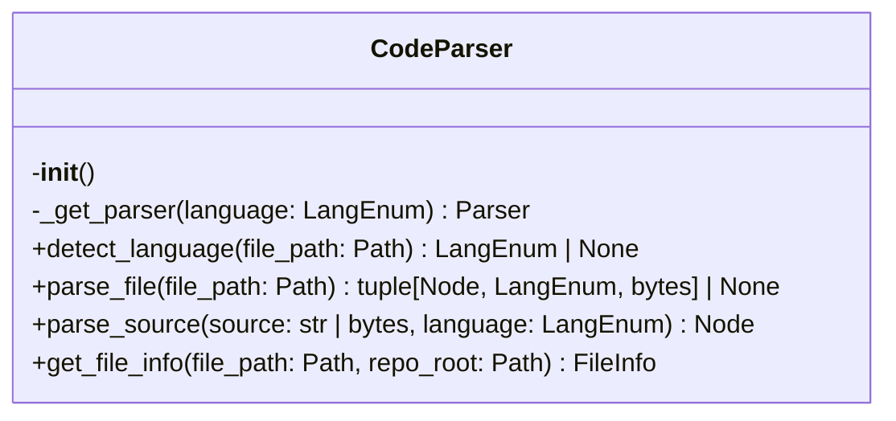

# Parser Module

## File Overview

The parser module provides source code parsing capabilities using tree-sitter parsers for multiple programming languages. It handles AST generation, language detection, and docstring extraction from various programming languages.

## Classes

### CodeParser

The CodeParser class provides the [main](../export/pdf.md) interface for parsing source code across multiple programming languages using tree-sitter parsers.

**Key Methods:**

- `__init__()` - Initializes the parser with empty parser and language caches
- `_get_parser(language)` - Gets or creates a tree-sitter parser for the specified language
- `detect_language()` - Detects the programming language (implementation not shown in provided code)
- `parse_file()` - Parses a source file (implementation not shown in provided code)
- `parse_source(source, language)` - Parses source code string and returns the AST root node
- `get_file_info()` - Retrieves file information (implementation not shown in provided code)

## Functions

### Core Parsing Functions

#### `parse_source(source, language)`

Parses source code and returns the AST root node.

**Parameters:**
- `source` (str | bytes) - The source code to parse
- `language` (LangEnum) - The programming language

**Returns:**
- `Node` - The AST root node

#### `get_docstring(node, source, language)`

Extracts docstring from a function or class node.

**Parameters:**
- `node` (Node) - The tree-sitter node
- `source` (bytes) - The original source bytes
- `language` (LangEnum) - The programming language

**Returns:**
- `str | None` - The docstring or None if not found

### Docstring Extraction Functions

#### `_get_jsdoc_or_line_comments(node, source)`

Extracts JSDoc (`/** */`) or multi-line `//` comments.

**Parameters:**
- `node` (Node) - The tree-sitter node
- `source` (bytes) - The original source bytes

**Returns:**
- `str | None` - The extracted comment or None

#### `_get_javadoc_or_doxygen(node, source)`

Extracts Javadoc/Doxygen (`/** */`) or `///` comments.

**Parameters:**
- `node` (Node) - The tree-sitter node
- `source` (bytes) - The original source bytes

**Returns:**
- `str | None` - The extracted comment or None

### Utility Functions

The module includes several utility functions for AST manipulation:

- `_read_file_content()` - Reads file content
- `_compute_file_hash()` - Computes file hash
- `get_node_text()` - Extracts text from AST nodes
- `find_nodes_by_type()` - Finds nodes by type
- `walk()` - Walks AST nodes
- `get_node_name()` - Gets node names
- `_collect_preceding_comments()` - Collects preceding comments
- `_strip_line_comment_prefix()` - Strips comment prefixes
- `_get_python_docstring()` - Extracts Python docstrings
- `_get_line_comments()` - Extracts line comments
- `_get_swift_docstring()` - Extracts Swift docstrings
- `_get_block_comment()` - Extracts block comments

## Usage Examples

### Basic Source Parsing

```python
from local_deepwiki.core.parser import CodeParser
from local_deepwiki.core.enums import LangEnum

# Initialize parser
parser = CodeParser()

# Parse Python source code
source_code = """
def hello_world():
    '''This is a docstring'''
    print("Hello, World!")
"""

ast_root = parser.parse_source(source_code, LangEnum.PYTHON)
```

### Docstring Extraction

```python
# Extract docstring from a node
docstring = get_docstring(function_node, source_bytes, LangEnum.PYTHON)
if docstring:
    print(f"Found docstring: {docstring}")
```

## Related Components

This module works with:

- **LangEnum** - Enumeration of supported programming languages
- **Node** - Tree-sitter AST node objects
- **Parser** and **[Language](../models.md)** - Tree-sitter parser components
- Multiple tree-sitter language modules (c, c_sharp, cpp, go, java, javascript, and others)

The module supports multiple programming languages through tree-sitter bindings and provides language-specific docstring extraction capabilities.

## API Reference

### class `CodeParser`

Multi-language code parser using tree-sitter.

**Methods:**

#### `__init__`

```python
def __init__()
```

Initialize the parser with language support.

#### `detect_language`

```python
def detect_language(file_path: Path) -> LangEnum | None
```

Detect the programming language from file extension.


| [Parameter](../generators/api_docs.md) | Type | Default | Description |
|-----------|------|---------|-------------|
| `file_path` | `Path` | - | Path to the source file. |

#### `parse_file`

```python
def parse_file(file_path: Path) -> tuple[Node, LangEnum, bytes] | None
```

Parse a source file and return the AST root.


| [Parameter](../generators/api_docs.md) | Type | Default | Description |
|-----------|------|---------|-------------|
| `file_path` | `Path` | - | Path to the source file. |

#### `parse_source`

```python
def parse_source(source: str | bytes, language: LangEnum) -> Node
```

Parse source code string and return the AST root.


| [Parameter](../generators/api_docs.md) | Type | Default | Description |
|-----------|------|---------|-------------|
| `source` | `str | bytes` | - | The source code. |
| `language` | `LangEnum` | - | The programming language. |

#### `get_file_info`

```python
def get_file_info(file_path: Path, repo_root: Path) -> FileInfo
```

Get information about a source file.  Uses chunked reading for large files to avoid loading the entire file into memory just for hash computation.


| [Parameter](../generators/api_docs.md) | Type | Default | Description |
|-----------|------|---------|-------------|
| `file_path` | `Path` | - | Absolute path to the file. |
| `repo_root` | `Path` | - | Root directory of the repository. |


---

### Functions

#### `get_node_text`

```python
def get_node_text(node: Node, source: bytes) -> str
```

Extract text content from a tree-sitter node.


| [Parameter](../generators/api_docs.md) | Type | Default | Description |
|-----------|------|---------|-------------|
| `node` | `Node` | - | The tree-sitter node. |
| `source` | `bytes` | - | The original source bytes. |

**Returns:** `str`


#### `find_nodes_by_type`

```python
def find_nodes_by_type(root: Node, node_types: set[str]) -> list[Node]
```

Find all nodes of specified types in the AST.


| [Parameter](../generators/api_docs.md) | Type | Default | Description |
|-----------|------|---------|-------------|
| `root` | `Node` | - | The root node to search from. |
| `node_types` | `set[str]` | - | Set of node type names to [find](../generators/manifest.md). |

**Returns:** `list[Node]`


#### `walk`

```python
def walk(node: Node)
```


| [Parameter](../generators/api_docs.md) | Type | Default | Description |
|-----------|------|---------|-------------|
| `node` | `Node` | - | - |


#### `get_node_name`

```python
def get_node_name(node: Node, source: bytes, language: LangEnum) -> str | None
```

Extract the name from a function/class/method node.


| [Parameter](../generators/api_docs.md) | Type | Default | Description |
|-----------|------|---------|-------------|
| `node` | `Node` | - | The tree-sitter node. |
| `source` | `bytes` | - | The original source bytes. |
| `language` | `LangEnum` | - | The programming language. |

**Returns:** `str | None`


#### `get_docstring`

```python
def get_docstring(node: Node, source: bytes, language: LangEnum) -> str | None
```

Extract docstring from a function/class node.


| [Parameter](../generators/api_docs.md) | Type | Default | Description |
|-----------|------|---------|-------------|
| `node` | `Node` | - | The tree-sitter node. |
| `source` | `bytes` | - | The original source bytes. |
| `language` | `LangEnum` | - | The programming language. |

**Returns:** `str | None`


## Class Diagram



## Call Graph

```mermaid
flowchart TD
    N0[CodeParser._get_parser]
    N1[CodeParser.get_file_info]
    N2[CodeParser.parse_file]
    N3[CodeParser.parse_source]
    N4[_collect_preceding_comments]
    N5[_compute_file_hash]
    N6[_get_javadoc_or_doxygen]
    N7[_get_jsdoc_or_line_comments]
    N8[_get_line_comments]
    N9[_get_parser]
    N10[_get_python_docstring]
    N11[_get_swift_docstring]
    N12[_read_file_content]
    N13[_strip_line_comment_prefix]
    N14[bytes]
    N15[child_by_field_name]
    N16[decode]
    N17[detect_language]
    N18[fileno]
    N19[find_nodes_by_type]
    N20[get_node_name]
    N21[get_node_text]
    N22[hexdigest]
    N23[mmap]
    N24[parse]
    N25[read]
    N26[read_bytes]
    N27[sha256]
    N28[stat]
    N29[walk]
    N12 --> N28
    N12 --> N26
    N12 --> N23
    N12 --> N18
    N12 --> N14
    N5 --> N28
    N5 --> N22
    N5 --> N27
    N5 --> N26
    N5 --> N25
    N21 --> N16
    N19 --> N29
    N29 --> N29
    N20 --> N21
    N20 --> N15
    N4 --> N21
    N10 --> N15
    N10 --> N21
    N7 --> N21
    N7 --> N4
    N7 --> N13
    N8 --> N4
    N8 --> N13
    N6 --> N21
    N6 --> N4
    N6 --> N13
    N11 --> N4
    N11 --> N13
    N11 --> N21
    N2 --> N17
    N2 --> N12
    N2 --> N9
    N2 --> N24
    N3 --> N9
    N3 --> N24
    N1 --> N28
    N1 --> N17
    N1 --> N5
    classDef func fill:#e1f5fe
    class N4,N5,N6,N7,N8,N9,N10,N11,N12,N13,N14,N15,N16,N17,N18,N19,N20,N21,N22,N23,N24,N25,N26,N27,N28,N29 func
    classDef method fill:#fff3e0
    class N0,N1,N2,N3 method
```



## Usage Examples

*Examples extracted from test files*

### Test Python language detection

From `test_parser.py::test_detect_language_python`:

```python
assert self.parser.detect_language(Path("test.py")) == Language.PYTHON
```

### Test Python language detection

From `test_parser.py::test_detect_language_python`:

```python
assert self.parser.detect_language(Path("test.py")) == Language.PYTHON
```

### Test JavaScript language detection

From `test_parser.py::test_detect_language_javascript`:

```python
assert self.parser.detect_language(Path("test.js")) == Language.JAVASCRIPT
```

### Test JavaScript language detection

From `test_parser.py::test_detect_language_javascript`:

```python
assert self.parser.detect_language(Path("test.js")) == Language.JAVASCRIPT
```

### Test parsing a Python file

From `test_parser.py::test_parse_python_file`:

```python
result = self.parser.parse_file(test_file)
assert result is not None
```

## Relevant Source Files

- `src/local_deepwiki/core/parser.py:139-252`

## See Also

- [callgraph](../generators/callgraph.md) - uses this
- [test_examples](../generators/test_examples.md) - uses this
- [api_docs](../generators/api_docs.md) - uses this
- [chunker](chunker.md) - uses this
