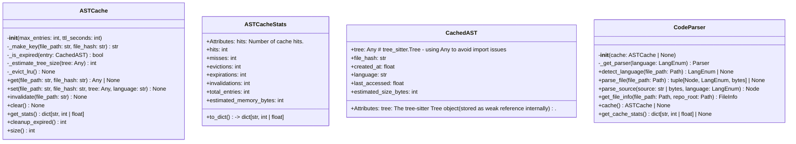

# File Overview

This file, `src/local_deepwiki/core/parser.py`, provides functionality for parsing source code files using the Tree-sitter library and caching the resulting Abstract Syntax Trees (ASTs). It includes utilities for reading files, computing file hashes, extracting node text, and managing an in-memory cache of parsed ASTs with support for time-to-live (TTL) and least-recently-used (LRU) eviction policies.

The module imports Tree-sitter language parsers for various programming languages, and uses `threading.RLock` for thread safety in cache operations. It also integrates with `local_deepwiki.logging` for logging purposes.

---

# Classes

## CachedAST

A cached AST entry with metadata for validation and eviction.

### Attributes

- `tree`: The tree-sitter Tree object (stored as weak reference internally).
- `file_hash`: SHA256 hash of the file content when parsed.
- `created_at`: Unix timestamp when the entry was created.
- `language`: The programming language of the parsed file.
- `last_accessed`: Unix timestamp of last access (for LRU eviction).
- `estimated_size_bytes`: Estimated memory size of the tree.

## ASTCacheStats

Statistics for AST cache operations.

### Attributes

- `hits`: Number of cache hits.
- `misses`: Number of cache misses.
- `evictions`: Number of entries evicted due to max size.
- `expirations`: Number of entries expired due to TTL.
- `invalidations`: Number of explicit invalidations.
- `total_entries`: Current number of entries in cache.
- `estimated_memory_bytes`: Estimated total memory usage.

## ASTCache

Manages a cache of parsed Tree-sitter ASTs with TTL and LRU eviction policies.

### Methods

#### `__init__(self, max_entries: int = 1000, ttl_seconds: int = 3600)`

Initialize the AST cache.

**Parameters:**

- `max_entries`: Maximum number of entries before LRU eviction.
- `ttl_seconds`: Time-to-live for cache entries in seconds.

#### `_make_key(self, file_path: str, file_hash: str) -> str`

Create a cache key from file path and hash.

**Parameters:**

- `file_path`: Path to the file.
- `file_hash`: SHA256 hash of file content.

**Returns:**

- Combined cache key string.

#### `_is_expired(self, entry: CachedAST) -> bool`

Check if a cache entry has expired.

**Parameters:**

- `entry`: The cache entry to check.

**Returns:**

- True if the entry has expired, False otherwise.

#### `_estimate_tree_size(self, tree: Any) -> int`

Estimate memory size of a tree-sitter Tree.

**Parameters:**

- `tree`: The tree-sitter Tree object.

**Returns:**

- Estimated size in bytes.

#### `_evict_lru(self) -> None`

Evict least recently used entries until under max_entries.

**Must be called with lock held.**

#### `get(self, file_path: str, file_hash: str) -> Any | None`

Get a cached AST if valid (hash matches and not expired).

**Parameters:**

- `file_path`: Path to the file (used as part of cache key).
- `file_hash`: SHA256 hash of the file content.

**Returns:**

- The cached tree-sitter Tree if found and valid, None otherwise.

#### `set(self, file_path: str, file_hash: str, tree: Any, language: str) -> None`

Cache a parsed AST.

**Parameters:**

- `file_path`: Path to the file.
- `file_hash`: SHA256 hash of the file content.
- `tree`: The tree-sitter Tree object to cache.
- `language`: The programming language of the file.

#### `invalidate(self, file_path: str) -> None`

Remove all entries for a specific file from cache.

**Parameters:**

- `file_path`: Path to the file to invalidate.

#### `clear(self) -> None`

Clear all cached ASTs.

#### `get_stats(self) -> dict[str, int | float]`

Return cache statistics.

**Returns:**

- Dictionary with cache statistics including hits, misses, hit rate, evictions, expirations, invalidations, total entries, and estimated memory usage.

---

# Functions

## `_read_file_content(file_path: str) -> str`

Reads the content of a file and returns it as a string.

**Parameters:**

- `file_path`: Path to the file to read.

**Returns:**

- File content as a string.

## `_compute_file_hash(file_path: str) -> str`

Computes the SHA256 hash of a file's content.

**Parameters:**

- `file_path`: Path to the file.

**Returns:**

- SHA256 hash of the file content as a hexadecimal string.

## `get_node_text(node: Node, source: str) -> str`

Extracts the text content of a Tree-sitter node from the source code.

**Parameters:**

- `node`: The Tree-sitter node.
- `source`: The source code string.

**Returns:**

- Text content of the node.

## `find_nodes_by_type(node: Node, node_type: str) -> list[Node]`

Finds all nodes of a given type within a Tree-sitter tree.

**Parameters:**

- `node`: The Tree-sitter node to search from.
- `node_type`: The type of node to [find](../generators/manifest.md).

**Returns:**

- List of matching Tree-sitter nodes.

## `walk(node: Node) -> list[Node]`

Traverses all nodes in a Tree-sitter tree in a depth-first manner.

**Parameters:**

- `node`: The Tree-sitter node to start traversal from.

**Returns:**

- List of all nodes in the tree.

## `get_node_name(node: Node) -> str`

Extracts the name of a node (e.g., function name, class name).

**Parameters:**

- `node`: The Tree-sitter node.

**Returns:**

- Name of the node.

## `_collect_preceding_comments(node: Node, source: str) -> list[str]`

Collects comments that precede a Tree-sitter node.

**Parameters:**

- `node`: The Tree-sitter node.
- `source`: The source code string.

**Returns:**

- List of comment strings.

## `_strip_line_comment_prefix(comment: str) -> str`

Strips the prefix from a line comment.

**Parameters:**

- `comment`: The comment string.

**Returns:**

- Comment string with prefix stripped.

## `_get_python_docstring(node: Node, source: str) -> str`

Extracts the docstring from a Python node.

**Parameters:**

- `node`: The Tree-sitter node.
- `source`: The source code string.

**Returns:**

- Docstring content as a string.

## `_get_jsdoc_or_line_comments(node: Node, source: str) -> str`

Extracts JSDoc or line comments from a JavaScript/TypeScript node.

**Parameters:**

- `node`: The Tree-sitter node.
- `source`: The source code string.

**Returns:**

- Comment content as a string.

## `_get_docstring(node: Node, source: str) -> str`

Extracts a docstring from a node, supporting multiple languages.

**Parameters:**

- `node`: The Tree-sitter node.
- `source`: The source code string.

**Returns:**

- Docstring content as a string.

---

# Integration

This file integrates with the `local_deepwiki` codebase by providing core parsing and caching capabilities for source code. It depends on Tree-sitter language parsers for various programming languages, and is called by other modules that need to parse or analyze source code, such as [`WikiGenerator`](../generators/wiki.md) or components that extract documentation.

The file's cache system (`ASTCache`) is designed to improve performance by avoiding re-parsing the same files, especially when processing multiple files or when the same file is accessed repeatedly.

---

# Usage Examples

### Using `ASTCache`

```python
from local_deepwiki.core.parser import ASTCache

# Initialize cache
cache = ASTCache(max_entries=1000, ttl_seconds=3600)

# Add an AST to the cache
cache.set("path/to/file.py", "hash123", tree, "python")

# Retrieve an AST from the cache
cached_tree = cache.get("path/to/file.py", "hash123")

# Get cache statistics
stats = cache.get_stats()
```

### Reading File Content and Computing Hash

```python
from local_deepwiki.core.parser import _read_file_content, _compute_file_hash

content = _read_file_content("example.py")
file_hash = _compute_file_hash("example.py")
```

### Extracting Node Text

```python
from local_deepwiki.core.parser import get_node_text

text = get_node_text(node, source)
```

### Finding Nodes by Type

```python
from local_deepwiki.core.parser import find_nodes_by_type

nodes = find_nodes_by_type(root_node, "function_definition")
```

## API Reference

### class `CachedAST`

A cached AST entry with metadata for validation and eviction.  Attributes: tree: The tree-sitter Tree object (stored as weak reference internally). file_hash: SHA256 hash of the file content when parsed. created_at: Unix timestamp when the entry was created. language: The programming language of the parsed file. last_accessed: Unix timestamp of last access (for LRU eviction). estimated_size_bytes: Estimated memory size of the tree.


<details>
<summary>View Source (lines 42-59) | <a href="https://github.com/UrbanDiver/local-deepwiki-mcp/blob/[main](../export/pdf.md)/src/local_deepwiki/core/parser.py#L42-L59">GitHub</a></summary>

```python
class CachedAST:
    """A cached AST entry with metadata for validation and eviction.

    Attributes:
        tree: The tree-sitter Tree object (stored as weak reference internally).
        file_hash: SHA256 hash of the file content when parsed.
        created_at: Unix timestamp when the entry was created.
        language: The programming language of the parsed file.
        last_accessed: Unix timestamp of last access (for LRU eviction).
        estimated_size_bytes: Estimated memory size of the tree.
    """

    tree: Any  # tree_sitter.Tree - using Any to avoid import issues
    file_hash: str
    created_at: float
    language: str
    last_accessed: float = field(default_factory=time.time)
    estimated_size_bytes: int = 0
```

</details>

### class `ASTCacheStats`

Statistics for AST cache operations.  Attributes: hits: Number of cache hits. misses: Number of cache misses. evictions: Number of entries evicted due to max size. expirations: Number of entries expired due to TTL. invalidations: Number of explicit invalidations. total_entries: Current number of entries in cache. estimated_memory_bytes: Estimated total memory usage.

**Methods:**


<details>
<summary>View Source (lines 63-101) | <a href="https://github.com/UrbanDiver/local-deepwiki-mcp/blob/[main](../export/pdf.md)/src/local_deepwiki/core/parser.py#L63-L101">GitHub</a></summary>

```python
class ASTCacheStats:
    """Statistics for AST cache operations.

    Attributes:
        hits: Number of cache hits.
        misses: Number of cache misses.
        evictions: Number of entries evicted due to max size.
        expirations: Number of entries expired due to TTL.
        invalidations: Number of explicit invalidations.
        total_entries: Current number of entries in cache.
        estimated_memory_bytes: Estimated total memory usage.
    """

    hits: int = 0
    misses: int = 0
    evictions: int = 0
    expirations: int = 0
    invalidations: int = 0
    total_entries: int = 0
    estimated_memory_bytes: int = 0

    def to_dict(self) -> dict[str, int | float]:
        """Convert stats to a dictionary.

        Returns:
            Dictionary with all statistics.
        """
        total_requests = self.hits + self.misses
        hit_rate = self.hits / total_requests if total_requests > 0 else 0.0
        return {
            "hits": self.hits,
            "misses": self.misses,
            "hit_rate": hit_rate,
            "evictions": self.evictions,
            "expirations": self.expirations,
            "invalidations": self.invalidations,
            "total_entries": self.total_entries,
            "estimated_memory_bytes": self.estimated_memory_bytes,
        }
```

</details>

#### `to_dict`

```python
def to_dict() -> dict[str, int | float]
```

Convert stats to a dictionary.


<details>
<summary>View Source (lines 63-101) | <a href="https://github.com/UrbanDiver/local-deepwiki-mcp/blob/[main](../export/pdf.md)/src/local_deepwiki/core/parser.py#L63-L101">GitHub</a></summary>

```python
class ASTCacheStats:
    """Statistics for AST cache operations.

    Attributes:
        hits: Number of cache hits.
        misses: Number of cache misses.
        evictions: Number of entries evicted due to max size.
        expirations: Number of entries expired due to TTL.
        invalidations: Number of explicit invalidations.
        total_entries: Current number of entries in cache.
        estimated_memory_bytes: Estimated total memory usage.
    """

    hits: int = 0
    misses: int = 0
    evictions: int = 0
    expirations: int = 0
    invalidations: int = 0
    total_entries: int = 0
    estimated_memory_bytes: int = 0

    def to_dict(self) -> dict[str, int | float]:
        """Convert stats to a dictionary.

        Returns:
            Dictionary with all statistics.
        """
        total_requests = self.hits + self.misses
        hit_rate = self.hits / total_requests if total_requests > 0 else 0.0
        return {
            "hits": self.hits,
            "misses": self.misses,
            "hit_rate": hit_rate,
            "evictions": self.evictions,
            "expirations": self.expirations,
            "invalidations": self.invalidations,
            "total_entries": self.total_entries,
            "estimated_memory_bytes": self.estimated_memory_bytes,
        }
```

</details>

### class `ASTCache`

Thread-safe LRU cache for parsed ASTs with TTL support.  Caches tree-sitter ASTs to avoid re-parsing unchanged files during incremental indexing. Uses file path + content hash as the cache key to ensure cache validity.  Features: - TTL-based expiration - LRU eviction when max_entries is exceeded - Memory usage estimation - Thread-safe operations - Cache statistics tracking

**Methods:**


<details>
<summary>View Source (lines 104-351) | <a href="https://github.com/UrbanDiver/local-deepwiki-mcp/blob/[main](../export/pdf.md)/src/local_deepwiki/core/parser.py#L104-L351">GitHub</a></summary>

```python
class ASTCache:
    # Methods: __init__, _make_key, _is_expired, _estimate_tree_size, _evict_lru, get, set, invalidate, clear, get_stats, cleanup_expired, size
```

</details>

#### `__init__`

```python
def __init__(max_entries: int = 1000, ttl_seconds: int = 3600)
```

Initialize the AST cache.


| [Parameter](../generators/api_docs.md) | Type | Default | Description |
|-----------|------|---------|-------------|
| `max_entries` | `int` | `1000` | Maximum number of entries before LRU eviction. |
| `ttl_seconds` | `int` | `3600` | Time-to-live for cache entries in seconds. |


<details>
<summary>View Source (lines 133-144) | <a href="https://github.com/UrbanDiver/local-deepwiki-mcp/blob/[main](../export/pdf.md)/src/local_deepwiki/core/parser.py#L133-L144">GitHub</a></summary>

```python
def __init__(self, max_entries: int = 1000, ttl_seconds: int = 3600):
        """Initialize the AST cache.

        Args:
            max_entries: Maximum number of entries before LRU eviction.
            ttl_seconds: Time-to-live for cache entries in seconds.
        """
        self._max_entries = max_entries
        self._ttl_seconds = ttl_seconds
        self._cache: dict[str, CachedAST] = {}
        self._lock = threading.RLock()
        self._stats = ASTCacheStats()
```

</details>

#### `get`

```python
def get(file_path: str, file_hash: str) -> Any | None
```

Get a cached AST if valid (hash matches and not expired).


| [Parameter](../generators/api_docs.md) | Type | Default | Description |
|-----------|------|---------|-------------|
| `file_path` | `str` | - | Path to the file (used as part of cache key). |
| `file_hash` | `str` | - | SHA256 hash of the file content. |


<details>
<summary>View Source (lines 223-253) | <a href="https://github.com/UrbanDiver/local-deepwiki-mcp/blob/[main](../export/pdf.md)/src/local_deepwiki/core/parser.py#L223-L253">GitHub</a></summary>

```python
def get(self, file_path: str, file_hash: str) -> Any | None:
        """Get a cached AST if valid (hash matches and not expired).

        Args:
            file_path: Path to the file (used as part of cache key).
            file_hash: SHA256 hash of the file content.

        Returns:
            The cached tree-sitter Tree if found and valid, None otherwise.
        """
        key = self._make_key(file_path, file_hash)

        with self._lock:
            entry = self._cache.get(key)

            if entry is None:
                self._stats.misses += 1
                return None

            # Check expiration
            if self._is_expired(entry):
                self._cache.pop(key, None)
                self._stats.expirations += 1
                self._stats.misses += 1
                self._stats.estimated_memory_bytes -= entry.estimated_size_bytes
                return None

            # Update access time for LRU
            entry.last_accessed = time.time()
            self._stats.hits += 1
            return entry.tree
```

</details>

#### `set`

```python
def set(file_path: str, file_hash: str, tree: Any, language: str) -> None
```

Cache a parsed AST.


| [Parameter](../generators/api_docs.md) | Type | Default | Description |
|-----------|------|---------|-------------|
| `file_path` | `str` | - | Path to the file. |
| `file_hash` | `str` | - | SHA256 hash of the file content. |
| `tree` | `Any` | - | The tree-sitter Tree object to cache. |
| `language` | `str` | - | The programming language of the file. |


<details>
<summary>View Source (lines 255-290) | <a href="https://github.com/UrbanDiver/local-deepwiki-mcp/blob/[main](../export/pdf.md)/src/local_deepwiki/core/parser.py#L255-L290">GitHub</a></summary>

```python
def set(
        self, file_path: str, file_hash: str, tree: Any, language: str
    ) -> None:
        """Cache a parsed AST.

        Args:
            file_path: Path to the file.
            file_hash: SHA256 hash of the file content.
            tree: The tree-sitter Tree object to cache.
            language: The programming language of the file.
        """
        key = self._make_key(file_path, file_hash)
        estimated_size = self._estimate_tree_size(tree)
        current_time = time.time()

        entry = CachedAST(
            tree=tree,
            file_hash=file_hash,
            created_at=current_time,
            language=language,
            last_accessed=current_time,
            estimated_size_bytes=estimated_size,
        )

        with self._lock:
            # Check if we need to evict before adding
            if key not in self._cache:
                self._evict_lru()

            # If updating existing entry, subtract old size
            old_entry = self._cache.get(key)
            if old_entry:
                self._stats.estimated_memory_bytes -= old_entry.estimated_size_bytes

            self._cache[key] = entry
            self._stats.estimated_memory_bytes += estimated_size
```

</details>

#### `invalidate`

```python
def invalidate(file_path: str) -> None
```

Remove all entries for a specific file from cache.  This removes entries regardless of their hash, useful when a file is known to have been modified.


| [Parameter](../generators/api_docs.md) | Type | Default | Description |
|-----------|------|---------|-------------|
| `file_path` | `str` | - | Path to the file to invalidate. |


<details>
<summary>View Source (lines 292-310) | <a href="https://github.com/UrbanDiver/local-deepwiki-mcp/blob/[main](../export/pdf.md)/src/local_deepwiki/core/parser.py#L292-L310">GitHub</a></summary>

```python
def invalidate(self, file_path: str) -> None:
        """Remove all entries for a specific file from cache.

        This removes entries regardless of their hash, useful when a file
        is known to have been modified.

        Args:
            file_path: Path to the file to invalidate.
        """
        with self._lock:
            # Find all keys that start with this file path
            keys_to_remove = [
                k for k in self._cache.keys() if k.startswith(f"{file_path}:")
            ]
            for key in keys_to_remove:
                entry = self._cache.pop(key, None)
                if entry:
                    self._stats.invalidations += 1
                    self._stats.estimated_memory_bytes -= entry.estimated_size_bytes
```

</details>

#### `clear`

```python
def clear() -> None
```

Clear all cached ASTs.


<details>
<summary>View Source (lines 312-316) | <a href="https://github.com/UrbanDiver/local-deepwiki-mcp/blob/[main](../export/pdf.md)/src/local_deepwiki/core/parser.py#L312-L316">GitHub</a></summary>

```python
def clear(self) -> None:
        """Clear all cached ASTs."""
        with self._lock:
            self._cache.clear()
            self._stats.estimated_memory_bytes = 0
```

</details>

#### `get_stats`

```python
def get_stats() -> dict[str, int | float]
```

Return cache statistics.


<details>
<summary>View Source (lines 318-328) | <a href="https://github.com/UrbanDiver/local-deepwiki-mcp/blob/[main](../export/pdf.md)/src/local_deepwiki/core/parser.py#L318-L328">GitHub</a></summary>

```python
def get_stats(self) -> dict[str, int | float]:
        """Return cache statistics.

        Returns:
            Dictionary with cache statistics including hits, misses,
            hit rate, evictions, expirations, invalidations, total entries,
            and estimated memory usage.
        """
        with self._lock:
            self._stats.total_entries = len(self._cache)
            return self._stats.to_dict()
```

</details>

#### `cleanup_expired`

```python
def cleanup_expired() -> int
```

Remove all expired entries from the cache.


<details>
<summary>View Source (lines 330-345) | <a href="https://github.com/UrbanDiver/local-deepwiki-mcp/blob/[main](../export/pdf.md)/src/local_deepwiki/core/parser.py#L330-L345">GitHub</a></summary>

```python
def cleanup_expired(self) -> int:
        """Remove all expired entries from the cache.

        Returns:
            Number of entries removed.
        """
        with self._lock:
            expired_keys = [
                k for k, v in self._cache.items() if self._is_expired(v)
            ]
            for key in expired_keys:
                entry = self._cache.pop(key, None)
                if entry:
                    self._stats.expirations += 1
                    self._stats.estimated_memory_bytes -= entry.estimated_size_bytes
            return len(expired_keys)
```

</details>

#### `size`

```python
def size() -> int
```

Return current number of entries in cache.


<details>
<summary>View Source (lines 348-351) | <a href="https://github.com/UrbanDiver/local-deepwiki-mcp/blob/[main](../export/pdf.md)/src/local_deepwiki/core/parser.py#L348-L351">GitHub</a></summary>

```python
def size(self) -> int:
        """Return current number of entries in cache."""
        with self._lock:
            return len(self._cache)
```

</details>

### class `CodeParser`

Multi-language code parser using tree-sitter.  Supports optional AST caching to speed up incremental indexing by avoiding re-parsing of unchanged files.

**Methods:**


<details>
<summary>View Source (lines 457-634) | <a href="https://github.com/UrbanDiver/local-deepwiki-mcp/blob/[main](../export/pdf.md)/src/local_deepwiki/core/parser.py#L457-L634">GitHub</a></summary>

```python
class CodeParser:
    # Methods: __init__, _get_parser, detect_language, parse_file, parse_source, get_file_info, cache, get_cache_stats
```

</details>

#### `__init__`

```python
def __init__(cache: ASTCache | None = None)
```

Initialize the parser with language support.


| [Parameter](../generators/api_docs.md) | Type | Default | Description |
|-----------|------|---------|-------------|
| `cache` | `ASTCache | None` | `None` | Optional ASTCache instance for caching parsed ASTs. |


<details>
<summary>View Source (lines 480-488) | <a href="https://github.com/UrbanDiver/local-deepwiki-mcp/blob/[main](../export/pdf.md)/src/local_deepwiki/core/parser.py#L480-L488">GitHub</a></summary>

```python
def __init__(self, cache: ASTCache | None = None):
        """Initialize the parser with language support.

        Args:
            cache: Optional ASTCache instance for caching parsed ASTs.
        """
        self._parsers: dict[LangEnum, Parser] = {}
        self._languages: dict[LangEnum, Language] = {}
        self._cache = cache
```

</details>

#### `detect_language`

```python
def detect_language(file_path: Path) -> LangEnum | None
```

Detect the programming language from file extension.


| [Parameter](../generators/api_docs.md) | Type | Default | Description |
|-----------|------|---------|-------------|
| `file_path` | `Path` | - | Path to the source file. |


<details>
<summary>View Source (lines 520-530) | <a href="https://github.com/UrbanDiver/local-deepwiki-mcp/blob/[main](../export/pdf.md)/src/local_deepwiki/core/parser.py#L520-L530">GitHub</a></summary>

```python
def detect_language(self, file_path: Path) -> LangEnum | None:
        """Detect the programming language from file extension.

        Args:
            file_path: Path to the source file.

        Returns:
            The detected Language enum or None if not supported.
        """
        suffix = file_path.suffix.lower()
        return EXTENSION_MAP.get(suffix)
```

</details>

#### `parse_file`

```python
def parse_file(file_path: Path) -> tuple[Node, LangEnum, bytes] | None
```

Parse a source file and return the AST root.  If a cache is configured, checks the cache before parsing and stores the result after parsing.


| [Parameter](../generators/api_docs.md) | Type | Default | Description |
|-----------|------|---------|-------------|
| `file_path` | `Path` | - | Path to the source file. |


<details>
<summary>View Source (lines 532-575) | <a href="https://github.com/UrbanDiver/local-deepwiki-mcp/blob/[main](../export/pdf.md)/src/local_deepwiki/core/parser.py#L532-L575">GitHub</a></summary>

```python
def parse_file(self, file_path: Path) -> tuple[Node, LangEnum, bytes] | None:
        """Parse a source file and return the AST root.

        If a cache is configured, checks the cache before parsing and
        stores the result after parsing.

        Args:
            file_path: Path to the source file.

        Returns:
            Tuple of (AST root node, language, source bytes) or None if not supported.
        """
        language = self.detect_language(file_path)
        if language is None:
            logger.debug(f"Unsupported file type: {file_path}")
            return None

        try:
            source = _read_file_content(file_path)
        except (OSError, IOError) as e:
            logger.warning(f"Failed to read file {file_path}: {e}")
            return None

        # Compute file hash for cache lookup
        file_hash = hashlib.sha256(source).hexdigest()
        file_path_str = str(file_path)

        # Check cache if available
        if self._cache is not None:
            cached_tree = self._cache.get(file_path_str, file_hash)
            if cached_tree is not None:
                logger.debug(f"Cache hit for {file_path.name}")
                return cached_tree.root_node, language, source

        # Parse the file
        logger.debug(f"Parsing {file_path.name} as {language.value}")
        parser = self._get_parser(language)
        tree = parser.parse(source)

        # Store in cache if available
        if self._cache is not None:
            self._cache.set(file_path_str, file_hash, tree, language.value)

        return tree.root_node, language, source
```

</details>

#### `parse_source`

```python
def parse_source(source: str | bytes, language: LangEnum) -> Node
```

Parse source code string and return the AST root.


| [Parameter](../generators/api_docs.md) | Type | Default | Description |
|-----------|------|---------|-------------|
| `source` | `str | bytes` | - | The source code. |
| `language` | `LangEnum` | - | The programming language. |


<details>
<summary>View Source (lines 577-592) | <a href="https://github.com/UrbanDiver/local-deepwiki-mcp/blob/[main](../export/pdf.md)/src/local_deepwiki/core/parser.py#L577-L592">GitHub</a></summary>

```python
def parse_source(self, source: str | bytes, language: LangEnum) -> Node:
        """Parse source code string and return the AST root.

        Args:
            source: The source code.
            language: The programming language.

        Returns:
            The AST root node.
        """
        if isinstance(source, str):
            source = source.encode("utf-8")

        parser = self._get_parser(language)
        tree = parser.parse(source)
        return tree.root_node
```

</details>

#### `get_file_info`

```python
def get_file_info(file_path: Path, repo_root: Path) -> FileInfo
```

Get information about a source file.  Uses chunked reading for large files to avoid loading the entire file into memory just for hash computation.


| [Parameter](../generators/api_docs.md) | Type | Default | Description |
|-----------|------|---------|-------------|
| `file_path` | `Path` | - | Absolute path to the file. |
| `repo_root` | `Path` | - | Root directory of the repository. |


<details>
<summary>View Source (lines 594-615) | <a href="https://github.com/UrbanDiver/local-deepwiki-mcp/blob/[main](../export/pdf.md)/src/local_deepwiki/core/parser.py#L594-L615">GitHub</a></summary>

```python
def get_file_info(self, file_path: Path, repo_root: Path) -> FileInfo:
        """Get information about a source file.

        Uses chunked reading for large files to avoid loading
        the entire file into memory just for hash computation.

        Args:
            file_path: Absolute path to the file.
            repo_root: Root directory of the repository.

        Returns:
            FileInfo with file metadata.
        """
        stat = file_path.stat()

        return FileInfo(
            path=str(file_path.relative_to(repo_root)),
            language=self.detect_language(file_path),
            size_bytes=stat.st_size,
            last_modified=stat.st_mtime,
            hash=_compute_file_hash(file_path),
        )
```

</details>

#### `cache`

```python
def cache() -> ASTCache | None
```

Get the AST cache instance if configured.


<details>
<summary>View Source (lines 618-624) | <a href="https://github.com/UrbanDiver/local-deepwiki-mcp/blob/[main](../export/pdf.md)/src/local_deepwiki/core/parser.py#L618-L624">GitHub</a></summary>

```python
def cache(self) -> ASTCache | None:
        """Get the AST cache instance if configured.

        Returns:
            The ASTCache instance or None if caching is not enabled.
        """
        return self._cache
```

</details>

#### `get_cache_stats`

```python
def get_cache_stats() -> dict[str, int | float] | None
```

Get cache statistics if caching is enabled.


---


<details>
<summary>View Source (lines 626-634) | <a href="https://github.com/UrbanDiver/local-deepwiki-mcp/blob/[main](../export/pdf.md)/src/local_deepwiki/core/parser.py#L626-L634">GitHub</a></summary>

```python
def get_cache_stats(self) -> dict[str, int | float] | None:
        """Get cache statistics if caching is enabled.

        Returns:
            Dictionary with cache statistics or None if caching is disabled.
        """
        if self._cache is None:
            return None
        return self._cache.get_stats()
```

</details>

### Functions

#### `get_node_text`

```python
def get_node_text(node: Node, source: bytes) -> str
```

Extract text content from a tree-sitter node.


| [Parameter](../generators/api_docs.md) | Type | Default | Description |
|-----------|------|---------|-------------|
| `node` | `Node` | - | The tree-sitter node. |
| `source` | `bytes` | - | The original source bytes. |

**Returns:** `str`


<details>
<summary>View Source (lines 637-647) | <a href="https://github.com/UrbanDiver/local-deepwiki-mcp/blob/[main](../export/pdf.md)/src/local_deepwiki/core/parser.py#L637-L647">GitHub</a></summary>

```python
def get_node_text(node: Node, source: bytes) -> str:
    """Extract text content from a tree-sitter node.

    Args:
        node: The tree-sitter node.
        source: The original source bytes.

    Returns:
        The text content of the node.
    """
    return source[node.start_byte : node.end_byte].decode("utf-8", errors="replace")
```

</details>

#### `find_nodes_by_type`

```python
def find_nodes_by_type(root: Node, node_types: set[str]) -> list[Node]
```

Find all nodes of specified types in the AST.


| [Parameter](../generators/api_docs.md) | Type | Default | Description |
|-----------|------|---------|-------------|
| `root` | `Node` | - | The root node to search from. |
| `node_types` | `set[str]` | - | Set of node type names to [find](../generators/manifest.md). |

**Returns:** `list[Node]`


<details>
<summary>View Source (lines 650-669) | <a href="https://github.com/UrbanDiver/local-deepwiki-mcp/blob/[main](../export/pdf.md)/src/local_deepwiki/core/parser.py#L650-L669">GitHub</a></summary>

```python
def find_nodes_by_type(root: Node, node_types: set[str]) -> list[Node]:
    """Find all nodes of specified types in the AST.

    Args:
        root: The root node to search from.
        node_types: Set of node type names to find.

    Returns:
        List of matching nodes.
    """
    results = []

    def walk(node: Node):
        if node.type in node_types:
            results.append(node)
        for child in node.children:
            walk(child)

    walk(root)
    return results
```

</details>

#### `walk`

```python
def walk(node: Node)
```


| [Parameter](../generators/api_docs.md) | Type | Default | Description |
|-----------|------|---------|-------------|
| `node` | `Node` | - | - |


<details>
<summary>View Source (lines 662-666) | <a href="https://github.com/UrbanDiver/local-deepwiki-mcp/blob/[main](../export/pdf.md)/src/local_deepwiki/core/parser.py#L662-L666">GitHub</a></summary>

```python
def walk(node: Node):
        if node.type in node_types:
            results.append(node)
        for child in node.children:
            walk(child)
```

</details>

#### `get_node_name`

```python
def get_node_name(node: Node, source: bytes, language: LangEnum) -> str | None
```

Extract the name from a function/class/method node.


| [Parameter](../generators/api_docs.md) | Type | Default | Description |
|-----------|------|---------|-------------|
| `node` | `Node` | - | The tree-sitter node. |
| `source` | `bytes` | - | The original source bytes. |
| `language` | `LangEnum` | - | The programming language. |

**Returns:** `str | None`


<details>
<summary>View Source (lines 672-701) | <a href="https://github.com/UrbanDiver/local-deepwiki-mcp/blob/[main](../export/pdf.md)/src/local_deepwiki/core/parser.py#L672-L701">GitHub</a></summary>

```python
def get_node_name(node: Node, source: bytes, language: LangEnum) -> str | None:
    """Extract the name from a function/class/method node.

    Args:
        node: The tree-sitter node.
        source: The original source bytes.
        language: The programming language.

    Returns:
        The name or None if not found.
    """
    # Different languages have different structures
    name_field_types = {
        "name",
        "identifier",
    }

    for child in node.children:
        if child.type in name_field_types:
            return get_node_text(child, source)
        # Check named children
        if child.type == "identifier":
            return get_node_text(child, source)

    # Try field access
    name_node = node.child_by_field_name("name")
    if name_node:
        return get_node_text(name_node, source)

    return None
```

</details>

#### `get_docstring`

```python
def get_docstring(node: Node, source: bytes, language: LangEnum) -> str | None
```

Extract docstring from a function/class node.


| [Parameter](../generators/api_docs.md) | Type | Default | Description |
|-----------|------|---------|-------------|
| `node` | `Node` | - | The tree-sitter node. |
| `source` | `bytes` | - | The original source bytes. |
| `language` | `LangEnum` | - | The programming language. |

**Returns:** `str | None`


<details>
<summary>View Source (lines 857-871) | <a href="https://github.com/UrbanDiver/local-deepwiki-mcp/blob/[main](../export/pdf.md)/src/local_deepwiki/core/parser.py#L857-L871">GitHub</a></summary>

```python
def get_docstring(node: Node, source: bytes, language: LangEnum) -> str | None:
    """Extract docstring from a function/class node.

    Args:
        node: The tree-sitter node.
        source: The original source bytes.
        language: The programming language.

    Returns:
        The docstring or None if not found.
    """
    extractor = _DOCSTRING_EXTRACTORS.get(language)
    if extractor:
        return cast(str | None, extractor(node, source))
    return None
```

</details>

## Class Diagram


```mermaid
classDiagram
    class ASTCache {
        -__init__(max_entries: int, ttl_seconds: int)
        -_make_key(file_path: str, file_hash: str) str
        -_is_expired(entry: CachedAST) bool
        -_estimate_tree_size(tree: Any) int
        -_evict_lru() None
        +get(file_path: str, file_hash: str) Any | None
        +set(file_path: str, file_hash: str, tree: Any, language: str) None
        +invalidate(file_path: str) None
        +clear() None
        +get_stats() dict[str, int | float]
        +cleanup_expired() int
        +size() int
    }
    class ASTCacheStats {
        +Attributes: hits: Number of cache hits.
        +hits: int
        +misses: int
        +evictions: int
        +expirations: int
        +invalidations: int
        +total_entries: int
        +estimated_memory_bytes: int
        +to_dict() -> dict[str, int | float]
    }
    class CachedAST {
        +Attributes: tree: The tree-sitter Tree object (stored as weak reference internally).
        +tree: Any  # tree_sitter.Tree - using Any to avoid import issues
        +file_hash: str
        +created_at: float
        +language: str
        +last_accessed: float
        +estimated_size_bytes: int
    }
    class CodeParser {
        -__init__(cache: ASTCache | None)
        -_get_parser(language: LangEnum) Parser
        +detect_language(file_path: Path) LangEnum | None
        +parse_file(file_path: Path) tuple[Node, LangEnum, bytes] | None
        +parse_source(source: str | bytes, language: LangEnum) Node
        +get_file_info(file_path: Path, repo_root: Path) FileInfo
        +cache() ASTCache | None
        +get_cache_stats() dict[str, int | float] | None
    }
```

## Call Graph


```mermaid
flowchart TD
    N0[ASTCache.__init__]
    N1[ASTCache.get]
    N2[ASTCache.set]
    N3[CodeParser._get_parser]
    N4[CodeParser.get_file_info]
    N5[CodeParser.parse_file]
    N6[CodeParser.parse_source]
    N7[_collect_preceding_comments]
    N8[_compute_file_hash]
    N9[_get_javadoc_or_doxygen]
    N10[_get_jsdoc_or_line_comments]
    N11[_get_line_comments]
    N12[_get_parser]
    N13[_get_python_docstring]
    N14[_get_swift_docstring]
    N15[_is_expired]
    N16[_make_key]
    N17[_read_file_content]
    N18[_strip_line_comment_prefix]
    N19[child_by_field_name]
    N20[detect_language]
    N21[get_docstring]
    N22[get_node_name]
    N23[get_node_text]
    N24[hexdigest]
    N25[read_bytes]
    N26[sha256]
    N27[stat]
    N28[time]
    N29[walk]
    N17 --> N27
    N17 --> N25
    N8 --> N27
    N8 --> N24
    N8 --> N26
    N8 --> N25
    N29 --> N29
    N22 --> N23
    N22 --> N19
    N7 --> N23
    N13 --> N19
    N13 --> N23
    N10 --> N23
    N10 --> N7
    N10 --> N18
    N11 --> N7
    N11 --> N18
    N9 --> N23
    N9 --> N7
    N9 --> N18
    N14 --> N7
    N14 --> N18
    N14 --> N23
    N1 --> N16
    N1 --> N15
    N1 --> N28
    N2 --> N16
    N2 --> N28
    N5 --> N20
    N5 --> N17
    N5 --> N24
    N5 --> N26
    N5 --> N12
    N6 --> N12
    N4 --> N27
    N4 --> N20
    N4 --> N8
    classDef func fill:#e1f5fe
    class N7,N8,N9,N10,N11,N12,N13,N14,N15,N16,N17,N18,N19,N20,N21,N22,N23,N24,N25,N26,N27,N28,N29 func
    classDef method fill:#fff3e0
    class N0,N1,N2,N3,N4,N5,N6 method
```

## Used By

Functions and methods in this file and their callers:

- **`ASTCacheStats`**: called by `ASTCache.__init__`
- **`CachedAST`**: called by `ASTCache.set`
- **[`FileInfo`](../models.md)**: called by `CodeParser.get_file_info`
- **[`Language`](../models.md)**: called by `CodeParser._get_parser`
- **`Parser`**: called by `CodeParser._get_parser`
- **`RLock`**: called by `ASTCache.__init__`
- **`ValueError`**: called by `CodeParser._get_parser`
- **`_collect_preceding_comments`**: called by `_get_javadoc_or_doxygen`, `_get_jsdoc_or_line_comments`, `_get_line_comments`, `_get_swift_docstring`
- **`_compute_file_hash`**: called by `CodeParser.get_file_info`
- **`_estimate_tree_size`**: called by `ASTCache.set`
- **`_evict_lru`**: called by `ASTCache.set`
- **`_get_parser`**: called by `CodeParser.parse_file`, `CodeParser.parse_source`
- **`_is_expired`**: called by `ASTCache.cleanup_expired`, `ASTCache.get`
- **`_make_key`**: called by `ASTCache.get`, `ASTCache.set`
- **`_read_file_content`**: called by `CodeParser.parse_file`
- **`_strip_line_comment_prefix`**: called by `_get_javadoc_or_doxygen`, `_get_jsdoc_or_line_comments`, `_get_line_comments`, `_get_swift_docstring`
- **`bytes`**: called by `_read_file_content`
- **`cast`**: called by `get_docstring`
- **`child_by_field_name`**: called by `_get_python_docstring`, `get_node_name`
- **`decode`**: called by `get_node_text`
- **`detect_language`**: called by `CodeParser.get_file_info`, `CodeParser.parse_file`
- **`encode`**: called by `CodeParser.parse_source`
- **`extractor`**: called by `get_docstring`
- **`fileno`**: called by `_read_file_content`
- **`get_node_text`**: called by `_collect_preceding_comments`, `_get_block_comment`, `_get_javadoc_or_doxygen`, `_get_jsdoc_or_line_comments`, `_get_python_docstring`, `_get_swift_docstring`, `get_node_name`
- **`get_stats`**: called by `CodeParser.get_cache_stats`
- **`getsizeof`**: called by `ASTCache._estimate_tree_size`
- **`hexdigest`**: called by `CodeParser.parse_file`, `_compute_file_hash`
- **`language`**: called by `CodeParser._get_parser`
- **`language_php`**: called by `CodeParser._get_parser`
- **`language_tsx`**: called by `CodeParser._get_parser`
- **`language_typescript`**: called by `CodeParser._get_parser`
- **`mmap`**: called by `_read_file_content`
- **`parse`**: called by `CodeParser.parse_file`, `CodeParser.parse_source`
- **`read`**: called by `_compute_file_hash`
- **`read_bytes`**: called by `_compute_file_hash`, `_read_file_content`
- **`relative_to`**: called by `CodeParser.get_file_info`
- **`sha256`**: called by `CodeParser.parse_file`, `_compute_file_hash`
- **`stat`**: called by `CodeParser.get_file_info`, `_compute_file_hash`, `_read_file_content`
- **`time`**: called by `ASTCache._is_expired`, `ASTCache.get`, `ASTCache.set`
- **`to_dict`**: called by `ASTCache.get_stats`
- **`walk`**: called by `find_nodes_by_type`, `walk`

## Usage Examples

*Examples extracted from test files*

### Test Python language detection

From `test_parser.py::TestCodeParser::test_detect_language_python`:

```python
assert self.parser.detect_language(Path("test.py")) == Language.PYTHON
assert self.parser.detect_language(Path("test.pyi")) == Language.PYTHON
```

### Test Python language detection

From `test_parser.py::TestCodeParser::test_detect_language_python`:

```python
assert self.parser.detect_language(Path("test.py")) == Language.PYTHON
assert self.parser.detect_language(Path("test.pyi")) == Language.PYTHON
```

### Test JavaScript language detection

From `test_parser.py::TestCodeParser::test_detect_language_javascript`:

```python
assert self.parser.detect_language(Path("test.js")) == Language.JAVASCRIPT
assert self.parser.detect_language(Path("test.jsx")) == Language.JAVASCRIPT
assert self.parser.detect_language(Path("test.mjs")) == Language.JAVASCRIPT
```

### Test JavaScript language detection

From `test_parser.py::TestCodeParser::test_detect_language_javascript`:

```python
assert self.parser.detect_language(Path("test.js")) == Language.JAVASCRIPT
assert self.parser.detect_language(Path("test.jsx")) == Language.JAVASCRIPT
assert self.parser.detect_language(Path("test.mjs")) == Language.JAVASCRIPT
```

### Test parsing a Python file

From `test_parser.py::TestCodeParser::test_parse_python_file`:

```python
result = self.parser.parse_file(test_file)
assert result is not None

root, language, source = result
assert language == Language.PYTHON
```


## Last Modified

| Entity | Type | Author | Date | Commit |
|--------|------|--------|------|--------|
| `CachedAST` | class | Brian Breidenbach | 1 week ago | `e899c6c` Add three high-value enhanc... |
| `ASTCacheStats` | class | Brian Breidenbach | 1 week ago | `e899c6c` Add three high-value enhanc... |
| `ASTCache` | class | Brian Breidenbach | 1 week ago | `e899c6c` Add three high-value enhanc... |
| `__init__` | method | Brian Breidenbach | 1 week ago | `e899c6c` Add three high-value enhanc... |
| `_make_key` | method | Brian Breidenbach | 1 week ago | `e899c6c` Add three high-value enhanc... |
| `_is_expired` | method | Brian Breidenbach | 1 week ago | `e899c6c` Add three high-value enhanc... |
| `_estimate_tree_size` | method | Brian Breidenbach | 1 week ago | `e899c6c` Add three high-value enhanc... |
| `_evict_lru` | method | Brian Breidenbach | 1 week ago | `e899c6c` Add three high-value enhanc... |
| `get` | method | Brian Breidenbach | 1 week ago | `e899c6c` Add three high-value enhanc... |
| `set` | method | Brian Breidenbach | 1 week ago | `e899c6c` Add three high-value enhanc... |
| `invalidate` | method | Brian Breidenbach | 1 week ago | `e899c6c` Add three high-value enhanc... |
| `clear` | method | Brian Breidenbach | 1 week ago | `e899c6c` Add three high-value enhanc... |
| `get_stats` | method | Brian Breidenbach | 1 week ago | `e899c6c` Add three high-value enhanc... |
| `cleanup_expired` | method | Brian Breidenbach | 1 week ago | `e899c6c` Add three high-value enhanc... |
| `size` | method | Brian Breidenbach | 1 week ago | `e899c6c` Add three high-value enhanc... |
| `CodeParser` | class | Brian Breidenbach | 1 week ago | `e899c6c` Add three high-value enhanc... |
| `__init__` | method | Brian Breidenbach | 1 week ago | `e899c6c` Add three high-value enhanc... |
| `parse_file` | method | Brian Breidenbach | 1 week ago | `e899c6c` Add three high-value enhanc... |
| `cache` | method | Brian Breidenbach | 1 week ago | `e899c6c` Add three high-value enhanc... |
| `get_cache_stats` | method | Brian Breidenbach | 1 week ago | `e899c6c` Add three high-value enhanc... |
| `_collect_preceding_comments` | function | Brian Breidenbach | 3 weeks ago | `0d91a70` Apply Python best practices... |
| `get_docstring` | function | Brian Breidenbach | 3 weeks ago | `0d91a70` Apply Python best practices... |
| `_get_parser` | method | Brian Breidenbach | 3 weeks ago | `55d665c` Fix TypeScript/TSX parsing ... |
| `_get_python_docstring` | function | Brian Breidenbach | 3 weeks ago | `1ef3ff4` Refactor: Replace nested co... |
| `_get_jsdoc_or_line_comments` | function | Brian Breidenbach | 3 weeks ago | `1ef3ff4` Refactor: Replace nested co... |
| `_get_line_comments` | function | Brian Breidenbach | 3 weeks ago | `1ef3ff4` Refactor: Replace nested co... |
| `_get_javadoc_or_doxygen` | function | Brian Breidenbach | 3 weeks ago | `1ef3ff4` Refactor: Replace nested co... |
| `_get_swift_docstring` | function | Brian Breidenbach | 3 weeks ago | `1ef3ff4` Refactor: Replace nested co... |
| `_get_block_comment` | function | Brian Breidenbach | 3 weeks ago | `1ef3ff4` Refactor: Replace nested co... |
| `get_file_info` | method | Brian Breidenbach | 3 weeks ago | `c568951` Add input validation, type ... |
| `_read_file_content` | function | Brian Breidenbach | 3 weeks ago | `c568951` Add input validation, type ... |
| `_compute_file_hash` | function | Brian Breidenbach | 3 weeks ago | `c568951` Add input validation, type ... |
| `get_node_text` | function | Brian Breidenbach | 3 weeks ago | `c568951` Add input validation, type ... |
| `_strip_line_comment_prefix` | function | Brian Breidenbach | 3 weeks ago | `c568951` Add input validation, type ... |
| `detect_language` | method | Brian Breidenbach | 3 weeks ago | `cdae76f` Initial commit: Local DeepW... |
| `parse_source` | method | Brian Breidenbach | 3 weeks ago | `cdae76f` Initial commit: Local DeepW... |
| `find_nodes_by_type` | function | Brian Breidenbach | 3 weeks ago | `cdae76f` Initial commit: Local DeepW... |
| `walk` | function | Brian Breidenbach | 3 weeks ago | `cdae76f` Initial commit: Local DeepW... |
| `get_node_name` | function | Brian Breidenbach | 3 weeks ago | `cdae76f` Initial commit: Local DeepW... |

## Additional Source Code

Source code for functions and methods not listed in the API Reference above.

#### `_make_key`

<details>
<summary>View Source (lines 146-156) | <a href="https://github.com/UrbanDiver/local-deepwiki-mcp/blob/[main](../export/pdf.md)/src/local_deepwiki/core/parser.py#L146-L156">GitHub</a></summary>

```python
def _make_key(self, file_path: str, file_hash: str) -> str:
        """Create a cache key from file path and hash.

        Args:
            file_path: Path to the file.
            file_hash: SHA256 hash of file content.

        Returns:
            Combined cache key string.
        """
        return f"{file_path}:{file_hash}"
```

</details>


#### `_is_expired`

<details>
<summary>View Source (lines 158-167) | <a href="https://github.com/UrbanDiver/local-deepwiki-mcp/blob/[main](../export/pdf.md)/src/local_deepwiki/core/parser.py#L158-L167">GitHub</a></summary>

```python
def _is_expired(self, entry: CachedAST) -> bool:
        """Check if a cache entry has expired.

        Args:
            entry: The cache entry to check.

        Returns:
            True if the entry has expired, False otherwise.
        """
        return time.time() - entry.created_at > self._ttl_seconds
```

</details>


#### `_estimate_tree_size`

<details>
<summary>View Source (lines 169-206) | <a href="https://github.com/UrbanDiver/local-deepwiki-mcp/blob/[main](../export/pdf.md)/src/local_deepwiki/core/parser.py#L169-L206">GitHub</a></summary>

```python
def _estimate_tree_size(self, tree: Any) -> int:
        """Estimate memory size of a tree-sitter Tree.

        This is a rough estimate based on the tree structure. Tree-sitter
        trees can be large for complex files.

        Args:
            tree: The tree-sitter Tree object.

        Returns:
            Estimated size in bytes.
        """
        try:
            # Base size for the Tree object itself
            base_size = sys.getsizeof(tree)

            # Estimate node count from root - traverse a sample
            root = tree.root_node
            if root is None:
                return base_size

            # Count nodes in a limited traversal (avoid full tree walk for performance)
            node_count = 0
            stack = [root]
            max_nodes = 10000  # Limit traversal for large trees

            while stack and node_count < max_nodes:
                node = stack.pop()
                node_count += 1
                stack.extend(node.children)

            # Estimate ~100 bytes per node (node object + text references)
            estimated_node_size = node_count * 100

            return base_size + estimated_node_size
        except Exception:
            # If estimation fails, return a reasonable default
            return 10000  # 10 KB default
```

</details>


#### `_evict_lru`

<details>
<summary>View Source (lines 208-221) | <a href="https://github.com/UrbanDiver/local-deepwiki-mcp/blob/[main](../export/pdf.md)/src/local_deepwiki/core/parser.py#L208-L221">GitHub</a></summary>

```python
def _evict_lru(self) -> None:
        """Evict least recently used entries until under max_entries.

        Must be called with lock held.
        """
        while len(self._cache) >= self._max_entries:
            if not self._cache:
                break

            # Find LRU entry
            lru_key = min(self._cache.keys(), key=lambda k: self._cache[k].last_accessed)
            evicted = self._cache.pop(lru_key)
            self._stats.evictions += 1
            self._stats.estimated_memory_bytes -= evicted.estimated_size_bytes
```

</details>


#### `_read_file_content`

<details>
<summary>View Source (lines 354-378) | <a href="https://github.com/UrbanDiver/local-deepwiki-mcp/blob/[main](../export/pdf.md)/src/local_deepwiki/core/parser.py#L354-L378">GitHub</a></summary>

```python
def _read_file_content(file_path: Path) -> bytes:
    """Read file content, using memory-mapping for large files.

    For files larger than MMAP_THRESHOLD_BYTES, uses memory mapping
    which allows the OS to manage memory more efficiently.

    Args:
        file_path: Path to the file to read.

    Returns:
        The file content as bytes.
    """
    file_size = file_path.stat().st_size

    if file_size <= MMAP_THRESHOLD_BYTES:
        # Small files: direct read is faster
        return file_path.read_bytes()

    # Large files: use memory mapping
    logger.debug(f"Using mmap for large file ({file_size} bytes): {file_path.name}")
    with open(file_path, "rb") as f:
        # Memory-map the file (read-only)
        with mmap.mmap(f.fileno(), 0, access=mmap.ACCESS_READ) as mm:
            # Return a copy as bytes since mmap is closed after context
            return bytes(mm)
```

</details>


#### `_compute_file_hash`

<details>
<summary>View Source (lines 381-405) | <a href="https://github.com/UrbanDiver/local-deepwiki-mcp/blob/[main](../export/pdf.md)/src/local_deepwiki/core/parser.py#L381-L405">GitHub</a></summary>

```python
def _compute_file_hash(file_path: Path) -> str:
    """Compute SHA-256 hash of a file using chunked reading.

    This is more memory-efficient for large files as it doesn't
    require loading the entire file into memory at once.

    Args:
        file_path: Path to the file to hash.

    Returns:
        Hexadecimal SHA-256 hash string.
    """
    file_size = file_path.stat().st_size

    if file_size <= MMAP_THRESHOLD_BYTES:
        # Small files: direct read is fine
        return hashlib.sha256(file_path.read_bytes()).hexdigest()

    # Large files: read in chunks
    logger.debug(f"Using chunked hashing for large file ({file_size} bytes): {file_path.name}")
    hasher = hashlib.sha256()
    with open(file_path, "rb") as f:
        while chunk := f.read(HASH_CHUNK_SIZE):
            hasher.update(chunk)
    return hasher.hexdigest()
```

</details>


#### `_get_parser`

<details>
<summary>View Source (lines 490-518) | <a href="https://github.com/UrbanDiver/local-deepwiki-mcp/blob/[main](../export/pdf.md)/src/local_deepwiki/core/parser.py#L490-L518">GitHub</a></summary>

```python
def _get_parser(self, language: LangEnum) -> Parser:
        """Get or create a parser for the given language.

        Args:
            language: The programming language.

        Returns:
            A tree-sitter Parser configured for the language.
        """
        if language not in self._parsers:
            module = LANGUAGE_MODULES.get(language)
            if module is None:
                raise ValueError(f"Unsupported language: {language}")

            # Some modules have different function names
            if language == LangEnum.PHP:
                lang = Language(module.language_php())
            elif language == LangEnum.TYPESCRIPT:
                lang = Language(module.language_typescript())
            elif language == LangEnum.TSX:
                lang = Language(module.language_tsx())
            else:
                lang = Language(module.language())
            self._languages[language] = lang

            parser = Parser(lang)
            self._parsers[language] = parser

        return self._parsers[language]
```

</details>


#### `_collect_preceding_comments`

<details>
<summary>View Source (lines 704-733) | <a href="https://github.com/UrbanDiver/local-deepwiki-mcp/blob/[main](../export/pdf.md)/src/local_deepwiki/core/parser.py#L704-L733">GitHub</a></summary>

```python
def _collect_preceding_comments(
    node: Node,
    source: bytes,
    comment_types: set[str],
    prefix: str | None = None,
) -> list[str]:
    """Collect all consecutive preceding comment lines.

    Args:
        node: The tree-sitter node to look before.
        source: The original source bytes.
        comment_types: Set of comment node type names (e.g., {"comment", "line_comment"}).
        prefix: Optional prefix that comments must start with (e.g., "///" for doc comments).

    Returns:
        List of comment text lines in order (first comment first).
    """
    comments: list[str] = []
    prev = node.prev_sibling

    while prev and prev.type in comment_types:
        text = get_node_text(prev, source)
        if prefix is None or text.startswith(prefix):
            comments.insert(0, text)
            prev = prev.prev_sibling
        else:
            # Stop at non-matching comment (e.g., regular // after ///)
            break

    return comments
```

</details>


#### `_strip_line_comment_prefix`

<details>
<summary>View Source (lines 736-753) | <a href="https://github.com/UrbanDiver/local-deepwiki-mcp/blob/[main](../export/pdf.md)/src/local_deepwiki/core/parser.py#L736-L753">GitHub</a></summary>

```python
def _strip_line_comment_prefix(lines: list[str], prefix: str) -> str:
    """Strip prefix from comment lines and join them.

    Args:
        lines: List of comment lines.
        prefix: The prefix to strip (e.g., "//", "///", "#").

    Returns:
        Joined docstring with prefixes removed.
    """
    stripped = []
    for line in lines:
        # Remove the prefix and optional leading space
        content = line[len(prefix) :]
        if content.startswith(" "):
            content = content[1:]
        stripped.append(content)
    return "\n".join(stripped).strip()
```

</details>


#### `_get_python_docstring`

<details>
<summary>View Source (lines 756-775) | <a href="https://github.com/UrbanDiver/local-deepwiki-mcp/blob/[main](../export/pdf.md)/src/local_deepwiki/core/parser.py#L756-L775">GitHub</a></summary>

```python
def _get_python_docstring(node: Node, source: bytes) -> str | None:
    """Extract Python docstring from function/class body."""
    body = node.child_by_field_name("body")
    if not body or not body.children:
        return None

    first_child = body.children[0]
    if first_child.type != "expression_statement":
        return None

    expr = first_child.children[0] if first_child.children else None
    if not expr or expr.type != "string":
        return None

    text = get_node_text(expr, source)
    if text.startswith('"""') or text.startswith("'''"):
        return text[3:-3].strip()
    if text.startswith('"') or text.startswith("'"):
        return text[1:-1].strip()
    return None
```

</details>


#### `_get_jsdoc_or_line_comments`

<details>
<summary>View Source (lines 778-789) | <a href="https://github.com/UrbanDiver/local-deepwiki-mcp/blob/[main](../export/pdf.md)/src/local_deepwiki/core/parser.py#L778-L789">GitHub</a></summary>

```python
def _get_jsdoc_or_line_comments(node: Node, source: bytes) -> str | None:
    """Extract JSDoc (/** */) or multi-line // comments."""
    prev = node.prev_sibling
    if prev and prev.type == "comment":
        text = get_node_text(prev, source)
        if text.startswith("/**"):
            return text[3:-2].strip()

    comments = _collect_preceding_comments(node, source, {"comment"}, "//")
    if comments:
        return _strip_line_comment_prefix(comments, "//")
    return None
```

</details>


#### `_get_line_comments`

<details>
<summary>View Source (lines 792-797) | <a href="https://github.com/UrbanDiver/local-deepwiki-mcp/blob/[main](../export/pdf.md)/src/local_deepwiki/core/parser.py#L792-L797">GitHub</a></summary>

```python
def _get_line_comments(node: Node, source: bytes, comment_type: str, prefix: str) -> str | None:
    """Extract multi-line comments with a specific prefix."""
    comments = _collect_preceding_comments(node, source, {comment_type}, prefix)
    if comments:
        return _strip_line_comment_prefix(comments, prefix)
    return None
```

</details>


#### `_get_javadoc_or_doxygen`

<details>
<summary>View Source (lines 800-811) | <a href="https://github.com/UrbanDiver/local-deepwiki-mcp/blob/[main](../export/pdf.md)/src/local_deepwiki/core/parser.py#L800-L811">GitHub</a></summary>

```python
def _get_javadoc_or_doxygen(node: Node, source: bytes) -> str | None:
    """Extract Javadoc/Doxygen (/** */) or /// comments."""
    prev = node.prev_sibling
    if prev and prev.type in ("comment", "block_comment"):
        text = get_node_text(prev, source)
        if text.startswith("/**"):
            return text[3:-2].strip()

    comments = _collect_preceding_comments(node, source, {"comment"}, "///")
    if comments:
        return _strip_line_comment_prefix(comments, "///")
    return None
```

</details>


#### `_get_swift_docstring`

<details>
<summary>View Source (lines 814-825) | <a href="https://github.com/UrbanDiver/local-deepwiki-mcp/blob/[main](../export/pdf.md)/src/local_deepwiki/core/parser.py#L814-L825">GitHub</a></summary>

```python
def _get_swift_docstring(node: Node, source: bytes) -> str | None:
    """Extract Swift /// comments or /** */ block."""
    comments = _collect_preceding_comments(node, source, {"comment"}, "///")
    if comments:
        return _strip_line_comment_prefix(comments, "///")

    prev = node.prev_sibling
    if prev and prev.type == "comment":
        text = get_node_text(prev, source)
        if text.startswith("/**"):
            return text[3:-2].strip()
    return None
```

</details>


#### `_get_block_comment`

<details>
<summary>View Source (lines 828-835) | <a href="https://github.com/UrbanDiver/local-deepwiki-mcp/blob/[main](../export/pdf.md)/src/local_deepwiki/core/parser.py#L828-L835">GitHub</a></summary>

```python
def _get_block_comment(node: Node, source: bytes, comment_type: str) -> str | None:
    """Extract /** */ block comment of specified type."""
    prev = node.prev_sibling
    if prev and prev.type == comment_type:
        text = get_node_text(prev, source)
        if text.startswith("/**"):
            return text[3:-2].strip()
    return None
```

</details>

## Relevant Source Files

- `src/local_deepwiki/core/parser.py:42-59`
