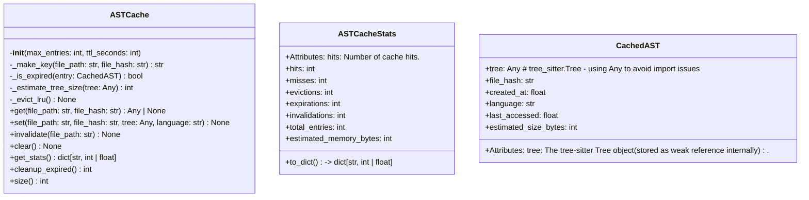

# File: `src/local_deepwiki/core/parser/ast_cache.py`

## File Overview

This file implements a thread-safe, LRU (Least Recently Used) cache for parsed tree-sitter abstract syntax trees (ASTs). The cache is designed to reduce redundant parsing of the same files by storing previously parsed ASTs with metadata for validation and eviction.

The cache supports time-to-live (TTL) expiration, memory estimation for entries, and provides statistics for monitoring performance and memory usage. It is used in the context of code parsing and processing, particularly in modules like `processing_models` and `code_parser`.

## Key Concepts

### Thread Safety
The cache uses `threading.RLock()` to ensure thread-safe access to the internal cache dictionary and statistics. This is crucial because multiple threads may be parsing files concurrently, and the cache must be able to handle simultaneous `get`, `set`, and `invalidate` operations without race conditions.

### LRU Eviction with Size Limits
The cache maintains a maximum number of entries (`max_entries`) and evicts the least recently used entries when the limit is exceeded. This prevents unbounded memory growth while keeping frequently accessed ASTs available.

### TTL Expiration
Each cached entry has a time-to-live (`ttl_seconds`) that determines how long an entry is valid. Expired entries are automatically removed on access or during cleanup, ensuring that cached data doesn't become stale.

### Memory Estimation
To enforce size limits and provide statistics, the cache estimates the memory usage of each `tree-sitter` tree. This is done via `_estimate_tree_size`, which performs a limited traversal of the tree and estimates node count and size.

### Cache Key Composition
Cache keys are constructed from a combination of `file_path` and `file_hash`, allowing the cache to distinguish between different versions of the same file (based on content hash) while still allowing for efficient retrieval.

## Integration

This file is imported and used by:
- `processing_models`
- `code_parser`

These modules are responsible for parsing and processing code, and they rely on `ASTCache` to avoid re-parsing files that have already been processed. The `ASTCache` is integrated into the parsing pipeline to improve performance and reduce CPU and memory overhead.

The cache is closely related to other components in the codebase:
- `src/local_deepwiki/config/processing_models.py` - Likely configures cache size and TTL.
- `src/local_deepwiki/core/rate_limiter.py` - May interact with the cache to manage parsing rate.
- `src/local_deepwiki/core/reranker.py` - Might use cached ASTs for re-ranking or analysis.

## Design Notes

### Why LRU + TTL?
LRU eviction ensures that the most recently accessed files are kept in the cache, improving hit rates. TTL ensures that even frequently accessed files are eventually refreshed, which is important for handling cases where source files are updated.

### Memory Estimation Trade-offs
The `_estimate_tree_size` function uses a limited traversal to avoid performance issues with large trees. If a traversal fails due to recursion or other errors, it defaults to a conservative estimate of 10KB. This prevents crashes while ensuring that memory usage doesn't grow uncontrollably.

### Handling Updates
When a file is updated, its hash changes, and a new entry is created. However, if a file is modified but not re-hashed, the cache still evicts the old entry due to TTL. This design ensures that stale ASTs are not returned.

### Explicit Invalidation
The `invalidate` method allows removing all entries for a specific file path, regardless of hash. This is useful when a file is known to have changed, ensuring that outdated ASTs are not returned.

### Statistics and Monitoring
The `ASTCacheStats` class provides a structured way to monitor cache performance, including hit rates, evictions, and memory usage. This is essential for tuning cache parameters and identifying bottlenecks in the parsing pipeline.

## API Reference

### class `CachedAST`

A cached AST entry with metadata for validation and eviction.  Attributes: tree: The tree-sitter Tree object (stored as weak reference internally). file_hash: SHA256 hash of the file content when parsed. created_at: Unix timestamp when the entry was created. language: The programming language of the parsed file. last_accessed: Unix timestamp of last access (for LRU eviction). estimated_size_bytes: Estimated memory size of the tree.


<details>
<summary>View Source (lines 13-30) | <a href="https://github.com/UrbanDiver/local-deepwiki-mcp/blob/main/src/local_deepwiki/core/parser/ast_cache.py#L13-L30">GitHub</a></summary>

```python
class CachedAST:
    """A cached AST entry with metadata for validation and eviction.

    Attributes:
        tree: The tree-sitter Tree object (stored as weak reference internally).
        file_hash: SHA256 hash of the file content when parsed.
        created_at: Unix timestamp when the entry was created.
        language: The programming language of the parsed file.
        last_accessed: Unix timestamp of last access (for LRU eviction).
        estimated_size_bytes: Estimated memory size of the tree.
    """

    tree: Any  # tree_sitter.Tree - using Any to avoid import issues
    file_hash: str
    created_at: float
    language: str
    last_accessed: float = field(default_factory=time.time)
    estimated_size_bytes: int = 0
```

</details>

### class `ASTCacheStats`

Statistics for AST cache operations.  Attributes: hits: Number of cache hits. misses: Number of cache misses. evictions: Number of entries evicted due to max size. expirations: Number of entries expired due to TTL. invalidations: Number of explicit invalidations. total_entries: Current number of entries in cache. estimated_memory_bytes: Estimated total memory usage.

**Methods:**


<details>
<summary>View Source (lines 34-72) | <a href="https://github.com/UrbanDiver/local-deepwiki-mcp/blob/main/src/local_deepwiki/core/parser/ast_cache.py#L34-L72">GitHub</a></summary>

```python
class ASTCacheStats:
    """Statistics for AST cache operations.

    Attributes:
        hits: Number of cache hits.
        misses: Number of cache misses.
        evictions: Number of entries evicted due to max size.
        expirations: Number of entries expired due to TTL.
        invalidations: Number of explicit invalidations.
        total_entries: Current number of entries in cache.
        estimated_memory_bytes: Estimated total memory usage.
    """

    hits: int = 0
    misses: int = 0
    evictions: int = 0
    expirations: int = 0
    invalidations: int = 0
    total_entries: int = 0
    estimated_memory_bytes: int = 0

    def to_dict(self) -> dict[str, int | float]:
        """Convert stats to a dictionary.

        Returns:
            Dictionary with all statistics.
        """
        total_requests = self.hits + self.misses
        hit_rate = self.hits / total_requests if total_requests > 0 else 0.0
        return {
            "hits": self.hits,
            "misses": self.misses,
            "hit_rate": hit_rate,
            "evictions": self.evictions,
            "expirations": self.expirations,
            "invalidations": self.invalidations,
            "total_entries": self.total_entries,
            "estimated_memory_bytes": self.estimated_memory_bytes,
        }
```

</details>

#### `to_dict`

```python
def to_dict() -> dict[str, int | float]
```

Convert stats to a dictionary.


<details>
<summary>View Source (lines 34-72) | <a href="https://github.com/UrbanDiver/local-deepwiki-mcp/blob/main/src/local_deepwiki/core/parser/ast_cache.py#L34-L72">GitHub</a></summary>

```python
class ASTCacheStats:
    """Statistics for AST cache operations.

    Attributes:
        hits: Number of cache hits.
        misses: Number of cache misses.
        evictions: Number of entries evicted due to max size.
        expirations: Number of entries expired due to TTL.
        invalidations: Number of explicit invalidations.
        total_entries: Current number of entries in cache.
        estimated_memory_bytes: Estimated total memory usage.
    """

    hits: int = 0
    misses: int = 0
    evictions: int = 0
    expirations: int = 0
    invalidations: int = 0
    total_entries: int = 0
    estimated_memory_bytes: int = 0

    def to_dict(self) -> dict[str, int | float]:
        """Convert stats to a dictionary.

        Returns:
            Dictionary with all statistics.
        """
        total_requests = self.hits + self.misses
        hit_rate = self.hits / total_requests if total_requests > 0 else 0.0
        return {
            "hits": self.hits,
            "misses": self.misses,
            "hit_rate": hit_rate,
            "evictions": self.evictions,
            "expirations": self.expirations,
            "invalidations": self.invalidations,
            "total_entries": self.total_entries,
            "estimated_memory_bytes": self.estimated_memory_bytes,
        }
```

</details>

### class `ASTCache`

Thread-safe LRU cache for parsed ASTs with TTL support.  Caches tree-sitter ASTs to avoid re-parsing unchanged files during incremental indexing. Uses file path + content hash as the cache key to ensure cache validity.  Features: - TTL-based expiration - LRU eviction when max_entries is exceeded - Memory usage estimation - Thread-safe operations - Cache statistics tracking

**Methods:**


<details>
<summary>View Source (lines 75-324) | <a href="https://github.com/UrbanDiver/local-deepwiki-mcp/blob/main/src/local_deepwiki/core/parser/ast_cache.py#L75-L324">GitHub</a></summary>

```python
class ASTCache:
    # Methods: __init__, _make_key, _is_expired, _estimate_tree_size, _evict_lru, get, set, invalidate, clear, get_stats, cleanup_expired, size
```

</details>

#### `__init__`

```python
def __init__(max_entries: int = 1000, ttl_seconds: int = 3600)
```

Initialize the AST cache.


| Parameter | Type | Default | Description |
|-----------|------|---------|-------------|
| `max_entries` | `int` | `1000` | Maximum number of entries before LRU eviction. |
| `ttl_seconds` | `int` | `3600` | Time-to-live for cache entries in seconds. |


<details>
<summary>View Source (lines 104-115) | <a href="https://github.com/UrbanDiver/local-deepwiki-mcp/blob/main/src/local_deepwiki/core/parser/ast_cache.py#L104-L115">GitHub</a></summary>

```python
def __init__(self, max_entries: int = 1000, ttl_seconds: int = 3600):
        """Initialize the AST cache.

        Args:
            max_entries: Maximum number of entries before LRU eviction.
            ttl_seconds: Time-to-live for cache entries in seconds.
        """
        self._max_entries = max_entries
        self._ttl_seconds = ttl_seconds
        self._cache: dict[str, CachedAST] = {}
        self._lock = threading.RLock()
        self._stats = ASTCacheStats()
```

</details>

#### `get`

```python
def get(file_path: str, file_hash: str) -> Any | None
```

Get a cached AST if valid (hash matches and not expired).


| Parameter | Type | Default | Description |
|-----------|------|---------|-------------|
| `file_path` | `str` | - | Path to the file (used as part of cache key). |
| `file_hash` | `str` | - | SHA256 hash of the file content. |


<details>
<summary>View Source (lines 200-230) | <a href="https://github.com/UrbanDiver/local-deepwiki-mcp/blob/main/src/local_deepwiki/core/parser/ast_cache.py#L200-L230">GitHub</a></summary>

```python
def get(self, file_path: str, file_hash: str) -> Any | None:
        """Get a cached AST if valid (hash matches and not expired).

        Args:
            file_path: Path to the file (used as part of cache key).
            file_hash: SHA256 hash of the file content.

        Returns:
            The cached tree-sitter Tree if found and valid, None otherwise.
        """
        key = self._make_key(file_path, file_hash)

        with self._lock:
            entry = self._cache.get(key)

            if entry is None:
                self._stats.misses += 1
                return None

            # Check expiration
            if self._is_expired(entry):
                self._cache.pop(key, None)
                self._stats.expirations += 1
                self._stats.misses += 1
                self._stats.estimated_memory_bytes -= entry.estimated_size_bytes
                return None

            # Update access time for LRU
            entry.last_accessed = time.time()
            self._stats.hits += 1
            return entry.tree
```

</details>

#### `set`

```python
def set(file_path: str, file_hash: str, tree: Any, language: str) -> None
```

Cache a parsed AST.


| Parameter | Type | Default | Description |
|-----------|------|---------|-------------|
| `file_path` | `str` | - | Path to the file. |
| `file_hash` | `str` | - | SHA256 hash of the file content. |
| `tree` | `Any` | - | The tree-sitter Tree object to cache. |
| `language` | `str` | - | The programming language of the file. |


<details>
<summary>View Source (lines 232-265) | <a href="https://github.com/UrbanDiver/local-deepwiki-mcp/blob/main/src/local_deepwiki/core/parser/ast_cache.py#L232-L265">GitHub</a></summary>

```python
def set(self, file_path: str, file_hash: str, tree: Any, language: str) -> None:
        """Cache a parsed AST.

        Args:
            file_path: Path to the file.
            file_hash: SHA256 hash of the file content.
            tree: The tree-sitter Tree object to cache.
            language: The programming language of the file.
        """
        key = self._make_key(file_path, file_hash)
        estimated_size = self._estimate_tree_size(tree)
        current_time = time.time()

        entry = CachedAST(
            tree=tree,
            file_hash=file_hash,
            created_at=current_time,
            language=language,
            last_accessed=current_time,
            estimated_size_bytes=estimated_size,
        )

        with self._lock:
            # Check if we need to evict before adding
            if key not in self._cache:
                self._evict_lru()

            # If updating existing entry, subtract old size
            old_entry = self._cache.get(key)
            if old_entry:
                self._stats.estimated_memory_bytes -= old_entry.estimated_size_bytes

            self._cache[key] = entry
            self._stats.estimated_memory_bytes += estimated_size
```

</details>

#### `invalidate`

```python
def invalidate(file_path: str) -> None
```

Remove all entries for a specific file from cache.  This removes entries regardless of their hash, useful when a file is known to have been modified.


| Parameter | Type | Default | Description |
|-----------|------|---------|-------------|
| `file_path` | `str` | - | Path to the file to invalidate. |


<details>
<summary>View Source (lines 267-285) | <a href="https://github.com/UrbanDiver/local-deepwiki-mcp/blob/main/src/local_deepwiki/core/parser/ast_cache.py#L267-L285">GitHub</a></summary>

```python
def invalidate(self, file_path: str) -> None:
        """Remove all entries for a specific file from cache.

        This removes entries regardless of their hash, useful when a file
        is known to have been modified.

        Args:
            file_path: Path to the file to invalidate.
        """
        with self._lock:
            # Find all keys that start with this file path
            keys_to_remove = [
                k for k in self._cache.keys() if k.startswith(f"{file_path}:")
            ]
            for key in keys_to_remove:
                entry = self._cache.pop(key, None)
                if entry:
                    self._stats.invalidations += 1
                    self._stats.estimated_memory_bytes -= entry.estimated_size_bytes
```

</details>

#### `clear`

```python
def clear() -> None
```

Clear all cached ASTs.


<details>
<summary>View Source (lines 287-291) | <a href="https://github.com/UrbanDiver/local-deepwiki-mcp/blob/main/src/local_deepwiki/core/parser/ast_cache.py#L287-L291">GitHub</a></summary>

```python
def clear(self) -> None:
        """Clear all cached ASTs."""
        with self._lock:
            self._cache.clear()
            self._stats.estimated_memory_bytes = 0
```

</details>

#### `get_stats`

```python
def get_stats() -> dict[str, int | float]
```

Return cache statistics.


<details>
<summary>View Source (lines 293-303) | <a href="https://github.com/UrbanDiver/local-deepwiki-mcp/blob/main/src/local_deepwiki/core/parser/ast_cache.py#L293-L303">GitHub</a></summary>

```python
def get_stats(self) -> dict[str, int | float]:
        """Return cache statistics.

        Returns:
            Dictionary with cache statistics including hits, misses,
            hit rate, evictions, expirations, invalidations, total entries,
            and estimated memory usage.
        """
        with self._lock:
            self._stats.total_entries = len(self._cache)
            return self._stats.to_dict()
```

</details>

#### `cleanup_expired`

```python
def cleanup_expired() -> int
```

Remove all expired entries from the cache.


<details>
<summary>View Source (lines 305-318) | <a href="https://github.com/UrbanDiver/local-deepwiki-mcp/blob/main/src/local_deepwiki/core/parser/ast_cache.py#L305-L318">GitHub</a></summary>

```python
def cleanup_expired(self) -> int:
        """Remove all expired entries from the cache.

        Returns:
            Number of entries removed.
        """
        with self._lock:
            expired_keys = [k for k, v in self._cache.items() if self._is_expired(v)]
            for key in expired_keys:
                entry = self._cache.pop(key, None)
                if entry:
                    self._stats.expirations += 1
                    self._stats.estimated_memory_bytes -= entry.estimated_size_bytes
            return len(expired_keys)
```

</details>

#### `size`

```python
def size() -> int
```

Return current number of entries in cache.


<details>
<summary>View Source (lines 321-324) | <a href="https://github.com/UrbanDiver/local-deepwiki-mcp/blob/main/src/local_deepwiki/core/parser/ast_cache.py#L321-L324">GitHub</a></summary>

```python
def size(self) -> int:
        """Return current number of entries in cache."""
        with self._lock:
            return len(self._cache)
```

</details>

## Class Diagram



## Call Graph

```mermaid
flowchart TD
    N0[ASTCache.__init__]
    N1[ASTCache._estimate_tree_size]
    N2[ASTCache._is_expired]
    N3[ASTCache.cleanup_expired]
    N4[ASTCache.get]
    N5[ASTCache.get_stats]
    N6[ASTCache.set]
    N7[ASTCacheStats]
    N8[CachedAST]
    N9[RLock]
    N10[_estimate_tree_size]
    N11[_evict_lru]
    N12[_is_expired]
    N13[_make_key]
    N14[getsizeof]
    N15[time]
    N16[to_dict]
    N0 --> N9
    N0 --> N7
    N2 --> N15
    N1 --> N14
    N4 --> N13
    N4 --> N12
    N4 --> N15
    N6 --> N13
    N6 --> N10
    N6 --> N15
    N6 --> N8
    N6 --> N11
    N5 --> N16
    N3 --> N12
    classDef func fill:#e1f5fe
    class N7,N8,N9,N10,N11,N12,N13,N14,N15,N16 func
    classDef method fill:#fff3e0
    class N0,N1,N2,N3,N4,N5,N6 method
```



## Used By

Functions and methods in this file and their callers:

- **`ASTCacheStats`**: called by `ASTCache.__init__`
- **`CachedAST`**: called by `ASTCache.set`
- **`RLock`**: called by `ASTCache.__init__`
- **`_estimate_tree_size`**: called by `ASTCache.set`
- **`_evict_lru`**: called by `ASTCache.set`
- **`_is_expired`**: called by `ASTCache.cleanup_expired`, `ASTCache.get`
- **`_make_key`**: called by `ASTCache.get`, `ASTCache.set`
- **`getsizeof`**: called by `ASTCache._estimate_tree_size`
- **`time`**: called by `ASTCache._is_expired`, `ASTCache.get`, `ASTCache.set`
- **`to_dict`**: called by `ASTCache.get_stats`

## Last Modified

| Entity | Type | Author | Date | Commit |
|--------|------|--------|------|--------|
| `ASTCache` | class | Brian Breidenbach | Feb 20, 2026 | `6be69f5` refactor: low-priority Pyth... |
| `_make_key` | method | Brian Breidenbach | Feb 20, 2026 | `6be69f5` refactor: low-priority Pyth... |
| `_estimate_tree_size` | method | Brian Breidenbach | Feb 20, 2026 | `6be69f5` refactor: low-priority Pyth... |
| `CachedAST` | class | Brian Breidenbach | Feb 09, 2026 | `99410a9` refactor: split 4 large fil... |
| `ASTCacheStats` | class | Brian Breidenbach | Feb 09, 2026 | `99410a9` refactor: split 4 large fil... |
| `__init__` | method | Brian Breidenbach | Feb 09, 2026 | `99410a9` refactor: split 4 large fil... |
| `_is_expired` | method | Brian Breidenbach | Feb 09, 2026 | `99410a9` refactor: split 4 large fil... |
| `_evict_lru` | method | Brian Breidenbach | Feb 09, 2026 | `99410a9` refactor: split 4 large fil... |
| `get` | method | Brian Breidenbach | Feb 09, 2026 | `99410a9` refactor: split 4 large fil... |
| `set` | method | Brian Breidenbach | Feb 09, 2026 | `99410a9` refactor: split 4 large fil... |
| `invalidate` | method | Brian Breidenbach | Feb 09, 2026 | `99410a9` refactor: split 4 large fil... |
| `clear` | method | Brian Breidenbach | Feb 09, 2026 | `99410a9` refactor: split 4 large fil... |
| `get_stats` | method | Brian Breidenbach | Feb 09, 2026 | `99410a9` refactor: split 4 large fil... |
| `cleanup_expired` | method | Brian Breidenbach | Feb 09, 2026 | `99410a9` refactor: split 4 large fil... |
| `size` | method | Brian Breidenbach | Feb 09, 2026 | `99410a9` refactor: split 4 large fil... |

## Additional Source Code

Source code for functions and methods not listed in the API Reference above.

#### `_make_key`

<details>
<summary>View Source (lines 118-128) | <a href="https://github.com/UrbanDiver/local-deepwiki-mcp/blob/main/src/local_deepwiki/core/parser/ast_cache.py#L118-L128">GitHub</a></summary>

```python
def _make_key(file_path: str, file_hash: str) -> str:
        """Create a cache key from file path and hash.

        Args:
            file_path: Path to the file.
            file_hash: SHA256 hash of file content.

        Returns:
            Combined cache key string.
        """
        return f"{file_path}:{file_hash}"
```

</details>


#### `_is_expired`

<details>
<summary>View Source (lines 130-139) | <a href="https://github.com/UrbanDiver/local-deepwiki-mcp/blob/main/src/local_deepwiki/core/parser/ast_cache.py#L130-L139">GitHub</a></summary>

```python
def _is_expired(self, entry: CachedAST) -> bool:
        """Check if a cache entry has expired.

        Args:
            entry: The cache entry to check.

        Returns:
            True if the entry has expired, False otherwise.
        """
        return time.time() - entry.created_at > self._ttl_seconds
```

</details>


#### `_estimate_tree_size`

<details>
<summary>View Source (lines 142-181) | <a href="https://github.com/UrbanDiver/local-deepwiki-mcp/blob/main/src/local_deepwiki/core/parser/ast_cache.py#L142-L181">GitHub</a></summary>

```python
def _estimate_tree_size(tree: Any) -> int:
        """Estimate memory size of a tree-sitter Tree.

        This is a rough estimate based on the tree structure. Tree-sitter
        trees can be large for complex files.

        Args:
            tree: The tree-sitter Tree object.

        Returns:
            Estimated size in bytes.
        """
        try:
            # Base size for the Tree object itself
            base_size = sys.getsizeof(tree)

            # Estimate node count from root - traverse a sample
            root = tree.root_node
            if root is None:
                return base_size

            # Count nodes in a limited traversal (avoid full tree walk for performance)
            node_count = 0
            stack = [root]
            max_nodes = 10000  # Limit traversal for large trees

            while stack and node_count < max_nodes:
                node = stack.pop()
                node_count += 1
                stack.extend(node.children)

            # Estimate ~100 bytes per node (node object + text references)
            estimated_node_size = node_count * 100

            return base_size + estimated_node_size
        except (AttributeError, RecursionError, RuntimeError):
            # AttributeError: malformed tree nodes
            # RecursionError: deeply nested ASTs
            # RuntimeError: tree-sitter internal errors
            return 10000  # 10 KB default
```

</details>


#### `_evict_lru`

<details>
<summary>View Source (lines 183-198) | <a href="https://github.com/UrbanDiver/local-deepwiki-mcp/blob/main/src/local_deepwiki/core/parser/ast_cache.py#L183-L198">GitHub</a></summary>

```python
def _evict_lru(self) -> None:
        """Evict least recently used entries until under max_entries.

        Must be called with lock held.
        """
        while len(self._cache) >= self._max_entries:
            if not self._cache:
                break

            # Find LRU entry
            lru_key = min(
                self._cache.keys(), key=lambda k: self._cache[k].last_accessed
            )
            evicted = self._cache.pop(lru_key)
            self._stats.evictions += 1
            self._stats.estimated_memory_bytes -= evicted.estimated_size_bytes
```

</details>

## Relevant Source Files

- `src/local_deepwiki/core/parser/ast_cache.py:13-30`
