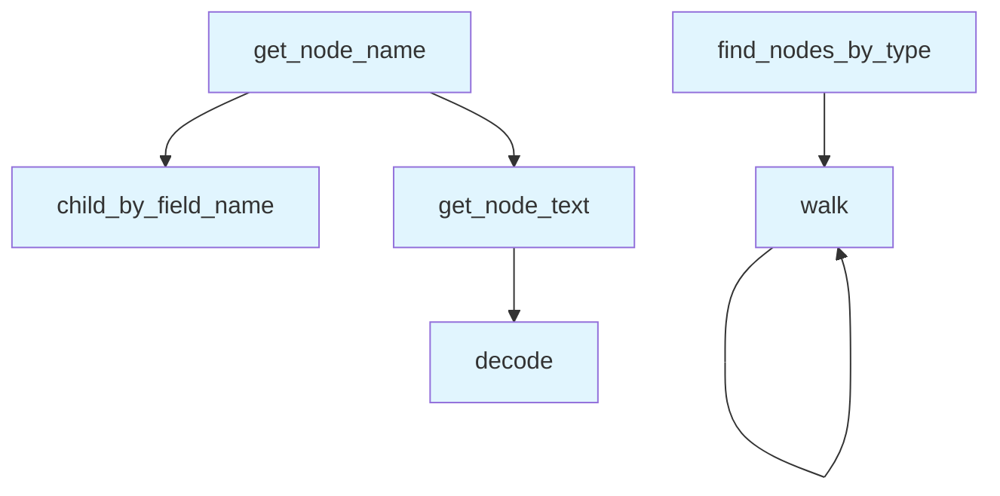

# File: `src/local_deepwiki/core/parser/ast_utils.py`

## File Overview

This module provides utility functions for working with Tree-sitter Abstract Syntax Tree (AST) nodes. It serves as a core set of helpers for parsing and inspecting code structures, particularly when extracting semantic information such as node text, finding specific node types, and retrieving names of functions or classes.

The module is designed to be lightweight and focused on AST traversal and extraction tasks, supporting downstream components like chunk builders, extractors, and complexity analyzers.

## Key Concepts

### AST Node Inspection
The primary abstraction in this module is working with Tree-sitter `Node` objects. These nodes represent elements in the parsed syntax tree, and the utility functions provide consistent ways to access their content and structure.

### Text Extraction
The `get_node_text` function is a key utility that decodes the byte range of a node from the original source code into a UTF-8 string. This is essential for retrieving readable content from parsed nodes.

### Node Type Filtering
The `find_nodes_by_type` function enables filtering of AST nodes by type, which is critical for targeted parsing or analysis. It recursively walks the AST and collects all nodes matching a given set of types.

### Name Extraction
The `get_node_name` function attempts to extract meaningful identifiers from function or class nodes, supporting a variety of language-specific node structures. It uses heuristics like checking for "name" or "identifier" child nodes and also tries field-based access, making it robust across different languages.

### Why These Patterns Were Chosen
These utilities were chosen to provide a consistent interface for AST traversal and data extraction. The recursive `walk` function in `find_nodes_by_type` ensures that all nodes are visited, and the fallback strategies in `get_node_name` allow the system to handle variations in AST structure across languages.

## Integration

This module is used extensively across the parser and analysis components of the codebase:

- `get_node_text` is used by chunk builders, extractors, and other modules that need to retrieve text content from AST nodes.
- `find_nodes_by_type` is used by chunk extractors and similar tools to locate specific node types within the AST.
- `walk` is used by complexity and coupling analysis modules to traverse the AST.
- `get_node_name` is used by extractors to identify function or class names.

It integrates with `tree-sitter` for AST parsing and [`local_deepwiki.models.Language`](../../models/foundation.md) to support language-specific parsing behavior. The functions are part of the core parsing infrastructure and are not directly tied to CLI or configuration logic, but are used by tools like `docstrings.py` and `ast_cache.py` for deeper AST analysis.

## Design Notes

### Handling of Encoding Errors
In `get_node_text`, the `errors="replace"` parameter ensures that malformed or invalid UTF-8 sequences in the source code do not cause crashes. This is a pragmatic choice to maintain robustness in parsing.

### Language Agnostic Design
The `get_node_name` function is designed to be language-agnostic by trying multiple strategies to find a node's name, including:
- Direct child nodes with type "name" or "identifier"
- Field-based access using `child_by_field_name("name")`

This allows it to work across multiple programming languages that may represent identifiers differently in their ASTs.

### Recursive AST Traversal
The `walk` function used internally in `find_nodes_by_type` is a simple but effective recursive approach to AST traversal. It ensures all nodes are explored without needing complex state management or stacks.

### Extensibility
The module is designed to be extensible. For example, `find_nodes_by_type` accepts a set of node types, making it easy to reuse for different analysis tasks. Similarly, `get_node_name` can be extended or adapted to support new node structures without changing the core logic.

## API Reference

### Functions

#### `get_node_text`

```python
def get_node_text(node: Node, source: bytes) -> str
```

Extract text content from a tree-sitter node.


| Parameter | Type | Default | Description |
|-----------|------|---------|-------------|
| `node` | `Node` | - | The tree-sitter node. |
| `source` | `bytes` | - | The original source bytes. |

**Returns:** `str`


<details>
<summary>View Source (lines 10-20) | <a href="https://github.com/UrbanDiver/local-deepwiki-mcp/blob/main/src/local_deepwiki/core/parser/ast_utils.py#L10-L20">GitHub</a></summary>

```python
def get_node_text(node: Node, source: bytes) -> str:
    """Extract text content from a tree-sitter node.

    Args:
        node: The tree-sitter node.
        source: The original source bytes.

    Returns:
        The text content of the node.
    """
    return source[node.start_byte : node.end_byte].decode("utf-8", errors="replace")
```

</details>

#### `find_nodes_by_type`

```python
def find_nodes_by_type(root: Node, node_types: set[str]) -> list[Node]
```

Find all nodes of specified types in the AST.


| Parameter | Type | Default | Description |
|-----------|------|---------|-------------|
| `root` | `Node` | - | The root node to search from. |
| `node_types` | `set[str]` | - | Set of node type names to find. |

**Returns:** `list[Node]`


<details>
<summary>View Source (lines 23-42) | <a href="https://github.com/UrbanDiver/local-deepwiki-mcp/blob/main/src/local_deepwiki/core/parser/ast_utils.py#L23-L42">GitHub</a></summary>

```python
def find_nodes_by_type(root: Node, node_types: set[str]) -> list[Node]:
    """Find all nodes of specified types in the AST.

    Args:
        root: The root node to search from.
        node_types: Set of node type names to find.

    Returns:
        List of matching nodes.
    """
    results = []

    def walk(node: Node) -> None:
        if node.type in node_types:
            results.append(node)
        for child in node.children:
            walk(child)

    walk(root)
    return results
```

</details>

#### `walk`

```python
def walk(node: Node) -> None
```


| Parameter | Type | Default | Description |
|-----------|------|---------|-------------|
| `node` | `Node` | - | - |

**Returns:** `None`


<details>
<summary>View Source (lines 35-39) | <a href="https://github.com/UrbanDiver/local-deepwiki-mcp/blob/main/src/local_deepwiki/core/parser/ast_utils.py#L35-L39">GitHub</a></summary>

```python
def walk(node: Node) -> None:
        if node.type in node_types:
            results.append(node)
        for child in node.children:
            walk(child)
```

</details>

#### `get_node_name`

```python
def get_node_name(node: Node, source: bytes, language: LangEnum) -> str | None
```

Extract the name from a function/class/method node.


| Parameter | Type | Default | Description |
|-----------|------|---------|-------------|
| `node` | `Node` | - | The tree-sitter node. |
| `source` | `bytes` | - | The original source bytes. |
| `language` | `LangEnum` | - | The programming language. |

**Returns:** `str | None`


<details>
<summary>View Source (lines 45-74) | <a href="https://github.com/UrbanDiver/local-deepwiki-mcp/blob/main/src/local_deepwiki/core/parser/ast_utils.py#L45-L74">GitHub</a></summary>

```python
def get_node_name(node: Node, source: bytes, language: LangEnum) -> str | None:
    """Extract the name from a function/class/method node.

    Args:
        node: The tree-sitter node.
        source: The original source bytes.
        language: The programming language.

    Returns:
        The name or None if not found.
    """
    # Different languages have different structures
    name_field_types = {
        "name",
        "identifier",
    }

    for child in node.children:
        if child.type in name_field_types:
            return get_node_text(child, source)
        # Check named children
        if child.type == "identifier":
            return get_node_text(child, source)

    # Try field access
    name_node = node.child_by_field_name("name")
    if name_node:
        return get_node_text(name_node, source)

    return None
```

</details>

## Call Graph



## Used By

Functions and methods in this file and their callers:

- **`child_by_field_name`**: called by `get_node_name`
- **`decode`**: called by `get_node_text`
- **`get_node_text`**: called by `get_node_name`
- **`walk`**: called by `find_nodes_by_type`, `walk`

## Last Modified

| Entity | Type | Author | Date | Commit |
|--------|------|--------|------|--------|
| `find_nodes_by_type` | function | Brian Breidenbach | Feb 23, 2026 | `ec06796` chore: harden .gitignore, a... |
| `walk` | function | Brian Breidenbach | Feb 23, 2026 | `ec06796` chore: harden .gitignore, a... |
| `get_node_text` | function | Brian Breidenbach | Feb 09, 2026 | `99410a9` refactor: split 4 large fil... |
| `get_node_name` | function | Brian Breidenbach | Feb 09, 2026 | `99410a9` refactor: split 4 large fil... |

## Relevant Source Files

- `src/local_deepwiki/core/parser/ast_utils.py:10-20`
