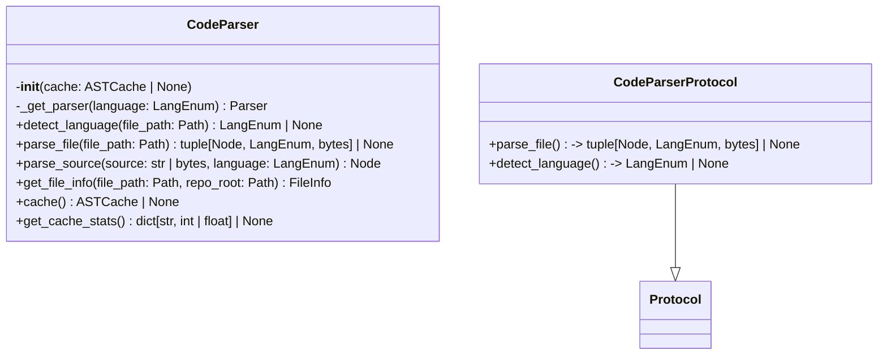

# File: `src/local_deepwiki/core/parser/code_parser.py`

## File Overview

This file provides a core `CodeParser` class that supports multi-language parsing of source code using the Tree-sitter library. It is designed to be flexible and efficient, offering both direct file parsing and in-memory source parsing capabilities. The parser supports caching for performance optimization and integrates with the broader codebase through a protocol-based interface, enabling testability and extensibility.

The file also includes helper functions for reading file content and computing file hashes, optimized for large files using memory mapping and chunked I/O.

## Key Concepts

### Protocol-Based Design for Testability

The `CodeParserProtocol` defines a contract for parsers, enabling dependency injection and mocking. This design choice promotes testability and loose coupling, allowing components that require a parser to be validated against this protocol rather than a concrete implementation.

### Tree-sitter Integration

Tree-sitter is used as the core parsing engine, enabling accurate and efficient parsing of multiple programming languages. The parser is configured dynamically based on language modules, which are mapped to specific language functions (e.g., `language_php()` for PHP). This approach supports a wide range of languages while maintaining performance and correctness.

### Caching for Performance

The `CodeParser` supports optional caching of parsed ASTs via an [`ASTCache`](ast_cache.md) instance. This allows for significant performance gains when re-parsing files or processing large codebases. The cache uses file paths and SHA-256 hashes for key generation, ensuring that changes in file content invalidate the cache correctly.

### Memory-Efficient File Handling

For large files, the parser uses memory mapping (`mmap`) and chunked reading to avoid loading entire files into memory. This is crucial for performance and memory usage when dealing with large codebases, especially in environments with limited resources.

## Integration

This file is a core component of the parser subsystem, integrating with:

- [`ASTCache`](ast_cache.md) (`src/local_deepwiki/core/parser/ast_cache.py`): Used for caching parsed ASTs to improve performance.
- `EXTENSION_MAP` and `LANGUAGE_MODULES` (`src/local_deepwiki/core/parser/languages.py`): Used to map file extensions to language identifiers and load language-specific Tree-sitter modules.
- [`FileInfo`](../../models/chunks.md) and [`Language`](../../models/foundation.md) models (`src/local_deepwiki/models.py`): Used to represent file metadata and language information.
- [`get_logger`](../../logging.md) (`src/local_deepwiki/logging.py`): Used for logging debug and warning messages during parsing and caching.

It is called by:
- `test_chunker`, `test_graph_rag_extractor`, `test_type_annotations`: These test modules use the `CodeParser` to parse source code for testing purposes.
- `status_cli`, `test_parser_performance`: The `_compute_file_hash` function is used for file integrity checks and performance benchmarking.

## Design Notes

### Why Tree-sitter?

Tree-sitter is chosen for its ability to provide accurate, incremental parsing and to support a wide range of languages with high performance. It is particularly suitable for large-scale code analysis and indexing tasks, such as those performed by the `local_deepwiki` tool.

### Why Protocol-Based Interface?

The `CodeParserProtocol` enables loose coupling and facilitates testing by allowing mock parsers to be used in place of the real parser. This design choice improves maintainability and allows for easier unit testing of components that depend on parsing functionality.

### File Reading Optimization

The `_read_file_content` and `_compute_file_hash` functions are optimized for large files:
- Small files are read directly for simplicity.
- Large files use memory mapping (`mmap`) to avoid high memory usage.
- File hashing uses chunked reading to avoid loading large files into memory.

This ensures efficient handling of both small and large files without compromising performance or memory usage.

### Why Not Parse Directly from Strings?

While `parse_source` exists for in-memory parsing, the primary interface is `parse_file` because:
- File paths are used for caching and metadata.
- File-based parsing supports more robust file handling, including large file optimizations.
- The `get_file_info` method relies on file stats and path resolution, which are not available when parsing from strings.

### Caching Strategy

The caching strategy is based on:
- File path and SHA-256 hash for cache keys.
- Caching is optional and controlled via constructor injection.
- Cache statistics are exposed via `get_cache_stats` for monitoring and debugging.

This ensures that caching is opt-in and doesn’t introduce overhead unless explicitly enabled.

## API Reference

### class `CodeParserProtocol`

**Inherits from:** `Protocol`

Protocol defining the interface for code parsers.  Any object implementing ``parse_file`` and ``detect_language`` satisfies this contract.  Used for dependency injection and testability — mock objects passed to components that require a parser can be validated with ``isinstance(obj, CodeParserProtocol)``.

**Methods:**


<details>
<summary>View Source (lines 86-102) | <a href="https://github.com/UrbanDiver/local-deepwiki-mcp/blob/main/src/local_deepwiki/core/parser/code_parser.py#L86-L102">GitHub</a></summary>

```python
class CodeParserProtocol(Protocol):
    """Protocol defining the interface for code parsers.

    Any object implementing ``parse_file`` and ``detect_language`` satisfies
    this contract.  Used for dependency injection and testability — mock
    objects passed to components that require a parser can be validated with
    ``isinstance(obj, CodeParserProtocol)``.
    """

    def parse_file(self, file_path: Path) -> tuple[Node, LangEnum, bytes] | None:
        """Parse a source file and return the AST root, language, and bytes."""
        ...

    @staticmethod
    def detect_language(file_path: Path) -> LangEnum | None:
        """Detect the programming language from the file extension."""
        ...
```

</details>

#### `parse_file`

```python
def parse_file(file_path: Path) -> tuple[Node, LangEnum, bytes] | None
```

Parse a source file and return the AST root, language, and bytes.


| Parameter | Type | Default | Description |
|-----------|------|---------|-------------|
| `file_path` | `Path` | - | - |


<details>
<summary>View Source (lines 86-102) | <a href="https://github.com/UrbanDiver/local-deepwiki-mcp/blob/main/src/local_deepwiki/core/parser/code_parser.py#L86-L102">GitHub</a></summary>

```python
class CodeParserProtocol(Protocol):
    """Protocol defining the interface for code parsers.

    Any object implementing ``parse_file`` and ``detect_language`` satisfies
    this contract.  Used for dependency injection and testability — mock
    objects passed to components that require a parser can be validated with
    ``isinstance(obj, CodeParserProtocol)``.
    """

    def parse_file(self, file_path: Path) -> tuple[Node, LangEnum, bytes] | None:
        """Parse a source file and return the AST root, language, and bytes."""
        ...

    @staticmethod
    def detect_language(file_path: Path) -> LangEnum | None:
        """Detect the programming language from the file extension."""
        ...
```

</details>

#### `detect_language`

```python
def detect_language(file_path: Path) -> LangEnum | None
```

Detect the programming language from the file extension.


| Parameter | Type | Default | Description |
|-----------|------|---------|-------------|
| `file_path` | `Path` | - | - |


<details>
<summary>View Source (lines 86-102) | <a href="https://github.com/UrbanDiver/local-deepwiki-mcp/blob/main/src/local_deepwiki/core/parser/code_parser.py#L86-L102">GitHub</a></summary>

```python
class CodeParserProtocol(Protocol):
    """Protocol defining the interface for code parsers.

    Any object implementing ``parse_file`` and ``detect_language`` satisfies
    this contract.  Used for dependency injection and testability — mock
    objects passed to components that require a parser can be validated with
    ``isinstance(obj, CodeParserProtocol)``.
    """

    def parse_file(self, file_path: Path) -> tuple[Node, LangEnum, bytes] | None:
        """Parse a source file and return the AST root, language, and bytes."""
        ...

    @staticmethod
    def detect_language(file_path: Path) -> LangEnum | None:
        """Detect the programming language from the file extension."""
        ...
```

</details>

### class `CodeParser`

Multi-language code parser using tree-sitter.  Supports optional AST caching to speed up incremental indexing by avoiding re-parsing of unchanged files.

**Methods:**


<details>
<summary>View Source (lines 105-284) | <a href="https://github.com/UrbanDiver/local-deepwiki-mcp/blob/main/src/local_deepwiki/core/parser/code_parser.py#L105-L284">GitHub</a></summary>

```python
class CodeParser:
    # Methods: __init__, _get_parser, detect_language, parse_file, parse_source, get_file_info, cache, get_cache_stats
```

</details>

#### `__init__`

```python
def __init__(cache: ASTCache | None = None)
```

Initialize the parser with language support.


| Parameter | Type | Default | Description |
|-----------|------|---------|-------------|
| `cache` | `ASTCache | None` | `None` | Optional ASTCache instance for caching parsed ASTs. |


<details>
<summary>View Source (lines 128-136) | <a href="https://github.com/UrbanDiver/local-deepwiki-mcp/blob/main/src/local_deepwiki/core/parser/code_parser.py#L128-L136">GitHub</a></summary>

```python
def __init__(self, cache: ASTCache | None = None):
        """Initialize the parser with language support.

        Args:
            cache: Optional ASTCache instance for caching parsed ASTs.
        """
        self._parsers: dict[LangEnum, Parser] = {}
        self._languages: dict[LangEnum, Language] = {}
        self._cache = cache
```

</details>

#### `detect_language`

```python
def detect_language(file_path: Path) -> LangEnum | None
```

Detect the programming language from file extension.


| Parameter | Type | Default | Description |
|-----------|------|---------|-------------|
| `file_path` | `Path` | - | Path to the source file. |


<details>
<summary>View Source (lines 170-180) | <a href="https://github.com/UrbanDiver/local-deepwiki-mcp/blob/main/src/local_deepwiki/core/parser/code_parser.py#L170-L180">GitHub</a></summary>

```python
def detect_language(file_path: Path) -> LangEnum | None:
        """Detect the programming language from file extension.

        Args:
            file_path: Path to the source file.

        Returns:
            The detected Language enum or None if not supported.
        """
        suffix = file_path.suffix.lower()
        return EXTENSION_MAP.get(suffix)
```

</details>

#### `parse_file`

```python
def parse_file(file_path: Path) -> tuple[Node, LangEnum, bytes] | None
```

Parse a source file and return the AST root.  If a cache is configured, checks the cache before parsing and stores the result after parsing.


| Parameter | Type | Default | Description |
|-----------|------|---------|-------------|
| `file_path` | `Path` | - | Path to the source file. |


<details>
<summary>View Source (lines 182-225) | <a href="https://github.com/UrbanDiver/local-deepwiki-mcp/blob/main/src/local_deepwiki/core/parser/code_parser.py#L182-L225">GitHub</a></summary>

```python
def parse_file(self, file_path: Path) -> tuple[Node, LangEnum, bytes] | None:
        """Parse a source file and return the AST root.

        If a cache is configured, checks the cache before parsing and
        stores the result after parsing.

        Args:
            file_path: Path to the source file.

        Returns:
            Tuple of (AST root node, language, source bytes) or None if not supported.
        """
        language = self.detect_language(file_path)
        if language is None:
            logger.debug("Unsupported file type: %s", file_path)
            return None

        try:
            source = _read_file_content(file_path)
        except OSError as e:
            logger.warning("Failed to read file %s: %s", file_path, e)
            return None

        # Compute file hash for cache lookup
        file_hash = hashlib.sha256(source).hexdigest()
        file_path_str = str(file_path)

        # Check cache if available
        if self._cache is not None:
            cached_tree = self._cache.get(file_path_str, file_hash)
            if cached_tree is not None:
                logger.debug("Cache hit for %s", file_path.name)
                return cached_tree.root_node, language, source

        # Parse the file
        logger.debug("Parsing %s as %s", file_path.name, language.value)
        parser = self._get_parser(language)
        tree = parser.parse(source)

        # Store in cache if available
        if self._cache is not None:
            self._cache.set(file_path_str, file_hash, tree, language.value)

        return tree.root_node, language, source
```

</details>

#### `parse_source`

```python
def parse_source(source: str | bytes, language: LangEnum) -> Node
```

Parse source code string and return the AST root.


| Parameter | Type | Default | Description |
|-----------|------|---------|-------------|
| `source` | `str | bytes` | - | The source code. |
| `language` | `LangEnum` | - | The programming language. |


<details>
<summary>View Source (lines 227-242) | <a href="https://github.com/UrbanDiver/local-deepwiki-mcp/blob/main/src/local_deepwiki/core/parser/code_parser.py#L227-L242">GitHub</a></summary>

```python
def parse_source(self, source: str | bytes, language: LangEnum) -> Node:
        """Parse source code string and return the AST root.

        Args:
            source: The source code.
            language: The programming language.

        Returns:
            The AST root node.
        """
        if isinstance(source, str):
            source = source.encode("utf-8")

        parser = self._get_parser(language)
        tree = parser.parse(source)
        return tree.root_node
```

</details>

#### `get_file_info`

```python
def get_file_info(file_path: Path, repo_root: Path) -> FileInfo
```

Get information about a source file.  Uses chunked reading for large files to avoid loading the entire file into memory just for hash computation.


| Parameter | Type | Default | Description |
|-----------|------|---------|-------------|
| `file_path` | `Path` | - | Absolute path to the file. |
| `repo_root` | `Path` | - | Root directory of the repository. |


<details>
<summary>View Source (lines 244-265) | <a href="https://github.com/UrbanDiver/local-deepwiki-mcp/blob/main/src/local_deepwiki/core/parser/code_parser.py#L244-L265">GitHub</a></summary>

```python
def get_file_info(self, file_path: Path, repo_root: Path) -> FileInfo:
        """Get information about a source file.

        Uses chunked reading for large files to avoid loading
        the entire file into memory just for hash computation.

        Args:
            file_path: Absolute path to the file.
            repo_root: Root directory of the repository.

        Returns:
            FileInfo with file metadata.
        """
        stat = file_path.stat()

        return FileInfo(
            path=str(file_path.relative_to(repo_root)),
            language=self.detect_language(file_path),
            size_bytes=stat.st_size,
            last_modified=stat.st_mtime,
            hash=_compute_file_hash(file_path),
        )
```

</details>

#### `cache`

```python
def cache() -> ASTCache | None
```

Get the AST cache instance if configured.


<details>
<summary>View Source (lines 268-274) | <a href="https://github.com/UrbanDiver/local-deepwiki-mcp/blob/main/src/local_deepwiki/core/parser/code_parser.py#L268-L274">GitHub</a></summary>

```python
def cache(self) -> ASTCache | None:
        """Get the AST cache instance if configured.

        Returns:
            The ASTCache instance or None if caching is not enabled.
        """
        return self._cache
```

</details>

#### `get_cache_stats`

```python
def get_cache_stats() -> dict[str, int | float] | None
```

Get cache statistics if caching is enabled.


<details>
<summary>View Source (lines 276-284) | <a href="https://github.com/UrbanDiver/local-deepwiki-mcp/blob/main/src/local_deepwiki/core/parser/code_parser.py#L276-L284">GitHub</a></summary>

```python
def get_cache_stats(self) -> dict[str, int | float] | None:
        """Get cache statistics if caching is enabled.

        Returns:
            Dictionary with cache statistics or None if caching is disabled.
        """
        if self._cache is None:
            return None
        return self._cache.get_stats()
```

</details>

## Class Diagram



## Call Graph

```mermaid
flowchart TD
    N0[CodeParser._get_parser]
    N1[CodeParser.get_cache_stats]
    N2[CodeParser.get_file_info]
    N3[CodeParser.parse_file]
    N4[CodeParser.parse_source]
    N5[FileInfo]
    N6[Language]
    N7[Parser]
    N8[ValueError]
    N9[_compute_file_hash]
    N10[_get_parser]
    N11[_read_file_content]
    N12[bytes]
    N13[detect_language]
    N14[encode]
    N15[fileno]
    N16[get_stats]
    N17[hexdigest]
    N18[language]
    N19[language_php]
    N20[language_tsx]
    N21[language_typescript]
    N22[mmap]
    N23[parse]
    N24[read]
    N25[read_bytes]
    N26[relative_to]
    N27[sha256]
    N28[stat]
    N11 --> N28
    N11 --> N25
    N11 --> N22
    N11 --> N15
    N11 --> N12
    N9 --> N28
    N9 --> N17
    N9 --> N27
    N9 --> N25
    N9 --> N24
    N0 --> N8
    N0 --> N6
    N0 --> N19
    N0 --> N21
    N0 --> N20
    N0 --> N18
    N0 --> N7
    N3 --> N13
    N3 --> N11
    N3 --> N17
    N3 --> N27
    N3 --> N10
    N3 --> N23
    N4 --> N14
    N4 --> N10
    N4 --> N23
    N2 --> N28
    N2 --> N5
    N2 --> N26
    N2 --> N13
    N2 --> N9
    N1 --> N16
    classDef func fill:#e1f5fe
    class N5,N6,N7,N8,N9,N10,N11,N12,N13,N14,N15,N16,N17,N18,N19,N20,N21,N22,N23,N24,N25,N26,N27,N28 func
    classDef method fill:#fff3e0
    class N0,N1,N2,N3,N4 method
```



## Used By

Functions and methods in this file and their callers:

- **[`FileInfo`](../../models/chunks.md)**: called by `CodeParser.get_file_info`
- **[`Language`](../../models/foundation.md)**: called by `CodeParser._get_parser`
- **`Parser`**: called by `CodeParser._get_parser`
- **`ValueError`**: called by `CodeParser._get_parser`
- **`_compute_file_hash`**: called by `CodeParser.get_file_info`
- **`_get_parser`**: called by `CodeParser.parse_file`, `CodeParser.parse_source`
- **`_read_file_content`**: called by `CodeParser.parse_file`
- **`bytes`**: called by `_read_file_content`
- **`detect_language`**: called by `CodeParser.get_file_info`, `CodeParser.parse_file`
- **`encode`**: called by `CodeParser.parse_source`
- **`fileno`**: called by `_read_file_content`
- **`get_stats`**: called by `CodeParser.get_cache_stats`
- **`hexdigest`**: called by `CodeParser.parse_file`, `_compute_file_hash`
- **`language`**: called by `CodeParser._get_parser`
- **`language_php`**: called by `CodeParser._get_parser`
- **`language_tsx`**: called by `CodeParser._get_parser`
- **`language_typescript`**: called by `CodeParser._get_parser`
- **`mmap`**: called by `_read_file_content`
- **`parse`**: called by `CodeParser.parse_file`, `CodeParser.parse_source`
- **`read`**: called by `_compute_file_hash`
- **`read_bytes`**: called by `_compute_file_hash`, `_read_file_content`
- **`relative_to`**: called by `CodeParser.get_file_info`
- **`sha256`**: called by `CodeParser.parse_file`, `_compute_file_hash`
- **`stat`**: called by `CodeParser.get_file_info`, `_compute_file_hash`, `_read_file_content`

## Last Modified

| Entity | Type | Author | Date | Commit |
|--------|------|--------|------|--------|
| `CodeParserProtocol` | class | Brian Breidenbach | yesterday | `515ba66` refactor: improve coupling ... |
| `CodeParser` | class | Brian Breidenbach | Feb 21, 2026 | `e45a53a` refactor: apply Pythonic id... |
| `_get_parser` | method | Brian Breidenbach | Feb 21, 2026 | `e45a53a` refactor: apply Pythonic id... |
| `parse_file` | method | Brian Breidenbach | Feb 21, 2026 | `e45a53a` refactor: apply Pythonic id... |
| `detect_language` | method | Brian Breidenbach | Feb 20, 2026 | `6be69f5` refactor: low-priority Pyth... |
| `_compute_file_hash` | function | Brian Breidenbach | Feb 20, 2026 | `b807417` refactor: high-priority Pyt... |
| `_read_file_content` | function | Brian Breidenbach | Feb 11, 2026 | `ba96da1` fix: publication plan P0-P2... |
| `__init__` | method | Brian Breidenbach | Feb 09, 2026 | `99410a9` refactor: split 4 large fil... |
| `parse_source` | method | Brian Breidenbach | Feb 09, 2026 | `99410a9` refactor: split 4 large fil... |
| `get_file_info` | method | Brian Breidenbach | Feb 09, 2026 | `99410a9` refactor: split 4 large fil... |
| `cache` | method | Brian Breidenbach | Feb 09, 2026 | `99410a9` refactor: split 4 large fil... |
| `get_cache_stats` | method | Brian Breidenbach | Feb 09, 2026 | `99410a9` refactor: split 4 large fil... |

## Additional Source Code

Source code for functions and methods not listed in the API Reference above.

#### `_read_file_content`

<details>
<summary>View Source (lines 27-51) | <a href="https://github.com/UrbanDiver/local-deepwiki-mcp/blob/main/src/local_deepwiki/core/parser/code_parser.py#L27-L51">GitHub</a></summary>

```python
def _read_file_content(file_path: Path) -> bytes:
    """Read file content, using memory-mapping for large files.

    For files larger than MMAP_THRESHOLD_BYTES, uses memory mapping
    which allows the OS to manage memory more efficiently.

    Args:
        file_path: Path to the file to read.

    Returns:
        The file content as bytes.
    """
    file_size = file_path.stat().st_size

    if file_size <= MMAP_THRESHOLD_BYTES:
        # Small files: direct read is faster
        return file_path.read_bytes()

    # Large files: use memory mapping
    logger.debug("Using mmap for large file (%s bytes): %s", file_size, file_path.name)
    with open(file_path, "rb") as f:
        # Memory-map the file (read-only)
        with mmap.mmap(f.fileno(), 0, access=mmap.ACCESS_READ) as mm:
            # Return a copy as bytes since mmap is closed after context
            return bytes(mm)
```

</details>


#### `_compute_file_hash`

<details>
<summary>View Source (lines 54-82) | <a href="https://github.com/UrbanDiver/local-deepwiki-mcp/blob/main/src/local_deepwiki/core/parser/code_parser.py#L54-L82">GitHub</a></summary>

```python
def _compute_file_hash(file_path: Path) -> str:
    """Compute SHA-256 hash of a file using chunked reading.

    This is more memory-efficient for large files as it doesn't
    require loading the entire file into memory at once.

    Args:
        file_path: Path to the file to hash.

    Returns:
        Hexadecimal SHA-256 hash string.
    """
    file_size = file_path.stat().st_size

    if file_size <= MMAP_THRESHOLD_BYTES:
        # Small files: direct read is fine
        return hashlib.sha256(file_path.read_bytes()).hexdigest()

    # Large files: read in chunks
    logger.debug(
        "Using chunked hashing for large file (%d bytes): %s",
        file_size,
        file_path.name,
    )
    hasher = hashlib.sha256()
    with open(file_path, "rb") as f:
        while chunk := f.read(HASH_CHUNK_SIZE):
            hasher.update(chunk)
    return hasher.hexdigest()
```

</details>


#### `_get_parser`

<details>
<summary>View Source (lines 138-167) | <a href="https://github.com/UrbanDiver/local-deepwiki-mcp/blob/main/src/local_deepwiki/core/parser/code_parser.py#L138-L167">GitHub</a></summary>

```python
def _get_parser(self, language: LangEnum) -> Parser:
        """Get or create a parser for the given language.

        Args:
            language: The programming language.

        Returns:
            A tree-sitter Parser configured for the language.
        """
        if language not in self._parsers:
            module = LANGUAGE_MODULES.get(language)
            if module is None:
                raise ValueError(f"Unsupported language: {language}")

            # Some modules have different function names
            match language:
                case LangEnum.PHP:
                    lang = Language(module.language_php())
                case LangEnum.TYPESCRIPT:
                    lang = Language(module.language_typescript())
                case LangEnum.TSX:
                    lang = Language(module.language_tsx())
                case _:
                    lang = Language(module.language())
            self._languages[language] = lang

            parser = Parser(lang)
            self._parsers[language] = parser

        return self._parsers[language]
```

</details>

## Relevant Source Files

- `src/local_deepwiki/core/parser/code_parser.py:86-102`
