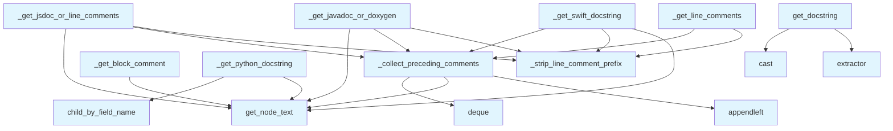

# File: `src/local_deepwiki/core/parser/docstrings.py`

## File Overview

This file provides language-specific logic for extracting docstrings from tree-sitter AST nodes. It is part of the core parsing infrastructure for the `local_deepwiki` project, enabling extraction of documentation comments and docstrings from various programming languages.

The design allows for extensibility by language, supporting Python, JavaScript, Java, Swift, and others through a unified interface. Each language has its own extraction strategy tailored to its comment syntax and documentation conventions.

## Key Concepts

### Language-Agnostic Comment Collection
The `_collect_preceding_comments` function provides a reusable abstraction for gathering consecutive comment nodes that appear before a given AST node. This function is critical for handling multi-line comments and ensures comments are collected in the correct order, stopping at the first non-matching comment type or prefix.

### Prefix Stripping
The `_strip_line_comment_prefix` utility function removes language-specific prefixes (e.g., `//`, `///`, `#`) from comment lines and joins them into a single docstring. This ensures consistent formatting across languages.

### Docstring Extraction Strategies
Each supported language has a dedicated extraction function:
- Python: Extracts docstrings from the first statement in a function or class body.
- JavaScript: Supports both JSDoc (`/** */`) and multi-line `//` comments.
- Java: Supports Javadoc (`/** */`) and Doxygen-style `///` comments.
- Swift: Supports both `///` comments and `/** */` block comments.
- Generic block comment extraction for languages that use `/** */` syntax.

These strategies reflect the idioms and conventions of each language, making the extraction robust and accurate.

## Integration

This file integrates with the broader parsing pipeline in `local_deepwiki` by providing language-specific docstring extraction capabilities. It is used by:
- `test_parser_node_utils` and `test_parser_docstrings` for testing purposes.
- The main parser logic, which calls `get_docstring` with a language enum to determine which extractor to use.

The [`get_node_text`](ast_utils.md) utility from `ast_utils` is used to extract text from tree-sitter nodes, and [`Language`](../../models/foundation.md) enum from `models` provides the language context for dispatching to the correct extraction logic.

## Design Notes

### Extensibility and Dispatch
The `get_docstring` function uses a dictionary mapping `LangEnum` values to extractor functions (`_DOCSTRING_EXTRACTORS`). This design allows for easy addition of new language support without modifying the core dispatch logic.

### Handling of Multi-line Comments
The `_collect_preceding_comments` function stops collecting comments when it encounters a comment that does not match the expected prefix. This prevents mixing regular comments with doc comments, which is crucial for accurate extraction.

### Edge Case Handling
- For Python docstrings, the function checks for both triple-quoted and single-quoted strings.
- The code handles cases where the node has no body, no children, or where the first statement is not a string.
- For languages that support both block and line comments, the logic prioritizes block comments and falls back to line comments if needed.

### Efficiency
The use of `deque` for collecting comments ensures efficient prepending of elements, which is necessary for maintaining the correct order of comments as they are traversed backwards from the node.

### Tree-Sitter Dependency
This file relies on tree-sitter nodes and their structure. It assumes that comments appear as siblings before the target node and that the AST is correctly structured for the language being parsed. This dependency ensures accurate and fast comment extraction but requires the underlying tree-sitter parsing to be robust.

## API Reference

### Functions

#### `get_docstring`

```python
def get_docstring(node: Node, source: bytes, language: LangEnum) -> str | None
```

Extract docstring from a function/class node.


| Parameter | Type | Default | Description |
|-----------|------|---------|-------------|
| `node` | `Node` | - | The tree-sitter node. |
| `source` | `bytes` | - | The original source bytes. |
| `language` | `LangEnum` | - | The programming language. |

**Returns:** `str | None`


<details>
<summary>View Source (lines 172-185) | <a href="https://github.com/UrbanDiver/local-deepwiki-mcp/blob/main/src/local_deepwiki/core/parser/docstrings.py#L172-L185">GitHub</a></summary>

```python
def get_docstring(node: Node, source: bytes, language: LangEnum) -> str | None:
    """Extract docstring from a function/class node.

    Args:
        node: The tree-sitter node.
        source: The original source bytes.
        language: The programming language.

    Returns:
        The docstring or None if not found.
    """
    if extractor := _DOCSTRING_EXTRACTORS.get(language):
        return cast(str | None, extractor(node, source))
    return None
```

</details>

## Call Graph



## Used By

Functions and methods in this file and their callers:

- **`_collect_preceding_comments`**: called by `_get_javadoc_or_doxygen`, `_get_jsdoc_or_line_comments`, `_get_line_comments`, `_get_swift_docstring`
- **`_strip_line_comment_prefix`**: called by `_get_javadoc_or_doxygen`, `_get_jsdoc_or_line_comments`, `_get_line_comments`, `_get_swift_docstring`
- **`appendleft`**: called by `_collect_preceding_comments`
- **`cast`**: called by `get_docstring`
- **`child_by_field_name`**: called by `_get_python_docstring`
- **`deque`**: called by `_collect_preceding_comments`
- **`extractor`**: called by `get_docstring`
- **[`get_node_text`](ast_utils.md)**: called by `_collect_preceding_comments`, `_get_block_comment`, `_get_javadoc_or_doxygen`, `_get_jsdoc_or_line_comments`, `_get_python_docstring`, `_get_swift_docstring`

## Last Modified

| Entity | Type | Author | Date | Commit |
|--------|------|--------|------|--------|
| `_collect_preceding_comments` | function | Brian Breidenbach | Feb 21, 2026 | `e45a53a` refactor: apply Pythonic id... |
| `get_docstring` | function | Brian Breidenbach | Feb 21, 2026 | `e45a53a` refactor: apply Pythonic id... |
| `_strip_line_comment_prefix` | function | Brian Breidenbach | Feb 09, 2026 | `99410a9` refactor: split 4 large fil... |
| `_get_python_docstring` | function | Brian Breidenbach | Feb 09, 2026 | `99410a9` refactor: split 4 large fil... |
| `_get_jsdoc_or_line_comments` | function | Brian Breidenbach | Feb 09, 2026 | `99410a9` refactor: split 4 large fil... |
| `_get_line_comments` | function | Brian Breidenbach | Feb 09, 2026 | `99410a9` refactor: split 4 large fil... |
| `_get_javadoc_or_doxygen` | function | Brian Breidenbach | Feb 09, 2026 | `99410a9` refactor: split 4 large fil... |
| `_get_swift_docstring` | function | Brian Breidenbach | Feb 09, 2026 | `99410a9` refactor: split 4 large fil... |
| `_get_block_comment` | function | Brian Breidenbach | Feb 09, 2026 | `99410a9` refactor: split 4 large fil... |

## Additional Source Code

Source code for functions and methods not listed in the API Reference above.

#### `_collect_preceding_comments`

<details>
<summary>View Source (lines 15-44) | <a href="https://github.com/UrbanDiver/local-deepwiki-mcp/blob/main/src/local_deepwiki/core/parser/docstrings.py#L15-L44">GitHub</a></summary>

```python
def _collect_preceding_comments(
    node: Node,
    source: bytes,
    comment_types: set[str],
    prefix: str | None = None,
) -> list[str]:
    """Collect all consecutive preceding comment lines.

    Args:
        node: The tree-sitter node to look before.
        source: The original source bytes.
        comment_types: Set of comment node type names (e.g., {"comment", "line_comment"}).
        prefix: Optional prefix that comments must start with (e.g., "///" for doc comments).

    Returns:
        List of comment text lines in order (first comment first).
    """
    comments: deque[str] = deque()
    prev = node.prev_sibling

    while prev and prev.type in comment_types:
        text = get_node_text(prev, source)
        if prefix is None or text.startswith(prefix):
            comments.appendleft(text)
            prev = prev.prev_sibling
        else:
            # Stop at non-matching comment (e.g., regular // after ///)
            break

    return list(comments)
```

</details>


#### `_strip_line_comment_prefix`

<details>
<summary>View Source (lines 47-64) | <a href="https://github.com/UrbanDiver/local-deepwiki-mcp/blob/main/src/local_deepwiki/core/parser/docstrings.py#L47-L64">GitHub</a></summary>

```python
def _strip_line_comment_prefix(lines: list[str], prefix: str) -> str:
    """Strip prefix from comment lines and join them.

    Args:
        lines: List of comment lines.
        prefix: The prefix to strip (e.g., "//", "///", "#").

    Returns:
        Joined docstring with prefixes removed.
    """
    stripped = []
    for line in lines:
        # Remove the prefix and optional leading space
        content = line[len(prefix) :]
        if content.startswith(" "):
            content = content[1:]
        stripped.append(content)
    return "\n".join(stripped).strip()
```

</details>


#### `_get_python_docstring`

<details>
<summary>View Source (lines 67-86) | <a href="https://github.com/UrbanDiver/local-deepwiki-mcp/blob/main/src/local_deepwiki/core/parser/docstrings.py#L67-L86">GitHub</a></summary>

```python
def _get_python_docstring(node: Node, source: bytes) -> str | None:
    """Extract Python docstring from function/class body."""
    body = node.child_by_field_name("body")
    if not body or not body.children:
        return None

    first_child = body.children[0]
    if first_child.type != "expression_statement":
        return None

    expr = first_child.children[0] if first_child.children else None
    if not expr or expr.type != "string":
        return None

    text = get_node_text(expr, source)
    if text.startswith('"""') or text.startswith("'''"):
        return text[3:-3].strip()
    if text.startswith('"') or text.startswith("'"):
        return text[1:-1].strip()
    return None
```

</details>


#### `_get_jsdoc_or_line_comments`

<details>
<summary>View Source (lines 89-100) | <a href="https://github.com/UrbanDiver/local-deepwiki-mcp/blob/main/src/local_deepwiki/core/parser/docstrings.py#L89-L100">GitHub</a></summary>

```python
def _get_jsdoc_or_line_comments(node: Node, source: bytes) -> str | None:
    """Extract JSDoc (/** */) or multi-line // comments."""
    prev = node.prev_sibling
    if prev and prev.type == "comment":
        text = get_node_text(prev, source)
        if text.startswith("/**"):
            return text[3:-2].strip()

    comments = _collect_preceding_comments(node, source, {"comment"}, "//")
    if comments:
        return _strip_line_comment_prefix(comments, "//")
    return None
```

</details>


#### `_get_line_comments`

<details>
<summary>View Source (lines 103-110) | <a href="https://github.com/UrbanDiver/local-deepwiki-mcp/blob/main/src/local_deepwiki/core/parser/docstrings.py#L103-L110">GitHub</a></summary>

```python
def _get_line_comments(
    node: Node, source: bytes, comment_type: str, prefix: str
) -> str | None:
    """Extract multi-line comments with a specific prefix."""
    comments = _collect_preceding_comments(node, source, {comment_type}, prefix)
    if comments:
        return _strip_line_comment_prefix(comments, prefix)
    return None
```

</details>


#### `_get_javadoc_or_doxygen`

<details>
<summary>View Source (lines 113-124) | <a href="https://github.com/UrbanDiver/local-deepwiki-mcp/blob/main/src/local_deepwiki/core/parser/docstrings.py#L113-L124">GitHub</a></summary>

```python
def _get_javadoc_or_doxygen(node: Node, source: bytes) -> str | None:
    """Extract Javadoc/Doxygen (/** */) or /// comments."""
    prev = node.prev_sibling
    if prev and prev.type in ("comment", "block_comment"):
        text = get_node_text(prev, source)
        if text.startswith("/**"):
            return text[3:-2].strip()

    comments = _collect_preceding_comments(node, source, {"comment"}, "///")
    if comments:
        return _strip_line_comment_prefix(comments, "///")
    return None
```

</details>


#### `_get_swift_docstring`

<details>
<summary>View Source (lines 127-138) | <a href="https://github.com/UrbanDiver/local-deepwiki-mcp/blob/main/src/local_deepwiki/core/parser/docstrings.py#L127-L138">GitHub</a></summary>

```python
def _get_swift_docstring(node: Node, source: bytes) -> str | None:
    """Extract Swift /// comments or /** */ block."""
    comments = _collect_preceding_comments(node, source, {"comment"}, "///")
    if comments:
        return _strip_line_comment_prefix(comments, "///")

    prev = node.prev_sibling
    if prev and prev.type == "comment":
        text = get_node_text(prev, source)
        if text.startswith("/**"):
            return text[3:-2].strip()
    return None
```

</details>


#### `_get_block_comment`

<details>
<summary>View Source (lines 141-148) | <a href="https://github.com/UrbanDiver/local-deepwiki-mcp/blob/main/src/local_deepwiki/core/parser/docstrings.py#L141-L148">GitHub</a></summary>

```python
def _get_block_comment(node: Node, source: bytes, comment_type: str) -> str | None:
    """Extract /** */ block comment of specified type."""
    prev = node.prev_sibling
    if prev and prev.type == comment_type:
        text = get_node_text(prev, source)
        if text.startswith("/**"):
            return text[3:-2].strip()
    return None
```

</details>

## Relevant Source Files

- `src/local_deepwiki/core/parser/docstrings.py:15-44`
