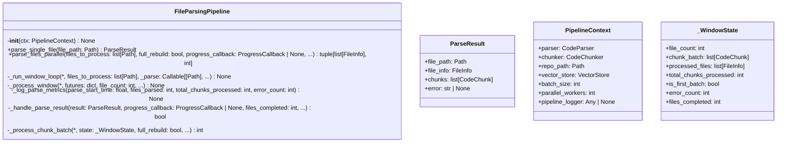

# File: `src/local_deepwiki/core/parsing_pipeline.py`

## File Overview

This file implements a **file parsing and chunking pipeline** for indexing code repositories. It is designed to be a self-contained unit that encapsulates the CPU-bound phases of parsing and chunking, isolating them from the embedding and storage logic handled by other components.

The pipeline is responsible for:
- Parsing individual files using a [`CodeParser`](parser/code_parser.md)
- Breaking files into semantic chunks using a [`CodeChunker`](chunker.md)
- Managing parallel processing of files using a thread pool
- Accumulating chunks into batches for efficient storage in a [`VectorStore`](vectorstore/store.md)
- Emitting events and logging metrics for monitoring and debugging

The design rationale behind this separation is to improve performance, scalability, and maintainability by:
- Offloading CPU-bound tasks to a thread pool to avoid blocking the main thread
- Using a sliding window approach for batched processing to balance memory usage and throughput
- Encapsulating configuration and dependencies in a `PipelineContext` for clean, testable interfaces

## Key Concepts

### 1. **PipelineContext**
The `PipelineContext` class is a **frozen configuration object** that bundles all dependencies and tuning parameters required for a parsing run. This pattern replaces long parameter lists with a single immutable object, improving code readability and testability.

### 2. **Sliding Window Parallel Processing**
The pipeline uses a **sliding window approach** to process files in batches. It divides the list of files into windows and processes each window in parallel using a thread pool. This allows for:
- Efficient resource usage by limiting the number of concurrent file parsing tasks
- Batched storage of chunks to reduce I/O overhead
- Controlled memory consumption by processing files in chunks rather than all at once

### 3. **Chunk Batching and Vector Store Integration**
Chunks are accumulated in a batch until `batch_size` is reached. This batch is then passed to the [`VectorStore`](vectorstore/store.md) for storage. The final batch is handled separately to ensure all chunks are stored. This approach:
- Minimizes the number of I/O operations to the vector store
- Enables efficient handling of large repositories by avoiding memory overflow

### 4. **Error Handling and Logging**
The pipeline gracefully handles parsing errors by returning `ParseResult` objects with error messages instead of raising exceptions. Errors are logged and emitted as events, allowing for monitoring and debugging without halting the entire process.

## Integration

This file is part of the core indexing pipeline in `local_deepwiki`. It is used by:
- `PipelineContext` and `FileParsingPipeline` classes, which are consumed by [`RepositoryIndexer`](indexer.md) and test modules
- The `indexer` module (via `PipelineContext` and `FileParsingPipeline`)
- Test modules (`test_parsing_pipeline_params`) that validate the behavior of the parsing pipeline

It integrates with:
- [`CodeParser`](parser/code_parser.md) and [`CodeChunker`](chunker.md) for parsing and chunking logic
- [`VectorStore`](vectorstore/store.md) for storing parsed chunks
- [`get_event_emitter`](../events.md) for emitting events like `INDEX_ERROR` and `INDEX_FILE`
- [`get_logger`](../logging.md) for logging parse metrics and errors

The file is tightly coupled with the `local_deepwiki.core` module, and its dependencies are drawn from `local_deepwiki.core.chunker`, `local_deepwiki.core.parser`, and `local_deepwiki.core.vectorstore`.

## Design Notes

### **Thread Safety and Concurrency**
The pipeline uses `ThreadPoolExecutor` to manage parallel file parsing. The `_WindowState` class is used to maintain mutable state during processing, which is updated by multiple threads. While the code does not explicitly use locks, the design assumes that `ThreadPoolExecutor` manages thread safety for the futures and that `as_completed` ensures safe access to results.

### **Batching Strategy**
The window size is calculated as `max(batch_size, parallel_workers * 4)` to ensure that:
- Batches are not too small, reducing the frequency of vector store operations
- The number of concurrent threads does not overwhelm the system, especially when `batch_size` is small

### **Final Batch Handling**
The final batch of chunks is processed separately to ensure all chunks are stored, even if they don't fill the `batch_size`. This prevents data loss in the last window.

### **Metrics and Progress Tracking**
The pipeline logs performance metrics including:
- Files parsed per second
- Chunks stored per second
- Total duration of the parsing run
- Number of errors encountered

Progress updates are also provided via the optional [`ProgressCallback`](../models/foundation.md), allowing external systems to track the indexing process.

### **Error Propagation**
Parsing errors are caught and returned as part of `ParseResult`, rather than raised. This allows the pipeline to continue processing other files even if one fails, improving robustness. Errors are logged and emitted as events for external monitoring systems.

## API Reference

### class `PipelineContext`

Immutable configuration for a file-parsing pipeline run.  Bundles the dependencies and tuning knobs that ``FileParsingPipeline`` needs, replacing a long positional/keyword parameter list with a single frozen object.


<details>
<summary>View Source (lines 27-41) | <a href="https://github.com/UrbanDiver/local-deepwiki-mcp/blob/main/src/local_deepwiki/core/parsing_pipeline.py#L27-L41">GitHub</a></summary>

```python
class PipelineContext:
    """Immutable configuration for a file-parsing pipeline run.

    Bundles the dependencies and tuning knobs that ``FileParsingPipeline``
    needs, replacing a long positional/keyword parameter list with a single
    frozen object.
    """

    parser: CodeParser
    chunker: CodeChunker
    repo_path: Path
    vector_store: VectorStore
    batch_size: int
    parallel_workers: int
    pipeline_logger: Any | None = None
```

</details>

### class `ParseResult`

Result of parsing a single file.


<details>
<summary>View Source (lines 63-69) | <a href="https://github.com/UrbanDiver/local-deepwiki-mcp/blob/main/src/local_deepwiki/core/parsing_pipeline.py#L63-L69">GitHub</a></summary>

```python
class ParseResult:
    """Result of parsing a single file."""

    file_path: Path
    file_info: FileInfo
    chunks: list[CodeChunk]
    error: str | None = None
```

</details>

### class `FileParsingPipeline`

Parallel file parsing, chunking, and vector-store ingestion.  This pipeline owns no persistent state — it receives the parser, chunker, and vector store from its caller and orchestrates parsing in a thread pool.

**Methods:**


<details>
<summary>View Source (lines 72-387) | <a href="https://github.com/UrbanDiver/local-deepwiki-mcp/blob/main/src/local_deepwiki/core/parsing_pipeline.py#L72-L387">GitHub</a></summary>

```python
class FileParsingPipeline:
    # Methods: __init__, parse_single_file, parse_files_parallel, _run_window_loop, _process_window, _log_parse_metrics, _handle_parse_result, _process_chunk_batch
```

</details>

#### `__init__`

```python
def __init__(ctx: PipelineContext) -> None
```


| Parameter | Type | Default | Description |
|-----------|------|---------|-------------|
| `ctx` | `PipelineContext` | - | - |


<details>
<summary>View Source (lines 82-90) | <a href="https://github.com/UrbanDiver/local-deepwiki-mcp/blob/main/src/local_deepwiki/core/parsing_pipeline.py#L82-L90">GitHub</a></summary>

```python
def __init__(self, ctx: PipelineContext) -> None:
        self._ctx = ctx
        self.parser = ctx.parser
        self.chunker = ctx.chunker
        self.repo_path = ctx.repo_path
        self.vector_store = ctx.vector_store
        self.batch_size = ctx.batch_size
        self.parallel_workers = ctx.parallel_workers
        self._logger = ctx.pipeline_logger or logger
```

</details>

#### `parse_single_file`

```python
def parse_single_file(file_path: Path) -> ParseResult
```

Parse and chunk a single file (CPU-bound, runs in thread pool).


| Parameter | Type | Default | Description |
|-----------|------|---------|-------------|
| `file_path` | `Path` | - | Path to the file to parse. |


<details>
<summary>View Source (lines 92-114) | <a href="https://github.com/UrbanDiver/local-deepwiki-mcp/blob/main/src/local_deepwiki/core/parsing_pipeline.py#L92-L114">GitHub</a></summary>

```python
def parse_single_file(self, file_path: Path) -> ParseResult:
        """Parse and chunk a single file (CPU-bound, runs in thread pool).

        Args:
            file_path: Path to the file to parse.

        Returns:
            ParseResult with file info and chunks, or error message.
        """
        try:
            file_info = self.parser.get_file_info(file_path, self.repo_path)
            chunks = list(self.chunker.chunk_file(file_path, self.repo_path))
            file_info.chunk_count = len(chunks)
            return ParseResult(file_path=file_path, file_info=file_info, chunks=chunks)
        except (OSError, ValueError, RuntimeError, UnicodeDecodeError) as e:
            # Return error result instead of raising
            file_info = self.parser.get_file_info(file_path, self.repo_path)
            return ParseResult(
                file_path=file_path,
                file_info=file_info,
                chunks=[],
                error=str(e),
            )
```

</details>

#### `parse_files_parallel`

```python
async def parse_files_parallel(files_to_process: list[Path], full_rebuild: bool, progress_callback: ProgressCallback | None, parse_fn: Callable[[Path], ParseResult] | None = None) -> tuple[list[FileInfo], int]
```

Handle parallel file parsing with ThreadPoolExecutor.  Uses multiple threads to parse files concurrently, significantly speeding up indexing for large repositories. Embedding generation remains sequential to respect API rate limits.


| Parameter | Type | Default | Description |
|-----------|------|---------|-------------|
| `files_to_process` | `list[Path]` | - | List of file paths to parse. |
| `full_rebuild` | `bool` | - | If True, this is a full rebuild (affects table creation). |
| `progress_callback` | `ProgressCallback | None` | - | Optional callback for progress updates. |
| `parse_fn` | `Callable[[Path], ParseResult] | None` | `None` | Optional override for the per-file parse function. Defaults to ``self.parse_single_file``. |


<details>
<summary>View Source (lines 116-169) | <a href="https://github.com/UrbanDiver/local-deepwiki-mcp/blob/main/src/local_deepwiki/core/parsing_pipeline.py#L116-L169">GitHub</a></summary>

```python
async def parse_files_parallel(
        self,
        files_to_process: list[Path],
        full_rebuild: bool,
        progress_callback: ProgressCallback | None,
        parse_fn: Callable[[Path], ParseResult] | None = None,
    ) -> tuple[list[FileInfo], int]:
        """Handle parallel file parsing with ThreadPoolExecutor.

        Uses multiple threads to parse files concurrently, significantly speeding up
        indexing for large repositories. Embedding generation remains sequential
        to respect API rate limits.

        Args:
            files_to_process: List of file paths to parse.
            full_rebuild: If True, this is a full rebuild (affects table creation).
            progress_callback: Optional callback for progress updates.
            parse_fn: Optional override for the per-file parse function.
                Defaults to ``self.parse_single_file``.

        Returns:
            Tuple of (processed_files, total_chunks_processed).
        """
        _parse = parse_fn or self.parse_single_file
        file_count = len(files_to_process)
        state = _WindowState(file_count=file_count)

        if file_count == 0:
            self._logger.info("No files to parse")
            return state.processed_files, state.total_chunks_processed

        self._logger.info(
            "Starting parallel file parsing: %d files with %d workers",
            file_count,
            self.parallel_workers,
        )
        parse_start_time = time.time()

        await self._run_window_loop(
            files_to_process=files_to_process,
            _parse=_parse,
            state=state,
            full_rebuild=full_rebuild,
            progress_callback=progress_callback,
        )

        self._log_parse_metrics(
            parse_start_time,
            len(state.processed_files),
            state.total_chunks_processed,
            state.error_count,
        )

        return state.processed_files, state.total_chunks_processed
```

</details>

## Class Diagram



## Call Graph

```mermaid
flowchart TD
    N0[FileParsingPipeline._handle...]
    N1[FileParsingPipeline._log_pa...]
    N2[FileParsingPipeline._proces...]
    N3[FileParsingPipeline._proces...]
    N4[FileParsingPipeline._run_wi...]
    N5[FileParsingPipeline.parse_f...]
    N6[FileParsingPipeline.parse_s...]
    N7[ParseResult]
    N8[ThreadPoolExecutor]
    N9[_WindowState]
    N10[_handle_parse_result]
    N11[_log_parse_metrics]
    N12[_process_chunk_batch]
    N13[_process_window]
    N14[_run_window_loop]
    N15[add_chunks]
    N16[as_completed]
    N17[chunk_file]
    N18[create_or_update_table]
    N19[emit]
    N20[get_event_emitter]
    N21[get_file_info]
    N22[progress_callback]
    N23[result]
    N24[submit]
    N25[time]
    N6 --> N21
    N6 --> N17
    N6 --> N7
    N5 --> N9
    N5 --> N25
    N5 --> N14
    N5 --> N11
    N4 --> N8
    N4 --> N24
    N4 --> N13
    N4 --> N12
    N3 --> N16
    N3 --> N22
    N3 --> N23
    N3 --> N10
    N3 --> N12
    N1 --> N25
    N0 --> N22
    N0 --> N20
    N0 --> N19
    N2 --> N22
    N2 --> N18
    N2 --> N15
    classDef func fill:#e1f5fe
    class N7,N8,N9,N10,N11,N12,N13,N14,N15,N16,N17,N18,N19,N20,N21,N22,N23,N24,N25 func
    classDef method fill:#fff3e0
    class N0,N1,N2,N3,N4,N5,N6 method
```



## Used By

Functions and methods in this file and their callers:

- **`ParseResult`**: called by `FileParsingPipeline.parse_single_file`
- **`ThreadPoolExecutor`**: called by `FileParsingPipeline._run_window_loop`
- **`_WindowState`**: called by `FileParsingPipeline.parse_files_parallel`
- **`_handle_parse_result`**: called by `FileParsingPipeline._process_window`
- **`_log_parse_metrics`**: called by `FileParsingPipeline.parse_files_parallel`
- **`_process_chunk_batch`**: called by `FileParsingPipeline._process_window`, `FileParsingPipeline._run_window_loop`
- **`_process_window`**: called by `FileParsingPipeline._run_window_loop`
- **`_run_window_loop`**: called by `FileParsingPipeline.parse_files_parallel`
- **`add_chunks`**: called by `FileParsingPipeline._process_chunk_batch`
- **`as_completed`**: called by `FileParsingPipeline._process_window`
- **`chunk_file`**: called by `FileParsingPipeline.parse_single_file`
- **`create_or_update_table`**: called by `FileParsingPipeline._process_chunk_batch`
- **`emit`**: called by `FileParsingPipeline._handle_parse_result`
- **[`get_event_emitter`](../events.md)**: called by `FileParsingPipeline._handle_parse_result`
- **`get_file_info`**: called by `FileParsingPipeline.parse_single_file`
- **[`progress_callback`](../handlers/research.md)**: called by `FileParsingPipeline._handle_parse_result`, `FileParsingPipeline._process_chunk_batch`, `FileParsingPipeline._process_window`
- **`result`**: called by `FileParsingPipeline._process_window`
- **`submit`**: called by `FileParsingPipeline._run_window_loop`
- **`time`**: called by `FileParsingPipeline._log_parse_metrics`, `FileParsingPipeline.parse_files_parallel`

## Usage Examples

*Examples extracted from test files*

### Example: `PipelineContext`

From `test_parsing_pipeline_params.py::TestPipelineContext::test_stores_all_fields`:

```python
ctx = PipelineContext(
    parser=parser,
    chunker=chunker,
    repo_path=Path("/repo"),
    vector_store=vs,
    batch_size=32,
    parallel_workers=8,
    pipeline_logger="custom_logger",
)
assert ctx.parser is parser
assert ctx.chunker is chunker
```

### Example: `PipelineContext`

From `test_parsing_pipeline_params.py::TestPipelineContext::test_equality`:

```python
parser = MagicMock()
        chunker = MagicMock()
        vs = MagicMock()
        shared = {
            "parser": parser,
            "chunker": chunker,
            "repo_path": Path("/repo"),
            "vector_store": vs,
            "batch_size": 50,
            "parallel_workers": 4,
        }
        ctx1 = PipelineContext(**shared)
        ctx2 = PipelineContext(**shared)
        assert ctx1 == ctx2
```

### Example: `_WindowState`

From `test_parsing_pipeline_params.py::TestWindowState::test_defaults`:

```python
state = _WindowState()
        assert state.file_count == 0
        assert state.chunk_batch == []
        assert state.processed_files == []
        assert state.total_chunks_processed == 0
        assert state.is_first_batch is True
        assert state.error_count == 0
        assert state.files_completed == 0
```

### Example: `_WindowState`

From `test_parsing_pipeline_params.py::TestWindowState::test_mutable`:

```python
state = _WindowState()
        state.total_chunks_processed = 42
        state.error_count = 3
        state.is_first_batch = False
        state.files_completed = 10
        assert state.total_chunks_processed == 42
        assert state.error_count == 3
```

### Example: `FileParsingPipeline`

From `test_parsing_pipeline_params.py::TestFileParsingPipelineConstruction::test_init_exposes_ctx_fields`:

```python
ctx = _make_context(batch_size=99, parallel_workers=7)
        pipeline = FileParsingPipeline(ctx)
        assert pipeline.batch_size == 99
        assert pipeline.parallel_workers == 7
        assert pipeline.parser is ctx.parser
        assert pipeline.chunker is ctx.chunker
        assert pipeline.repo_path == ctx.repo_path
        assert pipeline.vector_store is ctx.vector_store
        assert pipeline._ctx is ctx
```


## Last Modified

| Entity | Type | Author | Date | Commit |
|--------|------|--------|------|--------|
| `PipelineContext` | class | Brian Breidenbach | yesterday | `1eef062` refactor: complete Grade A ... |
| `_WindowState` | class | Brian Breidenbach | yesterday | `1eef062` refactor: complete Grade A ... |
| `FileParsingPipeline` | class | Brian Breidenbach | yesterday | `1eef062` refactor: complete Grade A ... |
| `__init__` | method | Brian Breidenbach | yesterday | `1eef062` refactor: complete Grade A ... |
| `parse_files_parallel` | method | Brian Breidenbach | yesterday | `1eef062` refactor: complete Grade A ... |
| `_run_window_loop` | method | Brian Breidenbach | yesterday | `1eef062` refactor: complete Grade A ... |
| `_process_window` | method | Brian Breidenbach | yesterday | `1eef062` refactor: complete Grade A ... |
| `_process_chunk_batch` | method | Brian Breidenbach | yesterday | `1eef062` refactor: complete Grade A ... |
| `_log_parse_metrics` | method | Brian Breidenbach | 1 week ago | `291b747` refactor: extract helpers f... |
| `_handle_parse_result` | method | Brian Breidenbach | 1 week ago | `af244a5` refactor: split core hotspo... |
| `ParseResult` | class | Brian Breidenbach | Feb 23, 2026 | `3aeaa22` refactor: split _shared.py ... |
| `parse_single_file` | method | Brian Breidenbach | Feb 23, 2026 | `3aeaa22` refactor: split _shared.py ... |

## Additional Source Code

Source code for functions and methods not listed in the API Reference above.

### `_WindowState`

<details>
<summary>View Source (lines 45-59) | <a href="https://github.com/UrbanDiver/local-deepwiki-mcp/blob/main/src/local_deepwiki/core/parsing_pipeline.py#L45-L59">GitHub</a></summary>

```python
class _WindowState:
    """Mutable running state threaded through the sliding-window loop.

    Keeps the accumulating counters and batch buffer in one place so that
    ``_run_window_loop`` and ``_process_window`` don't need long parameter
    lists.
    """

    file_count: int = 0
    chunk_batch: list[CodeChunk] = field(default_factory=list)
    processed_files: list[FileInfo] = field(default_factory=list)
    total_chunks_processed: int = 0
    is_first_batch: bool = True
    error_count: int = 0
    files_completed: int = 0
```

</details>


#### `_run_window_loop`

<details>
<summary>View Source (lines 171-207) | <a href="https://github.com/UrbanDiver/local-deepwiki-mcp/blob/main/src/local_deepwiki/core/parsing_pipeline.py#L171-L207">GitHub</a></summary>

```python
async def _run_window_loop(
        self,
        *,
        files_to_process: list[Path],
        _parse: Callable[[Path], ParseResult],
        state: _WindowState,
        full_rebuild: bool,
        progress_callback: ProgressCallback | None,
    ) -> None:
        """Process all files in windows and flush chunk batches.

        Mutates *state* in place with final counts.
        """
        file_count = len(files_to_process)
        window_size = max(self.batch_size, self.parallel_workers * 4)
        with ThreadPoolExecutor(max_workers=self.parallel_workers) as executor:
            for window_start in range(0, file_count, window_size):
                window_end = min(window_start + window_size, file_count)
                window_files = files_to_process[window_start:window_end]
                futures = {executor.submit(_parse, fp): fp for fp in window_files}
                await self._process_window(
                    futures=futures,
                    file_count=file_count,
                    state=state,
                    full_rebuild=full_rebuild,
                    progress_callback=progress_callback,
                )
        if state.chunk_batch:
            # For the final flush, files_completed == file_count
            state.files_completed = file_count
            chunks_stored = await self._process_chunk_batch(
                state=state,
                full_rebuild=full_rebuild,
                progress_callback=progress_callback,
                is_final=True,
            )
            state.total_chunks_processed += chunks_stored
```

</details>


#### `_process_window`

<details>
<summary>View Source (lines 209-262) | <a href="https://github.com/UrbanDiver/local-deepwiki-mcp/blob/main/src/local_deepwiki/core/parsing_pipeline.py#L209-L262">GitHub</a></summary>

```python
async def _process_window(
        self,
        *,
        futures: dict,
        file_count: int,
        state: _WindowState,
        full_rebuild: bool,
        progress_callback: ProgressCallback | None,
    ) -> None:
        """Iterate completed futures for one sliding window, collecting results.

        Mutates *state* in place with updated counts and batch contents.

        Args:
            futures: Mapping of Future -> file_path for the current window.
            file_count: Total number of files in the entire parse run.
            state: Mutable running state for the window loop.
            full_rebuild: Passed through to ``_process_chunk_batch``.
            progress_callback: Optional progress callback.
        """
        for future in as_completed(futures):
            file_path = futures[future]
            if progress_callback:
                progress_callback(
                    f"Parsing {file_path.name}",
                    state.files_completed,
                    file_count,
                )

            result = future.result()
            skipped = await self._handle_parse_result(
                result,
                progress_callback,
                state.files_completed,
                file_count,
                state.chunk_batch,
                state.processed_files,
            )
            if skipped:
                state.error_count += 1
                state.files_completed += 1
                continue

            if len(state.chunk_batch) >= self.batch_size:
                chunks_stored = await self._process_chunk_batch(
                    state=state,
                    full_rebuild=full_rebuild,
                    progress_callback=progress_callback,
                )
                state.total_chunks_processed += chunks_stored
                state.is_first_batch = False
                state.chunk_batch.clear()

            state.files_completed += 1
```

</details>


#### `_log_parse_metrics`

<details>
<summary>View Source (lines 264-295) | <a href="https://github.com/UrbanDiver/local-deepwiki-mcp/blob/main/src/local_deepwiki/core/parsing_pipeline.py#L264-L295">GitHub</a></summary>

```python
def _log_parse_metrics(
        self,
        parse_start_time: float,
        files_parsed: int,
        total_chunks_processed: int,
        error_count: int,
    ) -> None:
        """Log a summary of parallel parsing performance.

        Args:
            parse_start_time: ``time.time()`` recorded before parsing started.
            files_parsed: Number of files successfully parsed.
            total_chunks_processed: Total chunks stored to the vector store.
            error_count: Number of files that failed to parse.
        """
        parse_duration = time.time() - parse_start_time
        files_per_second = files_parsed / parse_duration if parse_duration > 0 else 0
        chunks_per_second = (
            total_chunks_processed / parse_duration if parse_duration > 0 else 0
        )

        self._logger.info(
            "Parallel parsing complete: %d files, %d chunks in %.2fs "
            "(%.1f files/s, %.1f chunks/s, %d workers, %d errors)",
            files_parsed,
            total_chunks_processed,
            parse_duration,
            files_per_second,
            chunks_per_second,
            self.parallel_workers,
            error_count,
        )
```

</details>


#### `_handle_parse_result`

<details>
<summary>View Source (lines 297-352) | <a href="https://github.com/UrbanDiver/local-deepwiki-mcp/blob/main/src/local_deepwiki/core/parsing_pipeline.py#L297-L352">GitHub</a></summary>

```python
async def _handle_parse_result(
        self,
        result: ParseResult,
        progress_callback: ProgressCallback | None,
        files_completed: int,
        file_count: int,
        chunk_batch: list[CodeChunk],
        processed_files: list[FileInfo],
    ) -> bool:
        """Handle a single parsed file result, emitting events and updating state.

        Args:
            result: The ParseResult from parsing a single file.
            progress_callback: Optional progress callback.
            files_completed: Number of files already completed (for callback).
            file_count: Total number of files (for callback).
            chunk_batch: Mutable list to append chunks to (mutated in place).
            processed_files: Mutable list to append successful FileInfo to.

        Returns:
            True if the file had an error and should be counted as skipped.
        """
        if result.error:
            self._logger.warning(
                "Error processing %s: %s", result.file_path, result.error
            )
            if progress_callback:
                progress_callback(
                    f"Error processing {result.file_path}: {result.error}",
                    files_completed,
                    file_count,
                )
            emitter = get_event_emitter()
            await emitter.emit(
                EventType.INDEX_ERROR,
                {"file_path": str(result.file_path), "error": result.error},
            )
            return True

        chunk_batch.extend(result.chunks)
        processed_files.append(result.file_info)

        emitter = get_event_emitter()
        await emitter.emit(
            EventType.INDEX_FILE,
            {
                "file_path": str(result.file_path),
                "language": (
                    result.file_info.language.value
                    if result.file_info.language
                    else None
                ),
                "chunk_count": len(result.chunks),
            },
        )
        return False
```

</details>


#### `_process_chunk_batch`

<details>
<summary>View Source (lines 354-387) | <a href="https://github.com/UrbanDiver/local-deepwiki-mcp/blob/main/src/local_deepwiki/core/parsing_pipeline.py#L354-L387">GitHub</a></summary>

```python
async def _process_chunk_batch(
        self,
        *,
        state: _WindowState,
        full_rebuild: bool,
        progress_callback: ProgressCallback | None,
        is_final: bool = False,
    ) -> int:
        """Process a batch of chunks and store in vector store.

        Args:
            state: Window state whose ``chunk_batch``, ``is_first_batch``,
                ``files_completed``, and ``file_count`` are read.
            full_rebuild: If True, may need to create table on first batch.
            progress_callback: Optional callback for progress updates.
            is_final: True if this is the final batch.

        Returns:
            Number of chunks processed.
        """
        batch_type = "final batch" if is_final else "batch"
        if progress_callback:
            progress_callback(
                f"Storing {batch_type} of {len(state.chunk_batch)} chunks...",
                state.files_completed,
                state.file_count,
            )

        if full_rebuild and state.is_first_batch:
            await self.vector_store.create_or_update_table(state.chunk_batch)
        else:
            await self.vector_store.add_chunks(state.chunk_batch)

        return len(state.chunk_batch)
```

</details>

## Relevant Source Files

- `src/local_deepwiki/core/parsing_pipeline.py:27-41`
