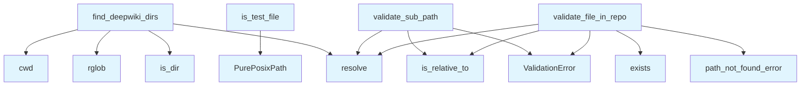

# File: `src/local_deepwiki/core/path_utils.py`

## File Overview

This module provides shared path validation utilities to prevent path traversal attacks and enforce safe file access within the repository. It consolidates repeated patterns of resolving and validating paths across various handler modules into reusable helpers, improving maintainability and security.

The file is responsible for ensuring that file and directory paths used in the application are safe and within expected boundaries, especially when dealing with user-provided or dynamic inputs.

## Key Concepts

### Path Validation Patterns
This module introduces two core validation functions:

- `validate_file_in_repo`: Ensures a file path is both within the repository root and exists on the filesystem.
- `validate_sub_path`: Validates that a path is within a given root directory but does not require the path to exist (useful for wiki page paths or other non-existent files).

These functions are designed to prevent path traversal vulnerabilities by using `.resolve()` and checking `.is_relative_to()`.

### Test File Detection
The `is_test_file` function provides a heuristic to identify whether a given file path corresponds to a test file, based on directory membership (e.g., inside a `test` directory) and filename patterns such as `test_*`, `*_test.py`, or `conftest*`.

This abstraction helps components like the dependency graph generator or source filters to exclude test files from processing when necessary.

### Directory Discovery
The `find_deepwiki_dirs` function scans a directory tree for `.deepwiki` directories, which are used to identify the root of DeepWiki projects. This is essential for locating configuration and data files associated with each DeepWiki instance.

## Integration

This module is a foundational utility used across the DeepWiki codebase:

- **Called by**: Several modules including `dependency_graph_data`, `source_filter`, `generator_service`, and others, to validate paths and locate DeepWiki project roots.
- **Imports From**: 
  - `pathlib.Path` and `PurePosixPath` for path manipulation.
  - [`local_deepwiki.errors.ValidationError`](../errors.md) and [`path_not_found_error`](../error_factories.md) for consistent error handling.
  - [`local_deepwiki.logging.get_logger`](../logging.md) for logging warnings during directory scans.

It integrates closely with CLI tools (`main.py`, `config_validator.py`) and generators (`tours.py`, `pages.py`) that need to work with file paths safely and reliably.

## Design Notes

### Security Considerations
The module is designed to prevent path traversal attacks by ensuring that all resolved paths are within the allowed root. This is done using `.is_relative_to()` after `.resolve()`, which ensures that symbolic links and complex paths are handled safely.

### Cross-Platform Compatibility
Path handling uses `PurePosixPath` for consistent parsing of paths regardless of the operating system, while `Path` is used for actual filesystem operations. This ensures that logic works the same across platforms, especially important when dealing with paths that may be constructed from user input.

### Error Handling
- [`ValidationError`](../errors.md) is used for invalid paths to provide structured error messages.
- `find_deepwiki_dirs` gracefully handles `PermissionError` and `OSError` when scanning directories, logging warnings instead of crashing.

### Test File Heuristics
The `is_test_file` function uses both directory membership and filename heuristics to identify test files. The `check_filename` parameter allows callers to control whether filename patterns are considered, providing flexibility for different use cases (e.g., excluding test files in some contexts but not others).

### Performance Considerations
- Path resolution and `.is_relative_to()` are lightweight checks, suitable for frequent use.
- `find_deepwiki_dirs` uses `rglob` for recursive discovery, which is efficient for typical directory structures.

By centralizing these path utilities, the module reduces code duplication and improves consistency in how paths are validated and used across the codebase.

## API Reference

### Functions

#### `validate_file_in_repo`

```python
def validate_file_in_repo(repo_path: Path, file_path: str) -> Path
```

Validate that *file_path* resolves inside *repo_path* and exists.


| Parameter | Type | Default | Description |
|-----------|------|---------|-------------|
| `repo_path` | `Path` | - | Resolved repository root (must already be ``.resolve()``'d). |
| `file_path` | `str` | - | Relative file path supplied by the caller. |

**Returns:** `Path`


<details>
<summary>View Source (lines 17-40) | <a href="https://github.com/UrbanDiver/local-deepwiki-mcp/blob/main/src/local_deepwiki/core/path_utils.py#L17-L40">GitHub</a></summary>

```python
def validate_file_in_repo(repo_path: Path, file_path: str) -> Path:
    """Validate that *file_path* resolves inside *repo_path* and exists.

    Args:
        repo_path: Resolved repository root (must already be ``.resolve()``'d).
        file_path: Relative file path supplied by the caller.

    Returns:
        The resolved absolute path to the file.

    Raises:
        ValidationError: If the path escapes the repo or does not exist.
    """
    resolved = (repo_path / file_path).resolve()
    if not resolved.is_relative_to(repo_path):
        raise ValidationError(
            message="Invalid file path: path traversal not allowed",
            hint="The file path must be within the repository.",
            field="file_path",
            value=file_path,
        )
    if not resolved.exists():
        raise path_not_found_error(file_path, "file")
    return resolved
```

</details>

#### `validate_sub_path`

```python
def validate_sub_path(root: Path, sub_path: str, field: str = "page", value: str | None = None, hint: str = "The path must be within the parent directory.") -> Path
```

Validate that *sub_path* resolves inside *root* (no existence check).  A more general helper used for wiki-page paths and similar cases where the file may not exist yet.


| Parameter | Type | Default | Description |
|-----------|------|---------|-------------|
| `root` | `Path` | - | Resolved root directory. |
| `sub_path` | `str` | - | Relative path supplied by the caller. |
| `field` | `str` | `"page"` | Field name for the error payload. |
| `value` | `str | None` | `None` | Value for the error payload (defaults to *sub_path*). |
| `hint` | `str` | `"The path must be within the parent directory."` | Human-readable hint for the error message. |

**Returns:** `Path`


<details>
<summary>View Source (lines 43-77) | <a href="https://github.com/UrbanDiver/local-deepwiki-mcp/blob/main/src/local_deepwiki/core/path_utils.py#L43-L77">GitHub</a></summary>

```python
def validate_sub_path(
    root: Path,
    sub_path: str,
    *,
    field: str = "page",
    value: str | None = None,
    hint: str = "The path must be within the parent directory.",
) -> Path:
    """Validate that *sub_path* resolves inside *root* (no existence check).

    A more general helper used for wiki-page paths and similar cases where
    the file may not exist yet.

    Args:
        root: Resolved root directory.
        sub_path: Relative path supplied by the caller.
        field: Field name for the error payload.
        value: Value for the error payload (defaults to *sub_path*).
        hint: Human-readable hint for the error message.

    Returns:
        The resolved absolute path.

    Raises:
        ValidationError: If the path escapes *root*.
    """
    resolved = (root / sub_path).resolve()
    if not resolved.is_relative_to(root):
        raise ValidationError(
            message="Path traversal not allowed",
            hint=hint,
            field=field,
            value=value if value is not None else sub_path,
        )
    return resolved
```

</details>

#### `is_test_file`

```python
def is_test_file(path: str, check_filename: bool = True) -> bool
```

Check if a file path looks like a test file.


| Parameter | Type | Default | Description |
|-----------|------|---------|-------------|
| `path` | `str` | - | File path (relative or absolute, POSIX or Windows). |
| `check_filename` | `bool` | `True` | When True, also match filename patterns like ``test_*``, ``*_test.py``, and ``conftest*``.  Set to False to only check directory membership. |

**Returns:** `bool`


<details>
<summary>View Source (lines 83-108) | <a href="https://github.com/UrbanDiver/local-deepwiki-mcp/blob/main/src/local_deepwiki/core/path_utils.py#L83-L108">GitHub</a></summary>

```python
def is_test_file(path: str, *, check_filename: bool = True) -> bool:
    """Check if a file path looks like a test file.

    Args:
        path: File path (relative or absolute, POSIX or Windows).
        check_filename: When True, also match filename patterns like
            ``test_*``, ``*_test.py``, and ``conftest*``.  Set to False
            to only check directory membership.

    Returns:
        True if the file appears to be a test file.
    """
    parts = PurePosixPath(path.replace("\\", "/")).parts
    if any(p in _TEST_DIR_NAMES for p in parts):
        return True
    if check_filename:
        name = parts[-1] if parts else path
        if (
            name.startswith("test_")
            or name.endswith("_test.py")
            or name.startswith("conftest")
            or ".test." in name
            or ".spec." in name
        ):
            return True
    return False
```

</details>

#### `find_deepwiki_dirs`

```python
def find_deepwiki_dirs(base_path: Path | None = None) -> list[Path]
```

Find ``.deepwiki`` directories under *base_path* (or cwd).


| Parameter | Type | Default | Description |
|-----------|------|---------|-------------|
| `base_path` | `Path | None` | `None` | Directory to search. Defaults to ``Path.cwd()``. |

**Returns:** `list[Path]`


<details>
<summary>View Source (lines 111-128) | <a href="https://github.com/UrbanDiver/local-deepwiki-mcp/blob/main/src/local_deepwiki/core/path_utils.py#L111-L128">GitHub</a></summary>

```python
def find_deepwiki_dirs(base_path: Path | None = None) -> list[Path]:
    """Find ``.deepwiki`` directories under *base_path* (or cwd).

    Args:
        base_path: Directory to search. Defaults to ``Path.cwd()``.

    Returns:
        Sorted list of resolved paths to ``.deepwiki`` directories.
    """
    root = (base_path or Path.cwd()).resolve()
    results: list[Path] = []
    try:
        for candidate in root.rglob(".deepwiki"):
            if candidate.is_dir():
                results.append(candidate.resolve())
    except (PermissionError, OSError) as e:
        logger.warning("Error scanning for wiki directories: %s", e)
    return sorted(results)
```

</details>

## Call Graph



## Used By

Functions and methods in this file and their callers:

- **`PurePosixPath`**: called by `is_test_file`
- **[`ValidationError`](../errors.md)**: called by `validate_file_in_repo`, `validate_sub_path`
- **`cwd`**: called by `find_deepwiki_dirs`
- **`exists`**: called by `validate_file_in_repo`
- **`is_dir`**: called by `find_deepwiki_dirs`
- **`is_relative_to`**: called by `validate_file_in_repo`, `validate_sub_path`
- **[`path_not_found_error`](../error_factories.md)**: called by `validate_file_in_repo`
- **`resolve`**: called by `find_deepwiki_dirs`, `validate_file_in_repo`, `validate_sub_path`
- **`rglob`**: called by `find_deepwiki_dirs`

## Last Modified

| Entity | Type | Author | Date | Commit |
|--------|------|--------|------|--------|
| `is_test_file` | function | Brian Breidenbach | 1 week ago | `fd8bb32` fix: code quality — consoli... |
| `validate_file_in_repo` | function | Brian Breidenbach | Feb 20, 2026 | `6be69f5` refactor: low-priority Pyth... |
| `validate_sub_path` | function | Brian Breidenbach | Feb 20, 2026 | `6be69f5` refactor: low-priority Pyth... |
| `find_deepwiki_dirs` | function | Brian Breidenbach | Feb 20, 2026 | `6be69f5` refactor: low-priority Pyth... |

## Relevant Source Files

- `src/local_deepwiki/core/path_utils.py:17-40`
