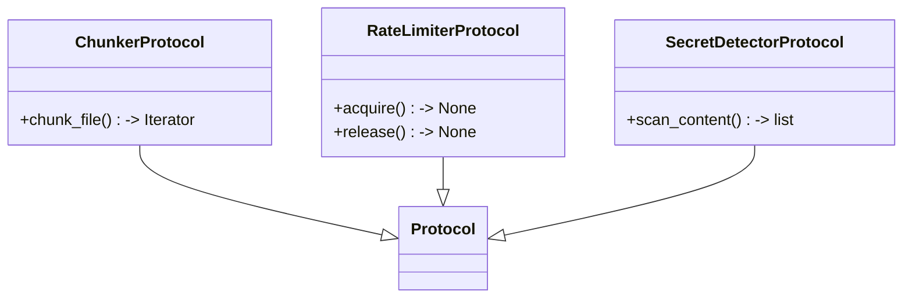

# File: `src/local_deepwiki/core/protocols.py`

## File Overview

This file defines protocol interfaces for core components in the `local_deepwiki` project. These protocols serve as structural typing contracts that allow for dependency injection, testing, and loose coupling between components. By using `typing.Protocol` with `@runtime_checkable`, the project ensures that classes conforming to these interfaces can be validated at runtime, improving maintainability and testability.

The protocols defined here are used throughout the core package to abstract away concrete implementations, enabling developers to swap out strategies or provide mock objects during testing without modifying the calling code.

## Key Concepts

### Structural Typing with Protocols
The use of `typing.Protocol` is a design choice to enforce structural typing rather than nominal typing. This allows for greater flexibility in implementation while maintaining a consistent interface. Each protocol defines the expected method signatures and return types, ensuring that any class implementing the protocol will be compatible with code that expects that interface.

### Dependency Injection and Testing
These protocols support dependency injection by allowing components to accept protocol types instead of concrete classes. This is particularly useful in testing, where developers can inject mock or stub implementations without affecting the behavior of the system under test. For example, a `SecretDetectorProtocol` can be replaced with a test double to simulate secret detection without actually scanning real code.

### Runtime Checkability
All protocols in this file are marked with `@runtime_checkable`, which allows for runtime validation using `isinstance()`. This feature is essential for runtime diagnostics and guards, ensuring that objects passed into functions conform to expected interfaces at runtime rather than only at type-checking time.

## Integration

This file is imported by several modules within the `local_deepwiki` project, particularly those in the `generators` subpackages. The protocols defined here are used to define interfaces for core components that are consumed by:

- `src/local_deepwiki/generators/analysis/api_docs.py`
- `src/local_deepwiki/generators/analysis/architecture_compare.py`
- `src/local_deepwiki/generators/analysis/smells_page.py`
- `src/local_deepwiki/generators/analysis/tours.py`
- `src/local_deepwiki/generators/diagrams/dependency_diagram.py`

These modules likely depend on components that implement `ChunkerProtocol`, `SecretDetectorProtocol`, or `RateLimiterProtocol` to perform their respective tasks. For example, a code analysis generator might use a `ChunkerProtocol` to break source files into semantic units before analyzing them.

## Design Notes

### Protocol Abstraction Strategy
The choice to define these protocols in a dedicated `protocols.py` file is a common pattern for organizing abstract interfaces. This approach separates concerns by keeping implementation details out of the interface definitions and centralizes the contracts for core components.

### Asynchronous Interface for Rate Limiting
The `RateLimiterProtocol` includes an asynchronous `acquire` method, which suggests that the project anticipates using async/await patterns for handling rate-limited API calls. This design choice reflects modern Python practices for handling I/O-bound operations efficiently.

### Iterator Return Types
The `chunk_file` method in `ChunkerProtocol` returns `Iterator`, which is a generic type from `collections.abc`. This is a flexible approach that allows for various iterator implementations (e.g., generators) to be used without constraining the return type to a specific class.

### Minimal Interface Design
Each protocol defines only the methods necessary for its specific domain, following the principle of least privilege. This minimizes coupling and makes it easier to implement alternative strategies or mocks. For instance, `SecretDetectorProtocol` only requires a `scan_content` method, which is sufficient for most scanning tasks without overloading the interface with unnecessary methods.

## API Reference

### class `ChunkerProtocol`

**Inherits from:** `Protocol`

Protocol defining the interface for code chunkers.  Any object that can split a source file into semantic code chunks satisfies this contract.  Used for dependency injection — test stubs and alternative chunking strategies can be validated with ``isinstance(obj, ChunkerProtocol)``.

**Methods:**


<details>
<summary>View Source (lines 20-39) | <a href="https://github.com/UrbanDiver/local-deepwiki-mcp/blob/main/src/local_deepwiki/core/protocols.py#L20-L39">GitHub</a></summary>

```python
class ChunkerProtocol(Protocol):
    """Protocol defining the interface for code chunkers.

    Any object that can split a source file into semantic code chunks
    satisfies this contract.  Used for dependency injection — test stubs
    and alternative chunking strategies can be validated with
    ``isinstance(obj, ChunkerProtocol)``.
    """

    def chunk_file(self, file_path: Path, repo_root: Path) -> Iterator:
        """Extract semantic code chunks from a source file.

        Args:
            file_path: Path to the source file.
            repo_root: Root directory of the repository.

        Yields:
            CodeChunk objects for each semantic unit found.
        """
        ...
```

</details>

#### `chunk_file`

```python
def chunk_file(file_path: Path, repo_root: Path) -> Iterator
```

Extract semantic code chunks from a source file.


| Parameter | Type | Default | Description |
|-----------|------|---------|-------------|
| `file_path` | `Path` | - | Path to the source file. |
| `repo_root` | `Path` | - | Root directory of the repository. |


<details>
<summary>View Source (lines 20-39) | <a href="https://github.com/UrbanDiver/local-deepwiki-mcp/blob/main/src/local_deepwiki/core/protocols.py#L20-L39">GitHub</a></summary>

```python
class ChunkerProtocol(Protocol):
    """Protocol defining the interface for code chunkers.

    Any object that can split a source file into semantic code chunks
    satisfies this contract.  Used for dependency injection — test stubs
    and alternative chunking strategies can be validated with
    ``isinstance(obj, ChunkerProtocol)``.
    """

    def chunk_file(self, file_path: Path, repo_root: Path) -> Iterator:
        """Extract semantic code chunks from a source file.

        Args:
            file_path: Path to the source file.
            repo_root: Root directory of the repository.

        Yields:
            CodeChunk objects for each semantic unit found.
        """
        ...
```

</details>

### class `SecretDetectorProtocol`

**Inherits from:** `Protocol`

Protocol defining the interface for secret detection.  Components that scan code for hardcoded credentials should accept this Protocol so that lightweight test doubles can be substituted without subclassing the concrete `[`SecretDetector`](secret_detector.md)`.

**Methods:**


<details>
<summary>View Source (lines 43-67) | <a href="https://github.com/UrbanDiver/local-deepwiki-mcp/blob/main/src/local_deepwiki/core/protocols.py#L43-L67">GitHub</a></summary>

```python
class SecretDetectorProtocol(Protocol):
    """Protocol defining the interface for secret detection.

    Components that scan code for hardcoded credentials should accept
    this Protocol so that lightweight test doubles can be substituted
    without subclassing the concrete ``SecretDetector``.
    """

    def scan_content(
        self,
        content: str,
        file_path: str,
        start_line: int = 0,
    ) -> list:
        """Scan code content for secrets.

        Args:
            content: Code content to scan.
            file_path: Path to file (for reporting).
            start_line: Starting line number offset.

        Returns:
            List of SecretFinding objects for detected secrets.
        """
        ...
```

</details>

#### `scan_content`

```python
def scan_content(content: str, file_path: str, start_line: int = 0) -> list
```

Scan code content for secrets.


| Parameter | Type | Default | Description |
|-----------|------|---------|-------------|
| `content` | `str` | - | Code content to scan. |
| `file_path` | `str` | - | Path to file (for reporting). |
| `start_line` | `int` | `0` | Starting line number offset. |


<details>
<summary>View Source (lines 43-67) | <a href="https://github.com/UrbanDiver/local-deepwiki-mcp/blob/main/src/local_deepwiki/core/protocols.py#L43-L67">GitHub</a></summary>

```python
class SecretDetectorProtocol(Protocol):
    """Protocol defining the interface for secret detection.

    Components that scan code for hardcoded credentials should accept
    this Protocol so that lightweight test doubles can be substituted
    without subclassing the concrete ``SecretDetector``.
    """

    def scan_content(
        self,
        content: str,
        file_path: str,
        start_line: int = 0,
    ) -> list:
        """Scan code content for secrets.

        Args:
            content: Code content to scan.
            file_path: Path to file (for reporting).
            start_line: Starting line number offset.

        Returns:
            List of SecretFinding objects for detected secrets.
        """
        ...
```

</details>

### class `RateLimiterProtocol`

**Inherits from:** `Protocol`

Protocol defining the interface for rate limiters.  Components that throttle API calls should accept this Protocol rather than the concrete `[`RateLimiter`](vectorstore/utils.md)` class so that tests can supply a no-op limiter.

**Methods:**


<details>
<summary>View Source (lines 71-89) | <a href="https://github.com/UrbanDiver/local-deepwiki-mcp/blob/main/src/local_deepwiki/core/protocols.py#L71-L89">GitHub</a></summary>

```python
class RateLimiterProtocol(Protocol):
    """Protocol defining the interface for rate limiters.

    Components that throttle API calls should accept this Protocol
    rather than the concrete ``RateLimiter`` class so that tests can
    supply a no-op limiter.
    """

    async def acquire(self) -> None:
        """Acquire permission to make a request.

        Blocks if rate limited, or raises ``RateLimitExceeded``
        if the limit cannot be waited for.
        """
        ...

    def release(self) -> None:
        """Release the burst semaphore after request completes."""
        ...
```

</details>

#### `acquire`

```python
async def acquire() -> None
```

Acquire permission to make a request.  Blocks if rate limited, or raises `[`RateLimitExceeded`](rate_limiter.md)` if the limit cannot be waited for.


<details>
<summary>View Source (lines 71-89) | <a href="https://github.com/UrbanDiver/local-deepwiki-mcp/blob/main/src/local_deepwiki/core/protocols.py#L71-L89">GitHub</a></summary>

```python
class RateLimiterProtocol(Protocol):
    """Protocol defining the interface for rate limiters.

    Components that throttle API calls should accept this Protocol
    rather than the concrete ``RateLimiter`` class so that tests can
    supply a no-op limiter.
    """

    async def acquire(self) -> None:
        """Acquire permission to make a request.

        Blocks if rate limited, or raises ``RateLimitExceeded``
        if the limit cannot be waited for.
        """
        ...

    def release(self) -> None:
        """Release the burst semaphore after request completes."""
        ...
```

</details>

#### `release`

```python
def release() -> None
```

Release the burst semaphore after request completes.


<details>
<summary>View Source (lines 71-89) | <a href="https://github.com/UrbanDiver/local-deepwiki-mcp/blob/main/src/local_deepwiki/core/protocols.py#L71-L89">GitHub</a></summary>

```python
class RateLimiterProtocol(Protocol):
    """Protocol defining the interface for rate limiters.

    Components that throttle API calls should accept this Protocol
    rather than the concrete ``RateLimiter`` class so that tests can
    supply a no-op limiter.
    """

    async def acquire(self) -> None:
        """Acquire permission to make a request.

        Blocks if rate limited, or raises ``RateLimitExceeded``
        if the limit cannot be waited for.
        """
        ...

    def release(self) -> None:
        """Release the burst semaphore after request completes."""
        ...
```

</details>

## Class Diagram



## Usage Examples

*Examples extracted from test files*

### Example: `protocols`

From `test_protocols.py::TestChunkerProtocol::test_runtime_checkable`:

```python
assert hasattr(ChunkerProtocol, "__protocol_attrs__") or hasattr(
            ChunkerProtocol, "__abstractmethods__"
        )
        # runtime_checkable protocols support isinstance
        assert isinstance(ChunkerProtocol, type)
```

### Example: `ChunkerProtocol`

From `test_protocols.py::TestChunkerProtocol::test_runtime_checkable`:

```python
assert hasattr(ChunkerProtocol, "__protocol_attrs__") or hasattr(
            ChunkerProtocol, "__abstractmethods__"
        )
        # runtime_checkable protocols support isinstance
        assert isinstance(ChunkerProtocol, type)
```

### Example: `ChunkerProtocol`

From `test_protocols.py::TestChunkerProtocol::test_concrete_class_satisfies_protocol`:

```python
from local_deepwiki.core.chunker import CodeChunker

        chunker = CodeChunker()
        assert isinstance(chunker, ChunkerProtocol)
```

### Example: `SecretDetectorProtocol`

From `test_protocols.py::TestSecretDetectorProtocol::test_runtime_checkable`:

```python
assert isinstance(SecretDetectorProtocol, type)
```

### Example: `SecretDetectorProtocol`

From `test_protocols.py::TestSecretDetectorProtocol::test_concrete_class_satisfies_protocol`:

```python
from local_deepwiki.core.secret_detector import SecretDetector

        detector = SecretDetector()
        assert isinstance(detector, SecretDetectorProtocol)
```


## Last Modified

| Entity | Type | Author | Date | Commit |
|--------|------|--------|------|--------|
| `ChunkerProtocol` | class | Brian Breidenbach | yesterday | `1eef062` refactor: complete Grade A ... |
| `SecretDetectorProtocol` | class | Brian Breidenbach | yesterday | `1eef062` refactor: complete Grade A ... |
| `RateLimiterProtocol` | class | Brian Breidenbach | yesterday | `1eef062` refactor: complete Grade A ... |

## Relevant Source Files

- `src/local_deepwiki/core/protocols.py:20-39`

## See Also

- [cli_progress](../cli_progress.md) - shares 3 dependencies
- [_response](../handlers/_response.md) - shares 2 dependencies