# File: `src/local_deepwiki/core/rate_limiter.py`

## File Overview

This module provides rate limiting functionality to prevent API quota exhaustion when making calls to LLM and embedding providers. It implements a sliding window approach for both minute and hour limits, with support for burst limiting to control concurrent requests.

The module is designed to be used in asynchronous environments where multiple concurrent API calls may occur. It provides both a global rate limiter instance and configuration utilities to customize behavior for different environments or providers.

## Key Concepts

### Rate Limiting Strategy

The rate limiter uses a **sliding window algorithm** for both minute and hour limits. This approach ensures that rate limits are enforced more fairly over time, rather than using a fixed bucket approach that could allow bursts at window boundaries.

- **Minute Window**: Tracks requests within a 60-second window.
- **Hour Window**: Tracks requests within a 3600-second window.

### Burst Limiting

The implementation includes **burst limiting** via `asyncio.Semaphore`. This ensures that even if the rate limits are not exceeded, the number of concurrent requests is capped to prevent overwhelming the API.

### Asynchronous Context Management

The `RateLimiter` class implements `__aenter__` and `__aexit__` to support use as an async context manager, which simplifies usage patterns where a request must be acquired and released automatically.

### Exception Handling

The `RateLimitExceeded` exception is raised when an hour limit is exceeded and waiting is not configured. This prevents indefinite blocking in cases where waiting for an hour reset would be impractical.

## Integration

This module is used across multiple parts of the local_deepwiki project for controlling API call frequency. It's integrated into:

- CLI tools (`src/local_deepwiki/cli/main.py`, `src/local_deepwiki/cli/status_cli.py`)
- Configuration loading (`src/local_deepwiki/config/loader.py`)
- API call generation (`src/local_deepwiki/generators/analysis/api_docs.py`)

The global rate limiter instance is accessed via `get_rate_limiter()` and can be configured at application startup using `configure_rate_limiter()`. This allows the rate limiter to be shared across different modules and components that make API calls, ensuring consistent rate limiting behavior throughout the application.

## Design Notes

### Thread Safety and Concurrency

The implementation uses `asyncio.Lock` and `asyncio.Semaphore` to ensure thread safety in asynchronous contexts. The lock ensures that only one coroutine can update rate limit state at a time, while the semaphore enforces burst limits.

### Window Reset Logic

The `_reset_windows_if_expired` method checks if the minute or hour windows have expired and resets them accordingly. This is done on every `acquire()` call to ensure accurate tracking.

### Waiting Behavior

The rate limiter supports configurable waiting behavior:
- For minute limits: waiting is enabled by default (`wait_for_minute_limit=True`)
- For hour limits: waiting is disabled by default (`wait_for_hour_limit=False`)

This design prevents indefinite blocking on hour limits while still allowing graceful handling of minute limits.

### Context Management

The `__aenter__` and `__aexit__` methods provide a clean way to use the rate limiter in async contexts. This pattern reduces boilerplate code and ensures that the burst semaphore is always released after a request, even if an exception occurs.

### Global State Management

The use of `ContextVar` allows for a global rate limiter instance that can be configured once and used throughout the application. This is particularly useful in CLI applications where multiple subcommands or modules may make API calls. The `reset_rate_limiter()` function allows for easy testing or reconfiguration scenarios.

## API Reference

### class `RateLimitExceeded`

**Inherits from:** `Exception`

Raised when rate limit is exceeded and cannot wait.  This exception is raised when the hourly rate limit is exceeded, as waiting for the hour window to reset would be impractical.  Attributes: message: Description of the rate limit exceeded. reset_seconds: Seconds until the rate limit resets.

**Methods:**


<details>
<summary>View Source (lines 39-59) | <a href="https://github.com/UrbanDiver/local-deepwiki-mcp/blob/main/src/local_deepwiki/core/rate_limiter.py#L39-L59">GitHub</a></summary>

```python
class RateLimitExceeded(Exception):
    """Raised when rate limit is exceeded and cannot wait.

    This exception is raised when the hourly rate limit is exceeded,
    as waiting for the hour window to reset would be impractical.

    Attributes:
        message: Description of the rate limit exceeded.
        reset_seconds: Seconds until the rate limit resets.
    """

    def __init__(self, message: str, reset_seconds: float = 0) -> None:
        """Initialize the rate limit exceeded exception.

        Args:
            message: Description of what limit was exceeded.
            reset_seconds: Seconds until the rate limit resets.
        """
        super().__init__(message)
        self.message = message
        self.reset_seconds = reset_seconds
```

</details>

#### `__init__`

```python
def __init__(message: str, reset_seconds: float = 0) -> None
```

Initialize the rate limit exceeded exception.


| Parameter | Type | Default | Description |
|-----------|------|---------|-------------|
| `message` | `str` | - | Description of what limit was exceeded. |
| `reset_seconds` | `float` | `0` | Seconds until the rate limit resets. |


<details>
<summary>View Source (lines 39-59) | <a href="https://github.com/UrbanDiver/local-deepwiki-mcp/blob/main/src/local_deepwiki/core/rate_limiter.py#L39-L59">GitHub</a></summary>

```python
class RateLimitExceeded(Exception):
    """Raised when rate limit is exceeded and cannot wait.

    This exception is raised when the hourly rate limit is exceeded,
    as waiting for the hour window to reset would be impractical.

    Attributes:
        message: Description of the rate limit exceeded.
        reset_seconds: Seconds until the rate limit resets.
    """

    def __init__(self, message: str, reset_seconds: float = 0) -> None:
        """Initialize the rate limit exceeded exception.

        Args:
            message: Description of what limit was exceeded.
            reset_seconds: Seconds until the rate limit resets.
        """
        super().__init__(message)
        self.message = message
        self.reset_seconds = reset_seconds
```

</details>

### class `RateLimitConfig`

Rate limit configuration.  Attributes: requests_per_minute: Maximum requests allowed per minute. Default: 60. requests_per_hour: Maximum requests allowed per hour. Default: 1000. burst_limit: Maximum concurrent requests allowed. Default: 10. wait_for_minute_limit: Whether to wait when minute limit is hit. Default: True. wait_for_hour_limit: Whether to wait when hour limit is hit. Default: False.


<details>
<summary>View Source (lines 63-78) | <a href="https://github.com/UrbanDiver/local-deepwiki-mcp/blob/main/src/local_deepwiki/core/rate_limiter.py#L63-L78">GitHub</a></summary>

```python
class RateLimitConfig:
    """Rate limit configuration.

    Attributes:
        requests_per_minute: Maximum requests allowed per minute. Default: 60.
        requests_per_hour: Maximum requests allowed per hour. Default: 1000.
        burst_limit: Maximum concurrent requests allowed. Default: 10.
        wait_for_minute_limit: Whether to wait when minute limit is hit. Default: True.
        wait_for_hour_limit: Whether to wait when hour limit is hit. Default: False.
    """

    requests_per_minute: int = 60
    requests_per_hour: int = 1000
    burst_limit: int = 10
    wait_for_minute_limit: bool = True
    wait_for_hour_limit: bool = False
```

</details>

### class `RateLimitState`

Tracks rate limit state.  Uses sliding window counters for minute and hour tracking.  Attributes: minute_count: Number of requests in current minute window. hour_count: Number of requests in current hour window. minute_reset: Timestamp when minute window started. hour_reset: Timestamp when hour window started. current_concurrent: Number of currently executing requests.


<details>
<summary>View Source (lines 82-99) | <a href="https://github.com/UrbanDiver/local-deepwiki-mcp/blob/main/src/local_deepwiki/core/rate_limiter.py#L82-L99">GitHub</a></summary>

```python
class RateLimitState:
    """Tracks rate limit state.

    Uses sliding window counters for minute and hour tracking.

    Attributes:
        minute_count: Number of requests in current minute window.
        hour_count: Number of requests in current hour window.
        minute_reset: Timestamp when minute window started.
        hour_reset: Timestamp when hour window started.
        current_concurrent: Number of currently executing requests.
    """

    minute_count: int = 0
    hour_count: int = 0
    minute_reset: float = field(default_factory=time.time)
    hour_reset: float = field(default_factory=time.time)
    current_concurrent: int = 0
```

</details>

### class `RateLimiter`

Token bucket rate limiter for API calls.  Implements rate limiting with: - Per-minute limits (waits if exceeded) - Per-hour limits (raises exception if exceeded) - Burst limiting (concurrent request limit)  Thread-safe for concurrent async operations.

**Methods:**


<details>
<summary>View Source (lines 102-316) | <a href="https://github.com/UrbanDiver/local-deepwiki-mcp/blob/main/src/local_deepwiki/core/rate_limiter.py#L102-L316">GitHub</a></summary>

```python
class RateLimiter:
    # Methods: __init__, config, state, _reset_windows_if_expired, _wait_for_minute_limit, _check_hour_limit, acquire, release, __aenter__, __aexit__, get_status
```

</details>

#### `__init__`

```python
def __init__(config: RateLimitConfig | None = None) -> None
```

Initialize the rate limiter.


| Parameter | Type | Default | Description |
|-----------|------|---------|-------------|
| `config` | `RateLimitConfig | None` | `None` | Rate limit configuration. Uses defaults if not provided. |


<details>
<summary>View Source (lines 127-136) | <a href="https://github.com/UrbanDiver/local-deepwiki-mcp/blob/main/src/local_deepwiki/core/rate_limiter.py#L127-L136">GitHub</a></summary>

```python
def __init__(self, config: RateLimitConfig | None = None) -> None:
        """Initialize the rate limiter.

        Args:
            config: Rate limit configuration. Uses defaults if not provided.
        """
        self._config = config or RateLimitConfig()
        self._state = RateLimitState()
        self._lock = asyncio.Lock()
        self._burst_semaphore = asyncio.Semaphore(self._config.burst_limit)
```

</details>

#### `config`

```python
def config() -> RateLimitConfig
```

Get the current rate limit configuration.


<details>
<summary>View Source (lines 139-141) | <a href="https://github.com/UrbanDiver/local-deepwiki-mcp/blob/main/src/local_deepwiki/core/rate_limiter.py#L139-L141">GitHub</a></summary>

```python
def config(self) -> RateLimitConfig:
        """Get the current rate limit configuration."""
        return self._config
```

</details>

#### `state`

```python
def state() -> RateLimitState
```

Get the current rate limit state (for monitoring).


<details>
<summary>View Source (lines 144-146) | <a href="https://github.com/UrbanDiver/local-deepwiki-mcp/blob/main/src/local_deepwiki/core/rate_limiter.py#L144-L146">GitHub</a></summary>

```python
def state(self) -> RateLimitState:
        """Get the current rate limit state (for monitoring)."""
        return self._state
```

</details>

#### `acquire`

```python
async def acquire() -> None
```

Acquire permission to make a request.  Blocks if rate limited (for minute limits), raises exception for hour limits. Also respects burst limit via semaphore.


<details>
<summary>View Source (lines 230-267) | <a href="https://github.com/UrbanDiver/local-deepwiki-mcp/blob/main/src/local_deepwiki/core/rate_limiter.py#L230-L267">GitHub</a></summary>

```python
async def acquire(self) -> None:
        """Acquire permission to make a request.

        Blocks if rate limited (for minute limits), raises exception
        for hour limits. Also respects burst limit via semaphore.

        Raises:
            RateLimitExceeded: If hourly limit is exceeded.
        """
        # First acquire burst semaphore (limits concurrent requests)
        await self._burst_semaphore.acquire()

        async with self._lock:
            now = time.time()

            # Reset windows if expired
            self._reset_windows_if_expired(now)

            # Check and wait for minute limit
            await self._wait_for_minute_limit(now)

            # Check hour limit (raises if exceeded)
            await self._check_hour_limit(now)

            # Increment counters
            self._state.minute_count += 1
            self._state.hour_count += 1
            self._state.current_concurrent += 1

            logger.debug(
                "Rate limiter: acquired (min: %d/%d, hour: %d/%d, concurrent: %d/%d)",
                self._state.minute_count,
                self._config.requests_per_minute,
                self._state.hour_count,
                self._config.requests_per_hour,
                self._state.current_concurrent,
                self._config.burst_limit,
            )
```

</details>

#### `release`

```python
def release() -> None
```

Release the burst semaphore after request completes.  Should be called after the API request finishes to allow other requests to proceed.


<details>
<summary>View Source (lines 269-279) | <a href="https://github.com/UrbanDiver/local-deepwiki-mcp/blob/main/src/local_deepwiki/core/rate_limiter.py#L269-L279">GitHub</a></summary>

```python
def release(self) -> None:
        """Release the burst semaphore after request completes.

        Should be called after the API request finishes to allow
        other requests to proceed.
        """
        self._burst_semaphore.release()
        self._state.current_concurrent = max(0, self._state.current_concurrent - 1)
        logger.debug(
            "Rate limiter: released (concurrent: %d)", self._state.current_concurrent
        )
```

</details>

#### `get_status`

```python
def get_status() -> dict
```

Get current rate limiter status for monitoring.


---


<details>
<summary>View Source (lines 290-316) | <a href="https://github.com/UrbanDiver/local-deepwiki-mcp/blob/main/src/local_deepwiki/core/rate_limiter.py#L290-L316">GitHub</a></summary>

```python
def get_status(self) -> dict:
        """Get current rate limiter status for monitoring.

        Returns:
            Dictionary with current rate limit state and configuration.
        """
        now = time.time()
        return {
            "minute_count": self._state.minute_count,
            "minute_limit": self._config.requests_per_minute,
            "minute_remaining": max(
                0, self._config.requests_per_minute - self._state.minute_count
            ),
            "minute_reset_in": max(
                0, MINUTE_WINDOW_SECONDS - (now - self._state.minute_reset)
            ),
            "hour_count": self._state.hour_count,
            "hour_limit": self._config.requests_per_hour,
            "hour_remaining": max(
                0, self._config.requests_per_hour - self._state.hour_count
            ),
            "hour_reset_in": max(
                0, HOUR_WINDOW_SECONDS - (now - self._state.hour_reset)
            ),
            "current_concurrent": self._state.current_concurrent,
            "burst_limit": self._config.burst_limit,
        }
```

</details>

### Functions

#### `get_rate_limiter`

```python
def get_rate_limiter() -> RateLimiter
```

Get the global rate limiter instance.  Creates a new instance with default configuration if none exists.

**Returns:** `RateLimiter`


<details>
<summary>View Source (lines 325-337) | <a href="https://github.com/UrbanDiver/local-deepwiki-mcp/blob/main/src/local_deepwiki/core/rate_limiter.py#L325-L337">GitHub</a></summary>

```python
def get_rate_limiter() -> RateLimiter:
    """Get the global rate limiter instance.

    Creates a new instance with default configuration if none exists.

    Returns:
        The global RateLimiter instance.
    """
    val = _rate_limiter_var.get()
    if val is None:
        val = RateLimiter()
        _rate_limiter_var.set(val)
    return val
```

</details>

#### `configure_rate_limiter`

```python
def configure_rate_limiter(config: RateLimitConfig) -> None
```

Configure the global rate limiter with custom settings.  This should be called at application startup before any API calls.


| Parameter | Type | Default | Description |
|-----------|------|---------|-------------|
| `config` | `RateLimitConfig` | - | Rate limit configuration to use. |

**Returns:** `None`


<details>
<summary>View Source (lines 340-354) | <a href="https://github.com/UrbanDiver/local-deepwiki-mcp/blob/main/src/local_deepwiki/core/rate_limiter.py#L340-L354">GitHub</a></summary>

```python
def configure_rate_limiter(config: RateLimitConfig) -> None:
    """Configure the global rate limiter with custom settings.

    This should be called at application startup before any API calls.

    Args:
        config: Rate limit configuration to use.
    """
    _rate_limiter_var.set(RateLimiter(config))
    logger.info(
        "Rate limiter configured: %d/min, %d/hour, burst=%d",
        config.requests_per_minute,
        config.requests_per_hour,
        config.burst_limit,
    )
```

</details>

#### `reset_rate_limiter`

```python
def reset_rate_limiter() -> None
```

Reset the global rate limiter.  Useful for testing or when reconfiguration is needed.

**Returns:** `None`


<details>
<summary>View Source (lines 357-363) | <a href="https://github.com/UrbanDiver/local-deepwiki-mcp/blob/main/src/local_deepwiki/core/rate_limiter.py#L357-L363">GitHub</a></summary>

```python
def reset_rate_limiter() -> None:
    """Reset the global rate limiter.

    Useful for testing or when reconfiguration is needed.
    """
    _rate_limiter_var.set(None)
    logger.debug("Rate limiter reset")
```

</details>

## Class Diagram


## Call Graph

```mermaid
flowchart TD
    N0[Lock]
    N1[RateLimitConfig]
    N2[RateLimitExceeded]
    N3[RateLimitExceeded.__init__]
    N4[RateLimitState]
    N5[RateLimiter]
    N6[RateLimiter.__aenter__]
    N7[RateLimiter.__aexit__]
    N8[RateLimiter.__init__]
    N9[RateLimiter._check_hour_limit]
    N10[RateLimiter._wait_for_minut...]
    N11[RateLimiter.acquire]
    N12[RateLimiter.get_status]
    N13[RateLimiter.release]
    N14[Semaphore]
    N15[__init__]
    N16[_check_hour_limit]
    N17[_reset_windows_if_expired]
    N18[_wait_for_minute_limit]
    N19[acquire]
    N20[configure_rate_limiter]
    N21[get_rate_limiter]
    N22[release]
    N23[sleep]
    N24[time]
    N21 --> N5
    N20 --> N5
    N3 --> N15
    N8 --> N1
    N8 --> N4
    N8 --> N0
    N8 --> N14
    N10 --> N22
    N10 --> N23
    N10 --> N19
    N10 --> N24
    N10 --> N2
    N9 --> N22
    N9 --> N23
    N9 --> N19
    N9 --> N24
    N9 --> N2
    N11 --> N19
    N11 --> N24
    N11 --> N17
    N11 --> N18
    N11 --> N16
    N13 --> N22
    N6 --> N19
    N7 --> N22
    N12 --> N24
    classDef func fill:#e1f5fe
    class N0,N1,N2,N4,N5,N14,N15,N16,N17,N18,N19,N20,N21,N22,N23,N24 func
    classDef method fill:#fff3e0
    class N3,N6,N7,N8,N9,N10,N11,N12,N13 method
```



## Used By

Functions and methods in this file and their callers:

- **`Lock`**: called by `RateLimiter.__init__`
- **`RateLimitConfig`**: called by `RateLimiter.__init__`
- **`RateLimitExceeded`**: called by `RateLimiter._check_hour_limit`, `RateLimiter._wait_for_minute_limit`
- **`RateLimitState`**: called by `RateLimiter.__init__`
- **`RateLimiter`**: called by `configure_rate_limiter`, `get_rate_limiter`
- **`Semaphore`**: called by `RateLimiter.__init__`
- **`__init__`**: called by `RateLimitExceeded.__init__`
- **`_check_hour_limit`**: called by `RateLimiter.acquire`
- **`_reset_windows_if_expired`**: called by `RateLimiter.acquire`
- **`_wait_for_minute_limit`**: called by `RateLimiter.acquire`
- **`acquire`**: called by `RateLimiter.__aenter__`, `RateLimiter._check_hour_limit`, `RateLimiter._wait_for_minute_limit`, `RateLimiter.acquire`
- **`release`**: called by `RateLimiter.__aexit__`, `RateLimiter._check_hour_limit`, `RateLimiter._wait_for_minute_limit`, `RateLimiter.release`
- **`sleep`**: called by `RateLimiter._check_hour_limit`, `RateLimiter._wait_for_minute_limit`
- **`time`**: called by `RateLimiter._check_hour_limit`, `RateLimiter._wait_for_minute_limit`, `RateLimiter.acquire`, `RateLimiter.get_status`

## Usage Examples

*Examples extracted from test files*

### Test that default config values are sensible

From `test_rate_limiter.py::TestRateLimitConfig::test_default_values`:

```python
config = RateLimitConfig()
assert config.requests_per_minute == 60
assert config.requests_per_hour == 1000
assert config.burst_limit == 10
assert config.wait_for_minute_limit is True
assert config.wait_for_hour_limit is False
```

### Test that default config values are sensible

From `test_rate_limiter.py::TestRateLimitConfig::test_default_values`:

```python
config = RateLimitConfig()
assert config.requests_per_minute == 60
assert config.requests_per_hour == 1000
assert config.burst_limit == 10
assert config.wait_for_minute_limit is True
assert config.wait_for_hour_limit is False
```

### Test that custom values are applied

From `test_rate_limiter.py::TestRateLimitConfig::test_custom_values`:

```python
config = RateLimitConfig(
    requests_per_minute=30,
    requests_per_hour=500,
    burst_limit=5,
    wait_for_minute_limit=False,
    wait_for_hour_limit=True,
)
assert config.requests_per_minute == 30
assert config.requests_per_hour == 500
```

### Test that custom values are applied

From `test_rate_limiter.py::TestRateLimitConfig::test_custom_values`:

```python
config = RateLimitConfig(
    requests_per_minute=30,
    requests_per_hour=500,
    burst_limit=5,
    wait_for_minute_limit=False,
    wait_for_hour_limit=True,
)
assert config.requests_per_minute == 30
assert config.requests_per_hour == 500
```

### Test that acquire increments counters correctly

From `test_rate_limiter.py::TestRateLimiter::test_acquire_increments_counters`:

```python
limiter = RateLimiter(RateLimitConfig(requests_per_minute=100))

assert limiter.state.minute_count == 0
assert limiter.state.hour_count == 0

await limiter.acquire()
limiter.release()

assert limiter.state.minute_count == 1
assert limiter.state.hour_count == 1
```


## Last Modified

| Entity | Type | Author | Date | Commit |
|--------|------|--------|------|--------|
| `get_rate_limiter` | function | Brian Breidenbach | Feb 22, 2026 | `78abcdc` refactor: replace global si... |
| `configure_rate_limiter` | function | Brian Breidenbach | Feb 22, 2026 | `78abcdc` refactor: replace global si... |
| `reset_rate_limiter` | function | Brian Breidenbach | Feb 22, 2026 | `78abcdc` refactor: replace global si... |
| `RateLimiter` | class | Brian Breidenbach | Feb 20, 2026 | `b807417` refactor: high-priority Pyt... |
| `_wait_for_minute_limit` | method | Brian Breidenbach | Feb 20, 2026 | `b807417` refactor: high-priority Pyt... |
| `_check_hour_limit` | method | Brian Breidenbach | Feb 20, 2026 | `b807417` refactor: high-priority Pyt... |
| `acquire` | method | Brian Breidenbach | Feb 20, 2026 | `b807417` refactor: high-priority Pyt... |
| `release` | method | Brian Breidenbach | Feb 20, 2026 | `b807417` refactor: high-priority Pyt... |
| `__init__` | method | Brian Breidenbach | Feb 11, 2026 | `ba96da1` fix: publication plan P0-P2... |
| `_reset_windows_if_expired` | method | Brian Breidenbach | Feb 09, 2026 | `ac01653` refactor: extract magic num... |
| `get_status` | method | Brian Breidenbach | Feb 09, 2026 | `ac01653` refactor: extract magic num... |
| `RateLimitExceeded` | class | Brian Breidenbach | Jan 26, 2026 | `89d3399` Add code quality improvemen... |
| `RateLimitConfig` | class | Brian Breidenbach | Jan 26, 2026 | `89d3399` Add code quality improvemen... |
| `RateLimitState` | class | Brian Breidenbach | Jan 26, 2026 | `89d3399` Add code quality improvemen... |
| `config` | method | Brian Breidenbach | Jan 26, 2026 | `89d3399` Add code quality improvemen... |
| `state` | method | Brian Breidenbach | Jan 26, 2026 | `89d3399` Add code quality improvemen... |
| `__aenter__` | method | Brian Breidenbach | Jan 26, 2026 | `89d3399` Add code quality improvemen... |
| `__aexit__` | method | Brian Breidenbach | Jan 26, 2026 | `89d3399` Add code quality improvemen... |

## Additional Source Code

Source code for functions and methods not listed in the API Reference above.

#### `_reset_windows_if_expired`

<details>
<summary>View Source (lines 148-164) | <a href="https://github.com/UrbanDiver/local-deepwiki-mcp/blob/main/src/local_deepwiki/core/rate_limiter.py#L148-L164">GitHub</a></summary>

```python
def _reset_windows_if_expired(self, now: float) -> None:
        """Reset minute/hour windows if they have expired.

        Args:
            now: Current timestamp.
        """
        # Reset minute window if expired
        if now - self._state.minute_reset >= MINUTE_WINDOW_SECONDS:
            self._state.minute_count = 0
            self._state.minute_reset = now
            logger.debug("Rate limiter: minute window reset")

        # Reset hour window if expired
        if now - self._state.hour_reset >= HOUR_WINDOW_SECONDS:
            self._state.hour_count = 0
            self._state.hour_reset = now
            logger.debug("Rate limiter: hour window reset")
```

</details>


#### `_wait_for_minute_limit`

<details>
<summary>View Source (lines 166-196) | <a href="https://github.com/UrbanDiver/local-deepwiki-mcp/blob/main/src/local_deepwiki/core/rate_limiter.py#L166-L196">GitHub</a></summary>

```python
async def _wait_for_minute_limit(self, now: float) -> None:
        """Wait for minute limit to reset if exceeded.

        Args:
            now: Current timestamp.

        Raises:
            RateLimitExceeded: If minute limit exceeded and not configured to wait.
        """
        if self._state.minute_count >= self._config.requests_per_minute:
            wait_time = MINUTE_WINDOW_SECONDS - (now - self._state.minute_reset)
            if wait_time > 0:
                if self._config.wait_for_minute_limit:
                    logger.info(
                        "Rate limit: minute limit reached, waiting %.1fs", wait_time
                    )
                    # Release lock while waiting to not block other operations
                    self._lock.release()
                    try:
                        await asyncio.sleep(wait_time)
                    finally:
                        await self._lock.acquire()
                    # Reset the window after waiting
                    self._state.minute_count = 0
                    self._state.minute_reset = time.time()
                else:
                    raise RateLimitExceeded(
                        f"Minute limit exceeded ({self._config.requests_per_minute}/min). "
                        f"Reset in {wait_time:.0f}s",
                        reset_seconds=wait_time,
                    )
```

</details>


#### `_check_hour_limit`

<details>
<summary>View Source (lines 198-228) | <a href="https://github.com/UrbanDiver/local-deepwiki-mcp/blob/main/src/local_deepwiki/core/rate_limiter.py#L198-L228">GitHub</a></summary>

```python
async def _check_hour_limit(self, now: float) -> None:
        """Check hour limit and raise if exceeded.

        Args:
            now: Current timestamp.

        Raises:
            RateLimitExceeded: If hour limit is exceeded.
        """
        if self._state.hour_count >= self._config.requests_per_hour:
            wait_time = HOUR_WINDOW_SECONDS - (now - self._state.hour_reset)
            if wait_time > 0:
                if self._config.wait_for_hour_limit:
                    logger.warning(
                        "Rate limit: hour limit reached, waiting %.0fs", wait_time
                    )
                    # Release lock while waiting
                    self._lock.release()
                    try:
                        await asyncio.sleep(wait_time)
                    finally:
                        await self._lock.acquire()
                    # Reset the window after waiting
                    self._state.hour_count = 0
                    self._state.hour_reset = time.time()
                else:
                    raise RateLimitExceeded(
                        f"Hourly limit exceeded ({self._config.requests_per_hour}/hour). "
                        f"Reset in {wait_time:.0f}s",
                        reset_seconds=wait_time,
                    )
```

</details>


#### `__aenter__`

<details>
<summary>View Source (lines 281-284) | <a href="https://github.com/UrbanDiver/local-deepwiki-mcp/blob/main/src/local_deepwiki/core/rate_limiter.py#L281-L284">GitHub</a></summary>

```python
async def __aenter__(self) -> "RateLimiter":
        """Enter async context manager, acquiring rate limit permission."""
        await self.acquire()
        return self
```

</details>


#### `__aexit__`

<details>
<summary>View Source (lines 286-288) | <a href="https://github.com/UrbanDiver/local-deepwiki-mcp/blob/main/src/local_deepwiki/core/rate_limiter.py#L286-L288">GitHub</a></summary>

```python
async def __aexit__(self, *args: object) -> None:
        """Exit async context manager, releasing burst semaphore."""
        self.release()
```

</details>

## Relevant Source Files

- `src/local_deepwiki/core/rate_limiter.py:39-59`
