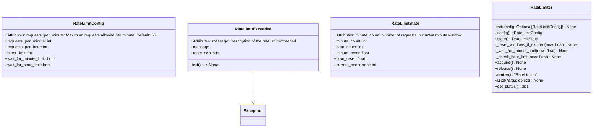

# File Overview

This file implements a rate limiter for controlling API request frequency. It provides mechanisms to enforce limits on requests per minute, per hour, and concurrent requests (burst limit). The rate limiter uses sliding window counters to track usage and supports both waiting for limits to reset and raising exceptions when limits are exceeded.

## Classes

### RateLimitExceeded

Raised when rate limit is exceeded and cannot wait.

This exception is raised when the hourly rate limit is exceeded,
as waiting for the hour window to reset would be impractical.

**Attributes:**
- `message`: Description of the rate limit exceeded.
- `reset_seconds`: Seconds until the rate limit resets.

**Constructor:**
```python
def __init__(self, message: str, reset_seconds: float = 0) -> None
```

### RateLimitConfig

Rate limit configuration.

**Attributes:**
- `requests_per_minute`: Maximum requests allowed per minute. Default: 60.
- `requests_per_hour`: Maximum requests allowed per hour. Default: 1000.
- `burst_limit`: Maximum concurrent requests allowed. Default: 10.
- `wait_for_minute_limit`: Whether to wait when minute limit is hit. Default: True.
- `wait_for_hour_limit`: Whether to wait when hour limit is hit. Default: False.

### RateLimitState

Tracks rate limit state.

Uses sliding window counters for minute and hour tracking.

**Attributes:**
- `minute_count`: Number of requests in current minute window.
- `hour_count`: Number of requests in current hour window.
- `minute_reset`: Timestamp when minute window started.
- `hour_reset`: Timestamp when hour window started.
- `current_concurrent`: Number of currently executing requests.

### RateLimiter

A rate limiter that enforces limits on requests per minute, per hour, and concurrent requests.

**Methods:**
- `__init__(config: Optional[RateLimitConfig])`: Initialize the rate limiter.
- `config() -> RateLimitConfig`: Get the current rate limit configuration.
- `state() -> RateLimitState`: Get the current rate limit state (for monitoring).
- `_reset_windows_if_expired(now: float) -> None`: Reset minute/hour windows if they have expired.
- `_wait_for_minute_limit(now: float) -> None`: Wait for minute limit to reset if exceeded.
- `_check_hour_limit(now: float) -> None`: Check hour limit and raise if exceeded.
- `acquire() -> None`: Acquire permission to make a request.
- `release() -> None`: Release the burst semaphore after request completes.
- `__aenter__() -> RateLimiter`: Enter async context manager, acquiring rate limit permission.
- `__aexit__() -> None`: Exit async context manager.
- `get_status() -> dict`: Get status information for monitoring.

## Functions

### get_rate_limiter

Returns the global rate limiter instance.

### configure_rate_limiter

Configures the global rate limiter with a new configuration.

### reset_rate_limiter

Resets the global rate limiter state.

## Integration

This file is part of the `local_deepwiki.core` module and depends on:
- `asyncio` and `time` for async operations and time tracking
- `dataclasses` for defining configuration and state classes
- `typing` for type hints
- `local_deepwiki.logging` for logging

It is used by:
- `test_rate_limiter` (test suite)
- `test_vectorstore` (test suite)
- `RateLimitConfig`, `RateLimiter`, `get_rate_limiter`, `configure_rate_limiter`, `reset_rate_limiter` functions

The `RateLimiter` class integrates with the async context manager protocol (`__aenter__`, `__aexit__`) and supports both manual acquisition and automatic context management.

## Usage Examples

### Basic Usage with Context Manager

```python
from local_deepwiki.core.rate_limiter import RateLimiter

async def example():
    async with RateLimiter() as limiter:
        # Make API request here
        pass
```

### Manual Acquisition

```python
from local_deepwiki.core.rate_limiter import RateLimiter

async def example():
    limiter = RateLimiter()
    await limiter.acquire()
    try:
        # Make API request here
        pass
    finally:
        limiter.release()
```

### Configuration

```python
from local_deepwiki.core.rate_limiter import RateLimitConfig, configure_rate_limiter

config = RateLimitConfig(
    requests_per_minute=50,
    requests_per_hour=800,
    burst_limit=5
)
configure_rate_limiter(config)
```

## API Reference

### class `RateLimitExceeded`

**Inherits from:** `Exception`

Raised when rate limit is exceeded and cannot wait.  This exception is raised when the hourly rate limit is exceeded, as waiting for the hour window to reset would be impractical.  Attributes: message: Description of the rate limit exceeded. reset_seconds: Seconds until the rate limit resets.

**Methods:**


<details>
<summary>View Source (lines 36-56) | <a href="https://github.com/UrbanDiver/local-deepwiki-mcp/blob/[main](../export/pdf.md)/src/local_deepwiki/core/rate_limiter.py#L36-L56">GitHub</a></summary>

```python
class RateLimitExceeded(Exception):
    """Raised when rate limit is exceeded and cannot wait.

    This exception is raised when the hourly rate limit is exceeded,
    as waiting for the hour window to reset would be impractical.

    Attributes:
        message: Description of the rate limit exceeded.
        reset_seconds: Seconds until the rate limit resets.
    """

    def __init__(self, message: str, reset_seconds: float = 0) -> None:
        """Initialize the rate limit exceeded exception.

        Args:
            message: Description of what limit was exceeded.
            reset_seconds: Seconds until the rate limit resets.
        """
        super().__init__(message)
        self.message = message
        self.reset_seconds = reset_seconds
```

</details>

#### `__init__`

```python
def __init__(message: str, reset_seconds: float = 0) -> None
```

Initialize the rate limit exceeded exception.


| [Parameter](../generators/api_docs.md) | Type | Default | Description |
|-----------|------|---------|-------------|
| `message` | `str` | - | Description of what limit was exceeded. |
| `reset_seconds` | `float` | `0` | Seconds until the rate limit resets. |


<details>
<summary>View Source (lines 36-56) | <a href="https://github.com/UrbanDiver/local-deepwiki-mcp/blob/[main](../export/pdf.md)/src/local_deepwiki/core/rate_limiter.py#L36-L56">GitHub</a></summary>

```python
class RateLimitExceeded(Exception):
    """Raised when rate limit is exceeded and cannot wait.

    This exception is raised when the hourly rate limit is exceeded,
    as waiting for the hour window to reset would be impractical.

    Attributes:
        message: Description of the rate limit exceeded.
        reset_seconds: Seconds until the rate limit resets.
    """

    def __init__(self, message: str, reset_seconds: float = 0) -> None:
        """Initialize the rate limit exceeded exception.

        Args:
            message: Description of what limit was exceeded.
            reset_seconds: Seconds until the rate limit resets.
        """
        super().__init__(message)
        self.message = message
        self.reset_seconds = reset_seconds
```

</details>

### class `RateLimitConfig`

Rate limit configuration.  Attributes: requests_per_minute: Maximum requests allowed per minute. Default: 60. requests_per_hour: Maximum requests allowed per hour. Default: 1000. burst_limit: Maximum concurrent requests allowed. Default: 10. wait_for_minute_limit: Whether to wait when minute limit is hit. Default: True. wait_for_hour_limit: Whether to wait when hour limit is hit. Default: False.


<details>
<summary>View Source (lines 60-75) | <a href="https://github.com/UrbanDiver/local-deepwiki-mcp/blob/[main](../export/pdf.md)/src/local_deepwiki/core/rate_limiter.py#L60-L75">GitHub</a></summary>

```python
class RateLimitConfig:
    """Rate limit configuration.

    Attributes:
        requests_per_minute: Maximum requests allowed per minute. Default: 60.
        requests_per_hour: Maximum requests allowed per hour. Default: 1000.
        burst_limit: Maximum concurrent requests allowed. Default: 10.
        wait_for_minute_limit: Whether to wait when minute limit is hit. Default: True.
        wait_for_hour_limit: Whether to wait when hour limit is hit. Default: False.
    """

    requests_per_minute: int = 60
    requests_per_hour: int = 1000
    burst_limit: int = 10
    wait_for_minute_limit: bool = True
    wait_for_hour_limit: bool = False
```

</details>

### class `RateLimitState`

Tracks rate limit state.  Uses sliding window counters for minute and hour tracking.  Attributes: minute_count: Number of requests in current minute window. hour_count: Number of requests in current hour window. minute_reset: Timestamp when minute window started. hour_reset: Timestamp when hour window started. current_concurrent: Number of currently executing requests.


<details>
<summary>View Source (lines 79-96) | <a href="https://github.com/UrbanDiver/local-deepwiki-mcp/blob/[main](../export/pdf.md)/src/local_deepwiki/core/rate_limiter.py#L79-L96">GitHub</a></summary>

```python
class RateLimitState:
    """Tracks rate limit state.

    Uses sliding window counters for minute and hour tracking.

    Attributes:
        minute_count: Number of requests in current minute window.
        hour_count: Number of requests in current hour window.
        minute_reset: Timestamp when minute window started.
        hour_reset: Timestamp when hour window started.
        current_concurrent: Number of currently executing requests.
    """

    minute_count: int = 0
    hour_count: int = 0
    minute_reset: float = field(default_factory=time.time)
    hour_reset: float = field(default_factory=time.time)
    current_concurrent: int = 0
```

</details>

### class `RateLimiter`

Token bucket rate limiter for API calls.  Implements rate limiting with: - Per-minute limits (waits if exceeded) - Per-hour limits (raises exception if exceeded) - Burst limiting (concurrent request limit)  Thread-safe for concurrent async operations.

**Methods:**


<details>
<summary>View Source (lines 99-295) | <a href="https://github.com/UrbanDiver/local-deepwiki-mcp/blob/[main](../export/pdf.md)/src/local_deepwiki/core/rate_limiter.py#L99-L295">GitHub</a></summary>

```python
class RateLimiter:
    # Methods: __init__, config, state, _reset_windows_if_expired, _wait_for_minute_limit, _check_hour_limit, acquire, release, __aenter__, __aexit__, get_status
```

</details>

#### `__init__`

```python
def __init__(config: Optional[RateLimitConfig] = None) -> None
```

Initialize the rate limiter.


| [Parameter](../generators/api_docs.md) | Type | Default | Description |
|-----------|------|---------|-------------|
| `config` | `Optional[RateLimitConfig]` | `None` | Rate limit configuration. Uses defaults if not provided. |


<details>
<summary>View Source (lines 124-133) | <a href="https://github.com/UrbanDiver/local-deepwiki-mcp/blob/[main](../export/pdf.md)/src/local_deepwiki/core/rate_limiter.py#L124-L133">GitHub</a></summary>

```python
def __init__(self, config: Optional[RateLimitConfig] = None) -> None:
        """Initialize the rate limiter.

        Args:
            config: Rate limit configuration. Uses defaults if not provided.
        """
        self._config = config or RateLimitConfig()
        self._state = RateLimitState()
        self._lock = asyncio.Lock()
        self._burst_semaphore = asyncio.Semaphore(self._config.burst_limit)
```

</details>

#### `config`

```python
def config() -> RateLimitConfig
```

Get the current rate limit configuration.


<details>
<summary>View Source (lines 136-138) | <a href="https://github.com/UrbanDiver/local-deepwiki-mcp/blob/[main](../export/pdf.md)/src/local_deepwiki/core/rate_limiter.py#L136-L138">GitHub</a></summary>

```python
def config(self) -> RateLimitConfig:
        """Get the current rate limit configuration."""
        return self._config
```

</details>

#### `state`

```python
def state() -> RateLimitState
```

Get the current rate limit state (for monitoring).


<details>
<summary>View Source (lines 141-143) | <a href="https://github.com/UrbanDiver/local-deepwiki-mcp/blob/[main](../export/pdf.md)/src/local_deepwiki/core/rate_limiter.py#L141-L143">GitHub</a></summary>

```python
def state(self) -> RateLimitState:
        """Get the current rate limit state (for monitoring)."""
        return self._state
```

</details>

#### `acquire`

```python
async def acquire() -> None
```

Acquire permission to make a request.  Blocks if rate limited (for minute limits), raises exception for hour limits. Also respects burst limit via semaphore.


<details>
<summary>View Source (lines 223-256) | <a href="https://github.com/UrbanDiver/local-deepwiki-mcp/blob/[main](../export/pdf.md)/src/local_deepwiki/core/rate_limiter.py#L223-L256">GitHub</a></summary>

```python
async def acquire(self) -> None:
        """Acquire permission to make a request.

        Blocks if rate limited (for minute limits), raises exception
        for hour limits. Also respects burst limit via semaphore.

        Raises:
            RateLimitExceeded: If hourly limit is exceeded.
        """
        # First acquire burst semaphore (limits concurrent requests)
        await self._burst_semaphore.acquire()

        async with self._lock:
            now = time.time()

            # Reset windows if expired
            self._reset_windows_if_expired(now)

            # Check and wait for minute limit
            await self._wait_for_minute_limit(now)

            # Check hour limit (raises if exceeded)
            await self._check_hour_limit(now)

            # Increment counters
            self._state.minute_count += 1
            self._state.hour_count += 1
            self._state.current_concurrent += 1

            logger.debug(
                f"Rate limiter: acquired (min: {self._state.minute_count}/{self._config.requests_per_minute}, "
                f"hour: {self._state.hour_count}/{self._config.requests_per_hour}, "
                f"concurrent: {self._state.current_concurrent}/{self._config.burst_limit})"
            )
```

</details>

#### `release`

```python
def release() -> None
```

Release the burst semaphore after request completes.  Should be called after the API request finishes to allow other requests to proceed.


<details>
<summary>View Source (lines 258-266) | <a href="https://github.com/UrbanDiver/local-deepwiki-mcp/blob/[main](../export/pdf.md)/src/local_deepwiki/core/rate_limiter.py#L258-L266">GitHub</a></summary>

```python
def release(self) -> None:
        """Release the burst semaphore after request completes.

        Should be called after the API request finishes to allow
        other requests to proceed.
        """
        self._burst_semaphore.release()
        self._state.current_concurrent = max(0, self._state.current_concurrent - 1)
        logger.debug(f"Rate limiter: released (concurrent: {self._state.current_concurrent})")
```

</details>

#### `get_status`

```python
def get_status() -> dict
```

Get current rate limiter status for monitoring.


---


<details>
<summary>View Source (lines 277-295) | <a href="https://github.com/UrbanDiver/local-deepwiki-mcp/blob/[main](../export/pdf.md)/src/local_deepwiki/core/rate_limiter.py#L277-L295">GitHub</a></summary>

```python
def get_status(self) -> dict:
        """Get current rate limiter status for monitoring.

        Returns:
            Dictionary with current rate limit state and configuration.
        """
        now = time.time()
        return {
            "minute_count": self._state.minute_count,
            "minute_limit": self._config.requests_per_minute,
            "minute_remaining": max(0, self._config.requests_per_minute - self._state.minute_count),
            "minute_reset_in": max(0, 60 - (now - self._state.minute_reset)),
            "hour_count": self._state.hour_count,
            "hour_limit": self._config.requests_per_hour,
            "hour_remaining": max(0, self._config.requests_per_hour - self._state.hour_count),
            "hour_reset_in": max(0, 3600 - (now - self._state.hour_reset)),
            "current_concurrent": self._state.current_concurrent,
            "burst_limit": self._config.burst_limit,
        }
```

</details>

### Functions

#### `get_rate_limiter`

```python
def get_rate_limiter() -> RateLimiter
```

Get the global rate limiter instance.  Creates a new instance with default configuration if none exists.

**Returns:** `RateLimiter`


<details>
<summary>View Source (lines 303-314) | <a href="https://github.com/UrbanDiver/local-deepwiki-mcp/blob/[main](../export/pdf.md)/src/local_deepwiki/core/rate_limiter.py#L303-L314">GitHub</a></summary>

```python
def get_rate_limiter() -> RateLimiter:
    """Get the global rate limiter instance.

    Creates a new instance with default configuration if none exists.

    Returns:
        The global RateLimiter instance.
    """
    global _rate_limiter
    if _rate_limiter is None:
        _rate_limiter = RateLimiter()
    return _rate_limiter
```

</details>

#### `configure_rate_limiter`

```python
def configure_rate_limiter(config: RateLimitConfig) -> None
```

Configure the global rate limiter with custom settings.  This should be called at application startup before any API calls.


| [Parameter](../generators/api_docs.md) | Type | Default | Description |
|-----------|------|---------|-------------|
| `config` | `RateLimitConfig` | - | Rate limit configuration to use. |

**Returns:** `None`


<details>
<summary>View Source (lines 317-330) | <a href="https://github.com/UrbanDiver/local-deepwiki-mcp/blob/[main](../export/pdf.md)/src/local_deepwiki/core/rate_limiter.py#L317-L330">GitHub</a></summary>

```python
def configure_rate_limiter(config: RateLimitConfig) -> None:
    """Configure the global rate limiter with custom settings.

    This should be called at application startup before any API calls.

    Args:
        config: Rate limit configuration to use.
    """
    global _rate_limiter
    _rate_limiter = RateLimiter(config)
    logger.info(
        f"Rate limiter configured: {config.requests_per_minute}/min, "
        f"{config.requests_per_hour}/hour, burst={config.burst_limit}"
    )
```

</details>

#### `reset_rate_limiter`

```python
def reset_rate_limiter() -> None
```

Reset the global rate limiter.  Useful for testing or when reconfiguration is needed.

**Returns:** `None`


<details>
<summary>View Source (lines 333-340) | <a href="https://github.com/UrbanDiver/local-deepwiki-mcp/blob/[main](../export/pdf.md)/src/local_deepwiki/core/rate_limiter.py#L333-L340">GitHub</a></summary>

```python
def reset_rate_limiter() -> None:
    """Reset the global rate limiter.

    Useful for testing or when reconfiguration is needed.
    """
    global _rate_limiter
    _rate_limiter = None
    logger.debug("Rate limiter reset")
```

</details>

## Class Diagram



## Call Graph

```mermaid
flowchart TD
    N0[Lock]
    N1[RateLimitConfig]
    N2[RateLimitExceeded]
    N3[RateLimitExceeded.__init__]
    N4[RateLimitState]
    N5[RateLimiter]
    N6[RateLimiter.__aenter__]
    N7[RateLimiter.__aexit__]
    N8[RateLimiter.__init__]
    N9[RateLimiter._check_hour_limit]
    N10[RateLimiter._wait_for_minut...]
    N11[RateLimiter.acquire]
    N12[RateLimiter.get_status]
    N13[RateLimiter.release]
    N14[Semaphore]
    N15[__init__]
    N16[_check_hour_limit]
    N17[_reset_windows_if_expired]
    N18[_wait_for_minute_limit]
    N19[acquire]
    N20[configure_rate_limiter]
    N21[get_rate_limiter]
    N22[release]
    N23[sleep]
    N24[time]
    N21 --> N5
    N20 --> N5
    N3 --> N15
    N8 --> N1
    N8 --> N4
    N8 --> N0
    N8 --> N14
    N10 --> N22
    N10 --> N23
    N10 --> N19
    N10 --> N24
    N10 --> N2
    N9 --> N22
    N9 --> N23
    N9 --> N19
    N9 --> N24
    N9 --> N2
    N11 --> N19
    N11 --> N24
    N11 --> N17
    N11 --> N18
    N11 --> N16
    N13 --> N22
    N6 --> N19
    N7 --> N22
    N12 --> N24
    classDef func fill:#e1f5fe
    class N0,N1,N2,N4,N5,N14,N15,N16,N17,N18,N19,N20,N21,N22,N23,N24 func
    classDef method fill:#fff3e0
    class N3,N6,N7,N8,N9,N10,N11,N12,N13 method
```



## Used By

Functions and methods in this file and their callers:

- **`Lock`**: called by `RateLimiter.__init__`
- **`RateLimitConfig`**: called by `RateLimiter.__init__`
- **`RateLimitExceeded`**: called by `RateLimiter._check_hour_limit`, `RateLimiter._wait_for_minute_limit`
- **`RateLimitState`**: called by `RateLimiter.__init__`
- **`RateLimiter`**: called by `configure_rate_limiter`, `get_rate_limiter`
- **`Semaphore`**: called by `RateLimiter.__init__`
- **`__init__`**: called by `RateLimitExceeded.__init__`
- **`_check_hour_limit`**: called by `RateLimiter.acquire`
- **`_reset_windows_if_expired`**: called by `RateLimiter.acquire`
- **`_wait_for_minute_limit`**: called by `RateLimiter.acquire`
- **`acquire`**: called by `RateLimiter.__aenter__`, `RateLimiter._check_hour_limit`, `RateLimiter._wait_for_minute_limit`, `RateLimiter.acquire`
- **`release`**: called by `RateLimiter.__aexit__`, `RateLimiter._check_hour_limit`, `RateLimiter._wait_for_minute_limit`, `RateLimiter.release`
- **`sleep`**: called by `RateLimiter._check_hour_limit`, `RateLimiter._wait_for_minute_limit`
- **`time`**: called by `RateLimiter._check_hour_limit`, `RateLimiter._wait_for_minute_limit`, `RateLimiter.acquire`, `RateLimiter.get_status`

## Usage Examples

*Examples extracted from test files*

### Test that default config values are sensible

From `test_rate_limiter.py::TestRateLimitConfig::test_default_values`:

```python
config = RateLimitConfig()
assert config.requests_per_minute == 60
assert config.requests_per_hour == 1000
assert config.burst_limit == 10
assert config.wait_for_minute_limit is True
assert config.wait_for_hour_limit is False
```

### Test that default config values are sensible

From `test_rate_limiter.py::TestRateLimitConfig::test_default_values`:

```python
config = RateLimitConfig()
assert config.requests_per_minute == 60
assert config.requests_per_hour == 1000
assert config.burst_limit == 10
assert config.wait_for_minute_limit is True
assert config.wait_for_hour_limit is False
```

### Test that custom values are applied

From `test_rate_limiter.py::TestRateLimitConfig::test_custom_values`:

```python
config = RateLimitConfig(
    requests_per_minute=30,
    requests_per_hour=500,
    burst_limit=5,
    wait_for_minute_limit=False,
    wait_for_hour_limit=True,
)
assert config.requests_per_minute == 30
assert config.requests_per_hour == 500
```

### Test that custom values are applied

From `test_rate_limiter.py::TestRateLimitConfig::test_custom_values`:

```python
config = RateLimitConfig(
    requests_per_minute=30,
    requests_per_hour=500,
    burst_limit=5,
    wait_for_minute_limit=False,
    wait_for_hour_limit=True,
)
assert config.requests_per_minute == 30
assert config.requests_per_hour == 500
```

### Test that acquire increments counters correctly

From `test_rate_limiter.py::TestRateLimiter::test_acquire_increments_counters`:

```python
limiter = RateLimiter(RateLimitConfig(requests_per_minute=100))

assert limiter.state.minute_count == 0
assert limiter.state.hour_count == 0

await limiter.acquire()
limiter.release()

assert limiter.state.minute_count == 1
assert limiter.state.hour_count == 1
```


## Last Modified

| Entity | Type | Author | Date | Commit |
|--------|------|--------|------|--------|
| `RateLimitExceeded` | class | Brian Breidenbach | 1 week ago | `89d3399` Add code quality improvemen... |
| `RateLimitConfig` | class | Brian Breidenbach | 1 week ago | `89d3399` Add code quality improvemen... |
| `RateLimitState` | class | Brian Breidenbach | 1 week ago | `89d3399` Add code quality improvemen... |
| `RateLimiter` | class | Brian Breidenbach | 1 week ago | `89d3399` Add code quality improvemen... |
| `__init__` | method | Brian Breidenbach | 1 week ago | `89d3399` Add code quality improvemen... |
| `config` | method | Brian Breidenbach | 1 week ago | `89d3399` Add code quality improvemen... |
| `state` | method | Brian Breidenbach | 1 week ago | `89d3399` Add code quality improvemen... |
| `_reset_windows_if_expired` | method | Brian Breidenbach | 1 week ago | `89d3399` Add code quality improvemen... |
| `_wait_for_minute_limit` | method | Brian Breidenbach | 1 week ago | `89d3399` Add code quality improvemen... |
| `_check_hour_limit` | method | Brian Breidenbach | 1 week ago | `89d3399` Add code quality improvemen... |
| `acquire` | method | Brian Breidenbach | 1 week ago | `89d3399` Add code quality improvemen... |
| `release` | method | Brian Breidenbach | 1 week ago | `89d3399` Add code quality improvemen... |
| `__aenter__` | method | Brian Breidenbach | 1 week ago | `89d3399` Add code quality improvemen... |
| `__aexit__` | method | Brian Breidenbach | 1 week ago | `89d3399` Add code quality improvemen... |
| `get_status` | method | Brian Breidenbach | 1 week ago | `89d3399` Add code quality improvemen... |
| `get_rate_limiter` | function | Brian Breidenbach | 1 week ago | `89d3399` Add code quality improvemen... |
| `configure_rate_limiter` | function | Brian Breidenbach | 1 week ago | `89d3399` Add code quality improvemen... |
| `reset_rate_limiter` | function | Brian Breidenbach | 1 week ago | `89d3399` Add code quality improvemen... |

## Additional Source Code

Source code for functions and methods not listed in the API Reference above.

#### `_reset_windows_if_expired`

<details>
<summary>View Source (lines 145-161) | <a href="https://github.com/UrbanDiver/local-deepwiki-mcp/blob/[main](../export/pdf.md)/src/local_deepwiki/core/rate_limiter.py#L145-L161">GitHub</a></summary>

```python
def _reset_windows_if_expired(self, now: float) -> None:
        """Reset minute/hour windows if they have expired.

        Args:
            now: Current timestamp.
        """
        # Reset minute window if expired
        if now - self._state.minute_reset >= 60:
            self._state.minute_count = 0
            self._state.minute_reset = now
            logger.debug("Rate limiter: minute window reset")

        # Reset hour window if expired
        if now - self._state.hour_reset >= 3600:
            self._state.hour_count = 0
            self._state.hour_reset = now
            logger.debug("Rate limiter: hour window reset")
```

</details>


#### `_wait_for_minute_limit`

<details>
<summary>View Source (lines 163-191) | <a href="https://github.com/UrbanDiver/local-deepwiki-mcp/blob/[main](../export/pdf.md)/src/local_deepwiki/core/rate_limiter.py#L163-L191">GitHub</a></summary>

```python
async def _wait_for_minute_limit(self, now: float) -> None:
        """Wait for minute limit to reset if exceeded.

        Args:
            now: Current timestamp.

        Raises:
            RateLimitExceeded: If minute limit exceeded and not configured to wait.
        """
        if self._state.minute_count >= self._config.requests_per_minute:
            wait_time = 60 - (now - self._state.minute_reset)
            if wait_time > 0:
                if self._config.wait_for_minute_limit:
                    logger.info(f"Rate limit: minute limit reached, waiting {wait_time:.1f}s")
                    # Release lock while waiting to not block other operations
                    self._lock.release()
                    try:
                        await asyncio.sleep(wait_time)
                    finally:
                        await self._lock.acquire()
                    # Reset the window after waiting
                    self._state.minute_count = 0
                    self._state.minute_reset = time.time()
                else:
                    raise RateLimitExceeded(
                        f"Minute limit exceeded ({self._config.requests_per_minute}/min). "
                        f"Reset in {wait_time:.0f}s",
                        reset_seconds=wait_time,
                    )
```

</details>


#### `_check_hour_limit`

<details>
<summary>View Source (lines 193-221) | <a href="https://github.com/UrbanDiver/local-deepwiki-mcp/blob/[main](../export/pdf.md)/src/local_deepwiki/core/rate_limiter.py#L193-L221">GitHub</a></summary>

```python
async def _check_hour_limit(self, now: float) -> None:
        """Check hour limit and raise if exceeded.

        Args:
            now: Current timestamp.

        Raises:
            RateLimitExceeded: If hour limit is exceeded.
        """
        if self._state.hour_count >= self._config.requests_per_hour:
            wait_time = 3600 - (now - self._state.hour_reset)
            if wait_time > 0:
                if self._config.wait_for_hour_limit:
                    logger.warning(f"Rate limit: hour limit reached, waiting {wait_time:.0f}s")
                    # Release lock while waiting
                    self._lock.release()
                    try:
                        await asyncio.sleep(wait_time)
                    finally:
                        await self._lock.acquire()
                    # Reset the window after waiting
                    self._state.hour_count = 0
                    self._state.hour_reset = time.time()
                else:
                    raise RateLimitExceeded(
                        f"Hourly limit exceeded ({self._config.requests_per_hour}/hour). "
                        f"Reset in {wait_time:.0f}s",
                        reset_seconds=wait_time,
                    )
```

</details>


#### `__aenter__`

<details>
<summary>View Source (lines 268-271) | <a href="https://github.com/UrbanDiver/local-deepwiki-mcp/blob/[main](../export/pdf.md)/src/local_deepwiki/core/rate_limiter.py#L268-L271">GitHub</a></summary>

```python
async def __aenter__(self) -> "RateLimiter":
        """Enter async context manager, acquiring rate limit permission."""
        await self.acquire()
        return self
```

</details>


#### `__aexit__`

<details>
<summary>View Source (lines 273-275) | <a href="https://github.com/UrbanDiver/local-deepwiki-mcp/blob/[main](../export/pdf.md)/src/local_deepwiki/core/rate_limiter.py#L273-L275">GitHub</a></summary>

```python
async def __aexit__(self, *args: object) -> None:
        """Exit async context manager, releasing burst semaphore."""
        self.release()
```

</details>

## Relevant Source Files

- `src/local_deepwiki/core/rate_limiter.py:36-56`
