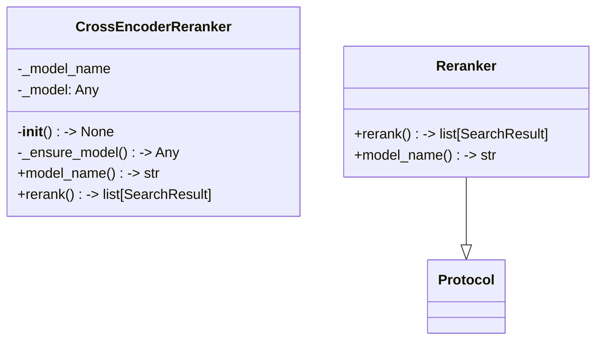
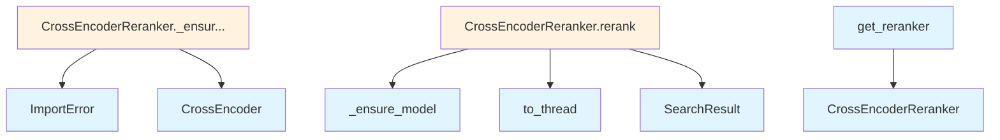

# File: `src/local_deepwiki/core/reranker.py`

## File Overview

This file implements a **reranker** for search results, using cross-encoder models from the `sentence-transformers` library. Its purpose is to improve the relevance of search results by re-scoring them based on their similarity to a given query.

The module defines a protocol `Reranker` that outlines the expected interface for rerankers, and a concrete implementation `CrossEncoderReranker` that uses a `CrossEncoder` model to perform the reranking. The model is loaded lazily to avoid unnecessary dependencies during import.

## Key Concepts

### Protocol-Based Design
The `Reranker` protocol defines a standard interface for reranking search results. This allows for flexibility in implementation — for example, in tests or future enhancements, a different reranker could be swapped in without affecting the rest of the system, as long as it conforms to the protocol.

### Lazy Model Loading
The `CrossEncoderReranker` uses lazy loading for the `CrossEncoder` model. This is a deliberate design choice to avoid the overhead of loading a large model at import time. It ensures that the `sentence-transformers` dependency is only required when the reranker is actually used, improving startup performance and reducing memory usage.

### Async Reranking with Thread Pool
The `rerank` method in `CrossEncoderReranker` is declared as `async` and runs the CPU-bound model inference in a thread via `asyncio.to_thread`. This prevents blocking the event loop, which is crucial for maintaining responsiveness in asynchronous systems.

## Integration

This module is used by the `Reranker` class in test files, specifically `test_reranker`, which suggests that it is part of a larger system for managing search and retrieval, likely integrated into a search pipeline or query service.

The module imports from:
- `local_deepwiki.logging`: for logging
- `local_deepwiki.models`: for the [`SearchResult`](../handlers/types.md) type
- `sentence_transformers.CrossEncoder`: for the core reranking logic

It is closely related to:
- `src/local_deepwiki/core/vectorstore/embedding.py`: which likely provides embeddings used in the search pipeline
- `src/local_deepwiki/cli/main.py`: which may orchestrate the overall application flow

## Design Notes

### Why CrossEncoder?
Cross-encoders are used for reranking because they provide better accuracy than traditional similarity-based approaches (like cosine similarity) when scoring query-document pairs. They are more computationally expensive but yield higher-quality results, making them suitable for post-retrieval refinement.

### Handling Empty Results
In the `rerank` method, if no results are passed, the method immediately returns an empty list. This avoids unnecessary computation and ensures robustness in edge cases.

### Thread Safety
The use of `asyncio.to_thread` ensures that the CPU-bound model inference does not block the event loop, which is a common pattern in async Python applications. This is essential for performance in a concurrent environment.

### Optional Dependency
The `sentence-transformers` library is treated as an optional dependency. If it's not installed, an `ImportError` is raised with a helpful message, encouraging the user to install it.

### Factory Function
The `get_reranker` function provides a simple way to instantiate a `CrossEncoderReranker` when a model name is provided. If no model is configured (i.e., `model_name` is `None` or invalid), it returns `None`, allowing the caller to gracefully handle the absence of a reranker.

## API Reference

### class `Reranker`

**Inherits from:** `Protocol`

Protocol for search result rerankers.

**Methods:**


<details>
<summary>View Source (lines 20-44) | <a href="https://github.com/UrbanDiver/local-deepwiki-mcp/blob/main/src/local_deepwiki/core/reranker.py#L20-L44">GitHub</a></summary>

```python
class Reranker(Protocol):
    """Protocol for search result rerankers."""

    async def rerank(
        self,
        query: str,
        results: list[SearchResult],
        top_k: int | None = None,
    ) -> list[SearchResult]:
        """Rerank search results by relevance to query.

        Args:
            query: The search query.
            results: Search results to rerank.
            top_k: Keep only the top-k results after reranking.

        Returns:
            Reranked (and optionally truncated) results.
        """
        ...

    @property
    def model_name(self) -> str:
        """Return the model identifier for tracing."""
        ...
```

</details>

#### `rerank`

```python
async def rerank(query: str, results: list[SearchResult], top_k: int | None = None) -> list[SearchResult]
```

Rerank search results by relevance to query.


| Parameter | Type | Default | Description |
|-----------|------|---------|-------------|
| `query` | `str` | - | The search query. |
| `results` | `list[SearchResult]` | - | Search results to rerank. |
| `top_k` | `int | None` | `None` | Keep only the top-k results after reranking. |


<details>
<summary>View Source (lines 20-44) | <a href="https://github.com/UrbanDiver/local-deepwiki-mcp/blob/main/src/local_deepwiki/core/reranker.py#L20-L44">GitHub</a></summary>

```python
class Reranker(Protocol):
    """Protocol for search result rerankers."""

    async def rerank(
        self,
        query: str,
        results: list[SearchResult],
        top_k: int | None = None,
    ) -> list[SearchResult]:
        """Rerank search results by relevance to query.

        Args:
            query: The search query.
            results: Search results to rerank.
            top_k: Keep only the top-k results after reranking.

        Returns:
            Reranked (and optionally truncated) results.
        """
        ...

    @property
    def model_name(self) -> str:
        """Return the model identifier for tracing."""
        ...
```

</details>

#### `model_name`

```python
def model_name() -> str
```

Return the model identifier for tracing.


<details>
<summary>View Source (lines 20-44) | <a href="https://github.com/UrbanDiver/local-deepwiki-mcp/blob/main/src/local_deepwiki/core/reranker.py#L20-L44">GitHub</a></summary>

```python
class Reranker(Protocol):
    """Protocol for search result rerankers."""

    async def rerank(
        self,
        query: str,
        results: list[SearchResult],
        top_k: int | None = None,
    ) -> list[SearchResult]:
        """Rerank search results by relevance to query.

        Args:
            query: The search query.
            results: Search results to rerank.
            top_k: Keep only the top-k results after reranking.

        Returns:
            Reranked (and optionally truncated) results.
        """
        ...

    @property
    def model_name(self) -> str:
        """Return the model identifier for tracing."""
        ...
```

</details>

### class `CrossEncoderReranker`

Reranker using sentence-transformers CrossEncoder.  The model is loaded lazily on first ``rerank()`` call so that importing this module does not trigger a heavy ``sentence_transformers`` import.

**Methods:**


<details>
<summary>View Source (lines 47-119) | <a href="https://github.com/UrbanDiver/local-deepwiki-mcp/blob/main/src/local_deepwiki/core/reranker.py#L47-L119">GitHub</a></summary>

```python
class CrossEncoderReranker:
    """Reranker using sentence-transformers CrossEncoder.

    The model is loaded lazily on first ``rerank()`` call so that importing
    this module does not trigger a heavy ``sentence_transformers`` import.
    """

    __slots__ = ("_model_name", "_model")

    def __init__(
        self, model_name: str = "cross-encoder/ms-marco-MiniLM-L-6-v2"
    ) -> None:
        self._model_name = model_name
        self._model: Any = None

    def _ensure_model(self) -> Any:
        """Lazily load the CrossEncoder model."""
        if self._model is None:
            try:
                from sentence_transformers import CrossEncoder
            except ImportError as exc:
                raise ImportError(
                    "sentence-transformers is required for cross-encoder reranking. "
                    "Install it with: pip install sentence-transformers"
                ) from exc
            self._model = CrossEncoder(self._model_name)
        return self._model

    @property
    def model_name(self) -> str:
        return self._model_name

    async def rerank(
        self,
        query: str,
        results: list[SearchResult],
        top_k: int | None = None,
    ) -> list[SearchResult]:
        """Rerank results using the cross-encoder model.

        Runs the model in a thread to avoid blocking the event loop.

        Args:
            query: The search query.
            results: Search results to rerank.
            top_k: Keep only the top-k results after reranking.

        Returns:
            Reranked results with updated scores.
        """
        if not results:
            return results

        model = self._ensure_model()
        pairs = [(query, r.chunk.content) for r in results]

        # Run prediction in a thread since it's CPU-bound
        scores: list[float] = await asyncio.to_thread(model.predict, pairs)

        # Build new results with cross-encoder scores
        ranked_pairs = sorted(zip(results, scores), key=lambda x: x[1], reverse=True)
        if top_k is not None:
            ranked_pairs = ranked_pairs[:top_k]

        return [
            SearchResult(
                chunk=r.chunk,
                score=float(s),
                highlights=r.highlights,
                suggestions=r.suggestions if hasattr(r, "suggestions") else None,
            )
            for r, s in ranked_pairs
        ]
```

</details>

#### `__init__`

```python
def __init__(model_name: str = "cross-encoder/ms-marco-MiniLM-L-6-v2") -> None
```


| Parameter | Type | Default | Description |
|-----------|------|---------|-------------|
| `model_name` | `str` | `"cross-encoder/ms-marco-MiniLM-L-6-v2"` | - |


<details>
<summary>View Source (lines 47-119) | <a href="https://github.com/UrbanDiver/local-deepwiki-mcp/blob/main/src/local_deepwiki/core/reranker.py#L47-L119">GitHub</a></summary>

```python
class CrossEncoderReranker:
    """Reranker using sentence-transformers CrossEncoder.

    The model is loaded lazily on first ``rerank()`` call so that importing
    this module does not trigger a heavy ``sentence_transformers`` import.
    """

    __slots__ = ("_model_name", "_model")

    def __init__(
        self, model_name: str = "cross-encoder/ms-marco-MiniLM-L-6-v2"
    ) -> None:
        self._model_name = model_name
        self._model: Any = None

    def _ensure_model(self) -> Any:
        """Lazily load the CrossEncoder model."""
        if self._model is None:
            try:
                from sentence_transformers import CrossEncoder
            except ImportError as exc:
                raise ImportError(
                    "sentence-transformers is required for cross-encoder reranking. "
                    "Install it with: pip install sentence-transformers"
                ) from exc
            self._model = CrossEncoder(self._model_name)
        return self._model

    @property
    def model_name(self) -> str:
        return self._model_name

    async def rerank(
        self,
        query: str,
        results: list[SearchResult],
        top_k: int | None = None,
    ) -> list[SearchResult]:
        """Rerank results using the cross-encoder model.

        Runs the model in a thread to avoid blocking the event loop.

        Args:
            query: The search query.
            results: Search results to rerank.
            top_k: Keep only the top-k results after reranking.

        Returns:
            Reranked results with updated scores.
        """
        if not results:
            return results

        model = self._ensure_model()
        pairs = [(query, r.chunk.content) for r in results]

        # Run prediction in a thread since it's CPU-bound
        scores: list[float] = await asyncio.to_thread(model.predict, pairs)

        # Build new results with cross-encoder scores
        ranked_pairs = sorted(zip(results, scores), key=lambda x: x[1], reverse=True)
        if top_k is not None:
            ranked_pairs = ranked_pairs[:top_k]

        return [
            SearchResult(
                chunk=r.chunk,
                score=float(s),
                highlights=r.highlights,
                suggestions=r.suggestions if hasattr(r, "suggestions") else None,
            )
            for r, s in ranked_pairs
        ]
```

</details>

#### `model_name`

```python
def model_name() -> str
```


<details>
<summary>View Source (lines 47-119) | <a href="https://github.com/UrbanDiver/local-deepwiki-mcp/blob/main/src/local_deepwiki/core/reranker.py#L47-L119">GitHub</a></summary>

```python
class CrossEncoderReranker:
    """Reranker using sentence-transformers CrossEncoder.

    The model is loaded lazily on first ``rerank()`` call so that importing
    this module does not trigger a heavy ``sentence_transformers`` import.
    """

    __slots__ = ("_model_name", "_model")

    def __init__(
        self, model_name: str = "cross-encoder/ms-marco-MiniLM-L-6-v2"
    ) -> None:
        self._model_name = model_name
        self._model: Any = None

    def _ensure_model(self) -> Any:
        """Lazily load the CrossEncoder model."""
        if self._model is None:
            try:
                from sentence_transformers import CrossEncoder
            except ImportError as exc:
                raise ImportError(
                    "sentence-transformers is required for cross-encoder reranking. "
                    "Install it with: pip install sentence-transformers"
                ) from exc
            self._model = CrossEncoder(self._model_name)
        return self._model

    @property
    def model_name(self) -> str:
        return self._model_name

    async def rerank(
        self,
        query: str,
        results: list[SearchResult],
        top_k: int | None = None,
    ) -> list[SearchResult]:
        """Rerank results using the cross-encoder model.

        Runs the model in a thread to avoid blocking the event loop.

        Args:
            query: The search query.
            results: Search results to rerank.
            top_k: Keep only the top-k results after reranking.

        Returns:
            Reranked results with updated scores.
        """
        if not results:
            return results

        model = self._ensure_model()
        pairs = [(query, r.chunk.content) for r in results]

        # Run prediction in a thread since it's CPU-bound
        scores: list[float] = await asyncio.to_thread(model.predict, pairs)

        # Build new results with cross-encoder scores
        ranked_pairs = sorted(zip(results, scores), key=lambda x: x[1], reverse=True)
        if top_k is not None:
            ranked_pairs = ranked_pairs[:top_k]

        return [
            SearchResult(
                chunk=r.chunk,
                score=float(s),
                highlights=r.highlights,
                suggestions=r.suggestions if hasattr(r, "suggestions") else None,
            )
            for r, s in ranked_pairs
        ]
```

</details>

#### `rerank`

```python
async def rerank(query: str, results: list[SearchResult], top_k: int | None = None) -> list[SearchResult]
```

Rerank results using the cross-encoder model.  Runs the model in a thread to avoid blocking the event loop.


| Parameter | Type | Default | Description |
|-----------|------|---------|-------------|
| `query` | `str` | - | The search query. |
| `results` | `list[SearchResult]` | - | Search results to rerank. |
| `top_k` | `int | None` | `None` | Keep only the top-k results after reranking. |


---


<details>
<summary>View Source (lines 47-119) | <a href="https://github.com/UrbanDiver/local-deepwiki-mcp/blob/main/src/local_deepwiki/core/reranker.py#L47-L119">GitHub</a></summary>

```python
class CrossEncoderReranker:
    """Reranker using sentence-transformers CrossEncoder.

    The model is loaded lazily on first ``rerank()`` call so that importing
    this module does not trigger a heavy ``sentence_transformers`` import.
    """

    __slots__ = ("_model_name", "_model")

    def __init__(
        self, model_name: str = "cross-encoder/ms-marco-MiniLM-L-6-v2"
    ) -> None:
        self._model_name = model_name
        self._model: Any = None

    def _ensure_model(self) -> Any:
        """Lazily load the CrossEncoder model."""
        if self._model is None:
            try:
                from sentence_transformers import CrossEncoder
            except ImportError as exc:
                raise ImportError(
                    "sentence-transformers is required for cross-encoder reranking. "
                    "Install it with: pip install sentence-transformers"
                ) from exc
            self._model = CrossEncoder(self._model_name)
        return self._model

    @property
    def model_name(self) -> str:
        return self._model_name

    async def rerank(
        self,
        query: str,
        results: list[SearchResult],
        top_k: int | None = None,
    ) -> list[SearchResult]:
        """Rerank results using the cross-encoder model.

        Runs the model in a thread to avoid blocking the event loop.

        Args:
            query: The search query.
            results: Search results to rerank.
            top_k: Keep only the top-k results after reranking.

        Returns:
            Reranked results with updated scores.
        """
        if not results:
            return results

        model = self._ensure_model()
        pairs = [(query, r.chunk.content) for r in results]

        # Run prediction in a thread since it's CPU-bound
        scores: list[float] = await asyncio.to_thread(model.predict, pairs)

        # Build new results with cross-encoder scores
        ranked_pairs = sorted(zip(results, scores), key=lambda x: x[1], reverse=True)
        if top_k is not None:
            ranked_pairs = ranked_pairs[:top_k]

        return [
            SearchResult(
                chunk=r.chunk,
                score=float(s),
                highlights=r.highlights,
                suggestions=r.suggestions if hasattr(r, "suggestions") else None,
            )
            for r, s in ranked_pairs
        ]
```

</details>

### Functions

#### `get_reranker`

```python
def get_reranker(model_name: str | None) -> CrossEncoderReranker | None
```

Factory: return a reranker if a model is configured, else ``None``.


| Parameter | Type | Default | Description |
|-----------|------|---------|-------------|
| `model_name` | `str | None` | - | - |

**Returns:** `CrossEncoderReranker | None`


<details>
<summary>View Source (lines 122-126) | <a href="https://github.com/UrbanDiver/local-deepwiki-mcp/blob/main/src/local_deepwiki/core/reranker.py#L122-L126">GitHub</a></summary>

```python
def get_reranker(model_name: str | None) -> CrossEncoderReranker | None:
    """Factory: return a reranker if a model is configured, else ``None``."""
    if not model_name or not isinstance(model_name, str):
        return None
    return CrossEncoderReranker(model_name)
```

</details>

## Class Diagram



## Call Graph



## Used By

Functions and methods in this file and their callers:

- **`CrossEncoder`**: called by `CrossEncoderReranker._ensure_model`
- **`CrossEncoderReranker`**: called by `get_reranker`
- **`ImportError`**: called by `CrossEncoderReranker._ensure_model`
- **[`SearchResult`](../handlers/types.md)**: called by `CrossEncoderReranker.rerank`
- **`_ensure_model`**: called by `CrossEncoderReranker.rerank`
- **`to_thread`**: called by `CrossEncoderReranker.rerank`

## Usage Examples

*Examples extracted from test files*

### Example: `reranker`

From `test_reranker.py::TestGetReranker::test_returns_none_when_model_is_none`:

```python
assert get_reranker(None) is None
```

### Example: `get_reranker`

From `test_reranker.py::TestGetReranker::test_returns_none_when_model_is_none`:

```python
assert get_reranker(None) is None
```

### Example: `get_reranker`

From `test_reranker.py::TestGetReranker::test_returns_none_when_model_is_empty`:

```python
assert get_reranker("") is None
```

### Example: `Reranker`

From `test_reranker.py::TestGetReranker::test_returns_reranker_when_model_specified`:

```python
reranker = get_reranker("cross-encoder/ms-marco-MiniLM-L-6-v2")
        assert reranker is not None
        assert isinstance(reranker, CrossEncoderReranker)
```

### Example: `CrossEncoderReranker`

From `test_reranker.py::TestGetReranker::test_returns_reranker_when_model_specified`:

```python
reranker = get_reranker("cross-encoder/ms-marco-MiniLM-L-6-v2")
        assert reranker is not None
        assert isinstance(reranker, CrossEncoderReranker)
```


## Last Modified

| Entity | Type | Author | Date | Commit |
|--------|------|--------|------|--------|
| `Reranker` | class | Brian Breidenbach | 2 weeks ago | `8203fe8` feat: add service layer, hy... |
| `CrossEncoderReranker` | class | Brian Breidenbach | 2 weeks ago | `8203fe8` feat: add service layer, hy... |
| `get_reranker` | function | Brian Breidenbach | 2 weeks ago | `8203fe8` feat: add service layer, hy... |

## Relevant Source Files

- `src/local_deepwiki/core/reranker.py:20-44`
