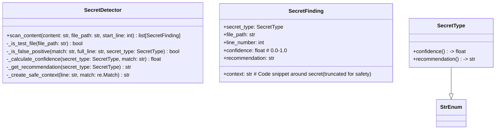

# File: `src/local_deepwiki/core/secret_detector.py`

## File Overview

This file provides functionality to detect hardcoded secrets (e.g., API keys, tokens, credentials) in code repositories. It is designed to help identify potential security vulnerabilities such as those categorized under **CWE-798: Use of Hard-Coded Credentials**.

The core logic is encapsulated in the `SecretDetector` class, which scans code content using regular expression patterns to identify potential secrets. It also includes helper functions for scanning entire repositories and filtering out false positives or test files.

The module integrates with the project's logging system and file path utilities to ensure accurate scanning and reporting.

## Key Concepts

### Secret Detection Patterns
The module defines a set of regex patterns for detecting various types of secrets using the `SecretType` enum. These patterns are carefully chosen to balance detection accuracy with false positive rates.

Each `SecretType` includes:
- A unique identifier (`value`)
- A base confidence score (`confidence` property)
- A remediation recommendation (`recommendation` property)

### Confidence Scoring
Confidence scores are used to prioritize findings. The base confidence is defined per secret type, but can be adjusted via `_calculate_confidence`. This approach allows for different levels of certainty depending on the secret type (e.g., AWS keys may be more confidently identified than generic tokens).

### False Positive Suppression
The system implements multiple strategies to suppress false positives:
1. **Test file filtering**: Low-confidence secrets are ignored in test files.
2. **Pattern matching**: Known false positive patterns are checked against matches.
3. **Compound variable name patterns**: Certain naming conventions (like `GITHUB_TOKEN = ...`) are suppressed for low-confidence types.

This helps reduce noise in the results without missing actual secrets.

### Safe Context Masking
When reporting findings, sensitive content is masked in the context to prevent accidental exposure. For example, private keys show only the header, while other secrets display partial visible characters surrounded by asterisks.

### Repository Scanning
The `scan_repository_for_secrets` function provides a top-level interface for scanning an entire repository. It recursively walks through all files, skips binary and common non-source files, and aggregates findings by file path.

## Integration

This file is part of the `local_deepwiki` codebase and integrates with:
- [`local_deepwiki.core.path_utils.is_test_file`](../generators/analysis/source_filter.md): Used to determine if a file should be skipped during scanning.
- [`local_deepwiki.logging.get_logger`](../logging.md): Provides logging capabilities for debug and informational messages.

It is used by:
- `SecretType`, `SecretFinding`, and `SecretDetector` are referenced by `test_secret_detector` tests.
- `SecretDetector` is used by protocols or types modules.
- `_should_skip_file` is used by `test_secret_detector`.

It is closely related to:
- `src/local_deepwiki/cli/config_validator.py`
- `src/local_deepwiki/cli/main.py`
- `src/local_deepwiki/core/reranker.py`
- `src/local_deepwiki/generators/analysis/api_docs.py`
- `src/local_deepwiki/generators/analysis/dependency_graph_data.py`

## Design Notes

### Trade-offs and Considerations
1. **False Positive Reduction**: By skipping low-confidence patterns in test files and applying compound variable name checks, the system reduces noise but may miss some real secrets in test contexts.
2. **Performance**: The scanning process reads each file once and uses efficient regex pattern matching, making it suitable for large repositories.
3. **Security vs. Usability**: Context is masked to avoid accidental exposure, but still provides enough information for developers to understand where the secret was found.

### Edge Cases Handled
- **Binary Files**: Skipped during repository scan using `_should_skip_file`.
- **[Permission](../security/access_control.md) Errors**: Files that cannot be read are logged and skipped.
- **Empty Lines and Comments**: These are filtered out early to avoid unnecessary processing.
- **Long Context Lines**: Truncated to avoid overly verbose output.

### Implementation Choices
- **StrEnum for SecretType**: Using `StrEnum` allows for string-based comparisons and consistent enumeration across the codebase.
- **Dataclass for SecretFinding**: Enables structured representation of findings with clear fields for reporting.
- **Modular Pattern Matching**: Each secret type has its own pattern, allowing for easy extension or modification of detection logic.
- **Context Masking Logic**: Designed to preserve enough context for debugging while hiding actual secrets — especially important for private keys and long tokens.

### Constants Used
- `MIN_SECRET_MASK_LENGTH`: Minimum length for masking logic.
- `MAX_SECRET_CONTEXT_LENGTH`: Maximum allowed context length for safety.
- `_SKIP_NAMES`, `_SKIP_EXTENSIONS`, `_SKIP_DIRS`: Define which files or directories should be skipped during scanning.
- `_CONFIDENCE_SCORES`, `_RECOMMENDATIONS`: Maps secret types to their default confidence and recommendations.

## API Reference

### class `SecretType`

**Inherits from:** `StrEnum`

Types of secrets that can be detected.

**Methods:**


<details>
<summary>View Source (lines 29-58) | <a href="https://github.com/UrbanDiver/local-deepwiki-mcp/blob/main/src/local_deepwiki/core/secret_detector.py#L29-L58">GitHub</a></summary>

```python
class SecretType(StrEnum):
    """Types of secrets that can be detected."""

    AWS_KEY = "aws_access_key"
    AWS_SECRET = "aws_secret_key"
    PRIVATE_KEY = "private_key"
    API_KEY = "api_key"
    GENERIC_TOKEN = "generic_token"
    GITHUB_TOKEN = "github_token"
    GITLAB_TOKEN = "gitlab_token"
    SLACK_TOKEN = "slack_token"
    AZURE_KEY = "azure_key"
    GOOGLE_KEY = "google_key"
    DATABASE_URL = "database_url"
    DOCKER_AUTH = "docker_auth"
    SSH_KEY = "ssh_key"
    PGP_KEY = "pgp_key"

    @property
    def confidence(self) -> float:
        """Base confidence score for this secret type."""
        return _CONFIDENCE_SCORES.get(self, 0.75)

    @property
    def recommendation(self) -> str:
        """Remediation recommendation for this secret type."""
        return _RECOMMENDATIONS.get(
            self,
            f"Review and rotate {self.value} if genuine. Use environment variables or secrets manager.",
        )
```

</details>

#### `confidence`

```python
def confidence() -> float
```

Base confidence score for this secret type.


<details>
<summary>View Source (lines 29-58) | <a href="https://github.com/UrbanDiver/local-deepwiki-mcp/blob/main/src/local_deepwiki/core/secret_detector.py#L29-L58">GitHub</a></summary>

```python
class SecretType(StrEnum):
    """Types of secrets that can be detected."""

    AWS_KEY = "aws_access_key"
    AWS_SECRET = "aws_secret_key"
    PRIVATE_KEY = "private_key"
    API_KEY = "api_key"
    GENERIC_TOKEN = "generic_token"
    GITHUB_TOKEN = "github_token"
    GITLAB_TOKEN = "gitlab_token"
    SLACK_TOKEN = "slack_token"
    AZURE_KEY = "azure_key"
    GOOGLE_KEY = "google_key"
    DATABASE_URL = "database_url"
    DOCKER_AUTH = "docker_auth"
    SSH_KEY = "ssh_key"
    PGP_KEY = "pgp_key"

    @property
    def confidence(self) -> float:
        """Base confidence score for this secret type."""
        return _CONFIDENCE_SCORES.get(self, 0.75)

    @property
    def recommendation(self) -> str:
        """Remediation recommendation for this secret type."""
        return _RECOMMENDATIONS.get(
            self,
            f"Review and rotate {self.value} if genuine. Use environment variables or secrets manager.",
        )
```

</details>

#### `recommendation`

```python
def recommendation() -> str
```

Remediation recommendation for this secret type.


<details>
<summary>View Source (lines 29-58) | <a href="https://github.com/UrbanDiver/local-deepwiki-mcp/blob/main/src/local_deepwiki/core/secret_detector.py#L29-L58">GitHub</a></summary>

```python
class SecretType(StrEnum):
    """Types of secrets that can be detected."""

    AWS_KEY = "aws_access_key"
    AWS_SECRET = "aws_secret_key"
    PRIVATE_KEY = "private_key"
    API_KEY = "api_key"
    GENERIC_TOKEN = "generic_token"
    GITHUB_TOKEN = "github_token"
    GITLAB_TOKEN = "gitlab_token"
    SLACK_TOKEN = "slack_token"
    AZURE_KEY = "azure_key"
    GOOGLE_KEY = "google_key"
    DATABASE_URL = "database_url"
    DOCKER_AUTH = "docker_auth"
    SSH_KEY = "ssh_key"
    PGP_KEY = "pgp_key"

    @property
    def confidence(self) -> float:
        """Base confidence score for this secret type."""
        return _CONFIDENCE_SCORES.get(self, 0.75)

    @property
    def recommendation(self) -> str:
        """Remediation recommendation for this secret type."""
        return _RECOMMENDATIONS.get(
            self,
            f"Review and rotate {self.value} if genuine. Use environment variables or secrets manager.",
        )
```

</details>

### class `SecretFinding`

Represents a detected secret in code.


<details>
<summary>View Source (lines 138-146) | <a href="https://github.com/UrbanDiver/local-deepwiki-mcp/blob/main/src/local_deepwiki/core/secret_detector.py#L138-L146">GitHub</a></summary>

```python
class SecretFinding:
    """Represents a detected secret in code."""

    secret_type: SecretType
    file_path: str
    line_number: int
    context: str  # Code snippet around secret (truncated for safety)
    confidence: float  # 0.0-1.0
    recommendation: str
```

</details>

### class `SecretDetector`

Detects hardcoded secrets in code content.  Uses regex patterns to identify common secret formats including: - Cloud provider credentials (AWS, Azure, GCP) - Version control tokens (GitHub, GitLab) - Communication tokens (Slack) - Private keys (RSA, SSH, PGP) - Database connection strings - Generic API keys and tokens  False positive filtering is applied to reduce noise from test data, examples, and placeholder values.

**Methods:**


<details>
<summary>View Source (lines 149-428) | <a href="https://github.com/UrbanDiver/local-deepwiki-mcp/blob/main/src/local_deepwiki/core/secret_detector.py#L149-L428">GitHub</a></summary>

```python
class SecretDetector:
    # Methods: scan_content, _is_test_file, _is_false_positive, _calculate_confidence, _get_recommendation, _create_safe_context
```

</details>

#### `scan_content`

```python
def scan_content(content: str, file_path: str, start_line: int = 0) -> list[SecretFinding]
```

Scan code content for secrets.


| Parameter | Type | Default | Description |
|-----------|------|---------|-------------|
| `content` | `str` | - | Code content to scan. |
| `file_path` | `str` | - | Path to file (for reporting). |
| `start_line` | `int` | `0` | Starting line number offset (for large files). |


---


<details>
<summary>View Source (lines 260-322) | <a href="https://github.com/UrbanDiver/local-deepwiki-mcp/blob/main/src/local_deepwiki/core/secret_detector.py#L260-L322">GitHub</a></summary>

```python
def scan_content(
        self,
        content: str,
        file_path: str,
        start_line: int = 0,
    ) -> list[SecretFinding]:
        """Scan code content for secrets.

        Args:
            content: Code content to scan.
            file_path: Path to file (for reporting).
            start_line: Starting line number offset (for large files).

        Returns:
            List of SecretFinding objects for detected secrets.
        """
        findings: list[SecretFinding] = []
        lines = content.split("\n")
        is_test_file = self._is_test_file(file_path)

        for line_num, line in enumerate(lines, start=start_line + 1):
            # Skip empty lines
            stripped = line.strip()
            if not stripped:
                continue

            # Skip single-line comments (basic heuristic)
            if stripped.startswith(("#", "//", "*", "/*")):
                continue

            # Check each pattern
            for secret_type, pattern in self.PATTERNS.items():
                # Skip low-confidence patterns in test files — test files
                # routinely use dummy keys that look real but aren't.
                if is_test_file and secret_type in self._LOW_CONFIDENCE_TYPES:
                    continue

                matches = pattern.finditer(line)

                for match in matches:
                    matched_text = match.group()

                    # Check false positives
                    if self._is_false_positive(matched_text, line, secret_type):
                        continue

                    # Create truncated context (hide actual secret)
                    context = self._create_safe_context(line, match)

                    findings.append(
                        SecretFinding(
                            secret_type=secret_type,
                            file_path=file_path,
                            line_number=line_num,
                            context=context,
                            confidence=self._calculate_confidence(
                                secret_type, matched_text
                            ),
                            recommendation=self._get_recommendation(secret_type),
                        )
                    )

        return findings
```

</details>

### Functions

#### `scan_repository_for_secrets`

```python
def scan_repository_for_secrets(repo_path: Path) -> dict[str, list[SecretFinding]]
```

Scan entire repository for secrets.


| Parameter | Type | Default | Description |
|-----------|------|---------|-------------|
| `repo_path` | `Path` | - | Path to the repository root. |

**Returns:** `dict[str, list[SecretFinding]]`


<details>
<summary>View Source (lines 568-624) | <a href="https://github.com/UrbanDiver/local-deepwiki-mcp/blob/main/src/local_deepwiki/core/secret_detector.py#L568-L624">GitHub</a></summary>

```python
def scan_repository_for_secrets(repo_path: Path) -> dict[str, list[SecretFinding]]:
    """Scan entire repository for secrets.

    Args:
        repo_path: Path to the repository root.

    Returns:
        Dictionary mapping file paths to lists of SecretFinding objects.
        Empty dict if no secrets found.
    """
    detector = SecretDetector()
    findings_by_file: dict[str, list[SecretFinding]] = {}
    files_scanned = 0
    files_skipped = 0

    logger.debug("Starting secret scan of repository: %s", repo_path)

    for file_path in repo_path.rglob("*"):
        if not file_path.is_file():
            continue

        # Skip binary files and common non-source files
        if _should_skip_file(file_path):
            files_skipped += 1
            continue

        try:
            # Read file content
            content = file_path.read_text(errors="ignore")
            files_scanned += 1

            # Get relative path for reporting
            try:
                rel_path = str(file_path.relative_to(repo_path))
            except ValueError:
                rel_path = str(file_path)

            # Scan content
            findings = detector.scan_content(content, rel_path)

            if findings:
                findings_by_file[str(file_path)] = findings

        except (OSError, PermissionError) as e:
            logger.debug(
                "Could not read file for secret scanning: %s: %s", file_path, e
            )
            continue

    logger.debug(
        "Secret scan complete: scanned %d files, skipped %d files, found secrets in %d files",
        files_scanned,
        files_skipped,
        len(findings_by_file),
    )

    return findings_by_file
```

</details>

## Class Diagram



## Call Graph

```mermaid
flowchart TD
    N0[SecretDetector]
    N1[SecretDetector._create_safe...]
    N2[SecretDetector._is_false_po...]
    N3[SecretDetector._is_test_file]
    N4[SecretDetector.scan_content]
    N5[SecretFinding]
    N6[_calculate_confidence]
    N7[_create_safe_context]
    N8[_get_recommendation]
    N9[_is_false_positive]
    N10[_is_test_file]
    N11[_should_skip_file]
    N12[end]
    N13[finditer]
    N14[group]
    N15[is_file]
    N16[is_test_file]
    N17[read_text]
    N18[relative_to]
    N19[rglob]
    N20[scan_content]
    N21[scan_repository_for_secrets]
    N22[search]
    N23[start]
    N21 --> N0
    N21 --> N19
    N21 --> N15
    N21 --> N11
    N21 --> N17
    N21 --> N18
    N21 --> N20
    N4 --> N10
    N4 --> N13
    N4 --> N14
    N4 --> N9
    N4 --> N7
    N4 --> N5
    N4 --> N6
    N4 --> N8
    N3 --> N16
    N2 --> N22
    N1 --> N14
    N1 --> N23
    N1 --> N12
    classDef func fill:#e1f5fe
    class N0,N5,N6,N7,N8,N9,N10,N11,N12,N13,N14,N15,N16,N17,N18,N19,N20,N21,N22,N23 func
    classDef method fill:#fff3e0
    class N1,N2,N3,N4 method
```



## Used By

Functions and methods in this file and their callers:

- **`SecretDetector`**: called by `scan_repository_for_secrets`
- **`SecretFinding`**: called by `SecretDetector.scan_content`
- **`_calculate_confidence`**: called by `SecretDetector.scan_content`
- **`_create_safe_context`**: called by `SecretDetector.scan_content`
- **`_get_recommendation`**: called by `SecretDetector.scan_content`
- **`_is_false_positive`**: called by `SecretDetector.scan_content`
- **`_is_test_file`**: called by `SecretDetector.scan_content`
- **`_should_skip_file`**: called by `scan_repository_for_secrets`
- **`end`**: called by `SecretDetector._create_safe_context`
- **`finditer`**: called by `SecretDetector.scan_content`
- **`group`**: called by `SecretDetector._create_safe_context`, `SecretDetector.scan_content`
- **`is_file`**: called by `scan_repository_for_secrets`
- **[`is_test_file`](../generators/analysis/source_filter.md)**: called by `SecretDetector._is_test_file`
- **`read_text`**: called by `scan_repository_for_secrets`
- **`relative_to`**: called by `scan_repository_for_secrets`
- **`rglob`**: called by `scan_repository_for_secrets`
- **`scan_content`**: called by `scan_repository_for_secrets`
- **`search`**: called by `SecretDetector._is_false_positive`
- **`start`**: called by `SecretDetector._create_safe_context`

## Usage Examples

*Examples extracted from test files*

### Test creating a SecretFinding

From `test_secret_detector.py::TestSecretFindingDataclass::test_create_finding`:

```python
secret_type=SecretType.AWS_KEY,
    file_path="config.py",
    line_number=42,
    context="AWS_ACCESS_KEY_ID = AKIA****1234",
    confidence=0.95,
    recommendation="Rotate AWS access key immediately.",
)

assert finding.secret_type == SecretType.AWS_KEY
assert finding.file_path == "config.py"
```

### Test creating a SecretFinding

From `test_secret_detector.py::TestSecretFindingDataclass::test_create_finding`:

```python
finding = SecretFinding(
    secret_type=SecretType.AWS_KEY,
    file_path="config.py",
    line_number=42,
    context="AWS_ACCESS_KEY_ID = AKIA****1234",
    confidence=0.95,
    recommendation="Rotate AWS access key immediately.",
)

assert finding.secret_type == SecretType.AWS_KEY
assert finding.file_path == "config.py"
```

### Test all fields are accessible

From `test_secret_detector.py::TestSecretFindingDataclass::test_finding_all_fields`:

```python
secret_type=SecretType.GITHUB_TOKEN,
    file_path="auth.py",
    line_number=10,
    context="token = ghp_****abcd",
    confidence=0.95,
    recommendation="Revoke token",
)

assert finding.secret_type is not None
assert finding.file_path is not None
```

### Test all fields are accessible

From `test_secret_detector.py::TestSecretFindingDataclass::test_finding_all_fields`:

```python
finding = SecretFinding(
    secret_type=SecretType.GITHUB_TOKEN,
    file_path="auth.py",
    line_number=10,
    context="token = ghp_****abcd",
    confidence=0.95,
    recommendation="Revoke token",
)

assert finding.secret_type is not None
assert finding.file_path is not None
```

### Test detecting various secret types in content

From `test_secret_detector.py::TestSecretDetectorScanContent::test_finds_secret_by_type`:

```python
detector = SecretDetector()
findings = detector.scan_content(content, filename)

assert len(findings) >= 1
secret_types = [f.secret_type for f in findings]
assert expected_type in secret_types
```


## Last Modified

| Entity | Type | Author | Date | Commit |
|--------|------|--------|------|--------|
| `_should_skip_file` | function | Brian Breidenbach | 1 week ago | `af244a5` refactor: split core hotspo... |
| `SecretDetector` | class | Brian Breidenbach | Feb 22, 2026 | `213e3ce` refactor: unify _is_test_fi... |
| `_is_test_file` | method | Brian Breidenbach | Feb 22, 2026 | `213e3ce` refactor: unify _is_test_fi... |
| `scan_content` | method | Brian Breidenbach | Feb 21, 2026 | `36372e5` fix: scope compound-name fa... |
| `_is_false_positive` | method | Brian Breidenbach | Feb 21, 2026 | `36372e5` fix: scope compound-name fa... |
| `SecretType` | class | Brian Breidenbach | Feb 21, 2026 | `01e8359` refactor: add __all__, dict... |
| `_calculate_confidence` | method | Brian Breidenbach | Feb 21, 2026 | `01e8359` refactor: add __all__, dict... |
| `_get_recommendation` | method | Brian Breidenbach | Feb 21, 2026 | `01e8359` refactor: add __all__, dict... |
| `_create_safe_context` | method | Brian Breidenbach | Feb 20, 2026 | `6be69f5` refactor: low-priority Pyth... |
| `scan_repository_for_secrets` | function | Brian Breidenbach | Feb 20, 2026 | `b807417` refactor: high-priority Pyt... |
| `SecretFinding` | class | Brian Breidenbach | Jan 26, 2026 | `9844731` Phase 3: Implement input va... |

## Additional Source Code

Source code for functions and methods not listed in the API Reference above.

#### `_is_test_file`

<details>
<summary>View Source (lines 325-330) | <a href="https://github.com/UrbanDiver/local-deepwiki-mcp/blob/main/src/local_deepwiki/core/secret_detector.py#L325-L330">GitHub</a></summary>

```python
def _is_test_file(file_path: str) -> bool:
        """Check if the file path indicates a test file.

        Delegates to :func:`local_deepwiki.core.path_utils.is_test_file`.
        """
        return is_test_file(file_path, check_filename=True)
```

</details>


#### `_is_false_positive`

<details>
<summary>View Source (lines 332-363) | <a href="https://github.com/UrbanDiver/local-deepwiki-mcp/blob/main/src/local_deepwiki/core/secret_detector.py#L332-L363">GitHub</a></summary>

```python
def _is_false_positive(
        self, match: str, full_line: str, secret_type: SecretType
    ) -> bool:
        """Check if match is a known false positive.

        Args:
            match: The matched secret pattern.
            full_line: The full line containing the match.
            secret_type: The type of secret that was matched.

        Returns:
            True if this appears to be a false positive.
        """
        # Check the match itself
        for pattern in self.FALSE_POSITIVES:
            if pattern.search(match):
                return True

        # Also check surrounding context in the line
        for pattern in self.FALSE_POSITIVES:
            if pattern.search(full_line):
                return True

        # Compound variable name patterns only suppress low-confidence types
        # (e.g. GENERIC_TOKEN, API_KEY) to avoid filtering out high-confidence
        # matches like ghp_* found in a line containing "GITHUB_TOKEN = ..."
        if secret_type in self._LOW_CONFIDENCE_TYPES:
            for pattern in self._COMPOUND_NAME_PATTERNS:
                if pattern.search(full_line):
                    return True

        return False
```

</details>


#### `_calculate_confidence`

<details>
<summary>View Source (lines 366-376) | <a href="https://github.com/UrbanDiver/local-deepwiki-mcp/blob/main/src/local_deepwiki/core/secret_detector.py#L366-L376">GitHub</a></summary>

```python
def _calculate_confidence(secret_type: SecretType, match: str) -> float:
        """Calculate confidence score for secret detection.

        Args:
            secret_type: The type of secret detected.
            match: The matched text.

        Returns:
            Confidence score between 0.0 and 1.0.
        """
        return secret_type.confidence
```

</details>


#### `_get_recommendation`

<details>
<summary>View Source (lines 379-388) | <a href="https://github.com/UrbanDiver/local-deepwiki-mcp/blob/main/src/local_deepwiki/core/secret_detector.py#L379-L388">GitHub</a></summary>

```python
def _get_recommendation(secret_type: SecretType) -> str:
        """Get remediation recommendation for secret type.

        Args:
            secret_type: The type of secret detected.

        Returns:
            Recommendation string for remediation.
        """
        return secret_type.recommendation
```

</details>


#### `_create_safe_context`

<details>
<summary>View Source (lines 391-428) | <a href="https://github.com/UrbanDiver/local-deepwiki-mcp/blob/main/src/local_deepwiki/core/secret_detector.py#L391-L428">GitHub</a></summary>

```python
def _create_safe_context(line: str, match: re.Match) -> str:
        """Create a safe context string that partially masks the secret.

        Args:
            line: The full line containing the match.
            match: The regex match object.

        Returns:
            Truncated context with secret partially masked.
        """
        # Get the matched text
        matched_text = match.group()

        # For private keys, just show the header
        if "PRIVATE KEY" in matched_text:
            return matched_text[:50] + "..."

        # For other secrets, show first few and last few characters
        if len(matched_text) > MIN_SECRET_MASK_LENGTH:
            visible_start = min(6, len(matched_text) // 4)
            visible_end = min(4, len(matched_text) // 4)
            masked = matched_text[:visible_start] + "****" + matched_text[-visible_end:]
        else:
            masked = matched_text[:2] + "****"

        # Replace the secret in the line context
        line_start = max(0, match.start() - 20)
        line_end = min(len(line), match.end() + 20)
        context = line[line_start:line_end].strip()

        # Replace actual secret with masked version in context
        context = context.replace(matched_text, masked)

        # Truncate if too long
        if len(context) > MAX_SECRET_CONTEXT_LENGTH:
            context = context[:MAX_SECRET_CONTEXT_LENGTH] + "..."

        return context
```

</details>


#### `_should_skip_file`

<details>
<summary>View Source (lines 544-565) | <a href="https://github.com/UrbanDiver/local-deepwiki-mcp/blob/main/src/local_deepwiki/core/secret_detector.py#L544-L565">GitHub</a></summary>

```python
def _should_skip_file(file_path: Path) -> bool:
    """Check if file should be skipped from secret scanning.

    Args:
        file_path: Path to the file.

    Returns:
        True if the file should be skipped.
    """
    if file_path.name in _SKIP_NAMES:
        return True

    if file_path.suffix.lower() in _SKIP_EXTENSIONS:
        return True

    for part in file_path.parts:
        if part in _SKIP_DIRS:
            return True
        if part.endswith(".egg-info"):
            return True

    return False
```

</details>

## Relevant Source Files

- `src/local_deepwiki/core/secret_detector.py:29-58`
