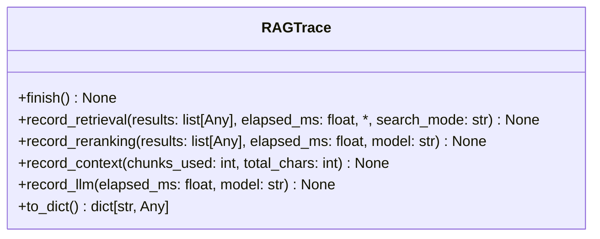
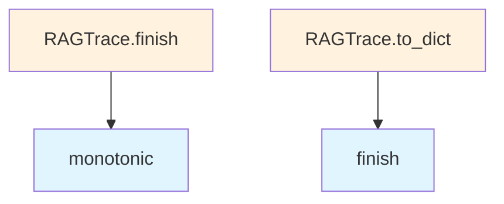

# File: `src/local_deepwiki/core/tracing.py`

## File Overview

This file implements the `RAGTrace` class, which provides structured observability for the Retrieval-Augmented Generation (RAG) pipeline. It records timing, chunk counts, scores, and model information at each stage of the pipeline — from retrieval to LLM generation — to support debugging and answer provenance inspection when `debug=True` is enabled.

The design emphasizes minimal data serialization by omitting default or zero values in the final output, ensuring that only meaningful metrics are included in trace data.

## Key Concepts

### RAG Pipeline Stages
The `RAGTrace` class is designed to track metrics across the following stages:
1. **Retrieval**: Records chunk count, scores, and time.
2. **Reranking**: Captures model used, time, and reranked scores.
3. **Agentic RAG**: Tracks time and optional rewritten query.
4. **Context Construction**: Logs number of chunks used and total character count.
5. **LLM Generation**: Stores time and optionally the model name.

Each stage has dedicated methods (`record_retrieval`, `record_reranking`, etc.) that update internal state fields, allowing a complete profile of the pipeline execution to be built.

### Serialization with `to_dict`
The `to_dict` method provides a clean, serializable representation of the trace data. It uses a selective inclusion strategy:
- Always includes `query` and `total_time_ms`.
- Only includes optional stages if they were executed (e.g., `reranking`, `agentic_rag`, `context`, `llm`).
- Omits zero or default values to reduce noise in trace outputs.

This approach allows the trace data to be compact and focused on actual pipeline activity.

## Integration

This file is used by the `test_rag_tracing` test module, indicating its role in testing and validating the observability features of the RAG pipeline.

It is part of the core RAG infrastructure and integrates with other modules such as:
- `src/local_deepwiki/cli/status_cli.py`: Likely uses tracing data for CLI status reporting.
- `src/local_deepwiki/core/rate_limiter.py`: May use tracing for performance monitoring.
- `src/local_deepwiki/generators/analysis/api_docs.py`: Possibly integrates tracing into documentation generation.
- `src/local_deepwiki/generators/diagrams/_utils.py`: Could visualize trace data for pipeline diagrams.
- `src/local_deepwiki/generators/progress_tracker.py`: May rely on trace data for progress reporting.

These integrations suggest that `RAGTrace` is a foundational component that supports both runtime diagnostics and tooling for understanding pipeline behavior.

## Design Notes

### Timing Precision
The use of `time.monotonic()` ensures monotonic time measurement, which avoids issues related to system clock adjustments. The result is converted to milliseconds for consistency with expected time units in downstream tools.

### Optional Fields
Fields like `reranking`, `agentic_rag`, `context`, and `llm` are only included in the serialized output if they have been populated. This design prevents cluttering trace data with unused or irrelevant metrics.

### Dataclass Fields
While not explicitly shown, the use of `dataclass` implies that internal state is structured for easy access and mutation. Fields like `retrieval_chunks`, `retrieval_scores`, and `total_time_ms` are used to store intermediate results from pipeline stages.

### Minimal Serialization
The `to_dict` method avoids serializing empty or default values, which reduces trace data size and improves readability when inspecting pipeline behavior. This is especially useful in debugging scenarios where only relevant metrics should be shown.

### Extensibility
Although not currently used, the class is structured to support future pipeline stages or metrics. For example, the presence of `agentic_rag_enabled` suggests that additional stages might be added in the future.

This design supports a modular, extensible tracing system that can evolve with the RAG pipeline without breaking existing functionality.

## API Reference

### class `RAGTrace`

Records one RAG pipeline execution for debugging.  Mutable during pipeline execution, then serialised via ``to_dict()``. Only non-default fields are included in the output to keep payloads lean.

**Methods:**


<details>
<summary>View Source (lines 16-146) | <a href="https://github.com/UrbanDiver/local-deepwiki-mcp/blob/main/src/local_deepwiki/core/tracing.py#L16-L146">GitHub</a></summary>

```python
class RAGTrace:
    # Methods: finish, record_retrieval, record_reranking, record_context, record_llm, to_dict
```

</details>

#### `finish`

```python
def finish() -> None
```

Stamp ``total_time_ms`` from ``start_time``.


<details>
<summary>View Source (lines 58-60) | <a href="https://github.com/UrbanDiver/local-deepwiki-mcp/blob/main/src/local_deepwiki/core/tracing.py#L58-L60">GitHub</a></summary>

```python
def finish(self) -> None:
        """Stamp ``total_time_ms`` from ``start_time``."""
        self.total_time_ms = (time.monotonic() - self.start_time) * 1000
```

</details>

#### `record_retrieval`

```python
def record_retrieval(results: list[Any], elapsed_ms: float, search_mode: str = "vector") -> None
```

Record retrieval phase metrics.


| Parameter | Type | Default | Description |
|-----------|------|---------|-------------|
| `results` | `list[Any]` | - | - |
| `elapsed_ms` | `float` | - | - |
| `search_mode` | `str` | `"vector"` | - |


<details>
<summary>View Source (lines 62-75) | <a href="https://github.com/UrbanDiver/local-deepwiki-mcp/blob/main/src/local_deepwiki/core/tracing.py#L62-L75">GitHub</a></summary>

```python
def record_retrieval(
        self,
        results: list[Any],
        elapsed_ms: float,
        *,
        search_mode: str = "vector",
    ) -> None:
        """Record retrieval phase metrics."""
        self.retrieval_chunks = len(results)
        self.retrieval_scores = [
            round(r.score, 4) for r in results if hasattr(r, "score")
        ]
        self.retrieval_time_ms = round(elapsed_ms, 2)
        self.search_mode = search_mode
```

</details>

#### `record_reranking`

```python
def record_reranking(results: list[Any], elapsed_ms: float, model: str) -> None
```

Record reranking phase metrics.


| Parameter | Type | Default | Description |
|-----------|------|---------|-------------|
| `results` | `list[Any]` | - | - |
| `elapsed_ms` | `float` | - | - |
| `model` | `str` | - | - |


<details>
<summary>View Source (lines 77-89) | <a href="https://github.com/UrbanDiver/local-deepwiki-mcp/blob/main/src/local_deepwiki/core/tracing.py#L77-L89">GitHub</a></summary>

```python
def record_reranking(
        self,
        results: list[Any],
        elapsed_ms: float,
        model: str,
    ) -> None:
        """Record reranking phase metrics."""
        self.reranking_enabled = True
        self.reranking_model = model
        self.reranking_time_ms = round(elapsed_ms, 2)
        self.reranked_scores = [
            round(r.score, 4) for r in results if hasattr(r, "score")
        ]
```

</details>

#### `record_context`

```python
def record_context(chunks_used: int, total_chars: int) -> None
```

Record context construction metrics.


| Parameter | Type | Default | Description |
|-----------|------|---------|-------------|
| `chunks_used` | `int` | - | - |
| `total_chars` | `int` | - | - |


<details>
<summary>View Source (lines 91-94) | <a href="https://github.com/UrbanDiver/local-deepwiki-mcp/blob/main/src/local_deepwiki/core/tracing.py#L91-L94">GitHub</a></summary>

```python
def record_context(self, chunks_used: int, total_chars: int) -> None:
        """Record context construction metrics."""
        self.context_chunks_used = chunks_used
        self.context_total_chars = total_chars
```

</details>

#### `record_llm`

```python
def record_llm(elapsed_ms: float, model: str = "") -> None
```

Record LLM generation metrics.


| Parameter | Type | Default | Description |
|-----------|------|---------|-------------|
| `elapsed_ms` | `float` | - | - |
| `model` | `str` | `""` | - |


<details>
<summary>View Source (lines 96-99) | <a href="https://github.com/UrbanDiver/local-deepwiki-mcp/blob/main/src/local_deepwiki/core/tracing.py#L96-L99">GitHub</a></summary>

```python
def record_llm(self, elapsed_ms: float, model: str = "") -> None:
        """Record LLM generation metrics."""
        self.llm_time_ms = round(elapsed_ms, 2)
        self.llm_model = model
```

</details>

#### `to_dict`

```python
def to_dict() -> dict[str, Any]
```

Serialise to dict, omitting default/zero/empty values.


<details>
<summary>View Source (lines 101-146) | <a href="https://github.com/UrbanDiver/local-deepwiki-mcp/blob/main/src/local_deepwiki/core/tracing.py#L101-L146">GitHub</a></summary>

```python
def to_dict(self) -> dict[str, Any]:
        """Serialise to dict, omitting default/zero/empty values."""
        self.finish()
        result: dict[str, Any] = {}
        # Always include query and total
        result["query"] = self.query
        result["total_time_ms"] = round(self.total_time_ms, 2)

        # Retrieval (always present)
        result["retrieval"] = {
            "chunks": self.retrieval_chunks,
            "scores": self.retrieval_scores,
            "time_ms": self.retrieval_time_ms,
            "mode": self.search_mode,
        }

        # Reranking (only if enabled)
        if self.reranking_enabled:
            result["reranking"] = {
                "model": self.reranking_model,
                "time_ms": self.reranking_time_ms,
                "scores": self.reranked_scores,
            }

        # Agentic RAG (only if enabled)
        if self.agentic_rag_enabled:
            agentic: dict[str, Any] = {"time_ms": self.agentic_time_ms}
            if self.agentic_rewritten_query:
                agentic["rewritten_query"] = self.agentic_rewritten_query
            result["agentic_rag"] = agentic

        # Context
        if self.context_chunks_used > 0:
            result["context"] = {
                "chunks_used": self.context_chunks_used,
                "total_chars": self.context_total_chars,
            }

        # LLM
        if self.llm_time_ms > 0:
            llm: dict[str, Any] = {"time_ms": self.llm_time_ms}
            if self.llm_model:
                llm["model"] = self.llm_model
            result["llm"] = llm

        return result
```

</details>

## Class Diagram



## Call Graph



## Used By

Functions and methods in this file and their callers:

- **`finish`**: called by `RAGTrace.to_dict`
- **`monotonic`**: called by `RAGTrace.finish`

## Last Modified

| Entity | Type | Author | Date | Commit |
|--------|------|--------|------|--------|
| `RAGTrace` | class | Brian Breidenbach | 2 weeks ago | `8203fe8` feat: add service layer, hy... |
| `finish` | method | Brian Breidenbach | 2 weeks ago | `8203fe8` feat: add service layer, hy... |
| `record_retrieval` | method | Brian Breidenbach | 2 weeks ago | `8203fe8` feat: add service layer, hy... |
| `record_reranking` | method | Brian Breidenbach | 2 weeks ago | `8203fe8` feat: add service layer, hy... |
| `record_context` | method | Brian Breidenbach | 2 weeks ago | `8203fe8` feat: add service layer, hy... |
| `record_llm` | method | Brian Breidenbach | 2 weeks ago | `8203fe8` feat: add service layer, hy... |
| `to_dict` | method | Brian Breidenbach | 2 weeks ago | `8203fe8` feat: add service layer, hy... |

## Relevant Source Files

- `src/local_deepwiki/core/tracing.py:16-146`
