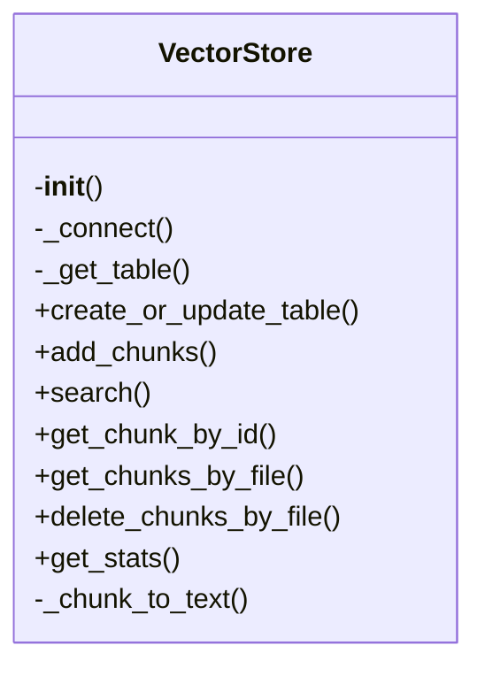

# File Overview

This file defines the `VectorStore` class, which provides an interface for managing vector embeddings using LanceDB. It supports operations like adding code chunks, searching for similar code chunks, and managing the underlying vector database.

# Classes

## VectorStore

The VectorStore class provides methods to interact with a LanceDB database for storing and retrieving vector embeddings of code chunks.

### Methods

#### `__init__(self, db_path: str, embedding_provider: EmbeddingProvider)`
Initializes the VectorStore with a database path and an embedding provider.

- **Parameters**:
  - `db_path` (str): Path to the LanceDB database.
  - `embedding_provider` (EmbeddingProvider): Provider used to generate embeddings.

#### `add_chunk(self, chunk: CodeChunk) -> None`
Adds a single code chunk to the vector store.

- **Parameters**:
  - `chunk` (CodeChunk): The code chunk to add.

#### `add_chunks(self, chunks: list[CodeChunk]) -> None`
Adds multiple code chunks to the vector store.

- **Parameters**:
  - `chunks` (list[CodeChunk]): List of code chunks to add.

#### `search(self, query: str, limit: int = 10) -> list[SearchResult]`
Searches for code chunks similar to the given query.

- **Parameters**:
  - `query` (str): Query string to search for.
  - `limit` (int): Maximum number of results to return (default: 10).

- **Returns**:
  - `list[SearchResult]`: List of search results.

#### `get_table(self) -> Table`
Retrieves the LanceDB table used for storing vectors.

- **Returns**:
  - `Table`: The LanceDB table instance.

#### `save(self) -> None`
Saves the current state of the vector store.

- **Returns**:
  - `None`

#### `load(self) -> None`
Loads the vector store from disk.

- **Returns**:
  - `None`

# Functions

No standalone functions are defined in this file.

# Usage Examples

```python
from local_deepwiki.core.vectorstore import VectorStore
from local_deepwiki.providers.openai import OpenAIEmbeddingProvider
from local_deepwiki.models import CodeChunk

# Initialize the vector store
embedding_provider = OpenAIEmbeddingProvider(api_key="your-api-key")
vector_store = VectorStore(db_path="./vector_db", embedding_provider=embedding_provider)

# Add a code chunk
chunk = CodeChunk(
    id="chunk-1",
    content="def hello_world():\n    print('Hello, World!')",
    file_path="example.py",
    start_line=1,
    end_line=3
)
vector_store.add_chunk(chunk)

# Search for similar code
results = vector_store.search("print function", limit=5)
for result in results:
    print(result.chunk.content)
```

# Related Components

- `CodeChunk`: Represents a code chunk with metadata.
- `SearchResult`: Represents a search result with a code chunk and similarity score.
- `EmbeddingProvider`: Base class for embedding providers used to generate vector embeddings.
- `lancedb.table.Table`: LanceDB table used for vector storage and retrieval.

## API Reference

### class `VectorStore`

Vector store using LanceDB for code chunk storage and semantic search.

**Methods:**

#### `__init__`

```python
def __init__(db_path: Path, embedding_provider: EmbeddingProvider)
```

Initialize the vector store.


| [Parameter](../generators/api_docs.md) | Type | Default | Description |
|-----------|------|---------|-------------|
| `db_path` | `Path` | - | Path to the LanceDB database directory. |
| `embedding_provider` | `EmbeddingProvider` | - | Provider for generating embeddings. |

#### `create_or_update_table`

```python
async def create_or_update_table(chunks: list[CodeChunk]) -> int
```

Create or update the vector table with code chunks.


| [Parameter](../generators/api_docs.md) | Type | Default | Description |
|-----------|------|---------|-------------|
| `chunks` | `list[CodeChunk]` | - | List of code chunks to store. |

#### `add_chunks`

```python
async def add_chunks(chunks: list[CodeChunk]) -> int
```

Add chunks to existing table.


| [Parameter](../generators/api_docs.md) | Type | Default | Description |
|-----------|------|---------|-------------|
| `chunks` | `list[CodeChunk]` | - | List of code chunks to add. |

#### `search`

```python
async def search(query: str, limit: int = 10, language: str | None = None, chunk_type: str | None = None) -> list[SearchResult]
```

Search for similar code chunks.


| [Parameter](../generators/api_docs.md) | Type | Default | Description |
|-----------|------|---------|-------------|
| `query` | `str` | - | Search query text. |
| `limit` | `int` | `10` | Maximum number of results. |
| `language` | `str | None` | `None` | Optional language filter. |
| `chunk_type` | `str | None` | `None` | Optional chunk type filter. |

#### `get_chunk_by_id`

```python
async def get_chunk_by_id(chunk_id: str) -> CodeChunk | None
```

Get a specific chunk by ID.


| [Parameter](../generators/api_docs.md) | Type | Default | Description |
|-----------|------|---------|-------------|
| `chunk_id` | `str` | - | The chunk ID. |

#### `get_chunks_by_file`

```python
async def get_chunks_by_file(file_path: str) -> list[CodeChunk]
```

Get all chunks for a specific file.


| [Parameter](../generators/api_docs.md) | Type | Default | Description |
|-----------|------|---------|-------------|
| `file_path` | `str` | - | The file path. |

#### `delete_chunks_by_file`

```python
async def delete_chunks_by_file(file_path: str) -> int
```

Delete all chunks for a specific file.


| [Parameter](../generators/api_docs.md) | Type | Default | Description |
|-----------|------|---------|-------------|
| `file_path` | `str` | - | The file path. |

#### `get_stats`

```python
def get_stats() -> dict[str, Any]
```

Get statistics about the vector store.


## Class Diagram



## Call Graph

```mermaid
flowchart TD
    N0[CodeChunk]
    N1[SearchResult]
    N2[VectorStore._connect]
    N3[VectorStore._get_table]
    N4[VectorStore.add_chunks]
    N5[VectorStore.create_or_updat...]
    N6[VectorStore.delete_chunks_b...]
    N7[VectorStore.get_chunk_by_id]
    N8[VectorStore.get_chunks_by_file]
    N9[VectorStore.get_stats]
    N10[VectorStore.search]
    N11[_chunk_to_text]
    N12[_connect]
    N13[_get_table]
    N14[add]
    N15[connect]
    N16[create_or_update_table]
    N17[create_table]
    N18[delete]
    N19[drop_table]
    N20[dumps]
    N21[embed]
    N22[limit]
    N23[loads]
    N24[mkdir]
    N25[open_table]
    N26[search]
    N27[table_names]
    N28[to_list]
    N29[where]
    N2 --> N24
    N2 --> N15
    N3 --> N12
    N3 --> N27
    N3 --> N25
    N5 --> N12
    N5 --> N11
    N5 --> N21
    N5 --> N20
    N5 --> N27
    N5 --> N19
    N5 --> N17
    N4 --> N13
    N4 --> N16
    N4 --> N11
    N4 --> N21
    N4 --> N20
    N4 --> N14
    N10 --> N13
    N10 --> N21
    N10 --> N22
    N10 --> N26
    N10 --> N29
    N10 --> N28
    N10 --> N0
    N10 --> N23
    N10 --> N1
    N7 --> N13
    N7 --> N28
    N7 --> N22
    N7 --> N29
    N7 --> N26
    N7 --> N0
    N7 --> N23
    N8 --> N13
    N8 --> N28
    N8 --> N29
    N8 --> N26
    N8 --> N0
    N8 --> N23
    N6 --> N13
    N6 --> N28
    N6 --> N29
    N6 --> N26
    N6 --> N18
    N9 --> N13
    classDef func fill:#e1f5fe
    class N0,N1,N11,N12,N13,N14,N15,N16,N17,N18,N19,N20,N21,N22,N23,N24,N25,N26,N27,N28,N29 func
    classDef method fill:#fff3e0
    class N2,N3,N4,N5,N6,N7,N8,N9,N10 method
```



## Relevant Source Files

- `src/local_deepwiki/core/vectorstore.py:14-326`

## See Also

- [wiki](../generators/wiki.md) - uses this
- [server](../server.md) - uses this
