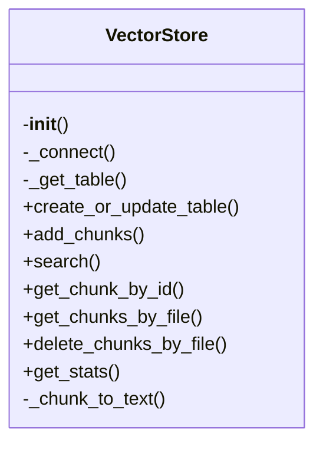

# File Overview

This file defines the `VectorStore` class for managing vector embeddings and search operations using LanceDB. It provides functionality for storing, indexing, and retrieving code chunks based on their vector representations.

# Classes

## VectorStore

The VectorStore class manages vector embeddings using LanceDB for efficient similarity search operations on code chunks.

### Key Methods

- `__init__(self, db_path: str, embedding_provider: EmbeddingProvider)`: Initializes the vector store with a database path and embedding provider
- `create_table(self, table_name: str, embedding_dimension: int)`: Creates a new table in the database with the specified embedding dimension
- `add_chunks(self, table_name: str, chunks: list[CodeChunk])`: Adds code chunks to the specified table
- `search(self, table_name: str, query: str, limit: int = 10)`: Searches for similar code chunks based on a query string
- `get_table(self, table_name: str)`: Retrieves a table by name
- `list_tables(self)`: Lists all available tables in the database

### Usage Example

```python
from local_deepwiki.core.vectorstore import VectorStore
from local_deepwiki.providers.openai import OpenAIEmbeddingProvider

# Initialize vector store
db_path = "vector_db"
embedding_provider = OpenAIEmbeddingProvider(api_key="your-api-key")
vector_store = VectorStore(db_path, embedding_provider)

# Create a table
vector_store.create_table("code_chunks", 1536)

# Add chunks
chunks = [CodeChunk(id="1", content="print('hello')", path="example.py")]
vector_store.add_chunks("code_chunks", chunks)

# Search
results = vector_store.search("code_chunks", "print statement", limit=5)
```

# Functions

No standalone functions are defined in this file. All functionality is encapsulated within the `VectorStore` class.

# Related Components

This file works with the following components:

- `EmbeddingProvider` from `local_deepwiki.providers.base`: Provides the embedding functionality for converting text into vector representations
- `CodeChunk` from `local_deepwiki.models`: Represents individual code chunks with id, content, and path attributes
- `SearchResult` from `local_deepwiki.models`: Represents search results with relevance scores and chunk information
- `lancedb`: Database backend for storing and querying vector embeddings
- `Table` from `lancedb.table`: LanceDB table interface for database operations

The class integrates with the `lancedb` library for vector storage and retrieval operations, and depends on embedding providers to generate vector representations of code content.

## API Reference

### class `VectorStore`

Vector store using LanceDB for code chunk storage and semantic search.

**Methods:**

#### `__init__`

```python
def __init__(db_path: Path, embedding_provider: EmbeddingProvider)
```

Initialize the vector store.


| [Parameter](../generators/api_docs.md) | Type | Default | Description |
|-----------|------|---------|-------------|
| `db_path` | `Path` | - | Path to the LanceDB database directory. |
| `embedding_provider` | `EmbeddingProvider` | - | Provider for generating embeddings. |

#### `create_or_update_table`

```python
async def create_or_update_table(chunks: list[CodeChunk]) -> int
```

Create or update the vector table with code chunks.


| [Parameter](../generators/api_docs.md) | Type | Default | Description |
|-----------|------|---------|-------------|
| `chunks` | `list[CodeChunk]` | - | List of code chunks to store. |

#### `add_chunks`

```python
async def add_chunks(chunks: list[CodeChunk]) -> int
```

Add chunks to existing table.


| [Parameter](../generators/api_docs.md) | Type | Default | Description |
|-----------|------|---------|-------------|
| `chunks` | `list[CodeChunk]` | - | List of code chunks to add. |

#### `search`

```python
async def search(query: str, limit: int = 10, language: str | None = None, chunk_type: str | None = None) -> list[SearchResult]
```

Search for similar code chunks.


| [Parameter](../generators/api_docs.md) | Type | Default | Description |
|-----------|------|---------|-------------|
| `query` | `str` | - | Search query text. |
| `limit` | `int` | `10` | Maximum number of results. |
| `language` | `str | None` | `None` | Optional language filter. |
| `chunk_type` | `str | None` | `None` | Optional chunk type filter. |

#### `get_chunk_by_id`

```python
async def get_chunk_by_id(chunk_id: str) -> CodeChunk | None
```

Get a specific chunk by ID.


| [Parameter](../generators/api_docs.md) | Type | Default | Description |
|-----------|------|---------|-------------|
| `chunk_id` | `str` | - | The chunk ID. |

#### `get_chunks_by_file`

```python
async def get_chunks_by_file(file_path: str) -> list[CodeChunk]
```

Get all chunks for a specific file.


| [Parameter](../generators/api_docs.md) | Type | Default | Description |
|-----------|------|---------|-------------|
| `file_path` | `str` | - | The file path. |

#### `delete_chunks_by_file`

```python
async def delete_chunks_by_file(file_path: str) -> int
```

Delete all chunks for a specific file.


| [Parameter](../generators/api_docs.md) | Type | Default | Description |
|-----------|------|---------|-------------|
| `file_path` | `str` | - | The file path. |

#### `get_stats`

```python
def get_stats() -> dict[str, Any]
```

Get statistics about the vector store.


## Class Diagram



## Call Graph

```mermaid
flowchart TD
    N0[CodeChunk]
    N1[ValueError]
    N2[VectorStore._connect]
    N3[VectorStore._get_table]
    N4[VectorStore.add_chunks]
    N5[VectorStore.create_or_updat...]
    N6[VectorStore.delete_chunks_b...]
    N7[VectorStore.get_chunk_by_id]
    N8[VectorStore.get_chunks_by_file]
    N9[VectorStore.get_stats]
    N10[VectorStore.search]
    N11[_chunk_to_text]
    N12[_connect]
    N13[_get_table]
    N14[_sanitize_string_value]
    N15[add]
    N16[connect]
    N17[create_or_update_table]
    N18[create_table]
    N19[drop_table]
    N20[dumps]
    N21[embed]
    N22[limit]
    N23[loads]
    N24[mkdir]
    N25[open_table]
    N26[search]
    N27[table_names]
    N28[to_list]
    N29[where]
    N2 --> N24
    N2 --> N16
    N3 --> N12
    N3 --> N27
    N3 --> N25
    N5 --> N12
    N5 --> N11
    N5 --> N21
    N5 --> N20
    N5 --> N27
    N5 --> N19
    N5 --> N18
    N4 --> N13
    N4 --> N17
    N4 --> N11
    N4 --> N21
    N4 --> N20
    N4 --> N15
    N10 --> N13
    N10 --> N21
    N10 --> N22
    N10 --> N26
    N10 --> N1
    N10 --> N29
    N10 --> N28
    N10 --> N0
    N10 --> N23
    N7 --> N13
    N7 --> N14
    N7 --> N28
    N7 --> N22
    N7 --> N29
    N7 --> N26
    N7 --> N0
    N7 --> N23
    N8 --> N13
    N8 --> N14
    N8 --> N28
    N8 --> N29
    N8 --> N26
    N8 --> N0
    N8 --> N23
    N6 --> N13
    N6 --> N14
    N6 --> N28
    N6 --> N29
    N6 --> N26
    N9 --> N13
    classDef func fill:#e1f5fe
    class N0,N1,N11,N12,N13,N14,N15,N16,N17,N18,N19,N20,N21,N22,N23,N24,N25,N26,N27,N28,N29 func
    classDef method fill:#fff3e0
    class N2,N3,N4,N5,N6,N7,N8,N9,N10 method
```



## Relevant Source Files

- `src/local_deepwiki/core/vectorstore.py:14-326`

## See Also

- [wiki](../generators/wiki.md) - uses this
- [server](../server.md) - uses this
