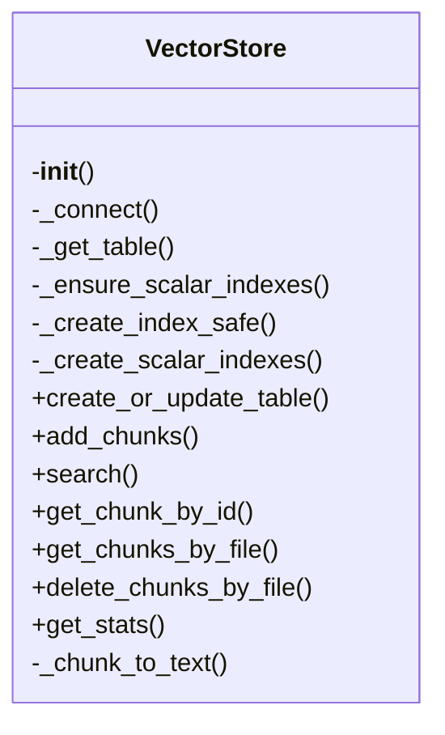

# File Overview

This file defines the `VectorStore` class for managing vector embeddings and search operations using LanceDB. It provides functionality to store, index, and retrieve document chunks based on their vector representations, with support for various chunk types and languages.

# Classes

## VectorStore

The VectorStore class manages vector embeddings and search operations using LanceDB. It handles storing document chunks, performing similarity searches, and managing the underlying database table.

### Key Methods

- `__init__(self, db_path: str, embedding_provider: EmbeddingProvider, table_name: str = "chunks")` - Initializes the vector store with a database path, embedding provider, and table name
- `create_table(self)` - Creates the database table if it doesn't exist
- `add_chunks(self, chunks: list[ChunkType])` - Adds chunks to the vector store
- `search(self, query: str, limit: int = 10)` - Searches for similar chunks based on a query string
- `get_chunk(self, chunk_id: str) -> ChunkType` - Retrieves a specific chunk by its ID
- `delete_chunk(self, chunk_id: str)` - Deletes a chunk from the store
- `list_chunks(self, limit: int = 100) -> list[ChunkType]` - Lists chunks in the store

### Usage Example

```python
from local_deepwiki.core.vectorstore import VectorStore
from local_deepwiki.providers.openai import OpenAIEmbeddingProvider

# Initialize the vector store
embedding_provider = OpenAIEmbeddingProvider(api_key="your-api-key")
vector_store = VectorStore(
    db_path="./vector_db",
    embedding_provider=embedding_provider,
    table_name="my_chunks"
)

# Create the table
vector_store.create_table()

# Add chunks
chunks = [
    CodeChunk(
        id="chunk_1",
        content="def hello(): pass",
        language=Language.PYTHON,
        file_path="example.py",
        start_line=1,
        end_line=2
    )
]
vector_store.add_chunks(chunks)
```

# Functions

## _sanitize_string_value

```python
def _sanitize_string_value(value: str) -> str
```

Sanitizes a string value by removing or replacing characters that might cause issues in database operations.

### Parameters

- `value: str` - The input string to sanitize

### Returns

- `str` - The sanitized string

# Related Components

This file works with the following components:

- `EmbeddingProvider` from `local_deepwiki.providers.base` - Provides the embedding functionality used for vectorizing chunks
- `ChunkType` from `local_deepwiki.models` - Defines the chunk data structure
- `CodeChunk` from `local_deepwiki.models` - Represents code chunks with additional metadata
- `Language` from `local_deepwiki.models` - Enum defining supported programming languages
- `SearchResult` from `local_deepwiki.models` - Represents search results
- `get_logger` from `local_deepwiki.logging` - Provides logging functionality
- `lancedb` - Database library used for vector storage and search operations
- `Table` from `lancedb.table` - LanceDB table interface for database operations

The class integrates with the `lancedb` library for vector storage and search capabilities, and relies on embedding providers to generate vector representations of document chunks.

## API Reference

### class `VectorStore`

Vector store using LanceDB for code chunk storage and semantic search.

**Methods:**

#### `__init__`

```python
def __init__(db_path: Path, embedding_provider: EmbeddingProvider)
```

Initialize the vector store.


| [Parameter](../generators/api_docs.md) | Type | Default | Description |
|-----------|------|---------|-------------|
| `db_path` | `Path` | - | Path to the LanceDB database directory. |
| `embedding_provider` | `EmbeddingProvider` | - | Provider for generating embeddings. |

#### `create_or_update_table`

```python
async def create_or_update_table(chunks: list[CodeChunk]) -> int
```

Create or update the vector table with code chunks.


| [Parameter](../generators/api_docs.md) | Type | Default | Description |
|-----------|------|---------|-------------|
| `chunks` | `list[CodeChunk]` | - | List of code chunks to store. |

#### `add_chunks`

```python
async def add_chunks(chunks: list[CodeChunk]) -> int
```

Add chunks to existing table.


| [Parameter](../generators/api_docs.md) | Type | Default | Description |
|-----------|------|---------|-------------|
| `chunks` | `list[CodeChunk]` | - | List of code chunks to add. |

#### `search`

```python
async def search(query: str, limit: int = 10, language: str | None = None, chunk_type: str | None = None) -> list[SearchResult]
```

Search for similar code chunks.


| [Parameter](../generators/api_docs.md) | Type | Default | Description |
|-----------|------|---------|-------------|
| `query` | `str` | - | Search query text. |
| `limit` | `int` | `10` | Maximum number of results. |
| `language` | `str | None` | `None` | Optional language filter. |
| `chunk_type` | `str | None` | `None` | Optional chunk type filter. |

#### `get_chunk_by_id`

```python
async def get_chunk_by_id(chunk_id: str) -> CodeChunk | None
```

Get a specific chunk by ID.


| [Parameter](../generators/api_docs.md) | Type | Default | Description |
|-----------|------|---------|-------------|
| `chunk_id` | `str` | - | The chunk ID. |

#### `get_chunks_by_file`

```python
async def get_chunks_by_file(file_path: str) -> list[CodeChunk]
```

Get all chunks for a specific file.


| [Parameter](../generators/api_docs.md) | Type | Default | Description |
|-----------|------|---------|-------------|
| `file_path` | `str` | - | The file path. |

#### `delete_chunks_by_file`

```python
async def delete_chunks_by_file(file_path: str) -> int
```

Delete all chunks for a specific file.


| [Parameter](../generators/api_docs.md) | Type | Default | Description |
|-----------|------|---------|-------------|
| `file_path` | `str` | - | The file path. |

#### `get_stats`

```python
def get_stats() -> dict[str, Any]
```

Get statistics about the vector store.


## Class Diagram



## Call Graph

```mermaid
flowchart TD
    N0[CodeChunk]
    N1[VectorStore._connect]
    N2[VectorStore._create_index_safe]
    N3[VectorStore._ensure_scalar_...]
    N4[VectorStore._get_table]
    N5[VectorStore.add_chunks]
    N6[VectorStore.create_or_updat...]
    N7[VectorStore.delete_chunks_b...]
    N8[VectorStore.get_chunk_by_id]
    N9[VectorStore.get_chunks_by_file]
    N10[VectorStore.get_stats]
    N11[VectorStore.search]
    N12[_chunk_to_text]
    N13[_connect]
    N14[_create_index_safe]
    N15[_ensure_scalar_indexes]
    N16[_get_table]
    N17[_sanitize_string_value]
    N18[connect]
    N19[embed]
    N20[limit]
    N21[list_indices]
    N22[list_tables]
    N23[loads]
    N24[mkdir]
    N25[open_table]
    N26[search]
    N27[to_list]
    N28[to_vector_record]
    N29[where]
    N1 --> N24
    N1 --> N18
    N4 --> N13
    N4 --> N22
    N4 --> N25
    N4 --> N15
    N3 --> N21
    N3 --> N14
    N6 --> N13
    N6 --> N12
    N6 --> N19
    N6 --> N28
    N6 --> N22
    N5 --> N16
    N5 --> N12
    N5 --> N19
    N5 --> N28
    N11 --> N16
    N11 --> N19
    N11 --> N20
    N11 --> N26
    N11 --> N29
    N11 --> N27
    N11 --> N0
    N11 --> N23
    N8 --> N16
    N8 --> N17
    N8 --> N27
    N8 --> N20
    N8 --> N29
    N8 --> N26
    N8 --> N0
    N8 --> N23
    N9 --> N16
    N9 --> N17
    N9 --> N27
    N9 --> N29
    N9 --> N26
    N9 --> N0
    N9 --> N23
    N7 --> N16
    N7 --> N17
    N7 --> N27
    N7 --> N29
    N7 --> N26
    N10 --> N16
    classDef func fill:#e1f5fe
    class N0,N12,N13,N14,N15,N16,N17,N18,N19,N20,N21,N22,N23,N24,N25,N26,N27,N28,N29 func
    classDef method fill:#fff3e0
    class N1,N2,N3,N4,N5,N6,N7,N8,N9,N10,N11 method
```



## Relevant Source Files

- `src/local_deepwiki/core/vectorstore.py:37-395`

## See Also

- [server](../server.md) - uses this
- [test_vectorstore](../../../tests/test_vectorstore.md) - uses this
