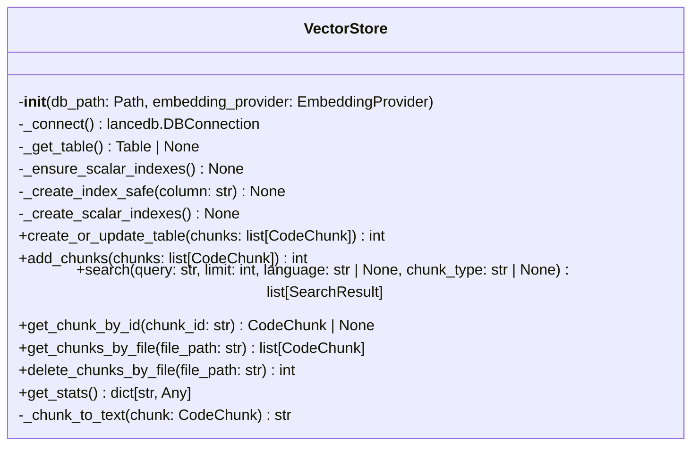

# vectorstore.py

## File Overview

The vectorstore module provides vector database functionality for storing and retrieving code chunks with semantic search capabilities. It uses LanceDB as the underlying vector database and integrates with embedding providers to enable similarity-based code search.

## Functions

### _sanitize_string_value

```python
def _sanitize_string_value(value: Any) -> str
```

A utility function that sanitizes string values for database storage by converting various data types to clean string representations.

**Parameters:**
- `value: Any` - The value to sanitize

**Returns:**
- `str` - The sanitized string value

## Classes

### VectorStore

The VectorStore class manages vector database operations for code chunks, providing functionality to store, search, and retrieve semantically similar code segments.

**Dependencies:**
- Uses `lancedb` for vector database operations
- Integrates with EmbeddingProvider for generating embeddings
- Works with [CodeChunk](../models.md) and [SearchResult](../models.md) models
- Supports [ChunkType](../models.md) and [Language](../models.md) enums

**Key Features:**
- Vector-based semantic search for code chunks
- Integration with embedding providers
- Support for different programming languages and chunk types
- Persistent storage using LanceDB

## Related Components

This module integrates with several other components:

- **EmbeddingProvider**: Base class for generating embeddings from text
- **[CodeChunk](../models.md)**: Model representing a code chunk with metadata
- **[SearchResult](../models.md)**: Model for search results from vector queries
- **[ChunkType](../models.md)**: Enumeration of different types of code chunks
- **[Language](../models.md)**: Enumeration of supported programming languages

The module uses the logging system from `local_deepwiki.logging` for operational logging.

## Usage Context

The VectorStore serves as the core component for semantic code search functionality, enabling the system to [find](../generators/manifest.md) relevant code chunks based on similarity rather than exact text matching. It bridges the gap between raw code content and intelligent search capabilities through vector embeddings.

## API Reference

### class `VectorStore`

Vector store using LanceDB for code chunk storage and semantic search.

**Methods:**

#### `__init__`

```python
def __init__(db_path: Path, embedding_provider: EmbeddingProvider)
```

Initialize the vector store.


| [Parameter](../generators/api_docs.md) | Type | Default | Description |
|-----------|------|---------|-------------|
| `db_path` | `Path` | - | Path to the LanceDB database directory. |
| `embedding_provider` | `EmbeddingProvider` | - | Provider for generating embeddings. |

#### `create_or_update_table`

```python
async def create_or_update_table(chunks: list[CodeChunk]) -> int
```

Create or update the vector table with code chunks.


| [Parameter](../generators/api_docs.md) | Type | Default | Description |
|-----------|------|---------|-------------|
| `chunks` | `list[CodeChunk]` | - | List of code chunks to store. |

#### `add_chunks`

```python
async def add_chunks(chunks: list[CodeChunk]) -> int
```

Add chunks to existing table.


| [Parameter](../generators/api_docs.md) | Type | Default | Description |
|-----------|------|---------|-------------|
| `chunks` | `list[CodeChunk]` | - | List of code chunks to add. |

#### `search`

```python
async def search(query: str, limit: int = 10, language: str | None = None, chunk_type: str | None = None) -> list[SearchResult]
```

Search for similar code chunks.


| [Parameter](../generators/api_docs.md) | Type | Default | Description |
|-----------|------|---------|-------------|
| `query` | `str` | - | Search query text. |
| `limit` | `int` | `10` | Maximum number of results. |
| `language` | `str | None` | `None` | Optional language filter. |
| `chunk_type` | `str | None` | `None` | Optional chunk type filter. |

#### `get_chunk_by_id`

```python
async def get_chunk_by_id(chunk_id: str) -> CodeChunk | None
```

Get a specific chunk by ID.


| [Parameter](../generators/api_docs.md) | Type | Default | Description |
|-----------|------|---------|-------------|
| `chunk_id` | `str` | - | The chunk ID. |

#### `get_chunks_by_file`

```python
async def get_chunks_by_file(file_path: str) -> list[CodeChunk]
```

Get all chunks for a specific file.


| [Parameter](../generators/api_docs.md) | Type | Default | Description |
|-----------|------|---------|-------------|
| `file_path` | `str` | - | The file path. |

#### `delete_chunks_by_file`

```python
async def delete_chunks_by_file(file_path: str) -> int
```

Delete all chunks for a specific file.


| [Parameter](../generators/api_docs.md) | Type | Default | Description |
|-----------|------|---------|-------------|
| `file_path` | `str` | - | The file path. |

#### `get_stats`

```python
def get_stats() -> dict[str, Any]
```

Get statistics about the vector store.


## Class Diagram



## Call Graph

```mermaid
flowchart TD
    N0[CodeChunk]
    N1[VectorStore._connect]
    N2[VectorStore._create_index_safe]
    N3[VectorStore._ensure_scalar_...]
    N4[VectorStore._get_table]
    N5[VectorStore.add_chunks]
    N6[VectorStore.create_or_updat...]
    N7[VectorStore.delete_chunks_b...]
    N8[VectorStore.get_chunk_by_id]
    N9[VectorStore.get_chunks_by_file]
    N10[VectorStore.get_stats]
    N11[VectorStore.search]
    N12[_chunk_to_text]
    N13[_connect]
    N14[_create_index_safe]
    N15[_ensure_scalar_indexes]
    N16[_get_table]
    N17[_sanitize_string_value]
    N18[connect]
    N19[embed]
    N20[limit]
    N21[list_indices]
    N22[list_tables]
    N23[loads]
    N24[mkdir]
    N25[open_table]
    N26[search]
    N27[to_list]
    N28[to_vector_record]
    N29[where]
    N1 --> N24
    N1 --> N18
    N4 --> N13
    N4 --> N22
    N4 --> N25
    N4 --> N15
    N3 --> N21
    N3 --> N14
    N6 --> N13
    N6 --> N12
    N6 --> N19
    N6 --> N28
    N6 --> N22
    N5 --> N16
    N5 --> N12
    N5 --> N19
    N5 --> N28
    N11 --> N16
    N11 --> N19
    N11 --> N20
    N11 --> N26
    N11 --> N29
    N11 --> N27
    N11 --> N0
    N11 --> N23
    N8 --> N16
    N8 --> N17
    N8 --> N27
    N8 --> N20
    N8 --> N29
    N8 --> N26
    N8 --> N0
    N8 --> N23
    N9 --> N16
    N9 --> N17
    N9 --> N27
    N9 --> N29
    N9 --> N26
    N9 --> N0
    N9 --> N23
    N7 --> N16
    N7 --> N17
    N7 --> N27
    N7 --> N29
    N7 --> N26
    N10 --> N16
    classDef func fill:#e1f5fe
    class N0,N12,N13,N14,N15,N16,N17,N18,N19,N20,N21,N22,N23,N24,N25,N26,N27,N28,N29 func
    classDef method fill:#fff3e0
    class N1,N2,N3,N4,N5,N6,N7,N8,N9,N10,N11 method
```



## Relevant Source Files

- `src/local_deepwiki/core/vectorstore.py:37-395`

## See Also

- [test_vectorstore](../../../tests/test_vectorstore.md) - uses this
- [server](../server.md) - uses this
- [models](../models.md) - dependency
