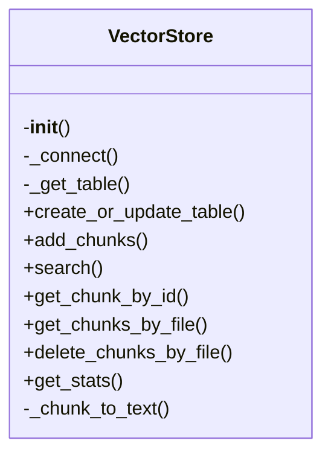

# Vector Store Module

## File Overview

This module provides the core vector store functionality for the local deepwiki system. It handles the creation, management, and querying of vector databases using LanceDB, enabling semantic search capabilities for code chunks and documentation.

## Classes

### VectorStore

The `VectorStore` class manages vector embeddings and provides search functionality for code chunks using LanceDB.

**Key Methods:**

- `__init__(self, db_path: str, embedding_provider: EmbeddingProvider)`: Initializes the vector store with a database path and embedding provider
- `create_table(self, table_name: str, embedding_dim: int)`: Creates a new table with the specified name and embedding dimension
- `insert_chunks(self, table_name: str, chunks: list[CodeChunk])`: Inserts code chunks into the specified table
- `search(self, table_name: str, query: str, limit: int = 10)`: Searches for similar code chunks using semantic similarity
- `get_table(self, table_name: str)`: Retrieves a table by name
- `list_tables(self)`: Lists all available tables

**Usage Example:**
```python
from local_deepwiki.core.vectorstore import VectorStore
from local_deepwiki.providers.openai import OpenAIEmbeddingProvider

# Initialize vector store
embedding_provider = OpenAIEmbeddingProvider(api_key="your-api-key")
vector_store = VectorStore(db_path="./vector_db", embedding_provider=embedding_provider)

# Create table and insert chunks
vector_store.create_table("code_chunks", embedding_dim=1536)
chunks = [CodeChunk(id="1", content="def hello(): pass", path="test.py")]
vector_store.insert_chunks("code_chunks", chunks)

# Search for similar chunks
results = vector_store.search("code_chunks", "python function definition")
```

## Functions

### `__init__`

Initializes the VectorStore with a database path and embedding provider.

**Parameters:**
- `db_path` (str): Path to the LanceDB database
- `embedding_provider` (EmbeddingProvider): Provider for generating embeddings

### `create_table`

Creates a new table in the database with the specified name and embedding dimension.

**Parameters:**
- `table_name` (str): Name of the table to create
- `embedding_dim` (int): Dimension of the embeddings

**Returns:**
- `Table`: The created table object

### `insert_chunks`

Inserts code chunks into the specified table.

**Parameters:**
- `table_name` (str): Name of the table to insert into
- `chunks` (list[CodeChunk]): List of code chunks to insert

### `search`

Performs a semantic search for similar code chunks.

**Parameters:**
- `table_name` (str): Name of the table to search in
- `query` (str): Search query string
- `limit` (int): Maximum number of results to return (default: 10)

**Returns:**
- `list[SearchResult]`: List of search results with similarity scores

### `get_table`

Retrieves a table by name.

**Parameters:**
- `table_name` (str): Name of the table to retrieve

**Returns:**
- `Table`: The requested table object

### `list_tables`

Lists all available tables in the database.

**Returns:**
- `list[str]`: List of table names

## Usage Examples

### Basic Setup and Usage

```python
from local_deepwiki.core.vectorstore import VectorStore
from local_deepwiki.providers.openai import OpenAIEmbeddingProvider
from local_deepwiki.models import CodeChunk

# Initialize
embedding_provider = OpenAIEmbeddingProvider(api_key="your-api-key")
vector_store = VectorStore(db_path="./vector_db", embedding_provider=embedding_provider)

# Create table
vector_store.create_table("code_chunks", embedding_dim=1536)

# Insert chunks
chunks = [
    CodeChunk(id="1", content="def greet(name): return f'Hello {name}!'", path="greeting.py"),
    CodeChunk(id="2", content="class Calculator: def add(self, a, b): return a + b", path="calc.py")
]
vector_store.insert_chunks("code_chunks", chunks)

# Search
results = vector_store.search("code_chunks", "python greeting function")
for result in results:
    print(f"Score: {result.score}, Content: {result.chunk.content}")
```

### Multiple Tables Management

```python
# Create multiple tables for different purposes
vector_store.create_table("documentation", embedding_dim=1536)
vector_store.create_table("code_examples", embedding_dim=1536)

# Insert into different tables
vector_store.insert_chunks("documentation", [CodeChunk(id="1", content="API documentation", path="docs.md")])
vector_store.insert_chunks("code_examples", [CodeChunk(id="1", content="def example(): pass", path="example.py")])

# Search in specific table
docs_results = vector_store.search("documentation", "api reference")
code_results = vector_store.search("code_examples", "function example")
```

## Dependencies

This module depends on:

- `json` - Standard library for JSON handling
- `pathlib.Path` - Standard library for path operations
- `typing.Any` - Standard library for type hints
- `lancedb` - Database library for vector storage
- `lancedb.table.Table` - LanceDB table interface
- `local_deepwiki.models.CodeChunk` - Model for code chunks
- `local_deepwiki.models.SearchResult` - Model for search results
- `local_deepwiki.providers.base.EmbeddingProvider` - Base embedding provider interface

The module requires a compatible embedding provider implementation (such as OpenAIEmbeddingProvider) to generate vector embeddings for the code chunks.

## Class Diagram



## See Also

- [indexer](indexer.md) - uses this
- [wiki](../generators/wiki.md) - uses this
- [server](../server.md) - uses this
- [models](../models.md) - dependency
- [base](../providers/base.md) - dependency
