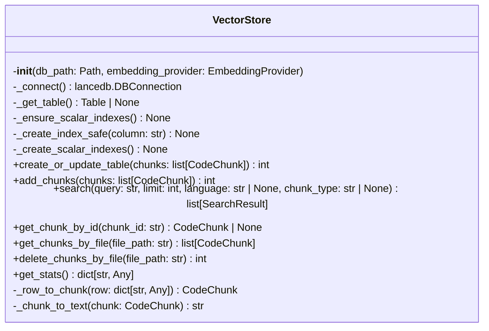

# vectorstore.py

## File Overview

The vectorstore module provides vector storage and search capabilities using LanceDB as the underlying database. It handles embedding storage, similarity search, and metadata management for code chunks in the local deepwiki system.

## Classes

### VectorStore

The VectorStore class manages vector embeddings and provides similarity search functionality using LanceDB. It handles the storage of code chunks with their embeddings and metadata, enabling semantic search across the codebase.

## Functions

### _sanitize_string_value

A utility function for sanitizing string values, likely used for data preprocessing before storage in the vector database.

## Related Components

This module integrates with several other components of the local deepwiki system:

- **[ChunkType](../models.md), [CodeChunk](../models.md), [Language](../models.md), [SearchResult](../models.md)**: Data models from the models module that define the structure of stored and retrieved data
- **[EmbeddingProvider](../providers/base.md)**: Base class from the providers module that handles embedding generation
- **Logger**: Logging functionality from the logging module for tracking operations

The module uses LanceDB as the vector database backend, with the Table class providing direct database table operations.

## Usage Context

The VectorStore class serves as the core component for:
- Storing code chunks with their vector embeddings
- Performing similarity searches to [find](../generators/manifest.md) related code
- Managing metadata associated with code chunks
- Providing search results in a structured format

This component is essential for the semantic search capabilities of the local deepwiki system, enabling users to [find](../generators/manifest.md) relevant code based on meaning rather than just text matching.

## API Reference

### class `VectorStore`

Vector store using LanceDB for code chunk storage and semantic search.

**Methods:**

#### `__init__`

```python
def __init__(db_path: Path, embedding_provider: EmbeddingProvider)
```

Initialize the vector store.


| [Parameter](../generators/api_docs.md) | Type | Default | Description |
|-----------|------|---------|-------------|
| `db_path` | `Path` | - | Path to the LanceDB database directory. |
| `embedding_provider` | [`EmbeddingProvider`](../providers/base.md) | - | Provider for generating embeddings. |

#### `create_or_update_table`

```python
async def create_or_update_table(chunks: list[CodeChunk]) -> int
```

Create or update the vector table with code chunks.


| [Parameter](../generators/api_docs.md) | Type | Default | Description |
|-----------|------|---------|-------------|
| `chunks` | `list[CodeChunk]` | - | List of code chunks to store. |

#### `add_chunks`

```python
async def add_chunks(chunks: list[CodeChunk]) -> int
```

Add chunks to existing table.


| [Parameter](../generators/api_docs.md) | Type | Default | Description |
|-----------|------|---------|-------------|
| `chunks` | `list[CodeChunk]` | - | List of code chunks to add. |

#### `search`

```python
async def search(query: str, limit: int = 10, language: str | None = None, chunk_type: str | None = None) -> list[SearchResult]
```

Search for similar code chunks.


| [Parameter](../generators/api_docs.md) | Type | Default | Description |
|-----------|------|---------|-------------|
| `query` | `str` | - | Search query text. |
| `limit` | `int` | `10` | Maximum number of results. |
| `language` | `str | None` | `None` | Optional language filter. |
| `chunk_type` | `str | None` | `None` | Optional chunk type filter. |

#### `get_chunk_by_id`

```python
async def get_chunk_by_id(chunk_id: str) -> CodeChunk | None
```

Get a specific chunk by ID.


| [Parameter](../generators/api_docs.md) | Type | Default | Description |
|-----------|------|---------|-------------|
| `chunk_id` | `str` | - | The chunk ID. |

#### `get_chunks_by_file`

```python
async def get_chunks_by_file(file_path: str) -> list[CodeChunk]
```

Get all chunks for a specific file.


| [Parameter](../generators/api_docs.md) | Type | Default | Description |
|-----------|------|---------|-------------|
| `file_path` | `str` | - | The file path. |

#### `delete_chunks_by_file`

```python
async def delete_chunks_by_file(file_path: str) -> int
```

Delete all chunks for a specific file.


| [Parameter](../generators/api_docs.md) | Type | Default | Description |
|-----------|------|---------|-------------|
| `file_path` | `str` | - | The file path. |

#### `get_stats`

```python
def get_stats() -> dict[str, Any]
```

Get statistics about the vector store.


## Class Diagram



## Call Graph

```mermaid
flowchart TD
    N0[VectorStore._connect]
    N1[VectorStore._create_index_safe]
    N2[VectorStore._ensure_scalar_...]
    N3[VectorStore._get_table]
    N4[VectorStore._row_to_chunk]
    N5[VectorStore.add_chunks]
    N6[VectorStore.create_or_updat...]
    N7[VectorStore.delete_chunks_b...]
    N8[VectorStore.get_chunk_by_id]
    N9[VectorStore.get_chunks_by_file]
    N10[VectorStore.get_stats]
    N11[VectorStore.search]
    N12[_chunk_to_text]
    N13[_connect]
    N14[_create_index_safe]
    N15[_ensure_scalar_indexes]
    N16[_get_table]
    N17[_row_to_chunk]
    N18[_sanitize_string_value]
    N19[connect]
    N20[embed]
    N21[limit]
    N22[list_indices]
    N23[list_tables]
    N24[mkdir]
    N25[open_table]
    N26[search]
    N27[to_list]
    N28[to_vector_record]
    N29[where]
    N0 --> N24
    N0 --> N19
    N3 --> N13
    N3 --> N23
    N3 --> N25
    N3 --> N15
    N2 --> N22
    N2 --> N14
    N6 --> N13
    N6 --> N12
    N6 --> N20
    N6 --> N28
    N6 --> N23
    N5 --> N16
    N5 --> N12
    N5 --> N20
    N5 --> N28
    N11 --> N16
    N11 --> N20
    N11 --> N21
    N11 --> N26
    N11 --> N29
    N11 --> N27
    N11 --> N17
    N8 --> N16
    N8 --> N18
    N8 --> N27
    N8 --> N21
    N8 --> N29
    N8 --> N26
    N8 --> N17
    N9 --> N16
    N9 --> N18
    N9 --> N27
    N9 --> N29
    N9 --> N26
    N9 --> N17
    N7 --> N16
    N7 --> N18
    N7 --> N27
    N7 --> N29
    N7 --> N26
    N10 --> N16
    classDef func fill:#e1f5fe
    class N12,N13,N14,N15,N16,N17,N18,N19,N20,N21,N22,N23,N24,N25,N26,N27,N28,N29 func
    classDef method fill:#fff3e0
    class N0,N1,N2,N3,N4,N5,N6,N7,N8,N9,N10,N11 method
```



## Usage Examples

*Examples extracted from test files*

### Test that creating a table creates scalar indexes

From `test_vectorstore.py::test_create_table_creates_indexes`:

```python
table = populated_store._get_table()
assert table is not None
```

### Test that get_chunk_by_id can find chunks efficiently

From `test_vectorstore.py::test_get_chunk_by_id_uses_index`:

```python
chunk = await populated_store.get_chunk_by_id("chunk_1")
assert chunk is not None
```

### Test that get_chunks_by_file can find chunks efficiently

From `test_vectorstore.py::test_get_chunks_by_file_uses_index`:

```python
chunks = await populated_store.get_chunks_by_file("src/main.py")
assert len(chunks) == 2
```

### Test that delete_chunks_by_file works efficiently

From `test_vectorstore.py::test_delete_chunks_by_file_uses_index`:

```python
chunks = await populated_store.get_chunks_by_file("src/main.py")
assert len(chunks) == 0
```

### Test that delete_chunks_by_file works efficiently

From `test_vectorstore.py::test_delete_chunks_by_file_uses_index`:

```python
deleted = await populated_store.delete_chunks_by_file("src/main.py")
assert deleted == 2
```

## Relevant Source Files

- `src/local_deepwiki/core/vectorstore.py:37-376`

## See Also

- [logging](../logging.md) - dependency
- [models](../models.md) - dependency
- [llm_cache](llm_cache.md) - shares 6 dependencies
- [chunker](chunker.md) - shares 4 dependencies
- [diagrams](../generators/diagrams.md) - shares 3 dependencies
