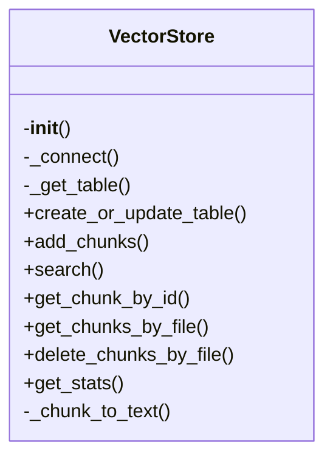

# VectorStore Module Documentation

## File Overview

This module implements the VectorStore class which provides vector database functionality for storing and retrieving embeddings of code chunks. It serves as the core storage layer for the local deepwiki system, enabling semantic search capabilities through LanceDB integration. The VectorStore works closely with the EmbeddingProvider to generate and manage vector representations of code content, and integrates with [CodeChunk](../models.md) and [SearchResult](../models.md) models for data handling.

## Classes

### VectorStore

The VectorStore class provides an interface for managing vector embeddings in a LanceDB database. It handles the creation, storage, and retrieval of code chunk embeddings, enabling semantic search functionality.

#### Key Methods

- `__init__(self, db_path: str, embedding_provider: EmbeddingProvider)`: Initializes the VectorStore with a database path and embedding provider
- `create_table(self, table_name: str, vector_size: int)`: Creates a new table in the database with the specified vector size
- `add_chunks(self, table_name: str, chunks: list[CodeChunk])`: Adds code chunks to the specified table
- `search(self, table_name: str, query: str, limit: int = 10)`: Searches for similar code chunks using semantic similarity
- `get_table(self, table_name: str) -> Table`: Retrieves a table by name
- `table_exists(self, table_name: str) -> bool`: Checks if a table exists in the database

#### Usage Example

```python
from local_deepwiki.core.vectorstore import VectorStore
from local_deepwiki.providers.openai import OpenAIEmbeddingProvider

# Initialize vector store
embedding_provider = OpenAIEmbeddingProvider(api_key="your-api-key")
vector_store = VectorStore(db_path="./vector_db", embedding_provider=embedding_provider)

# Create a table
vector_store.create_table("code_chunks", vector_size=1536)

# Add code chunks
chunks = [
    CodeChunk(id="1", content="def hello_world():\n    print('Hello, World!')", file_path="example.py"),
    CodeChunk(id="2", content="class Calculator:\n    def add(self, a, b):\n        return a + b", file_path="calc.py")
]
vector_store.add_chunks("code_chunks", chunks)

# Search for similar code
results = vector_store.search("code_chunks", "function that prints hello world", limit=5)
```

## Functions

### create_table

Creates a new table in the LanceDB database with the specified name and vector size.

**Parameters:**
- table_name (str): Name of the table to create
- vector_size (int): Size of the vector embeddings

**Returns:**
- Table: The created table object

### add_chunks

Adds multiple code chunks to the specified table in the database.

**Parameters:**
- table_name (str): Name of the table to add chunks to
- chunks (list[[CodeChunk](../models.md)]): List of [CodeChunk](../models.md) objects to add

**Returns:**
- None

### search

Performs a semantic search in the specified table for code chunks similar to the query.

**Parameters:**
- table_name (str): Name of the table to search in
- query (str): Search query string
- limit (int): Maximum number of results to return (default: 10)

**Returns:**
- list[[SearchResult](../models.md)]: List of search results with similarity scores

### get_table

Retrieves a table from the database by name.

**Parameters:**
- table_name (str): Name of the table to retrieve

**Returns:**
- Table: The requested table object

### table_exists

Checks whether a table with the specified name exists in the database.

**Parameters:**
- table_name (str): Name of the table to check

**Returns:**
- bool: True if table exists, False otherwise

## Usage Examples

### Basic VectorStore Setup

```python
from local_deepwiki.core.vectorstore import VectorStore
from local_deepwiki.providers.openai import OpenAIEmbeddingProvider

# Create embedding provider
embedding_provider = OpenAIEmbeddingProvider(api_key="your-api-key")

# Initialize vector store
vector_store = VectorStore(db_path="./vector_db", embedding_provider=embedding_provider)
```

### Adding and Searching Code Chunks

```python
# Create table
vector_store.create_table("my_code_chunks", vector_size=1536)

# Add code chunks
chunks = [
    CodeChunk(id="1", content="def greet(name):\n    return f'Hello, {name}!'", file_path="greeting.py"),
    CodeChunk(id="2", content="import os\nprint(os.getcwd())", file_path="path.py")
]
vector_store.add_chunks("my_code_chunks", chunks)

# Perform semantic search
results = vector_store.search("my_code_chunks", "function to print current directory", limit=3)
for result in results:
    print(f"Similar code: {result.chunk.content}")
```

## Related Components

This VectorStore class works with the EmbeddingProvider to generate vector representations of code content. It integrates with the [CodeChunk](../models.md) model for representing code segments and [SearchResult](../models.md) for organizing search results. The class also interacts with the [WikiGenerator](../generators/wiki.md) to store and retrieve code embeddings for building documentation. The table management functionality connects with the LanceDB database system for persistent storage of vector embeddings.

## API Reference

### class `VectorStore`

Vector store using LanceDB for code chunk storage and semantic search.

**Methods:**

#### `__init__`

```python
def __init__(db_path: Path, embedding_provider: EmbeddingProvider)
```

Initialize the vector store.


| [Parameter](../generators/api_docs.md) | Type | Default | Description |
|-----------|------|---------|-------------|
| `db_path` | `Path` | - | Path to the LanceDB database directory. |
| `embedding_provider` | `EmbeddingProvider` | - | Provider for generating embeddings. |

#### `create_or_update_table`

```python
async def create_or_update_table(chunks: list[CodeChunk]) -> int
```

Create or update the vector table with code chunks.


| [Parameter](../generators/api_docs.md) | Type | Default | Description |
|-----------|------|---------|-------------|
| `chunks` | `list[CodeChunk]` | - | List of code chunks to store. |

#### `add_chunks`

```python
async def add_chunks(chunks: list[CodeChunk]) -> int
```

Add chunks to existing table.


| [Parameter](../generators/api_docs.md) | Type | Default | Description |
|-----------|------|---------|-------------|
| `chunks` | `list[CodeChunk]` | - | List of code chunks to add. |

#### `search`

```python
async def search(query: str, limit: int = 10, language: str | None = None, chunk_type: str | None = None) -> list[SearchResult]
```

Search for similar code chunks.


| [Parameter](../generators/api_docs.md) | Type | Default | Description |
|-----------|------|---------|-------------|
| `query` | `str` | - | Search query text. |
| `limit` | `int` | `10` | Maximum number of results. |
| `language` | `str | None` | `None` | Optional language filter. |
| `chunk_type` | `str | None` | `None` | Optional chunk type filter. |

#### `get_chunk_by_id`

```python
async def get_chunk_by_id(chunk_id: str) -> CodeChunk | None
```

Get a specific chunk by ID.


| [Parameter](../generators/api_docs.md) | Type | Default | Description |
|-----------|------|---------|-------------|
| `chunk_id` | `str` | - | The chunk ID. |

#### `get_chunks_by_file`

```python
async def get_chunks_by_file(file_path: str) -> list[CodeChunk]
```

Get all chunks for a specific file.


| [Parameter](../generators/api_docs.md) | Type | Default | Description |
|-----------|------|---------|-------------|
| `file_path` | `str` | - | The file path. |

#### `delete_chunks_by_file`

```python
async def delete_chunks_by_file(file_path: str) -> int
```

Delete all chunks for a specific file.


| [Parameter](../generators/api_docs.md) | Type | Default | Description |
|-----------|------|---------|-------------|
| `file_path` | `str` | - | The file path. |

#### `get_stats`

```python
def get_stats() -> dict[str, Any]
```

Get statistics about the vector store.


## Class Diagram



## Call Graph

```mermaid
flowchart TD
    N0[CodeChunk]
    N1[SearchResult]
    N2[VectorStore._connect]
    N3[VectorStore._get_table]
    N4[VectorStore.add_chunks]
    N5[VectorStore.create_or_updat...]
    N6[VectorStore.delete_chunks_b...]
    N7[VectorStore.get_chunk_by_id]
    N8[VectorStore.get_chunks_by_file]
    N9[VectorStore.get_stats]
    N10[VectorStore.search]
    N11[_chunk_to_text]
    N12[_connect]
    N13[_get_table]
    N14[add]
    N15[connect]
    N16[create_or_update_table]
    N17[create_table]
    N18[delete]
    N19[drop_table]
    N20[dumps]
    N21[embed]
    N22[limit]
    N23[loads]
    N24[mkdir]
    N25[open_table]
    N26[search]
    N27[table_names]
    N28[to_list]
    N29[where]
    N2 --> N24
    N2 --> N15
    N3 --> N12
    N3 --> N27
    N3 --> N25
    N5 --> N12
    N5 --> N11
    N5 --> N21
    N5 --> N20
    N5 --> N27
    N5 --> N19
    N5 --> N17
    N4 --> N13
    N4 --> N16
    N4 --> N11
    N4 --> N21
    N4 --> N20
    N4 --> N14
    N10 --> N13
    N10 --> N21
    N10 --> N22
    N10 --> N26
    N10 --> N29
    N10 --> N28
    N10 --> N0
    N10 --> N23
    N10 --> N1
    N7 --> N13
    N7 --> N28
    N7 --> N22
    N7 --> N29
    N7 --> N26
    N7 --> N0
    N7 --> N23
    N8 --> N13
    N8 --> N28
    N8 --> N29
    N8 --> N26
    N8 --> N0
    N8 --> N23
    N6 --> N13
    N6 --> N28
    N6 --> N29
    N6 --> N26
    N6 --> N18
    N9 --> N13
    classDef func fill:#e1f5fe
    class N0,N1,N11,N12,N13,N14,N15,N16,N17,N18,N19,N20,N21,N22,N23,N24,N25,N26,N27,N28,N29 func
    classDef method fill:#fff3e0
    class N2,N3,N4,N5,N6,N7,N8,N9,N10 method
```



## See Also

- [wiki](../generators/wiki.md) - uses this
- [server](../server.md) - uses this
- [models](../models.md) - dependency
