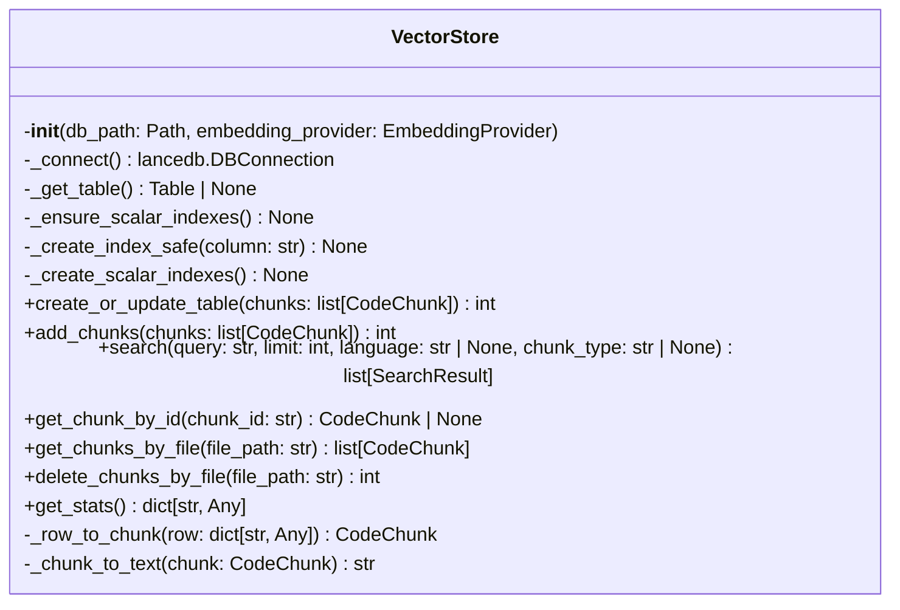

# vectorstore.py

## File Overview

The `vectorstore.py` module provides vector storage functionality for the local_deepwiki system. It handles the storage and retrieval of code chunks using vector embeddings through LanceDB as the underlying database.

## Classes

### VectorStore

The VectorStore class manages vector storage operations for code chunks, enabling semantic search capabilities through embeddings.

**Purpose**: Provides an interface for storing, retrieving, and searching code chunks using vector embeddings in a LanceDB database.

**Key Dependencies**:
- Uses `lancedb` for vector database operations
- Integrates with [EmbeddingProvider](../providers/base.md) for generating embeddings
- Works with [CodeChunk](../models.md) and [SearchResult](../models.md) models for data handling

## Functions

### _sanitize_string_value

A utility function for sanitizing string values, likely used for data preprocessing before storage operations.

## Related Components

This module integrates with several other components of the local_deepwiki system:

- **[EmbeddingProvider](../providers/base.md)**: Base class for embedding generation services
- **[CodeChunk](../models.md)**: Model representing code chunks to be stored
- **[SearchResult](../models.md)**: Model for search operation results
- **[ChunkType](../models.md)**: Enumeration for different types of code chunks
- **[Language](../models.md)**: Enumeration for programming languages

## Usage Context

The VectorStore class serves as the core data layer for the local_deepwiki system, enabling:

- Storage of code chunks with their vector embeddings
- Semantic search capabilities across stored code
- Integration with various embedding providers
- Support for multiple programming languages and chunk types

The module uses LanceDB's Table interface for efficient vector operations and includes logging capabilities for monitoring operations.

## API Reference

### class `VectorStore`

Vector store using LanceDB for code chunk storage and semantic search.

**Methods:**


<details>
<summary>View Source (lines 37-388) | <a href="https://github.com/UrbanDiver/local-deepwiki-mcp/blob/[main](../export/pdf.md)/src/local_deepwiki/core/vectorstore.py#L37-L388">GitHub</a></summary>

```python
class VectorStore:
    # Methods: __init__, _connect, _get_table, _ensure_scalar_indexes, _create_index_safe, _create_scalar_indexes, create_or_update_table, add_chunks, search, get_chunk_by_id, get_chunks_by_file, delete_chunks_by_file, get_stats, _row_to_chunk, _chunk_to_text
```

</details>

#### `__init__`

```python
def __init__(db_path: Path, embedding_provider: EmbeddingProvider)
```

Initialize the vector store.


| [Parameter](../generators/api_docs.md) | Type | Default | Description |
|-----------|------|---------|-------------|
| `db_path` | `Path` | - | Path to the LanceDB database directory. |
| `embedding_provider` | [`EmbeddingProvider`](../providers/base.md) | - | Provider for generating embeddings. |


<details>
<summary>View Source (lines 42-52) | <a href="https://github.com/UrbanDiver/local-deepwiki-mcp/blob/[main](../export/pdf.md)/src/local_deepwiki/core/vectorstore.py#L42-L52">GitHub</a></summary>

```python
def __init__(self, db_path: Path, embedding_provider: EmbeddingProvider):
        """Initialize the vector store.

        Args:
            db_path: Path to the LanceDB database directory.
            embedding_provider: Provider for generating embeddings.
        """
        self.db_path = db_path
        self.embedding_provider = embedding_provider
        self._db: lancedb.DBConnection | None = None
        self._table: Table | None = None
```

</details>

#### `create_or_update_table`

```python
async def create_or_update_table(chunks: list[CodeChunk]) -> int
```

Create or update the vector table with code chunks.


| [Parameter](../generators/api_docs.md) | Type | Default | Description |
|-----------|------|---------|-------------|
| `chunks` | `list[CodeChunk]` | - | List of code chunks to store. |


<details>
<summary>View Source (lines 130-164) | <a href="https://github.com/UrbanDiver/local-deepwiki-mcp/blob/[main](../export/pdf.md)/src/local_deepwiki/core/vectorstore.py#L130-L164">GitHub</a></summary>

```python
async def create_or_update_table(self, chunks: list[CodeChunk]) -> int:
        """Create or update the vector table with code chunks.

        Args:
            chunks: List of code chunks to store.

        Returns:
            Number of chunks stored.
        """
        if not chunks:
            logger.debug("No chunks to store, skipping table creation")
            return 0

        logger.info(f"Creating/updating vector table with {len(chunks)} chunks")
        db = self._connect()

        # Generate embeddings for all chunks
        texts = [self._chunk_to_text(chunk) for chunk in chunks]
        embeddings = await self.embedding_provider.embed(texts)

        # Prepare data for LanceDB
        data = [
            chunk.to_vector_record(vector=embedding) for chunk, embedding in zip(chunks, embeddings)
        ]

        # Drop existing table and create new one
        if self.TABLE_NAME in db.list_tables().tables:
            db.drop_table(self.TABLE_NAME)

        self._table = db.create_table(self.TABLE_NAME, data)

        # Create scalar indexes for efficient lookups
        self._create_scalar_indexes()

        return len(data)
```

</details>

#### `add_chunks`

```python
async def add_chunks(chunks: list[CodeChunk]) -> int
```

Add chunks to existing table.


| [Parameter](../generators/api_docs.md) | Type | Default | Description |
|-----------|------|---------|-------------|
| `chunks` | `list[CodeChunk]` | - | List of code chunks to add. |


<details>
<summary>View Source (lines 166-193) | <a href="https://github.com/UrbanDiver/local-deepwiki-mcp/blob/[main](../export/pdf.md)/src/local_deepwiki/core/vectorstore.py#L166-L193">GitHub</a></summary>

```python
async def add_chunks(self, chunks: list[CodeChunk]) -> int:
        """Add chunks to existing table.

        Args:
            chunks: List of code chunks to add.

        Returns:
            Number of chunks added.
        """
        if not chunks:
            return 0

        logger.debug(f"Adding {len(chunks)} chunks to existing table")
        table = self._get_table()
        if table is None:
            return await self.create_or_update_table(chunks)

        # Generate embeddings
        texts = [self._chunk_to_text(chunk) for chunk in chunks]
        embeddings = await self.embedding_provider.embed(texts)

        # Prepare data
        data = [
            chunk.to_vector_record(vector=embedding) for chunk, embedding in zip(chunks, embeddings)
        ]

        table.add(data)
        return len(data)
```

</details>

#### `search`

```python
async def search(query: str, limit: int = 10, language: str | None = None, chunk_type: str | None = None) -> list[SearchResult]
```

Search for similar code chunks.


| [Parameter](../generators/api_docs.md) | Type | Default | Description |
|-----------|------|---------|-------------|
| `query` | `str` | - | Search query text. |
| `limit` | `int` | `10` | Maximum number of results. |
| `language` | `str | None` | `None` | Optional language filter. |
| `chunk_type` | `str | None` | `None` | Optional chunk type filter. |


<details>
<summary>View Source (lines 195-255) | <a href="https://github.com/UrbanDiver/local-deepwiki-mcp/blob/[main](../export/pdf.md)/src/local_deepwiki/core/vectorstore.py#L195-L255">GitHub</a></summary>

```python
async def search(
        self,
        query: str,
        limit: int = 10,
        language: str | None = None,
        chunk_type: str | None = None,
    ) -> list[SearchResult]:
        """Search for similar code chunks.

        Args:
            query: Search query text.
            limit: Maximum number of results.
            language: Optional language filter.
            chunk_type: Optional chunk type filter.

        Returns:
            List of search results with scores.
        """
        table = self._get_table()
        if table is None:
            logger.debug("No table found for search")
            return []

        logger.debug(f"Searching for: '{query[:50]}...' limit={limit}")

        # Generate query embedding
        query_embedding = (await self.embedding_provider.embed([query]))[0]

        # Build search query
        search = table.search(query_embedding).limit(limit)

        # Apply filters with validation to prevent injection
        filters = []
        if language:
            if language not in VALID_LANGUAGES:
                raise ValueError(f"Invalid language filter: {language}")
            filters.append(f"language = '{language}'")
        if chunk_type:
            if chunk_type not in VALID_CHUNK_TYPES:
                raise ValueError(f"Invalid chunk_type filter: {chunk_type}")
            filters.append(f"chunk_type = '{chunk_type}'")

        if filters:
            search = search.where(" AND ".join(filters))

        # Execute search
        results = search.to_list()

        # Convert to SearchResult objects
        search_results = []
        for row in results:
            chunk = self._row_to_chunk(row)
            search_results.append(
                SearchResult(
                    chunk=chunk,
                    score=1.0 - row.get("_distance", 0),  # Convert distance to similarity
                    highlights=[],
                )
            )

        return search_results
```

</details>

#### `get_chunk_by_id`

```python
async def get_chunk_by_id(chunk_id: str) -> CodeChunk | None
```

Get a specific chunk by ID.


| [Parameter](../generators/api_docs.md) | Type | Default | Description |
|-----------|------|---------|-------------|
| `chunk_id` | `str` | - | The chunk ID. |


<details>
<summary>View Source (lines 257-275) | <a href="https://github.com/UrbanDiver/local-deepwiki-mcp/blob/[main](../export/pdf.md)/src/local_deepwiki/core/vectorstore.py#L257-L275">GitHub</a></summary>

```python
async def get_chunk_by_id(self, chunk_id: str) -> CodeChunk | None:
        """Get a specific chunk by ID.

        Args:
            chunk_id: The chunk ID.

        Returns:
            The CodeChunk or None if not found.
        """
        table = self._get_table()
        if table is None:
            return None

        safe_id = _sanitize_string_value(chunk_id)
        results = table.search().where(f"id = '{safe_id}'").limit(1).to_list()
        if not results:
            return None

        return self._row_to_chunk(results[0])
```

</details>

#### `get_chunks_by_file`

```python
async def get_chunks_by_file(file_path: str) -> list[CodeChunk]
```

Get all chunks for a specific file.


| [Parameter](../generators/api_docs.md) | Type | Default | Description |
|-----------|------|---------|-------------|
| `file_path` | `str` | - | The file path. |


<details>
<summary>View Source (lines 277-292) | <a href="https://github.com/UrbanDiver/local-deepwiki-mcp/blob/[main](../export/pdf.md)/src/local_deepwiki/core/vectorstore.py#L277-L292">GitHub</a></summary>

```python
async def get_chunks_by_file(self, file_path: str) -> list[CodeChunk]:
        """Get all chunks for a specific file.

        Args:
            file_path: The file path.

        Returns:
            List of CodeChunks for the file.
        """
        table = self._get_table()
        if table is None:
            return []

        safe_path = _sanitize_string_value(file_path)
        results = table.search().where(f"file_path = '{safe_path}'").to_list()
        return [self._row_to_chunk(row) for row in results]
```

</details>

#### `delete_chunks_by_file`

```python
async def delete_chunks_by_file(file_path: str) -> int
```

Delete all chunks for a specific file.


| [Parameter](../generators/api_docs.md) | Type | Default | Description |
|-----------|------|---------|-------------|
| `file_path` | `str` | - | The file path. |


<details>
<summary>View Source (lines 294-316) | <a href="https://github.com/UrbanDiver/local-deepwiki-mcp/blob/[main](../export/pdf.md)/src/local_deepwiki/core/vectorstore.py#L294-L316">GitHub</a></summary>

```python
async def delete_chunks_by_file(self, file_path: str) -> int:
        """Delete all chunks for a specific file.

        Args:
            file_path: The file path.

        Returns:
            Number of chunks deleted.
        """
        table = self._get_table()
        if table is None:
            return 0

        # Sanitize path to prevent injection
        safe_path = _sanitize_string_value(file_path)

        # Count before delete
        before = len(table.search().where(f"file_path = '{safe_path}'").to_list())

        # Delete matching rows
        table.delete(f"file_path = '{safe_path}'")

        return before
```

</details>

#### `get_stats`

```python
def get_stats() -> dict[str, Any]
```

Get statistics about the vector store.


<details>
<summary>View Source (lines 318-336) | <a href="https://github.com/UrbanDiver/local-deepwiki-mcp/blob/[main](../export/pdf.md)/src/local_deepwiki/core/vectorstore.py#L318-L336">GitHub</a></summary>

```python
def get_stats(self) -> dict[str, Any]:
        """Get statistics about the vector store.

        Returns:
            Dictionary with store statistics.
        """
        table = self._get_table()
        if table is None:
            return {"total_chunks": 0, "languages": {}, "chunk_types": {}}

        # Get all data for stats
        all_data = table.to_pandas()

        return {
            "total_chunks": len(all_data),
            "languages": all_data["language"].value_counts().to_dict(),
            "chunk_types": all_data["chunk_type"].value_counts().to_dict(),
            "files": all_data["file_path"].nunique(),
        }
```

</details>

## Class Diagram



## Call Graph

```mermaid
flowchart TD
    N0[VectorStore._connect]
    N1[VectorStore._ensure_scalar_...]
    N2[VectorStore._get_table]
    N3[VectorStore._row_to_chunk]
    N4[VectorStore.add_chunks]
    N5[VectorStore.create_or_updat...]
    N6[VectorStore.delete_chunks_b...]
    N7[VectorStore.get_chunk_by_id]
    N8[VectorStore.get_chunks_by_file]
    N9[VectorStore.get_stats]
    N10[VectorStore.search]
    N11[_chunk_to_text]
    N12[_connect]
    N13[_create_index_safe]
    N14[_ensure_scalar_indexes]
    N15[_get_table]
    N16[_row_to_chunk]
    N17[_sanitize_string_value]
    N18[add]
    N19[connect]
    N20[embed]
    N21[limit]
    N22[list_indices]
    N23[list_tables]
    N24[mkdir]
    N25[open_table]
    N26[search]
    N27[to_list]
    N28[to_vector_record]
    N29[where]
    N0 --> N24
    N0 --> N19
    N2 --> N12
    N2 --> N23
    N2 --> N25
    N2 --> N14
    N1 --> N22
    N1 --> N18
    N1 --> N13
    N5 --> N12
    N5 --> N11
    N5 --> N20
    N5 --> N28
    N5 --> N23
    N4 --> N15
    N4 --> N11
    N4 --> N20
    N4 --> N28
    N4 --> N18
    N10 --> N15
    N10 --> N20
    N10 --> N21
    N10 --> N26
    N10 --> N29
    N10 --> N27
    N10 --> N16
    N7 --> N15
    N7 --> N17
    N7 --> N27
    N7 --> N21
    N7 --> N29
    N7 --> N26
    N7 --> N16
    N8 --> N15
    N8 --> N17
    N8 --> N27
    N8 --> N29
    N8 --> N26
    N8 --> N16
    N6 --> N15
    N6 --> N17
    N6 --> N27
    N6 --> N29
    N6 --> N26
    N9 --> N15
    classDef func fill:#e1f5fe
    class N11,N12,N13,N14,N15,N16,N17,N18,N19,N20,N21,N22,N23,N24,N25,N26,N27,N28,N29 func
    classDef method fill:#fff3e0
    class N0,N1,N2,N3,N4,N5,N6,N7,N8,N9,N10 method
```



## Used By

Functions and methods in this file and their callers:

- **[`CodeChunk`](../models.md)**: called by `VectorStore._row_to_chunk`
- **[`SearchResult`](../models.md)**: called by `VectorStore.search`
- **`ValueError`**: called by `VectorStore.search`
- **`_chunk_to_text`**: called by `VectorStore.add_chunks`, `VectorStore.create_or_update_table`
- **`_connect`**: called by `VectorStore._get_table`, `VectorStore.create_or_update_table`
- **`_create_index_safe`**: called by `VectorStore._create_scalar_indexes`, `VectorStore._ensure_scalar_indexes`
- **`_create_scalar_indexes`**: called by `VectorStore.create_or_update_table`
- **`_ensure_scalar_indexes`**: called by `VectorStore._get_table`
- **`_get_table`**: called by `VectorStore.add_chunks`, `VectorStore.delete_chunks_by_file`, `VectorStore.get_chunk_by_id`, `VectorStore.get_chunks_by_file`, `VectorStore.get_stats`, `VectorStore.search`
- **`_row_to_chunk`**: called by `VectorStore.get_chunk_by_id`, `VectorStore.get_chunks_by_file`, `VectorStore.search`
- **`_sanitize_string_value`**: called by `VectorStore.delete_chunks_by_file`, `VectorStore.get_chunk_by_id`, `VectorStore.get_chunks_by_file`
- **`add`**: called by `VectorStore._ensure_scalar_indexes`, `VectorStore.add_chunks`
- **`connect`**: called by `VectorStore._connect`
- **`create_or_update_table`**: called by `VectorStore.add_chunks`
- **`create_scalar_index`**: called by `VectorStore._create_index_safe`
- **`create_table`**: called by `VectorStore.create_or_update_table`
- **`delete`**: called by `VectorStore.delete_chunks_by_file`
- **`drop_table`**: called by `VectorStore.create_or_update_table`
- **`embed`**: called by `VectorStore.add_chunks`, `VectorStore.create_or_update_table`, `VectorStore.search`
- **`limit`**: called by `VectorStore.get_chunk_by_id`, `VectorStore.search`
- **`list_indices`**: called by `VectorStore._ensure_scalar_indexes`
- **`list_tables`**: called by `VectorStore._get_table`, `VectorStore.create_or_update_table`
- **`loads`**: called by `VectorStore._row_to_chunk`
- **`mkdir`**: called by `VectorStore._connect`
- **`nunique`**: called by `VectorStore.get_stats`
- **`open_table`**: called by `VectorStore._get_table`
- **`search`**: called by `VectorStore.delete_chunks_by_file`, `VectorStore.get_chunk_by_id`, `VectorStore.get_chunks_by_file`, `VectorStore.search`
- **`to_dict`**: called by `VectorStore.get_stats`
- **`to_list`**: called by `VectorStore.delete_chunks_by_file`, `VectorStore.get_chunk_by_id`, `VectorStore.get_chunks_by_file`, `VectorStore.search`
- **`to_pandas`**: called by `VectorStore.get_stats`
- **`to_vector_record`**: called by `VectorStore.add_chunks`, `VectorStore.create_or_update_table`
- **`value_counts`**: called by `VectorStore.get_stats`
- **`where`**: called by `VectorStore.delete_chunks_by_file`, `VectorStore.get_chunk_by_id`, `VectorStore.get_chunks_by_file`, `VectorStore.search`

## Usage Examples

*Examples extracted from test files*

### Test that creating a table creates scalar indexes

From `test_vectorstore.py::TestVectorStoreIndexes::test_create_table_creates_indexes`:

```python
table = populated_store._get_table()
assert table is not None

# Check that indexes exist
indexes = {idx["name"] for idx in table.list_indices()}
# Index names are based on column names
assert "id_idx" in indexes or any("id" in idx for idx in indexes)
```

### Test that get_chunk_by_id can find chunks efficiently

From `test_vectorstore.py::TestVectorStoreIndexes::test_get_chunk_by_id_uses_index`:

```python
# Should find existing chunk
chunk = await populated_store.get_chunk_by_id("chunk_1")
assert chunk is not None
assert chunk.id == "chunk_1"
assert chunk.file_path == "src/main.py"

# Should return None for non-existent chunk
chunk = await populated_store.get_chunk_by_id("nonexistent")
assert chunk is None
```

### Test that get_chunks_by_file can find chunks efficiently

From `test_vectorstore.py::TestVectorStoreIndexes::test_get_chunks_by_file_uses_index`:

```python
# Get all chunks for main.py
chunks = await populated_store.get_chunks_by_file("src/main.py")
assert len(chunks) == 2
assert all(c.file_path == "src/main.py" for c in chunks)

# Get chunks for different file
chunks = await populated_store.get_chunks_by_file("src/utils.py")
assert len(chunks) == 1
assert chunks[0].id == "chunk_3"

# Non-existent file returns empty list
chunks = await populated_store.get_chunks_by_file("nonexistent.py")
assert chunks == []
```

### Test that delete_chunks_by_file works efficiently

From `test_vectorstore.py::TestVectorStoreIndexes::test_delete_chunks_by_file_uses_index`:

```python
chunks = await populated_store.get_chunks_by_file("src/main.py")
assert len(chunks) == 0

# Other files unaffected
chunks = await populated_store.get_chunks_by_file("src/utils.py")
assert len(chunks) == 1
```

### Test that delete_chunks_by_file works efficiently

From `test_vectorstore.py::TestVectorStoreIndexes::test_delete_chunks_by_file_uses_index`:

```python
deleted = await populated_store.delete_chunks_by_file("src/main.py")
assert deleted == 2

# Verify deletion
chunks = await populated_store.get_chunks_by_file("src/main.py")
assert len(chunks) == 0
```


## Last Modified

| Entity | Type | Author | Date | Commit |
|--------|------|--------|------|--------|
| `VectorStore` | class | Brian Breidenbach | today | `0d91a70` Apply Python best practices... |
| `_ensure_scalar_indexes` | method | Brian Breidenbach | today | `0d91a70` Apply Python best practices... |
| `_create_index_safe` | method | Brian Breidenbach | yesterday | `39e8c73` Replace generic except Exce... |
| `search` | method | Brian Breidenbach | yesterday | `51c0806` Refactor: Extract _row_to_c... |
| `get_chunk_by_id` | method | Brian Breidenbach | yesterday | `51c0806` Refactor: Extract _row_to_c... |
| `get_chunks_by_file` | method | Brian Breidenbach | yesterday | `51c0806` Refactor: Extract _row_to_c... |
| `_row_to_chunk` | method | Brian Breidenbach | yesterday | `51c0806` Refactor: Extract _row_to_c... |
| `_get_table` | method | Brian Breidenbach | 3 days ago | `c568951` Add input validation, type ... |
| `_create_scalar_indexes` | method | Brian Breidenbach | 3 days ago | `c568951` Add input validation, type ... |
| `create_or_update_table` | method | Brian Breidenbach | 3 days ago | `c568951` Add input validation, type ... |
| `add_chunks` | method | Brian Breidenbach | 3 days ago | `c568951` Add input validation, type ... |
| `delete_chunks_by_file` | method | Brian Breidenbach | 3 days ago | `c568951` Add input validation, type ... |
| `_sanitize_string_value` | function | Brian Breidenbach | 3 days ago | `c568951` Add input validation, type ... |
| `__init__` | method | Brian Breidenbach | 5 days ago | `cdae76f` Initial commit: Local DeepW... |
| `_connect` | method | Brian Breidenbach | 5 days ago | `cdae76f` Initial commit: Local DeepW... |
| `get_stats` | method | Brian Breidenbach | 5 days ago | `cdae76f` Initial commit: Local DeepW... |
| `_chunk_to_text` | method | Brian Breidenbach | 5 days ago | `cdae76f` Initial commit: Local DeepW... |

## Additional Source Code

Source code for functions and methods not listed in the API Reference above.

#### `_sanitize_string_value`

<details>
<summary>View Source (lines 22-34) | <a href="https://github.com/UrbanDiver/local-deepwiki-mcp/blob/[main](../export/pdf.md)/src/local_deepwiki/core/vectorstore.py#L22-L34">GitHub</a></summary>

```python
def _sanitize_string_value(value: str) -> str:
    """Sanitize a string value for use in LanceDB filter expressions.

    Escapes single quotes to prevent injection attacks.

    Args:
        value: The string to sanitize.

    Returns:
        Sanitized string safe for use in filter expressions.
    """
    # Escape single quotes by doubling them
    return value.replace("'", "''")
```

</details>


#### `_connect`

<details>
<summary>View Source (lines 54-59) | <a href="https://github.com/UrbanDiver/local-deepwiki-mcp/blob/[main](../export/pdf.md)/src/local_deepwiki/core/vectorstore.py#L54-L59">GitHub</a></summary>

```python
def _connect(self) -> lancedb.DBConnection:
        """Get or create database connection."""
        if self._db is None:
            self.db_path.parent.mkdir(parents=True, exist_ok=True)
            self._db = lancedb.connect(str(self.db_path))
        return self._db
```

</details>


#### `_get_table`

<details>
<summary>View Source (lines 61-69) | <a href="https://github.com/UrbanDiver/local-deepwiki-mcp/blob/[main](../export/pdf.md)/src/local_deepwiki/core/vectorstore.py#L61-L69">GitHub</a></summary>

```python
def _get_table(self) -> Table | None:
        """Get the chunks table if it exists."""
        if self._table is None:
            db = self._connect()
            if self.TABLE_NAME in db.list_tables().tables:
                self._table = db.open_table(self.TABLE_NAME)
                # Ensure indexes exist (may have been created by older code version)
                self._ensure_scalar_indexes()
        return self._table
```

</details>


#### `_ensure_scalar_indexes`

<details>
<summary>View Source (lines 71-101) | <a href="https://github.com/UrbanDiver/local-deepwiki-mcp/blob/[main](../export/pdf.md)/src/local_deepwiki/core/vectorstore.py#L71-L101">GitHub</a></summary>

```python
def _ensure_scalar_indexes(self) -> None:
        """Ensure scalar indexes exist, creating them if needed.

        This is called when opening an existing table to ensure indexes
        are present even if the table was created by an older version.
        """
        if self._table is None:
            return

        # Check existing indexes
        try:
            indices = self._table.list_indices()
            # Handle both dict-style and object-style index configs (LanceDB version compat)
            existing_indexes = set()
            for idx in indices:
                name = getattr(idx, "name", None) or (
                    idx.get("name") if isinstance(idx, dict) else None
                )
                if name:
                    existing_indexes.add(name)
        except (KeyError, TypeError, RuntimeError, AttributeError) as e:
            # Index info structure varies between LanceDB versions
            # RuntimeError: Table may not support listing indices
            logger.debug(f"Could not list existing indexes: {e}")
            existing_indexes = set()

        # Create missing indexes
        if "id_idx" not in existing_indexes:
            self._create_index_safe("id")
        if "file_path_idx" not in existing_indexes:
            self._create_index_safe("file_path")
```

</details>


#### `_create_index_safe`

<details>
<summary>View Source (lines 103-119) | <a href="https://github.com/UrbanDiver/local-deepwiki-mcp/blob/[main](../export/pdf.md)/src/local_deepwiki/core/vectorstore.py#L103-L119">GitHub</a></summary>

```python
def _create_index_safe(self, column: str) -> None:
        """Safely create a scalar index on a column.

        Args:
            column: The column name to index.
        """
        if self._table is None:
            return

        try:
            self._table.create_scalar_index(column)
            logger.debug(f"Created scalar index on '{column}' column")
        except (ValueError, RuntimeError, OSError) as e:
            # ValueError: Index already exists or invalid column
            # RuntimeError: Column type not supported for indexing
            # OSError: Underlying storage issues
            logger.debug(f"Could not create index on '{column}': {e}")
```

</details>


#### `_create_scalar_indexes`

<details>
<summary>View Source (lines 121-128) | <a href="https://github.com/UrbanDiver/local-deepwiki-mcp/blob/[main](../export/pdf.md)/src/local_deepwiki/core/vectorstore.py#L121-L128">GitHub</a></summary>

```python
def _create_scalar_indexes(self) -> None:
        """Create scalar indexes for efficient lookups.

        Creates indexes on 'id' and 'file_path' columns to optimize
        get_chunk_by_id() and get_chunks_by_file() operations.
        """
        self._create_index_safe("id")
        self._create_index_safe("file_path")
```

</details>


#### `_row_to_chunk`

<details>
<summary>View Source (lines 338-359) | <a href="https://github.com/UrbanDiver/local-deepwiki-mcp/blob/[main](../export/pdf.md)/src/local_deepwiki/core/vectorstore.py#L338-L359">GitHub</a></summary>

```python
def _row_to_chunk(self, row: dict[str, Any]) -> CodeChunk:
        """Convert a LanceDB row to a CodeChunk object.

        Args:
            row: Dictionary from LanceDB query result.

        Returns:
            CodeChunk object.
        """
        return CodeChunk(
            id=row["id"],
            file_path=row["file_path"],
            language=row["language"],
            chunk_type=row["chunk_type"],
            name=row["name"] or None,
            content=row["content"],
            start_line=row["start_line"],
            end_line=row["end_line"],
            docstring=row["docstring"] or None,
            parent_name=row["parent_name"] or None,
            metadata=json.loads(row["metadata"]) if row["metadata"] else {},
        )
```

</details>


#### `_chunk_to_text`

<details>
<summary>View Source (lines 361-388) | <a href="https://github.com/UrbanDiver/local-deepwiki-mcp/blob/[main](../export/pdf.md)/src/local_deepwiki/core/vectorstore.py#L361-L388">GitHub</a></summary>

```python
def _chunk_to_text(self, chunk: CodeChunk) -> str:
        """Convert a chunk to text for embedding.

        Args:
            chunk: The code chunk.

        Returns:
            Text representation for embedding.
        """
        parts = []

        # Add context about the chunk
        if chunk.name:
            parts.append(f"{chunk.chunk_type.value}: {chunk.name}")

        if chunk.parent_name:
            parts.append(f"in {chunk.parent_name}")

        parts.append(f"({chunk.language.value})")

        # Add docstring if present
        if chunk.docstring:
            parts.append(f"\n{chunk.docstring}")

        # Add the actual code
        parts.append(f"\n{chunk.content}")

        return " ".join(parts)
```

</details>

## Relevant Source Files

- `src/local_deepwiki/core/vectorstore.py:37-388`

## See Also

- [glossary](../generators/glossary.md) - uses this
- [coverage](../generators/coverage.md) - uses this
- [search](../generators/search.md) - uses this
- [inheritance](../generators/inheritance.md) - uses this
- [models](../models.md) - dependency
