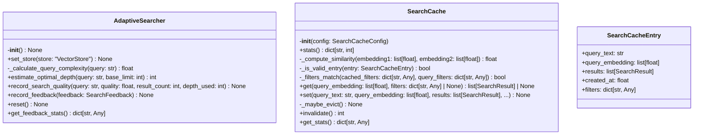

# File: `src/local_deepwiki/core/vectorstore/cache.py`

## File Overview

This file implements search caching and adaptive search depth estimation for the vector store. It provides two core functionalities:

1. **`SearchCache`**: A semantic similarity-based cache that stores and retrieves search results based on query embeddings and filters. It supports TTL-based expiration and LRU eviction policies.
2. **`AdaptiveSearcher`**: A component that dynamically estimates the optimal search depth for a given query based on historical performance and query complexity, improving search quality over time.

The module is designed to reduce redundant search operations and improve response times by reusing previously computed results when semantically similar queries are made.

## Key Concepts

### Semantic Caching with Cosine Similarity
The `SearchCache` uses cosine similarity between query embeddings to find cached results. This allows for semantic reuse of results even if the exact text of the query differs slightly. The similarity threshold is configurable to balance between reuse and freshness.

### Adaptive Search Depth Estimation
The `AdaptiveSearcher` improves search quality by estimating how deep to search based on:
- Query complexity (length, vocabulary diversity, technical terms)
- Historical performance of similar queries
- User feedback (via [`SearchFeedback`](schema.md))

This adaptive approach allows the system to dynamically adjust search depth, optimizing for both performance and result quality.

### Cache Eviction Strategy
The cache uses a two-phase eviction strategy:
1. **TTL-based cleanup**: Immediately removes expired entries.
2. **LRU-based cleanup**: If the cache is still over capacity, removes the oldest entries.

This ensures that the cache maintains a reasonable size while prioritizing recently used and valid entries.

## Integration

This file is used by:
- `AdaptiveSearcher`: Consumed by `search_config_resolver` in `AdaptiveSearcher` to dynamically adjust search parameters.
- `SearchCache`: Used by `models_search` and `test_vectorstore_cache` for caching and retrieval of search results.

The file imports from:
- `local_deepwiki.config`: To access [`SearchCacheConfig`](../../config/models_search.md) for cache settings.
- `local_deepwiki.logging`: For logging cache hits, misses, and evictions.
- `local_deepwiki.models`: For [`SearchResult`](../../handlers/types.md) type.
- `.schema`: For [`SearchFeedback`](schema.md) to record user feedback.
- `.store`: For [`VectorStore`](store.md) to integrate with the vector store lifecycle.

The file is part of the `local_deepwiki.core.vectorstore` module, indicating its role in the core search infrastructure.

## Design Notes

### Why Cosine Similarity?
Cosine similarity is chosen for its ability to measure semantic similarity between dense embeddings without being affected by vector magnitude. It's a standard in information retrieval and embedding-based systems.

### Why Adaptive Search Depth?
Instead of using a fixed search depth, this approach allows the system to be more efficient and effective:
- More complex queries get deeper searches to find relevant results.
- Historical data is used to avoid repeating poor search strategies.
- User feedback directly improves future search quality.

### Cache Size Management
The two-phase eviction strategy ensures that:
- Expired entries are immediately removed for memory efficiency.
- When under pressure, a buffer-based LRU approach prevents thrashing and maintains a reasonable cache size.

### Thread Safety
The `SearchCache` uses `threading.RLock()` to ensure thread-safe access to the cache and its statistics. This is critical in multi-threaded search environments.

### Complexity Caching
The `AdaptiveSearcher` caches query complexity scores to avoid recomputing them for identical queries, improving performance for repeated searches.

### Feedback Handling
Feedback is used to adjust quality estimates for similar queries, creating a feedback loop that improves the system's ability to predict search quality without requiring explicit re-ranking.

## API Reference

### class `AdaptiveSearcher`

Adaptive search depth estimator based on query characteristics and history.  Learns from past searches to estimate optimal search depth for new queries. Uses query characteristics (length, complexity) and historical performance to adapt the search strategy.  Attributes: _store: Reference to the [VectorStore](store.md) (set via property, not constructor). _query_history: Recent query history with quality metrics. _feedback_history: User feedback on search results.

**Methods:**


<details>
<summary>View Source (lines 26-266) | <a href="https://github.com/UrbanDiver/local-deepwiki-mcp/blob/main/src/local_deepwiki/core/vectorstore/cache.py#L26-L266">GitHub</a></summary>

```python
class AdaptiveSearcher:
    # Methods: __init__, set_store, _calculate_query_complexity, estimate_optimal_depth, record_search_quality, record_feedback, reset, get_feedback_stats
```

</details>

#### `__init__`

```python
def __init__() -> None
```

Initialize the adaptive searcher.


<details>
<summary>View Source (lines 43-54) | <a href="https://github.com/UrbanDiver/local-deepwiki-mcp/blob/main/src/local_deepwiki/core/vectorstore/cache.py#L43-L54">GitHub</a></summary>

```python
def __init__(self) -> None:
        """Initialize the adaptive searcher."""
        self._store: "VectorStore | None" = None
        # History: (query, quality_score, result_count, search_depth)
        self._query_history: deque[tuple[str, float, int, int]] = deque(
            maxlen=self.MAX_HISTORY_SIZE
        )
        self._feedback_history: deque[SearchFeedback] = deque(
            maxlen=self.MAX_FEEDBACK_SIZE
        )
        # Query complexity cache for performance
        self._complexity_cache: dict[str, float] = {}
```

</details>

#### `set_store`

```python
def set_store(store: "VectorStore") -> None
```

Set the vector store reference.


| Parameter | Type | Default | Description |
|-----------|------|---------|-------------|
| `store` | `"VectorStore"` | - | The VectorStore instance this searcher is associated with. |


<details>
<summary>View Source (lines 56-62) | <a href="https://github.com/UrbanDiver/local-deepwiki-mcp/blob/main/src/local_deepwiki/core/vectorstore/cache.py#L56-L62">GitHub</a></summary>

```python
def set_store(self, store: "VectorStore") -> None:
        """Set the vector store reference.

        Args:
            store: The VectorStore instance this searcher is associated with.
        """
        self._store = store
```

</details>

#### `estimate_optimal_depth`

```python
def estimate_optimal_depth(query: str, base_limit: int = 10) -> int
```

Estimate optimal search depth based on query characteristics.  Uses query complexity and historical performance to determine how many candidates to fetch for the best results.


| Parameter | Type | Default | Description |
|-----------|------|---------|-------------|
| `query` | `str` | - | The search query text. |
| `base_limit` | `int` | `10` | The base number of results requested. |


<details>
<summary>View Source (lines 137-183) | <a href="https://github.com/UrbanDiver/local-deepwiki-mcp/blob/main/src/local_deepwiki/core/vectorstore/cache.py#L137-L183">GitHub</a></summary>

```python
def estimate_optimal_depth(self, query: str, base_limit: int = 10) -> int:
        """Estimate optimal search depth based on query characteristics.

        Uses query complexity and historical performance to determine
        how many candidates to fetch for the best results.

        Args:
            query: The search query text.
            base_limit: The base number of results requested.

        Returns:
            Recommended search depth (number of candidates to fetch).
        """
        complexity = self._calculate_query_complexity(query)

        # Base depth is the requested limit
        base_depth = base_limit

        # Complexity-based multiplier: more complex queries need deeper search
        # Range: 1.5x to 4x based on complexity
        complexity_multiplier = 1.5 + (complexity * 2.5)

        # Historical adjustment: if similar queries had poor quality, increase depth
        historical_multiplier = 1.0
        if self._query_history:
            # Look for similar queries (simple word overlap heuristic)
            query_words = set(query.lower().split())
            similar_qualities: list[float] = []

            for hist_query, quality, _, _ in self._query_history:
                hist_words = set(hist_query.lower().split())
                overlap = len(query_words & hist_words)
                if overlap >= min(2, len(query_words)):
                    similar_qualities.append(quality)

            if similar_qualities:
                avg_quality = sum(similar_qualities) / len(similar_qualities)
                # If quality was low, increase depth
                # Quality 1.0 = multiplier 1.0, quality 0.0 = multiplier 2.0
                historical_multiplier = 2.0 - avg_quality

        # Combine multipliers
        total_multiplier = complexity_multiplier * historical_multiplier

        # Calculate final depth, capped at reasonable limits
        optimal_depth = int(base_depth * total_multiplier)
        return min(max(optimal_depth, base_limit), base_limit * 10)
```

</details>

#### `record_search_quality`

```python
def record_search_quality(query: str, quality: float, result_count: int, depth_used: int) -> None
```

Record search quality for future adaptation.


| Parameter | Type | Default | Description |
|-----------|------|---------|-------------|
| `query` | `str` | - | The search query that was executed. |
| `quality` | `float` | - | Quality score between 0.0 (poor) and 1.0 (excellent). |
| `result_count` | `int` | - | Number of results returned. |
| `depth_used` | `int` | - | The search depth that was used. |


<details>
<summary>View Source (lines 185-204) | <a href="https://github.com/UrbanDiver/local-deepwiki-mcp/blob/main/src/local_deepwiki/core/vectorstore/cache.py#L185-L204">GitHub</a></summary>

```python
def record_search_quality(
        self, query: str, quality: float, result_count: int, depth_used: int
    ) -> None:
        """Record search quality for future adaptation.

        Args:
            query: The search query that was executed.
            quality: Quality score between 0.0 (poor) and 1.0 (excellent).
            result_count: Number of results returned.
            depth_used: The search depth that was used.
        """
        quality = max(0.0, min(1.0, quality))  # Clamp to valid range
        self._query_history.append((query, quality, result_count, depth_used))
        logger.debug(
            "Recorded search quality: query='%s...' quality=%.2f results=%d depth=%d",
            query[:50],
            quality,
            result_count,
            depth_used,
        )
```

</details>

#### `record_feedback`

```python
def record_feedback(feedback: SearchFeedback) -> None
```

Record user feedback to improve future searches.  Feedback is used to update quality estimates for similar queries.


| Parameter | Type | Default | Description |
|-----------|------|---------|-------------|
| `feedback` | `SearchFeedback` | - | User feedback on a search result. |


<details>
<summary>View Source (lines 206-232) | <a href="https://github.com/UrbanDiver/local-deepwiki-mcp/blob/main/src/local_deepwiki/core/vectorstore/cache.py#L206-L232">GitHub</a></summary>

```python
def record_feedback(self, feedback: SearchFeedback) -> None:
        """Record user feedback to improve future searches.

        Feedback is used to update quality estimates for similar queries.

        Args:
            feedback: User feedback on a search result.
        """
        self._feedback_history.append(feedback)
        logger.debug(
            "Recorded feedback: query='%s...' result=%s relevant=%s",
            feedback.query[:50],
            feedback.result_id,
            feedback.relevant,
        )

        # Update quality estimates for matching queries in history
        # This provides indirect learning from user feedback
        # Collect updates first, then apply to avoid mutating during iteration
        updates: list[tuple[int, tuple[str, float, int, int]]] = []
        for i, (hist_query, quality, count, depth) in enumerate(self._query_history):
            if hist_query == feedback.query:
                adjustment = 0.1 if feedback.relevant else -0.1
                new_quality = max(0.0, min(1.0, quality + adjustment))
                updates.append((i, (hist_query, new_quality, count, depth)))
        for i, entry in updates:
            self._query_history[i] = entry
```

</details>

#### `reset`

```python
def reset() -> None
```

Reset all adaptive searcher state.  Clears query history, feedback history, and complexity cache. Called during [VectorStore](store.md).close() to release resources.


<details>
<summary>View Source (lines 234-242) | <a href="https://github.com/UrbanDiver/local-deepwiki-mcp/blob/main/src/local_deepwiki/core/vectorstore/cache.py#L234-L242">GitHub</a></summary>

```python
def reset(self) -> None:
        """Reset all adaptive searcher state.

        Clears query history, feedback history, and complexity cache.
        Called during VectorStore.close() to release resources.
        """
        self._query_history.clear()
        self._feedback_history.clear()
        self._complexity_cache.clear()
```

</details>

#### `get_feedback_stats`

```python
def get_feedback_stats() -> dict[str, Any]
```

Get statistics about collected feedback.


<details>
<summary>View Source (lines 244-266) | <a href="https://github.com/UrbanDiver/local-deepwiki-mcp/blob/main/src/local_deepwiki/core/vectorstore/cache.py#L244-L266">GitHub</a></summary>

```python
def get_feedback_stats(self) -> dict[str, Any]:
        """Get statistics about collected feedback.

        Returns:
            Dictionary with feedback statistics.
        """
        if not self._feedback_history:
            return {
                "total_feedback": 0,
                "relevant_count": 0,
                "irrelevant_count": 0,
                "relevance_rate": 0.0,
            }

        relevant = sum(1 for f in self._feedback_history if f.relevant)
        total = len(self._feedback_history)

        return {
            "total_feedback": total,
            "relevant_count": relevant,
            "irrelevant_count": total - relevant,
            "relevance_rate": relevant / total if total > 0 else 0.0,
        }
```

</details>

### class `SearchCacheEntry`

A cached search result entry.


<details>
<summary>View Source (lines 270-277) | <a href="https://github.com/UrbanDiver/local-deepwiki-mcp/blob/main/src/local_deepwiki/core/vectorstore/cache.py#L270-L277">GitHub</a></summary>

```python
class SearchCacheEntry:
    """A cached search result entry."""

    query_text: str
    query_embedding: list[float]
    results: list[SearchResult]
    created_at: float
    filters: dict[str, Any] = field(default_factory=dict)
```

</details>

### class `SearchCache`

In-memory cache for search results with semantic deduplication.  Uses embedding similarity to find cached results for semantically similar queries. Entries expire based on TTL and are evicted using LRU when max_entries is reached.

**Methods:**


<details>
<summary>View Source (lines 280-541) | <a href="https://github.com/UrbanDiver/local-deepwiki-mcp/blob/main/src/local_deepwiki/core/vectorstore/cache.py#L280-L541">GitHub</a></summary>

```python
class SearchCache:
    # Methods: __init__, stats, _compute_similarity, _is_valid_entry, _filters_match, get, set, _maybe_evict, invalidate, get_stats
```

</details>

#### `__init__`

```python
def __init__(config: SearchCacheConfig)
```

Initialize the search cache.


| Parameter | Type | Default | Description |
|-----------|------|---------|-------------|
| `config` | `SearchCacheConfig` | - | Cache configuration. |


<details>
<summary>View Source (lines 287-296) | <a href="https://github.com/UrbanDiver/local-deepwiki-mcp/blob/main/src/local_deepwiki/core/vectorstore/cache.py#L287-L296">GitHub</a></summary>

```python
def __init__(self, config: SearchCacheConfig):
        """Initialize the search cache.

        Args:
            config: Cache configuration.
        """
        self.config = config
        self._cache: dict[str, SearchCacheEntry] = {}
        self._lock = threading.RLock()
        self._stats = {"hits": 0, "misses": 0, "invalidations": 0}
```

</details>

#### `stats`

```python
def stats() -> dict[str, int]
```

Get cache statistics.


<details>
<summary>View Source (lines 299-301) | <a href="https://github.com/UrbanDiver/local-deepwiki-mcp/blob/main/src/local_deepwiki/core/vectorstore/cache.py#L299-L301">GitHub</a></summary>

```python
def stats(self) -> dict[str, int]:
        """Get cache statistics."""
        return self._stats.copy()
```

</details>

#### `get`

```python
def get(query_embedding: list[float], filters: dict[str, Any] | None = None) -> list[SearchResult] | None
```

Try to get cached results for a semantically similar query.


| Parameter | Type | Default | Description |
|-----------|------|---------|-------------|
| `query_embedding` | `list[float]` | - | Embedding of the search query. |
| `filters` | `dict[str, Any] | None` | `None` | Optional filters applied to the search (language, chunk_type, etc.) |


<details>
<summary>View Source (lines 355-415) | <a href="https://github.com/UrbanDiver/local-deepwiki-mcp/blob/main/src/local_deepwiki/core/vectorstore/cache.py#L355-L415">GitHub</a></summary>

```python
def get(
        self,
        query_embedding: list[float],
        filters: dict[str, Any] | None = None,
    ) -> list[SearchResult] | None:
        """Try to get cached results for a semantically similar query.

        Args:
            query_embedding: Embedding of the search query.
            filters: Optional filters applied to the search (language, chunk_type, etc.)

        Returns:
            Cached search results if found and valid, None otherwise.
        """
        if not self.config.enabled:
            return None

        filters = filters or {}

        with self._lock:
            best_match: SearchCacheEntry | None = None
            best_similarity = 0.0

            # Find the most similar valid cached query
            expired_keys: list[str] = []
            for key, entry in self._cache.items():
                if not self._is_valid_entry(entry):
                    expired_keys.append(key)
                    continue

                # Check if filters match
                if not self._filters_match(entry.filters, filters):
                    continue

                # Compute similarity
                similarity = self._compute_similarity(
                    query_embedding, entry.query_embedding
                )

                if (
                    similarity >= self.config.similarity_threshold
                    and similarity > best_similarity
                ):
                    best_similarity = similarity
                    best_match = entry

            # Clean up expired entries
            for key in expired_keys:
                del self._cache[key]

            if best_match is not None:
                self._stats["hits"] += 1
                logger.debug(
                    "Search cache hit: similarity=%.3f, query='%s...'",
                    best_similarity,
                    best_match.query_text[:50],
                )
                return best_match.results

            self._stats["misses"] += 1
            return None
```

</details>

#### `set`

```python
def set(query_text: str, query_embedding: list[float], results: list[SearchResult], filters: dict[str, Any] | None = None) -> None
```

Cache search results for a query.


| Parameter | Type | Default | Description |
|-----------|------|---------|-------------|
| `query_text` | `str` | - | Original query text. |
| `query_embedding` | `list[float]` | - | Embedding of the query. |
| `results` | `list[SearchResult]` | - | Search results to cache. |
| `filters` | `dict[str, Any] | None` | `None` | Optional filters applied to the search. |


<details>
<summary>View Source (lines 417-459) | <a href="https://github.com/UrbanDiver/local-deepwiki-mcp/blob/main/src/local_deepwiki/core/vectorstore/cache.py#L417-L459">GitHub</a></summary>

```python
def set(
        self,
        query_text: str,
        query_embedding: list[float],
        results: list[SearchResult],
        filters: dict[str, Any] | None = None,
    ) -> None:
        """Cache search results for a query.

        Args:
            query_text: Original query text.
            query_embedding: Embedding of the query.
            results: Search results to cache.
            filters: Optional filters applied to the search.
        """
        if not self.config.enabled:
            return

        filters = filters or {}

        with self._lock:
            # Create a unique key based on query text and filters
            filter_str = json.dumps(filters, sort_keys=True)
            cache_key = f"{query_text}:{filter_str}"

            entry = SearchCacheEntry(
                query_text=query_text,
                query_embedding=query_embedding,
                results=results,
                created_at=time.time(),
                filters=filters,
            )

            self._cache[cache_key] = entry

            logger.debug(
                "Cached search results: query='%s...', results=%d",
                query_text[:50],
                len(results),
            )

            # Evict if over capacity
            self._maybe_evict()
```

</details>

#### `invalidate`

```python
def invalidate() -> int
```

Invalidate all cache entries.  Called when the index is updated (new chunks added/removed).


<details>
<summary>View Source (lines 504-518) | <a href="https://github.com/UrbanDiver/local-deepwiki-mcp/blob/main/src/local_deepwiki/core/vectorstore/cache.py#L504-L518">GitHub</a></summary>

```python
def invalidate(self) -> int:
        """Invalidate all cache entries.

        Called when the index is updated (new chunks added/removed).

        Returns:
            Number of entries invalidated.
        """
        with self._lock:
            count = len(self._cache)
            self._cache.clear()
            self._stats["invalidations"] += 1
            if count > 0:
                logger.debug("Invalidated %s search cache entries", count)
            return count
```

</details>

#### `get_stats`

```python
def get_stats() -> dict[str, Any]
```

Get detailed cache statistics.


<details>
<summary>View Source (lines 520-541) | <a href="https://github.com/UrbanDiver/local-deepwiki-mcp/blob/main/src/local_deepwiki/core/vectorstore/cache.py#L520-L541">GitHub</a></summary>

```python
def get_stats(self) -> dict[str, Any]:
        """Get detailed cache statistics.

        Returns:
            Dictionary with cache statistics.
        """
        with self._lock:
            return {
                "enabled": self.config.enabled,
                "entries": len(self._cache),
                "max_entries": self.config.max_entries,
                "ttl_seconds": self.config.ttl_seconds,
                "similarity_threshold": self.config.similarity_threshold,
                "hits": self._stats["hits"],
                "misses": self._stats["misses"],
                "invalidations": self._stats["invalidations"],
                "hit_rate": (
                    self._stats["hits"] / (self._stats["hits"] + self._stats["misses"])
                    if (self._stats["hits"] + self._stats["misses"]) > 0
                    else 0.0
                ),
            }
```

</details>

## Class Diagram



## Call Graph

```mermaid
flowchart TD
    N0[AdaptiveSearcher.__init__]
    N1[AdaptiveSearcher.estimate_o...]
    N2[RLock]
    N3[SearchCache.__init__]
    N4[SearchCache._compute_simila...]
    N5[SearchCache._is_valid_entry]
    N6[SearchCache._maybe_evict]
    N7[SearchCache.get]
    N8[SearchCache.set]
    N9[SearchCache.stats]
    N10[SearchCacheEntry]
    N11[_calculate_query_complexity]
    N12[_compute_similarity]
    N13[_filters_match]
    N14[_is_valid_entry]
    N15[_maybe_evict]
    N16[array]
    N17[copy]
    N18[deque]
    N19[dot]
    N20[dumps]
    N21[norm]
    N22[time]
    N0 --> N18
    N1 --> N11
    N3 --> N2
    N9 --> N17
    N4 --> N16
    N4 --> N19
    N4 --> N21
    N5 --> N22
    N7 --> N14
    N7 --> N13
    N7 --> N12
    N8 --> N20
    N8 --> N10
    N8 --> N22
    N8 --> N15
    N6 --> N22
    classDef func fill:#e1f5fe
    class N2,N10,N11,N12,N13,N14,N15,N16,N17,N18,N19,N20,N21,N22 func
    classDef method fill:#fff3e0
    class N0,N1,N3,N4,N5,N6,N7,N8,N9 method
```



## Used By

Functions and methods in this file and their callers:

- **`RLock`**: called by `SearchCache.__init__`
- **`SearchCacheEntry`**: called by `SearchCache.set`
- **`_calculate_query_complexity`**: called by `AdaptiveSearcher.estimate_optimal_depth`
- **`_compute_similarity`**: called by `SearchCache.get`
- **`_filters_match`**: called by `SearchCache.get`
- **`_is_valid_entry`**: called by `SearchCache.get`
- **`_maybe_evict`**: called by `SearchCache.set`
- **`array`**: called by `SearchCache._compute_similarity`
- **`copy`**: called by `SearchCache.stats`
- **`deque`**: called by `AdaptiveSearcher.__init__`
- **`dot`**: called by `SearchCache._compute_similarity`
- **`dumps`**: called by `SearchCache.set`
- **`norm`**: called by `SearchCache._compute_similarity`
- **`time`**: called by `SearchCache._is_valid_entry`, `SearchCache._maybe_evict`, `SearchCache.set`

## Last Modified

| Entity | Type | Author | Date | Commit |
|--------|------|--------|------|--------|
| `SearchCache` | class | Brian Breidenbach | Feb 20, 2026 | `6be69f5` refactor: low-priority Pyth... |
| `_compute_similarity` | method | Brian Breidenbach | Feb 20, 2026 | `6be69f5` refactor: low-priority Pyth... |
| `_filters_match` | method | Brian Breidenbach | Feb 20, 2026 | `6be69f5` refactor: low-priority Pyth... |
| `AdaptiveSearcher` | class | Brian Breidenbach | Feb 20, 2026 | `b807417` refactor: high-priority Pyt... |
| `record_search_quality` | method | Brian Breidenbach | Feb 20, 2026 | `b807417` refactor: high-priority Pyt... |
| `record_feedback` | method | Brian Breidenbach | Feb 20, 2026 | `b807417` refactor: high-priority Pyt... |
| `get` | method | Brian Breidenbach | Feb 20, 2026 | `b807417` refactor: high-priority Pyt... |
| `set` | method | Brian Breidenbach | Feb 20, 2026 | `b807417` refactor: high-priority Pyt... |
| `_maybe_evict` | method | Brian Breidenbach | Feb 20, 2026 | `b807417` refactor: high-priority Pyt... |
| `reset` | method | Brian Breidenbach | Feb 12, 2026 | `df695d3` feat: add MCP Resources, ag... |
| `invalidate` | method | Brian Breidenbach | Feb 11, 2026 | `ba96da1` fix: publication plan P0-P2... |
| `__init__` | method | Brian Breidenbach | Feb 09, 2026 | `89de2db` refactor: split vectorstore... |
| `set_store` | method | Brian Breidenbach | Feb 09, 2026 | `89de2db` refactor: split vectorstore... |
| `_calculate_query_complexity` | method | Brian Breidenbach | Feb 09, 2026 | `89de2db` refactor: split vectorstore... |
| `estimate_optimal_depth` | method | Brian Breidenbach | Feb 09, 2026 | `89de2db` refactor: split vectorstore... |
| `get_feedback_stats` | method | Brian Breidenbach | Feb 09, 2026 | `89de2db` refactor: split vectorstore... |
| `SearchCacheEntry` | class | Brian Breidenbach | Feb 09, 2026 | `89de2db` refactor: split vectorstore... |
| `__init__` | method | Brian Breidenbach | Feb 09, 2026 | `89de2db` refactor: split vectorstore... |
| `stats` | method | Brian Breidenbach | Feb 09, 2026 | `89de2db` refactor: split vectorstore... |
| `_is_valid_entry` | method | Brian Breidenbach | Feb 09, 2026 | `89de2db` refactor: split vectorstore... |
| `get_stats` | method | Brian Breidenbach | Feb 09, 2026 | `89de2db` refactor: split vectorstore... |

## Additional Source Code

Source code for functions and methods not listed in the API Reference above.

#### `_calculate_query_complexity`

<details>
<summary>View Source (lines 64-135) | <a href="https://github.com/UrbanDiver/local-deepwiki-mcp/blob/main/src/local_deepwiki/core/vectorstore/cache.py#L64-L135">GitHub</a></summary>

```python
def _calculate_query_complexity(self, query: str) -> float:
        """Calculate a complexity score for a query.

        Complexity is based on:
        - Query length (longer = more complex)
        - Number of distinct terms
        - Presence of technical terms/operators

        Args:
            query: The search query text.

        Returns:
            Complexity score between 0.0 and 1.0.
        """
        if query in self._complexity_cache:
            return self._complexity_cache[query]

        # Normalize and tokenize
        words = query.lower().split()
        if not words:
            return 0.0

        # Factor 1: Query length (normalized to 0-1, saturates at 20 words)
        length_score = min(len(words) / 20.0, 1.0)

        # Factor 2: Vocabulary diversity (unique words / total words)
        unique_words = len(set(words))
        diversity_score = unique_words / len(words) if words else 0.0

        # Factor 3: Technical term presence (common programming terms)
        technical_terms = {
            "function",
            "class",
            "method",
            "async",
            "await",
            "import",
            "export",
            "interface",
            "type",
            "struct",
            "enum",
            "error",
            "exception",
            "api",
            "database",
            "query",
            "handler",
            "controller",
            "service",
            "repository",
            "middleware",
            "authentication",
            "authorization",
            "validation",
            "parse",
            "serialize",
            "deserialize",
        }
        tech_count = sum(1 for w in words if w in technical_terms)
        tech_score = min(tech_count / 3.0, 1.0)  # Saturates at 3 technical terms

        # Weighted combination
        complexity = 0.3 * length_score + 0.3 * diversity_score + 0.4 * tech_score

        # Cache the result (limit cache size)
        if len(self._complexity_cache) > 10000:
            # Clear oldest entries (simple approach)
            self._complexity_cache.clear()
        self._complexity_cache[query] = complexity

        return complexity
```

</details>


#### `_compute_similarity`

<details>
<summary>View Source (lines 304-325) | <a href="https://github.com/UrbanDiver/local-deepwiki-mcp/blob/main/src/local_deepwiki/core/vectorstore/cache.py#L304-L325">GitHub</a></summary>

```python
def _compute_similarity(embedding1: list[float], embedding2: list[float]) -> float:
        """Compute cosine similarity between two embeddings.

        Args:
            embedding1: First embedding vector.
            embedding2: Second embedding vector.

        Returns:
            Cosine similarity score (0.0 to 1.0).
        """
        arr1 = np.array(embedding1)
        arr2 = np.array(embedding2)

        # Compute cosine similarity
        dot_product = np.dot(arr1, arr2)
        norm1 = np.linalg.norm(arr1)
        norm2 = np.linalg.norm(arr2)

        if norm1 == 0 or norm2 == 0:
            return 0.0

        return float(dot_product / (norm1 * norm2))
```

</details>


#### `_is_valid_entry`

<details>
<summary>View Source (lines 327-337) | <a href="https://github.com/UrbanDiver/local-deepwiki-mcp/blob/main/src/local_deepwiki/core/vectorstore/cache.py#L327-L337">GitHub</a></summary>

```python
def _is_valid_entry(self, entry: SearchCacheEntry) -> bool:
        """Check if a cache entry is still valid (not expired).

        Args:
            entry: Cache entry to check.

        Returns:
            True if entry is valid, False if expired.
        """
        age = time.time() - entry.created_at
        return age < self.config.ttl_seconds
```

</details>


#### `_filters_match`

<details>
<summary>View Source (lines 340-353) | <a href="https://github.com/UrbanDiver/local-deepwiki-mcp/blob/main/src/local_deepwiki/core/vectorstore/cache.py#L340-L353">GitHub</a></summary>

```python
def _filters_match(
        cached_filters: dict[str, Any], query_filters: dict[str, Any]
    ) -> bool:
        """Check if cached filters match the query filters.

        Args:
            cached_filters: Filters from cached entry.
            query_filters: Filters from current query.

        Returns:
            True if filters match, False otherwise.
        """
        # Both must have the same keys and values
        return cached_filters == query_filters
```

</details>


#### `_maybe_evict`

<details>
<summary>View Source (lines 461-502) | <a href="https://github.com/UrbanDiver/local-deepwiki-mcp/blob/main/src/local_deepwiki/core/vectorstore/cache.py#L461-L502">GitHub</a></summary>

```python
def _maybe_evict(self) -> None:
        """Evict old entries if cache exceeds max_entries.

        Uses a two-phase eviction strategy:
        1. First, remove all expired entries (TTL-based)
        2. If still over limit, remove oldest entries (LRU)
        """
        if len(self._cache) <= self.config.max_entries:
            return

        logger.debug(
            "Search cache has %d entries (max: %d), evicting...",
            len(self._cache),
            self.config.max_entries,
        )

        # Phase 1: Remove expired entries
        now = time.time()
        expired_keys = [
            key
            for key, entry in self._cache.items()
            if now - entry.created_at >= self.config.ttl_seconds
        ]
        for key in expired_keys:
            del self._cache[key]

        if expired_keys:
            logger.debug("Evicted %s expired search cache entries", len(expired_keys))

        # Phase 2: LRU eviction if still over limit
        if len(self._cache) > self.config.max_entries:
            # Sort by created_at (oldest first)
            sorted_entries = sorted(self._cache.items(), key=lambda x: x[1].created_at)

            # Calculate how many to remove (with 20% buffer)
            target_count = int(self.config.max_entries * 0.8)
            to_remove = len(self._cache) - target_count

            for key, _ in sorted_entries[:to_remove]:
                del self._cache[key]

            logger.debug("Evicted %s LRU search cache entries", to_remove)
```

</details>

## Relevant Source Files

- `src/local_deepwiki/core/vectorstore/cache.py:26-266`
