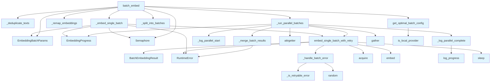

# File: `src/local_deepwiki/core/vectorstore/embedding.py`

## File Overview

This file provides core functionality for batch embedding text using either local or API-based embedding providers. It handles deduplication, rate limiting, retry logic, and parallel execution of embedding tasks. The design emphasizes robustness, performance, and adaptability to different types of embedding providers.

The module is designed to be used as part of a larger vectorstore system for generating embeddings that can be used in semantic search or other downstream tasks.

## Key Concepts

### Batch Embedding with Retry Logic
The core workflow involves splitting input texts into batches and processing them in parallel. For each batch, the system applies retry logic to handle transient failures such as network timeouts or rate limiting errors. This ensures that temporary issues do not cause entire embedding jobs to fail.

### Deduplication and Remapping
To optimize performance, duplicate texts are removed before processing, and the results are remapped back to the original text order. This avoids redundant computation while maintaining the expected output format.

### Provider-Aware Concurrency and Batch Size
The system adapts its batch size and concurrency settings based on whether the embedding provider is local (e.g., sentence-transformers) or API-based (e.g., OpenAI). Local providers benefit from higher concurrency and larger batch sizes, whereas API-based providers must respect rate limits and use smaller, more conservative settings.

### Asynchronous Parallel Execution
The module uses `asyncio` to run multiple embedding batches concurrently, improving throughput for large datasets. It leverages semaphores to control concurrency and rate limiters to respect provider quotas.

## Integration

This file integrates with several components in the codebase:

- **Providers**: Uses [`EmbeddingProvider`](../../providers/base.md) from `local_deepwiki.providers.base` to interface with different embedding models.
- **Configuration**: Relies on [`EmbeddingBatchConfig`](../../config/processing_models.md) from `local_deepwiki.config` to determine batch size, concurrency, and retry behavior.
- **Utilities**: Depends on [`RateLimiter`](utils.md) from `.utils` for API rate limiting and [`EmbeddingProgress`](schema.md) from `.schema` for tracking progress.
- **Search Parameters**: The [`EmbeddingBatchParams`](search_params.md) class is used to bundle parameters for batch processing, and functions like `_run_parallel_batches` and `embed_single_batch_with_retry` are used by `search_params`.

Functions in this module are called by:
- `stats` module (via `is_local_provider` and `get_optimal_batch_config`)
- `search_params` module (via `embed_single_batch_with_retry`, `_run_parallel_batches`)
- Test modules (`test_search_params`, `test_vectorstore_batching`, `test_vectorstore_submodules`) for unit testing

## Design Notes

### Retry Strategy
The retry mechanism is designed to be exponential backoff with jitter to avoid overwhelming the provider during transient issues. It only retries on specific error types (e.g., `ConnectionError`, `TimeoutError`, HTTP 502/503, rate limit errors), ensuring that non-retryable errors (e.g., invalid input) are not retried unnecessarily.

### Parallelism Control
Concurrency is controlled via `asyncio.Semaphore`, allowing the system to limit how many embedding tasks run simultaneously. This is crucial for API-based providers to prevent hitting rate limits or overwhelming the system.

### Local vs. API Provider Optimization
The system differentiates between local and API-based providers by checking the provider name. For local providers, it increases batch size and concurrency to maximize throughput, while for API providers, it reduces these to respect rate limits and avoid errors.

### Handling Edge Cases
- **Empty Input**: The `batch_embed` function returns an empty list if no input texts are provided.
- **Single Batch**: When only one batch is required, the system avoids parallel overhead and uses the fast path (`_embed_single_batch`).
- **Duplicate Texts**: Duplicates are detected and removed before processing, then remapped back to the original order.

### Logging and Progress Tracking
Detailed logging is implemented throughout the process, including progress updates, start/end of parallel batches, and throughput statistics. This is useful for debugging and performance monitoring.

## API Reference

### Functions

#### `is_local_provider`

```python
def is_local_provider(embedding_provider: EmbeddingProvider) -> bool
```

Check if the embedding provider is local (sentence-transformers).


| Parameter | Type | Default | Description |
|-----------|------|---------|-------------|
| `embedding_provider` | `EmbeddingProvider` | - | The embedding provider to check. |

**Returns:** `bool`


<details>
<summary>View Source (lines 20-30) | <a href="https://github.com/UrbanDiver/local-deepwiki-mcp/blob/main/src/local_deepwiki/core/vectorstore/embedding.py#L20-L30">GitHub</a></summary>

```python
def is_local_provider(embedding_provider: EmbeddingProvider) -> bool:
    """Check if the embedding provider is local (sentence-transformers).

    Args:
        embedding_provider: The embedding provider to check.

    Returns:
        True if provider is local, False for API-based providers.
    """
    provider_name = embedding_provider.name.lower()
    return provider_name.startswith("local:") or "sentence" in provider_name
```

</details>

#### `get_optimal_batch_config`

```python
def get_optimal_batch_config(config: EmbeddingBatchConfig, embedding_provider: EmbeddingProvider) -> tuple[int, int]
```

Get optimal batch size and concurrency based on provider type.


| Parameter | Type | Default | Description |
|-----------|------|---------|-------------|
| `config` | `EmbeddingBatchConfig` | - | Embedding batch configuration. |
| `embedding_provider` | `EmbeddingProvider` | - | The embedding provider. |

**Returns:** `tuple[int, int]`


<details>
<summary>View Source (lines 33-58) | <a href="https://github.com/UrbanDiver/local-deepwiki-mcp/blob/main/src/local_deepwiki/core/vectorstore/embedding.py#L33-L58">GitHub</a></summary>

```python
def get_optimal_batch_config(
    config: EmbeddingBatchConfig,
    embedding_provider: EmbeddingProvider,
) -> tuple[int, int]:
    """Get optimal batch size and concurrency based on provider type.

    Args:
        config: Embedding batch configuration.
        embedding_provider: The embedding provider.

    Returns:
        Tuple of (batch_size, concurrency).
    """
    is_local = is_local_provider(embedding_provider)

    batch_size = config.batch_size
    concurrency = config.concurrency

    if is_local:
        batch_size = max(batch_size, 100)
        concurrency = max(concurrency, 4)
    else:
        batch_size = min(batch_size, 50)
        concurrency = min(concurrency, 4)

    return batch_size, concurrency
```

</details>

#### `embed_single_batch_with_retry`

```python
async def embed_single_batch_with_retry(batch_index: int, texts: list[str], batch_params: EmbeddingBatchParams, progress: EmbeddingProgress) -> BatchEmbeddingResult
```

Embed a single batch with retry logic and rate limiting.


| Parameter | Type | Default | Description |
|-----------|------|---------|-------------|
| `batch_index` | `int` | - | Index of this batch for ordering results. |
| `texts` | `list[str]` | - | Texts to embed in this batch. |
| `batch_params` | `EmbeddingBatchParams` | - | Immutable bundle of provider, config, rate limiter, and semaphore. |
| `progress` | `EmbeddingProgress` | - | Progress tracker to update. |

**Returns:** [`BatchEmbeddingResult`](schema.md)


<details>
<summary>View Source (lines 116-177) | <a href="https://github.com/UrbanDiver/local-deepwiki-mcp/blob/main/src/local_deepwiki/core/vectorstore/embedding.py#L116-L177">GitHub</a></summary>

```python
async def embed_single_batch_with_retry(
    batch_index: int,
    texts: list[str],
    batch_params: EmbeddingBatchParams,
    progress: EmbeddingProgress,
) -> BatchEmbeddingResult:
    """Embed a single batch with retry logic and rate limiting.

    Args:
        batch_index: Index of this batch for ordering results.
        texts: Texts to embed in this batch.
        batch_params: Immutable bundle of provider, config, rate limiter,
            and semaphore.
        progress: Progress tracker to update.

    Returns:
        BatchEmbeddingResult with embeddings or error.
    """
    retry_count = 0

    async with batch_params.semaphore:
        while retry_count < batch_params.config.retry_max_attempts:
            try:
                if batch_params.rate_limiter is not None:
                    await batch_params.rate_limiter.acquire()

                embeddings = await batch_params.embedding_provider.embed(texts)
                progress.update(success=True)

                return BatchEmbeddingResult(
                    batch_index=batch_index,
                    embeddings=embeddings,
                    retry_count=retry_count,
                )

            except (
                ConnectionError,
                TimeoutError,
                OSError,
                RuntimeError,
                ValueError,
            ) as e:
                retry_count += 1
                should_retry, delay = _handle_batch_error(
                    e, batch_index, retry_count, batch_params.config, progress
                )
                if not should_retry:
                    return BatchEmbeddingResult(
                        batch_index=batch_index,
                        embeddings=None,
                        error=e,
                        retry_count=retry_count,
                    )
                await asyncio.sleep(delay)

    progress.update(success=False)
    return BatchEmbeddingResult(
        batch_index=batch_index,
        embeddings=None,
        error=RuntimeError("Unexpected: exhausted retries without returning"),
        retry_count=retry_count,
    )
```

</details>

#### `batch_embed`

```python
async def batch_embed(texts: list[str], embedding_provider: EmbeddingProvider, config: EmbeddingBatchConfig, rate_limiter: RateLimiter | None, batch_size: int | None = None, log_progress: bool = False) -> list[list[float]]
```

Generate embeddings in parallel batches with deduplication.  Uses concurrent batch processing for faster embedding generation. For local providers, uses higher concurrency. For API providers, respects rate limits and uses lower concurrency.


| Parameter | Type | Default | Description |
|-----------|------|---------|-------------|
| `texts` | `list[str]` | - | List of text strings to embed. |
| `embedding_provider` | `EmbeddingProvider` | - | Provider for generating embeddings. |
| `config` | `EmbeddingBatchConfig` | - | Embedding batch configuration. |
| `rate_limiter` | `RateLimiter | None` | - | Optional rate limiter for API calls. |
| `batch_size` | `int | None` | `None` | Number of texts to embed per batch. If None, uses config default. |
| `log_progress` | `bool` | `False` | Whether to log batch progress. |

**Returns:** `list[list[float]]`


<details>
<summary>View Source (lines 361-435) | <a href="https://github.com/UrbanDiver/local-deepwiki-mcp/blob/main/src/local_deepwiki/core/vectorstore/embedding.py#L361-L435">GitHub</a></summary>

```python
async def batch_embed(
    texts: list[str],
    embedding_provider: EmbeddingProvider,
    config: EmbeddingBatchConfig,
    rate_limiter: RateLimiter | None,
    *,
    batch_size: int | None = None,
    log_progress: bool = False,
) -> list[list[float]]:
    """Generate embeddings in parallel batches with deduplication.

    Uses concurrent batch processing for faster embedding generation.
    For local providers, uses higher concurrency. For API providers,
    respects rate limits and uses lower concurrency.

    Args:
        texts: List of text strings to embed.
        embedding_provider: Provider for generating embeddings.
        config: Embedding batch configuration.
        rate_limiter: Optional rate limiter for API calls.
        batch_size: Number of texts to embed per batch. If None, uses config default.
        log_progress: Whether to log batch progress.

    Returns:
        List of embedding vectors in the same order as input texts.

    Raises:
        RuntimeError: If any batches fail after all retry attempts.
    """
    if not texts:
        return []

    unique_texts, text_to_index = _deduplicate_texts(texts)

    duplicates_saved = len(texts) - len(unique_texts)
    if duplicates_saved > 0:
        logger.debug(
            "Embedding dedup: %d texts -> %d unique (%d duplicates skipped)",
            len(texts),
            len(unique_texts),
            duplicates_saved,
        )

    optimal_batch_size, optimal_concurrency = get_optimal_batch_config(
        config, embedding_provider
    )
    batch_size = batch_size or optimal_batch_size
    batches = _split_into_batches(unique_texts, batch_size)
    total_batches = len(batches)

    # For single batch, still use retry logic but without parallel overhead
    if total_batches == 1:
        unique_embeddings = await _embed_single_batch(
            batches[0],
            embedding_provider,
            config,
            rate_limiter,
            log_progress=log_progress,
        )
        return _remap_embeddings(unique_embeddings, texts, text_to_index)

    batch_params = EmbeddingBatchParams(
        embedding_provider=embedding_provider,
        config=config,
        rate_limiter=rate_limiter,
        semaphore=asyncio.Semaphore(optimal_concurrency),
    )
    all_embeddings = await _run_parallel_batches(
        batches=batches,
        unique_texts=unique_texts,
        batch_params=batch_params,
        batch_size=batch_size,
        log_progress=log_progress,
    )
    return _remap_embeddings(all_embeddings, texts, text_to_index)
```

</details>

## Call Graph



## Used By

Functions and methods in this file and their callers:

- **[`BatchEmbeddingResult`](schema.md)**: called by `embed_single_batch_with_retry`
- **[`EmbeddingBatchParams`](search_params.md)**: called by `_embed_single_batch`, `batch_embed`
- **[`EmbeddingProgress`](schema.md)**: called by `_embed_single_batch`, `_run_parallel_batches`
- **`RuntimeError`**: called by `_embed_single_batch`, `_merge_batch_results`, `embed_single_batch_with_retry`
- **`Semaphore`**: called by `_embed_single_batch`, `batch_embed`
- **`_deduplicate_texts`**: called by `batch_embed`
- **`_embed_single_batch`**: called by `batch_embed`
- **`_handle_batch_error`**: called by `embed_single_batch_with_retry`
- **`_is_retryable_error`**: called by `_handle_batch_error`
- **`_log_parallel_complete`**: called by `_run_parallel_batches`
- **`_log_parallel_start`**: called by `_run_parallel_batches`
- **`_merge_batch_results`**: called by `_run_parallel_batches`
- **`_remap_embeddings`**: called by `batch_embed`
- **`_run_parallel_batches`**: called by `batch_embed`
- **`_split_into_batches`**: called by `batch_embed`
- **`acquire`**: called by `embed_single_batch_with_retry`
- **`attrgetter`**: called by `_run_parallel_batches`
- **`embed`**: called by `embed_single_batch_with_retry`
- **`embed_single_batch_with_retry`**: called by `_embed_single_batch`, `_run_parallel_batches`
- **`gather`**: called by `_run_parallel_batches`
- **`get_optimal_batch_config`**: called by `batch_embed`
- **`is_local_provider`**: called by `get_optimal_batch_config`
- **`log_progress`**: called by `_log_parallel_complete`
- **`random`**: called by `_handle_batch_error`
- **`sleep`**: called by `embed_single_batch_with_retry`

## Usage Examples

*Examples extracted from test files*

### Test cache initialization

From `test_embedding_cache.py::TestEmbeddingCache::test_initialization`:

```python
assert cache._db_path == cache_dir / "embedding_cache.db"
assert cache._db_path.exists()
assert cache._stats == {"hits": 0, "misses": 0, "errors": 0}
```


## Last Modified

| Entity | Type | Author | Date | Commit |
|--------|------|--------|------|--------|
| `embed_single_batch_with_retry` | function | Brian Breidenbach | yesterday | `b7856dc` refactor: introduce search ... |
| `_embed_single_batch` | function | Brian Breidenbach | yesterday | `b7856dc` refactor: introduce search ... |
| `_run_parallel_batches` | function | Brian Breidenbach | yesterday | `b7856dc` refactor: introduce search ... |
| `batch_embed` | function | Brian Breidenbach | yesterday | `b7856dc` refactor: introduce search ... |
| `_log_parallel_start` | function | Brian Breidenbach | 2 days ago | `29ae780` refactor: decompose long me... |
| `_log_parallel_complete` | function | Brian Breidenbach | 2 days ago | `29ae780` refactor: decompose long me... |
| `_remap_embeddings` | function | Brian Breidenbach | 1 week ago | `52d32b6` refactor: extract helpers f... |
| `_is_retryable_error` | function | Brian Breidenbach | 1 week ago | `af244a5` refactor: split core hotspo... |
| `_handle_batch_error` | function | Brian Breidenbach | 1 week ago | `af244a5` refactor: split core hotspo... |
| `_deduplicate_texts` | function | Brian Breidenbach | 1 week ago | `af244a5` refactor: split core hotspo... |
| `_split_into_batches` | function | Brian Breidenbach | 1 week ago | `af244a5` refactor: split core hotspo... |
| `_merge_batch_results` | function | Brian Breidenbach | 1 week ago | `af244a5` refactor: split core hotspo... |
| `is_local_provider` | function | Brian Breidenbach | Feb 11, 2026 | `25db622` fix: publication review P0-... |
| `get_optimal_batch_config` | function | Brian Breidenbach | Feb 11, 2026 | `25db622` fix: publication review P0-... |

## Additional Source Code

Source code for functions and methods not listed in the API Reference above.

#### `_is_retryable_error`

<details>
<summary>View Source (lines 61-71) | <a href="https://github.com/UrbanDiver/local-deepwiki-mcp/blob/main/src/local_deepwiki/core/vectorstore/embedding.py#L61-L71">GitHub</a></summary>

```python
def _is_retryable_error(e: Exception) -> bool:
    """Determine if an embedding error is retryable."""
    error_str = str(e).lower()
    return (
        isinstance(e, (ConnectionError, TimeoutError, OSError))
        or ("rate" in error_str and "limit" in error_str)
        or "overloaded" in error_str
        or "503" in error_str
        or "502" in error_str
        or "timeout" in error_str
    )
```

</details>


#### `_handle_batch_error`

<details>
<summary>View Source (lines 74-113) | <a href="https://github.com/UrbanDiver/local-deepwiki-mcp/blob/main/src/local_deepwiki/core/vectorstore/embedding.py#L74-L113">GitHub</a></summary>

```python
def _handle_batch_error(
    e: Exception,
    batch_index: int,
    retry_count: int,
    config: EmbeddingBatchConfig,
    progress: EmbeddingProgress,
) -> tuple[bool, float]:
    """Handle a batch embedding error — decide whether to retry and compute delay.

    Args:
        e: The exception that occurred.
        batch_index: Batch index for logging.
        retry_count: Current retry count (already incremented).
        config: Embedding batch configuration.
        progress: Progress tracker.

    Returns:
        Tuple of (should_retry, delay_seconds). If should_retry is False, the
        caller should return a failed BatchEmbeddingResult.
    """
    if not _is_retryable_error(e) or retry_count >= config.retry_max_attempts:
        logger.warning(
            "Batch %d failed after %d attempts: %s",
            batch_index,
            retry_count,
            e,
        )
        progress.update(success=False)
        return False, 0.0

    delay = config.retry_base_delay * (2 ** (retry_count - 1))
    delay = delay * (0.5 + random.random())
    logger.warning(
        "Batch %d failed (attempt %d): %s. Retrying in %.2fs...",
        batch_index,
        retry_count,
        e,
        delay,
    )
    return True, delay
```

</details>


#### `_deduplicate_texts`

<details>
<summary>View Source (lines 180-188) | <a href="https://github.com/UrbanDiver/local-deepwiki-mcp/blob/main/src/local_deepwiki/core/vectorstore/embedding.py#L180-L188">GitHub</a></summary>

```python
def _deduplicate_texts(texts: list[str]) -> tuple[list[str], dict[str, int]]:
    """Return unique texts and a mapping from text to its unique index."""
    unique_texts: list[str] = []
    text_to_index: dict[str, int] = {}
    for text in texts:
        if text not in text_to_index:
            text_to_index[text] = len(unique_texts)
            unique_texts.append(text)
    return unique_texts, text_to_index
```

</details>


#### `_split_into_batches`

<details>
<summary>View Source (lines 191-193) | <a href="https://github.com/UrbanDiver/local-deepwiki-mcp/blob/main/src/local_deepwiki/core/vectorstore/embedding.py#L191-L193">GitHub</a></summary>

```python
def _split_into_batches(texts: list[str], batch_size: int) -> list[list[str]]:
    """Split a list of texts into fixed-size batches."""
    return [texts[i : i + batch_size] for i in range(0, len(texts), batch_size)]
```

</details>


#### `_remap_embeddings`

<details>
<summary>View Source (lines 196-211) | <a href="https://github.com/UrbanDiver/local-deepwiki-mcp/blob/main/src/local_deepwiki/core/vectorstore/embedding.py#L196-L211">GitHub</a></summary>

```python
def _remap_embeddings(
    unique_embeddings: list[list[float]],
    texts: list[str],
    text_to_index: dict[str, int],
) -> list[list[float]]:
    """Remap unique embeddings back to the original (possibly duplicate) text order.

    Args:
        unique_embeddings: Embeddings for the deduplicated unique texts.
        texts: Original input texts (may contain duplicates).
        text_to_index: Mapping from text string to its index in unique_embeddings.

    Returns:
        Embeddings in the same order as the original ``texts`` list.
    """
    return [unique_embeddings[text_to_index[t]] for t in texts]
```

</details>


#### `_embed_single_batch`

<details>
<summary>View Source (lines 214-254) | <a href="https://github.com/UrbanDiver/local-deepwiki-mcp/blob/main/src/local_deepwiki/core/vectorstore/embedding.py#L214-L254">GitHub</a></summary>

```python
async def _embed_single_batch(
    batch_texts: list[str],
    embedding_provider: EmbeddingProvider,
    config: EmbeddingBatchConfig,
    rate_limiter: RateLimiter | None,
    *,
    log_progress: bool,
) -> list[list[float]]:
    """Embed a single batch using the fast path (no parallel overhead).

    Args:
        batch_texts: Texts that form the single batch.
        embedding_provider: Provider for generating embeddings.
        config: Embedding batch configuration.
        rate_limiter: Optional rate limiter for API calls.
        log_progress: Whether to log a completion message.

    Returns:
        List of embedding vectors for the batch texts.

    Raises:
        RuntimeError: If the batch fails after all retry attempts.
    """
    progress = EmbeddingProgress(total_texts=len(batch_texts), total_batches=1)
    batch_params = EmbeddingBatchParams(
        embedding_provider=embedding_provider,
        config=config,
        rate_limiter=rate_limiter,
        semaphore=asyncio.Semaphore(1),
    )
    result = await embed_single_batch_with_retry(
        0,
        batch_texts,
        batch_params,
        progress,
    )
    if result.error is not None:
        raise RuntimeError(f"Failed to embed batch: {result.error}")
    if log_progress:
        logger.debug("Embedded 1/1 batches (%s unique texts)", len(batch_texts))
    return result.embeddings or []
```

</details>


#### `_merge_batch_results`

<details>
<summary>View Source (lines 257-292) | <a href="https://github.com/UrbanDiver/local-deepwiki-mcp/blob/main/src/local_deepwiki/core/vectorstore/embedding.py#L257-L292">GitHub</a></summary>

```python
def _merge_batch_results(
    results: list[BatchEmbeddingResult],
    total_batches: int,
) -> list[list[float]]:
    """Collect embeddings from sorted batch results, raising on any failure.

    Args:
        results: List of BatchEmbeddingResult objects (already sorted by batch_index).
        total_batches: Total number of batches (for error messages).

    Returns:
        Flat list of embeddings in batch order.

    Raises:
        RuntimeError: If any batch failed.
    """
    errors: list[tuple[int, Exception]] = []
    all_embeddings: list[list[float]] = []

    for result in results:
        if result.error is not None:
            errors.append((result.batch_index, result.error))
        elif result.embeddings is not None:
            all_embeddings.extend(result.embeddings)

    if errors:
        error_msgs = [f"Batch {idx}: {err}" for idx, err in errors]
        logger.error(
            "Embedding failed for %s batches:\n%s", len(errors), "\n".join(error_msgs)
        )
        raise RuntimeError(
            f"Failed to embed {len(errors)} out of {total_batches} batches. "
            f"First error: {errors[0][1]}"
        )

    return all_embeddings
```

</details>


#### `_log_parallel_start`

<details>
<summary>View Source (lines 295-309) | <a href="https://github.com/UrbanDiver/local-deepwiki-mcp/blob/main/src/local_deepwiki/core/vectorstore/embedding.py#L295-L309">GitHub</a></summary>

```python
def _log_parallel_start(
    unique_texts: list[str],
    total_batches: int,
    batch_size: int,
    concurrency: int,
) -> None:
    """Log the start of parallel embedding."""
    logger.info(
        "Starting parallel embedding: %d unique texts in %d batches "
        "(batch_size=%d, concurrency=%d)",
        len(unique_texts),
        total_batches,
        batch_size,
        concurrency,
    )
```

</details>


#### `_log_parallel_complete`

<details>
<summary>View Source (lines 312-322) | <a href="https://github.com/UrbanDiver/local-deepwiki-mcp/blob/main/src/local_deepwiki/core/vectorstore/embedding.py#L312-L322">GitHub</a></summary>

```python
def _log_parallel_complete(progress: EmbeddingProgress, unique_count: int) -> None:
    """Log the completion of parallel embedding with throughput stats."""
    progress.log_progress()
    elapsed = progress.elapsed_seconds
    rate = unique_count / elapsed if elapsed > 0 else 0
    logger.info(
        "Embedding complete: %d unique texts in %.2fs (%.1f texts/sec)",
        unique_count,
        elapsed,
        rate,
    )
```

</details>


#### `_run_parallel_batches`

<details>
<summary>View Source (lines 325-358) | <a href="https://github.com/UrbanDiver/local-deepwiki-mcp/blob/main/src/local_deepwiki/core/vectorstore/embedding.py#L325-L358">GitHub</a></summary>

```python
async def _run_parallel_batches(
    *,
    batches: list[list[str]],
    unique_texts: list[str],
    batch_params: EmbeddingBatchParams,
    batch_size: int,
    log_progress: bool,
) -> list[list[float]]:
    """Run all batches in parallel and return merged embeddings for unique texts."""
    total_batches = len(batches)
    progress = EmbeddingProgress(
        total_texts=len(unique_texts), total_batches=total_batches
    )
    if log_progress:
        # Derive concurrency from semaphore for logging
        _log_parallel_start(
            unique_texts, total_batches, batch_size, batch_params.semaphore._value
        )

    tasks = [
        embed_single_batch_with_retry(
            i,
            batch_texts,
            batch_params,
            progress,
        )
        for i, batch_texts in enumerate(batches)
    ]
    results: list[BatchEmbeddingResult] = await asyncio.gather(*tasks)
    results = sorted(results, key=attrgetter("batch_index"))
    all_embeddings = _merge_batch_results(results, total_batches)
    if log_progress:
        _log_parallel_complete(progress, len(unique_texts))
    return all_embeddings
```

</details>

## Relevant Source Files

- `src/local_deepwiki/core/vectorstore/embedding.py:20-30`
