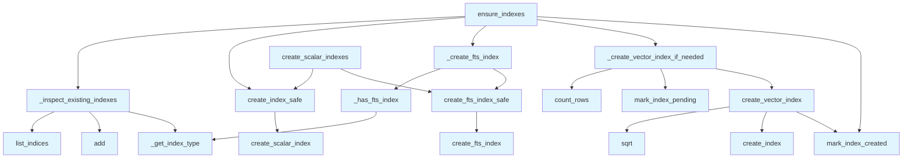

# File: `src/local_deepwiki/core/vectorstore/indexes.py`

## File Overview

This file is responsible for managing the creation and maintenance of indexes on LanceDB tables used in the vectorstore. It provides utilities to ensure that necessary indexes—both scalar (for efficient lookups) and vector (for semantic search)—exist on tables. It also supports lazy index creation for large datasets to avoid blocking operations during table initialization.

The module is designed to be robust against various error conditions, such as missing or outdated index support in the LanceDB version, and integrates with a [`LazyIndexManager`](maintenance.md) to defer vector index creation when appropriate.

## Key Concepts

### Index Management Abstraction
The module abstracts the process of index creation and inspection, encapsulating logic for:
- Detecting existing indexes
- Creating scalar and full-text search (FTS) indexes
- Conditionally creating vector indexes using IVF-PQ algorithm
- Handling version compatibility issues with FTS support

This abstraction allows the vectorstore to operate consistently regardless of the LanceDB version or the state of the table.

### Lazy Indexing Strategy
Vector index creation is deferred when the number of rows in a table is below a configurable threshold (`min_rows`). This strategy prevents expensive indexing operations on small datasets, optimizing performance and resource usage. The [`LazyIndexManager`](maintenance.md) is used to track the index creation state and determine when to proceed with index creation.

### FTS Indexing for Semantic Search
Full-text search (FTS) indexing on the `content` column enables keyword-based search using BM25. This is essential for hybrid search pipelines that combine keyword and vector search. The module gracefully handles cases where FTS is not supported by the LanceDB version.

## Integration

This module is used by:
- `store.py` in the `create_index_safe` function, which is called during table initialization.
- `test_vectorstore_indexes` in `test_vectorstore_indexes.py`, which uses `ensure_indexes` to validate index state.

It imports from:
- `local_deepwiki.logging` for structured logging
- `LanceDB.table.Table` for interacting with LanceDB tables
- [`LazyIndexManager`](maintenance.md) from `.maintenance` to manage vector index creation timing

It is part of the `vectorstore` core module and integrates with:
- `search_pipeline.py` (likely for hybrid search)
- `store.py` (for managing table indexes during creation and access)
- `maintenance.py` (for lazy index creation logic)

## Design Notes

### Error Handling and Graceful Degradation
All index creation functions are wrapped in try-except blocks to handle:
- `ValueError`, `RuntimeError`, `OSError`, `TypeError`, and `AttributeError`
This ensures that index creation failures don't crash the application, especially when running on older or incompatible versions of LanceDB.

### Index Type Inspection
The `_get_index_type` function safely extracts index type information from both object and dictionary representations of indexes. This allows the code to be compatible with different versions of LanceDB where index representations may vary.

### Vector Index Configuration
The `create_vector_index` function calculates `num_partitions` as `min(max(int(math.sqrt(num_rows)), 16), 256)`. This algorithm:
- Ensures a minimum of 16 partitions for small datasets
- Caps the number of partitions at 256 to prevent excessive overhead
- Provides a reasonable scaling with dataset size for performance and memory usage

### Lazy Indexing Trade-offs
By deferring vector index creation when the dataset is small, the system avoids:
- Long initialization times
- Unnecessary resource consumption
- Blocking operations during startup

This is particularly important for large-scale deployments where tables may be initialized frequently but not always populated with many rows.

### Scalar Indexing
Scalar indexes are created on `id` and `file_path` columns to support efficient lookups. These are always created, regardless of the dataset size, because they are lightweight and essential for basic table operations.

### Full-Text Search Indexing
FTS indexing is optional and only created if not already present. This allows for backward compatibility and avoids redundant index creation, especially in cases where the index may have been created by an older version of the system.

## API Reference

### Functions

#### `ensure_indexes`

```python
def ensure_indexes(table: Table, lazy_index_manager: LazyIndexManager) -> None
```

Ensure all indexes exist on a table, creating them if needed.  Called when opening an existing table to ensure indexes are present even if the table was created by an older version. Creates both scalar indexes (for lookups) and vector indexes (for search).


| Parameter | Type | Default | Description |
|-----------|------|---------|-------------|
| `table` | `Table` | - | The LanceDB table to check/create indexes on. |
| `lazy_index_manager` | `LazyIndexManager` | - | Manager for lazy vector index creation. |

**Returns:** `None`


<details>
<summary>View Source (lines 82-105) | <a href="https://github.com/UrbanDiver/local-deepwiki-mcp/blob/main/src/local_deepwiki/core/vectorstore/indexes.py#L82-L105">GitHub</a></summary>

```python
def ensure_indexes(table: Table, lazy_index_manager: LazyIndexManager) -> None:
    """Ensure all indexes exist on a table, creating them if needed.

    Called when opening an existing table to ensure indexes are present
    even if the table was created by an older version. Creates both
    scalar indexes (for lookups) and vector indexes (for search).

    Args:
        table: The LanceDB table to check/create indexes on.
        lazy_index_manager: Manager for lazy vector index creation.
    """
    indices, existing_indexes, has_vector_index = _inspect_existing_indexes(table)

    if "id_idx" not in existing_indexes:
        create_index_safe(table, "id")
    if "file_path_idx" not in existing_indexes:
        create_index_safe(table, "file_path")

    _create_fts_index(table, indices)

    if not has_vector_index:
        _create_vector_index_if_needed(table, lazy_index_manager)
    else:
        lazy_index_manager.mark_index_created()
```

</details>

#### `create_fts_index_safe`

```python
def create_fts_index_safe(table: Table, column: str) -> None
```

Safely create a full-text search (BM25) index on a text column.


| Parameter | Type | Default | Description |
|-----------|------|---------|-------------|
| `table` | `Table` | - | The LanceDB table. |
| `column` | `str` | - | The text column name to index. |

**Returns:** `None`


<details>
<summary>View Source (lines 108-120) | <a href="https://github.com/UrbanDiver/local-deepwiki-mcp/blob/main/src/local_deepwiki/core/vectorstore/indexes.py#L108-L120">GitHub</a></summary>

```python
def create_fts_index_safe(table: Table, column: str) -> None:
    """Safely create a full-text search (BM25) index on a text column.

    Args:
        table: The LanceDB table.
        column: The text column name to index.
    """
    try:
        table.create_fts_index(column, replace=True)
        logger.debug("Created FTS index on '%s' column", column)
    except (ValueError, RuntimeError, OSError, TypeError, AttributeError) as e:
        # TypeError/AttributeError: older LanceDB versions without FTS support
        logger.debug("Could not create FTS index on '%s': %s", column, e)
```

</details>

#### `create_index_safe`

```python
def create_index_safe(table: Table, column: str) -> None
```

Safely create a scalar index on a column.


| Parameter | Type | Default | Description |
|-----------|------|---------|-------------|
| `table` | `Table` | - | The LanceDB table. |
| `column` | `str` | - | The column name to index. |

**Returns:** `None`


<details>
<summary>View Source (lines 123-134) | <a href="https://github.com/UrbanDiver/local-deepwiki-mcp/blob/main/src/local_deepwiki/core/vectorstore/indexes.py#L123-L134">GitHub</a></summary>

```python
def create_index_safe(table: Table, column: str) -> None:
    """Safely create a scalar index on a column.

    Args:
        table: The LanceDB table.
        column: The column name to index.
    """
    try:
        table.create_scalar_index(column)
        logger.debug("Created scalar index on '%s' column", column)
    except (ValueError, RuntimeError, OSError) as e:
        logger.debug("Could not create index on '%s': %s", column, e)
```

</details>

#### `create_scalar_indexes`

```python
def create_scalar_indexes(table: Table) -> None
```

Create scalar indexes for efficient lookups.  Creates indexes on 'id' and 'file_path' columns to optimize get_chunk_by_id() and get_chunks_by_file() operations. Also creates a full-text search index on 'content' for BM25 keyword search.


| Parameter | Type | Default | Description |
|-----------|------|---------|-------------|
| `table` | `Table` | - | The LanceDB table. |

**Returns:** `None`


<details>
<summary>View Source (lines 137-149) | <a href="https://github.com/UrbanDiver/local-deepwiki-mcp/blob/main/src/local_deepwiki/core/vectorstore/indexes.py#L137-L149">GitHub</a></summary>

```python
def create_scalar_indexes(table: Table) -> None:
    """Create scalar indexes for efficient lookups.

    Creates indexes on 'id' and 'file_path' columns to optimize
    get_chunk_by_id() and get_chunks_by_file() operations.
    Also creates a full-text search index on 'content' for BM25 keyword search.

    Args:
        table: The LanceDB table.
    """
    create_index_safe(table, "id")
    create_index_safe(table, "file_path")
    create_fts_index_safe(table, "content")
```

</details>

#### `create_vector_index`

```python
def create_vector_index(table: Table, num_rows: int, lazy_index_manager: LazyIndexManager) -> None
```

Create a vector index for faster semantic search.  Uses IVF-PQ index for approximate nearest neighbor search, which provides 5-10x speedup on large datasets (10k+ vectors).


| Parameter | Type | Default | Description |
|-----------|------|---------|-------------|
| `table` | `Table` | - | The LanceDB table. |
| `num_rows` | `int` | - | Number of rows in the table. |
| `lazy_index_manager` | `LazyIndexManager` | - | Manager for tracking index state. |

**Returns:** `None`


<details>
<summary>View Source (lines 152-194) | <a href="https://github.com/UrbanDiver/local-deepwiki-mcp/blob/main/src/local_deepwiki/core/vectorstore/indexes.py#L152-L194">GitHub</a></summary>

```python
def create_vector_index(
    table: Table,
    num_rows: int,
    lazy_index_manager: LazyIndexManager,
) -> None:
    """Create a vector index for faster semantic search.

    Uses IVF-PQ index for approximate nearest neighbor search,
    which provides 5-10x speedup on large datasets (10k+ vectors).

    Args:
        table: The LanceDB table.
        num_rows: Number of rows in the table.
        lazy_index_manager: Manager for tracking index state.
    """
    min_rows_for_index = lazy_index_manager.config.min_rows

    if num_rows < min_rows_for_index:
        logger.debug(
            "Skipping vector index creation: %d rows < %d threshold",
            num_rows,
            min_rows_for_index,
        )
        return

    try:
        num_partitions = min(max(int(math.sqrt(num_rows)), 16), 256)

        table.create_index(
            metric="L2",
            num_partitions=num_partitions,
            num_sub_vectors=16,
        )
        logger.info(
            "Created vector index with %d partitions for %d vectors",
            num_partitions,
            num_rows,
        )

        lazy_index_manager.mark_index_created()

    except (ValueError, RuntimeError, OSError) as e:
        logger.debug("Could not create vector index: %s", e)
```

</details>

## Call Graph



## Used By

Functions and methods in this file and their callers:

- **`_create_fts_index`**: called by `ensure_indexes`
- **`_create_vector_index_if_needed`**: called by `ensure_indexes`
- **`_get_index_type`**: called by `_has_fts_index`, `_inspect_existing_indexes`
- **`_has_fts_index`**: called by `_create_fts_index`
- **`_inspect_existing_indexes`**: called by `ensure_indexes`
- **`add`**: called by `_inspect_existing_indexes`
- **`count_rows`**: called by `_create_vector_index_if_needed`
- **`create_fts_index`**: called by `create_fts_index_safe`
- **`create_fts_index_safe`**: called by `_create_fts_index`, `create_scalar_indexes`
- **`create_index`**: called by `create_vector_index`
- **`create_index_safe`**: called by `create_scalar_indexes`, `ensure_indexes`
- **`create_scalar_index`**: called by `create_index_safe`
- **`create_vector_index`**: called by `_create_vector_index_if_needed`
- **`list_indices`**: called by `_inspect_existing_indexes`
- **`mark_index_created`**: called by `create_vector_index`, `ensure_indexes`
- **`mark_index_pending`**: called by `_create_vector_index_if_needed`
- **`sqrt`**: called by `create_vector_index`

## Last Modified

| Entity | Type | Author | Date | Commit |
|--------|------|--------|------|--------|
| `_get_index_type` | function | Brian Breidenbach | 1 week ago | `af244a5` refactor: split core hotspo... |
| `_inspect_existing_indexes` | function | Brian Breidenbach | 1 week ago | `af244a5` refactor: split core hotspo... |
| `_has_fts_index` | function | Brian Breidenbach | 1 week ago | `af244a5` refactor: split core hotspo... |
| `_create_fts_index` | function | Brian Breidenbach | 1 week ago | `af244a5` refactor: split core hotspo... |
| `_create_vector_index_if_needed` | function | Brian Breidenbach | 1 week ago | `af244a5` refactor: split core hotspo... |
| `ensure_indexes` | function | Brian Breidenbach | 1 week ago | `af244a5` refactor: split core hotspo... |
| `create_fts_index_safe` | function | Brian Breidenbach | 2 weeks ago | `8203fe8` feat: add service layer, hy... |
| `create_scalar_indexes` | function | Brian Breidenbach | 2 weeks ago | `8203fe8` feat: add service layer, hy... |
| `create_vector_index` | function | Brian Breidenbach | Feb 20, 2026 | `b807417` refactor: high-priority Pyt... |
| `create_index_safe` | function | Brian Breidenbach | Feb 11, 2026 | `ba96da1` fix: publication plan P0-P2... |

## Additional Source Code

Source code for functions and methods not listed in the API Reference above.

#### `_get_index_type`

<details>
<summary>View Source (lines 18-23) | <a href="https://github.com/UrbanDiver/local-deepwiki-mcp/blob/main/src/local_deepwiki/core/vectorstore/indexes.py#L18-L23">GitHub</a></summary>

```python
def _get_index_type(idx: object) -> str:
    """Safely extract the index_type string from a LanceDB index object."""
    idx_type = getattr(idx, "index_type", None) or (
        idx.get("index_type", "") if isinstance(idx, dict) else ""  # type: ignore[union-attr]
    )
    return str(idx_type).lower() if idx_type else ""
```

</details>


#### `_inspect_existing_indexes`

<details>
<summary>View Source (lines 26-49) | <a href="https://github.com/UrbanDiver/local-deepwiki-mcp/blob/main/src/local_deepwiki/core/vectorstore/indexes.py#L26-L49">GitHub</a></summary>

```python
def _inspect_existing_indexes(
    table: Table,
) -> tuple[list[object], set[str], bool]:
    """List table indexes and classify them.

    Returns:
        Tuple of (indices, existing_index_names, has_vector_index).
    """
    try:
        indices = table.list_indices()
        existing_indexes: set[str] = set()
        has_vector_index = False
        for idx in indices:
            name = getattr(idx, "name", None) or (
                idx.get("name") if isinstance(idx, dict) else None  # type: ignore[union-attr]
            )
            if name:
                existing_indexes.add(name)
            if "ivf" in _get_index_type(idx):
                has_vector_index = True
        return indices, existing_indexes, has_vector_index
    except (KeyError, TypeError, RuntimeError, AttributeError) as e:
        logger.debug("Could not list existing indexes: %s", e)
        return [], set(), False
```

</details>


#### `_has_fts_index`

<details>
<summary>View Source (lines 52-54) | <a href="https://github.com/UrbanDiver/local-deepwiki-mcp/blob/main/src/local_deepwiki/core/vectorstore/indexes.py#L52-L54">GitHub</a></summary>

```python
def _has_fts_index(indices: list[object]) -> bool:
    """Return True if any of the listed indexes is a full-text search index."""
    return bool(indices) and any("fts" in _get_index_type(idx) for idx in indices)
```

</details>


#### `_create_fts_index`

<details>
<summary>View Source (lines 57-60) | <a href="https://github.com/UrbanDiver/local-deepwiki-mcp/blob/main/src/local_deepwiki/core/vectorstore/indexes.py#L57-L60">GitHub</a></summary>

```python
def _create_fts_index(table: Table, indices: list[object]) -> None:
    """Create the FTS index on 'content' if it does not already exist."""
    if not _has_fts_index(indices):
        create_fts_index_safe(table, "content")
```

</details>


#### `_create_vector_index_if_needed`

<details>
<summary>View Source (lines 63-79) | <a href="https://github.com/UrbanDiver/local-deepwiki-mcp/blob/main/src/local_deepwiki/core/vectorstore/indexes.py#L63-L79">GitHub</a></summary>

```python
def _create_vector_index_if_needed(
    table: Table,
    lazy_index_manager: LazyIndexManager,
) -> None:
    """Create or defer creation of the vector index."""
    try:
        num_rows = table.count_rows()
        if lazy_index_manager.config.enabled:
            if num_rows >= lazy_index_manager.config.min_rows:
                lazy_index_manager.mark_index_pending()
                logger.debug(
                    "Vector index creation deferred (lazy mode): %d rows", num_rows
                )
        else:
            create_vector_index(table, num_rows, lazy_index_manager)
    except (RuntimeError, OSError) as e:
        logger.debug("Could not check row count for vector indexing: %s", e)
```

</details>

## Relevant Source Files

- `src/local_deepwiki/core/vectorstore/indexes.py:18-23`
