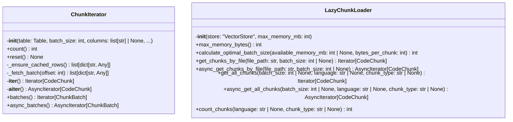

# File: `src/local_deepwiki/core/vectorstore/iterators.py`

## File Overview

This file provides efficient iterator utilities for loading and processing code chunks from a LanceDB vector store. It offers both synchronous and asynchronous iteration over chunks, supporting batching and filtering for memory-efficient operations. The module is designed to work with the [`VectorStore`](store.md) class and integrates with `LanceDB` for database access.

## Key Concepts

### `ChunkIterator` Class
The `ChunkIterator` class abstracts the process of iterating over chunks in a LanceDB table. It addresses the limitation of LanceDB's lack of native offset support by fetching all matching rows once and caching them for subsequent batched access. This approach ensures O(n) iteration complexity instead of O(n²) when using repeated limit+offset queries.

Key design choices:
- **Caching Strategy**: On first access, all matching rows are fetched and cached to avoid repeated database queries.
- **Batched Processing**: Enables efficient processing of large datasets by yielding chunks in batches, reducing per-chunk overhead.
- **Async Support**: Provides both synchronous and asynchronous iteration methods to accommodate different execution contexts.


<details>
<summary>View Source (lines 28-245) | <a href="https://github.com/UrbanDiver/local-deepwiki-mcp/blob/main/src/local_deepwiki/core/vectorstore/iterators.py#L28-L245">GitHub</a></summary>

```python
class ChunkIterator:
    # Methods: __init__, count, reset, _ensure_cached_rows, _fetch_batch, __iter__, __aiter__, batches, async_batches
```

</details>

### `LazyChunkLoader` Class
The `LazyChunkLoader` class is responsible for managing the lazy loading of chunks based on memory constraints. It calculates an optimal batch size dynamically based on available system memory, ensuring that memory usage remains within defined limits.

Key design choices:
- **Memory Awareness**: Automatically detects available system memory to determine batch size, falling back gracefully if `psutil` is not available.
- **Filtering Support**: Allows filtering chunks by `language` and `chunk_type` to reduce memory footprint and improve performance.
- **Asynchronous and Synchronous APIs**: Offers both sync and async APIs for loading chunks, supporting flexible integration with different application patterns.


<details>
<summary>View Source (lines 248-524) | <a href="https://github.com/UrbanDiver/local-deepwiki-mcp/blob/main/src/local_deepwiki/core/vectorstore/iterators.py#L248-L524">GitHub</a></summary>

```python
class LazyChunkLoader:
    # Methods: __init__, max_memory_bytes, calculate_optimal_batch_size, get_chunks_by_file, async_get_chunks_by_file, get_all_chunks, async_get_all_chunks, count_chunks
```

</details>

## Integration

This file integrates with:
- **[`VectorStore`](store.md)**: The `LazyChunkLoader` depends on a [`VectorStore`](store.md) instance to access the underlying `Table`.
- **`LanceDB`**: Uses `Table` for querying and iterating over chunks.
- **[`local_deepwiki.models.CodeChunk`](../../models/chunks.md)**: Converts rows into [`CodeChunk`](../../models/chunks.md) objects using the provided `row_to_chunk_fn`.
- **`local_deepwiki.core.vectorstore.schema`**: Uses schema constants like `VALID_LANGUAGES` and `VALID_CHUNK_TYPES` for validation.
- **`local_deepwiki.core.vectorstore.utils`**: Leverages utility functions like `_row_to_chunk_default` and `_sanitize_string_value`.

The `ChunkIterator` and `LazyChunkLoader` are used by:
- `stats` (for counting and iterating chunks)
- `test_vectorstore_pagination` (for testing pagination logic)
- `test_vectorstore_submodules` (for testing chunk loading logic)

## Design Notes

### Memory Efficiency
- `LazyChunkLoader` calculates an optimal batch size based on available memory to prevent out-of-memory errors.
- The `ChunkIterator` caches rows once and reuses them, avoiding repeated database fetches.
- Filtering is applied at the database level to reduce the number of rows fetched, minimizing memory usage.

### Asynchronous Handling
- Asynchronous iteration (`__aiter__` and `async_batches`) uses `asyncio.to_thread` to run blocking operations (like fetching rows) in a thread pool, ensuring non-blocking behavior in async contexts.

### Filtering and Validation
- Filters for `language` and `chunk_type` are validated against predefined constants (`VALID_LANGUAGES`, `VALID_CHUNK_TYPES`) to prevent invalid queries.
- String values used in filters are sanitized using `_sanitize_string_value` to prevent injection attacks.

### Fallbacks and Robustness
- If `psutil` is not available or fails, `LazyChunkLoader` falls back to using the default memory limit.
- If the `Table` is not available, methods return early to prevent errors.

### Batch Size Calculations
- Batch size is calculated to ensure that the memory budget is not exceeded.
- A minimum batch size of 100 is enforced to avoid overly small batches.
- A maximum batch size of 10,000 is capped to prevent excessive memory consumption.

## API Reference

### class `ChunkIterator`

Memory-efficient iterator over all chunks in a vector store table.  Loads chunks in batches to avoid OOM when dealing with large datasets (1M+ chunks). Supports both sync and async iteration.

**Methods:**


<details>
<summary>View Source (lines 28-245) | <a href="https://github.com/UrbanDiver/local-deepwiki-mcp/blob/main/src/local_deepwiki/core/vectorstore/iterators.py#L28-L245">GitHub</a></summary>

```python
class ChunkIterator:
    # Methods: __init__, count, reset, _ensure_cached_rows, _fetch_batch, __iter__, __aiter__, batches, async_batches
```

</details>

#### `__init__`

```python
def __init__(table: Table, batch_size: int = 1000, columns: list[str] | None = None, filter_expr: str | None = None, row_to_chunk_fn: RowMapper | None = None)
```

Initialize the chunk iterator.


| Parameter | Type | Default | Description |
|-----------|------|---------|-------------|
| `table` | `Table` | - | LanceDB table to iterate over. |
| `batch_size` | `int` | `1000` | Number of rows to load per batch. |
| `columns` | `list[str] | None` | `None` | Specific columns to fetch (None = all columns). |
| `filter_expr` | `str | None` | `None` | Optional filter expression (e.g., "language = 'python'"). |
| `row_to_chunk_fn` | `RowMapper | None` | `None` | Function to convert a row dict to CodeChunk. |


<details>
<summary>View Source (lines 55-79) | <a href="https://github.com/UrbanDiver/local-deepwiki-mcp/blob/main/src/local_deepwiki/core/vectorstore/iterators.py#L55-L79">GitHub</a></summary>

```python
def __init__(
        self,
        table: Table,
        batch_size: int = 1000,
        columns: list[str] | None = None,
        filter_expr: str | None = None,
        row_to_chunk_fn: RowMapper | None = None,
    ):
        """Initialize the chunk iterator.

        Args:
            table: LanceDB table to iterate over.
            batch_size: Number of rows to load per batch.
            columns: Specific columns to fetch (None = all columns).
            filter_expr: Optional filter expression (e.g., "language = 'python'").
            row_to_chunk_fn: Function to convert a row dict to CodeChunk.
        """
        self._table = table
        self._batch_size = batch_size
        self._columns = columns
        self._filter_expr = filter_expr
        self._row_to_chunk_fn = row_to_chunk_fn or _row_to_chunk_default
        self._offset = 0
        self._total_count: int | None = None
        self._cached_rows: list[dict[str, Any]] | None = None
```

</details>

#### `count`

```python
def count() -> int
```

Return total count of chunks without loading all data.  Uses LanceDB's count_rows() which is O(1) and doesn't load row data.


<details>
<summary>View Source (lines 81-99) | <a href="https://github.com/UrbanDiver/local-deepwiki-mcp/blob/main/src/local_deepwiki/core/vectorstore/iterators.py#L81-L99">GitHub</a></summary>

```python
def count(self) -> int:
        """Return total count of chunks without loading all data.

        Uses LanceDB's count_rows() which is O(1) and doesn't load row data.

        Returns:
            Total number of chunks in the table.
        """
        if self._total_count is None:
            if self._filter_expr:
                # For filtered counts, we need to run a query
                # This is more expensive but still doesn't load full row data
                query = self._table.search().where(self._filter_expr)
                query = query.select(["id"])  # Only fetch ID for count
                results = query.limit(10_000_000).to_list()  # Large limit for count
                self._total_count = len(results)
            else:
                self._total_count = self._table.count_rows()
        return self._total_count
```

</details>

#### `reset`

```python
def reset() -> None
```

Reset the iterator to the beginning.


<details>
<summary>View Source (lines 101-104) | <a href="https://github.com/UrbanDiver/local-deepwiki-mcp/blob/main/src/local_deepwiki/core/vectorstore/iterators.py#L101-L104">GitHub</a></summary>

```python
def reset(self) -> None:
        """Reset the iterator to the beginning."""
        self._offset = 0
        self._cached_rows = None
```

</details>

#### `batches`

```python
def batches() -> Iterator[ChunkBatch]
```

Iterate over chunks in batches.  More efficient for bulk operations as it avoids per-chunk overhead.


<details>
<summary>View Source (lines 184-214) | <a href="https://github.com/UrbanDiver/local-deepwiki-mcp/blob/main/src/local_deepwiki/core/vectorstore/iterators.py#L184-L214">GitHub</a></summary>

```python
def batches(self) -> Iterator[ChunkBatch]:
        """Iterate over chunks in batches.

        More efficient for bulk operations as it avoids per-chunk overhead.

        Yields:
            ChunkBatch objects containing lists of chunks.
        """
        self.reset()
        total = self.count()
        total_batches = (
            (total + self._batch_size - 1) // self._batch_size if total > 0 else 0
        )
        batch_index = 0

        while self._offset < total:
            rows = self._fetch_batch(self._offset)
            if not rows:
                break

            chunks = [self._row_to_chunk_fn(row) for row in rows]
            self._offset += len(rows)
            has_more = self._offset < total

            yield ChunkBatch(
                chunks=chunks,
                batch_index=batch_index,
                total_batches=total_batches,
                has_more=has_more,
            )
            batch_index += 1
```

</details>

#### `async_batches`

```python
async def async_batches() -> AsyncIterator[ChunkBatch]
```

Async iterate over chunks in batches.


<details>
<summary>View Source (lines 216-245) | <a href="https://github.com/UrbanDiver/local-deepwiki-mcp/blob/main/src/local_deepwiki/core/vectorstore/iterators.py#L216-L245">GitHub</a></summary>

```python
async def async_batches(self) -> AsyncIterator[ChunkBatch]:
        """Async iterate over chunks in batches.

        Yields:
            ChunkBatch objects containing lists of chunks.
        """
        self.reset()
        total = self.count()
        total_batches = (
            (total + self._batch_size - 1) // self._batch_size if total > 0 else 0
        )
        batch_index = 0

        while self._offset < total:
            rows = await asyncio.to_thread(self._fetch_batch, self._offset)
            if not rows:
                break

            chunks = [self._row_to_chunk_fn(row) for row in rows]
            self._offset += len(rows)
            has_more = self._offset < total

            yield ChunkBatch(
                chunks=chunks,
                batch_index=batch_index,
                total_batches=total_batches,
                has_more=has_more,
            )
            batch_index += 1
            await asyncio.sleep(0)
```

</details>

### class `LazyChunkLoader`

Lazy loader for code chunks with memory-aware batch sizing.  Provides memory-efficient access to chunks from a [VectorStore](store.md) without loading all data into memory at once.

**Methods:**


<details>
<summary>View Source (lines 248-524) | <a href="https://github.com/UrbanDiver/local-deepwiki-mcp/blob/main/src/local_deepwiki/core/vectorstore/iterators.py#L248-L524">GitHub</a></summary>

```python
class LazyChunkLoader:
    # Methods: __init__, max_memory_bytes, calculate_optimal_batch_size, get_chunks_by_file, async_get_chunks_by_file, get_all_chunks, async_get_all_chunks, count_chunks
```

</details>

#### `__init__`

```python
def __init__(store: "VectorStore", max_memory_mb: int = DEFAULT_MAX_MEMORY_MB)
```

Initialize the lazy chunk loader.


| Parameter | Type | Default | Description |
|-----------|------|---------|-------------|
| `store` | `"VectorStore"` | - | VectorStore instance to load chunks from. |
| `max_memory_mb` | `int` | `DEFAULT_MAX_MEMORY_MB` | Maximum memory budget in MB for batch operations. |


<details>
<summary>View Source (lines 271-284) | <a href="https://github.com/UrbanDiver/local-deepwiki-mcp/blob/main/src/local_deepwiki/core/vectorstore/iterators.py#L271-L284">GitHub</a></summary>

```python
def __init__(
        self,
        store: "VectorStore",
        max_memory_mb: int = DEFAULT_MAX_MEMORY_MB,
    ):
        """Initialize the lazy chunk loader.

        Args:
            store: VectorStore instance to load chunks from.
            max_memory_mb: Maximum memory budget in MB for batch operations.
        """
        self._store = store
        self._max_memory_mb = max_memory_mb
        self._optimal_batch_size: int | None = None
```

</details>

#### `max_memory_bytes`

```python
def max_memory_bytes() -> int
```

Maximum memory budget in bytes.


<details>
<summary>View Source (lines 287-289) | <a href="https://github.com/UrbanDiver/local-deepwiki-mcp/blob/main/src/local_deepwiki/core/vectorstore/iterators.py#L287-L289">GitHub</a></summary>

```python
def max_memory_bytes(self) -> int:
        """Maximum memory budget in bytes."""
        return self._max_memory_mb * 1024 * 1024
```

</details>

#### `calculate_optimal_batch_size`

```python
def calculate_optimal_batch_size(available_memory_mb: int | None = None, bytes_per_chunk: int = ESTIMATED_BYTES_PER_CHUNK) -> int
```

Calculate optimal batch size based on available memory.


| Parameter | Type | Default | Description |
|-----------|------|---------|-------------|
| `available_memory_mb` | `int | None` | `None` | Available memory in MB. If None, auto-detects. |
| `bytes_per_chunk` | `int` | `ESTIMATED_BYTES_PER_CHUNK` | Estimated bytes per chunk. |


<details>
<summary>View Source (lines 291-324) | <a href="https://github.com/UrbanDiver/local-deepwiki-mcp/blob/main/src/local_deepwiki/core/vectorstore/iterators.py#L291-L324">GitHub</a></summary>

```python
def calculate_optimal_batch_size(
        self,
        available_memory_mb: int | None = None,
        bytes_per_chunk: int = ESTIMATED_BYTES_PER_CHUNK,
    ) -> int:
        """Calculate optimal batch size based on available memory.

        Args:
            available_memory_mb: Available memory in MB. If None, auto-detects.
            bytes_per_chunk: Estimated bytes per chunk.

        Returns:
            Optimal batch size that fits within memory constraints.
        """
        if available_memory_mb is None:
            # Auto-detect available memory
            try:
                mem_info = psutil.virtual_memory()
                # Use at most 25% of available memory or max_memory_mb, whichever is smaller
                available_memory_mb = min(
                    int(mem_info.available / (1024 * 1024) * 0.25),
                    self._max_memory_mb,
                )
            except (ImportError, OSError, AttributeError):
                # ImportError: psutil not installed
                # OSError: Permission or OS-level issue
                # AttributeError: psutil API change
                available_memory_mb = self._max_memory_mb

        available_bytes = available_memory_mb * 1024 * 1024
        batch_size = max(100, available_bytes // bytes_per_chunk)

        # Cap at reasonable limits
        return min(batch_size, 10_000)
```

</details>

#### `get_chunks_by_file`

```python
def get_chunks_by_file(file_path: str, batch_size: int | None = None) -> Iterator[CodeChunk]
```

Lazily load chunks for a specific file.


| Parameter | Type | Default | Description |
|-----------|------|---------|-------------|
| `file_path` | `str` | - | Path to the file to get chunks for. |
| `batch_size` | `int | None` | `None` | Batch size for loading. If None, uses optimal size. |


<details>
<summary>View Source (lines 326-357) | <a href="https://github.com/UrbanDiver/local-deepwiki-mcp/blob/main/src/local_deepwiki/core/vectorstore/iterators.py#L326-L357">GitHub</a></summary>

```python
def get_chunks_by_file(
        self,
        file_path: str,
        batch_size: int | None = None,
    ) -> Iterator[CodeChunk]:
        """Lazily load chunks for a specific file.

        Args:
            file_path: Path to the file to get chunks for.
            batch_size: Batch size for loading. If None, uses optimal size.

        Yields:
            CodeChunk objects for the specified file.
        """
        table = self._store._get_table()
        if table is None:
            return

        if batch_size is None:
            batch_size = self.calculate_optimal_batch_size()

        safe_path = _sanitize_string_value(file_path)
        filter_expr = f"file_path = '{safe_path}'"

        iterator = ChunkIterator(
            table=table,
            batch_size=batch_size,
            filter_expr=filter_expr,
            row_to_chunk_fn=self._store._row_to_chunk,
        )

        yield from iterator
```

</details>

#### `async_get_chunks_by_file`

```python
async def async_get_chunks_by_file(file_path: str, batch_size: int | None = None) -> AsyncIterator[CodeChunk]
```

Async lazily load chunks for a specific file.


| Parameter | Type | Default | Description |
|-----------|------|---------|-------------|
| `file_path` | `str` | - | Path to the file to get chunks for. |
| `batch_size` | `int | None` | `None` | Batch size for loading. If None, uses optimal size. |


<details>
<summary>View Source (lines 359-391) | <a href="https://github.com/UrbanDiver/local-deepwiki-mcp/blob/main/src/local_deepwiki/core/vectorstore/iterators.py#L359-L391">GitHub</a></summary>

```python
async def async_get_chunks_by_file(
        self,
        file_path: str,
        batch_size: int | None = None,
    ) -> AsyncIterator[CodeChunk]:
        """Async lazily load chunks for a specific file.

        Args:
            file_path: Path to the file to get chunks for.
            batch_size: Batch size for loading. If None, uses optimal size.

        Yields:
            CodeChunk objects for the specified file.
        """
        table = self._store._get_table()
        if table is None:
            return

        if batch_size is None:
            batch_size = self.calculate_optimal_batch_size()

        safe_path = _sanitize_string_value(file_path)
        filter_expr = f"file_path = '{safe_path}'"

        iterator = ChunkIterator(
            table=table,
            batch_size=batch_size,
            filter_expr=filter_expr,
            row_to_chunk_fn=self._store._row_to_chunk,
        )

        async for chunk in iterator:
            yield chunk
```

</details>

#### `get_all_chunks`

```python
def get_all_chunks(batch_size: int | None = None, language: str | None = None, chunk_type: str | None = None) -> Iterator[CodeChunk]
```

Lazily iterate over all chunks.


| Parameter | Type | Default | Description |
|-----------|------|---------|-------------|
| `batch_size` | `int | None` | `None` | Batch size for loading. If None, uses optimal size. |
| `language` | `str | None` | `None` | Optional language filter. |
| `chunk_type` | `str | None` | `None` | Optional chunk type filter. |


<details>
<summary>View Source (lines 393-436) | <a href="https://github.com/UrbanDiver/local-deepwiki-mcp/blob/main/src/local_deepwiki/core/vectorstore/iterators.py#L393-L436">GitHub</a></summary>

```python
def get_all_chunks(
        self,
        batch_size: int | None = None,
        language: str | None = None,
        chunk_type: str | None = None,
    ) -> Iterator[CodeChunk]:
        """Lazily iterate over all chunks.

        Args:
            batch_size: Batch size for loading. If None, uses optimal size.
            language: Optional language filter.
            chunk_type: Optional chunk type filter.

        Yields:
            CodeChunk objects.
        """
        table = self._store._get_table()
        if table is None:
            return

        if batch_size is None:
            batch_size = self.calculate_optimal_batch_size()

        # Build filter expression
        filters = []
        if language:
            if language not in VALID_LANGUAGES:
                raise ValueError(f"Invalid language filter: {language}")
            filters.append(f"language = '{language}'")
        if chunk_type:
            if chunk_type not in VALID_CHUNK_TYPES:
                raise ValueError(f"Invalid chunk_type filter: {chunk_type}")
            filters.append(f"chunk_type = '{chunk_type}'")

        filter_expr = " AND ".join(filters) if filters else None

        iterator = ChunkIterator(
            table=table,
            batch_size=batch_size,
            filter_expr=filter_expr,
            row_to_chunk_fn=self._store._row_to_chunk,
        )

        yield from iterator
```

</details>

#### `async_get_all_chunks`

```python
async def async_get_all_chunks(batch_size: int | None = None, language: str | None = None, chunk_type: str | None = None) -> AsyncIterator[CodeChunk]
```

Async lazily iterate over all chunks.


| Parameter | Type | Default | Description |
|-----------|------|---------|-------------|
| `batch_size` | `int | None` | `None` | Batch size for loading. If None, uses optimal size. |
| `language` | `str | None` | `None` | Optional language filter. |
| `chunk_type` | `str | None` | `None` | Optional chunk type filter. |


<details>
<summary>View Source (lines 438-482) | <a href="https://github.com/UrbanDiver/local-deepwiki-mcp/blob/main/src/local_deepwiki/core/vectorstore/iterators.py#L438-L482">GitHub</a></summary>

```python
async def async_get_all_chunks(
        self,
        batch_size: int | None = None,
        language: str | None = None,
        chunk_type: str | None = None,
    ) -> AsyncIterator[CodeChunk]:
        """Async lazily iterate over all chunks.

        Args:
            batch_size: Batch size for loading. If None, uses optimal size.
            language: Optional language filter.
            chunk_type: Optional chunk type filter.

        Yields:
            CodeChunk objects.
        """
        table = self._store._get_table()
        if table is None:
            return

        if batch_size is None:
            batch_size = self.calculate_optimal_batch_size()

        # Build filter expression
        filters = []
        if language:
            if language not in VALID_LANGUAGES:
                raise ValueError(f"Invalid language filter: {language}")
            filters.append(f"language = '{language}'")
        if chunk_type:
            if chunk_type not in VALID_CHUNK_TYPES:
                raise ValueError(f"Invalid chunk_type filter: {chunk_type}")
            filters.append(f"chunk_type = '{chunk_type}'")

        filter_expr = " AND ".join(filters) if filters else None

        iterator = ChunkIterator(
            table=table,
            batch_size=batch_size,
            filter_expr=filter_expr,
            row_to_chunk_fn=self._store._row_to_chunk,
        )

        async for chunk in iterator:
            yield chunk
```

</details>

#### `count_chunks`

```python
def count_chunks(language: str | None = None, chunk_type: str | None = None) -> int
```

Count chunks without loading them into memory.


| Parameter | Type | Default | Description |
|-----------|------|---------|-------------|
| `language` | `str | None` | `None` | Optional language filter. |
| `chunk_type` | `str | None` | `None` | Optional chunk type filter. |


<details>
<summary>View Source (lines 484-524) | <a href="https://github.com/UrbanDiver/local-deepwiki-mcp/blob/main/src/local_deepwiki/core/vectorstore/iterators.py#L484-L524">GitHub</a></summary>

```python
def count_chunks(
        self,
        language: str | None = None,
        chunk_type: str | None = None,
    ) -> int:
        """Count chunks without loading them into memory.

        Args:
            language: Optional language filter.
            chunk_type: Optional chunk type filter.

        Returns:
            Total count of matching chunks.
        """
        table = self._store._get_table()
        if table is None:
            return 0

        if not language and not chunk_type:
            return table.count_rows()

        # Build filter expression
        filters = []
        if language:
            if language not in VALID_LANGUAGES:
                raise ValueError(f"Invalid language filter: {language}")
            filters.append(f"language = '{language}'")
        if chunk_type:
            if chunk_type not in VALID_CHUNK_TYPES:
                raise ValueError(f"Invalid chunk_type filter: {chunk_type}")
            filters.append(f"chunk_type = '{chunk_type}'")

        filter_expr = " AND ".join(filters) if filters else None

        iterator = ChunkIterator(
            table=table,
            batch_size=1,
            filter_expr=filter_expr,
        )

        return iterator.count()
```

</details>

## Class Diagram



## Call Graph

```mermaid
flowchart TD
    N0[ChunkBatch]
    N1[ChunkIterator]
    N2[ChunkIterator.__aiter__]
    N3[ChunkIterator.__iter__]
    N4[ChunkIterator._ensure_cache...]
    N5[ChunkIterator._fetch_batch]
    N6[ChunkIterator.async_batches]
    N7[ChunkIterator.batches]
    N8[ChunkIterator.count]
    N9[LazyChunkLoader.async_get_a...]
    N10[LazyChunkLoader.async_get_c...]
    N11[LazyChunkLoader.count_chunks]
    N12[LazyChunkLoader.get_all_chunks]
    N13[LazyChunkLoader.get_chunks_...]
    N14[ValueError]
    N15[_ensure_cached_rows]
    N16[_fetch_batch]
    N17[_get_table]
    N18[_row_to_chunk_fn]
    N19[_sanitize_string_value]
    N20[calculate_optimal_batch_size]
    N21[count_rows]
    N22[limit]
    N23[reset]
    N24[search]
    N25[select]
    N26[sleep]
    N27[to_list]
    N28[to_thread]
    N29[where]
    N8 --> N29
    N8 --> N24
    N8 --> N25
    N8 --> N27
    N8 --> N22
    N8 --> N21
    N4 --> N24
    N4 --> N29
    N4 --> N25
    N4 --> N27
    N4 --> N22
    N5 --> N15
    N3 --> N23
    N3 --> N16
    N3 --> N18
    N2 --> N23
    N2 --> N28
    N2 --> N18
    N2 --> N26
    N7 --> N23
    N7 --> N16
    N7 --> N18
    N7 --> N0
    N6 --> N23
    N6 --> N28
    N6 --> N18
    N6 --> N0
    N6 --> N26
    N13 --> N17
    N13 --> N20
    N13 --> N19
    N13 --> N1
    N10 --> N17
    N10 --> N20
    N10 --> N19
    N10 --> N1
    N12 --> N17
    N12 --> N20
    N12 --> N14
    N12 --> N1
    N9 --> N17
    N9 --> N20
    N9 --> N14
    N9 --> N1
    N11 --> N17
    N11 --> N21
    N11 --> N14
    N11 --> N1
    classDef func fill:#e1f5fe
    class N0,N1,N14,N15,N16,N17,N18,N19,N20,N21,N22,N23,N24,N25,N26,N27,N28,N29 func
    classDef method fill:#fff3e0
    class N2,N3,N4,N5,N6,N7,N8,N9,N10,N11,N12,N13 method
```



## Used By

Functions and methods in this file and their callers:

- **[`ChunkBatch`](schema.md)**: called by `ChunkIterator.async_batches`, `ChunkIterator.batches`
- **`ChunkIterator`**: called by `LazyChunkLoader.async_get_all_chunks`, `LazyChunkLoader.async_get_chunks_by_file`, `LazyChunkLoader.count_chunks`, `LazyChunkLoader.get_all_chunks`, `LazyChunkLoader.get_chunks_by_file`
- **`ValueError`**: called by `LazyChunkLoader.async_get_all_chunks`, `LazyChunkLoader.count_chunks`, `LazyChunkLoader.get_all_chunks`
- **`_ensure_cached_rows`**: called by `ChunkIterator._fetch_batch`
- **`_fetch_batch`**: called by `ChunkIterator.__iter__`, `ChunkIterator.batches`
- **`_get_table`**: called by `LazyChunkLoader.async_get_all_chunks`, `LazyChunkLoader.async_get_chunks_by_file`, `LazyChunkLoader.count_chunks`, `LazyChunkLoader.get_all_chunks`, `LazyChunkLoader.get_chunks_by_file`
- **`_row_to_chunk_fn`**: called by `ChunkIterator.__aiter__`, `ChunkIterator.__iter__`, `ChunkIterator.async_batches`, `ChunkIterator.batches`
- **`_sanitize_string_value`**: called by `LazyChunkLoader.async_get_chunks_by_file`, `LazyChunkLoader.get_chunks_by_file`
- **`calculate_optimal_batch_size`**: called by `LazyChunkLoader.async_get_all_chunks`, `LazyChunkLoader.async_get_chunks_by_file`, `LazyChunkLoader.get_all_chunks`, `LazyChunkLoader.get_chunks_by_file`
- **`count_rows`**: called by `ChunkIterator.count`, `LazyChunkLoader.count_chunks`
- **`limit`**: called by `ChunkIterator._ensure_cached_rows`, `ChunkIterator.count`
- **`reset`**: called by `ChunkIterator.__aiter__`, `ChunkIterator.__iter__`, `ChunkIterator.async_batches`, `ChunkIterator.batches`
- **`search`**: called by `ChunkIterator._ensure_cached_rows`, `ChunkIterator.count`
- **`select`**: called by `ChunkIterator._ensure_cached_rows`, `ChunkIterator.count`
- **`sleep`**: called by `ChunkIterator.__aiter__`, `ChunkIterator.async_batches`
- **`to_list`**: called by `ChunkIterator._ensure_cached_rows`, `ChunkIterator.count`
- **`to_thread`**: called by `ChunkIterator.__aiter__`, `ChunkIterator.async_batches`
- **`virtual_memory`**: called by `LazyChunkLoader.calculate_optimal_batch_size`
- **`where`**: called by `ChunkIterator._ensure_cached_rows`, `ChunkIterator.count`

## Last Modified

| Entity | Type | Author | Date | Commit |
|--------|------|--------|------|--------|
| `ChunkIterator` | class | Brian Breidenbach | Feb 21, 2026 | `e45a53a` refactor: apply Pythonic id... |
| `__init__` | method | Brian Breidenbach | Feb 21, 2026 | `e45a53a` refactor: apply Pythonic id... |
| `count` | method | Brian Breidenbach | Feb 09, 2026 | `89de2db` refactor: split vectorstore... |
| `reset` | method | Brian Breidenbach | Feb 09, 2026 | `89de2db` refactor: split vectorstore... |
| `_ensure_cached_rows` | method | Brian Breidenbach | Feb 09, 2026 | `89de2db` refactor: split vectorstore... |
| `_fetch_batch` | method | Brian Breidenbach | Feb 09, 2026 | `89de2db` refactor: split vectorstore... |
| `__iter__` | method | Brian Breidenbach | Feb 09, 2026 | `89de2db` refactor: split vectorstore... |
| `__aiter__` | method | Brian Breidenbach | Feb 09, 2026 | `89de2db` refactor: split vectorstore... |
| `batches` | method | Brian Breidenbach | Feb 09, 2026 | `89de2db` refactor: split vectorstore... |
| `async_batches` | method | Brian Breidenbach | Feb 09, 2026 | `89de2db` refactor: split vectorstore... |
| `LazyChunkLoader` | class | Brian Breidenbach | Feb 09, 2026 | `89de2db` refactor: split vectorstore... |
| `__init__` | method | Brian Breidenbach | Feb 09, 2026 | `89de2db` refactor: split vectorstore... |
| `max_memory_bytes` | method | Brian Breidenbach | Feb 09, 2026 | `89de2db` refactor: split vectorstore... |
| `calculate_optimal_batch_size` | method | Brian Breidenbach | Feb 09, 2026 | `89de2db` refactor: split vectorstore... |
| `get_chunks_by_file` | method | Brian Breidenbach | Feb 09, 2026 | `89de2db` refactor: split vectorstore... |
| `async_get_chunks_by_file` | method | Brian Breidenbach | Feb 09, 2026 | `89de2db` refactor: split vectorstore... |
| `get_all_chunks` | method | Brian Breidenbach | Feb 09, 2026 | `89de2db` refactor: split vectorstore... |
| `async_get_all_chunks` | method | Brian Breidenbach | Feb 09, 2026 | `89de2db` refactor: split vectorstore... |
| `count_chunks` | method | Brian Breidenbach | Feb 09, 2026 | `89de2db` refactor: split vectorstore... |

## Additional Source Code

Source code for functions and methods not listed in the API Reference above.

#### `_ensure_cached_rows`

<details>
<summary>View Source (lines 106-129) | <a href="https://github.com/UrbanDiver/local-deepwiki-mcp/blob/main/src/local_deepwiki/core/vectorstore/iterators.py#L106-L129">GitHub</a></summary>

```python
def _ensure_cached_rows(self) -> list[dict[str, Any]]:
        """Fetch and cache all matching rows on first access.

        LanceDB lacks native offset support, so repeated limit+offset
        fetches are O(n^2). Instead, fetch all rows once and slice from
        the cached list for O(n) total iteration.

        Returns:
            Cached list of all matching row dictionaries.
        """
        if self._cached_rows is not None:
            return self._cached_rows

        query = self._table.search()

        if self._filter_expr:
            query = query.where(self._filter_expr)

        if self._columns:
            query = query.select(self._columns)

        total = self.count()
        self._cached_rows = query.limit(total).to_list() if total > 0 else []
        return self._cached_rows
```

</details>


#### `_fetch_batch`

<details>
<summary>View Source (lines 131-141) | <a href="https://github.com/UrbanDiver/local-deepwiki-mcp/blob/main/src/local_deepwiki/core/vectorstore/iterators.py#L131-L141">GitHub</a></summary>

```python
def _fetch_batch(self, offset: int) -> list[dict[str, Any]]:
        """Fetch a batch of rows from the cached result set.

        Args:
            offset: Starting offset for this batch.

        Returns:
            List of row dictionaries.
        """
        all_rows = self._ensure_cached_rows()
        return all_rows[offset : offset + self._batch_size]
```

</details>


#### `__iter__`

<details>
<summary>View Source (lines 143-160) | <a href="https://github.com/UrbanDiver/local-deepwiki-mcp/blob/main/src/local_deepwiki/core/vectorstore/iterators.py#L143-L160">GitHub</a></summary>

```python
def __iter__(self) -> Iterator[CodeChunk]:
        """Iterate over all chunks in batches.

        Yields:
            CodeChunk objects one at a time.
        """
        self.reset()
        total = self.count()

        while self._offset < total:
            rows = self._fetch_batch(self._offset)
            if not rows:
                break

            for row in rows:
                yield self._row_to_chunk_fn(row)

            self._offset += len(rows)
```

</details>


#### `__aiter__`

<details>
<summary>View Source (lines 162-182) | <a href="https://github.com/UrbanDiver/local-deepwiki-mcp/blob/main/src/local_deepwiki/core/vectorstore/iterators.py#L162-L182">GitHub</a></summary>

```python
async def __aiter__(self) -> AsyncIterator[CodeChunk]:
        """Async iterate over all chunks in batches.

        Yields:
            CodeChunk objects one at a time.
        """
        self.reset()
        total = self.count()

        while self._offset < total:
            # Run the blocking fetch in a thread pool
            rows = await asyncio.to_thread(self._fetch_batch, self._offset)
            if not rows:
                break

            for row in rows:
                yield self._row_to_chunk_fn(row)

            self._offset += len(rows)
            # Yield control to allow other async operations
            await asyncio.sleep(0)
```

</details>

## Relevant Source Files

- `src/local_deepwiki/core/vectorstore/iterators.py:28-245`
