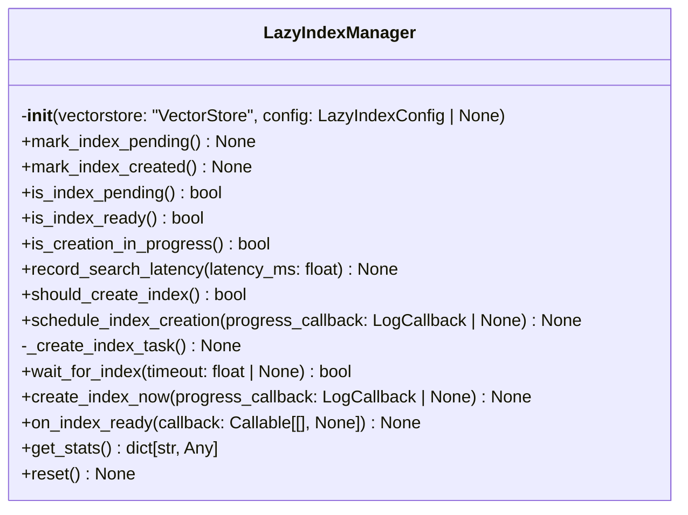

# File: `src/local_deepwiki/core/vectorstore/maintenance.py`

## File Overview

This file implements the `LazyIndexManager` class, which handles the lazy creation and management of vector indexes for a [`VectorStore`](store.md). The primary responsibility of this module is to determine when a vector index should be created based on latency statistics or explicit triggers, and to coordinate the asynchronous creation of the index in the background.

The design rationale behind this module is to optimize performance by deferring index creation until it's needed, based on query latency, while ensuring that the index is ready for use before any search operations are performed. This approach prevents unnecessary upfront costs during initialization and allows for dynamic index creation as usage patterns evolve.

## Key Concepts

### Lazy Index Creation
The core abstraction is lazy index creation, where the vector index is not created upfront but only when certain conditions are met:
- Explicit request via `mark_index_pending()`
- Latency threshold exceeded (based on [`LatencyStats`](schema.md))
- Minimum row count reached in the underlying table

This pattern helps reduce initial startup time and resource usage, particularly in environments where the data size is unknown or varies significantly.

### Asynchronous Task Management
Index creation is performed asynchronously using `asyncio.Task` to avoid blocking the main execution thread. The `schedule_index_creation()` method sets up a background task, while `wait_for_index()` allows callers to await readiness.

### Thread-Safe State Management
The module uses `threading.RLock()` to ensure thread-safe access to internal state variables such as `_index_pending`, `_index_created`, and `_creation_in_progress`. This is crucial because index creation can be triggered from multiple threads, and state updates must be atomic.

### Latency Statistics Tracking
The [`LatencyStats`](schema.md) class is used to track recent search query latencies. If the average latency exceeds a configured threshold, the system will trigger index creation. This allows the system to adaptively create indexes based on actual performance metrics rather than fixed heuristics.

## Integration

This file is part of the vector store module and integrates closely with:
- [`VectorStore`](store.md) (via `vectorstore` parameter in `__init__`)
- [`LazyIndexConfig`](../../config/models_search.md) (used for configuration of thresholds and behavior)
- [`LatencyStats`](schema.md) (used for tracking query performance)
- [`LogCallback`](../../models/foundation.md) (used for progress reporting during index creation)

The `LazyIndexManager` is used by the `LazyIndexManager` class, which is referenced in the external usage context. It is also used by the [`IndexingService`](../../services/indexing_service.md) and `TestSearch` classes, suggesting that it's a core component of the indexing pipeline and testing infrastructure.

## Design Notes

### Why `asyncio` and `threading`?
The module combines both `asyncio` and `threading` because:
- `asyncio` is used for managing background tasks and coordination (e.g., `schedule_index_creation`, `wait_for_index`)
- `threading` is used for thread-safe access to shared state, which is necessary because the index creation process may involve operations that are not inherently async-compatible (like `table.create_index()`)

### Why `run_in_executor`?
Index creation involves CPU-bound operations (`table.create_index`) that are not async-compatible. Using `loop.run_in_executor(None, ...)` ensures that these blocking operations don't block the event loop, maintaining responsiveness.

### Why Not Just Always Create Index?
Creating an index eagerly would waste resources on small datasets or during development phases. By deferring creation until needed, the system avoids unnecessary overhead while still providing a responsive experience for users.

### Why `should_create_index()`?
This method encapsulates the logic for when to trigger index creation, balancing between:
- Explicit triggers (`mark_index_pending`)
- Latency-based triggers (`latency_threshold_ms`)
- Minimum row constraints (`min_rows`)

This ensures that index creation is both timely and efficient, avoiding creation on small or uninteresting datasets.

### Why `on_index_ready()`?
This allows registration of callbacks that should run once the index is ready. This is useful for coordinating downstream operations that depend on the index being present, such as starting a search service or enabling UI elements. If the index is already ready, the callback is invoked immediately.

### Why `reset()`?
This method is primarily used for testing or re-initialization scenarios. It clears all state, including pending flags, created flags, and latency statistics, allowing for a clean slate when re-indexing or testing. It also cancels any ongoing index creation tasks.

### Why Not Use `asyncio.Event` for All State?
While [`asyncio.Event`](../../events.md) is used for signaling readiness (`_index_ready`), other state variables like `_index_pending` and `_index_created` are managed manually with locks. This separation allows for fine-grained control over state transitions and avoids race conditions in complex logic like `should_create_index()`.

## API Reference

### class `LazyIndexManager`

Manages deferred/lazy vector index creation for [VectorStore](store.md).  This class implements lazy index creation to improve initial indexing performance. Instead of creating vector indexes immediately when the table reaches the threshold, index creation is deferred to a background task or triggered on-demand when search latency exceeds a configured threshold.  Attributes: config: Configuration for lazy index behavior.

**Methods:**


<details>
<summary>View Source (lines 24-343) | <a href="https://github.com/UrbanDiver/local-deepwiki-mcp/blob/main/src/local_deepwiki/core/vectorstore/maintenance.py#L24-L343">GitHub</a></summary>

```python
class LazyIndexManager:
    # Methods: __init__, mark_index_pending, mark_index_created, is_index_pending, is_index_ready, is_creation_in_progress, record_search_latency, should_create_index, schedule_index_creation, _create_index_task, wait_for_index, create_index_now, on_index_ready, get_stats, reset
```

</details>

#### `__init__`

```python
def __init__(vectorstore: "VectorStore", config: LazyIndexConfig | None = None)
```

Initialize the lazy index manager.


| Parameter | Type | Default | Description |
|-----------|------|---------|-------------|
| `vectorstore` | `"VectorStore"` | - | The VectorStore instance to manage indexes for. |
| `config` | `LazyIndexConfig | None` | `None` | Optional configuration. If None, uses default LazyIndexConfig. |


<details>
<summary>View Source (lines 36-57) | <a href="https://github.com/UrbanDiver/local-deepwiki-mcp/blob/main/src/local_deepwiki/core/vectorstore/maintenance.py#L36-L57">GitHub</a></summary>

```python
def __init__(
        self,
        vectorstore: "VectorStore",
        config: LazyIndexConfig | None = None,
    ):
        """Initialize the lazy index manager.

        Args:
            vectorstore: The VectorStore instance to manage indexes for.
            config: Optional configuration. If None, uses default LazyIndexConfig.
        """
        self._vectorstore = vectorstore
        self.config = config if config is not None else LazyIndexConfig()
        self._index_pending = False
        self._index_task: asyncio.Task | None = None
        self._index_ready = asyncio.Event()
        self._latency_stats = LatencyStats(window_size=self.config.latency_window_size)
        self._lock = threading.RLock()
        self._creation_in_progress = False
        self._index_created = False
        # Callbacks for index ready event
        self._on_index_ready_callbacks: list[Callable[[], None]] = []
```

</details>

#### `mark_index_pending`

```python
def mark_index_pending() -> None
```

Mark that vector index creation is pending.  Called when the table reaches the minimum row threshold during initial indexing, to indicate that an index should be created in the background.


<details>
<summary>View Source (lines 59-68) | <a href="https://github.com/UrbanDiver/local-deepwiki-mcp/blob/main/src/local_deepwiki/core/vectorstore/maintenance.py#L59-L68">GitHub</a></summary>

```python
def mark_index_pending(self) -> None:
        """Mark that vector index creation is pending.

        Called when the table reaches the minimum row threshold during initial
        indexing, to indicate that an index should be created in the background.
        """
        with self._lock:
            if not self._index_created:
                self._index_pending = True
                logger.debug("Vector index creation marked as pending")
```

</details>

#### `mark_index_created`

```python
def mark_index_created() -> None
```

Mark that vector index has been created.  Called after successful index creation to update internal state.


<details>
<summary>View Source (lines 70-90) | <a href="https://github.com/UrbanDiver/local-deepwiki-mcp/blob/main/src/local_deepwiki/core/vectorstore/maintenance.py#L70-L90">GitHub</a></summary>

```python
def mark_index_created(self) -> None:
        """Mark that vector index has been created.

        Called after successful index creation to update internal state.
        """
        with self._lock:
            self._index_pending = False
            self._index_created = True
            self._creation_in_progress = False
            self._index_ready.set()
            logger.debug("Vector index marked as created")

            # Invoke callbacks
            for callback in self._on_index_ready_callbacks:
                try:
                    callback()
                except (RuntimeError, ValueError, TypeError) as e:
                    # RuntimeError: Callback runtime errors
                    # ValueError: Invalid state during callback
                    # TypeError: Callback signature mismatch
                    logger.warning("Index ready callback failed: %s", e)
```

</details>

#### `is_index_pending`

```python
def is_index_pending() -> bool
```

Check if vector index creation is pending.


<details>
<summary>View Source (lines 92-99) | <a href="https://github.com/UrbanDiver/local-deepwiki-mcp/blob/main/src/local_deepwiki/core/vectorstore/maintenance.py#L92-L99">GitHub</a></summary>

```python
def is_index_pending(self) -> bool:
        """Check if vector index creation is pending.

        Returns:
            True if index creation is pending but not yet started/completed.
        """
        with self._lock:
            return self._index_pending and not self._index_created
```

</details>

#### `is_index_ready`

```python
def is_index_ready() -> bool
```

Check if the vector index is ready.


<details>
<summary>View Source (lines 101-108) | <a href="https://github.com/UrbanDiver/local-deepwiki-mcp/blob/main/src/local_deepwiki/core/vectorstore/maintenance.py#L101-L108">GitHub</a></summary>

```python
def is_index_ready(self) -> bool:
        """Check if the vector index is ready.

        Returns:
            True if the index has been created and is ready for use.
        """
        with self._lock:
            return self._index_created
```

</details>

#### `is_creation_in_progress`

```python
def is_creation_in_progress() -> bool
```

Check if index creation is currently in progress.


<details>
<summary>View Source (lines 110-117) | <a href="https://github.com/UrbanDiver/local-deepwiki-mcp/blob/main/src/local_deepwiki/core/vectorstore/maintenance.py#L110-L117">GitHub</a></summary>

```python
def is_creation_in_progress(self) -> bool:
        """Check if index creation is currently in progress.

        Returns:
            True if background index creation is running.
        """
        with self._lock:
            return self._creation_in_progress
```

</details>

#### `record_search_latency`

```python
def record_search_latency(latency_ms: float) -> None
```

Record a search query latency measurement.


| Parameter | Type | Default | Description |
|-----------|------|---------|-------------|
| `latency_ms` | `float` | - | Search latency in milliseconds. |


<details>
<summary>View Source (lines 119-125) | <a href="https://github.com/UrbanDiver/local-deepwiki-mcp/blob/main/src/local_deepwiki/core/vectorstore/maintenance.py#L119-L125">GitHub</a></summary>

```python
def record_search_latency(self, latency_ms: float) -> None:
        """Record a search query latency measurement.

        Args:
            latency_ms: Search latency in milliseconds.
        """
        self._latency_stats.record(latency_ms)
```

</details>

#### `should_create_index`

```python
def should_create_index() -> bool
```

Check if index should be created based on latency statistics.  Returns True if: - Lazy indexing is enabled - Index hasn't been created yet - Index creation isn't already in progress - Either index is marked pending, or average latency exceeds threshold


<details>
<summary>View Source (lines 127-157) | <a href="https://github.com/UrbanDiver/local-deepwiki-mcp/blob/main/src/local_deepwiki/core/vectorstore/maintenance.py#L127-L157">GitHub</a></summary>

```python
def should_create_index(self) -> bool:
        """Check if index should be created based on latency statistics.

        Returns True if:
        - Lazy indexing is enabled
        - Index hasn't been created yet
        - Index creation isn't already in progress
        - Either index is marked pending, or average latency exceeds threshold

        Returns:
            True if index creation should be triggered.
        """
        if not self.config.enabled:
            return False

        with self._lock:
            if self._index_created or self._creation_in_progress:
                return False

            # Check if explicitly pending
            if self._index_pending:
                return True

            # Check latency threshold
            avg_latency = self._latency_stats.get_average()
            if avg_latency is not None:
                # Need enough samples to make a decision
                if self._latency_stats.get_count() >= 3:
                    return avg_latency > self.config.latency_threshold_ms

            return False
```

</details>

#### `schedule_index_creation`

```python
async def schedule_index_creation(progress_callback: LogCallback | None = None) -> None
```

Schedule index creation as a background task.  If index creation is already in progress or completed, this is a no-op.


| Parameter | Type | Default | Description |
|-----------|------|---------|-------------|
| `progress_callback` | `LogCallback | None` | `None` | Optional callback for progress updates. Called with status messages during index creation. |


<details>
<summary>View Source (lines 159-195) | <a href="https://github.com/UrbanDiver/local-deepwiki-mcp/blob/main/src/local_deepwiki/core/vectorstore/maintenance.py#L159-L195">GitHub</a></summary>

```python
async def schedule_index_creation(
        self,
        progress_callback: LogCallback | None = None,
    ) -> None:
        """Schedule index creation as a background task.

        If index creation is already in progress or completed, this is a no-op.

        Args:
            progress_callback: Optional callback for progress updates.
                Called with status messages during index creation.
        """
        with self._lock:
            if self._index_created or self._creation_in_progress:
                logger.debug("Index already created or in progress, skipping schedule")
                return
            if self._index_task is not None and not self._index_task.done():
                logger.debug("Index creation task already scheduled")
                return

            self._creation_in_progress = True

        logger.info("Scheduling background vector index creation")

        async def _create_index_task() -> None:
            try:
                await self.create_index_now(progress_callback=progress_callback)
            except (RuntimeError, ValueError, OSError) as e:
                # RuntimeError: LanceDB table/index errors
                # ValueError: Invalid index parameters
                # OSError: File system or resource errors
                logger.error("Background index creation failed: %s", e)
                with self._lock:
                    self._creation_in_progress = False
                raise

        self._index_task = asyncio.create_task(_create_index_task())
```

</details>

#### `wait_for_index`

```python
async def wait_for_index(timeout: float | None = None) -> bool
```

Wait for the index to be ready.


| Parameter | Type | Default | Description |
|-----------|------|---------|-------------|
| `timeout` | `float | None` | `None` | Maximum time to wait in seconds. None means wait indefinitely. |


<details>
<summary>View Source (lines 197-213) | <a href="https://github.com/UrbanDiver/local-deepwiki-mcp/blob/main/src/local_deepwiki/core/vectorstore/maintenance.py#L197-L213">GitHub</a></summary>

```python
async def wait_for_index(self, timeout: float | None = None) -> bool:
        """Wait for the index to be ready.

        Args:
            timeout: Maximum time to wait in seconds. None means wait indefinitely.

        Returns:
            True if index is ready, False if timeout occurred.
        """
        if self.is_index_ready():
            return True

        try:
            await asyncio.wait_for(self._index_ready.wait(), timeout=timeout)
            return True
        except asyncio.TimeoutError:
            return False
```

</details>

#### `create_index_now`

```python
async def create_index_now(progress_callback: LogCallback | None = None) -> None
```

Force immediate index creation.  Creates the vector index synchronously (within an async context). This is useful when you need the index to be ready before proceeding.


| Parameter | Type | Default | Description |
|-----------|------|---------|-------------|
| `progress_callback` | `LogCallback | None` | `None` | Optional callback for progress updates. |


<details>
<summary>View Source (lines 215-285) | <a href="https://github.com/UrbanDiver/local-deepwiki-mcp/blob/main/src/local_deepwiki/core/vectorstore/maintenance.py#L215-L285">GitHub</a></summary>

```python
async def create_index_now(
        self,
        progress_callback: LogCallback | None = None,
    ) -> None:
        """Force immediate index creation.

        Creates the vector index synchronously (within an async context).
        This is useful when you need the index to be ready before proceeding.

        Args:
            progress_callback: Optional callback for progress updates.

        Raises:
            RuntimeError: If table doesn't exist or has insufficient rows.
        """
        table = self._vectorstore._get_table()
        if table is None:
            raise RuntimeError("Cannot create index: table does not exist")

        with self._lock:
            if self._index_created:
                logger.debug("Index already created, skipping")
                return
            self._creation_in_progress = True

        try:
            num_rows = table.count_rows()
            if num_rows < self.config.min_rows:
                logger.debug(
                    "Skipping index creation: %d rows < %d threshold",
                    num_rows,
                    self.config.min_rows,
                )
                return

            if progress_callback:
                progress_callback(f"Creating vector index for {num_rows} rows...")

            logger.info("Creating vector index for %s rows", num_rows)

            # Calculate optimal number of partitions
            num_partitions = min(max(int(math.sqrt(num_rows)), 16), 256)

            # Run the actual index creation
            # This is CPU-bound, so we run it in an executor
            loop = asyncio.get_running_loop()
            await loop.run_in_executor(
                None,
                lambda: table.create_index(
                    metric="L2",
                    num_partitions=num_partitions,
                    num_sub_vectors=16,
                ),
            )

            if progress_callback:
                progress_callback("Vector index created successfully")

            logger.info(
                "Created vector index with %d partitions for %d vectors",
                num_partitions,
                num_rows,
            )

            self.mark_index_created()

        except (ValueError, RuntimeError, OSError) as e:
            logger.warning("Could not create vector index: %s", e)
            with self._lock:
                self._creation_in_progress = False
            raise
```

</details>

#### `on_index_ready`

```python
def on_index_ready(callback: Callable[[], None]) -> None
```

Register a callback to be invoked when the index is ready.  If the index is already ready, the callback is invoked immediately.


| Parameter | Type | Default | Description |
|-----------|------|---------|-------------|
| `callback` | `Callable[[], None]` | - | Function to call when index is ready. |


<details>
<summary>View Source (lines 287-306) | <a href="https://github.com/UrbanDiver/local-deepwiki-mcp/blob/main/src/local_deepwiki/core/vectorstore/maintenance.py#L287-L306">GitHub</a></summary>

```python
def on_index_ready(self, callback: Callable[[], None]) -> None:
        """Register a callback to be invoked when the index is ready.

        If the index is already ready, the callback is invoked immediately.

        Args:
            callback: Function to call when index is ready.
        """
        with self._lock:
            if self._index_created:
                # Already ready, invoke immediately
                try:
                    callback()
                except (RuntimeError, ValueError, TypeError) as e:
                    # RuntimeError: Callback runtime errors
                    # ValueError: Invalid state during callback
                    # TypeError: Callback signature mismatch
                    logger.warning("Index ready callback failed: %s", e)
            else:
                self._on_index_ready_callbacks.append(callback)
```

</details>

#### `get_stats`

```python
def get_stats() -> dict[str, Any]
```

Get statistics about the lazy index manager.


<details>
<summary>View Source (lines 308-326) | <a href="https://github.com/UrbanDiver/local-deepwiki-mcp/blob/main/src/local_deepwiki/core/vectorstore/maintenance.py#L308-L326">GitHub</a></summary>

```python
def get_stats(self) -> dict[str, Any]:
        """Get statistics about the lazy index manager.

        Returns:
            Dictionary with manager statistics.
        """
        with self._lock:
            avg_latency = self._latency_stats.get_average()
            return {
                "enabled": self.config.enabled,
                "index_pending": self._index_pending,
                "index_created": self._index_created,
                "creation_in_progress": self._creation_in_progress,
                "latency_threshold_ms": self.config.latency_threshold_ms,
                "min_rows": self.config.min_rows,
                "average_latency_ms": avg_latency,
                "latency_samples": self._latency_stats.get_count(),
                "should_create_index": self.should_create_index(),
            }
```

</details>

#### `reset`

```python
def reset() -> None
```

Reset the manager state.  Clears all state including pending flag, created flag, and latency stats. Useful for testing or when re-indexing from scratch.


<details>
<summary>View Source (lines 328-343) | <a href="https://github.com/UrbanDiver/local-deepwiki-mcp/blob/main/src/local_deepwiki/core/vectorstore/maintenance.py#L328-L343">GitHub</a></summary>

```python
def reset(self) -> None:
        """Reset the manager state.

        Clears all state including pending flag, created flag, and latency stats.
        Useful for testing or when re-indexing from scratch.
        """
        with self._lock:
            self._index_pending = False
            self._index_created = False
            self._creation_in_progress = False
            self._index_ready.clear()
            self._latency_stats.clear()
            self._on_index_ready_callbacks.clear()
            if self._index_task is not None and not self._index_task.done():
                self._index_task.cancel()
            self._index_task = None
```

</details>

## Class Diagram



## Call Graph

```mermaid
flowchart TD
    N0[Event]
    N1[LatencyStats]
    N2[LazyIndexConfig]
    N3[LazyIndexManager.__init__]
    N4[LazyIndexManager._create_in...]
    N5[LazyIndexManager.create_ind...]
    N6[LazyIndexManager.get_stats]
    N7[LazyIndexManager.mark_index...]
    N8[LazyIndexManager.record_sea...]
    N9[LazyIndexManager.reset]
    N10[LazyIndexManager.schedule_i...]
    N11[LazyIndexManager.should_cre...]
    N12[LazyIndexManager.wait_for_i...]
    N13[RLock]
    N14[RuntimeError]
    N15[_create_index_task]
    N16[_get_table]
    N17[callback]
    N18[count_rows]
    N19[create_index_now]
    N20[create_task]
    N21[done]
    N22[get_average]
    N23[get_count]
    N24[is_index_ready]
    N25[progress_callback]
    N26[record]
    N27[sqrt]
    N28[wait]
    N29[wait_for]
    N3 --> N2
    N3 --> N0
    N3 --> N1
    N3 --> N13
    N7 --> N17
    N8 --> N26
    N11 --> N22
    N11 --> N23
    N10 --> N21
    N10 --> N19
    N10 --> N20
    N10 --> N15
    N4 --> N19
    N12 --> N24
    N12 --> N29
    N12 --> N28
    N5 --> N16
    N5 --> N14
    N5 --> N18
    N5 --> N25
    N5 --> N27
    N6 --> N22
    N6 --> N23
    N9 --> N21
    classDef func fill:#e1f5fe
    class N0,N1,N2,N13,N14,N15,N16,N17,N18,N19,N20,N21,N22,N23,N24,N25,N26,N27,N28,N29 func
    classDef method fill:#fff3e0
    class N3,N4,N5,N6,N7,N8,N9,N10,N11,N12 method
```



## Used By

Functions and methods in this file and their callers:

- **[`Event`](../../events.md)**: called by `LazyIndexManager.__init__`
- **[`LatencyStats`](schema.md)**: called by `LazyIndexManager.__init__`
- **[`LazyIndexConfig`](../../config/models_search.md)**: called by `LazyIndexManager.__init__`
- **`RLock`**: called by `LazyIndexManager.__init__`
- **`RuntimeError`**: called by `LazyIndexManager.create_index_now`
- **`_create_index_task`**: called by `LazyIndexManager.schedule_index_creation`
- **`_get_table`**: called by `LazyIndexManager.create_index_now`
- **`callback`**: called by `LazyIndexManager.mark_index_created`, `LazyIndexManager.on_index_ready`
- **`cancel`**: called by `LazyIndexManager.reset`
- **`count_rows`**: called by `LazyIndexManager.create_index_now`
- **`create_index`**: called by `LazyIndexManager.create_index_now`
- **`create_index_now`**: called by `LazyIndexManager._create_index_task`, `LazyIndexManager.schedule_index_creation`
- **`create_task`**: called by `LazyIndexManager.schedule_index_creation`
- **`done`**: called by `LazyIndexManager.reset`, `LazyIndexManager.schedule_index_creation`
- **`get_average`**: called by `LazyIndexManager.get_stats`, `LazyIndexManager.should_create_index`
- **`get_count`**: called by `LazyIndexManager.get_stats`, `LazyIndexManager.should_create_index`
- **`get_running_loop`**: called by `LazyIndexManager.create_index_now`
- **`is_index_ready`**: called by `LazyIndexManager.wait_for_index`
- **`mark_index_created`**: called by `LazyIndexManager.create_index_now`
- **[`progress_callback`](../../handlers/research.md)**: called by `LazyIndexManager.create_index_now`
- **`record`**: called by `LazyIndexManager.record_search_latency`
- **`run_in_executor`**: called by `LazyIndexManager.create_index_now`
- **`should_create_index`**: called by `LazyIndexManager.get_stats`
- **`sqrt`**: called by `LazyIndexManager.create_index_now`
- **`wait`**: called by `LazyIndexManager.wait_for_index`
- **`wait_for`**: called by `LazyIndexManager.wait_for_index`

## Last Modified

| Entity | Type | Author | Date | Commit |
|--------|------|--------|------|--------|
| `LazyIndexManager` | class | Brian Breidenbach | 1 week ago | `fd8bb32` fix: code quality — consoli... |
| `create_index_now` | method | Brian Breidenbach | 1 week ago | `fd8bb32` fix: code quality — consoli... |
| `schedule_index_creation` | method | Brian Breidenbach | Feb 23, 2026 | `ec06796` chore: harden .gitignore, a... |
| `_create_index_task` | method | Brian Breidenbach | Feb 23, 2026 | `ec06796` chore: harden .gitignore, a... |
| `mark_index_created` | method | Brian Breidenbach | Feb 11, 2026 | `ba96da1` fix: publication plan P0-P2... |
| `on_index_ready` | method | Brian Breidenbach | Feb 11, 2026 | `ba96da1` fix: publication plan P0-P2... |
| `__init__` | method | Brian Breidenbach | Feb 09, 2026 | `89de2db` refactor: split vectorstore... |
| `mark_index_pending` | method | Brian Breidenbach | Feb 09, 2026 | `89de2db` refactor: split vectorstore... |
| `is_index_pending` | method | Brian Breidenbach | Feb 09, 2026 | `89de2db` refactor: split vectorstore... |
| `is_index_ready` | method | Brian Breidenbach | Feb 09, 2026 | `89de2db` refactor: split vectorstore... |
| `is_creation_in_progress` | method | Brian Breidenbach | Feb 09, 2026 | `89de2db` refactor: split vectorstore... |
| `record_search_latency` | method | Brian Breidenbach | Feb 09, 2026 | `89de2db` refactor: split vectorstore... |
| `should_create_index` | method | Brian Breidenbach | Feb 09, 2026 | `89de2db` refactor: split vectorstore... |
| `wait_for_index` | method | Brian Breidenbach | Feb 09, 2026 | `89de2db` refactor: split vectorstore... |
| `get_stats` | method | Brian Breidenbach | Feb 09, 2026 | `89de2db` refactor: split vectorstore... |
| `reset` | method | Brian Breidenbach | Feb 09, 2026 | `89de2db` refactor: split vectorstore... |

## Additional Source Code

Source code for functions and methods not listed in the API Reference above.

#### `_create_index_task`

<details>
<summary>View Source (lines 183-193) | <a href="https://github.com/UrbanDiver/local-deepwiki-mcp/blob/main/src/local_deepwiki/core/vectorstore/maintenance.py#L183-L193">GitHub</a></summary>

```python
async def _create_index_task() -> None:
            try:
                await self.create_index_now(progress_callback=progress_callback)
            except (RuntimeError, ValueError, OSError) as e:
                # RuntimeError: LanceDB table/index errors
                # ValueError: Invalid index parameters
                # OSError: File system or resource errors
                logger.error("Background index creation failed: %s", e)
                with self._lock:
                    self._creation_in_progress = False
                raise
```

</details>

## Relevant Source Files

- `src/local_deepwiki/core/vectorstore/maintenance.py:24-343`
