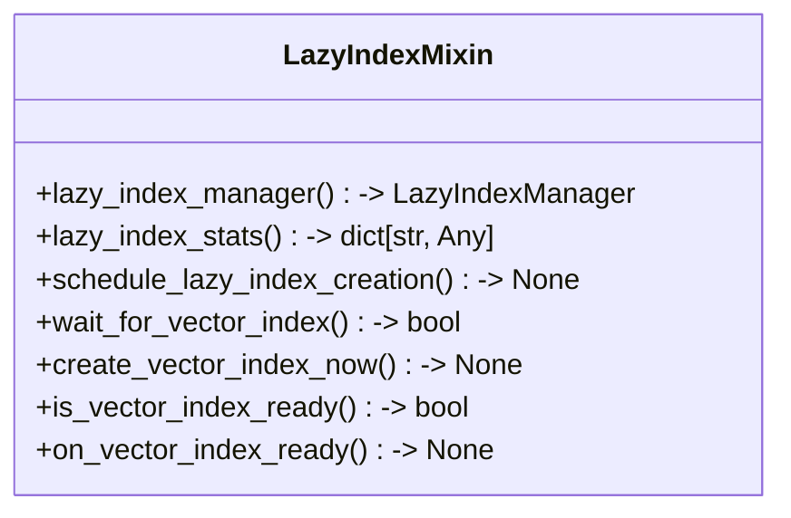
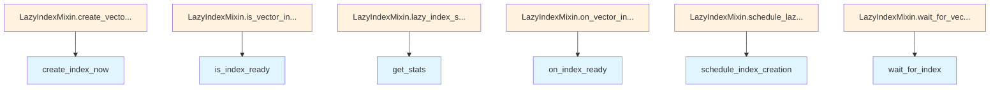

# File: `src/local_deepwiki/core/vectorstore/mixins/lazy_index.py`

## File Overview

This file defines the `LazyIndexMixin` class, which provides methods for managing vector index creation lazily. The mixin is designed to integrate into a [`VectorStore`](../store.md) class and enables lazy initialization of vector indices, deferring index creation until it's actually needed or until certain conditions are met. This approach helps optimize resource usage and improves startup times by avoiding immediate index creation.

The mixin delegates the actual index management logic to a [`LazyIndexManager`](../maintenance.md) instance, which encapsulates the logic for tracking index state, scheduling creation, and handling readiness callbacks.

## Key Concepts

### Lazy Index Management

The core abstraction in this file is the **lazy index lifecycle management**, which allows the vector index to be created asynchronously in the background or on-demand. This pattern is chosen to:

- Avoid blocking startup or initialization of the vector store.
- Defer expensive index creation until it's actually required.
- Support dynamic decisions about when to create the index based on usage statistics or thresholds.

### Asynchronous Index Creation

The mixin exposes methods to schedule index creation (`schedule_lazy_index_creation`) and force immediate creation (`create_vector_index_now`). This dual approach allows for both background and immediate index creation, depending on the use case.

### Index Readiness Tracking

The mixin supports checking whether the index is ready (`is_vector_index_ready`) and waiting for it to become ready (`wait_for_vector_index`). These methods are essential for ensuring that downstream operations that depend on the index do not fail due to its absence.

### Callback Integration

The `on_vector_index_ready` method allows registering callbacks that are invoked when the index becomes ready. This is a common pattern for asynchronous systems where components need to react to state changes without polling.

## Integration

This file integrates with the following components:

- **[`VectorStore`](../store.md)**: The mixin is intended to be used as part of a [`VectorStore`](../store.md) class. It assumes that the [`VectorStore`](../store.md) instance has a `_lazy_index_manager` attribute set during initialization.
- **[`LazyIndexManager`](../maintenance.md)**: The mixin delegates all index management logic to an instance of [`LazyIndexManager`](../maintenance.md), which is imported from `..maintenance`.
- **[`LogCallback`](../../../models/foundation.md)**: Progress updates during index creation can be provided via a [`LogCallback`](../../../models/foundation.md) function, which is used in several methods.
- **[`get_logger`](../../../logging.md)**: Logging is used to track index creation and readiness events, which is critical for debugging and observability.

The mixin is part of the `local_deepwiki.core.vectorstore.mixins` module, and it is likely used by other vector store implementations within the project to provide consistent lazy index behavior.

## Design Notes

### Type Checking Stub

The `TYPE_CHECKING` block provides a stub for `_lazy_index_manager`, which helps IDEs and type checkers understand the expected attribute on the class that uses this mixin. This is a common pattern in mixins to avoid runtime errors while maintaining type safety.

### Asynchronous Operations

All index-related methods are `async` to support non-blocking operations, which is crucial in a system that may be handling concurrent requests or background tasks.

### Delegation to `LazyIndexManager`

The mixin does not implement index creation logic directly but delegates all operations to a [`LazyIndexManager`](../maintenance.md). This design choice promotes separation of concerns, encapsulation of complex logic, and reusability.

### Error Handling

The `create_vector_index_now` method raises a `RuntimeError` if index creation fails due to missing tables or insufficient rows. This is a deliberate design choice to fail fast and inform users of preconditions that must be met.

### Readiness Callbacks

The `on_vector_index_ready` method allows registering callbacks that are invoked immediately if the index is already ready, or later when it becomes ready. This pattern avoids polling and ensures efficient state transitions.

### Progress Callbacks

Methods like `schedule_lazy_index_creation` and `create_vector_index_now` accept optional [`progress_callback`](../../../handlers/research.md) arguments. This allows for integration with logging or UI updates during long-running index creation tasks.

## API Reference

### class `LazyIndexMixin`

Mixin providing lazy vector index management methods.

**Methods:**


<details>
<summary>View Source (lines 19-115) | <a href="https://github.com/UrbanDiver/local-deepwiki-mcp/blob/main/src/local_deepwiki/core/vectorstore/mixins/lazy_index.py#L19-L115">GitHub</a></summary>

```python
class LazyIndexMixin:
    """Mixin providing lazy vector index management methods."""

    # -- Type stubs so IDEs know about attributes set by VectorStore.__init__ --
    if TYPE_CHECKING:
        _lazy_index_manager: LazyIndexManager

    @property
    def lazy_index_manager(self) -> LazyIndexManager:
        """Get the lazy index manager.

        Returns:
            The LazyIndexManager instance for this vector store.
        """
        return self._lazy_index_manager

    @property
    def lazy_index_stats(self) -> dict[str, Any]:
        """Get statistics about lazy index creation.

        Returns:
            Dictionary with lazy index statistics including:
            - enabled: Whether lazy indexing is enabled
            - index_pending: Whether index creation is pending
            - index_created: Whether index has been created
            - creation_in_progress: Whether creation is currently running
            - latency_threshold_ms: Latency threshold for triggering creation
            - min_rows: Minimum rows for index creation
            - average_latency_ms: Average search latency
            - latency_samples: Number of latency samples
            - should_create_index: Whether index should be created now
        """
        return self._lazy_index_manager.get_stats()

    async def schedule_lazy_index_creation(
        self,
        progress_callback: LogCallback | None = None,
    ) -> None:
        """Schedule vector index creation as a background task.

        This is useful for triggering index creation after initial indexing
        completes. If index creation is already in progress or completed,
        this is a no-op.

        Args:
            progress_callback: Optional callback for progress updates.
        """
        await self._lazy_index_manager.schedule_index_creation(progress_callback)

    async def wait_for_vector_index(self, timeout: float | None = None) -> bool:
        """Wait for the vector index to be ready.

        Useful when you need to ensure the index is available before
        performing searches that require it.

        Args:
            timeout: Maximum time to wait in seconds. None means wait indefinitely.

        Returns:
            True if index is ready, False if timeout occurred.
        """
        return await self._lazy_index_manager.wait_for_index(timeout)

    async def create_vector_index_now(
        self,
        progress_callback: LogCallback | None = None,
    ) -> None:
        """Force immediate vector index creation.

        Creates the vector index synchronously. This is useful when you
        need the index to be ready before proceeding with searches.

        Args:
            progress_callback: Optional callback for progress updates.

        Raises:
            RuntimeError: If table doesn't exist or has insufficient rows.
        """
        await self._lazy_index_manager.create_index_now(progress_callback)

    def is_vector_index_ready(self) -> bool:
        """Check if the vector index is ready.

        Returns:
            True if the index has been created and is ready for use.
        """
        return self._lazy_index_manager.is_index_ready()

    def on_vector_index_ready(self, callback: Callable[[], None]) -> None:
        """Register a callback to be invoked when the vector index is ready.

        If the index is already ready, the callback is invoked immediately.

        Args:
            callback: Function to call when index is ready.
        """
        self._lazy_index_manager.on_index_ready(callback)
```

</details>

#### `lazy_index_manager`

```python
def lazy_index_manager() -> LazyIndexManager
```

Get the lazy index manager.


<details>
<summary>View Source (lines 19-115) | <a href="https://github.com/UrbanDiver/local-deepwiki-mcp/blob/main/src/local_deepwiki/core/vectorstore/mixins/lazy_index.py#L19-L115">GitHub</a></summary>

```python
class LazyIndexMixin:
    """Mixin providing lazy vector index management methods."""

    # -- Type stubs so IDEs know about attributes set by VectorStore.__init__ --
    if TYPE_CHECKING:
        _lazy_index_manager: LazyIndexManager

    @property
    def lazy_index_manager(self) -> LazyIndexManager:
        """Get the lazy index manager.

        Returns:
            The LazyIndexManager instance for this vector store.
        """
        return self._lazy_index_manager

    @property
    def lazy_index_stats(self) -> dict[str, Any]:
        """Get statistics about lazy index creation.

        Returns:
            Dictionary with lazy index statistics including:
            - enabled: Whether lazy indexing is enabled
            - index_pending: Whether index creation is pending
            - index_created: Whether index has been created
            - creation_in_progress: Whether creation is currently running
            - latency_threshold_ms: Latency threshold for triggering creation
            - min_rows: Minimum rows for index creation
            - average_latency_ms: Average search latency
            - latency_samples: Number of latency samples
            - should_create_index: Whether index should be created now
        """
        return self._lazy_index_manager.get_stats()

    async def schedule_lazy_index_creation(
        self,
        progress_callback: LogCallback | None = None,
    ) -> None:
        """Schedule vector index creation as a background task.

        This is useful for triggering index creation after initial indexing
        completes. If index creation is already in progress or completed,
        this is a no-op.

        Args:
            progress_callback: Optional callback for progress updates.
        """
        await self._lazy_index_manager.schedule_index_creation(progress_callback)

    async def wait_for_vector_index(self, timeout: float | None = None) -> bool:
        """Wait for the vector index to be ready.

        Useful when you need to ensure the index is available before
        performing searches that require it.

        Args:
            timeout: Maximum time to wait in seconds. None means wait indefinitely.

        Returns:
            True if index is ready, False if timeout occurred.
        """
        return await self._lazy_index_manager.wait_for_index(timeout)

    async def create_vector_index_now(
        self,
        progress_callback: LogCallback | None = None,
    ) -> None:
        """Force immediate vector index creation.

        Creates the vector index synchronously. This is useful when you
        need the index to be ready before proceeding with searches.

        Args:
            progress_callback: Optional callback for progress updates.

        Raises:
            RuntimeError: If table doesn't exist or has insufficient rows.
        """
        await self._lazy_index_manager.create_index_now(progress_callback)

    def is_vector_index_ready(self) -> bool:
        """Check if the vector index is ready.

        Returns:
            True if the index has been created and is ready for use.
        """
        return self._lazy_index_manager.is_index_ready()

    def on_vector_index_ready(self, callback: Callable[[], None]) -> None:
        """Register a callback to be invoked when the vector index is ready.

        If the index is already ready, the callback is invoked immediately.

        Args:
            callback: Function to call when index is ready.
        """
        self._lazy_index_manager.on_index_ready(callback)
```

</details>

#### `lazy_index_stats`

```python
def lazy_index_stats() -> dict[str, Any]
```

Get statistics about lazy index creation.


<details>
<summary>View Source (lines 19-115) | <a href="https://github.com/UrbanDiver/local-deepwiki-mcp/blob/main/src/local_deepwiki/core/vectorstore/mixins/lazy_index.py#L19-L115">GitHub</a></summary>

```python
class LazyIndexMixin:
    """Mixin providing lazy vector index management methods."""

    # -- Type stubs so IDEs know about attributes set by VectorStore.__init__ --
    if TYPE_CHECKING:
        _lazy_index_manager: LazyIndexManager

    @property
    def lazy_index_manager(self) -> LazyIndexManager:
        """Get the lazy index manager.

        Returns:
            The LazyIndexManager instance for this vector store.
        """
        return self._lazy_index_manager

    @property
    def lazy_index_stats(self) -> dict[str, Any]:
        """Get statistics about lazy index creation.

        Returns:
            Dictionary with lazy index statistics including:
            - enabled: Whether lazy indexing is enabled
            - index_pending: Whether index creation is pending
            - index_created: Whether index has been created
            - creation_in_progress: Whether creation is currently running
            - latency_threshold_ms: Latency threshold for triggering creation
            - min_rows: Minimum rows for index creation
            - average_latency_ms: Average search latency
            - latency_samples: Number of latency samples
            - should_create_index: Whether index should be created now
        """
        return self._lazy_index_manager.get_stats()

    async def schedule_lazy_index_creation(
        self,
        progress_callback: LogCallback | None = None,
    ) -> None:
        """Schedule vector index creation as a background task.

        This is useful for triggering index creation after initial indexing
        completes. If index creation is already in progress or completed,
        this is a no-op.

        Args:
            progress_callback: Optional callback for progress updates.
        """
        await self._lazy_index_manager.schedule_index_creation(progress_callback)

    async def wait_for_vector_index(self, timeout: float | None = None) -> bool:
        """Wait for the vector index to be ready.

        Useful when you need to ensure the index is available before
        performing searches that require it.

        Args:
            timeout: Maximum time to wait in seconds. None means wait indefinitely.

        Returns:
            True if index is ready, False if timeout occurred.
        """
        return await self._lazy_index_manager.wait_for_index(timeout)

    async def create_vector_index_now(
        self,
        progress_callback: LogCallback | None = None,
    ) -> None:
        """Force immediate vector index creation.

        Creates the vector index synchronously. This is useful when you
        need the index to be ready before proceeding with searches.

        Args:
            progress_callback: Optional callback for progress updates.

        Raises:
            RuntimeError: If table doesn't exist or has insufficient rows.
        """
        await self._lazy_index_manager.create_index_now(progress_callback)

    def is_vector_index_ready(self) -> bool:
        """Check if the vector index is ready.

        Returns:
            True if the index has been created and is ready for use.
        """
        return self._lazy_index_manager.is_index_ready()

    def on_vector_index_ready(self, callback: Callable[[], None]) -> None:
        """Register a callback to be invoked when the vector index is ready.

        If the index is already ready, the callback is invoked immediately.

        Args:
            callback: Function to call when index is ready.
        """
        self._lazy_index_manager.on_index_ready(callback)
```

</details>

#### `schedule_lazy_index_creation`

```python
async def schedule_lazy_index_creation(progress_callback: LogCallback | None = None) -> None
```

Schedule vector index creation as a background task.  This is useful for triggering index creation after initial indexing completes. If index creation is already in progress or completed, this is a no-op.


| Parameter | Type | Default | Description |
|-----------|------|---------|-------------|
| `progress_callback` | `LogCallback | None` | `None` | Optional callback for progress updates. |


<details>
<summary>View Source (lines 19-115) | <a href="https://github.com/UrbanDiver/local-deepwiki-mcp/blob/main/src/local_deepwiki/core/vectorstore/mixins/lazy_index.py#L19-L115">GitHub</a></summary>

```python
class LazyIndexMixin:
    """Mixin providing lazy vector index management methods."""

    # -- Type stubs so IDEs know about attributes set by VectorStore.__init__ --
    if TYPE_CHECKING:
        _lazy_index_manager: LazyIndexManager

    @property
    def lazy_index_manager(self) -> LazyIndexManager:
        """Get the lazy index manager.

        Returns:
            The LazyIndexManager instance for this vector store.
        """
        return self._lazy_index_manager

    @property
    def lazy_index_stats(self) -> dict[str, Any]:
        """Get statistics about lazy index creation.

        Returns:
            Dictionary with lazy index statistics including:
            - enabled: Whether lazy indexing is enabled
            - index_pending: Whether index creation is pending
            - index_created: Whether index has been created
            - creation_in_progress: Whether creation is currently running
            - latency_threshold_ms: Latency threshold for triggering creation
            - min_rows: Minimum rows for index creation
            - average_latency_ms: Average search latency
            - latency_samples: Number of latency samples
            - should_create_index: Whether index should be created now
        """
        return self._lazy_index_manager.get_stats()

    async def schedule_lazy_index_creation(
        self,
        progress_callback: LogCallback | None = None,
    ) -> None:
        """Schedule vector index creation as a background task.

        This is useful for triggering index creation after initial indexing
        completes. If index creation is already in progress or completed,
        this is a no-op.

        Args:
            progress_callback: Optional callback for progress updates.
        """
        await self._lazy_index_manager.schedule_index_creation(progress_callback)

    async def wait_for_vector_index(self, timeout: float | None = None) -> bool:
        """Wait for the vector index to be ready.

        Useful when you need to ensure the index is available before
        performing searches that require it.

        Args:
            timeout: Maximum time to wait in seconds. None means wait indefinitely.

        Returns:
            True if index is ready, False if timeout occurred.
        """
        return await self._lazy_index_manager.wait_for_index(timeout)

    async def create_vector_index_now(
        self,
        progress_callback: LogCallback | None = None,
    ) -> None:
        """Force immediate vector index creation.

        Creates the vector index synchronously. This is useful when you
        need the index to be ready before proceeding with searches.

        Args:
            progress_callback: Optional callback for progress updates.

        Raises:
            RuntimeError: If table doesn't exist or has insufficient rows.
        """
        await self._lazy_index_manager.create_index_now(progress_callback)

    def is_vector_index_ready(self) -> bool:
        """Check if the vector index is ready.

        Returns:
            True if the index has been created and is ready for use.
        """
        return self._lazy_index_manager.is_index_ready()

    def on_vector_index_ready(self, callback: Callable[[], None]) -> None:
        """Register a callback to be invoked when the vector index is ready.

        If the index is already ready, the callback is invoked immediately.

        Args:
            callback: Function to call when index is ready.
        """
        self._lazy_index_manager.on_index_ready(callback)
```

</details>

#### `wait_for_vector_index`

```python
async def wait_for_vector_index(timeout: float | None = None) -> bool
```

Wait for the vector index to be ready.  Useful when you need to ensure the index is available before performing searches that require it.


| Parameter | Type | Default | Description |
|-----------|------|---------|-------------|
| `timeout` | `float | None` | `None` | Maximum time to wait in seconds. None means wait indefinitely. |


<details>
<summary>View Source (lines 19-115) | <a href="https://github.com/UrbanDiver/local-deepwiki-mcp/blob/main/src/local_deepwiki/core/vectorstore/mixins/lazy_index.py#L19-L115">GitHub</a></summary>

```python
class LazyIndexMixin:
    """Mixin providing lazy vector index management methods."""

    # -- Type stubs so IDEs know about attributes set by VectorStore.__init__ --
    if TYPE_CHECKING:
        _lazy_index_manager: LazyIndexManager

    @property
    def lazy_index_manager(self) -> LazyIndexManager:
        """Get the lazy index manager.

        Returns:
            The LazyIndexManager instance for this vector store.
        """
        return self._lazy_index_manager

    @property
    def lazy_index_stats(self) -> dict[str, Any]:
        """Get statistics about lazy index creation.

        Returns:
            Dictionary with lazy index statistics including:
            - enabled: Whether lazy indexing is enabled
            - index_pending: Whether index creation is pending
            - index_created: Whether index has been created
            - creation_in_progress: Whether creation is currently running
            - latency_threshold_ms: Latency threshold for triggering creation
            - min_rows: Minimum rows for index creation
            - average_latency_ms: Average search latency
            - latency_samples: Number of latency samples
            - should_create_index: Whether index should be created now
        """
        return self._lazy_index_manager.get_stats()

    async def schedule_lazy_index_creation(
        self,
        progress_callback: LogCallback | None = None,
    ) -> None:
        """Schedule vector index creation as a background task.

        This is useful for triggering index creation after initial indexing
        completes. If index creation is already in progress or completed,
        this is a no-op.

        Args:
            progress_callback: Optional callback for progress updates.
        """
        await self._lazy_index_manager.schedule_index_creation(progress_callback)

    async def wait_for_vector_index(self, timeout: float | None = None) -> bool:
        """Wait for the vector index to be ready.

        Useful when you need to ensure the index is available before
        performing searches that require it.

        Args:
            timeout: Maximum time to wait in seconds. None means wait indefinitely.

        Returns:
            True if index is ready, False if timeout occurred.
        """
        return await self._lazy_index_manager.wait_for_index(timeout)

    async def create_vector_index_now(
        self,
        progress_callback: LogCallback | None = None,
    ) -> None:
        """Force immediate vector index creation.

        Creates the vector index synchronously. This is useful when you
        need the index to be ready before proceeding with searches.

        Args:
            progress_callback: Optional callback for progress updates.

        Raises:
            RuntimeError: If table doesn't exist or has insufficient rows.
        """
        await self._lazy_index_manager.create_index_now(progress_callback)

    def is_vector_index_ready(self) -> bool:
        """Check if the vector index is ready.

        Returns:
            True if the index has been created and is ready for use.
        """
        return self._lazy_index_manager.is_index_ready()

    def on_vector_index_ready(self, callback: Callable[[], None]) -> None:
        """Register a callback to be invoked when the vector index is ready.

        If the index is already ready, the callback is invoked immediately.

        Args:
            callback: Function to call when index is ready.
        """
        self._lazy_index_manager.on_index_ready(callback)
```

</details>

#### `create_vector_index_now`

```python
async def create_vector_index_now(progress_callback: LogCallback | None = None) -> None
```

Force immediate vector index creation.  Creates the vector index synchronously. This is useful when you need the index to be ready before proceeding with searches.


| Parameter | Type | Default | Description |
|-----------|------|---------|-------------|
| `progress_callback` | `LogCallback | None` | `None` | Optional callback for progress updates. |


<details>
<summary>View Source (lines 19-115) | <a href="https://github.com/UrbanDiver/local-deepwiki-mcp/blob/main/src/local_deepwiki/core/vectorstore/mixins/lazy_index.py#L19-L115">GitHub</a></summary>

```python
class LazyIndexMixin:
    """Mixin providing lazy vector index management methods."""

    # -- Type stubs so IDEs know about attributes set by VectorStore.__init__ --
    if TYPE_CHECKING:
        _lazy_index_manager: LazyIndexManager

    @property
    def lazy_index_manager(self) -> LazyIndexManager:
        """Get the lazy index manager.

        Returns:
            The LazyIndexManager instance for this vector store.
        """
        return self._lazy_index_manager

    @property
    def lazy_index_stats(self) -> dict[str, Any]:
        """Get statistics about lazy index creation.

        Returns:
            Dictionary with lazy index statistics including:
            - enabled: Whether lazy indexing is enabled
            - index_pending: Whether index creation is pending
            - index_created: Whether index has been created
            - creation_in_progress: Whether creation is currently running
            - latency_threshold_ms: Latency threshold for triggering creation
            - min_rows: Minimum rows for index creation
            - average_latency_ms: Average search latency
            - latency_samples: Number of latency samples
            - should_create_index: Whether index should be created now
        """
        return self._lazy_index_manager.get_stats()

    async def schedule_lazy_index_creation(
        self,
        progress_callback: LogCallback | None = None,
    ) -> None:
        """Schedule vector index creation as a background task.

        This is useful for triggering index creation after initial indexing
        completes. If index creation is already in progress or completed,
        this is a no-op.

        Args:
            progress_callback: Optional callback for progress updates.
        """
        await self._lazy_index_manager.schedule_index_creation(progress_callback)

    async def wait_for_vector_index(self, timeout: float | None = None) -> bool:
        """Wait for the vector index to be ready.

        Useful when you need to ensure the index is available before
        performing searches that require it.

        Args:
            timeout: Maximum time to wait in seconds. None means wait indefinitely.

        Returns:
            True if index is ready, False if timeout occurred.
        """
        return await self._lazy_index_manager.wait_for_index(timeout)

    async def create_vector_index_now(
        self,
        progress_callback: LogCallback | None = None,
    ) -> None:
        """Force immediate vector index creation.

        Creates the vector index synchronously. This is useful when you
        need the index to be ready before proceeding with searches.

        Args:
            progress_callback: Optional callback for progress updates.

        Raises:
            RuntimeError: If table doesn't exist or has insufficient rows.
        """
        await self._lazy_index_manager.create_index_now(progress_callback)

    def is_vector_index_ready(self) -> bool:
        """Check if the vector index is ready.

        Returns:
            True if the index has been created and is ready for use.
        """
        return self._lazy_index_manager.is_index_ready()

    def on_vector_index_ready(self, callback: Callable[[], None]) -> None:
        """Register a callback to be invoked when the vector index is ready.

        If the index is already ready, the callback is invoked immediately.

        Args:
            callback: Function to call when index is ready.
        """
        self._lazy_index_manager.on_index_ready(callback)
```

</details>

#### `is_vector_index_ready`

```python
def is_vector_index_ready() -> bool
```

Check if the vector index is ready.


<details>
<summary>View Source (lines 19-115) | <a href="https://github.com/UrbanDiver/local-deepwiki-mcp/blob/main/src/local_deepwiki/core/vectorstore/mixins/lazy_index.py#L19-L115">GitHub</a></summary>

```python
class LazyIndexMixin:
    """Mixin providing lazy vector index management methods."""

    # -- Type stubs so IDEs know about attributes set by VectorStore.__init__ --
    if TYPE_CHECKING:
        _lazy_index_manager: LazyIndexManager

    @property
    def lazy_index_manager(self) -> LazyIndexManager:
        """Get the lazy index manager.

        Returns:
            The LazyIndexManager instance for this vector store.
        """
        return self._lazy_index_manager

    @property
    def lazy_index_stats(self) -> dict[str, Any]:
        """Get statistics about lazy index creation.

        Returns:
            Dictionary with lazy index statistics including:
            - enabled: Whether lazy indexing is enabled
            - index_pending: Whether index creation is pending
            - index_created: Whether index has been created
            - creation_in_progress: Whether creation is currently running
            - latency_threshold_ms: Latency threshold for triggering creation
            - min_rows: Minimum rows for index creation
            - average_latency_ms: Average search latency
            - latency_samples: Number of latency samples
            - should_create_index: Whether index should be created now
        """
        return self._lazy_index_manager.get_stats()

    async def schedule_lazy_index_creation(
        self,
        progress_callback: LogCallback | None = None,
    ) -> None:
        """Schedule vector index creation as a background task.

        This is useful for triggering index creation after initial indexing
        completes. If index creation is already in progress or completed,
        this is a no-op.

        Args:
            progress_callback: Optional callback for progress updates.
        """
        await self._lazy_index_manager.schedule_index_creation(progress_callback)

    async def wait_for_vector_index(self, timeout: float | None = None) -> bool:
        """Wait for the vector index to be ready.

        Useful when you need to ensure the index is available before
        performing searches that require it.

        Args:
            timeout: Maximum time to wait in seconds. None means wait indefinitely.

        Returns:
            True if index is ready, False if timeout occurred.
        """
        return await self._lazy_index_manager.wait_for_index(timeout)

    async def create_vector_index_now(
        self,
        progress_callback: LogCallback | None = None,
    ) -> None:
        """Force immediate vector index creation.

        Creates the vector index synchronously. This is useful when you
        need the index to be ready before proceeding with searches.

        Args:
            progress_callback: Optional callback for progress updates.

        Raises:
            RuntimeError: If table doesn't exist or has insufficient rows.
        """
        await self._lazy_index_manager.create_index_now(progress_callback)

    def is_vector_index_ready(self) -> bool:
        """Check if the vector index is ready.

        Returns:
            True if the index has been created and is ready for use.
        """
        return self._lazy_index_manager.is_index_ready()

    def on_vector_index_ready(self, callback: Callable[[], None]) -> None:
        """Register a callback to be invoked when the vector index is ready.

        If the index is already ready, the callback is invoked immediately.

        Args:
            callback: Function to call when index is ready.
        """
        self._lazy_index_manager.on_index_ready(callback)
```

</details>

#### `on_vector_index_ready`

```python
def on_vector_index_ready(callback: Callable[[], None]) -> None
```

Register a callback to be invoked when the vector index is ready.  If the index is already ready, the callback is invoked immediately.


| Parameter | Type | Default | Description |
|-----------|------|---------|-------------|
| `callback` | `Callable[[], None]` | - | Function to call when index is ready. |


<details>
<summary>View Source (lines 19-115) | <a href="https://github.com/UrbanDiver/local-deepwiki-mcp/blob/main/src/local_deepwiki/core/vectorstore/mixins/lazy_index.py#L19-L115">GitHub</a></summary>

```python
class LazyIndexMixin:
    """Mixin providing lazy vector index management methods."""

    # -- Type stubs so IDEs know about attributes set by VectorStore.__init__ --
    if TYPE_CHECKING:
        _lazy_index_manager: LazyIndexManager

    @property
    def lazy_index_manager(self) -> LazyIndexManager:
        """Get the lazy index manager.

        Returns:
            The LazyIndexManager instance for this vector store.
        """
        return self._lazy_index_manager

    @property
    def lazy_index_stats(self) -> dict[str, Any]:
        """Get statistics about lazy index creation.

        Returns:
            Dictionary with lazy index statistics including:
            - enabled: Whether lazy indexing is enabled
            - index_pending: Whether index creation is pending
            - index_created: Whether index has been created
            - creation_in_progress: Whether creation is currently running
            - latency_threshold_ms: Latency threshold for triggering creation
            - min_rows: Minimum rows for index creation
            - average_latency_ms: Average search latency
            - latency_samples: Number of latency samples
            - should_create_index: Whether index should be created now
        """
        return self._lazy_index_manager.get_stats()

    async def schedule_lazy_index_creation(
        self,
        progress_callback: LogCallback | None = None,
    ) -> None:
        """Schedule vector index creation as a background task.

        This is useful for triggering index creation after initial indexing
        completes. If index creation is already in progress or completed,
        this is a no-op.

        Args:
            progress_callback: Optional callback for progress updates.
        """
        await self._lazy_index_manager.schedule_index_creation(progress_callback)

    async def wait_for_vector_index(self, timeout: float | None = None) -> bool:
        """Wait for the vector index to be ready.

        Useful when you need to ensure the index is available before
        performing searches that require it.

        Args:
            timeout: Maximum time to wait in seconds. None means wait indefinitely.

        Returns:
            True if index is ready, False if timeout occurred.
        """
        return await self._lazy_index_manager.wait_for_index(timeout)

    async def create_vector_index_now(
        self,
        progress_callback: LogCallback | None = None,
    ) -> None:
        """Force immediate vector index creation.

        Creates the vector index synchronously. This is useful when you
        need the index to be ready before proceeding with searches.

        Args:
            progress_callback: Optional callback for progress updates.

        Raises:
            RuntimeError: If table doesn't exist or has insufficient rows.
        """
        await self._lazy_index_manager.create_index_now(progress_callback)

    def is_vector_index_ready(self) -> bool:
        """Check if the vector index is ready.

        Returns:
            True if the index has been created and is ready for use.
        """
        return self._lazy_index_manager.is_index_ready()

    def on_vector_index_ready(self, callback: Callable[[], None]) -> None:
        """Register a callback to be invoked when the vector index is ready.

        If the index is already ready, the callback is invoked immediately.

        Args:
            callback: Function to call when index is ready.
        """
        self._lazy_index_manager.on_index_ready(callback)
```

</details>

## Class Diagram



## Call Graph



## Used By

Functions and methods in this file and their callers:

- **`create_index_now`**: called by `LazyIndexMixin.create_vector_index_now`
- **`get_stats`**: called by `LazyIndexMixin.lazy_index_stats`
- **`is_index_ready`**: called by `LazyIndexMixin.is_vector_index_ready`
- **`on_index_ready`**: called by `LazyIndexMixin.on_vector_index_ready`
- **`schedule_index_creation`**: called by `LazyIndexMixin.schedule_lazy_index_creation`
- **`wait_for_index`**: called by `LazyIndexMixin.wait_for_vector_index`

## Last Modified

| Entity | Type | Author | Date | Commit |
|--------|------|--------|------|--------|
| `LazyIndexMixin` | class | Brian Breidenbach | Feb 21, 2026 | `e45a53a` refactor: apply Pythonic id... |

## Relevant Source Files

- `src/local_deepwiki/core/vectorstore/mixins/lazy_index.py:19-115`
