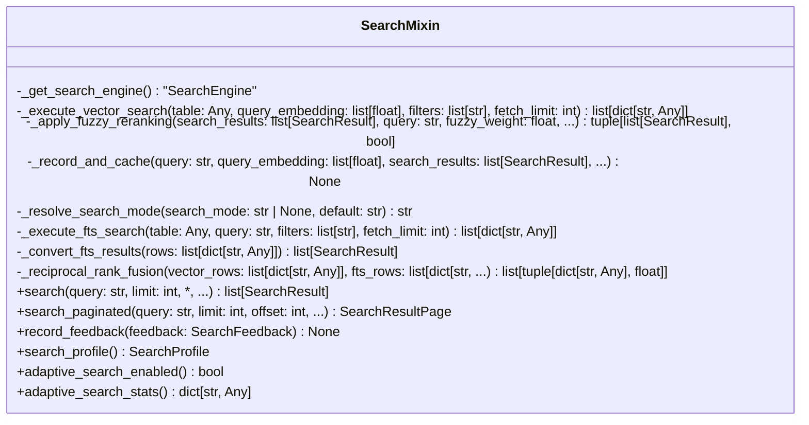

# File: `src/local_deepwiki/core/vectorstore/mixins/search.py`

## File Overview

This file defines the `SearchMixin` class, which serves as a thin delegation layer over the [`SearchEngine`](../search_engine.md) class. Its primary responsibility is to provide a consistent search interface for vector stores, encapsulating all search logic in [`SearchEngine`](../search_engine.md) while maintaining backward compatibility for existing tests and code that directly instantiates `SearchMixin`.

The design rationale centers on composition and separation of concerns:
- Search logic is centralized in [`SearchEngine`](../search_engine.md), promoting reusability and testability.
- `SearchMixin` acts as a bridge, creating and delegating to a [`SearchEngine`](../search_engine.md) instance lazily.
- This approach supports both legacy direct usage (e.g., in tests) and modern composition-based architecture.

## Key Concepts

### Search Engine Composition
The `SearchMixin` delegates all search-related operations to an instance of [`SearchEngine`](../search_engine.md). This design promotes:
- **Separation of concerns**: Search logic is isolated from the vector store implementation.
- **Testability**: [`SearchEngine`](../search_engine.md) can be tested independently.
- **Maintainability**: Search logic changes only need to be made in one place.

### Lazy Search Engine Initialization
The `_get_search_engine()` method ensures that a [`SearchEngine`](../search_engine.md) instance is created only when needed. This supports:
- **Backward compatibility**: Tests that instantiate `SearchMixin` directly can work without explicit engine setup.
- **Performance**: Avoids creating unnecessary [`SearchEngine`](../search_engine.md) instances.

### Adaptive Search and Caching
The mixin integrates with adaptive search and caching mechanisms:
- It records search quality for adaptive learning.
- It caches results when appropriate, using [`SearchCache`](../cache.md).
- It supports both offset- and cursor-based pagination for scalable search results.

### Search Modes and Fuzzy Reranking
The mixin supports three search modes:
- `vector`: Semantic search using embeddings.
- `keyword`: Full-text search using BM25.
- `hybrid`: Merges vector and keyword results using Reciprocal Rank Fusion (RRF).

Fuzzy reranking is applied automatically or manually, enhancing relevance when vector search results are poor.

## Integration

### External Usage
This file is used by:
- `SearchMixin` itself, which is extended by vector store classes in the codebase.
- Imported by [`SearchEngine`](../search_engine.md) and related components to provide search functionality.

### Dependencies
The file imports:
- Core components like [`SearchEngine`](../search_engine.md), [`SearchEngineConfig`](../search_params.md), and [`SearchRequest`](search_types.md).
- Fuzzy search utilities from `local_deepwiki.core.fuzzy_search`.
- [`SearchFeedback`](../schema.md), [`SearchProfile`](../schema.md), and [`SearchResultPage`](../schema.md) from `..schema`.
- Logging and utility functions from `local_deepwiki.logging` and `..utils`.

These dependencies support the core search pipeline, from embedding and filtering to caching and result ranking.

### Related Files
This file is part of a larger vector store system:
- It integrates with [`SearchEngine`](../search_engine.md) to provide a unified search interface.
- It's used in CLI tools like `src/local_deepwiki/cli/main.py` for search functionality.
- It interacts with [`SearchCache`](../cache.md) and [`AdaptiveSearcher`](../cache.md) for caching and learning.

## Design Notes

### Backward Compatibility
The `SearchMixin` supports legacy usage patterns:
- It allows instantiation without explicit [`SearchEngine`](../search_engine.md) setup.
- It accepts both keyword arguments and [`SearchRequest`](search_types.md) objects.
- It retains the original method signatures for `search` and `search_paginated`.

### Search Mode Resolution
The `_resolve_search_mode` method ensures that invalid search modes fall back gracefully to `vector`, which maintains robustness against misconfigurations.

### Fuzzy Search Integration
Fuzzy search is applied only when:
- Explicitly requested (`use_fuzzy=True`) or
- Auto-enabled due to poor vector search results.

This prevents unnecessary computation while improving relevance.

### Asynchronous and Synchronous Patterns
The `search` and `search_paginated` methods are `async`, aligning with the async nature of vector store operations. The `_execute_vector_search` method also includes latency tracking, supporting adaptive index creation.

### Error Handling
The mixin uses `try/except` blocks for FTS search failures and logs exceptions via `_log_task_exception`. It also validates search profile strings, raising `ValueError` for invalid inputs.

### Pagination
Support for both offset- and cursor-based pagination allows flexibility in how search results are consumed, especially in high-concurrency environments.

### Adaptive Search and Caching
- Adaptive search stats and enabling/disabling are exposed via dedicated properties.
- Caching is conditional on `use_cache` and `auto_fuzzy_enabled` to avoid caching reranked results.

## API Reference

### class `SearchMixin`

Mixin providing search, pagination, feedback, and adaptive search methods.  Delegates to the `[`SearchEngine`](../search_engine.md)` at ``self._search_engine``.  If the engine has not been injected (e.g. in tests that create a bare ``SearchMixin``), one is built lazily from the ``self`` attributes that the old mixin pattern expected.

**Methods:**


<details>
<summary>View Source (lines 34-482) | <a href="https://github.com/UrbanDiver/local-deepwiki-mcp/blob/main/src/local_deepwiki/core/vectorstore/mixins/search.py#L34-L482">GitHub</a></summary>

```python
class SearchMixin:
    # Methods: _get_search_engine, _execute_vector_search, _apply_fuzzy_reranking, _record_and_cache, _resolve_search_mode, _execute_fts_search, _convert_fts_results, _reciprocal_rank_fusion, search, search_paginated, record_feedback, search_profile, search_profile, adaptive_search_enabled, adaptive_search_enabled, adaptive_search_stats
```

</details>

#### `search`

```python
async def search(query: str, limit: int = 10, request: "SearchRequest | None" = None, search_mode: str | None = None, language: str | None = None, chunk_type: str | None = None, path_pattern: str | None = None, use_fuzzy: bool = False, fuzzy_weight: float = 0.3, profile: SearchProfile | str | None = None, min_similarity: float | None = None, auto_suggest: bool = True) -> list[SearchResult]
```

Search for similar code chunks.  Orchestrates the search pipeline: embed query, check cache, execute search (vector, keyword, or hybrid), apply filters/fuzzy/suggestions, record and cache.  Accepts either individual keyword arguments (backward compatible) or a `[`SearchRequest`](search_types.md)` object via the ``request`` parameter. When a `[`SearchRequest`](search_types.md)` is provided its fields take precedence over the positional/keyword arguments.


| Parameter | Type | Default | Description |
|-----------|------|---------|-------------|
| `query` | `str` | - | Search query text. |
| `limit` | `int` | `10` | Maximum number of results. |
| `request` | `"SearchRequest | None"` | `None` | Optional ``SearchRequest`` bundle. Fields override the corresponding keyword arguments. |
| `search_mode` | `str | None` | `None` | Search mode override -- ``"vector"`` (semantic), ``"keyword"`` (BM25 full-text), or ``"hybrid"`` (both merged via Reciprocal Rank Fusion). Defaults to the store's configured ``default_search_mode``. |
| `language` | `str | None` | `None` | Optional language filter (e.g., "python", "typescript"). |
| `chunk_type` | `str | None` | `None` | Optional chunk type filter (e.g., "function", "class", "method"). |
| `path_pattern` | `str | None` | `None` | Optional file path pattern filter (e.g., "src/**/*.py"). |
| `use_fuzzy` | `bool` | `False` | Whether to use fuzzy matching to re-rank results. |
| `fuzzy_weight` | `float` | `0.3` | Weight for fuzzy score when use_fuzzy is True (0.0-1.0). |
| `profile` | `SearchProfile | str | None` | `None` | Search profile for precision/recall trade-off. |
| `min_similarity` | `float | None` | `None` | Minimum similarity threshold override. |
| `auto_suggest` | `bool` | `True` | Whether to generate "Did you mean?" suggestions. |


<details>
<summary>View Source (lines 277-340) | <a href="https://github.com/UrbanDiver/local-deepwiki-mcp/blob/main/src/local_deepwiki/core/vectorstore/mixins/search.py#L277-L340">GitHub</a></summary>

```python
async def search(
        self,
        query: str,
        limit: int = 10,
        *,
        request: "SearchRequest | None" = None,
        search_mode: str | None = None,
        language: str | None = None,
        chunk_type: str | None = None,
        path_pattern: str | None = None,
        use_fuzzy: bool = False,
        fuzzy_weight: float = 0.3,
        profile: SearchProfile | str | None = None,
        min_similarity: float | None = None,
        auto_suggest: bool = True,
    ) -> list[SearchResult]:
        """Search for similar code chunks.

        Orchestrates the search pipeline: embed query, check cache, execute
        search (vector, keyword, or hybrid), apply filters/fuzzy/suggestions,
        record and cache.

        Accepts either individual keyword arguments (backward compatible) or
        a ``SearchRequest`` object via the ``request`` parameter. When a
        ``SearchRequest`` is provided its fields take precedence over the
        positional/keyword arguments.

        Args:
            query: Search query text.
            limit: Maximum number of results.
            request: Optional ``SearchRequest`` bundle. Fields override
                the corresponding keyword arguments.
            search_mode: Search mode override -- ``"vector"`` (semantic),
                ``"keyword"`` (BM25 full-text), or ``"hybrid"`` (both merged
                via Reciprocal Rank Fusion). Defaults to the store's
                configured ``default_search_mode``.
            language: Optional language filter (e.g., "python", "typescript").
            chunk_type: Optional chunk type filter (e.g., "function", "class", "method").
            path_pattern: Optional file path pattern filter (e.g., "src/**/*.py").
            use_fuzzy: Whether to use fuzzy matching to re-rank results.
            fuzzy_weight: Weight for fuzzy score when use_fuzzy is True (0.0-1.0).
            profile: Search profile for precision/recall trade-off.
            min_similarity: Minimum similarity threshold override.
            auto_suggest: Whether to generate "Did you mean?" suggestions.

        Returns:
            List of search results with scores.
        """
        engine = self._get_search_engine()
        if request is None:
            request = SearchRequest(
                query=query,
                limit=limit,
                search_mode=search_mode,
                language=language,
                chunk_type=chunk_type,
                path_pattern=path_pattern,
                use_fuzzy=use_fuzzy,
                fuzzy_weight=fuzzy_weight,
                profile=profile,
                min_similarity=min_similarity,
                auto_suggest=auto_suggest,
            )
        return await engine.search(request, store=self)
```

</details>

#### `search_paginated`

```python
async def search_paginated(query: str, limit: int = 10, offset: int = 0, request: "SearchRequest | None" = None, language: str | None = None, chunk_type: str | None = None, path_pattern: str | None = None, use_fuzzy: bool = False, fuzzy_weight: float = 0.3, cursor: str | None = None, profile: SearchProfile | str | None = None, min_similarity: float | None = None) -> SearchResultPage
```

Search for similar code chunks with pagination support.  This method supports both offset-based and cursor-based pagination: - Offset-based: Use `offset` parameter (simpler, but may have stability issues) - Cursor-based: Use `cursor` parameter (more stable for concurrent updates)  Accepts either a `[`SearchRequest`](search_types.md)` object (via ``request``) or individual keyword arguments.  When ``request`` is provided it takes precedence and the individual keyword arguments are ignored.


| Parameter | Type | Default | Description |
|-----------|------|---------|-------------|
| `query` | `str` | - | Search query text (ignored when ``request`` is given). |
| `limit` | `int` | `10` | Maximum number of results per page (ignored when ``request`` is given). |
| `offset` | `int` | `0` | Starting offset for pagination (0-based). |
| `request` | `"SearchRequest | None"` | `None` | Optional pre-built ``SearchRequest``. When provided, all other search parameters are ignored. |
| `language` | `str | None` | `None` | Optional language filter (e.g., "python", "typescript"). |
| `chunk_type` | `str | None` | `None` | Optional chunk type filter (e.g., "function", "class", "method"). |
| `path_pattern` | `str | None` | `None` | Optional file path pattern filter (e.g., "src/**/*.py"). |
| `use_fuzzy` | `bool` | `False` | Whether to use fuzzy matching to re-rank results. |
| `fuzzy_weight` | `float` | `0.3` | Weight for fuzzy score when use_fuzzy is True (0.0-1.0). |
| `cursor` | `str | None` | `None` | Optional cursor for cursor-based pagination (overrides offset). |
| `profile` | `SearchProfile | str | None` | `None` | Search profile for precision/recall trade-off. Can be SearchProfile enum or string ("fast", "balanced", "thorough"). If None, uses the store's default profile. |
| `min_similarity` | `float | None` | `None` | Minimum similarity threshold override. Results below this score are filtered out. If None, uses the profile's default threshold. |


<details>
<summary>View Source (lines 346-410) | <a href="https://github.com/UrbanDiver/local-deepwiki-mcp/blob/main/src/local_deepwiki/core/vectorstore/mixins/search.py#L346-L410">GitHub</a></summary>

```python
async def search_paginated(
        self,
        query: str,
        limit: int = 10,
        offset: int = 0,
        *,
        request: "SearchRequest | None" = None,
        language: str | None = None,
        chunk_type: str | None = None,
        path_pattern: str | None = None,
        use_fuzzy: bool = False,
        fuzzy_weight: float = 0.3,
        cursor: str | None = None,
        profile: SearchProfile | str | None = None,
        min_similarity: float | None = None,
    ) -> SearchResultPage:
        """Search for similar code chunks with pagination support.

        This method supports both offset-based and cursor-based pagination:
        - Offset-based: Use `offset` parameter (simpler, but may have stability issues)
        - Cursor-based: Use `cursor` parameter (more stable for concurrent updates)

        Accepts either a ``SearchRequest`` object (via ``request``) or
        individual keyword arguments.  When ``request`` is provided it takes
        precedence and the individual keyword arguments are ignored.

        Args:
            query: Search query text (ignored when ``request`` is given).
            limit: Maximum number of results per page (ignored when ``request`` is given).
            offset: Starting offset for pagination (0-based).
            request: Optional pre-built ``SearchRequest``. When provided,
                all other search parameters are ignored.
            language: Optional language filter (e.g., "python", "typescript").
            chunk_type: Optional chunk type filter (e.g., "function", "class", "method").
            path_pattern: Optional file path pattern filter (e.g., "src/**/*.py").
            use_fuzzy: Whether to use fuzzy matching to re-rank results.
            fuzzy_weight: Weight for fuzzy score when use_fuzzy is True (0.0-1.0).
            cursor: Optional cursor for cursor-based pagination (overrides offset).
            profile: Search profile for precision/recall trade-off.
                Can be SearchProfile enum or string ("fast", "balanced", "thorough").
                If None, uses the store's default profile.
            min_similarity: Minimum similarity threshold override.
                Results below this score are filtered out.
                If None, uses the profile's default threshold.

        Returns:
            SearchResultPage with results, total count, and pagination metadata.
        """
        engine = self._get_search_engine()
        if request is None:
            request = SearchRequest(
                query=query,
                limit=limit,
                offset=offset,
                cursor=cursor,
                language=language,
                chunk_type=chunk_type,
                path_pattern=path_pattern,
                use_fuzzy=use_fuzzy,
                fuzzy_weight=fuzzy_weight,
                profile=profile,
                min_similarity=min_similarity,
                auto_suggest=False,
            )
        return await engine.search_paginated(request, store=self)
```

</details>

#### `record_feedback`

```python
def record_feedback(feedback: SearchFeedback) -> None
```

Record user feedback on a search result.  Feedback is used to improve future search results by learning which results are actually relevant for specific queries.


| Parameter | Type | Default | Description |
|-----------|------|---------|-------------|
| `feedback` | `SearchFeedback` | - | User feedback on a search result. |


<details>
<summary>View Source (lines 412-421) | <a href="https://github.com/UrbanDiver/local-deepwiki-mcp/blob/main/src/local_deepwiki/core/vectorstore/mixins/search.py#L412-L421">GitHub</a></summary>

```python
def record_feedback(self, feedback: SearchFeedback) -> None:
        """Record user feedback on a search result.

        Feedback is used to improve future search results by learning which
        results are actually relevant for specific queries.

        Args:
            feedback: User feedback on a search result.
        """
        self._get_search_engine().record_feedback(feedback)
```

</details>

#### `search_profile`

```python
def search_profile() -> SearchProfile
```

Get the current default search profile.


<details>
<summary>View Source (lines 433-453) | <a href="https://github.com/UrbanDiver/local-deepwiki-mcp/blob/main/src/local_deepwiki/core/vectorstore/mixins/search.py#L433-L453">GitHub</a></summary>

```python
def search_profile(self, profile: SearchProfile | str) -> None:
        """Set the default search profile.

        Args:
            profile: The search profile to use as default.
                Can be SearchProfile enum or string ("fast", "balanced", "thorough").

        Raises:
            ValueError: If the profile string is invalid.
        """
        engine = self._get_search_engine()
        if isinstance(profile, str):
            try:
                engine.default_search_profile = SearchProfile(profile.lower())
            except ValueError as e:
                raise ValueError(
                    f"Invalid search profile: {profile}. "
                    f"Valid values: {[p.value for p in SearchProfile]}"
                ) from e
        else:
            engine.default_search_profile = profile
```

</details>

#### `search_profile`

```python
def search_profile(profile: SearchProfile | str) -> None
```

Set the default search profile.


| Parameter | Type | Default | Description |
|-----------|------|---------|-------------|
| `profile` | `SearchProfile | str` | - | The search profile to use as default. Can be SearchProfile enum or string ("fast", "balanced", "thorough"). |


<details>
<summary>View Source (lines 433-453) | <a href="https://github.com/UrbanDiver/local-deepwiki-mcp/blob/main/src/local_deepwiki/core/vectorstore/mixins/search.py#L433-L453">GitHub</a></summary>

```python
def search_profile(self, profile: SearchProfile | str) -> None:
        """Set the default search profile.

        Args:
            profile: The search profile to use as default.
                Can be SearchProfile enum or string ("fast", "balanced", "thorough").

        Raises:
            ValueError: If the profile string is invalid.
        """
        engine = self._get_search_engine()
        if isinstance(profile, str):
            try:
                engine.default_search_profile = SearchProfile(profile.lower())
            except ValueError as e:
                raise ValueError(
                    f"Invalid search profile: {profile}. "
                    f"Valid values: {[p.value for p in SearchProfile]}"
                ) from e
        else:
            engine.default_search_profile = profile
```

</details>

#### `adaptive_search_enabled`

```python
def adaptive_search_enabled() -> bool
```

Check if adaptive search is enabled.


<details>
<summary>View Source (lines 465-471) | <a href="https://github.com/UrbanDiver/local-deepwiki-mcp/blob/main/src/local_deepwiki/core/vectorstore/mixins/search.py#L465-L471">GitHub</a></summary>

```python
def adaptive_search_enabled(self, enabled: bool) -> None:
        """Enable or disable adaptive search.

        Args:
            enabled: Whether to enable adaptive search depth estimation.
        """
        self._get_search_engine().adaptive_search_enabled = enabled
```

</details>

#### `adaptive_search_enabled`

```python
def adaptive_search_enabled(enabled: bool) -> None
```

Enable or disable adaptive search.


| Parameter | Type | Default | Description |
|-----------|------|---------|-------------|
| `enabled` | `bool` | - | Whether to enable adaptive search depth estimation. |


<details>
<summary>View Source (lines 465-471) | <a href="https://github.com/UrbanDiver/local-deepwiki-mcp/blob/main/src/local_deepwiki/core/vectorstore/mixins/search.py#L465-L471">GitHub</a></summary>

```python
def adaptive_search_enabled(self, enabled: bool) -> None:
        """Enable or disable adaptive search.

        Args:
            enabled: Whether to enable adaptive search depth estimation.
        """
        self._get_search_engine().adaptive_search_enabled = enabled
```

</details>

#### `adaptive_search_stats`

```python
def adaptive_search_stats() -> dict[str, Any]
```

Get statistics about adaptive search performance.


<details>
<summary>View Source (lines 474-482) | <a href="https://github.com/UrbanDiver/local-deepwiki-mcp/blob/main/src/local_deepwiki/core/vectorstore/mixins/search.py#L474-L482">GitHub</a></summary>

```python
def adaptive_search_stats(self) -> dict[str, Any]:
        """Get statistics about adaptive search performance.

        Returns:
            Dictionary with adaptive search statistics including:
            - query_history_size: Number of queries in history
            - feedback_stats: Feedback collection statistics
        """
        return self._get_search_engine().adaptive_search_stats
```

</details>

## Class Diagram



## Call Graph


## Used By

Functions and methods in this file and their callers:

- **[`SearchEngine`](../search_engine.md)**: called by `SearchMixin._get_search_engine`
- **[`SearchEngineConfig`](../search_params.md)**: called by `SearchMixin._get_search_engine`
- **[`SearchProfile`](../schema.md)**: called by `SearchMixin.search_profile`
- **[`SearchRequest`](search_types.md)**: called by `SearchMixin.search`, `SearchMixin.search_paginated`
- **[`SearchResult`](../../../handlers/types.md)**: called by `SearchMixin._convert_fts_results`
- **`ValueError`**: called by `SearchMixin.search_profile`
- **`_get_search_engine`**: called by `SearchMixin.adaptive_search_enabled`, `SearchMixin.adaptive_search_stats`, `SearchMixin.record_feedback`, `SearchMixin.search`, `SearchMixin.search_paginated`, `SearchMixin.search_profile`
- **`_row_to_chunk`**: called by `SearchMixin._convert_fts_results`
- **`add_done_callback`**: called by `SearchMixin._execute_vector_search`
- **`create_task`**: called by `SearchMixin._execute_vector_search`
- **[`extract_highlights`](../../fuzzy_search.md)**: called by `SearchMixin._apply_fuzzy_reranking`
- **`limit`**: called by `SearchMixin._execute_fts_search`, `SearchMixin._execute_vector_search`
- **`monotonic`**: called by `SearchMixin._execute_vector_search`
- **`record_feedback`**: called by `SearchMixin.record_feedback`
- **`record_search_latency`**: called by `SearchMixin._execute_vector_search`
- **`record_search_quality`**: called by `SearchMixin._record_and_cache`
- **[`rerank_with_fuzzy`](../../fuzzy_search.md)**: called by `SearchMixin._apply_fuzzy_reranking`
- **`schedule_index_creation`**: called by `SearchMixin._execute_vector_search`
- **`search`**: called by `SearchMixin._execute_fts_search`, `SearchMixin._execute_vector_search`, `SearchMixin.search`
- **`search_paginated`**: called by `SearchMixin.search_paginated`
- **[`should_auto_enable_fuzzy`](../../fuzzy_search.md)**: called by `SearchMixin._apply_fuzzy_reranking`
- **`should_create_index`**: called by `SearchMixin._execute_vector_search`
- **`to_list`**: called by `SearchMixin._execute_fts_search`, `SearchMixin._execute_vector_search`
- **`where`**: called by `SearchMixin._execute_fts_search`, `SearchMixin._execute_vector_search`

## Usage Examples

*Examples extracted from test files*

### Test that all fields are populated

From `test_search.py::TestGenerateSearchEntry::test_generates_complete_entry`:

```python
page = WikiPage(
    path="files/wiki.md",
    title="Wiki Generator",
    content="# Wiki Generator\n\nUse `WikiGenerator` class.",
    generated_at=0,
)
entry = generate_search_entry(page)

assert entry["path"] == "files/wiki.md"
assert entry["title"] == "Wiki Generator"
assert "Wiki Generator" in entry["headings"]
assert "WikiGenerator" in entry["terms"]
assert len(entry["snippet"]) > 0
```

### Example: `search`

From `test_search_decomposition.py::TestExecuteVectorSearch::test_basic_search_returns_results`:

```python
table.search.return_value.limit.return_value.to_list.return_value = rows

result = mixin._execute_vector_search(table, [0.1, 0.2], [], 10)

assert result == rows
table.search.assert_called_once_with([0.1, 0.2])
```

### Example: `_execute_vector_search`

From `test_search_decomposition.py::TestExecuteVectorSearch::test_basic_search_returns_results`:

```python
mixin = _make_mixin()
        table = MagicMock()
        rows = [{"file_path": "a.py", "_distance": 0.1}]
        table.search.return_value.limit.return_value.to_list.return_value = rows

        result = mixin._execute_vector_search(table, [0.1, 0.2], [], 10)

        assert result == rows
        table.search.assert_called_once_with([0.1, 0.2])
```

### Example: `_execute_vector_search`

From `test_search_decomposition.py::TestExecuteVectorSearch::test_applies_filters_as_where_clause`:

```python
mixin._execute_vector_search(
    table, [0.1], ["language = 'python'", "chunk_type = 'function'"], 20
)

search_chain.where.assert_called_once_with(
    "language = 'python' AND chunk_type = 'function'"
)
```

### Example: `_apply_fuzzy_reranking`

From `test_search_decomposition.py::TestApplyFuzzyReranking::test_no_fuzzy_returns_original`:

```python
reranked, auto_enabled = mixin._apply_fuzzy_reranking(
    results, "test", 0.3, use_fuzzy=False
)

assert reranked == results
assert auto_enabled is False
```


## Last Modified

| Entity | Type | Author | Date | Commit |
|--------|------|--------|------|--------|
| `SearchMixin` | class | Brian Breidenbach | yesterday | `ecc1f18` refactor: SearchMixin build... |
| `search` | method | Brian Breidenbach | yesterday | `ecc1f18` refactor: SearchMixin build... |
| `search_paginated` | method | Brian Breidenbach | yesterday | `ecc1f18` refactor: SearchMixin build... |
| `_get_search_engine` | method | Brian Breidenbach | yesterday | `b7856dc` refactor: introduce search ... |
| `_record_and_cache` | method | Brian Breidenbach | yesterday | `b7856dc` refactor: introduce search ... |
| `_execute_vector_search` | method | Brian Breidenbach | 1 week ago | `0f86cb5` refactor: extract services,... |
| `_apply_fuzzy_reranking` | method | Brian Breidenbach | 1 week ago | `0f86cb5` refactor: extract services,... |
| `_resolve_search_mode` | method | Brian Breidenbach | 1 week ago | `0f86cb5` refactor: extract services,... |
| `_execute_fts_search` | method | Brian Breidenbach | 1 week ago | `0f86cb5` refactor: extract services,... |
| `_convert_fts_results` | method | Brian Breidenbach | 1 week ago | `0f86cb5` refactor: extract services,... |
| `_reciprocal_rank_fusion` | method | Brian Breidenbach | 1 week ago | `0f86cb5` refactor: extract services,... |
| `record_feedback` | method | Brian Breidenbach | 1 week ago | `0f86cb5` refactor: extract services,... |
| `search_profile` | method | Brian Breidenbach | 1 week ago | `0f86cb5` refactor: extract services,... |
| `search_profile` | method | Brian Breidenbach | 1 week ago | `0f86cb5` refactor: extract services,... |
| `adaptive_search_enabled` | method | Brian Breidenbach | 1 week ago | `0f86cb5` refactor: extract services,... |
| `adaptive_search_enabled` | method | Brian Breidenbach | 1 week ago | `0f86cb5` refactor: extract services,... |
| `adaptive_search_stats` | method | Brian Breidenbach | 1 week ago | `0f86cb5` refactor: extract services,... |

## Additional Source Code

Source code for functions and methods not listed in the API Reference above.

#### `_get_search_engine`

<details>
<summary>View Source (lines 45-71) | <a href="https://github.com/UrbanDiver/local-deepwiki-mcp/blob/main/src/local_deepwiki/core/vectorstore/mixins/search.py#L45-L71">GitHub</a></summary>

```python
def _get_search_engine(self) -> "SearchEngine":
        """Return the ``SearchEngine``, creating it lazily if needed."""
        engine: SearchEngine | None = getattr(self, "_search_engine", None)
        if engine is not None:
            return engine

        # Backward-compatible path: build an engine from self attributes
        from local_deepwiki.core.vectorstore.search_engine import SearchEngine
        from local_deepwiki.core.vectorstore.search_params import SearchEngineConfig

        engine = SearchEngine(
            get_table=self._get_table,  # type: ignore[attr-defined]
            row_to_chunk=self._row_to_chunk,  # type: ignore[attr-defined]
            embedding_provider=self.embedding_provider,  # type: ignore[attr-defined]
            get_search_cache=lambda: self._search_cache,  # type: ignore[attr-defined]
            fuzzy_search_config=self._fuzzy_search_config,  # type: ignore[attr-defined]
            adaptive_searcher=self._adaptive_searcher,  # type: ignore[attr-defined]
            lazy_index_manager=self._lazy_index_manager,  # type: ignore[attr-defined]
            config=SearchEngineConfig(
                default_search_profile=self._default_search_profile,  # type: ignore[attr-defined]
                adaptive_search_enabled=self._adaptive_search_enabled,  # type: ignore[attr-defined]
                default_search_mode=self._default_search_mode,  # type: ignore[attr-defined]
                bm25_weight=self._bm25_weight,  # type: ignore[attr-defined]
            ),
        )
        self._search_engine = engine  # type: ignore[attr-defined]
        return engine
```

</details>


#### `_execute_vector_search`

<details>
<summary>View Source (lines 77-117) | <a href="https://github.com/UrbanDiver/local-deepwiki-mcp/blob/main/src/local_deepwiki/core/vectorstore/mixins/search.py#L77-L117">GitHub</a></summary>

```python
def _execute_vector_search(
        self,
        table: Any,
        query_embedding: list[float],
        filters: list[str],
        fetch_limit: int,
    ) -> list[dict[str, Any]]:
        """Execute LanceDB vector search with latency tracking.

        Runs the vector search, records latency for lazy index management,
        and triggers index creation if latency thresholds are exceeded.

        Args:
            table: LanceDB table to search.
            query_embedding: Query vector.
            filters: Pre-validated LanceDB filter expressions.
            fetch_limit: Maximum raw rows to fetch.

        Returns:
            Raw LanceDB result rows.
        """
        search = table.search(query_embedding).limit(fetch_limit)
        if filters:
            search = search.where(" AND ".join(filters))

        search_start = time.monotonic()
        results = search.to_list()
        search_latency_ms = (time.monotonic() - search_start) * 1000

        self._lazy_index_manager.record_search_latency(search_latency_ms)  # type: ignore[attr-defined]

        if self._lazy_index_manager.should_create_index():  # type: ignore[attr-defined]
            try:
                task = asyncio.create_task(
                    self._lazy_index_manager.schedule_index_creation()  # type: ignore[attr-defined]
                )
                task.add_done_callback(_log_task_exception)
            except RuntimeError:
                logger.debug("Cannot schedule lazy index creation: no event loop")

        return results
```

</details>


#### `_apply_fuzzy_reranking`

<details>
<summary>View Source (lines 119-165) | <a href="https://github.com/UrbanDiver/local-deepwiki-mcp/blob/main/src/local_deepwiki/core/vectorstore/mixins/search.py#L119-L165">GitHub</a></summary>

```python
def _apply_fuzzy_reranking(
        self,
        search_results: list[SearchResult],
        query: str,
        fuzzy_weight: float,
        *,
        use_fuzzy: bool,
    ) -> tuple[list[SearchResult], bool]:
        """Apply fuzzy re-ranking if explicitly requested or auto-enabled.

        Args:
            search_results: Results from vector search.
            query: Original search query.
            fuzzy_weight: Weight for fuzzy vs vector score.
            use_fuzzy: Whether fuzzy was explicitly requested.

        Returns:
            Tuple of (possibly reranked results, whether auto-fuzzy was enabled).
        """
        from local_deepwiki.core.fuzzy_search import (
            extract_highlights,
            rerank_with_fuzzy,
            should_auto_enable_fuzzy,
        )

        fuzzy_config = self._fuzzy_search_config  # type: ignore[attr-defined]
        auto_fuzzy_enabled = False

        if (
            fuzzy_config.enable_auto_fuzzy
            and not use_fuzzy
            and should_auto_enable_fuzzy(
                search_results, fuzzy_config.auto_fuzzy_threshold
            )
        ):
            auto_fuzzy_enabled = True
            logger.debug(
                "Auto-enabling fuzzy search due to poor results (best score below %s)",
                fuzzy_config.auto_fuzzy_threshold,
            )

        if (use_fuzzy or auto_fuzzy_enabled) and search_results:
            search_results = rerank_with_fuzzy(search_results, query, fuzzy_weight)
            for result in search_results:
                result.highlights = extract_highlights(result.chunk.content, query)

        return search_results, auto_fuzzy_enabled
```

</details>


#### `_record_and_cache`

<details>
<summary>View Source (lines 167-202) | <a href="https://github.com/UrbanDiver/local-deepwiki-mcp/blob/main/src/local_deepwiki/core/vectorstore/mixins/search.py#L167-L202">GitHub</a></summary>

```python
def _record_and_cache(
        self,
        query: str,
        query_embedding: list[float],
        search_results: list[SearchResult],
        cache_filters: dict[str, Any],
        *,
        use_cache: bool,
        auto_fuzzy_enabled: bool,
        fetch_limit: int,
    ) -> None:
        """Record adaptive search quality and cache results.

        .. note:: This method retains its original signature for backward
           compatibility with existing tests. The ``SearchEngine`` equivalent
           (``_record_and_store_results``) uses ``SearchExecutionContext`` instead.

        Args:
            query: Original search query.
            query_embedding: Query vector (for cache key).
            search_results: Final search results.
            cache_filters: Cache key filters.
            use_cache: Whether caching is enabled for this query.
            auto_fuzzy_enabled: Whether auto-fuzzy was triggered.
            fetch_limit: Fetch limit used (for adaptive learning).
        """
        if self._adaptive_search_enabled and search_results:  # type: ignore[attr-defined]
            avg_score = sum(r.score for r in search_results) / len(search_results)
            self._adaptive_searcher.record_search_quality(  # type: ignore[attr-defined]
                query, avg_score, len(search_results), fetch_limit
            )

        if use_cache and not auto_fuzzy_enabled:
            self._search_cache.set(  # type: ignore[attr-defined]
                query, query_embedding, search_results, cache_filters
            )
```

</details>


#### `_resolve_search_mode`

<details>
<summary>View Source (lines 205-211) | <a href="https://github.com/UrbanDiver/local-deepwiki-mcp/blob/main/src/local_deepwiki/core/vectorstore/mixins/search.py#L205-L211">GitHub</a></summary>

```python
def _resolve_search_mode(search_mode: str | None, default: str) -> str:
        """Resolve the effective search mode from parameter or default."""
        mode = search_mode or default
        if mode not in ("vector", "keyword", "hybrid"):
            logger.warning("Invalid search_mode '%s', falling back to 'vector'", mode)
            return "vector"
        return mode
```

</details>


#### `_execute_fts_search`

<details>
<summary>View Source (lines 213-228) | <a href="https://github.com/UrbanDiver/local-deepwiki-mcp/blob/main/src/local_deepwiki/core/vectorstore/mixins/search.py#L213-L228">GitHub</a></summary>

```python
def _execute_fts_search(
        self,
        table: Any,
        query: str,
        filters: list[str],
        fetch_limit: int,
    ) -> list[dict[str, Any]]:
        """Execute LanceDB full-text (BM25) search."""
        try:
            search = table.search(query, query_type="fts").limit(fetch_limit)
            if filters:
                search = search.where(" AND ".join(filters))
            return search.to_list()
        except (RuntimeError, OSError, ValueError, AttributeError) as exc:
            logger.warning("FTS search failed (falling back to empty): %s", exc)
            return []
```

</details>


#### `_convert_fts_results`

<details>
<summary>View Source (lines 230-246) | <a href="https://github.com/UrbanDiver/local-deepwiki-mcp/blob/main/src/local_deepwiki/core/vectorstore/mixins/search.py#L230-L246">GitHub</a></summary>

```python
def _convert_fts_results(
        self,
        rows: list[dict[str, Any]],
    ) -> list[SearchResult]:
        """Convert FTS result rows to SearchResult objects with normalized scores."""
        if not rows:
            return []
        max_score = max(row.get("_score", 0.0) for row in rows)
        if max_score <= 0:
            max_score = 1.0
        results: list[SearchResult] = []
        for row in rows:
            bm25_score = row.get("_score", 0.0)
            normalized = bm25_score / max_score
            chunk = self._row_to_chunk(row)  # type: ignore[attr-defined]
            results.append(SearchResult(chunk=chunk, score=normalized, highlights=[]))
        return results
```

</details>


#### `_reciprocal_rank_fusion`

<details>
<summary>View Source (lines 249-271) | <a href="https://github.com/UrbanDiver/local-deepwiki-mcp/blob/main/src/local_deepwiki/core/vectorstore/mixins/search.py#L249-L271">GitHub</a></summary>

```python
def _reciprocal_rank_fusion(
        vector_rows: list[dict[str, Any]],
        fts_rows: list[dict[str, Any]],
        *,
        k: int = 60,
        vector_weight: float = 1.0,
        fts_weight: float = 0.3,
    ) -> list[tuple[dict[str, Any], float]]:
        """Merge vector and FTS results using Reciprocal Rank Fusion."""
        scores: dict[str, float] = {}
        docs: dict[str, dict[str, Any]] = {}
        for rank, row in enumerate(vector_rows):
            doc_id = row["id"]
            scores[doc_id] = scores.get(doc_id, 0.0) + vector_weight / (k + rank + 1)
            docs[doc_id] = row
        for rank, row in enumerate(fts_rows):
            doc_id = row["id"]
            scores[doc_id] = scores.get(doc_id, 0.0) + fts_weight / (k + rank + 1)
            if doc_id not in docs:
                docs[doc_id] = row
        sorted_pairs = sorted(scores.items(), key=lambda x: x[1], reverse=True)
        max_score = sorted_pairs[0][1] if sorted_pairs else 1.0
        return [(docs[doc_id], score / max_score) for doc_id, score in sorted_pairs]
```

</details>


#### `search_profile`

<details>
<summary>View Source (lines 424-430) | <a href="https://github.com/UrbanDiver/local-deepwiki-mcp/blob/main/src/local_deepwiki/core/vectorstore/mixins/search.py#L424-L430">GitHub</a></summary>

```python
def search_profile(self) -> SearchProfile:
        """Get the current default search profile.

        Returns:
            The default SearchProfile used when none is specified.
        """
        return self._get_search_engine().default_search_profile
```

</details>


#### `adaptive_search_enabled`

<details>
<summary>View Source (lines 456-462) | <a href="https://github.com/UrbanDiver/local-deepwiki-mcp/blob/main/src/local_deepwiki/core/vectorstore/mixins/search.py#L456-L462">GitHub</a></summary>

```python
def adaptive_search_enabled(self) -> bool:
        """Check if adaptive search is enabled.

        Returns:
            True if adaptive search depth estimation is enabled.
        """
        return self._get_search_engine().adaptive_search_enabled
```

</details>

## Relevant Source Files

- `src/local_deepwiki/core/vectorstore/mixins/search.py:34-482`
