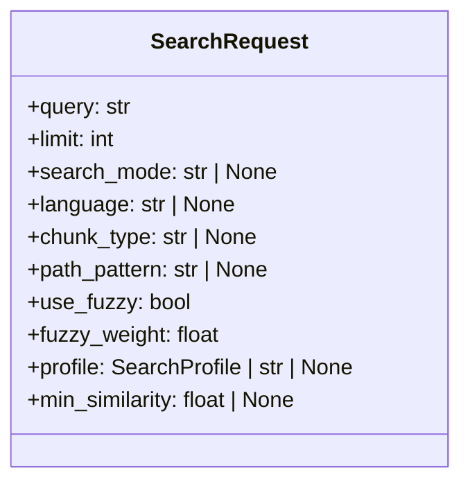

# File: `src/local_deepwiki/core/vectorstore/mixins/search_types.py`

## File Overview

This file defines the `SearchRequest` data class, which serves as a centralized, immutable value object for encapsulating all parameters required for a search operation within the vectorstore search pipeline. The purpose of this file is to simplify and standardize how search parameters are passed between different stages of the search process, reducing the complexity of function signatures and improving maintainability.

By consolidating many keyword arguments into a single hashable object, this design promotes immutability and ease of testing, as the object can be safely shared and used across different components without side effects.

## Key Concepts

### SearchRequest Class

The `SearchRequest` class is a **dataclass** that represents a complete set of search parameters. It is designed to be immutable and hashable, making it suitable for use in caching, as a key in dictionaries, or as part of a pipeline where the same request may be passed through multiple stages.

The choice to use a dataclass is intentional — it provides a clean and concise way to define attributes with default values and automatically generates methods like `__init__`, `__repr__`, and `__eq__`.

### Why This Design?

This design follows the **parameter object pattern**, where a single object is used to group related parameters. This approach reduces the number of function arguments, improves readability, and allows for easier extension in the future without breaking existing code. The use of `None` defaults for optional fields and sensible defaults for others (like `limit=10`, `auto_suggest=True`) allows for flexible and robust search configurations.

The `profile` field supports both [`SearchProfile`](../schema.md) objects and strings, indicating that this system is designed to support both programmatic and configuration-driven search profiles.

## Integration

This file is part of the `vectorstore/mixins` module, which suggests it's used as a shared component in various search-related mixins or classes within the vectorstore system. The `SearchRequest` class is used by:

- `SearchRequest` itself (as a data type)
- `SearchMixin.search()` — where it is likely used as an input parameter
- `search_config_resolver` — possibly to resolve configuration based on the request
- `search_engine` — likely as the input to drive search logic

The [`SearchProfile`](../schema.md) type is imported from `..schema`, indicating that this file is part of a larger system where search behavior is defined by profiles, and this module provides the data structure to carry those parameters.

## Design Notes

- **Immutability**: The class is designed to be immutable, which is critical for ensuring that search requests are not accidentally modified during pipeline execution.
- **Hashability**: Since it uses a dataclass, `SearchRequest` is automatically hashable (assuming all fields are hashable), enabling its use in caching or as dictionary keys.
- **Flexibility**: The optional fields (with `None` defaults) and use of `str | None` or `SearchProfile | str | None` for `profile` allow for both flexible and explicit configuration.
- **Sensible Defaults**: Fields like `limit=10`, `fuzzy_weight=0.3`, and `auto_suggest=True` are chosen to provide a reasonable default behavior out-of-the-box.
- **Extensibility**: Adding new fields to `SearchRequest` is straightforward, and the use of dataclass makes it easy to maintain backward compatibility.

This module does not contain any logic beyond defining the data structure; it is purely a data carrier, which aligns with the principle of separation of concerns in the codebase.

## API Reference

### class `SearchRequest`

Immutable value object encapsulating all search parameters.  Consolidates the many keyword arguments of ``SearchMixin.search()`` into a single, hashable object that is easy to pass between pipeline stages.


<details>
<summary>View Source (lines 11-30) | <a href="https://github.com/UrbanDiver/local-deepwiki-mcp/blob/main/src/local_deepwiki/core/vectorstore/mixins/search_types.py#L11-L30">GitHub</a></summary>

```python
class SearchRequest:
    """Immutable value object encapsulating all search parameters.

    Consolidates the many keyword arguments of ``SearchMixin.search()`` into
    a single, hashable object that is easy to pass between pipeline stages.
    """

    query: str
    limit: int = 10
    search_mode: str | None = None
    language: str | None = None
    chunk_type: str | None = None
    path_pattern: str | None = None
    use_fuzzy: bool = False
    fuzzy_weight: float = 0.3
    profile: SearchProfile | str | None = None
    min_similarity: float | None = None
    auto_suggest: bool = True
    offset: int = 0
    cursor: str | None = None
```

</details>

## Class Diagram



## Last Modified

| Entity | Type | Author | Date | Commit |
|--------|------|--------|------|--------|
| `SearchRequest` | class | Brian Breidenbach | yesterday | `c14fae3` feat: add offset and cursor... |

## Relevant Source Files

- `src/local_deepwiki/core/vectorstore/mixins/search_types.py:11-30`
