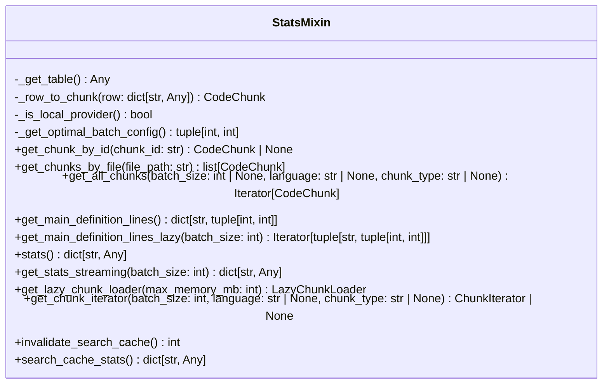

# File: `src/local_deepwiki/core/vectorstore/mixins/stats.py`

## File Overview

This file defines the `StatsMixin` class, which provides utility methods for retrieving, iterating, and analyzing chunks within a vector store. It is designed to be mixed into a [`VectorStore`](../store.md) class to add functionality for fetching specific chunks, iterating over all chunks efficiently, computing statistics, and managing caching behavior.

The mixin focuses on memory efficiency and performance by leveraging PyArrow for data aggregation and using lazy loading patterns for large datasets. It also integrates with embedding batch configuration and caching systems to support scalable vector store operations.

## Key Concepts

### 1. **Lazy Loading and Memory Efficiency**
The mixin introduces [`LazyChunkLoader`](../iterators.md) and [`ChunkIterator`](../iterators.md) to support memory-efficient iteration over large datasets. This is crucial when dealing with repositories containing many chunks, as it avoids loading the entire dataset into memory at once.

### 2. **PyArrow-Based Statistics Aggregation**
Instead of loading data into pandas DataFrames, the mixin uses PyArrow's compute functions (`value_counts`, `unique`, etc.) for efficient aggregation. This allows for fast statistics computation without memory overhead, particularly important for large vector stores.

### 3. **Chunk Filtering and Type Validation**
Methods like `get_chunks_by_file`, `get_chunk_iterator`, and `get_all_chunks` support optional filtering by language and chunk type. These filters are validated against predefined constants (`VALID_LANGUAGES`, `VALID_CHUNK_TYPES`) to ensure consistency and prevent invalid queries.

### 4. **Search Cache Management**
The mixin exposes methods for invalidating and retrieving statistics about the search cache (`invalidate_search_cache`, `search_cache_stats`). This supports cache invalidation strategies when the underlying index changes, ensuring up-to-date search results.

### 5. **Embedding Batch Configuration**
The `embedding_batch_config` method dynamically computes optimal batch size and concurrency based on the embedding provider and configuration, enabling adaptive performance tuning.

## Integration

This file is part of the `local_deepwiki.core.vectorstore` module and is intended to be used as a mixin in a [`VectorStore`](../store.md) class. The [`VectorStore`](../store.md) class is imported directly from `local_deepwiki.core.vectorstore.store`, indicating that this mixin is designed to extend core vector store functionality.

It integrates with:
- [`local_deepwiki.models.CodeChunk`](../../../models/chunks.md) — for representing individual code chunks.
- `local_deepwiki.core.vectorstore.embedding` — for determining optimal batch configurations and checking if the embedding provider is local.
- `local_deepwiki.core.vectorstore.iterators` — for chunk iteration patterns ([`ChunkIterator`](../iterators.md), [`LazyChunkLoader`](../iterators.md)).
- `local_deepwiki.core.vectorstore.schema` — for validation of chunk types and languages.
- `local_deepwiki.core.vectorstore.utils` — for sanitizing input strings to prevent injection attacks.
- `local_deepwiki.logging` — for structured logging within the mixin.

This integration enables a modular architecture where [`VectorStore`](../store.md) can be extended with various mixins to provide different capabilities, such as stats, search, or iteration, without tightly coupling logic.

## Design Notes

### 1. **Use of PyArrow for Performance**
The decision to use PyArrow over pandas for statistics is driven by memory constraints. PyArrow supports columnar operations and streaming, making it suitable for processing large datasets without loading everything into memory. This is especially important in large codebases where `get_stats()` or `get_stats_streaming()` might otherwise cause memory exhaustion.

### 2. **Lazy Loading for Large Repositories**
The `get_all_chunks` method delegates to [`LazyChunkLoader`](../iterators.md), which ensures that chunks are loaded in batches, preventing OOM errors. This is essential for repositories with millions of chunks, where loading everything at once would be impractical.

### 3. **Caching Invalidation Strategy**
The `invalidate_search_cache` method allows external invalidation of search cache entries. This is important for maintaining consistency in vector stores that may be updated externally, such as during codebase changes or re-indexing.

### 4. **Batch Size Optimization**
The `embedding_batch_config` method dynamically calculates optimal batch sizes and concurrency levels using [`get_optimal_batch_config`](../embedding.md). This allows the system to adapt to different embedding providers (local vs. remote) and optimize resource usage accordingly.

### 5. **Input Sanitization**
All string inputs (e.g., `chunk_id`, `file_path`) are sanitized using `_sanitize_string_value` to prevent injection attacks in queries. This ensures that even malformed or malicious inputs do not compromise the integrity of the vector store.

### 6. **Streaming Statistics for Large Datasets**
The `get_stats_streaming` method handles datasets that are too large for `get_stats()` by processing rows in batches. This is a trade-off between memory usage and processing time, but it allows the system to scale to very large repositories.

### 7. **Priority Handling for Main Definitions**
In `get_main_definition_lines` and `get_main_definition_lines_lazy`, class definitions are prioritized over function definitions when both exist in the same file. This reflects the common expectation that classes are more significant structural units in code.

### 8. **Type Checking and Casting**
The use of `TYPE_CHECKING` and `cast` ensures type safety without runtime overhead, particularly when dealing with the [`VectorStore`](../store.md) class in methods that rely on its interface.

### 9. **Error Handling**
Validation of language and chunk type filters raises `ValueError` for invalid inputs, enforcing correctness and preventing silent failures in queries.

### 10. **Debug Logging**
In `get_stats_streaming`, debug logging is used to track progress for very large datasets, aiding in monitoring and performance tuning.

## API Reference

### class `StatsMixin`

Mixin providing chunk retrieval, statistics, cache, and iteration methods.

**Methods:**


<details>
<summary>View Source (lines 26-420) | <a href="https://github.com/UrbanDiver/local-deepwiki-mcp/blob/main/src/local_deepwiki/core/vectorstore/mixins/stats.py#L26-L420">GitHub</a></summary>

```python
class StatsMixin:
    # Methods: _get_table, _row_to_chunk, _is_local_provider, _get_optimal_batch_config, get_chunk_by_id, get_chunks_by_file, get_all_chunks, get_main_definition_lines, get_main_definition_lines_lazy, stats, get_stats_streaming, get_lazy_chunk_loader, get_chunk_iterator, invalidate_search_cache, search_cache_stats, embedding_batch_config
```

</details>

#### `get_chunk_by_id`

```python
async def get_chunk_by_id(chunk_id: str) -> CodeChunk | None
```

Get a specific chunk by ID.


| Parameter | Type | Default | Description |
|-----------|------|---------|-------------|
| `chunk_id` | `str` | - | The chunk ID. |


<details>
<summary>View Source (lines 41-59) | <a href="https://github.com/UrbanDiver/local-deepwiki-mcp/blob/main/src/local_deepwiki/core/vectorstore/mixins/stats.py#L41-L59">GitHub</a></summary>

```python
async def get_chunk_by_id(self, chunk_id: str) -> CodeChunk | None:
        """Get a specific chunk by ID.

        Args:
            chunk_id: The chunk ID.

        Returns:
            The CodeChunk or None if not found.
        """
        table = self._get_table()
        if table is None:
            return None

        safe_id = _sanitize_string_value(chunk_id)
        results = table.search().where(f"id = '{safe_id}'").limit(1).to_list()
        if not results:
            return None

        return self._row_to_chunk(results[0])
```

</details>

#### `get_chunks_by_file`

```python
async def get_chunks_by_file(file_path: str) -> list[CodeChunk]
```

Get all chunks for a specific file.


| Parameter | Type | Default | Description |
|-----------|------|---------|-------------|
| `file_path` | `str` | - | The file path. |


<details>
<summary>View Source (lines 61-76) | <a href="https://github.com/UrbanDiver/local-deepwiki-mcp/blob/main/src/local_deepwiki/core/vectorstore/mixins/stats.py#L61-L76">GitHub</a></summary>

```python
async def get_chunks_by_file(self, file_path: str) -> list[CodeChunk]:
        """Get all chunks for a specific file.

        Args:
            file_path: The file path.

        Returns:
            List of CodeChunks for the file.
        """
        table = self._get_table()
        if table is None:
            return []

        safe_path = _sanitize_string_value(file_path)
        results = table.search().where(f"file_path = '{safe_path}'").to_list()
        return [self._row_to_chunk(row) for row in results]
```

</details>

#### `get_all_chunks`

```python
def get_all_chunks(batch_size: int | None = None, language: str | None = None, chunk_type: str | None = None) -> Iterator[CodeChunk]
```

Lazily iterate over all chunks in the vector store.  Delegates to [LazyChunkLoader](../iterators.md) for memory-efficient batch iteration.


| Parameter | Type | Default | Description |
|-----------|------|---------|-------------|
| `batch_size` | `int | None` | `None` | Batch size for loading. If None, uses optimal size. |
| `language` | `str | None` | `None` | Optional language filter. |
| `chunk_type` | `str | None` | `None` | Optional chunk type filter. |


<details>
<summary>View Source (lines 78-101) | <a href="https://github.com/UrbanDiver/local-deepwiki-mcp/blob/main/src/local_deepwiki/core/vectorstore/mixins/stats.py#L78-L101">GitHub</a></summary>

```python
def get_all_chunks(
        self,
        batch_size: int | None = None,
        language: str | None = None,
        chunk_type: str | None = None,
    ) -> Iterator[CodeChunk]:
        """Lazily iterate over all chunks in the vector store.

        Delegates to LazyChunkLoader for memory-efficient batch iteration.

        Args:
            batch_size: Batch size for loading. If None, uses optimal size.
            language: Optional language filter.
            chunk_type: Optional chunk type filter.

        Yields:
            CodeChunk objects.
        """
        loader = LazyChunkLoader(cast("VectorStore", self))
        yield from loader.get_all_chunks(
            batch_size=batch_size,
            language=language,
            chunk_type=chunk_type,
        )
```

</details>

#### `get_main_definition_lines`

```python
def get_main_definition_lines() -> dict[str, tuple[int, int]]
```

Get line range of main definition (first class or function) per file.  Uses a single LanceDB query for memory-efficient access instead of loading the entire table into a DataFrame.


<details>
<summary>View Source (lines 103-148) | <a href="https://github.com/UrbanDiver/local-deepwiki-mcp/blob/main/src/local_deepwiki/core/vectorstore/mixins/stats.py#L103-L148">GitHub</a></summary>

```python
def get_main_definition_lines(self) -> dict[str, tuple[int, int]]:
        """Get line range of main definition (first class or function) per file.

        Uses a single LanceDB query for memory-efficient access instead of
        loading the entire table into a DataFrame.

        Returns:
            Dict mapping file_path to (start_line, end_line) tuple.
        """
        table = self._get_table()
        if table is None:
            return {}

        # Single query for both classes and functions
        rows = (
            table.search()
            .where("chunk_type IN ('class', 'function')")
            .select(["file_path", "start_line", "end_line", "chunk_type"])
            .limit(10000)
            .to_list()
        )

        result: dict[str, tuple[int, int]] = {}
        result_types: dict[str, str] = {}  # Track chunk type for priority

        for row in rows:
            file_path = str(row["file_path"])
            chunk_type = str(row["chunk_type"])
            start_line = int(row["start_line"])
            end_line = int(row["end_line"])

            if file_path not in result:
                # First definition for this file
                result[file_path] = (start_line, end_line)
                result_types[file_path] = chunk_type
            elif chunk_type == "class" and result_types[file_path] == "function":
                # Class takes priority over function if it starts earlier
                if start_line < result[file_path][0]:
                    result[file_path] = (start_line, end_line)
                    result_types[file_path] = chunk_type
            elif chunk_type == result_types[file_path]:
                # Same type - keep the one that starts earlier
                if start_line < result[file_path][0]:
                    result[file_path] = (start_line, end_line)

        return result
```

</details>

#### `get_main_definition_lines_lazy`

```python
def get_main_definition_lines_lazy(batch_size: int = 5000) -> Iterator[tuple[str, tuple[int, int]]]
```

Lazily get line range of main definition per file.  This method returns an iterator instead of a full dict, suitable for very large repositories where loading all definitions might cause memory issues.


| Parameter | Type | Default | Description |
|-----------|------|---------|-------------|
| `batch_size` | `int` | `5000` | Number of rows to process per batch. |


<details>
<summary>View Source (lines 150-205) | <a href="https://github.com/UrbanDiver/local-deepwiki-mcp/blob/main/src/local_deepwiki/core/vectorstore/mixins/stats.py#L150-L205">GitHub</a></summary>

```python
def get_main_definition_lines_lazy(
        self,
        batch_size: int = 5000,
    ) -> Iterator[tuple[str, tuple[int, int]]]:
        """Lazily get line range of main definition per file.

        This method returns an iterator instead of a full dict, suitable for
        very large repositories where loading all definitions might cause memory issues.

        Args:
            batch_size: Number of rows to process per batch.

        Yields:
            Tuples of (file_path, (start_line, end_line)).
        """
        table = self._get_table()
        if table is None:
            return

        # Use columnar projection for efficiency
        columns = ["file_path", "start_line", "end_line", "chunk_type"]

        # Track results per file as we iterate
        result: dict[str, tuple[int, int]] = {}
        result_types: dict[str, str] = {}

        # Fetch all matching rows once (avoids O(n^2) offset re-fetching)
        total_count = table.count_rows()
        all_rows = (
            table.search()
            .where("chunk_type IN ('class', 'function')")
            .select(columns)
            .limit(total_count)
            .to_list()
        )

        for row in all_rows:
            file_path = str(row["file_path"])
            chunk_type = str(row["chunk_type"])
            start_line = int(row["start_line"])
            end_line = int(row["end_line"])

            if file_path not in result:
                result[file_path] = (start_line, end_line)
                result_types[file_path] = chunk_type
            elif chunk_type == "class" and result_types[file_path] == "function":
                if start_line < result[file_path][0]:
                    result[file_path] = (start_line, end_line)
                    result_types[file_path] = chunk_type
            elif chunk_type == result_types[file_path]:
                if start_line < result[file_path][0]:
                    result[file_path] = (start_line, end_line)

        # Yield all results
        for file_path, lines in result.items():
            yield file_path, lines
```

</details>

#### `stats`

```python
def stats() -> dict[str, Any]
```

Get statistics about the vector store.  Uses PyArrow for memory-efficient aggregation instead of loading the entire table into pandas.


<details>
<summary>View Source (lines 208-251) | <a href="https://github.com/UrbanDiver/local-deepwiki-mcp/blob/main/src/local_deepwiki/core/vectorstore/mixins/stats.py#L208-L251">GitHub</a></summary>

```python
def stats(self) -> dict[str, Any]:
        """Get statistics about the vector store.

        Uses PyArrow for memory-efficient aggregation instead of loading
        the entire table into pandas.

        Returns:
            Dictionary with store statistics.
        """
        import pyarrow.compute as pc

        table = self._get_table()
        if table is None:
            return {"total_chunks": 0, "languages": {}, "chunk_types": {}, "files": 0}

        # Use count_rows() for total - doesn't load data
        total_chunks = table.count_rows()

        # Use arrow for efficient aggregation
        arrow_table = table.to_arrow()

        # Count by language
        lang_counts = pc.value_counts(arrow_table.column("language"))
        languages = {
            str(k): int(v)
            for k, v in zip(lang_counts.field("values"), lang_counts.field("counts"))
        }

        # Count by chunk type
        type_counts = pc.value_counts(arrow_table.column("chunk_type"))
        chunk_types = {
            str(k): int(v)
            for k, v in zip(type_counts.field("values"), type_counts.field("counts"))
        }

        # Count unique files
        unique_files = pc.unique(arrow_table.column("file_path"))

        return {
            "total_chunks": total_chunks,
            "languages": languages,
            "chunk_types": chunk_types,
            "files": len(unique_files),
        }
```

</details>

#### `get_stats_streaming`

```python
def get_stats_streaming(batch_size: int = 10000) -> dict[str, Any]
```

Get statistics about the vector store using streaming aggregation.  This method processes data in batches to avoid loading all rows into memory. Suitable for very large datasets (1M+ chunks) where get_stats() might OOM.


| Parameter | Type | Default | Description |
|-----------|------|---------|-------------|
| `batch_size` | `int` | `10000` | Number of rows to process per batch. |


<details>
<summary>View Source (lines 253-308) | <a href="https://github.com/UrbanDiver/local-deepwiki-mcp/blob/main/src/local_deepwiki/core/vectorstore/mixins/stats.py#L253-L308">GitHub</a></summary>

```python
def get_stats_streaming(self, batch_size: int = 10000) -> dict[str, Any]:
        """Get statistics about the vector store using streaming aggregation.

        This method processes data in batches to avoid loading all rows into memory.
        Suitable for very large datasets (1M+ chunks) where get_stats() might OOM.

        Args:
            batch_size: Number of rows to process per batch.

        Returns:
            Dictionary with store statistics.
        """
        table = self._get_table()
        if table is None:
            return {"total_chunks": 0, "languages": {}, "chunk_types": {}, "files": 0}

        # Use count_rows() for total - doesn't load data
        total_chunks = table.count_rows()

        if total_chunks == 0:
            return {"total_chunks": 0, "languages": {}, "chunk_types": {}, "files": 0}

        # For small tables, use the regular method
        if total_chunks <= batch_size:
            return self.stats

        # Fetch all rows once with columnar projection (avoids O(n^2) offset re-fetching)
        languages: dict[str, int] = {}
        chunk_types: dict[str, int] = {}
        file_set: set[str] = set()

        columns = ["language", "chunk_type", "file_path"]
        all_rows = table.search().select(columns).limit(total_chunks).to_list()

        for i, row in enumerate(all_rows):
            lang = str(row["language"])
            ctype = str(row["chunk_type"])
            fpath = str(row["file_path"])

            languages[lang] = languages.get(lang, 0) + 1
            chunk_types[ctype] = chunk_types.get(ctype, 0) + 1
            file_set.add(fpath)

            if (i + 1) % 100_000 == 0:
                logger.debug(
                    "Stats streaming progress: %d/%d rows processed",
                    i + 1,
                    total_chunks,
                )

        return {
            "total_chunks": total_chunks,
            "languages": languages,
            "chunk_types": chunk_types,
            "files": len(file_set),
        }
```

</details>

#### `get_lazy_chunk_loader`

```python
def get_lazy_chunk_loader(max_memory_mb: int = DEFAULT_MAX_MEMORY_MB) -> LazyChunkLoader
```

Get a [LazyChunkLoader](../iterators.md) for memory-efficient chunk iteration.


| Parameter | Type | Default | Description |
|-----------|------|---------|-------------|
| `max_memory_mb` | `int` | `DEFAULT_MAX_MEMORY_MB` | Maximum memory budget in MB for batch operations. |


<details>
<summary>View Source (lines 310-322) | <a href="https://github.com/UrbanDiver/local-deepwiki-mcp/blob/main/src/local_deepwiki/core/vectorstore/mixins/stats.py#L310-L322">GitHub</a></summary>

```python
def get_lazy_chunk_loader(
        self,
        max_memory_mb: int = DEFAULT_MAX_MEMORY_MB,
    ) -> LazyChunkLoader:
        """Get a LazyChunkLoader for memory-efficient chunk iteration.

        Args:
            max_memory_mb: Maximum memory budget in MB for batch operations.

        Returns:
            LazyChunkLoader instance configured for this store.
        """
        return LazyChunkLoader(cast("VectorStore", self), max_memory_mb=max_memory_mb)
```

</details>

#### `get_chunk_iterator`

```python
def get_chunk_iterator(batch_size: int = 1000, language: str | None = None, chunk_type: str | None = None) -> ChunkIterator | None
```

Get a [ChunkIterator](../iterators.md) for batch iteration over chunks.


| Parameter | Type | Default | Description |
|-----------|------|---------|-------------|
| `batch_size` | `int` | `1000` | Number of chunks per batch. |
| `language` | `str | None` | `None` | Optional language filter. |
| `chunk_type` | `str | None` | `None` | Optional chunk type filter. |


<details>
<summary>View Source (lines 324-362) | <a href="https://github.com/UrbanDiver/local-deepwiki-mcp/blob/main/src/local_deepwiki/core/vectorstore/mixins/stats.py#L324-L362">GitHub</a></summary>

```python
def get_chunk_iterator(
        self,
        batch_size: int = 1000,
        language: str | None = None,
        chunk_type: str | None = None,
    ) -> ChunkIterator | None:
        """Get a ChunkIterator for batch iteration over chunks.

        Args:
            batch_size: Number of chunks per batch.
            language: Optional language filter.
            chunk_type: Optional chunk type filter.

        Returns:
            ChunkIterator instance, or None if no table exists.
        """
        table = self._get_table()
        if table is None:
            return None

        # Build filter expression
        filters = []
        if language:
            if language not in VALID_LANGUAGES:
                raise ValueError(f"Invalid language filter: {language}")
            filters.append(f"language = '{language}'")
        if chunk_type:
            if chunk_type not in VALID_CHUNK_TYPES:
                raise ValueError(f"Invalid chunk_type filter: {chunk_type}")
            filters.append(f"chunk_type = '{chunk_type}'")

        filter_expr = " AND ".join(filters) if filters else None

        return ChunkIterator(
            table=table,
            batch_size=batch_size,
            filter_expr=filter_expr,
            row_to_chunk_fn=self._row_to_chunk,
        )
```

</details>

#### `invalidate_search_cache`

```python
def invalidate_search_cache() -> int
```

Invalidate all search cache entries.  Call this when the index is updated externally or when you want to force fresh search results.


<details>
<summary>View Source (lines 364-373) | <a href="https://github.com/UrbanDiver/local-deepwiki-mcp/blob/main/src/local_deepwiki/core/vectorstore/mixins/stats.py#L364-L373">GitHub</a></summary>

```python
def invalidate_search_cache(self) -> int:
        """Invalidate all search cache entries.

        Call this when the index is updated externally or when you want
        to force fresh search results.

        Returns:
            Number of cache entries invalidated.
        """
        return self._search_cache.invalidate()
```

</details>

#### `search_cache_stats`

```python
def search_cache_stats() -> dict[str, Any]
```

Get search cache statistics.


<details>
<summary>View Source (lines 376-391) | <a href="https://github.com/UrbanDiver/local-deepwiki-mcp/blob/main/src/local_deepwiki/core/vectorstore/mixins/stats.py#L376-L391">GitHub</a></summary>

```python
def search_cache_stats(self) -> dict[str, Any]:
        """Get search cache statistics.

        Returns:
            Dictionary with cache statistics including:
            - enabled: Whether caching is enabled
            - entries: Current number of cached entries
            - max_entries: Maximum allowed entries
            - ttl_seconds: Cache entry TTL
            - similarity_threshold: Minimum similarity for cache hit
            - hits: Number of cache hits
            - misses: Number of cache misses
            - invalidations: Number of cache invalidations
            - hit_rate: Cache hit rate (0.0-1.0)
        """
        return self._search_cache.get_stats()
```

</details>

#### `embedding_batch_config`

```python
def embedding_batch_config() -> dict[str, Any]
```

Get embedding batch configuration.


<details>
<summary>View Source (lines 394-420) | <a href="https://github.com/UrbanDiver/local-deepwiki-mcp/blob/main/src/local_deepwiki/core/vectorstore/mixins/stats.py#L394-L420">GitHub</a></summary>

```python
def embedding_batch_config(self) -> dict[str, Any]:
        """Get embedding batch configuration.

        Returns:
            Dictionary with batch configuration including:
            - batch_size: Texts per batch
            - concurrency: Parallel batch limit
            - rate_limit_rpm: Rate limit (requests per minute)
            - retry_max_attempts: Maximum retry attempts
            - retry_base_delay: Base delay for retries
            - is_local_provider: Whether using local embeddings
            - optimal_batch_size: Calculated optimal batch size
            - optimal_concurrency: Calculated optimal concurrency
        """
        optimal_batch_size, optimal_concurrency = get_optimal_batch_config(
            self._embedding_batch_config, self.embedding_provider
        )
        return {
            "batch_size": self._embedding_batch_config.batch_size,
            "concurrency": self._embedding_batch_config.concurrency,
            "rate_limit_rpm": self._embedding_batch_config.rate_limit_rpm,
            "retry_max_attempts": self._embedding_batch_config.retry_max_attempts,
            "retry_base_delay": self._embedding_batch_config.retry_base_delay,
            "is_local_provider": is_local_provider(self.embedding_provider),
            "optimal_batch_size": optimal_batch_size,
            "optimal_concurrency": optimal_concurrency,
        }
```

</details>

## Class Diagram



## Call Graph

```mermaid
flowchart TD
    N0[ChunkIterator]
    N1[LazyChunkLoader]
    N2[StatsMixin.embedding_batch_...]
    N3[StatsMixin.get_all_chunks]
    N4[StatsMixin.get_chunk_by_id]
    N5[StatsMixin.get_chunk_iterator]
    N6[StatsMixin.get_chunks_by_file]
    N7[StatsMixin.get_lazy_chunk_l...]
    N8[StatsMixin.get_main_definit...]
    N9[StatsMixin.get_main_definit...]
    N10[StatsMixin.get_stats_streaming]
    N11[StatsMixin.stats]
    N12[ValueError]
    N13[_get_table]
    N14[_row_to_chunk]
    N15[_sanitize_string_value]
    N16[add]
    N17[cast]
    N18[column]
    N19[count_rows]
    N20[field]
    N21[get_all_chunks]
    N22[limit]
    N23[search]
    N24[select]
    N25[to_arrow]
    N26[to_list]
    N27[unique]
    N28[value_counts]
    N29[where]
    N4 --> N13
    N4 --> N15
    N4 --> N26
    N4 --> N22
    N4 --> N29
    N4 --> N23
    N4 --> N14
    N6 --> N13
    N6 --> N15
    N6 --> N26
    N6 --> N29
    N6 --> N23
    N6 --> N14
    N3 --> N1
    N3 --> N17
    N3 --> N21
    N8 --> N13
    N8 --> N26
    N8 --> N22
    N8 --> N24
    N8 --> N29
    N8 --> N23
    N9 --> N13
    N9 --> N19
    N9 --> N26
    N9 --> N22
    N9 --> N24
    N9 --> N29
    N9 --> N23
    N11 --> N13
    N11 --> N19
    N11 --> N25
    N11 --> N28
    N11 --> N18
    N11 --> N20
    N11 --> N27
    N10 --> N13
    N10 --> N19
    N10 --> N26
    N10 --> N22
    N10 --> N24
    N10 --> N23
    N10 --> N16
    N7 --> N1
    N7 --> N17
    N5 --> N13
    N5 --> N12
    N5 --> N0
    classDef func fill:#e1f5fe
    class N0,N1,N12,N13,N14,N15,N16,N17,N18,N19,N20,N21,N22,N23,N24,N25,N26,N27,N28,N29 func
    classDef method fill:#fff3e0
    class N2,N3,N4,N5,N6,N7,N8,N9,N10,N11 method
```



## Used By

Functions and methods in this file and their callers:

- **[`ChunkIterator`](../iterators.md)**: called by `StatsMixin.get_chunk_iterator`
- **[`LazyChunkLoader`](../iterators.md)**: called by `StatsMixin.get_all_chunks`, `StatsMixin.get_lazy_chunk_loader`
- **`ValueError`**: called by `StatsMixin.get_chunk_iterator`
- **`_get_table`**: called by `StatsMixin.get_chunk_by_id`, `StatsMixin.get_chunk_iterator`, `StatsMixin.get_chunks_by_file`, `StatsMixin.get_main_definition_lines`, `StatsMixin.get_main_definition_lines_lazy`, `StatsMixin.get_stats_streaming`, `StatsMixin.stats`
- **`_row_to_chunk`**: called by `StatsMixin.get_chunk_by_id`, `StatsMixin.get_chunks_by_file`
- **`_sanitize_string_value`**: called by `StatsMixin.get_chunk_by_id`, `StatsMixin.get_chunks_by_file`
- **`add`**: called by `StatsMixin.get_stats_streaming`
- **`cast`**: called by `StatsMixin.get_all_chunks`, `StatsMixin.get_lazy_chunk_loader`
- **`column`**: called by `StatsMixin.stats`
- **`count_rows`**: called by `StatsMixin.get_main_definition_lines_lazy`, `StatsMixin.get_stats_streaming`, `StatsMixin.stats`
- **`field`**: called by `StatsMixin.stats`
- **`get_all_chunks`**: called by `StatsMixin.get_all_chunks`
- **[`get_optimal_batch_config`](../embedding.md)**: called by `StatsMixin.embedding_batch_config`
- **`get_stats`**: called by `StatsMixin.search_cache_stats`
- **`invalidate`**: called by `StatsMixin.invalidate_search_cache`
- **[`is_local_provider`](../embedding.md)**: called by `StatsMixin.embedding_batch_config`
- **`limit`**: called by `StatsMixin.get_chunk_by_id`, `StatsMixin.get_main_definition_lines`, `StatsMixin.get_main_definition_lines_lazy`, `StatsMixin.get_stats_streaming`
- **`search`**: called by `StatsMixin.get_chunk_by_id`, `StatsMixin.get_chunks_by_file`, `StatsMixin.get_main_definition_lines`, `StatsMixin.get_main_definition_lines_lazy`, `StatsMixin.get_stats_streaming`
- **`select`**: called by `StatsMixin.get_main_definition_lines`, `StatsMixin.get_main_definition_lines_lazy`, `StatsMixin.get_stats_streaming`
- **`to_arrow`**: called by `StatsMixin.stats`
- **`to_list`**: called by `StatsMixin.get_chunk_by_id`, `StatsMixin.get_chunks_by_file`, `StatsMixin.get_main_definition_lines`, `StatsMixin.get_main_definition_lines_lazy`, `StatsMixin.get_stats_streaming`
- **`unique`**: called by `StatsMixin.stats`
- **`value_counts`**: called by `StatsMixin.stats`
- **`where`**: called by `StatsMixin.get_chunk_by_id`, `StatsMixin.get_chunks_by_file`, `StatsMixin.get_main_definition_lines`, `StatsMixin.get_main_definition_lines_lazy`

## Last Modified

| Entity | Type | Author | Date | Commit |
|--------|------|--------|------|--------|
| `StatsMixin` | class | Brian Breidenbach | yesterday | `1eef062` refactor: complete Grade A ... |
| `embedding_batch_config` | method | Brian Breidenbach | yesterday | `1eef062` refactor: complete Grade A ... |
| `get_all_chunks` | method | Brian Breidenbach | Feb 23, 2026 | `c6fe2bd` refactor: split oversized m... |
| `get_lazy_chunk_loader` | method | Brian Breidenbach | Feb 23, 2026 | `c6fe2bd` refactor: split oversized m... |
| `_get_table` | method | Brian Breidenbach | Feb 21, 2026 | `fecde6f` refactor: split 10 large fi... |
| `_row_to_chunk` | method | Brian Breidenbach | Feb 21, 2026 | `fecde6f` refactor: split 10 large fi... |
| `_is_local_provider` | method | Brian Breidenbach | Feb 21, 2026 | `fecde6f` refactor: split 10 large fi... |
| `_get_optimal_batch_config` | method | Brian Breidenbach | Feb 21, 2026 | `fecde6f` refactor: split 10 large fi... |
| `get_chunk_by_id` | method | Brian Breidenbach | Feb 21, 2026 | `fecde6f` refactor: split 10 large fi... |
| `get_chunks_by_file` | method | Brian Breidenbach | Feb 21, 2026 | `fecde6f` refactor: split 10 large fi... |
| `get_main_definition_lines` | method | Brian Breidenbach | Feb 21, 2026 | `fecde6f` refactor: split 10 large fi... |
| `get_main_definition_lines_lazy` | method | Brian Breidenbach | Feb 21, 2026 | `fecde6f` refactor: split 10 large fi... |
| `stats` | method | Brian Breidenbach | Feb 21, 2026 | `fecde6f` refactor: split 10 large fi... |
| `get_stats_streaming` | method | Brian Breidenbach | Feb 21, 2026 | `fecde6f` refactor: split 10 large fi... |
| `get_chunk_iterator` | method | Brian Breidenbach | Feb 21, 2026 | `fecde6f` refactor: split 10 large fi... |
| `invalidate_search_cache` | method | Brian Breidenbach | Feb 21, 2026 | `fecde6f` refactor: split 10 large fi... |
| `search_cache_stats` | method | Brian Breidenbach | Feb 21, 2026 | `fecde6f` refactor: split 10 large fi... |

## Additional Source Code

Source code for functions and methods not listed in the API Reference above.

#### `_get_table`

<details>
<summary>View Source (lines 36-36) | <a href="https://github.com/UrbanDiver/local-deepwiki-mcp/blob/main/src/local_deepwiki/core/vectorstore/mixins/stats.py#L36">GitHub</a></summary>

```python
def _get_table(self) -> Any: ...
```

</details>


#### `_row_to_chunk`

<details>
<summary>View Source (lines 37-37) | <a href="https://github.com/UrbanDiver/local-deepwiki-mcp/blob/main/src/local_deepwiki/core/vectorstore/mixins/stats.py#L37">GitHub</a></summary>

```python
def _row_to_chunk(self, row: dict[str, Any]) -> CodeChunk: ...
```

</details>


#### `_is_local_provider`

<details>
<summary>View Source (lines 38-38) | <a href="https://github.com/UrbanDiver/local-deepwiki-mcp/blob/main/src/local_deepwiki/core/vectorstore/mixins/stats.py#L38">GitHub</a></summary>

```python
def _is_local_provider(self) -> bool: ...
```

</details>


#### `_get_optimal_batch_config`

<details>
<summary>View Source (lines 39-39) | <a href="https://github.com/UrbanDiver/local-deepwiki-mcp/blob/main/src/local_deepwiki/core/vectorstore/mixins/stats.py#L39">GitHub</a></summary>

```python
def _get_optimal_batch_config(self) -> tuple[int, int]: ...
```

</details>

## Relevant Source Files

- `src/local_deepwiki/core/vectorstore/mixins/stats.py:26-420`
