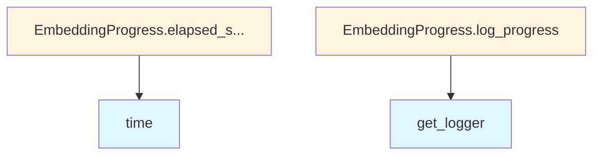

# File: `src/local_deepwiki/core/vectorstore/schema.py`

## File Overview

This file defines the core schema classes used throughout the vectorstore module for managing search results, batched data, search configurations, feedback, embeddings, and latency tracking. These data structures are essential for coordinating the behavior of the vector search system, including pagination, search profiling, feedback-driven improvements, and embedding progress monitoring.

The file serves as a central schema definition for data exchanged between components of the vectorstore, such as search engines, embedding services, and indexing pipelines. It provides typed interfaces that ensure consistency and clarity across the system.

## Key Concepts

### Paginated Search Results
The `SearchResultPage` class is designed to support pagination of search results. It encapsulates metadata such as `total`, `offset`, `limit`, and `cursor` to enable efficient navigation through large result sets. This approach is crucial for performance in large-scale vector stores where returning all matching results at once would be inefficient.

### Search Profiles and Configurations
The `SearchProfile` enum and `SearchProfileConfig` class define configurable trade-offs between search speed and recall. This abstraction allows the system to dynamically adjust how exhaustive searches are performed based on user-defined profiles (`FAST`, `BALANCED`, `THOROUGH`). This design supports both performance optimization and user customization.

### Feedback-Driven Search Improvement
The `SearchFeedback` class is a lightweight structure for collecting user relevance feedback. It enables systems to learn from user interactions and improve future search rankings. This is a key component in building adaptive search systems that improve over time.

### Embedding Progress Tracking
The `EmbeddingProgress` class provides a thread-safe mechanism for tracking and logging the progress of batched embedding operations. It supports real-time reporting and estimates remaining time, which is crucial for long-running embedding tasks.

### Latency Monitoring
The `LatencyStats` class tracks search query latencies over a sliding window, enabling real-time performance monitoring and alerting. This is essential for maintaining quality of service in production systems.

## Integration

This file is imported and used across multiple components in the `local_deepwiki` codebase:

- `SearchResultPage` is used by `search_engine`, `test_vectorstore_pagination`, and `test_vectorstore_submodules` for handling paginated search results.
- `ChunkBatch` is used by iterators and test modules for managing batched data loading.
- `SearchProfile` and `SearchProfileConfig` are used by `search_config_resolver`, `search_engine`, and `search_params` to control search behavior.
- `SearchFeedback` is used by `cache`, `search`, and `search_engine` to [collect](../../web/routes_chat.md) and process user feedback.
- `BatchEmbeddingResult` is used by `embedding` and test modules to represent the outcome of embedding operations.
- `EmbeddingProgress` is used by embedding components to track progress.
- `LatencyStats` is used by various search components to monitor performance.

The classes defined here are foundational for the vectorstore's data flow, enabling components like [`IndexingService`](../../services/indexing_service.md) (not shown in this file but referenced in imports) and [`SearchEngine`](search_engine.md) to operate with consistent interfaces and shared abstractions.

## Design Notes

### Thread Safety
Several classes (`EmbeddingProgress`, `LatencyStats`) use `threading.Lock` to ensure thread-safe access to shared state. This is essential in multi-threaded embedding or search environments where concurrent updates to progress or latency statistics must be handled correctly.

### Sliding Window for Latency Tracking
The `LatencyStats` class maintains a fixed-size window of recent latency measurements. This approach prevents memory bloat while still providing meaningful performance insights. The window size is configurable, allowing tuning based on system needs.

### Separation of Concerns
The schema is separated into distinct classes for different concerns:
- `SearchResultPage`: For pagination
- `ChunkBatch`: For data loading
- `SearchProfile` and `SearchProfileConfig`: For search behavior
- `SearchFeedback`: For learning from user input
- `BatchEmbeddingResult`: For embedding outcomes
- `EmbeddingProgress`: For progress tracking
- `LatencyStats`: For performance monitoring

This modular design supports a clean separation of responsibilities and makes the system easier to test and extend.

### Default Values and Factory Functions
Dataclasses in this file use `field(default_factory=...)` for fields like `timestamp` and `start_time`. This ensures that each instance gets a fresh, current value instead of sharing a mutable default, which is a common Python pitfall.

## API Reference

### class `SearchResultPage`

Paginated search results with metadata.  Attributes: results: List of search results for this page. total: Total number of matching results across all pages. offset: Starting offset of this page. limit: Maximum results per page. has_more: Whether there are more results after this page. cursor: Optional cursor for cursor-based pagination.


<details>
<summary>View Source (lines 30-47) | <a href="https://github.com/UrbanDiver/local-deepwiki-mcp/blob/main/src/local_deepwiki/core/vectorstore/schema.py#L30-L47">GitHub</a></summary>

```python
class SearchResultPage:
    """Paginated search results with metadata.

    Attributes:
        results: List of search results for this page.
        total: Total number of matching results across all pages.
        offset: Starting offset of this page.
        limit: Maximum results per page.
        has_more: Whether there are more results after this page.
        cursor: Optional cursor for cursor-based pagination.
    """

    results: list[SearchResult]
    total: int
    offset: int
    limit: int
    has_more: bool
    cursor: str | None = None
```

</details>

### class `ChunkBatch`

A batch of chunks loaded from the store.  Attributes: chunks: List of [CodeChunk](../../models/chunks.md) objects in this batch. batch_index: Index of this batch (0-based). total_batches: Estimated total number of batches. has_more: Whether there are more batches to load.


<details>
<summary>View Source (lines 51-64) | <a href="https://github.com/UrbanDiver/local-deepwiki-mcp/blob/main/src/local_deepwiki/core/vectorstore/schema.py#L51-L64">GitHub</a></summary>

```python
class ChunkBatch:
    """A batch of chunks loaded from the store.

    Attributes:
        chunks: List of CodeChunk objects in this batch.
        batch_index: Index of this batch (0-based).
        total_batches: Estimated total number of batches.
        has_more: Whether there are more batches to load.
    """

    chunks: list["CodeChunk"]
    batch_index: int
    total_batches: int
    has_more: bool
```

</details>

### class `SearchProfile`

**Inherits from:** `StrEnum`

Search profile for precision/recall trade-off.  Profiles control how exhaustive the search is, trading off speed vs accuracy: - FAST: Minimal candidates, fastest response, may miss some relevant results - BALANCED: Default behavior, good balance of speed and recall - THOROUGH: Exhaustive search, best recall but slower


<details>
<summary>View Source (lines 67-78) | <a href="https://github.com/UrbanDiver/local-deepwiki-mcp/blob/main/src/local_deepwiki/core/vectorstore/schema.py#L67-L78">GitHub</a></summary>

```python
class SearchProfile(StrEnum):
    """Search profile for precision/recall trade-off.

    Profiles control how exhaustive the search is, trading off speed vs accuracy:
    - FAST: Minimal candidates, fastest response, may miss some relevant results
    - BALANCED: Default behavior, good balance of speed and recall
    - THOROUGH: Exhaustive search, best recall but slower
    """

    FAST = "fast"
    BALANCED = "balanced"
    THOROUGH = "thorough"
```

</details>

### class `SearchProfileConfig`

Configuration for a search profile.  Attributes: profile: The search profile this config applies to. fetch_multiplier: Multiplier for nprobes/candidates fetched. Higher values fetch more candidates for better recall. rerank_candidates: How many candidates to rerank. More candidates = better final ranking but slower. use_approximate: Whether to use approximate (ANN) search. False means exact/exhaustive search. min_similarity: Minimum similarity threshold. Results below this threshold are filtered out.


<details>
<summary>View Source (lines 82-101) | <a href="https://github.com/UrbanDiver/local-deepwiki-mcp/blob/main/src/local_deepwiki/core/vectorstore/schema.py#L82-L101">GitHub</a></summary>

```python
class SearchProfileConfig:
    """Configuration for a search profile.

    Attributes:
        profile: The search profile this config applies to.
        fetch_multiplier: Multiplier for nprobes/candidates fetched.
            Higher values fetch more candidates for better recall.
        rerank_candidates: How many candidates to rerank.
            More candidates = better final ranking but slower.
        use_approximate: Whether to use approximate (ANN) search.
            False means exact/exhaustive search.
        min_similarity: Minimum similarity threshold.
            Results below this threshold are filtered out.
    """

    profile: SearchProfile
    fetch_multiplier: float
    rerank_candidates: int
    use_approximate: bool
    min_similarity: float
```

</details>

### class `SearchFeedback`

User feedback on search result relevance.  Used to improve future search results by learning which results are actually relevant for specific queries.  Attributes: query: The original search query. result_id: ID of the result being rated. relevant: Whether the user marked this result as relevant. timestamp: When the feedback was recorded.


<details>
<summary>View Source (lines 131-147) | <a href="https://github.com/UrbanDiver/local-deepwiki-mcp/blob/main/src/local_deepwiki/core/vectorstore/schema.py#L131-L147">GitHub</a></summary>

```python
class SearchFeedback:
    """User feedback on search result relevance.

    Used to improve future search results by learning which results
    are actually relevant for specific queries.

    Attributes:
        query: The original search query.
        result_id: ID of the result being rated.
        relevant: Whether the user marked this result as relevant.
        timestamp: When the feedback was recorded.
    """

    query: str
    result_id: str
    relevant: bool
    timestamp: float = field(default_factory=time.time)
```

</details>

### class `BatchEmbeddingResult`

Result of a batch embedding operation.


<details>
<summary>View Source (lines 151-157) | <a href="https://github.com/UrbanDiver/local-deepwiki-mcp/blob/main/src/local_deepwiki/core/vectorstore/schema.py#L151-L157">GitHub</a></summary>

```python
class BatchEmbeddingResult:
    """Result of a batch embedding operation."""

    batch_index: int
    embeddings: list[list[float]] | None
    error: Exception | None = None
    retry_count: int = 0
```

</details>

### class `EmbeddingProgress`

Progress tracker for embedding operations.

**Methods:**


<details>
<summary>View Source (lines 161-224) | <a href="https://github.com/UrbanDiver/local-deepwiki-mcp/blob/main/src/local_deepwiki/core/vectorstore/schema.py#L161-L224">GitHub</a></summary>

```python
class EmbeddingProgress:
    """Progress tracker for embedding operations."""

    total_texts: int
    total_batches: int
    completed_batches: int = 0
    failed_batches: int = 0
    start_time: float = field(default_factory=time.time)
    _lock: threading.Lock = field(default_factory=threading.Lock)

    def update(self, success: bool = True) -> None:
        """Update progress after a batch completes."""
        with self._lock:
            if success:
                self.completed_batches += 1
            else:
                self.failed_batches += 1

    @property
    def elapsed_seconds(self) -> float:
        """Get elapsed time in seconds."""
        return time.time() - self.start_time

    @property
    def estimated_remaining_seconds(self) -> float | None:
        """Estimate remaining time based on current progress."""
        with self._lock:
            if self.completed_batches == 0:
                return None
            avg_time_per_batch = self.elapsed_seconds / self.completed_batches
            remaining_batches = (
                self.total_batches - self.completed_batches - self.failed_batches
            )
            return avg_time_per_batch * remaining_batches

    def log_progress(self) -> None:
        """Log current progress."""
        from local_deepwiki.logging import get_logger

        logger = get_logger(__name__)

        with self._lock:
            completed = self.completed_batches
            failed = self.failed_batches
            total = self.total_batches
            elapsed = self.elapsed_seconds

        # Calculate outside lock to avoid deadlock
        progress_pct = (completed + failed) / total * 100 if total > 0 else 0
        if completed > 0:
            avg_time_per_batch = elapsed / completed
            remaining_batches = total - completed - failed
            eta = avg_time_per_batch * remaining_batches
            eta_str = f", ETA: {eta:.1f}s"
        else:
            eta_str = ""

        logger.info(
            "Embedding progress: %d/%d batches (%.1f%%)%s",
            completed,
            total,
            progress_pct,
            eta_str,
        )
```

</details>

#### `update`

```python
def update(success: bool = True) -> None
```

Update progress after a batch completes.


| Parameter | Type | Default | Description |
|-----------|------|---------|-------------|
| `success` | `bool` | `True` | - |


<details>
<summary>View Source (lines 161-224) | <a href="https://github.com/UrbanDiver/local-deepwiki-mcp/blob/main/src/local_deepwiki/core/vectorstore/schema.py#L161-L224">GitHub</a></summary>

```python
class EmbeddingProgress:
    """Progress tracker for embedding operations."""

    total_texts: int
    total_batches: int
    completed_batches: int = 0
    failed_batches: int = 0
    start_time: float = field(default_factory=time.time)
    _lock: threading.Lock = field(default_factory=threading.Lock)

    def update(self, success: bool = True) -> None:
        """Update progress after a batch completes."""
        with self._lock:
            if success:
                self.completed_batches += 1
            else:
                self.failed_batches += 1

    @property
    def elapsed_seconds(self) -> float:
        """Get elapsed time in seconds."""
        return time.time() - self.start_time

    @property
    def estimated_remaining_seconds(self) -> float | None:
        """Estimate remaining time based on current progress."""
        with self._lock:
            if self.completed_batches == 0:
                return None
            avg_time_per_batch = self.elapsed_seconds / self.completed_batches
            remaining_batches = (
                self.total_batches - self.completed_batches - self.failed_batches
            )
            return avg_time_per_batch * remaining_batches

    def log_progress(self) -> None:
        """Log current progress."""
        from local_deepwiki.logging import get_logger

        logger = get_logger(__name__)

        with self._lock:
            completed = self.completed_batches
            failed = self.failed_batches
            total = self.total_batches
            elapsed = self.elapsed_seconds

        # Calculate outside lock to avoid deadlock
        progress_pct = (completed + failed) / total * 100 if total > 0 else 0
        if completed > 0:
            avg_time_per_batch = elapsed / completed
            remaining_batches = total - completed - failed
            eta = avg_time_per_batch * remaining_batches
            eta_str = f", ETA: {eta:.1f}s"
        else:
            eta_str = ""

        logger.info(
            "Embedding progress: %d/%d batches (%.1f%%)%s",
            completed,
            total,
            progress_pct,
            eta_str,
        )
```

</details>

#### `elapsed_seconds`

```python
def elapsed_seconds() -> float
```

Get elapsed time in seconds.


<details>
<summary>View Source (lines 161-224) | <a href="https://github.com/UrbanDiver/local-deepwiki-mcp/blob/main/src/local_deepwiki/core/vectorstore/schema.py#L161-L224">GitHub</a></summary>

```python
class EmbeddingProgress:
    """Progress tracker for embedding operations."""

    total_texts: int
    total_batches: int
    completed_batches: int = 0
    failed_batches: int = 0
    start_time: float = field(default_factory=time.time)
    _lock: threading.Lock = field(default_factory=threading.Lock)

    def update(self, success: bool = True) -> None:
        """Update progress after a batch completes."""
        with self._lock:
            if success:
                self.completed_batches += 1
            else:
                self.failed_batches += 1

    @property
    def elapsed_seconds(self) -> float:
        """Get elapsed time in seconds."""
        return time.time() - self.start_time

    @property
    def estimated_remaining_seconds(self) -> float | None:
        """Estimate remaining time based on current progress."""
        with self._lock:
            if self.completed_batches == 0:
                return None
            avg_time_per_batch = self.elapsed_seconds / self.completed_batches
            remaining_batches = (
                self.total_batches - self.completed_batches - self.failed_batches
            )
            return avg_time_per_batch * remaining_batches

    def log_progress(self) -> None:
        """Log current progress."""
        from local_deepwiki.logging import get_logger

        logger = get_logger(__name__)

        with self._lock:
            completed = self.completed_batches
            failed = self.failed_batches
            total = self.total_batches
            elapsed = self.elapsed_seconds

        # Calculate outside lock to avoid deadlock
        progress_pct = (completed + failed) / total * 100 if total > 0 else 0
        if completed > 0:
            avg_time_per_batch = elapsed / completed
            remaining_batches = total - completed - failed
            eta = avg_time_per_batch * remaining_batches
            eta_str = f", ETA: {eta:.1f}s"
        else:
            eta_str = ""

        logger.info(
            "Embedding progress: %d/%d batches (%.1f%%)%s",
            completed,
            total,
            progress_pct,
            eta_str,
        )
```

</details>

#### `estimated_remaining_seconds`

```python
def estimated_remaining_seconds() -> float | None
```

Estimate remaining time based on current progress.


<details>
<summary>View Source (lines 161-224) | <a href="https://github.com/UrbanDiver/local-deepwiki-mcp/blob/main/src/local_deepwiki/core/vectorstore/schema.py#L161-L224">GitHub</a></summary>

```python
class EmbeddingProgress:
    """Progress tracker for embedding operations."""

    total_texts: int
    total_batches: int
    completed_batches: int = 0
    failed_batches: int = 0
    start_time: float = field(default_factory=time.time)
    _lock: threading.Lock = field(default_factory=threading.Lock)

    def update(self, success: bool = True) -> None:
        """Update progress after a batch completes."""
        with self._lock:
            if success:
                self.completed_batches += 1
            else:
                self.failed_batches += 1

    @property
    def elapsed_seconds(self) -> float:
        """Get elapsed time in seconds."""
        return time.time() - self.start_time

    @property
    def estimated_remaining_seconds(self) -> float | None:
        """Estimate remaining time based on current progress."""
        with self._lock:
            if self.completed_batches == 0:
                return None
            avg_time_per_batch = self.elapsed_seconds / self.completed_batches
            remaining_batches = (
                self.total_batches - self.completed_batches - self.failed_batches
            )
            return avg_time_per_batch * remaining_batches

    def log_progress(self) -> None:
        """Log current progress."""
        from local_deepwiki.logging import get_logger

        logger = get_logger(__name__)

        with self._lock:
            completed = self.completed_batches
            failed = self.failed_batches
            total = self.total_batches
            elapsed = self.elapsed_seconds

        # Calculate outside lock to avoid deadlock
        progress_pct = (completed + failed) / total * 100 if total > 0 else 0
        if completed > 0:
            avg_time_per_batch = elapsed / completed
            remaining_batches = total - completed - failed
            eta = avg_time_per_batch * remaining_batches
            eta_str = f", ETA: {eta:.1f}s"
        else:
            eta_str = ""

        logger.info(
            "Embedding progress: %d/%d batches (%.1f%%)%s",
            completed,
            total,
            progress_pct,
            eta_str,
        )
```

</details>

#### `log_progress`

```python
def log_progress() -> None
```

Log current progress.


<details>
<summary>View Source (lines 161-224) | <a href="https://github.com/UrbanDiver/local-deepwiki-mcp/blob/main/src/local_deepwiki/core/vectorstore/schema.py#L161-L224">GitHub</a></summary>

```python
class EmbeddingProgress:
    """Progress tracker for embedding operations."""

    total_texts: int
    total_batches: int
    completed_batches: int = 0
    failed_batches: int = 0
    start_time: float = field(default_factory=time.time)
    _lock: threading.Lock = field(default_factory=threading.Lock)

    def update(self, success: bool = True) -> None:
        """Update progress after a batch completes."""
        with self._lock:
            if success:
                self.completed_batches += 1
            else:
                self.failed_batches += 1

    @property
    def elapsed_seconds(self) -> float:
        """Get elapsed time in seconds."""
        return time.time() - self.start_time

    @property
    def estimated_remaining_seconds(self) -> float | None:
        """Estimate remaining time based on current progress."""
        with self._lock:
            if self.completed_batches == 0:
                return None
            avg_time_per_batch = self.elapsed_seconds / self.completed_batches
            remaining_batches = (
                self.total_batches - self.completed_batches - self.failed_batches
            )
            return avg_time_per_batch * remaining_batches

    def log_progress(self) -> None:
        """Log current progress."""
        from local_deepwiki.logging import get_logger

        logger = get_logger(__name__)

        with self._lock:
            completed = self.completed_batches
            failed = self.failed_batches
            total = self.total_batches
            elapsed = self.elapsed_seconds

        # Calculate outside lock to avoid deadlock
        progress_pct = (completed + failed) / total * 100 if total > 0 else 0
        if completed > 0:
            avg_time_per_batch = elapsed / completed
            remaining_batches = total - completed - failed
            eta = avg_time_per_batch * remaining_batches
            eta_str = f", ETA: {eta:.1f}s"
        else:
            eta_str = ""

        logger.info(
            "Embedding progress: %d/%d batches (%.1f%%)%s",
            completed,
            total,
            progress_pct,
            eta_str,
        )
```

</details>

### class `LatencyStats`

Statistics for tracking search query latency.

**Methods:**


<details>
<summary>View Source (lines 228-270) | <a href="https://github.com/UrbanDiver/local-deepwiki-mcp/blob/main/src/local_deepwiki/core/vectorstore/schema.py#L228-L270">GitHub</a></summary>

```python
class LatencyStats:
    """Statistics for tracking search query latency."""

    latencies: list[float] = field(default_factory=list)
    window_size: int = 10
    _lock: threading.Lock = field(default_factory=threading.Lock)

    def record(self, latency_ms: float) -> None:
        """Record a search latency measurement.

        Args:
            latency_ms: Latency in milliseconds.
        """
        with self._lock:
            self.latencies.append(latency_ms)
            # Keep only the most recent measurements
            if len(self.latencies) > self.window_size:
                self.latencies = self.latencies[-self.window_size :]

    def get_average(self) -> float | None:
        """Get the average latency over the recent window.

        Returns:
            Average latency in milliseconds, or None if no data.
        """
        with self._lock:
            if not self.latencies:
                return None
            return sum(self.latencies) / len(self.latencies)

    def get_count(self) -> int:
        """Get the number of recorded latencies.

        Returns:
            Number of latency measurements recorded.
        """
        with self._lock:
            return len(self.latencies)

    def clear(self) -> None:
        """Clear all recorded latencies."""
        with self._lock:
            self.latencies.clear()
```

</details>

#### `record`

```python
def record(latency_ms: float) -> None
```

Record a search latency measurement.


| Parameter | Type | Default | Description |
|-----------|------|---------|-------------|
| `latency_ms` | `float` | - | Latency in milliseconds. |


<details>
<summary>View Source (lines 228-270) | <a href="https://github.com/UrbanDiver/local-deepwiki-mcp/blob/main/src/local_deepwiki/core/vectorstore/schema.py#L228-L270">GitHub</a></summary>

```python
class LatencyStats:
    """Statistics for tracking search query latency."""

    latencies: list[float] = field(default_factory=list)
    window_size: int = 10
    _lock: threading.Lock = field(default_factory=threading.Lock)

    def record(self, latency_ms: float) -> None:
        """Record a search latency measurement.

        Args:
            latency_ms: Latency in milliseconds.
        """
        with self._lock:
            self.latencies.append(latency_ms)
            # Keep only the most recent measurements
            if len(self.latencies) > self.window_size:
                self.latencies = self.latencies[-self.window_size :]

    def get_average(self) -> float | None:
        """Get the average latency over the recent window.

        Returns:
            Average latency in milliseconds, or None if no data.
        """
        with self._lock:
            if not self.latencies:
                return None
            return sum(self.latencies) / len(self.latencies)

    def get_count(self) -> int:
        """Get the number of recorded latencies.

        Returns:
            Number of latency measurements recorded.
        """
        with self._lock:
            return len(self.latencies)

    def clear(self) -> None:
        """Clear all recorded latencies."""
        with self._lock:
            self.latencies.clear()
```

</details>

#### `get_average`

```python
def get_average() -> float | None
```

Get the average latency over the recent window.


<details>
<summary>View Source (lines 228-270) | <a href="https://github.com/UrbanDiver/local-deepwiki-mcp/blob/main/src/local_deepwiki/core/vectorstore/schema.py#L228-L270">GitHub</a></summary>

```python
class LatencyStats:
    """Statistics for tracking search query latency."""

    latencies: list[float] = field(default_factory=list)
    window_size: int = 10
    _lock: threading.Lock = field(default_factory=threading.Lock)

    def record(self, latency_ms: float) -> None:
        """Record a search latency measurement.

        Args:
            latency_ms: Latency in milliseconds.
        """
        with self._lock:
            self.latencies.append(latency_ms)
            # Keep only the most recent measurements
            if len(self.latencies) > self.window_size:
                self.latencies = self.latencies[-self.window_size :]

    def get_average(self) -> float | None:
        """Get the average latency over the recent window.

        Returns:
            Average latency in milliseconds, or None if no data.
        """
        with self._lock:
            if not self.latencies:
                return None
            return sum(self.latencies) / len(self.latencies)

    def get_count(self) -> int:
        """Get the number of recorded latencies.

        Returns:
            Number of latency measurements recorded.
        """
        with self._lock:
            return len(self.latencies)

    def clear(self) -> None:
        """Clear all recorded latencies."""
        with self._lock:
            self.latencies.clear()
```

</details>

#### `get_count`

```python
def get_count() -> int
```

Get the number of recorded latencies.


<details>
<summary>View Source (lines 228-270) | <a href="https://github.com/UrbanDiver/local-deepwiki-mcp/blob/main/src/local_deepwiki/core/vectorstore/schema.py#L228-L270">GitHub</a></summary>

```python
class LatencyStats:
    """Statistics for tracking search query latency."""

    latencies: list[float] = field(default_factory=list)
    window_size: int = 10
    _lock: threading.Lock = field(default_factory=threading.Lock)

    def record(self, latency_ms: float) -> None:
        """Record a search latency measurement.

        Args:
            latency_ms: Latency in milliseconds.
        """
        with self._lock:
            self.latencies.append(latency_ms)
            # Keep only the most recent measurements
            if len(self.latencies) > self.window_size:
                self.latencies = self.latencies[-self.window_size :]

    def get_average(self) -> float | None:
        """Get the average latency over the recent window.

        Returns:
            Average latency in milliseconds, or None if no data.
        """
        with self._lock:
            if not self.latencies:
                return None
            return sum(self.latencies) / len(self.latencies)

    def get_count(self) -> int:
        """Get the number of recorded latencies.

        Returns:
            Number of latency measurements recorded.
        """
        with self._lock:
            return len(self.latencies)

    def clear(self) -> None:
        """Clear all recorded latencies."""
        with self._lock:
            self.latencies.clear()
```

</details>

#### `clear`

```python
def clear() -> None
```

Clear all recorded latencies.


<details>
<summary>View Source (lines 228-270) | <a href="https://github.com/UrbanDiver/local-deepwiki-mcp/blob/main/src/local_deepwiki/core/vectorstore/schema.py#L228-L270">GitHub</a></summary>

```python
class LatencyStats:
    """Statistics for tracking search query latency."""

    latencies: list[float] = field(default_factory=list)
    window_size: int = 10
    _lock: threading.Lock = field(default_factory=threading.Lock)

    def record(self, latency_ms: float) -> None:
        """Record a search latency measurement.

        Args:
            latency_ms: Latency in milliseconds.
        """
        with self._lock:
            self.latencies.append(latency_ms)
            # Keep only the most recent measurements
            if len(self.latencies) > self.window_size:
                self.latencies = self.latencies[-self.window_size :]

    def get_average(self) -> float | None:
        """Get the average latency over the recent window.

        Returns:
            Average latency in milliseconds, or None if no data.
        """
        with self._lock:
            if not self.latencies:
                return None
            return sum(self.latencies) / len(self.latencies)

    def get_count(self) -> int:
        """Get the number of recorded latencies.

        Returns:
            Number of latency measurements recorded.
        """
        with self._lock:
            return len(self.latencies)

    def clear(self) -> None:
        """Clear all recorded latencies."""
        with self._lock:
            self.latencies.clear()
```

</details>

## Class Diagram

```mermaid
classDiagram
    class BatchEmbeddingResult {
        +batch_index: int
        +embeddings: list[list[float]] | None
        +error: Exception | None
        +retry_count: int
    }
    class ChunkBatch {
        +Attributes: chunks: List of CodeChunk objects in this batch.
        +chunks: list["CodeChunk"]
        +batch_index: int
        +total_batches: int
        +has_more: bool
    }
    class EmbeddingProgress {
        +total_texts: int
        +total_batches: int
        +completed_batches: int
        +failed_batches: int
        +start_time: float
        -_lock: threading.Lock
        +update() -> None
        +elapsed_seconds() -> float
        +estimated_remaining_seconds() -> float | None
        +log_progress() -> None
    }
    class LatencyStats {
        +latencies: list[float]
        +window_size: int
        -_lock: threading.Lock
        +record() -> None
        +get_average() -> float | None
        +get_count() -> int
        +clear() -> None
    }
    class SearchFeedback {
        +Attributes: query: The original search query.
        +query: str
        +result_id: str
        +relevant: bool
        +timestamp: float
    }
    class SearchProfileConfig {
        +Attributes: profile: The search profile this config applies to.
        +profile: SearchProfile
        +fetch_multiplier: float
        +rerank_candidates: int
        +use_approximate: bool
        +min_similarity: float
    }
    class SearchResultPage {
        +Attributes: results: List of search results for this page.
        +results: list[SearchResult]
        +total: int
        +offset: int
        +limit: int
        +has_more: bool
        +cursor: str | None
    }
```



## Call Graph



## Used By

Functions and methods in this file and their callers:

- **[`get_logger`](../../logging.md)**: called by `EmbeddingProgress.log_progress`
- **`time`**: called by `EmbeddingProgress.elapsed_seconds`

## Last Modified

| Entity | Type | Author | Date | Commit |
|--------|------|--------|------|--------|
| `SearchProfile` | class | Brian Breidenbach | Feb 20, 2026 | `b807417` refactor: high-priority Pyt... |
| `EmbeddingProgress` | class | Brian Breidenbach | Feb 20, 2026 | `b807417` refactor: high-priority Pyt... |
| `SearchResultPage` | class | Brian Breidenbach | Feb 09, 2026 | `89de2db` refactor: split vectorstore... |
| `ChunkBatch` | class | Brian Breidenbach | Feb 09, 2026 | `89de2db` refactor: split vectorstore... |
| `SearchProfileConfig` | class | Brian Breidenbach | Feb 09, 2026 | `89de2db` refactor: split vectorstore... |
| `SearchFeedback` | class | Brian Breidenbach | Feb 09, 2026 | `89de2db` refactor: split vectorstore... |
| `BatchEmbeddingResult` | class | Brian Breidenbach | Feb 09, 2026 | `89de2db` refactor: split vectorstore... |
| `LatencyStats` | class | Brian Breidenbach | Feb 09, 2026 | `89de2db` refactor: split vectorstore... |

## Relevant Source Files

- `src/local_deepwiki/core/vectorstore/schema.py:30-47`
