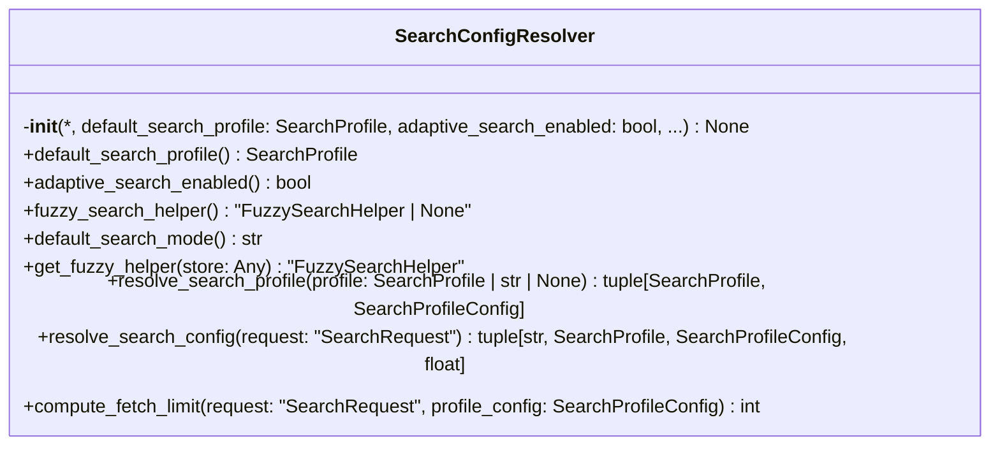
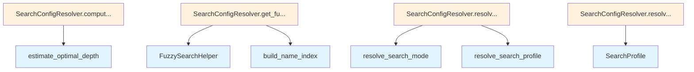

# File: `src/local_deepwiki/core/vectorstore/search_config_resolver.py`

## File Overview

This file defines the `SearchConfigResolver` class, which centralizes the logic for resolving search configuration parameters from [`SearchRequest`](mixins/search_types.md) objects. It abstracts the complexity of determining effective search mode, profile, minimum similarity, and fetch limits based on user input and system defaults.

The primary purpose of this module is to extract configuration resolution logic out of the [`SearchEngine`](search_engine.md) class to reduce its size and improve maintainability. By doing so, it helps keep [`SearchEngine`](search_engine.md) below the "god class" threshold, promoting better separation of concerns.

## Key Concepts

### Configuration Resolution Strategy
The `SearchConfigResolver` encapsulates a strategy for resolving search parameters from a [`SearchRequest`](mixins/search_types.md). This includes:
- Determining the effective search mode (`vector`, `keyword`, etc.) using [`resolve_search_mode`](search_engine.md).
- Selecting a search profile (e.g., `BALANCED`, `FAST`, `PRECISION`) and retrieving its associated configuration.
- Calculating an appropriate fetch limit based on the request and profile settings, including adaptive search behavior.

### Adaptive Search Integration
The resolver supports an adaptive search mechanism through [`AdaptiveSearcher`](cache.md), which estimates optimal search depth based on query and requested limit. This allows dynamic adjustment of fetch limits for improved performance or accuracy depending on context.

### Lazy Initialization of Fuzzy Search Helper
A [`FuzzySearchHelper`](../fuzzy_search.md) instance is lazily initialized and built only when needed, ensuring that resources are not wasted if fuzzy search is never used. This pattern is used to avoid upfront overhead in cases where fuzzy matching is disabled or not required.

## Integration

This module is tightly integrated with:
- [`SearchEngine`](search_engine.md) (via import of [`resolve_search_mode`](search_engine.md))
- [`SearchRequest`](mixins/search_types.md) (from `.mixins.search_types`)
- [`AdaptiveSearcher`](cache.md) (from `.cache`)
- [`FuzzySearchHelper`](../fuzzy_search.md) (from `local_deepwiki.core.fuzzy_search`)
- [`SearchProfile`](schema.md) and related schema types (from `.schema`)

It is likely used by the [`SearchEngine`](search_engine.md) to resolve incoming requests into concrete execution parameters. The `SearchConfigResolver` acts as a configuration manager that decouples the logic of how search parameters are interpreted from the logic of how they are applied.

## Design Notes

### Why Centralize Configuration Resolution?
By moving configuration resolution into its own class, the [`SearchEngine`](search_engine.md) becomes smaller and more focused. This improves readability, testability, and maintainability. It also makes it easier to reason about and modify the behavior of search parameter resolution without affecting the core search logic.

### Handling Invalid Search Profiles
When an invalid or unrecognized profile string is passed in a request, the resolver logs a warning and falls back to the default profile. This ensures robustness against malformed inputs without crashing the system.

### Adaptive Search Depth Estimation
The adaptive search depth estimation (`estimate_optimal_depth`) is used only if adaptive search is enabled. If disabled, the fetch limit is calculated purely based on the multiplier and request limit, simplifying the logic while still allowing for dynamic adjustments when enabled.

### Fetch Limit Computation
The `compute_fetch_limit` function computes a fetch limit that respects both:
1. A base multiplier from the profile configuration.
2. An adaptive estimate of required depth.
3. A maximum limit defined in the profile's `rerank_candidates`.

This ensures that the system does not over-fetch candidates unnecessarily while still allowing for extra candidates when needed (e.g., due to fuzzy matching or path pattern filtering).

## API Reference

### class `SearchConfigResolver`

Resolves search configuration from requests and mutable defaults.  Owns the mutable config state that `[`SearchEngine`](search_engine.md)` previously held (default profile, adaptive search flag, fuzzy helper) and provides pure-logic resolution methods that translate a `[`SearchRequest`](mixins/search_types.md)` into concrete execution parameters.

**Methods:**


<details>
<summary>View Source (lines 32-175) | <a href="https://github.com/UrbanDiver/local-deepwiki-mcp/blob/main/src/local_deepwiki/core/vectorstore/search_config_resolver.py#L32-L175">GitHub</a></summary>

```python
class SearchConfigResolver:
    # Methods: __init__, default_search_profile, default_search_profile, adaptive_search_enabled, adaptive_search_enabled, fuzzy_search_helper, fuzzy_search_helper, default_search_mode, get_fuzzy_helper, resolve_search_profile, resolve_search_config, compute_fetch_limit
```

</details>

#### `__init__`

```python
def __init__(default_search_profile: SearchProfile = SearchProfile.BALANCED, adaptive_search_enabled: bool = True, default_search_mode: str = "vector", adaptive_searcher: "AdaptiveSearcher") -> None
```


| Parameter | Type | Default | Description |
|-----------|------|---------|-------------|
| `default_search_profile` | `SearchProfile` | `SearchProfile.BALANCED` | - |
| `adaptive_search_enabled` | `bool` | `True` | - |
| `default_search_mode` | `str` | `"vector"` | - |
| `adaptive_searcher` | `"AdaptiveSearcher"` | - | - |


<details>
<summary>View Source (lines 47-61) | <a href="https://github.com/UrbanDiver/local-deepwiki-mcp/blob/main/src/local_deepwiki/core/vectorstore/search_config_resolver.py#L47-L61">GitHub</a></summary>

```python
def __init__(
        self,
        *,
        default_search_profile: SearchProfile = SearchProfile.BALANCED,
        adaptive_search_enabled: bool = True,
        default_search_mode: str = "vector",
        adaptive_searcher: "AdaptiveSearcher",
    ) -> None:
        self._default_search_profile = default_search_profile
        self._adaptive_search_enabled = adaptive_search_enabled
        self._default_search_mode = default_search_mode
        self._adaptive_searcher = adaptive_searcher

        # Lazily initialised fuzzy search helper
        self._fuzzy_search_helper: "FuzzySearchHelper | None" = None
```

</details>

#### `default_search_profile`

```python
def default_search_profile() -> SearchProfile
```


<details>
<summary>View Source (lines 70-71) | <a href="https://github.com/UrbanDiver/local-deepwiki-mcp/blob/main/src/local_deepwiki/core/vectorstore/search_config_resolver.py#L70-L71">GitHub</a></summary>

```python
def default_search_profile(self, value: SearchProfile) -> None:
        self._default_search_profile = value
```

</details>

#### `default_search_profile`

```python
def default_search_profile(value: SearchProfile) -> None
```


| Parameter | Type | Default | Description |
|-----------|------|---------|-------------|
| `value` | `SearchProfile` | - | - |


<details>
<summary>View Source (lines 70-71) | <a href="https://github.com/UrbanDiver/local-deepwiki-mcp/blob/main/src/local_deepwiki/core/vectorstore/search_config_resolver.py#L70-L71">GitHub</a></summary>

```python
def default_search_profile(self, value: SearchProfile) -> None:
        self._default_search_profile = value
```

</details>

#### `adaptive_search_enabled`

```python
def adaptive_search_enabled() -> bool
```


<details>
<summary>View Source (lines 78-79) | <a href="https://github.com/UrbanDiver/local-deepwiki-mcp/blob/main/src/local_deepwiki/core/vectorstore/search_config_resolver.py#L78-L79">GitHub</a></summary>

```python
def adaptive_search_enabled(self, value: bool) -> None:
        self._adaptive_search_enabled = value
```

</details>

#### `adaptive_search_enabled`

```python
def adaptive_search_enabled(value: bool) -> None
```


| Parameter | Type | Default | Description |
|-----------|------|---------|-------------|
| `value` | `bool` | - | - |


<details>
<summary>View Source (lines 78-79) | <a href="https://github.com/UrbanDiver/local-deepwiki-mcp/blob/main/src/local_deepwiki/core/vectorstore/search_config_resolver.py#L78-L79">GitHub</a></summary>

```python
def adaptive_search_enabled(self, value: bool) -> None:
        self._adaptive_search_enabled = value
```

</details>

#### `fuzzy_search_helper`

```python
def fuzzy_search_helper() -> "FuzzySearchHelper | None"
```


<details>
<summary>View Source (lines 86-87) | <a href="https://github.com/UrbanDiver/local-deepwiki-mcp/blob/main/src/local_deepwiki/core/vectorstore/search_config_resolver.py#L86-L87">GitHub</a></summary>

```python
def fuzzy_search_helper(self, value: "FuzzySearchHelper | None") -> None:
        self._fuzzy_search_helper = value
```

</details>

#### `fuzzy_search_helper`

```python
def fuzzy_search_helper(value: "FuzzySearchHelper | None") -> None
```


| Parameter | Type | Default | Description |
|-----------|------|---------|-------------|
| `value` | `"FuzzySearchHelper | None"` | - | - |


<details>
<summary>View Source (lines 86-87) | <a href="https://github.com/UrbanDiver/local-deepwiki-mcp/blob/main/src/local_deepwiki/core/vectorstore/search_config_resolver.py#L86-L87">GitHub</a></summary>

```python
def fuzzy_search_helper(self, value: "FuzzySearchHelper | None") -> None:
        self._fuzzy_search_helper = value
```

</details>

#### `default_search_mode`

```python
def default_search_mode() -> str
```


<details>
<summary>View Source (lines 90-91) | <a href="https://github.com/UrbanDiver/local-deepwiki-mcp/blob/main/src/local_deepwiki/core/vectorstore/search_config_resolver.py#L90-L91">GitHub</a></summary>

```python
def default_search_mode(self) -> str:
        return self._default_search_mode
```

</details>

#### `get_fuzzy_helper`

```python
async def get_fuzzy_helper(store: Any) -> "FuzzySearchHelper"
```

Get or create the fuzzy search helper.


| Parameter | Type | Default | Description |
|-----------|------|---------|-------------|
| `store` | `Any` | - | The VectorStore instance (needed by FuzzySearchHelper). |


<details>
<summary>View Source (lines 97-114) | <a href="https://github.com/UrbanDiver/local-deepwiki-mcp/blob/main/src/local_deepwiki/core/vectorstore/search_config_resolver.py#L97-L114">GitHub</a></summary>

```python
async def get_fuzzy_helper(self, store: Any) -> "FuzzySearchHelper":
        """Get or create the fuzzy search helper.

        Args:
            store: The VectorStore instance (needed by FuzzySearchHelper).

        Returns:
            FuzzySearchHelper instance with built name index.
        """
        from local_deepwiki.core.fuzzy_search import FuzzySearchHelper

        if self._fuzzy_search_helper is None:
            self._fuzzy_search_helper = FuzzySearchHelper(store)

        if not self._fuzzy_search_helper.is_built:
            await self._fuzzy_search_helper.build_name_index()

        return self._fuzzy_search_helper
```

</details>

#### `resolve_search_profile`

```python
def resolve_search_profile(profile: SearchProfile | str | None) -> tuple[SearchProfile, SearchProfileConfig]
```

Resolve a profile argument to a ``(SearchProfile, ProfileConfig)`` pair.


| Parameter | Type | Default | Description |
|-----------|------|---------|-------------|
| `profile` | `SearchProfile | str | None` | - | - |


<details>
<summary>View Source (lines 120-134) | <a href="https://github.com/UrbanDiver/local-deepwiki-mcp/blob/main/src/local_deepwiki/core/vectorstore/search_config_resolver.py#L120-L134">GitHub</a></summary>

```python
def resolve_search_profile(
        self, profile: SearchProfile | str | None
    ) -> tuple[SearchProfile, SearchProfileConfig]:
        """Resolve a profile argument to a ``(SearchProfile, ProfileConfig)`` pair."""
        if profile is None:
            resolved = self._default_search_profile
        elif isinstance(profile, str):
            try:
                resolved = SearchProfile(profile.lower())
            except ValueError:
                logger.warning("Invalid search profile '%s', using default", profile)
                resolved = self._default_search_profile
        else:
            resolved = profile
        return resolved, SEARCH_PROFILES[resolved]
```

</details>

#### `resolve_search_config`

```python
def resolve_search_config(request: "SearchRequest") -> tuple[str, SearchProfile, SearchProfileConfig, float]
```

Resolve effective search mode, profile, and min similarity from request.


| Parameter | Type | Default | Description |
|-----------|------|---------|-------------|
| `request` | `"SearchRequest"` | - | - |


<details>
<summary>View Source (lines 136-156) | <a href="https://github.com/UrbanDiver/local-deepwiki-mcp/blob/main/src/local_deepwiki/core/vectorstore/search_config_resolver.py#L136-L156">GitHub</a></summary>

```python
def resolve_search_config(
        self, request: "SearchRequest"
    ) -> tuple[str, SearchProfile, SearchProfileConfig, float]:
        """Resolve effective search mode, profile, and min similarity from request."""
        from .search_engine import resolve_search_mode

        effective_mode = resolve_search_mode(
            request.search_mode, self._default_search_mode
        )
        resolved_profile, profile_config = self.resolve_search_profile(request.profile)
        effective_min_similarity = (
            request.min_similarity
            if request.min_similarity is not None
            else profile_config.min_similarity
        )
        return (
            effective_mode,
            resolved_profile,
            profile_config,
            effective_min_similarity,
        )
```

</details>

#### `compute_fetch_limit`

```python
def compute_fetch_limit(request: "SearchRequest", profile_config: SearchProfileConfig) -> int
```

Compute the number of candidates to fetch before post-processing.


| Parameter | Type | Default | Description |
|-----------|------|---------|-------------|
| `request` | `"SearchRequest"` | - | - |
| `profile_config` | `SearchProfileConfig` | - | - |


<details>
<summary>View Source (lines 158-175) | <a href="https://github.com/UrbanDiver/local-deepwiki-mcp/blob/main/src/local_deepwiki/core/vectorstore/search_config_resolver.py#L158-L175">GitHub</a></summary>

```python
def compute_fetch_limit(
        self,
        request: "SearchRequest",
        profile_config: SearchProfileConfig,
    ) -> int:
        """Compute the number of candidates to fetch before post-processing."""
        base_multiplier = profile_config.fetch_multiplier
        needs_extra = bool(request.path_pattern or request.use_fuzzy)
        if needs_extra:
            base_multiplier = max(base_multiplier, 3.0)
        if self._adaptive_search_enabled:
            adaptive_depth = self._adaptive_searcher.estimate_optimal_depth(
                request.query, request.limit
            )
            fetch_limit = max(int(request.limit * base_multiplier), adaptive_depth)
        else:
            fetch_limit = int(request.limit * base_multiplier)
        return min(fetch_limit, profile_config.rerank_candidates)
```

</details>

## Class Diagram



## Call Graph



## Used By

Functions and methods in this file and their callers:

- **[`FuzzySearchHelper`](../fuzzy_search.md)**: called by `SearchConfigResolver.get_fuzzy_helper`
- **[`SearchProfile`](schema.md)**: called by `SearchConfigResolver.resolve_search_profile`
- **`build_name_index`**: called by `SearchConfigResolver.get_fuzzy_helper`
- **`estimate_optimal_depth`**: called by `SearchConfigResolver.compute_fetch_limit`
- **[`resolve_search_mode`](search_engine.md)**: called by `SearchConfigResolver.resolve_search_config`
- **`resolve_search_profile`**: called by `SearchConfigResolver.resolve_search_config`

## Last Modified

| Entity | Type | Author | Date | Commit |
|--------|------|--------|------|--------|
| `SearchConfigResolver` | class | Brian Breidenbach | yesterday | `1eef062` refactor: complete Grade A ... |
| `__init__` | method | Brian Breidenbach | yesterday | `1eef062` refactor: complete Grade A ... |
| `default_search_profile` | method | Brian Breidenbach | yesterday | `1eef062` refactor: complete Grade A ... |
| `default_search_profile` | method | Brian Breidenbach | yesterday | `1eef062` refactor: complete Grade A ... |
| `adaptive_search_enabled` | method | Brian Breidenbach | yesterday | `1eef062` refactor: complete Grade A ... |
| `adaptive_search_enabled` | method | Brian Breidenbach | yesterday | `1eef062` refactor: complete Grade A ... |
| `fuzzy_search_helper` | method | Brian Breidenbach | yesterday | `1eef062` refactor: complete Grade A ... |
| `fuzzy_search_helper` | method | Brian Breidenbach | yesterday | `1eef062` refactor: complete Grade A ... |
| `default_search_mode` | method | Brian Breidenbach | yesterday | `1eef062` refactor: complete Grade A ... |
| `get_fuzzy_helper` | method | Brian Breidenbach | yesterday | `1eef062` refactor: complete Grade A ... |
| `resolve_search_profile` | method | Brian Breidenbach | yesterday | `1eef062` refactor: complete Grade A ... |
| `resolve_search_config` | method | Brian Breidenbach | yesterday | `1eef062` refactor: complete Grade A ... |
| `compute_fetch_limit` | method | Brian Breidenbach | yesterday | `1eef062` refactor: complete Grade A ... |

## Additional Source Code

Source code for functions and methods not listed in the API Reference above.

#### `default_search_profile`

<details>
<summary>View Source (lines 66-67) | <a href="https://github.com/UrbanDiver/local-deepwiki-mcp/blob/main/src/local_deepwiki/core/vectorstore/search_config_resolver.py#L66-L67">GitHub</a></summary>

```python
def default_search_profile(self) -> SearchProfile:
        return self._default_search_profile
```

</details>


#### `adaptive_search_enabled`

<details>
<summary>View Source (lines 74-75) | <a href="https://github.com/UrbanDiver/local-deepwiki-mcp/blob/main/src/local_deepwiki/core/vectorstore/search_config_resolver.py#L74-L75">GitHub</a></summary>

```python
def adaptive_search_enabled(self) -> bool:
        return self._adaptive_search_enabled
```

</details>


#### `fuzzy_search_helper`

<details>
<summary>View Source (lines 82-83) | <a href="https://github.com/UrbanDiver/local-deepwiki-mcp/blob/main/src/local_deepwiki/core/vectorstore/search_config_resolver.py#L82-L83">GitHub</a></summary>

```python
def fuzzy_search_helper(self) -> "FuzzySearchHelper | None":
        return self._fuzzy_search_helper
```

</details>

## Relevant Source Files

- `src/local_deepwiki/core/vectorstore/search_config_resolver.py:32-175`
