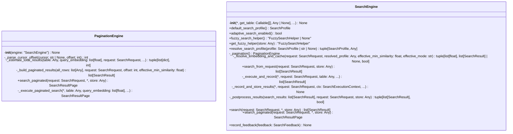

# File: `src/local_deepwiki/core/vectorstore/search_engine.py`

## File Overview

This file implements a composition-based search engine for code chunks, encapsulating the logic previously embedded in a [`SearchMixin`](mixins/search.md). The design separates the search functionality from the [`VectorStore`](store.md) class by injecting all dependencies through the `SearchEngine` constructor, removing implicit coupling through shared `self` attributes.

The `SearchEngine` class is the core of the search logic, orchestrating search pipelines, caching, adaptive search, and result post-processing. It supports both regular and paginated search modes, and integrates with fuzzy search, caching, and configuration resolution.

## Key Concepts

### Search Engine Composition
The `SearchEngine` class is designed as a composition-based search orchestrator. It receives all required dependencies via its constructor:
- `get_table`: Lazy table accessor
- `row_to_chunk`: Converter from database rows to [`CodeChunk`](../../models/chunks.md)
- `embedding_provider`: For computing query embeddings
- `get_search_cache`: Accessor for the search cache
- `fuzzy_search_config`: Configuration for fuzzy search
- `adaptive_searcher`: For tracking and adapting search quality
- `lazy_index_manager`: For managing indices lazily

This design decouples search logic from [`VectorStore`](store.md), enabling cleaner separation of concerns and easier testing.

### Search Profiles and Modes
Search behavior is controlled via [`SearchProfile`](schema.md) and `SearchMode`:
- [`SearchProfile`](schema.md): Defines the search strategy (e.g., `BALANCED`, `FAST`, `PRECISION`)
- `SearchMode`: Determines the search approach (`vector`, `keyword`, `hybrid`)

The [`SearchConfigResolver`](search_config_resolver.md) class encapsulates the logic for resolving effective search configuration based on input parameters and adaptive settings.

### Pagination and Caching
The `PaginationEngine` class provides pagination support for search results. It:
- Estimates total result counts using approximate methods to avoid expensive full scans
- Builds paginated result sets by slicing and scoring
- Handles cursor-based pagination

Caching is implemented via [`SearchCache`](cache.md), which stores embeddings and results for reuse. The `try_cache_lookup` function checks for cached results, and `build_cache_filters` ensures cache keys are consistent.

### Adaptive Search
The `adaptive_search_enabled` flag allows enabling adaptive search quality tracking. When enabled:
- [`AdaptiveSearcher`](cache.md) records average search scores and result counts
- Feedback from users can be used to adjust search behavior
- Statistics are exposed via `adaptive_search_stats()`

### Fuzzy Search Integration
Fuzzy search capabilities are integrated through [`FuzzySearchHelper`](../fuzzy_search.md). It supports:
- Auto-fuzzy reranking
- Suggestion generation
- Integration with search pipelines

## Integration

This file is a core component of the vector store subsystem, integrating with:
- [`VectorStore`](store.md) (via [`SearchMixin`](mixins/search.md) delegation)
- [`SearchCache`](cache.md) for caching results
- [`SearchConfigResolver`](search_config_resolver.md) for configuration resolution
- [`FuzzySearchHelper`](../fuzzy_search.md) for fuzzy search capabilities
- `SearchPipeline` and `SearchPostprocess` for search execution and post-processing

The `SearchEngine` is used by:
- [`SearchMixin`](mixins/search.md) (via `search` and `search_paginated` methods)
- [`SearchConfigResolver`](search_config_resolver.md) (for resolving search parameters)
- Tests via `test_search_params` and `test_hybrid_search`

The file is imported by:
- `src/local_deepwiki/core/vectorstore/__init__.py` (for `SearchEngine` export)
- `src/local_deepwiki/core/vectorstore/search_pipeline.py` (for pipeline dispatch)
- `src/local_deepwiki/core/vectorstore/search_postprocess.py` (for post-processing)

## Design Notes

### Why Composition Over Mixins
The move from [`SearchMixin`](mixins/search.md) to `SearchEngine` addresses:
- **Implicit coupling**: Mixins rely on shared `self` attributes, which can lead to tight coupling and hard-to-debug code.
- **Testability**: Dependencies are explicitly injected, making it easier to mock and test.
- **Flexibility**: The search engine can be composed with different [`VectorStore`](store.md) implementations or used in other contexts.

### Search Pipeline Dispatch
The search pipeline is dispatched using [`search_pipeline.dispatch_search`](search_pipeline.md), which routes to different search implementations based on the `effective_mode` (vector, keyword, hybrid). This supports pluggable search strategies.

### Cache Invalidation
Caching is used selectively:
- Disabled for queries with `use_fuzzy`, `path_pattern`, or `keyword` mode
- Ensures cache keys are consistent using `build_cache_filters`
- Cached results are returned immediately if found, avoiding recomputation

### Adaptive Search Feedback
Feedback is recorded and used to adjust search behavior:
- Average search score and result count are tracked
- Feedback statistics are exposed for monitoring
- This supports a dynamic, learning search system

### Error Handling and Validation
- `build_search_filters` validates `language` and `chunk_type` filter values against predefined sets
- `resolve_search_mode` provides fallback behavior for invalid modes
- `logger.warning` is used for non-critical issues (e.g., invalid cursor, invalid mode)

### Pagination Estimation
The `_estimate_total_results` method:
- Uses a limit multiplier to fetch more candidates than needed for accurate count estimation
- Applies similarity threshold filtering
- Applies path pattern filtering before estimating total count
- Balances performance and accuracy for pagination

### Fuzzy Reranking
Fuzzy reranking is applied in two contexts:
- During post-processing (`_postprocess_results`)
- During pagination (`_build_paginated_results`)

It's only applied when `request.use_fuzzy` is true or when auto-fuzzy is enabled.

## API Reference

### class `PaginationEngine`

Handles paginated search over a ``SearchEngine``.  Extracted from ``SearchEngine`` to keep its method count below the god-class threshold.  Uses composition: receives a ``SearchEngine`` reference and delegates to it for shared helpers (config resolution, table access, embedding, row conversion, fuzzy config).

**Methods:**


<details>
<summary>View Source (lines 138-334) | <a href="https://github.com/UrbanDiver/local-deepwiki-mcp/blob/main/src/local_deepwiki/core/vectorstore/search_engine.py#L138-L334">GitHub</a></summary>

```python
class PaginationEngine:
    # Methods: __init__, _parse_cursor_offset, _estimate_total_results, _build_paginated_results, search_paginated, _execute_paginated_search
```

</details>

#### `__init__`

```python
def __init__(engine: "SearchEngine") -> None
```


| Parameter | Type | Default | Description |
|-----------|------|---------|-------------|
| `engine` | `"SearchEngine"` | - | - |


<details>
<summary>View Source (lines 147-148) | <a href="https://github.com/UrbanDiver/local-deepwiki-mcp/blob/main/src/local_deepwiki/core/vectorstore/search_engine.py#L147-L148">GitHub</a></summary>

```python
def __init__(self, engine: "SearchEngine") -> None:
        self._engine = engine
```

</details>

#### `search_paginated`

```python
async def search_paginated(request: SearchRequest, store: Any = None) -> SearchResultPage
```

Search for similar code chunks with pagination support.


| Parameter | Type | Default | Description |
|-----------|------|---------|-------------|
| `request` | `SearchRequest` | - | Immutable ``SearchRequest`` bundle. The ``offset`` and ``cursor`` fields control pagination. |
| `store` | `Any` | `None` | The VectorStore instance (needed for fuzzy helper init). |


<details>
<summary>View Source (lines 249-301) | <a href="https://github.com/UrbanDiver/local-deepwiki-mcp/blob/main/src/local_deepwiki/core/vectorstore/search_engine.py#L249-L301">GitHub</a></summary>

```python
async def search_paginated(
        self,
        request: SearchRequest,
        *,
        store: Any = None,
    ) -> SearchResultPage:
        """Search for similar code chunks with pagination support.

        Args:
            request: Immutable ``SearchRequest`` bundle. The ``offset``
                and ``cursor`` fields control pagination.
            store: The VectorStore instance (needed for fuzzy helper init).

        Returns:
            A ``SearchResultPage`` with results, total count, and pagination info.
        """
        table = self._engine._get_table()
        if table is None:
            logger.debug("No table found for search")
            return SearchResultPage(
                results=[],
                total=0,
                offset=request.offset,
                limit=request.limit,
                has_more=False,
            )

        _, resolved_profile, profile_config, effective_min_similarity = (
            self._engine._config_resolver.resolve_search_config(request)
        )

        offset = self._parse_cursor_offset(request.cursor, request.offset)

        logger.debug(
            "Paginated search for: '%s...' limit=%d offset=%d profile=%s",
            request.query[:50],
            request.limit,
            offset,
            resolved_profile.value,
        )

        query_embedding = (
            await self._engine._embedding_provider.embed([request.query])
        )[0]

        return await self._execute_paginated_search(
            table=table,
            query_embedding=query_embedding,
            request=request,
            profile_config=profile_config,
            effective_min_similarity=effective_min_similarity,
            offset=offset,
        )
```

</details>

### class `SearchEngine`

Composition-based search engine with explicit dependency injection.  All collaborators (table, embedding provider, caches, etc.) are passed in via the constructor rather than accessed through ``self`` on a host class.  This makes the dependencies explicit, testable in isolation, and free of the maintenance burden that the mixin TYPE_CHECKING stubs imposed.

**Methods:**


<details>
<summary>View Source (lines 337-711) | <a href="https://github.com/UrbanDiver/local-deepwiki-mcp/blob/main/src/local_deepwiki/core/vectorstore/search_engine.py#L337-L711">GitHub</a></summary>

```python
class SearchEngine:
    # Methods: __init__, default_search_profile, default_search_profile, adaptive_search_enabled, adaptive_search_enabled, fuzzy_search_helper, fuzzy_search_helper, get_fuzzy_helper, resolve_search_profile, _pagination, _resolve_embedding_and_cache, search_from_request, _execute_and_record, _record_and_store_results, _postprocess_results, search, search_paginated, record_feedback, adaptive_search_stats
```

</details>

#### `__init__`

```python
def __init__(get_table: Callable[[], Any | None], row_to_chunk: RowToChunk, embedding_provider: "EmbeddingProvider", get_search_cache: Callable[[], "SearchCache"], fuzzy_search_config: "FuzzySearchConfig", adaptive_searcher: "AdaptiveSearcher", lazy_index_manager: "LazyIndexManager", config: SearchEngineConfig | None = None) -> None
```


| Parameter | Type | Default | Description |
|-----------|------|---------|-------------|
| `get_table` | `Callable[[], Any | None]` | - | - |
| `row_to_chunk` | `RowToChunk` | - | - |
| `embedding_provider` | `"EmbeddingProvider"` | - | - |
| `get_search_cache` | `Callable[[], "SearchCache"]` | - | - |
| `fuzzy_search_config` | `"FuzzySearchConfig"` | - | - |
| `adaptive_searcher` | `"AdaptiveSearcher"` | - | - |
| `lazy_index_manager` | `"LazyIndexManager"` | - | - |
| `config` | `SearchEngineConfig | None` | `None` | - |


<details>
<summary>View Source (lines 361-397) | <a href="https://github.com/UrbanDiver/local-deepwiki-mcp/blob/main/src/local_deepwiki/core/vectorstore/search_engine.py#L361-L397">GitHub</a></summary>

```python
def __init__(
        self,
        *,
        get_table: Callable[[], Any | None],
        row_to_chunk: RowToChunk,
        embedding_provider: "EmbeddingProvider",
        get_search_cache: Callable[[], "SearchCache"],
        fuzzy_search_config: "FuzzySearchConfig",
        adaptive_searcher: "AdaptiveSearcher",
        lazy_index_manager: "LazyIndexManager",
        config: SearchEngineConfig | None = None,
    ) -> None:
        self._get_table = get_table
        self._row_to_chunk = row_to_chunk
        self._embedding_provider = embedding_provider
        self._get_search_cache = get_search_cache
        self._fuzzy_search_config = fuzzy_search_config
        self._adaptive_searcher = adaptive_searcher
        self._lazy_index_manager = lazy_index_manager

        _cfg = config or SearchEngineConfig()
        self._default_search_profile = (
            _cfg.default_search_profile
            if _cfg.default_search_profile is not None
            else SearchProfile.BALANCED
        )
        self._adaptive_search_enabled = _cfg.adaptive_search_enabled
        self._default_search_mode = _cfg.default_search_mode
        self._bm25_weight = _cfg.bm25_weight

        # Config resolver owns mutable config state and resolution logic
        self._config_resolver = SearchConfigResolver(
            default_search_profile=self._default_search_profile,
            adaptive_search_enabled=self._adaptive_search_enabled,
            default_search_mode=self._default_search_mode,
            adaptive_searcher=adaptive_searcher,
        )
```

</details>

#### `default_search_profile`

```python
def default_search_profile() -> SearchProfile
```


<details>
<summary>View Source (lines 406-407) | <a href="https://github.com/UrbanDiver/local-deepwiki-mcp/blob/main/src/local_deepwiki/core/vectorstore/search_engine.py#L406-L407">GitHub</a></summary>

```python
def default_search_profile(self, value: SearchProfile) -> None:
        self._config_resolver.default_search_profile = value
```

</details>

#### `default_search_profile`

```python
def default_search_profile(value: SearchProfile) -> None
```


| Parameter | Type | Default | Description |
|-----------|------|---------|-------------|
| `value` | `SearchProfile` | - | - |


<details>
<summary>View Source (lines 406-407) | <a href="https://github.com/UrbanDiver/local-deepwiki-mcp/blob/main/src/local_deepwiki/core/vectorstore/search_engine.py#L406-L407">GitHub</a></summary>

```python
def default_search_profile(self, value: SearchProfile) -> None:
        self._config_resolver.default_search_profile = value
```

</details>

#### `adaptive_search_enabled`

```python
def adaptive_search_enabled() -> bool
```


<details>
<summary>View Source (lines 414-415) | <a href="https://github.com/UrbanDiver/local-deepwiki-mcp/blob/main/src/local_deepwiki/core/vectorstore/search_engine.py#L414-L415">GitHub</a></summary>

```python
def adaptive_search_enabled(self, value: bool) -> None:
        self._config_resolver.adaptive_search_enabled = value
```

</details>

#### `adaptive_search_enabled`

```python
def adaptive_search_enabled(value: bool) -> None
```


| Parameter | Type | Default | Description |
|-----------|------|---------|-------------|
| `value` | `bool` | - | - |


<details>
<summary>View Source (lines 414-415) | <a href="https://github.com/UrbanDiver/local-deepwiki-mcp/blob/main/src/local_deepwiki/core/vectorstore/search_engine.py#L414-L415">GitHub</a></summary>

```python
def adaptive_search_enabled(self, value: bool) -> None:
        self._config_resolver.adaptive_search_enabled = value
```

</details>

#### `fuzzy_search_helper`

```python
def fuzzy_search_helper() -> "FuzzySearchHelper | None"
```


<details>
<summary>View Source (lines 422-423) | <a href="https://github.com/UrbanDiver/local-deepwiki-mcp/blob/main/src/local_deepwiki/core/vectorstore/search_engine.py#L422-L423">GitHub</a></summary>

```python
def fuzzy_search_helper(self, value: "FuzzySearchHelper | None") -> None:
        self._config_resolver.fuzzy_search_helper = value
```

</details>

#### `fuzzy_search_helper`

```python
def fuzzy_search_helper(value: "FuzzySearchHelper | None") -> None
```


| Parameter | Type | Default | Description |
|-----------|------|---------|-------------|
| `value` | `"FuzzySearchHelper | None"` | - | - |


<details>
<summary>View Source (lines 422-423) | <a href="https://github.com/UrbanDiver/local-deepwiki-mcp/blob/main/src/local_deepwiki/core/vectorstore/search_engine.py#L422-L423">GitHub</a></summary>

```python
def fuzzy_search_helper(self, value: "FuzzySearchHelper | None") -> None:
        self._config_resolver.fuzzy_search_helper = value
```

</details>

#### `get_fuzzy_helper`

```python
async def get_fuzzy_helper(store: Any) -> "FuzzySearchHelper"
```

Get or create the fuzzy search helper (delegates to config resolver).


| Parameter | Type | Default | Description |
|-----------|------|---------|-------------|
| `store` | `Any` | - | - |


<details>
<summary>View Source (lines 427-429) | <a href="https://github.com/UrbanDiver/local-deepwiki-mcp/blob/main/src/local_deepwiki/core/vectorstore/search_engine.py#L427-L429">GitHub</a></summary>

```python
async def get_fuzzy_helper(self, store: Any) -> "FuzzySearchHelper":
        """Get or create the fuzzy search helper (delegates to config resolver)."""
        return await self._config_resolver.get_fuzzy_helper(store)
```

</details>

#### `resolve_search_profile`

```python
def resolve_search_profile(profile: SearchProfile | str | None) -> tuple[SearchProfile, Any]
```

Resolve a profile argument (delegates to config resolver).


| Parameter | Type | Default | Description |
|-----------|------|---------|-------------|
| `profile` | `SearchProfile | str | None` | - | - |


<details>
<summary>View Source (lines 431-435) | <a href="https://github.com/UrbanDiver/local-deepwiki-mcp/blob/main/src/local_deepwiki/core/vectorstore/search_engine.py#L431-L435">GitHub</a></summary>

```python
def resolve_search_profile(
        self, profile: SearchProfile | str | None
    ) -> tuple[SearchProfile, Any]:
        """Resolve a profile argument (delegates to config resolver)."""
        return self._config_resolver.resolve_search_profile(profile)
```

</details>

#### `search_from_request`

```python
async def search_from_request(request: SearchRequest, store: Any = None) -> list[SearchResult]
```

Search for similar code chunks using a `[`SearchRequest`](mixins/search_types.md)` value object.  This is the canonical entry point for the search pipeline.  The raw ``search()`` method constructs a `[`SearchRequest`](mixins/search_types.md)` internally and delegates here so that all search logic is driven from a single, immutable parameter bundle.


| Parameter | Type | Default | Description |
|-----------|------|---------|-------------|
| `request` | `SearchRequest` | - | Immutable bundle of all search parameters. |
| `store` | `Any` | `None` | The VectorStore instance (needed for fuzzy helper init). |


<details>
<summary>View Source (lines 486-551) | <a href="https://github.com/UrbanDiver/local-deepwiki-mcp/blob/main/src/local_deepwiki/core/vectorstore/search_engine.py#L486-L551">GitHub</a></summary>

```python
async def search_from_request(
        self,
        request: SearchRequest,
        store: Any = None,
    ) -> list[SearchResult]:
        """Search for similar code chunks using a ``SearchRequest`` value object.

        This is the canonical entry point for the search pipeline.  The raw
        ``search()`` method constructs a ``SearchRequest`` internally and
        delegates here so that all search logic is driven from a single,
        immutable parameter bundle.

        Args:
            request: Immutable bundle of all search parameters.
            store: The VectorStore instance (needed for fuzzy helper init).

        Returns:
            List of search results with scores.
        """
        table = self._get_table()
        if table is None:
            logger.debug("No table found for search")
            return []

        # Resolve configuration
        effective_mode, resolved_profile, profile_config, effective_min_similarity = (
            self._config_resolver.resolve_search_config(request)
        )

        logger.debug(
            "Searching for: '%s...' limit=%d mode=%s profile=%s min_sim=%s",
            request.query[:50],
            request.limit,
            effective_mode,
            resolved_profile.value,
            effective_min_similarity,
        )

        filters = build_search_filters(request.language, request.chunk_type)

        (
            query_embedding,
            cached_results,
            use_cache,
        ) = await self._resolve_embedding_and_cache(
            request, resolved_profile, effective_min_similarity, effective_mode
        )
        if cached_results is not None:
            return cached_results

        ctx = SearchExecutionContext(
            query_embedding=query_embedding,
            filters=filters,
            profile_config=profile_config,
            resolved_profile=resolved_profile,
            effective_min_similarity=effective_min_similarity,
            effective_mode=effective_mode,
            use_cache=use_cache,
        )

        return await self._execute_and_record(
            request=request,
            table=table,
            ctx=ctx,
            store=store,
        )
```

</details>

#### `search`

```python
async def search(request: SearchRequest, store: Any = None) -> list[SearchResult]
```

Search for similar code chunks.


| Parameter | Type | Default | Description |
|-----------|------|---------|-------------|
| `request` | `SearchRequest` | - | Immutable ``SearchRequest`` bundle with all search parameters (query, limit, filters, profile, etc.). |
| `store` | `Any` | `None` | The VectorStore instance (needed for fuzzy helper init). |


<details>
<summary>View Source (lines 655-671) | <a href="https://github.com/UrbanDiver/local-deepwiki-mcp/blob/main/src/local_deepwiki/core/vectorstore/search_engine.py#L655-L671">GitHub</a></summary>

```python
async def search(
        self,
        request: SearchRequest,
        *,
        store: Any = None,
    ) -> list[SearchResult]:
        """Search for similar code chunks.

        Args:
            request: Immutable ``SearchRequest`` bundle with all search
                parameters (query, limit, filters, profile, etc.).
            store: The VectorStore instance (needed for fuzzy helper init).

        Returns:
            List of search results with scores.
        """
        return await self.search_from_request(request, store=store)
```

</details>

#### `search_paginated`

```python
async def search_paginated(request: SearchRequest, store: Any = None) -> SearchResultPage
```

Search for similar code chunks with pagination support.


| Parameter | Type | Default | Description |
|-----------|------|---------|-------------|
| `request` | `SearchRequest` | - | Immutable ``SearchRequest`` bundle. The ``offset`` and ``cursor`` fields control pagination. |
| `store` | `Any` | `None` | The VectorStore instance (needed for fuzzy helper init). |


<details>
<summary>View Source (lines 677-693) | <a href="https://github.com/UrbanDiver/local-deepwiki-mcp/blob/main/src/local_deepwiki/core/vectorstore/search_engine.py#L677-L693">GitHub</a></summary>

```python
async def search_paginated(
        self,
        request: SearchRequest,
        *,
        store: Any = None,
    ) -> SearchResultPage:
        """Search for similar code chunks with pagination support.

        Args:
            request: Immutable ``SearchRequest`` bundle. The ``offset``
                and ``cursor`` fields control pagination.
            store: The VectorStore instance (needed for fuzzy helper init).

        Returns:
            A ``SearchResultPage`` with results, total count, and pagination info.
        """
        return await self._pagination.search_paginated(request=request, store=store)
```

</details>

#### `record_feedback`

```python
def record_feedback(feedback: SearchFeedback) -> None
```

Record user feedback on a search result.


| Parameter | Type | Default | Description |
|-----------|------|---------|-------------|
| `feedback` | `SearchFeedback` | - | - |


<details>
<summary>View Source (lines 699-701) | <a href="https://github.com/UrbanDiver/local-deepwiki-mcp/blob/main/src/local_deepwiki/core/vectorstore/search_engine.py#L699-L701">GitHub</a></summary>

```python
def record_feedback(self, feedback: SearchFeedback) -> None:
        """Record user feedback on a search result."""
        self._adaptive_searcher.record_feedback(feedback)
```

</details>

#### `adaptive_search_stats`

```python
def adaptive_search_stats() -> dict[str, Any]
```

Get statistics about adaptive search performance.


---


<details>
<summary>View Source (lines 704-711) | <a href="https://github.com/UrbanDiver/local-deepwiki-mcp/blob/main/src/local_deepwiki/core/vectorstore/search_engine.py#L704-L711">GitHub</a></summary>

```python
def adaptive_search_stats(self) -> dict[str, Any]:
        """Get statistics about adaptive search performance."""
        return {
            "query_history_size": len(self._adaptive_searcher._query_history),
            "feedback_stats": self._adaptive_searcher.get_feedback_stats(),
            "adaptive_search_enabled": self.adaptive_search_enabled,
            "default_profile": self.default_search_profile.value,
        }
```

</details>

### Functions

#### `resolve_search_mode`

```python
def resolve_search_mode(search_mode: str | None, default: str) -> str
```

Resolve the effective search mode from parameter or default.


| Parameter | Type | Default | Description |
|-----------|------|---------|-------------|
| `search_mode` | `str | None` | - | - |
| `default` | `str` | - | - |

**Returns:** `str`


<details>
<summary>View Source (lines 57-63) | <a href="https://github.com/UrbanDiver/local-deepwiki-mcp/blob/main/src/local_deepwiki/core/vectorstore/search_engine.py#L57-L63">GitHub</a></summary>

```python
def resolve_search_mode(search_mode: str | None, default: str) -> str:
    """Resolve the effective search mode from parameter or default."""
    mode = search_mode or default
    if mode not in ("vector", "keyword", "hybrid"):
        logger.warning("Invalid search_mode '%s', falling back to 'vector'", mode)
        return "vector"
    return mode
```

</details>

#### `build_search_filters`

```python
def build_search_filters(language: str | None, chunk_type: str | None) -> list[str]
```

Validate filter values and return LanceDB filter expressions.


| Parameter | Type | Default | Description |
|-----------|------|---------|-------------|
| `language` | `str | None` | - | - |
| `chunk_type` | `str | None` | - | - |

**Returns:** `list[str]`


<details>
<summary>View Source (lines 66-80) | <a href="https://github.com/UrbanDiver/local-deepwiki-mcp/blob/main/src/local_deepwiki/core/vectorstore/search_engine.py#L66-L80">GitHub</a></summary>

```python
def build_search_filters(
    language: str | None,
    chunk_type: str | None,
) -> list[str]:
    """Validate filter values and return LanceDB filter expressions."""
    filters: list[str] = []
    if language:
        if language not in VALID_LANGUAGES:
            raise ValueError(f"Invalid language filter: {language}")
        filters.append(f"language = '{language}'")
    if chunk_type:
        if chunk_type not in VALID_CHUNK_TYPES:
            raise ValueError(f"Invalid chunk_type filter: {chunk_type}")
        filters.append(f"chunk_type = '{chunk_type}'")
    return filters
```

</details>

#### `build_cache_filters`

```python
def build_cache_filters(limit: int, resolved_profile: SearchProfile, effective_min_similarity: float, effective_mode: str, language: str | None, chunk_type: str | None) -> dict[str, Any]
```

Build the cache key filter dictionary.


| Parameter | Type | Default | Description |
|-----------|------|---------|-------------|
| `limit` | `int` | - | - |
| `resolved_profile` | `SearchProfile` | - | - |
| `effective_min_similarity` | `float` | - | - |
| `effective_mode` | `str` | - | - |
| `language` | `str | None` | - | - |
| `chunk_type` | `str | None` | - | - |

**Returns:** `dict[str, Any]`


<details>
<summary>View Source (lines 83-102) | <a href="https://github.com/UrbanDiver/local-deepwiki-mcp/blob/main/src/local_deepwiki/core/vectorstore/search_engine.py#L83-L102">GitHub</a></summary>

```python
def build_cache_filters(
    limit: int,
    resolved_profile: SearchProfile,
    effective_min_similarity: float,
    effective_mode: str,
    language: str | None,
    chunk_type: str | None,
) -> dict[str, Any]:
    """Build the cache key filter dictionary."""
    cache_filters: dict[str, Any] = {
        "limit": limit,
        "profile": resolved_profile.value,
        "min_similarity": effective_min_similarity,
        "search_mode": effective_mode,
    }
    if language:
        cache_filters["language"] = language
    if chunk_type:
        cache_filters["chunk_type"] = chunk_type
    return cache_filters
```

</details>

#### `try_cache_lookup`

```python
def try_cache_lookup(request: SearchRequest, query_embedding: list[float], resolved_profile: SearchProfile, effective_min_similarity: float, effective_mode: str, get_search_cache: Callable[[], Any]) -> list["SearchResult"] | None
```

Check the search cache for a matching result. Returns None on miss.  This is a stateless function that receives the cache accessor explicitly, making it easy to test and free of class coupling.


| Parameter | Type | Default | Description |
|-----------|------|---------|-------------|
| `request` | `SearchRequest` | - | - |
| `query_embedding` | `list[float]` | - | - |
| `resolved_profile` | `SearchProfile` | - | - |
| `effective_min_similarity` | `float` | - | - |
| `effective_mode` | `str` | - | - |
| `get_search_cache` | `Callable[[], Any]` | - | - |

**Returns:** `list["SearchResult"] | None`


<details>
<summary>View Source (lines 105-135) | <a href="https://github.com/UrbanDiver/local-deepwiki-mcp/blob/main/src/local_deepwiki/core/vectorstore/search_engine.py#L105-L135">GitHub</a></summary>

```python
def try_cache_lookup(
    request: SearchRequest,
    query_embedding: list[float],
    resolved_profile: SearchProfile,
    effective_min_similarity: float,
    effective_mode: str,
    get_search_cache: Callable[[], Any],
) -> list["SearchResult"] | None:
    """Check the search cache for a matching result. Returns None on miss.

    This is a stateless function that receives the cache accessor explicitly,
    making it easy to test and free of class coupling.
    """
    cache_filters = build_cache_filters(
        request.limit,
        resolved_profile,
        effective_min_similarity,
        effective_mode,
        request.language,
        request.chunk_type,
    )
    use_cache = (
        not request.use_fuzzy
        and not request.path_pattern
        and effective_mode != "keyword"
    )
    if use_cache:
        cached = get_search_cache().get(query_embedding, cache_filters)
        if cached is not None:
            return cached
    return None
```

</details>

## Class Diagram



## Call Graph


## Used By

Functions and methods in this file and their callers:

- **`PaginationEngine`**: called by `SearchEngine._pagination`
- **[`SearchConfigResolver`](search_config_resolver.md)**: called by `SearchEngine.__init__`
- **[`SearchEngineConfig`](search_params.md)**: called by `SearchEngine.__init__`
- **[`SearchExecutionContext`](search_params.md)**: called by `SearchEngine.search_from_request`
- **[`SearchPipelineParams`](search_params.md)**: called by `SearchEngine._execute_and_record`
- **[`SearchResult`](../../handlers/types.md)**: called by `PaginationEngine._build_paginated_results`, `PaginationEngine._estimate_total_results`
- **[`SearchResultPage`](schema.md)**: called by `PaginationEngine._execute_paginated_search`, `PaginationEngine.search_paginated`
- **`ValueError`**: called by `build_search_filters`
- **`_build_paginated_results`**: called by `PaginationEngine._execute_paginated_search`
- **`_estimate_total_results`**: called by `PaginationEngine._execute_paginated_search`
- **`_execute_and_record`**: called by `SearchEngine.search_from_request`
- **`_execute_paginated_search`**: called by `PaginationEngine.search_paginated`
- **`_get_search_cache`**: called by `SearchEngine._record_and_store_results`
- **`_get_table`**: called by `PaginationEngine.search_paginated`, `SearchEngine.search_from_request`
- **`_parse_cursor_offset`**: called by `PaginationEngine.search_paginated`
- **`_postprocess_results`**: called by `SearchEngine._execute_and_record`
- **`_record_and_store_results`**: called by `SearchEngine._execute_and_record`
- **`_resolve_embedding_and_cache`**: called by `SearchEngine.search_from_request`
- **`_row_to_chunk`**: called by `PaginationEngine._build_paginated_results`, `PaginationEngine._estimate_total_results`
- **[`apply_fuzzy_reranking`](search_postprocess.md)**: called by `PaginationEngine._build_paginated_results`, `SearchEngine._postprocess_results`
- **[`apply_post_filters`](search_postprocess.md)**: called by `PaginationEngine._estimate_total_results`, `SearchEngine._postprocess_results`
- **[`attach_suggestions`](search_postprocess.md)**: called by `SearchEngine._postprocess_results`
- **`build_cache_filters`**: called by `SearchEngine._record_and_store_results`, `try_cache_lookup`
- **`build_search_filters`**: called by `PaginationEngine._estimate_total_results`, `SearchEngine.search_from_request`
- **`compute_fetch_limit`**: called by `SearchEngine._execute_and_record`
- **[`dispatch_search`](search_pipeline.md)**: called by `SearchEngine._execute_and_record`
- **`embed`**: called by `PaginationEngine.search_paginated`, `SearchEngine._resolve_embedding_and_cache`
- **`get_feedback_stats`**: called by `SearchEngine.adaptive_search_stats`
- **`get_fuzzy_helper`**: called by `SearchEngine.get_fuzzy_helper`
- **`get_search_cache`**: called by `try_cache_lookup`
- **`limit`**: called by `PaginationEngine._estimate_total_results`
- **`record_feedback`**: called by `SearchEngine.record_feedback`
- **`record_search_quality`**: called by `SearchEngine._record_and_store_results`
- **`resolve_search_config`**: called by `PaginationEngine.search_paginated`, `SearchEngine.search_from_request`
- **`resolve_search_profile`**: called by `SearchEngine.resolve_search_profile`
- **`search`**: called by `PaginationEngine._estimate_total_results`
- **`search_from_request`**: called by `SearchEngine.search`
- **`search_paginated`**: called by `SearchEngine.search_paginated`
- **`to_list`**: called by `PaginationEngine._estimate_total_results`
- **`try_cache_lookup`**: called by `SearchEngine._resolve_embedding_and_cache`
- **`where`**: called by `PaginationEngine._estimate_total_results`

## Last Modified

| Entity | Type | Author | Date | Commit |
|--------|------|--------|------|--------|
| `PaginationEngine` | class | Brian Breidenbach | yesterday | `e5792b5` refactor: simplify SearchEn... |
| `search_paginated` | method | Brian Breidenbach | yesterday | `e5792b5` refactor: simplify SearchEn... |
| `SearchEngine` | class | Brian Breidenbach | yesterday | `e5792b5` refactor: simplify SearchEn... |
| `search` | method | Brian Breidenbach | yesterday | `e5792b5` refactor: simplify SearchEn... |
| `search_paginated` | method | Brian Breidenbach | yesterday | `e5792b5` refactor: simplify SearchEn... |
| `__init__` | method | Brian Breidenbach | yesterday | `a6e9042` refactor: remove legacy kwa... |
| `default_search_profile` | method | Brian Breidenbach | yesterday | `1eef062` refactor: complete Grade A ... |
| `default_search_profile` | method | Brian Breidenbach | yesterday | `1eef062` refactor: complete Grade A ... |
| `adaptive_search_enabled` | method | Brian Breidenbach | yesterday | `1eef062` refactor: complete Grade A ... |
| `adaptive_search_enabled` | method | Brian Breidenbach | yesterday | `1eef062` refactor: complete Grade A ... |
| `fuzzy_search_helper` | method | Brian Breidenbach | yesterday | `1eef062` refactor: complete Grade A ... |
| `fuzzy_search_helper` | method | Brian Breidenbach | yesterday | `1eef062` refactor: complete Grade A ... |
| `get_fuzzy_helper` | method | Brian Breidenbach | yesterday | `1eef062` refactor: complete Grade A ... |
| `resolve_search_profile` | method | Brian Breidenbach | yesterday | `1eef062` refactor: complete Grade A ... |
| `_resolve_embedding_and_cache` | method | Brian Breidenbach | yesterday | `1eef062` refactor: complete Grade A ... |
| `search_from_request` | method | Brian Breidenbach | yesterday | `1eef062` refactor: complete Grade A ... |
| `_execute_and_record` | method | Brian Breidenbach | yesterday | `1eef062` refactor: complete Grade A ... |
| `_record_and_store_results` | method | Brian Breidenbach | yesterday | `1eef062` refactor: complete Grade A ... |
| `adaptive_search_stats` | method | Brian Breidenbach | yesterday | `1eef062` refactor: complete Grade A ... |
| `try_cache_lookup` | function | Brian Breidenbach | yesterday | `1eef062` refactor: complete Grade A ... |
| `_execute_paginated_search` | method | Brian Breidenbach | yesterday | `5640072` fix: resolve float | None t... |
| `_build_paginated_results` | method | Brian Breidenbach | yesterday | `29ae780` refactor: decompose long me... |
| `_postprocess_results` | method | Brian Breidenbach | yesterday | `29ae780` refactor: decompose long me... |
| `__init__` | method | Brian Breidenbach | 1 week ago | `55859ed` refactor: extract Paginatio... |
| `_parse_cursor_offset` | method | Brian Breidenbach | 1 week ago | `55859ed` refactor: extract Paginatio... |
| `_estimate_total_results` | method | Brian Breidenbach | 1 week ago | `55859ed` refactor: extract Paginatio... |
| `_pagination` | method | Brian Breidenbach | 1 week ago | `55859ed` refactor: extract Paginatio... |
| `resolve_search_mode` | function | Brian Breidenbach | 1 week ago | `8b43ad9` refactor: reduce VectorStor... |
| `build_search_filters` | function | Brian Breidenbach | 1 week ago | `8b43ad9` refactor: reduce VectorStor... |
| `build_cache_filters` | function | Brian Breidenbach | 1 week ago | `8b43ad9` refactor: reduce VectorStor... |
| `record_feedback` | method | Brian Breidenbach | 1 week ago | `0f86cb5` refactor: extract services,... |

## Additional Source Code

Source code for functions and methods not listed in the API Reference above.

#### `_parse_cursor_offset`

<details>
<summary>View Source (lines 155-164) | <a href="https://github.com/UrbanDiver/local-deepwiki-mcp/blob/main/src/local_deepwiki/core/vectorstore/search_engine.py#L155-L164">GitHub</a></summary>

```python
def _parse_cursor_offset(cursor: str | None, offset: int) -> int:
        """Parse a pagination cursor string into an integer offset."""
        if not cursor:
            return offset
        try:
            if cursor.startswith("offset:"):
                return int(cursor[7:])
        except (ValueError, IndexError):
            logger.warning("Invalid cursor format: %s, using offset=%d", cursor, offset)
        return offset
```

</details>


#### `_estimate_total_results`

<details>
<summary>View Source (lines 166-215) | <a href="https://github.com/UrbanDiver/local-deepwiki-mcp/blob/main/src/local_deepwiki/core/vectorstore/search_engine.py#L166-L215">GitHub</a></summary>

```python
def _estimate_total_results(
        self,
        table: Any,
        query_embedding: list[float],
        request: SearchRequest,
        profile_config: SearchProfileConfig,
        effective_min_similarity: float,
        offset: int,
    ) -> tuple[list[dict], int]:
        """Fetch candidates and estimate total result count.

        Returns:
            Tuple of (filtered result rows, total estimate).
        """
        filter_expr_parts = build_search_filters(request.language, request.chunk_type)
        filter_expr = " AND ".join(filter_expr_parts) if filter_expr_parts else None

        base_count_limit = int(1000 * profile_config.fetch_multiplier)
        count_limit = offset + request.limit + base_count_limit
        count_search = table.search(query_embedding).limit(count_limit)
        if filter_expr:
            count_search = count_search.where(filter_expr)
        all_results = count_search.to_list()

        # Similarity threshold filtering
        all_results = [
            row
            for row in all_results
            if (1.0 - row.get("_distance", 0) ** 2 / 2.0) >= effective_min_similarity
        ]

        # Path pattern filtering
        if request.path_pattern:
            pre_filter = [
                SearchResult(
                    chunk=self._engine._row_to_chunk(row), score=0, highlights=[]
                )
                for row in all_results
            ]
            filtered_sr = search_postprocess.apply_post_filters(
                pre_filter, request.path_pattern
            )
            filtered_ids = {sr.chunk.id for sr in filtered_sr}
            all_results = [
                row
                for row in all_results
                if self._engine._row_to_chunk(row).id in filtered_ids
            ]

        return all_results, len(all_results)
```

</details>


#### `_build_paginated_results`

<details>
<summary>View Source (lines 221-247) | <a href="https://github.com/UrbanDiver/local-deepwiki-mcp/blob/main/src/local_deepwiki/core/vectorstore/search_engine.py#L221-L247">GitHub</a></summary>

```python
def _build_paginated_results(
        self,
        all_rows: list[Any],
        request: SearchRequest,
        offset: int,
        effective_min_similarity: float,
    ) -> list[SearchResult]:
        """Slice rows for the current page, score them, and apply optional fuzzy re-ranking."""
        paginated_rows = all_rows[offset : offset + request.limit]
        search_results: list[SearchResult] = []
        for row in paginated_rows:
            dist = row.get("_distance", 0)
            score = 1.0 - dist * dist / 2.0
            if score < effective_min_similarity:
                continue
            chunk = self._engine._row_to_chunk(row)
            search_results.append(SearchResult(chunk=chunk, score=score, highlights=[]))

        if request.use_fuzzy and search_results:
            search_results, _ = search_postprocess.apply_fuzzy_reranking(
                search_results,
                request.query,
                request.fuzzy_weight,
                use_fuzzy=True,
                fuzzy_config=self._engine._fuzzy_search_config,
            )
        return search_results
```

</details>


#### `_execute_paginated_search`

<details>
<summary>View Source (lines 303-334) | <a href="https://github.com/UrbanDiver/local-deepwiki-mcp/blob/main/src/local_deepwiki/core/vectorstore/search_engine.py#L303-L334">GitHub</a></summary>

```python
async def _execute_paginated_search(
        self,
        *,
        table: Any,
        query_embedding: list[float],
        request: SearchRequest,
        profile_config: Any,
        effective_min_similarity: float,
        offset: int,
    ) -> SearchResultPage:
        """Run the actual paginated search: estimate total, slice, build result page."""
        all_results, total_estimate = self._estimate_total_results(
            table,
            query_embedding,
            request,
            profile_config,
            effective_min_similarity,
            offset,
        )
        search_results = self._build_paginated_results(
            all_results, request, offset, effective_min_similarity
        )
        has_more = offset + request.limit < total_estimate
        next_cursor = f"offset:{offset + request.limit}" if has_more else None
        return SearchResultPage(
            results=search_results,
            total=total_estimate,
            offset=offset,
            limit=request.limit,
            has_more=has_more,
            cursor=next_cursor,
        )
```

</details>


#### `default_search_profile`

<details>
<summary>View Source (lines 402-403) | <a href="https://github.com/UrbanDiver/local-deepwiki-mcp/blob/main/src/local_deepwiki/core/vectorstore/search_engine.py#L402-L403">GitHub</a></summary>

```python
def default_search_profile(self) -> SearchProfile:
        return self._config_resolver.default_search_profile
```

</details>


#### `adaptive_search_enabled`

<details>
<summary>View Source (lines 410-411) | <a href="https://github.com/UrbanDiver/local-deepwiki-mcp/blob/main/src/local_deepwiki/core/vectorstore/search_engine.py#L410-L411">GitHub</a></summary>

```python
def adaptive_search_enabled(self) -> bool:
        return self._config_resolver.adaptive_search_enabled
```

</details>


#### `fuzzy_search_helper`

<details>
<summary>View Source (lines 418-419) | <a href="https://github.com/UrbanDiver/local-deepwiki-mcp/blob/main/src/local_deepwiki/core/vectorstore/search_engine.py#L418-L419">GitHub</a></summary>

```python
def fuzzy_search_helper(self) -> "FuzzySearchHelper | None":
        return self._config_resolver.fuzzy_search_helper
```

</details>


#### `_pagination`

<details>
<summary>View Source (lines 442-448) | <a href="https://github.com/UrbanDiver/local-deepwiki-mcp/blob/main/src/local_deepwiki/core/vectorstore/search_engine.py#L442-L448">GitHub</a></summary>

```python
def _pagination(self) -> PaginationEngine:
        """Lazily create and return the ``PaginationEngine``."""
        engine: PaginationEngine | None = getattr(self, "_pagination_engine", None)
        if engine is None:
            engine = PaginationEngine(self)
            self._pagination_engine = engine
        return engine
```

</details>


#### `_resolve_embedding_and_cache`

<details>
<summary>View Source (lines 450-480) | <a href="https://github.com/UrbanDiver/local-deepwiki-mcp/blob/main/src/local_deepwiki/core/vectorstore/search_engine.py#L450-L480">GitHub</a></summary>

```python
async def _resolve_embedding_and_cache(
        self,
        request: SearchRequest,
        resolved_profile: Any,
        effective_min_similarity: float,
        effective_mode: str,
    ) -> tuple[list[float], list[SearchResult] | None, bool]:
        """Compute query embedding and check cache.

        Returns:
            Tuple of (query_embedding, cached_results, use_cache).
            If cached_results is not None the caller should return it immediately.
        """
        query_embedding: list[float] = []
        if effective_mode != "keyword":
            query_embedding = (await self._embedding_provider.embed([request.query]))[0]

        use_cache = (
            not request.use_fuzzy
            and not request.path_pattern
            and effective_mode != "keyword"
        )
        cached_results = try_cache_lookup(
            request,
            query_embedding,
            resolved_profile,
            effective_min_similarity,
            effective_mode,
            self._get_search_cache,
        )
        return query_embedding, cached_results, use_cache
```

</details>


#### `_execute_and_record`

<details>
<summary>View Source (lines 553-589) | <a href="https://github.com/UrbanDiver/local-deepwiki-mcp/blob/main/src/local_deepwiki/core/vectorstore/search_engine.py#L553-L589">GitHub</a></summary>

```python
async def _execute_and_record(
        self,
        *,
        request: SearchRequest,
        table: Any,
        ctx: SearchExecutionContext,
        store: Any,
    ) -> list[SearchResult]:
        """Dispatch search, post-process, and record results in the cache."""
        fetch_limit = self._config_resolver.compute_fetch_limit(
            request, ctx.profile_config
        )
        pipeline_params = SearchPipelineParams(
            table=table,
            query=request.query,
            query_embedding=ctx.query_embedding,
            filters=ctx.filters,
            fetch_limit=fetch_limit,
            min_similarity=ctx.effective_min_similarity,
            bm25_weight=self._bm25_weight,
            row_to_chunk=self._row_to_chunk,
            lazy_index_manager=self._lazy_index_manager,
        )
        search_results = search_pipeline.dispatch_search(
            ctx.effective_mode, pipeline_params
        )
        search_results, auto_fuzzy_enabled = await self._postprocess_results(
            search_results, request, store
        )
        self._record_and_store_results(
            request=request,
            ctx=ctx,
            search_results=search_results,
            fetch_limit=fetch_limit,
            auto_fuzzy_enabled=auto_fuzzy_enabled,
        )
        return search_results
```

</details>


#### `_record_and_store_results`

<details>
<summary>View Source (lines 591-617) | <a href="https://github.com/UrbanDiver/local-deepwiki-mcp/blob/main/src/local_deepwiki/core/vectorstore/search_engine.py#L591-L617">GitHub</a></summary>

```python
def _record_and_store_results(
        self,
        *,
        request: SearchRequest,
        ctx: SearchExecutionContext,
        search_results: list[SearchResult],
        fetch_limit: int,
        auto_fuzzy_enabled: bool,
    ) -> None:
        """Record adaptive search quality and store results in cache if eligible."""
        if self.adaptive_search_enabled and search_results:
            avg_score = sum(r.score for r in search_results) / len(search_results)
            self._adaptive_searcher.record_search_quality(
                request.query, avg_score, len(search_results), fetch_limit
            )
        if ctx.use_cache and not auto_fuzzy_enabled:
            store_filters = build_cache_filters(
                request.limit,
                ctx.resolved_profile,
                ctx.effective_min_similarity,
                ctx.effective_mode,
                request.language,
                request.chunk_type,
            )
            self._get_search_cache().set(
                request.query, ctx.query_embedding, search_results, store_filters
            )
```

</details>


#### `_postprocess_results`

<details>
<summary>View Source (lines 619-649) | <a href="https://github.com/UrbanDiver/local-deepwiki-mcp/blob/main/src/local_deepwiki/core/vectorstore/search_engine.py#L619-L649">GitHub</a></summary>

```python
async def _postprocess_results(
        self,
        search_results: list[SearchResult],
        request: SearchRequest,
        store: Any,
    ) -> tuple[list[SearchResult], bool]:
        """Apply path filtering, fuzzy reranking, truncation, and suggestions.

        Returns:
            Tuple of (processed_results, auto_fuzzy_enabled).
        """
        search_results = search_postprocess.apply_post_filters(
            search_results, request.path_pattern
        )
        search_results, auto_fuzzy_enabled = search_postprocess.apply_fuzzy_reranking(
            search_results,
            request.query,
            request.fuzzy_weight,
            use_fuzzy=request.use_fuzzy,
            fuzzy_config=self._fuzzy_search_config,
        )
        search_results = search_results[: request.limit]
        if request.auto_suggest:
            search_results = await search_postprocess.attach_suggestions(
                request.query,
                search_results,
                store,
                self._fuzzy_search_config,
                self.get_fuzzy_helper,
            )
        return search_results, auto_fuzzy_enabled
```

</details>

## Relevant Source Files

- `src/local_deepwiki/core/vectorstore/search_engine.py:138-334`
