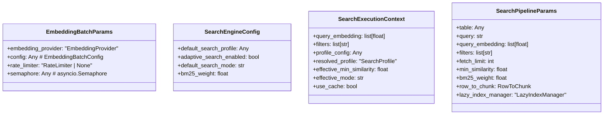

# File: `src/local_deepwiki/core/vectorstore/search_params.py`

## File Overview

This file defines a set of immutable parameter bundles used across the vectorstore subsystem for search and embedding operations. These dataclasses encapsulate long lists of related parameters into cohesive groups, reducing complexity and improving maintainability by eliminating "long parameter list" design smells.

The module is designed to support the core search pipeline and embedding batch processing workflows, providing a consistent interface for passing configuration and state across various components of the vectorstore system.

## Key Concepts

### Immutable Parameter Bundles

Each class in this file is a frozen dataclass (`@dataclass(frozen=True)`), which enforces immutability and ensures that parameter objects are not accidentally modified after creation. This design choice supports functional programming principles and improves reliability in concurrent or multi-step processes.

### Parameter Grouping Patterns

- **SearchPipelineParams**: Groups parameters used by low-level search functions ([`run_vector_pipeline`](search_pipeline.md), [`run_hybrid_pipeline`](search_pipeline.md), [`dispatch_search`](search_pipeline.md)). These include the query, its embedding, filters, and scoring thresholds.
- **SearchExecutionContext**: Encapsulates resolved search execution state, such as profile resolution, mode selection, and cache eligibility. This is used after the search engine resolves configurations.
- **EmbeddingBatchParams**: Bundles parameters for batch embedding operations, including provider, rate limiting, and concurrency controls.
- **SearchEngineConfig**: Holds scalar configuration options that are independent of injected collaborators, such as default profiles and search modes.

These abstractions align with the project's pattern of using immutable dataclasses to manage complex parameter sets and promote clear separation of concerns.

## Integration

This file is a core part of the vectorstore subsystem and integrates with several other modules:

- **Called by**:
  - `SearchPipelineParams` is used by `search_engine`, `search_pipeline`, and `test_search_params`
  - `SearchExecutionContext` is used by `search_engine`
  - `EmbeddingBatchParams` is used by `embedding` and `test_search_params`
  - `SearchEngineConfig` is used by `search_engine` and `store`

- **Imports**:
  - [`CodeChunk`](../../models/chunks.md) from `local_deepwiki.models` — used for type hints and data representation
  - [`LazyIndexManager`](maintenance.md) from `local_deepwiki.core.vectorstore.maintenance` — for index management
  - [`RateLimiter`](utils.md) from `local_deepwiki.core.vectorstore.utils` — for rate limiting in embeddings
  - [`EmbeddingProvider`](../../providers/base.md) from `local_deepwiki.providers.base` — for embedding capabilities
  - [`SearchProfile`](schema.md) from `.schema` — for defining search profiles and modes

These dependencies indicate that the file is tightly integrated into the vectorstore's search and embedding pipelines, where it provides a standardized way to pass parameters through the system.

## Design Notes

### Why Frozen Dataclasses?

The use of frozen dataclasses ensures that parameter objects are immutable, which is critical in a system that may be shared across threads or used in pipelines where consistency is required. This approach prevents accidental mutation of parameters and supports predictable behavior in asynchronous or multi-step operations.

### Separation of Concerns

Each class serves a distinct role:
- `SearchPipelineParams` handles the inputs for raw search logic.
- `SearchExecutionContext` holds the resolved state after profile and mode resolution.
- `EmbeddingBatchParams` manages embedding-specific configuration and controls.
- `SearchEngineConfig` holds scalar, global-level settings.

This separation allows each part of the system to operate with only the parameters it needs, reducing coupling and improving testability.

### Configuration Orthogonality

`SearchEngineConfig` is designed to hold scalar configuration options that are independent of the collaborators (e.g., table accessors or embedding providers). This design allows for easy configuration of the [`SearchEngine`](search_engine.md) without needing to inject complex objects, promoting flexibility and testability.

### Type Hints and Forward References

The use of forward references (e.g., [`LazyIndexManager`](maintenance.md), [`SearchProfile`](schema.md)) and `TYPE_CHECKING` guards ensures that type hints are available during development without creating circular imports, which is a common pattern in larger codebases.

## API Reference

### class `SearchPipelineParams`

Immutable bundle for the low-level search pipeline functions.  Groups the parameters that `[`run_vector_pipeline`](search_pipeline.md)`, `[`run_hybrid_pipeline`](search_pipeline.md)`, and `[`dispatch_search`](search_pipeline.md)` all share: the LanceDB table, query data, filters, fetch limit, scoring thresholds, and the infrastructure callbacks needed to convert rows and track latency.


<details>
<summary>View Source (lines 31-48) | <a href="https://github.com/UrbanDiver/local-deepwiki-mcp/blob/main/src/local_deepwiki/core/vectorstore/search_params.py#L31-L48">GitHub</a></summary>

```python
class SearchPipelineParams:
    """Immutable bundle for the low-level search pipeline functions.

    Groups the parameters that ``run_vector_pipeline``,
    ``run_hybrid_pipeline``, and ``dispatch_search`` all share: the LanceDB
    table, query data, filters, fetch limit, scoring thresholds, and the
    infrastructure callbacks needed to convert rows and track latency.
    """

    table: Any
    query: str
    query_embedding: list[float]
    filters: list[str]
    fetch_limit: int
    min_similarity: float
    bm25_weight: float
    row_to_chunk: RowToChunk
    lazy_index_manager: "LazyIndexManager"
```

</details>

### class `SearchExecutionContext`

Immutable bundle for the resolved search execution state.  Carries the post-resolution values that ``_execute_and_record`` and ``_record_and_store_results`` need after the `[`SearchEngine`](search_engine.md)` has resolved profiles, modes, and cache eligibility.


<details>
<summary>View Source (lines 52-66) | <a href="https://github.com/UrbanDiver/local-deepwiki-mcp/blob/main/src/local_deepwiki/core/vectorstore/search_params.py#L52-L66">GitHub</a></summary>

```python
class SearchExecutionContext:
    """Immutable bundle for the resolved search execution state.

    Carries the post-resolution values that ``_execute_and_record`` and
    ``_record_and_store_results`` need after the ``SearchEngine`` has
    resolved profiles, modes, and cache eligibility.
    """

    query_embedding: list[float]
    filters: list[str]
    profile_config: Any
    resolved_profile: "SearchProfile"
    effective_min_similarity: float
    effective_mode: str
    use_cache: bool
```

</details>

### class `EmbeddingBatchParams`

Immutable bundle for embedding batch execution parameters.  Groups the provider, configuration, and concurrency controls that `[`embed_single_batch_with_retry`](embedding.md)` and ``_run_parallel_batches`` need.


<details>
<summary>View Source (lines 70-80) | <a href="https://github.com/UrbanDiver/local-deepwiki-mcp/blob/main/src/local_deepwiki/core/vectorstore/search_params.py#L70-L80">GitHub</a></summary>

```python
class EmbeddingBatchParams:
    """Immutable bundle for embedding batch execution parameters.

    Groups the provider, configuration, and concurrency controls that
    ``embed_single_batch_with_retry`` and ``_run_parallel_batches`` need.
    """

    embedding_provider: "EmbeddingProvider"
    config: Any  # EmbeddingBatchConfig
    rate_limiter: "RateLimiter | None"
    semaphore: Any  # asyncio.Semaphore
```

</details>

### class `SearchEngineConfig`

Immutable configuration scalars for ``SearchEngine.__init__``.  Bundles the scalar configuration options that are orthogonal to the injected collaborator objects (table accessor, embedding provider, etc.).


<details>
<summary>View Source (lines 84-94) | <a href="https://github.com/UrbanDiver/local-deepwiki-mcp/blob/main/src/local_deepwiki/core/vectorstore/search_params.py#L84-L94">GitHub</a></summary>

```python
class SearchEngineConfig:
    """Immutable configuration scalars for ``SearchEngine.__init__``.

    Bundles the scalar configuration options that are orthogonal to the
    injected collaborator objects (table accessor, embedding provider, etc.).
    """

    default_search_profile: Any = None  # SearchProfile enum; default set at use site
    adaptive_search_enabled: bool = True
    default_search_mode: str = "vector"
    bm25_weight: float = 0.3
```

</details>

## Class Diagram



## Usage Examples

*Examples extracted from test files*

### Test basic construction with all fields

From `test_search_params.py::TestSearchPipelineParams::test_construction`:

```python
params = SearchPipelineParams(
    table=table,
    query="def main",
    query_embedding=[0.1, 0.2, 0.3],
    filters=["language = 'python'"],
    fetch_limit=50,
    min_similarity=0.5,
    bm25_weight=0.3,
    row_to_chunk=row_to_chunk,
    lazy_index_manager=lazy_mgr,
)

assert params.query == "def main"
assert params.query_embedding == [0.1, 0.2, 0.3]
```

### Test that fields cannot be mutated after construction

From `test_search_params.py::TestSearchPipelineParams::test_frozen_immutability`:

```python
params = SearchPipelineParams(
    table=MagicMock(),
    query="test",
    query_embedding=[0.1],
    filters=[],
    fetch_limit=10,
    min_similarity=0.3,
    bm25_weight=0.3,
    row_to_chunk=_make_row_to_chunk(),
    lazy_index_manager=_make_lazy_index_manager(),
)

with pytest.raises(FrozenInstanceError):
    params.query = "mutated"

with pytest.raises(FrozenInstanceError):
    params.fetch_limit = 999

with pytest.raises(FrozenInstanceError):
    params.min_similarity = 0.99
```

### Test basic construction with all fields

From `test_search_params.py::TestSearchExecutionContext::test_construction`:

```python
ctx = SearchExecutionContext(
    query_embedding=[0.1, 0.2],
    filters=["language = 'python'"],
    profile_config=MagicMock(),
    resolved_profile=SearchProfile.BALANCED,
    effective_min_similarity=0.5,
    effective_mode="hybrid",
    use_cache=True,
)

assert ctx.query_embedding == [0.1, 0.2]
assert ctx.filters == ["language = 'python'"]
```

### Test that fields cannot be mutated after construction

From `test_search_params.py::TestSearchExecutionContext::test_frozen_immutability`:

```python
ctx = SearchExecutionContext(
    query_embedding=[0.1],
    filters=[],
    profile_config=MagicMock(),
    resolved_profile=SearchProfile.FAST,
    effective_min_similarity=0.3,
    effective_mode="vector",
    use_cache=False,
)

with pytest.raises(FrozenInstanceError):
    ctx.effective_mode = "keyword"

with pytest.raises(FrozenInstanceError):
    ctx.use_cache = True

with pytest.raises(FrozenInstanceError):
    ctx.effective_min_similarity = 0.99
```

### Test basic construction with all fields

From `test_search_params.py::TestEmbeddingBatchParams::test_construction`:

```python
params = EmbeddingBatchParams(
    embedding_provider=provider,
    config=config,
    rate_limiter=rate_limiter,
    semaphore=semaphore,
)

assert params.embedding_provider is provider
assert params.config is config
```


## Last Modified

| Entity | Type | Author | Date | Commit |
|--------|------|--------|------|--------|
| `SearchPipelineParams` | class | Brian Breidenbach | yesterday | `b7856dc` refactor: introduce search ... |
| `SearchExecutionContext` | class | Brian Breidenbach | yesterday | `b7856dc` refactor: introduce search ... |
| `EmbeddingBatchParams` | class | Brian Breidenbach | yesterday | `b7856dc` refactor: introduce search ... |
| `SearchEngineConfig` | class | Brian Breidenbach | yesterday | `b7856dc` refactor: introduce search ... |

## Relevant Source Files

- `src/local_deepwiki/core/vectorstore/search_params.py:31-48`
