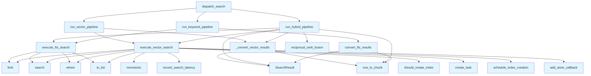

# File: `src/local_deepwiki/core/vectorstore/search_pipeline.py`

## File Overview

This module encapsulates the core search pipeline logic for performing vector, keyword (full-text), and hybrid searches against LanceDB. It was extracted from the [`SearchEngine`](search_engine.md) class to promote testability and modularity, allowing each search operation to be executed independently with explicit dependencies passed as parameters.

The primary responsibility of this module is to abstract low-level database interactions and result processing, providing a clean interface for different search modes—vector-only, keyword-only, and hybrid—while handling error cases, latency tracking, and result scoring.

## Key Concepts

### Search Modes
This module supports three distinct search modes:
- **Vector-only**: Uses semantic similarity via cosine distance in a vector space.
- **Keyword-only (BM25)**: Uses full-text search leveraging LanceDB's BM25 ranking.
- **Hybrid**: Combines both approaches using Reciprocal Rank Fusion (RRF) to merge results from both methods.

### Reciprocal Rank Fusion (RRF)
RRF is used in the hybrid pipeline to combine vector and full-text search results. It assigns a score based on the rank of each document in both search results, with higher weights for closer ranks. This approach balances relevance from both semantic and keyword perspectives.

### Latency Tracking and Lazy Indexing
The [`LazyIndexManager`](maintenance.md) is used to track search latencies and schedule index creation when high latency is detected. This enables proactive performance optimization without blocking search operations, improving long-term system responsiveness.

### Result Normalization
Scores are normalized across different search methods:
- BM25 scores are normalized to [0, 1] range.
- Vector similarity scores (cosine distance) are converted to a [0, 1] range using the formula `1.0 - dist * dist / 2.0`.

## Integration

This module is imported and used by the [`SearchEngine`](search_engine.md) class, which acts as the main entry point for search operations in the application. The functions defined here are not meant to be used directly by external consumers but are instead called through [`SearchEngine`](search_engine.md) or [`VectorStore`](store.md).

External usage includes:
- `execute_vector_search` is used by `test_search_decomposition`
- `execute_fts_search` is used by `search` and `test_hybrid_search`
- `convert_fts_results` is used by `search`
- `reciprocal_rank_fusion` is used by `search` and `test_hybrid_search`
- `run_vector_pipeline` is used by `test_search_params`
- `dispatch_search` is used by `search_engine` and `search_params`

These functions are tightly coupled with [`SearchPipelineParams`](search_params.md), which bundles all necessary parameters for a search operation, and [`LazyIndexManager`](maintenance.md), which handles performance monitoring and optimization.

## Design Notes

### Modularization and Testability
Functions are kept stateless and receive all required dependencies explicitly, making them easy to test in isolation. This design choice allows for unit testing without mocking complex class hierarchies.

### Error Handling
FTS search failures are gracefully handled by returning an empty list, ensuring that a single failure does not prevent the entire search pipeline from completing. Vector search does not have explicit error handling, suggesting it is expected to be robust or handled at a higher level.

### Latency Optimization
The [`LazyIndexManager`](maintenance.md) is used to record latency and conditionally schedule index creation. This is a proactive optimization technique that avoids impacting ongoing searches while still improving performance over time.

### RRF Smoothing Constant
The default value of `k=60` in `reciprocal_rank_fusion` is chosen to balance the influence of early vs. late rankings in both vector and FTS results. A higher `k` would give more weight to lower-ranked documents, which may dilute the relevance of top results.

### Score Normalization
Scores from different search methods (vector vs. BM25) are normalized to a common [0, 1] range for consistent scoring across pipelines. This enables fair comparison and combination of results from different search modes.

### Asynchronous Index Creation
When an index is scheduled, it is created asynchronously using `asyncio.create_task`. Exception handling is added via `task.add_done_callback(_log_task_exception)` to ensure that failures in background tasks are logged, though the main search flow is not blocked.

## API Reference

### Functions

#### `execute_vector_search`

```python
def execute_vector_search(table: Any, query_embedding: list[float], filters: list[str], fetch_limit: int, lazy_index_manager: "LazyIndexManager") -> list[dict[str, Any]]
```

Execute LanceDB vector search with latency tracking.


| Parameter | Type | Default | Description |
|-----------|------|---------|-------------|
| `table` | `Any` | - | LanceDB table to search. |
| `query_embedding` | `list[float]` | - | Query embedding vector. |
| `filters` | `list[str]` | - | List of LanceDB filter expressions to AND together. |
| `fetch_limit` | `int` | - | Maximum number of rows to retrieve from LanceDB. |
| `lazy_index_manager` | `"LazyIndexManager"` | - | Manager for recording latency and scheduling index creation when high latency is detected. |

**Returns:** `list[dict[str, Any]]`


<details>
<summary>View Source (lines 34-71) | <a href="https://github.com/UrbanDiver/local-deepwiki-mcp/blob/main/src/local_deepwiki/core/vectorstore/search_pipeline.py#L34-L71">GitHub</a></summary>

```python
def execute_vector_search(
    table: Any,
    query_embedding: list[float],
    filters: list[str],
    fetch_limit: int,
    lazy_index_manager: "LazyIndexManager",
) -> list[dict[str, Any]]:
    """Execute LanceDB vector search with latency tracking.

    Args:
        table: LanceDB table to search.
        query_embedding: Query embedding vector.
        filters: List of LanceDB filter expressions to AND together.
        fetch_limit: Maximum number of rows to retrieve from LanceDB.
        lazy_index_manager: Manager for recording latency and scheduling index
            creation when high latency is detected.

    Returns:
        Raw rows returned by LanceDB.
    """
    search = table.search(query_embedding).limit(fetch_limit)
    if filters:
        search = search.where(" AND ".join(filters))

    search_start = time.monotonic()
    results = search.to_list()
    search_latency_ms = (time.monotonic() - search_start) * 1000

    lazy_index_manager.record_search_latency(search_latency_ms)

    if lazy_index_manager.should_create_index():
        try:
            task = asyncio.create_task(lazy_index_manager.schedule_index_creation())
            task.add_done_callback(_log_task_exception)
        except RuntimeError:
            logger.debug("Cannot schedule lazy index creation: no event loop")

    return results
```

</details>

#### `execute_fts_search`

```python
def execute_fts_search(table: Any, query: str, filters: list[str], fetch_limit: int) -> list[dict[str, Any]]
```

Execute LanceDB full-text (BM25) search.


| Parameter | Type | Default | Description |
|-----------|------|---------|-------------|
| `table` | `Any` | - | LanceDB table to search. |
| `query` | `str` | - | Text query for full-text search. |
| `filters` | `list[str]` | - | List of LanceDB filter expressions to AND together. |
| `fetch_limit` | `int` | - | Maximum number of rows to retrieve from LanceDB. |

**Returns:** `list[dict[str, Any]]`


<details>
<summary>View Source (lines 74-98) | <a href="https://github.com/UrbanDiver/local-deepwiki-mcp/blob/main/src/local_deepwiki/core/vectorstore/search_pipeline.py#L74-L98">GitHub</a></summary>

```python
def execute_fts_search(
    table: Any,
    query: str,
    filters: list[str],
    fetch_limit: int,
) -> list[dict[str, Any]]:
    """Execute LanceDB full-text (BM25) search.

    Args:
        table: LanceDB table to search.
        query: Text query for full-text search.
        filters: List of LanceDB filter expressions to AND together.
        fetch_limit: Maximum number of rows to retrieve from LanceDB.

    Returns:
        Raw rows returned by LanceDB, or an empty list on failure.
    """
    try:
        search = table.search(query, query_type="fts").limit(fetch_limit)
        if filters:
            search = search.where(" AND ".join(filters))
        return search.to_list()
    except (RuntimeError, OSError, ValueError, AttributeError) as exc:
        logger.warning("FTS search failed (falling back to empty): %s", exc)
        return []
```

</details>

#### `convert_fts_results`

```python
def convert_fts_results(rows: list[dict[str, Any]], row_to_chunk: RowToChunk) -> list[SearchResult]
```

Convert FTS result rows to [SearchResult](../../handlers/types.md) objects with normalized scores.


| Parameter | Type | Default | Description |
|-----------|------|---------|-------------|
| `rows` | `list[dict[str, Any]]` | - | Raw FTS result rows from LanceDB. |
| `row_to_chunk` | `RowToChunk` | - | Callable that converts a raw row dict to a ``CodeChunk``. |

**Returns:** `list[SearchResult]`


<details>
<summary>View Source (lines 101-127) | <a href="https://github.com/UrbanDiver/local-deepwiki-mcp/blob/main/src/local_deepwiki/core/vectorstore/search_pipeline.py#L101-L127">GitHub</a></summary>

```python
def convert_fts_results(
    rows: list[dict[str, Any]],
    row_to_chunk: RowToChunk,
) -> list[SearchResult]:
    """Convert FTS result rows to SearchResult objects with normalized scores.

    Args:
        rows: Raw FTS result rows from LanceDB.
        row_to_chunk: Callable that converts a raw row dict to a ``CodeChunk``.

    Returns:
        List of ``SearchResult`` objects with BM25 scores normalised to [0, 1].
    """
    if not rows:
        return []

    max_score = max(row.get("_score", 0.0) for row in rows)
    if max_score <= 0:
        max_score = 1.0

    results: list[SearchResult] = []
    for row in rows:
        bm25_score = row.get("_score", 0.0)
        normalized = bm25_score / max_score
        chunk = row_to_chunk(row)
        results.append(SearchResult(chunk=chunk, score=normalized, highlights=[]))
    return results
```

</details>

#### `reciprocal_rank_fusion`

```python
def reciprocal_rank_fusion(vector_rows: list[dict[str, Any]], fts_rows: list[dict[str, Any]], k: int = 60, vector_weight: float = 1.0, fts_weight: float = 0.3) -> list[tuple[dict[str, Any], float]]
```

Merge vector and FTS results using Reciprocal Rank Fusion.


| Parameter | Type | Default | Description |
|-----------|------|---------|-------------|
| `vector_rows` | `list[dict[str, Any]]` | - | Raw rows from vector search, ordered by descending score. |
| `fts_rows` | `list[dict[str, Any]]` | - | Raw rows from FTS search, ordered by descending BM25 score. |
| `k` | `int` | `60` | RRF smoothing constant (default 60). |
| `vector_weight` | `float` | `1.0` | Weight applied to vector-search RRF scores. |
| `fts_weight` | `float` | `0.3` | Weight applied to FTS RRF scores. |

**Returns:** `list[tuple[dict[str, Any], float]]`


<details>
<summary>View Source (lines 130-168) | <a href="https://github.com/UrbanDiver/local-deepwiki-mcp/blob/main/src/local_deepwiki/core/vectorstore/search_pipeline.py#L130-L168">GitHub</a></summary>

```python
def reciprocal_rank_fusion(
    vector_rows: list[dict[str, Any]],
    fts_rows: list[dict[str, Any]],
    *,
    k: int = 60,
    vector_weight: float = 1.0,
    fts_weight: float = 0.3,
) -> list[tuple[dict[str, Any], float]]:
    """Merge vector and FTS results using Reciprocal Rank Fusion.

    Args:
        vector_rows: Raw rows from vector search, ordered by descending score.
        fts_rows: Raw rows from FTS search, ordered by descending BM25 score.
        k: RRF smoothing constant (default 60).
        vector_weight: Weight applied to vector-search RRF scores.
        fts_weight: Weight applied to FTS RRF scores.

    Returns:
        List of ``(row, merged_score)`` tuples, sorted by descending merged score.
        Scores are normalised to [0, 1].
    """
    scores: dict[str, float] = {}
    docs: dict[str, dict[str, Any]] = {}

    for rank, row in enumerate(vector_rows):
        doc_id = row["id"]
        scores[doc_id] = scores.get(doc_id, 0.0) + vector_weight / (k + rank + 1)
        docs[doc_id] = row

    for rank, row in enumerate(fts_rows):
        doc_id = row["id"]
        scores[doc_id] = scores.get(doc_id, 0.0) + fts_weight / (k + rank + 1)
        if doc_id not in docs:
            docs[doc_id] = row

    sorted_pairs = sorted(scores.items(), key=lambda x: x[1], reverse=True)

    max_score = sorted_pairs[0][1] if sorted_pairs else 1.0
    return [(docs[doc_id], score / max_score) for doc_id, score in sorted_pairs]
```

</details>

#### `run_keyword_pipeline`

```python
def run_keyword_pipeline(table: Any, query: str, filters: list[str], fetch_limit: int, row_to_chunk: RowToChunk) -> list[SearchResult]
```

Execute the keyword-only (BM25) search pipeline.


| Parameter | Type | Default | Description |
|-----------|------|---------|-------------|
| `table` | `Any` | - | LanceDB table to search. |
| `query` | `str` | - | Text query for full-text search. |
| `filters` | `list[str]` | - | List of LanceDB filter expressions to AND together. |
| `fetch_limit` | `int` | - | Maximum number of rows to retrieve from LanceDB. |
| `row_to_chunk` | `RowToChunk` | - | Callable that converts a raw row dict to a ``CodeChunk``. |

**Returns:** `list[SearchResult]`


<details>
<summary>View Source (lines 171-191) | <a href="https://github.com/UrbanDiver/local-deepwiki-mcp/blob/main/src/local_deepwiki/core/vectorstore/search_pipeline.py#L171-L191">GitHub</a></summary>

```python
def run_keyword_pipeline(
    table: Any,
    query: str,
    filters: list[str],
    fetch_limit: int,
    row_to_chunk: RowToChunk,
) -> list[SearchResult]:
    """Execute the keyword-only (BM25) search pipeline.

    Args:
        table: LanceDB table to search.
        query: Text query for full-text search.
        filters: List of LanceDB filter expressions to AND together.
        fetch_limit: Maximum number of rows to retrieve from LanceDB.
        row_to_chunk: Callable that converts a raw row dict to a ``CodeChunk``.

    Returns:
        List of ``SearchResult`` objects.
    """
    fts_rows = execute_fts_search(table, query, filters, fetch_limit)
    return convert_fts_results(fts_rows, row_to_chunk)
```

</details>

#### `run_hybrid_pipeline`

```python
def run_hybrid_pipeline(params: SearchPipelineParams) -> list[SearchResult]
```

Execute the hybrid (vector + BM25 with RRF) search pipeline.


| Parameter | Type | Default | Description |
|-----------|------|---------|-------------|
| `params` | `SearchPipelineParams` | - | Immutable bundle of all pipeline parameters. |

**Returns:** `list[SearchResult]`


<details>
<summary>View Source (lines 194-229) | <a href="https://github.com/UrbanDiver/local-deepwiki-mcp/blob/main/src/local_deepwiki/core/vectorstore/search_pipeline.py#L194-L229">GitHub</a></summary>

```python
def run_hybrid_pipeline(
    params: SearchPipelineParams,
) -> list[SearchResult]:
    """Execute the hybrid (vector + BM25 with RRF) search pipeline.

    Args:
        params: Immutable bundle of all pipeline parameters.

    Returns:
        List of ``SearchResult`` objects merged by RRF.
    """
    vector_rows = execute_vector_search(
        params.table,
        params.query_embedding,
        params.filters,
        params.fetch_limit,
        params.lazy_index_manager,
    )
    fts_rows = execute_fts_search(
        params.table, params.query, params.filters, params.fetch_limit
    )

    if not fts_rows:
        return _convert_vector_results(
            vector_rows, params.min_similarity, params.row_to_chunk
        )

    merged = reciprocal_rank_fusion(
        vector_rows,
        fts_rows,
        fts_weight=params.bm25_weight,
    )
    return [
        SearchResult(chunk=params.row_to_chunk(row), score=score, highlights=[])
        for row, score in merged
    ]
```

</details>

#### `run_vector_pipeline`

```python
def run_vector_pipeline(params: SearchPipelineParams) -> list[SearchResult]
```

Execute the vector-only (semantic) search pipeline.


| Parameter | Type | Default | Description |
|-----------|------|---------|-------------|
| `params` | `SearchPipelineParams` | - | Immutable bundle of all pipeline parameters. |

**Returns:** `list[SearchResult]`


<details>
<summary>View Source (lines 232-250) | <a href="https://github.com/UrbanDiver/local-deepwiki-mcp/blob/main/src/local_deepwiki/core/vectorstore/search_pipeline.py#L232-L250">GitHub</a></summary>

```python
def run_vector_pipeline(
    params: SearchPipelineParams,
) -> list[SearchResult]:
    """Execute the vector-only (semantic) search pipeline.

    Args:
        params: Immutable bundle of all pipeline parameters.

    Returns:
        List of ``SearchResult`` objects.
    """
    raw_rows = execute_vector_search(
        params.table,
        params.query_embedding,
        params.filters,
        params.fetch_limit,
        params.lazy_index_manager,
    )
    return _convert_vector_results(raw_rows, params.min_similarity, params.row_to_chunk)
```

</details>

#### `dispatch_search`

```python
def dispatch_search(mode: str, params: SearchPipelineParams) -> list[SearchResult]
```

Dispatch to the appropriate search pipeline based on mode.


| Parameter | Type | Default | Description |
|-----------|------|---------|-------------|
| `mode` | `str` | - | One of ``"vector"``, ``"keyword"``, or ``"hybrid"``. |
| `params` | `SearchPipelineParams` | - | Immutable bundle of all pipeline parameters. |

**Returns:** `list[SearchResult]`


<details>
<summary>View Source (lines 281-304) | <a href="https://github.com/UrbanDiver/local-deepwiki-mcp/blob/main/src/local_deepwiki/core/vectorstore/search_pipeline.py#L281-L304">GitHub</a></summary>

```python
def dispatch_search(
    mode: str,
    params: SearchPipelineParams,
) -> list[SearchResult]:
    """Dispatch to the appropriate search pipeline based on mode.

    Args:
        mode: One of ``"vector"``, ``"keyword"``, or ``"hybrid"``.
        params: Immutable bundle of all pipeline parameters.

    Returns:
        List of ``SearchResult`` objects from the chosen pipeline.
    """
    if mode == "keyword":
        return run_keyword_pipeline(
            params.table,
            params.query,
            params.filters,
            params.fetch_limit,
            params.row_to_chunk,
        )
    if mode == "hybrid":
        return run_hybrid_pipeline(params)
    return run_vector_pipeline(params)
```

</details>

## Call Graph



## Used By

Functions and methods in this file and their callers:

- **[`SearchResult`](../../handlers/types.md)**: called by `_convert_vector_results`, `convert_fts_results`, `run_hybrid_pipeline`
- **`_convert_vector_results`**: called by `run_hybrid_pipeline`, `run_vector_pipeline`
- **`add_done_callback`**: called by `execute_vector_search`
- **`convert_fts_results`**: called by `run_keyword_pipeline`
- **`create_task`**: called by `execute_vector_search`
- **`execute_fts_search`**: called by `run_hybrid_pipeline`, `run_keyword_pipeline`
- **`execute_vector_search`**: called by `run_hybrid_pipeline`, `run_vector_pipeline`
- **`limit`**: called by `execute_fts_search`, `execute_vector_search`
- **`monotonic`**: called by `execute_vector_search`
- **`reciprocal_rank_fusion`**: called by `run_hybrid_pipeline`
- **`record_search_latency`**: called by `execute_vector_search`
- **`row_to_chunk`**: called by `_convert_vector_results`, `convert_fts_results`, `run_hybrid_pipeline`
- **`run_hybrid_pipeline`**: called by `dispatch_search`
- **`run_keyword_pipeline`**: called by `dispatch_search`
- **`run_vector_pipeline`**: called by `dispatch_search`
- **`schedule_index_creation`**: called by `execute_vector_search`
- **`search`**: called by `execute_fts_search`, `execute_vector_search`
- **`should_create_index`**: called by `execute_vector_search`
- **`to_list`**: called by `execute_fts_search`, `execute_vector_search`
- **`where`**: called by `execute_fts_search`, `execute_vector_search`

## Last Modified

| Entity | Type | Author | Date | Commit |
|--------|------|--------|------|--------|
| `run_hybrid_pipeline` | function | Brian Breidenbach | yesterday | `b7856dc` refactor: introduce search ... |
| `run_vector_pipeline` | function | Brian Breidenbach | yesterday | `b7856dc` refactor: introduce search ... |
| `dispatch_search` | function | Brian Breidenbach | yesterday | `b7856dc` refactor: introduce search ... |
| `execute_vector_search` | function | Brian Breidenbach | 1 week ago | `fcd1b97` refactor: split RepositoryI... |
| `execute_fts_search` | function | Brian Breidenbach | 1 week ago | `fcd1b97` refactor: split RepositoryI... |
| `convert_fts_results` | function | Brian Breidenbach | 1 week ago | `fcd1b97` refactor: split RepositoryI... |
| `reciprocal_rank_fusion` | function | Brian Breidenbach | 1 week ago | `fcd1b97` refactor: split RepositoryI... |
| `run_keyword_pipeline` | function | Brian Breidenbach | 1 week ago | `fcd1b97` refactor: split RepositoryI... |
| `_convert_vector_results` | function | Brian Breidenbach | 1 week ago | `fcd1b97` refactor: split RepositoryI... |

## Additional Source Code

Source code for functions and methods not listed in the API Reference above.

#### `_convert_vector_results`

<details>
<summary>View Source (lines 253-278) | <a href="https://github.com/UrbanDiver/local-deepwiki-mcp/blob/main/src/local_deepwiki/core/vectorstore/search_pipeline.py#L253-L278">GitHub</a></summary>

```python
def _convert_vector_results(
    rows: list[dict[str, Any]],
    min_similarity: float,
    row_to_chunk: RowToChunk,
) -> list[SearchResult]:
    """Convert raw LanceDB vector-search rows to SearchResult objects.

    Filters out results whose cosine-similarity score is below ``min_similarity``.

    Args:
        rows: Raw rows from LanceDB vector search.
        min_similarity: Minimum cosine-similarity threshold.
        row_to_chunk: Callable that converts a raw row dict to a ``CodeChunk``.

    Returns:
        Filtered list of ``SearchResult`` objects.
    """
    results: list[SearchResult] = []
    for row in rows:
        dist = row.get("_distance", 0)
        score = 1.0 - dist * dist / 2.0
        if score < min_similarity:
            continue
        chunk = row_to_chunk(row)
        results.append(SearchResult(chunk=chunk, score=score, highlights=[]))
    return results
```

</details>

## Relevant Source Files

- `src/local_deepwiki/core/vectorstore/search_pipeline.py:34-71`
