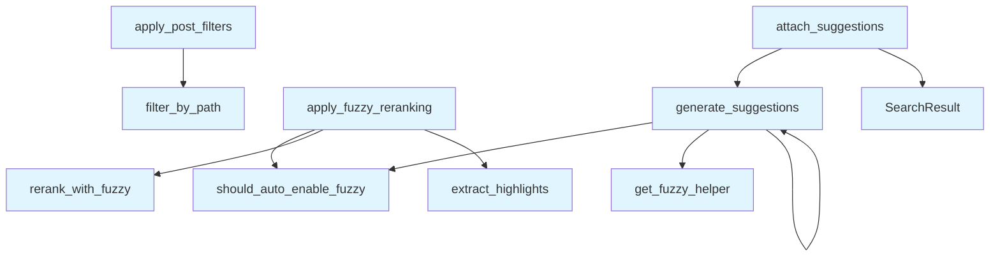

# File: `src/local_deepwiki/core/vectorstore/search_postprocess.py`

## File Overview

This file provides standalone functions for post-processing search results in the vector store search pipeline. It encapsulates logic for fuzzy re-ranking, path-based filtering, and generating "Did you mean?" suggestions to improve search quality.

The module was extracted from the [`SearchEngine`](search_engine.md) class to decouple the orchestration logic from the post-processing steps. This improves maintainability and testability by keeping [`SearchEngine`](search_engine.md) focused on coordinating the search flow.

## Key Concepts

### Fuzzy Re-ranking
The `apply_fuzzy_reranking` function applies fuzzy matching to re-rank search results when:
- Explicitly requested by the caller, or
- Automatically enabled due to poor initial result quality (all scores below a threshold).

This approach allows for more flexible and robust search results, especially when dealing with typos or slight variations in query phrasing.

### Path Filtering
The `apply_post_filters` function filters results based on a glob-style path pattern, allowing users to restrict results to specific directories or file types.

### Suggestion Generation
The `generate_suggestions` and `attach_suggestions` functions provide "Did you mean?" functionality:
- Suggestions are generated only when auto-fuzzy is enabled and results are poor.
- Suggestions are attached to the first result to guide the user without disrupting the rest of the list.

These functions use the [`FuzzySearchHelper`](../fuzzy_search.md) to compute similarity and generate relevant suggestions.

## Integration

This module is imported and used by [`SearchEngine`](search_engine.md) and [`VectorStore`](store.md) classes to handle post-retrieval logic. It is **not intended for direct import** by external consumers, who should instead go through [`SearchEngine`](search_engine.md) or [`VectorStore`](store.md).

### External Callers
- `apply_fuzzy_reranking` is used by:
  - `search`
  - `search_engine`
  - `test_search_decomposition`

### Dependencies
- Uses [`FuzzySearchHelper`](../fuzzy_search.md) and related utilities from `local_deepwiki.core.fuzzy_search`.
- Depends on [`FuzzySearchConfig`](../../config/models_search.md) for configuration.
- Logs using [`get_logger`](../../logging.md) from `local_deepwiki.logging`.

## Design Notes

### Why Separate Post-Processing?
The separation of post-processing logic into this module improves:
- **Maintainability**: Each function has a single responsibility.
- **Testability**: Functions can be unit-tested in isolation.
- **Reusability**: Logic can be reused in different search contexts.

### Auto-Fuzzy Logic
The [`should_auto_enable_fuzzy`](../fuzzy_search.md) check ensures that fuzzy re-ranking is only applied when results are of low quality. This prevents unnecessary overhead and maintains performance for high-quality results.

### Asynchronous Suggestions
The `generate_suggestions` and `attach_suggestions` functions are asynchronous, allowing them to fetch or compute suggestions without blocking the main search flow. They also include error handling to prevent failures in suggestion generation from breaking the search process.

### Immutable Result Updates
When attaching suggestions, a new [`SearchResult`](../../handlers/types.md) is created for the first result to maintain immutability, preserving the original data structure while enhancing it with suggestions.

### Edge Cases Handled
- Empty result lists are handled gracefully.
- Exceptions during suggestion generation are caught and logged, with `None` returned to prevent failures from breaking the search.
- Path filtering is skipped if no pattern is provided.
- Fuzzy re-ranking is skipped if no results are present.

## API Reference

### Functions

#### `apply_fuzzy_reranking`

```python
def apply_fuzzy_reranking(search_results: list[SearchResult], query: str, fuzzy_weight: float, use_fuzzy: bool, fuzzy_config: "FuzzySearchConfig") -> tuple[list[SearchResult], bool]
```

Apply fuzzy re-ranking if explicitly requested or auto-enabled.  When results are of poor quality (all scores below the auto-fuzzy threshold) and ``enable_auto_fuzzy`` is on in the config, fuzzy matching is applied automatically even if the caller did not request it.


| Parameter | Type | Default | Description |
|-----------|------|---------|-------------|
| `search_results` | `list[SearchResult]` | - | Current search results from the main pipeline. |
| `query` | `str` | - | Original search query. |
| `fuzzy_weight` | `float` | - | Weight given to the fuzzy score during re-ranking. |
| `use_fuzzy` | `bool` | - | Whether the caller explicitly requested fuzzy matching. |
| `fuzzy_config` | `"FuzzySearchConfig"` | - | Fuzzy search configuration. |

**Returns:** `tuple[list[[SearchResult](../../handlers/types.md)], bool]`


<details>
<summary>View Source (lines 28-77) | <a href="https://github.com/UrbanDiver/local-deepwiki-mcp/blob/main/src/local_deepwiki/core/vectorstore/search_postprocess.py#L28-L77">GitHub</a></summary>

```python
def apply_fuzzy_reranking(
    search_results: list[SearchResult],
    query: str,
    fuzzy_weight: float,
    *,
    use_fuzzy: bool,
    fuzzy_config: "FuzzySearchConfig",
) -> tuple[list[SearchResult], bool]:
    """Apply fuzzy re-ranking if explicitly requested or auto-enabled.

    When results are of poor quality (all scores below the auto-fuzzy threshold)
    and ``enable_auto_fuzzy`` is on in the config, fuzzy matching is applied
    automatically even if the caller did not request it.

    Args:
        search_results: Current search results from the main pipeline.
        query: Original search query.
        fuzzy_weight: Weight given to the fuzzy score during re-ranking.
        use_fuzzy: Whether the caller explicitly requested fuzzy matching.
        fuzzy_config: Fuzzy search configuration.

    Returns:
        Tuple of (reranked_results, auto_fuzzy_enabled).
        ``auto_fuzzy_enabled`` is True when fuzzy was turned on automatically.
    """
    from local_deepwiki.core.fuzzy_search import (
        extract_highlights,
        rerank_with_fuzzy,
        should_auto_enable_fuzzy,
    )

    auto_fuzzy_enabled = False

    if (
        fuzzy_config.enable_auto_fuzzy
        and not use_fuzzy
        and should_auto_enable_fuzzy(search_results, fuzzy_config.auto_fuzzy_threshold)
    ):
        auto_fuzzy_enabled = True
        logger.debug(
            "Auto-enabling fuzzy search due to poor results (best score below %s)",
            fuzzy_config.auto_fuzzy_threshold,
        )

    if (use_fuzzy or auto_fuzzy_enabled) and search_results:
        search_results = rerank_with_fuzzy(search_results, query, fuzzy_weight)
        for result in search_results:
            result.highlights = extract_highlights(result.chunk.content, query)

    return search_results, auto_fuzzy_enabled
```

</details>

#### `apply_post_filters`

```python
def apply_post_filters(results: list[SearchResult], path_pattern: str | None) -> list[SearchResult]
```

Apply post-retrieval filters (path pattern) to search results.


| Parameter | Type | Default | Description |
|-----------|------|---------|-------------|
| `results` | `list[SearchResult]` | - | Search results to filter. |
| `path_pattern` | `str | None` | - | Optional glob-style pattern to match against file paths. Results whose file path does not match are removed. |

**Returns:** `list[SearchResult]`


<details>
<summary>View Source (lines 80-98) | <a href="https://github.com/UrbanDiver/local-deepwiki-mcp/blob/main/src/local_deepwiki/core/vectorstore/search_postprocess.py#L80-L98">GitHub</a></summary>

```python
def apply_post_filters(
    results: list[SearchResult],
    path_pattern: str | None,
) -> list[SearchResult]:
    """Apply post-retrieval filters (path pattern) to search results.

    Args:
        results: Search results to filter.
        path_pattern: Optional glob-style pattern to match against file paths.
            Results whose file path does not match are removed.

    Returns:
        Filtered list of ``SearchResult`` objects.
    """
    if not path_pattern:
        return results
    from local_deepwiki.core.fuzzy_search import filter_by_path

    return filter_by_path(results, path_pattern)
```

</details>

#### `generate_suggestions`

```python
async def generate_suggestions(query: str, search_results: list[SearchResult], store: Any, fuzzy_config: "FuzzySearchConfig", get_fuzzy_helper: Callable[[Any], Coroutine[Any, Any, "FuzzySearchHelper"]]) -> list[str] | None
```

Generate 'Did you mean?' suggestions for poor-quality results.  Suggestions are only generated when ``enable_auto_fuzzy`` is True in the config and results look poor (below ``auto_fuzzy_threshold``).


| Parameter | Type | Default | Description |
|-----------|------|---------|-------------|
| `query` | `str` | - | Original search query. |
| `search_results` | `list[SearchResult]` | - | Current search results to evaluate quality. |
| `store` | `Any` | - | The ``VectorStore`` instance (passed to the fuzzy helper). |
| `fuzzy_config` | `"FuzzySearchConfig"` | - | Fuzzy search configuration. |
| `get_fuzzy_helper` | `Callable[[Any], Coroutine[Any, Any, "FuzzySearchHelper"]]` | - | Async callable that returns a ``FuzzySearchHelper`` for the given ``store``. |

**Returns:** `list[str] | None`


<details>
<summary>View Source (lines 101-145) | <a href="https://github.com/UrbanDiver/local-deepwiki-mcp/blob/main/src/local_deepwiki/core/vectorstore/search_postprocess.py#L101-L145">GitHub</a></summary>

```python
async def generate_suggestions(
    query: str,
    search_results: list[SearchResult],
    store: Any,
    fuzzy_config: "FuzzySearchConfig",
    get_fuzzy_helper: Callable[[Any], Coroutine[Any, Any, "FuzzySearchHelper"]],
) -> list[str] | None:
    """Generate 'Did you mean?' suggestions for poor-quality results.

    Suggestions are only generated when ``enable_auto_fuzzy`` is True in the
    config and results look poor (below ``auto_fuzzy_threshold``).

    Args:
        query: Original search query.
        search_results: Current search results to evaluate quality.
        store: The ``VectorStore`` instance (passed to the fuzzy helper).
        fuzzy_config: Fuzzy search configuration.
        get_fuzzy_helper: Async callable that returns a ``FuzzySearchHelper``
            for the given ``store``.

    Returns:
        List of suggestion strings, or None if no suggestions are generated.
    """
    from local_deepwiki.core.fuzzy_search import should_auto_enable_fuzzy

    if not (
        fuzzy_config.enable_auto_fuzzy
        and should_auto_enable_fuzzy(search_results, fuzzy_config.auto_fuzzy_threshold)
    ):
        return None

    try:
        fuzzy_helper = await get_fuzzy_helper(store)
        suggestions = fuzzy_helper.generate_suggestions(
            query,
            search_results,
            threshold=fuzzy_config.suggestion_threshold,
            max_suggestions=fuzzy_config.max_suggestions,
        )
        if suggestions:
            logger.debug("Generated suggestions: %s", suggestions)
        return suggestions or None
    except (RuntimeError, OSError, ValueError, KeyError) as e:
        logger.warning("Failed to generate suggestions: %s", e)
        return None
```

</details>

#### `attach_suggestions`

```python
async def attach_suggestions(query: str, search_results: list[SearchResult], store: Any, fuzzy_config: "FuzzySearchConfig", get_fuzzy_helper: Callable[[Any], Coroutine[Any, Any, "FuzzySearchHelper"]]) -> list[SearchResult]
```

Generate and attach 'Did you mean?' suggestions to the first result.  If suggestions are generated, a new `[`SearchResult`](../../handlers/types.md)` is created for the first result with the suggestions attached (immutable replacement), and returned alongside the remaining results unchanged.


| Parameter | Type | Default | Description |
|-----------|------|---------|-------------|
| `query` | `str` | - | Original search query. |
| `search_results` | `list[SearchResult]` | - | Current search results. |
| `store` | `Any` | - | The ``VectorStore`` instance. |
| `fuzzy_config` | `"FuzzySearchConfig"` | - | Fuzzy search configuration. |
| `get_fuzzy_helper` | `Callable[[Any], Coroutine[Any, Any, "FuzzySearchHelper"]]` | - | Async callable that returns a ``FuzzySearchHelper``. |

**Returns:** `list[SearchResult]`


<details>
<summary>View Source (lines 148-189) | <a href="https://github.com/UrbanDiver/local-deepwiki-mcp/blob/main/src/local_deepwiki/core/vectorstore/search_postprocess.py#L148-L189">GitHub</a></summary>

```python
async def attach_suggestions(
    query: str,
    search_results: list[SearchResult],
    store: Any,
    fuzzy_config: "FuzzySearchConfig",
    get_fuzzy_helper: Callable[[Any], Coroutine[Any, Any, "FuzzySearchHelper"]],
) -> list[SearchResult]:
    """Generate and attach 'Did you mean?' suggestions to the first result.

    If suggestions are generated, a new ``SearchResult`` is created for the
    first result with the suggestions attached (immutable replacement), and
    returned alongside the remaining results unchanged.

    Args:
        query: Original search query.
        search_results: Current search results.
        store: The ``VectorStore`` instance.
        fuzzy_config: Fuzzy search configuration.
        get_fuzzy_helper: Async callable that returns a ``FuzzySearchHelper``.

    Returns:
        Updated list of ``SearchResult`` objects (first result may carry
        ``suggestions``).
    """
    suggestions = await generate_suggestions(
        query, search_results, store, fuzzy_config, get_fuzzy_helper
    )
    if not suggestions:
        return search_results
    if search_results:
        first = search_results[0]
        return [
            SearchResult(
                chunk=first.chunk,
                score=first.score,
                highlights=first.highlights,
                suggestions=suggestions,
            ),
            *search_results[1:],
        ]
    logger.debug("No results but have suggestions: %s", suggestions)
    return search_results
```

</details>

## Call Graph



## Used By

Functions and methods in this file and their callers:

- **[`SearchResult`](../../handlers/types.md)**: called by `attach_suggestions`
- **[`extract_highlights`](../fuzzy_search.md)**: called by `apply_fuzzy_reranking`
- **[`filter_by_path`](../fuzzy_search.md)**: called by `apply_post_filters`
- **`generate_suggestions`**: called by `attach_suggestions`, `generate_suggestions`
- **`get_fuzzy_helper`**: called by `generate_suggestions`
- **[`rerank_with_fuzzy`](../fuzzy_search.md)**: called by `apply_fuzzy_reranking`
- **[`should_auto_enable_fuzzy`](../fuzzy_search.md)**: called by `apply_fuzzy_reranking`, `generate_suggestions`

## Last Modified

| Entity | Type | Author | Date | Commit |
|--------|------|--------|------|--------|
| `apply_fuzzy_reranking` | function | Brian Breidenbach | 1 week ago | `fcd1b97` refactor: split RepositoryI... |
| `apply_post_filters` | function | Brian Breidenbach | 1 week ago | `fcd1b97` refactor: split RepositoryI... |
| `generate_suggestions` | function | Brian Breidenbach | 1 week ago | `fcd1b97` refactor: split RepositoryI... |
| `attach_suggestions` | function | Brian Breidenbach | 1 week ago | `fcd1b97` refactor: split RepositoryI... |

## Relevant Source Files

- `src/local_deepwiki/core/vectorstore/search_postprocess.py:28-77`
