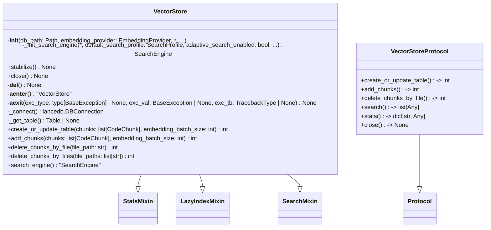

# File: `src/local_deepwiki/core/vectorstore/store.py`

## File Overview

This file implements the core `VectorStore` class, which serves as the primary interface for storing and retrieving code chunks using vector embeddings. It integrates with LanceDB for persistent storage and retrieval, supports lazy indexing for performance, and provides mechanisms for caching search results and managing embeddings.

The `VectorStore` class is designed to be a central component in a code search or documentation generation system, enabling fast similarity searches over large codebases by leveraging vector representations of code chunks.

## Key Concepts

### Vector Storage and Search
The `VectorStore` uses LanceDB as its underlying storage engine, leveraging its support for vector indexing and efficient similarity search. The design supports both vector and hybrid (vector + BM25) search modes, controlled by configuration parameters.

### Lazy Indexing
To optimize performance during bulk operations, the `VectorStore` implements lazy indexing via [`LazyIndexManager`](maintenance.md). This defers the creation of vector indexes until they are needed, preventing performance degradation during initial table creation or large batch updates. The `stabilize()` method ensures that any pending indexes are eagerly created before concurrent access.

### Search Caching and Adaptation
The `VectorStore` includes an adaptive search mechanism ([`AdaptiveSearcher`](cache.md)) that adjusts search depth based on query complexity and history. A [`SearchCache`](cache.md) is also used to cache search results, improving performance for repeated queries.

### Embedding Management
Embeddings are generated in batches using [`batch_embed`](embedding.md) to avoid memory issues and respect API rate limits. The [`EmbeddingProvider`](../../providers/base.md) abstraction allows for flexible embedding generation, supporting various models and services.

### Thread Safety
The `VectorStore` is thread-safe, using a reentrant lock (`threading.RLock`) to protect shared resources such as the database connection and table references. This ensures safe concurrent access in multi-threaded environments.

### Protocol-Based Interface
A `VectorStoreProtocol` is defined to decouple components that depend on `VectorStore` from its concrete implementation. This enables easier testing and dependency injection, aligning with good software design practices.

## Integration

This file is a core part of the `local_deepwiki` vector store system and is used by several other modules in the project:

- **Extractor modules**: The `VectorStore` is used by chunk extractors to store code chunks.
- **Lazy indexing and maintenance**: The [`LazyIndexManager`](maintenance.md) and related maintenance logic are integrated into the `VectorStore`.
- **Search engines**: The [`SearchEngine`](search_engine.md) is composed within the `VectorStore` to provide search capabilities.
- **Configuration loading**: The `VectorStore` consumes configurations from `local_deepwiki.config` to tailor its behavior.

The `VectorStore` is tightly coupled with `LanceDB`, [`local_deepwiki.models.CodeChunk`](../../models/chunks.md), and [`local_deepwiki.providers.base.EmbeddingProvider`](../../providers/base.md). It also integrates with caching, search parameter handling, and index management modules.

## Design Notes

### Why LanceDB?
LanceDB was chosen for its native support for vector indexing and efficient similarity search. It also provides a familiar SQL-like interface for data manipulation and supports efficient storage and retrieval of embeddings.

### Why Not Just Use a Simple In-Memory Store?
A simple in-memory store would not persist data across sessions or support large datasets. LanceDB provides persistence, efficient indexing, and scalability, making it suitable for large codebases.

### Why Lazy Indexing?
Lazy indexing prevents performance bottlenecks during bulk operations. It ensures that vector indexes are only created when needed, reducing overhead during initial table creation or large batch updates. The `stabilize()` method provides a way to eagerly create indexes when necessary.

### Why Not Use `async` for All Operations?
While the `VectorStore` supports async operations for embedding generation, the underlying database operations (LanceDB) are not fully async. The `async` methods are used to support embedding generation and to enable the async context manager (`__aenter__`, `__aexit__`) for resource management.

### Why Not Use `__del__` for Resource Management?
The `__del__` method is used as a safety net but should not be relied upon for resource management due to Python's garbage collection timing. The `close()` method and context manager (`__aenter__`, `__aexit__`) are the preferred ways to manage resources.

### Why Not Return Exact Counts in `delete_chunks_by_file`?
The `delete_chunks_by_file` and `delete_chunks_by_files` methods return 0 or the number of file paths processed, respectively, because LanceDB does not provide an efficient way to return the exact number of deleted rows without a separate count query. This avoids performance penalties for the common case where exact counts are not needed.

## API Reference

### class `VectorStoreProtocol`

**Inherits from:** `Protocol`

Protocol defining the public interface for vector stores.  Components that accept a vector store should use this Protocol as the type annotation instead of the concrete ``VectorStore`` class.  This enables dependency injection — in particular, test doubles can satisfy the protocol without subclassing the full implementation.  The ``@runtime_checkable`` decorator allows ``isinstance(obj, VectorStoreProtocol)`` checks in guards and diagnostic code.

**Methods:**


<details>
<summary>View Source (lines 40-79) | <a href="https://github.com/UrbanDiver/local-deepwiki-mcp/blob/main/src/local_deepwiki/core/vectorstore/store.py#L40-L79">GitHub</a></summary>

```python
class VectorStoreProtocol(Protocol):
    """Protocol defining the public interface for vector stores.

    Components that accept a vector store should use this Protocol as the
    type annotation instead of the concrete ``VectorStore`` class.  This
    enables dependency injection — in particular, test doubles can satisfy
    the protocol without subclassing the full implementation.

    The ``@runtime_checkable`` decorator allows ``isinstance(obj, VectorStoreProtocol)``
    checks in guards and diagnostic code.
    """

    async def create_or_update_table(
        self, chunks: list[CodeChunk], embedding_batch_size: int = 100
    ) -> int:
        """Create or replace the vector table from a list of code chunks."""
        ...

    async def add_chunks(
        self, chunks: list[CodeChunk], embedding_batch_size: int = 100
    ) -> int:
        """Append code chunks to the existing table."""
        ...

    async def delete_chunks_by_file(self, file_path: str) -> int:
        """Remove all chunks belonging to the given source file."""
        ...

    async def search(self, query: str, limit: int = 10, **kwargs: Any) -> list[Any]:
        """Return the top-k chunks most similar to *query*."""
        ...

    @property
    def stats(self) -> dict[str, Any]:
        """Return a snapshot of storage and search statistics."""
        ...

    def close(self) -> None:
        """Release any resources held by the store."""
        ...
```

</details>

#### `create_or_update_table`

```python
async def create_or_update_table(chunks: list[CodeChunk], embedding_batch_size: int = 100) -> int
```

Create or replace the vector table from a list of code chunks.


| Parameter | Type | Default | Description |
|-----------|------|---------|-------------|
| `chunks` | `list[CodeChunk]` | - | - |
| `embedding_batch_size` | `int` | `100` | - |


<details>
<summary>View Source (lines 40-79) | <a href="https://github.com/UrbanDiver/local-deepwiki-mcp/blob/main/src/local_deepwiki/core/vectorstore/store.py#L40-L79">GitHub</a></summary>

```python
class VectorStoreProtocol(Protocol):
    """Protocol defining the public interface for vector stores.

    Components that accept a vector store should use this Protocol as the
    type annotation instead of the concrete ``VectorStore`` class.  This
    enables dependency injection — in particular, test doubles can satisfy
    the protocol without subclassing the full implementation.

    The ``@runtime_checkable`` decorator allows ``isinstance(obj, VectorStoreProtocol)``
    checks in guards and diagnostic code.
    """

    async def create_or_update_table(
        self, chunks: list[CodeChunk], embedding_batch_size: int = 100
    ) -> int:
        """Create or replace the vector table from a list of code chunks."""
        ...

    async def add_chunks(
        self, chunks: list[CodeChunk], embedding_batch_size: int = 100
    ) -> int:
        """Append code chunks to the existing table."""
        ...

    async def delete_chunks_by_file(self, file_path: str) -> int:
        """Remove all chunks belonging to the given source file."""
        ...

    async def search(self, query: str, limit: int = 10, **kwargs: Any) -> list[Any]:
        """Return the top-k chunks most similar to *query*."""
        ...

    @property
    def stats(self) -> dict[str, Any]:
        """Return a snapshot of storage and search statistics."""
        ...

    def close(self) -> None:
        """Release any resources held by the store."""
        ...
```

</details>

#### `add_chunks`

```python
async def add_chunks(chunks: list[CodeChunk], embedding_batch_size: int = 100) -> int
```

Append code chunks to the existing table.


| Parameter | Type | Default | Description |
|-----------|------|---------|-------------|
| `chunks` | `list[CodeChunk]` | - | - |
| `embedding_batch_size` | `int` | `100` | - |


<details>
<summary>View Source (lines 40-79) | <a href="https://github.com/UrbanDiver/local-deepwiki-mcp/blob/main/src/local_deepwiki/core/vectorstore/store.py#L40-L79">GitHub</a></summary>

```python
class VectorStoreProtocol(Protocol):
    """Protocol defining the public interface for vector stores.

    Components that accept a vector store should use this Protocol as the
    type annotation instead of the concrete ``VectorStore`` class.  This
    enables dependency injection — in particular, test doubles can satisfy
    the protocol without subclassing the full implementation.

    The ``@runtime_checkable`` decorator allows ``isinstance(obj, VectorStoreProtocol)``
    checks in guards and diagnostic code.
    """

    async def create_or_update_table(
        self, chunks: list[CodeChunk], embedding_batch_size: int = 100
    ) -> int:
        """Create or replace the vector table from a list of code chunks."""
        ...

    async def add_chunks(
        self, chunks: list[CodeChunk], embedding_batch_size: int = 100
    ) -> int:
        """Append code chunks to the existing table."""
        ...

    async def delete_chunks_by_file(self, file_path: str) -> int:
        """Remove all chunks belonging to the given source file."""
        ...

    async def search(self, query: str, limit: int = 10, **kwargs: Any) -> list[Any]:
        """Return the top-k chunks most similar to *query*."""
        ...

    @property
    def stats(self) -> dict[str, Any]:
        """Return a snapshot of storage and search statistics."""
        ...

    def close(self) -> None:
        """Release any resources held by the store."""
        ...
```

</details>

#### `delete_chunks_by_file`

```python
async def delete_chunks_by_file(file_path: str) -> int
```

Remove all chunks belonging to the given source file.


| Parameter | Type | Default | Description |
|-----------|------|---------|-------------|
| `file_path` | `str` | - | - |


<details>
<summary>View Source (lines 40-79) | <a href="https://github.com/UrbanDiver/local-deepwiki-mcp/blob/main/src/local_deepwiki/core/vectorstore/store.py#L40-L79">GitHub</a></summary>

```python
class VectorStoreProtocol(Protocol):
    """Protocol defining the public interface for vector stores.

    Components that accept a vector store should use this Protocol as the
    type annotation instead of the concrete ``VectorStore`` class.  This
    enables dependency injection — in particular, test doubles can satisfy
    the protocol without subclassing the full implementation.

    The ``@runtime_checkable`` decorator allows ``isinstance(obj, VectorStoreProtocol)``
    checks in guards and diagnostic code.
    """

    async def create_or_update_table(
        self, chunks: list[CodeChunk], embedding_batch_size: int = 100
    ) -> int:
        """Create or replace the vector table from a list of code chunks."""
        ...

    async def add_chunks(
        self, chunks: list[CodeChunk], embedding_batch_size: int = 100
    ) -> int:
        """Append code chunks to the existing table."""
        ...

    async def delete_chunks_by_file(self, file_path: str) -> int:
        """Remove all chunks belonging to the given source file."""
        ...

    async def search(self, query: str, limit: int = 10, **kwargs: Any) -> list[Any]:
        """Return the top-k chunks most similar to *query*."""
        ...

    @property
    def stats(self) -> dict[str, Any]:
        """Return a snapshot of storage and search statistics."""
        ...

    def close(self) -> None:
        """Release any resources held by the store."""
        ...
```

</details>

#### `search`

```python
async def search(query: str, limit: int = 10) -> list[Any]
```

Return the top-k chunks most similar to *query*.


| Parameter | Type | Default | Description |
|-----------|------|---------|-------------|
| `query` | `str` | - | - |
| `limit` | `int` | `10` | - |


<details>
<summary>View Source (lines 40-79) | <a href="https://github.com/UrbanDiver/local-deepwiki-mcp/blob/main/src/local_deepwiki/core/vectorstore/store.py#L40-L79">GitHub</a></summary>

```python
class VectorStoreProtocol(Protocol):
    """Protocol defining the public interface for vector stores.

    Components that accept a vector store should use this Protocol as the
    type annotation instead of the concrete ``VectorStore`` class.  This
    enables dependency injection — in particular, test doubles can satisfy
    the protocol without subclassing the full implementation.

    The ``@runtime_checkable`` decorator allows ``isinstance(obj, VectorStoreProtocol)``
    checks in guards and diagnostic code.
    """

    async def create_or_update_table(
        self, chunks: list[CodeChunk], embedding_batch_size: int = 100
    ) -> int:
        """Create or replace the vector table from a list of code chunks."""
        ...

    async def add_chunks(
        self, chunks: list[CodeChunk], embedding_batch_size: int = 100
    ) -> int:
        """Append code chunks to the existing table."""
        ...

    async def delete_chunks_by_file(self, file_path: str) -> int:
        """Remove all chunks belonging to the given source file."""
        ...

    async def search(self, query: str, limit: int = 10, **kwargs: Any) -> list[Any]:
        """Return the top-k chunks most similar to *query*."""
        ...

    @property
    def stats(self) -> dict[str, Any]:
        """Return a snapshot of storage and search statistics."""
        ...

    def close(self) -> None:
        """Release any resources held by the store."""
        ...
```

</details>

#### `stats`

```python
def stats() -> dict[str, Any]
```

Return a snapshot of storage and search statistics.


<details>
<summary>View Source (lines 40-79) | <a href="https://github.com/UrbanDiver/local-deepwiki-mcp/blob/main/src/local_deepwiki/core/vectorstore/store.py#L40-L79">GitHub</a></summary>

```python
class VectorStoreProtocol(Protocol):
    """Protocol defining the public interface for vector stores.

    Components that accept a vector store should use this Protocol as the
    type annotation instead of the concrete ``VectorStore`` class.  This
    enables dependency injection — in particular, test doubles can satisfy
    the protocol without subclassing the full implementation.

    The ``@runtime_checkable`` decorator allows ``isinstance(obj, VectorStoreProtocol)``
    checks in guards and diagnostic code.
    """

    async def create_or_update_table(
        self, chunks: list[CodeChunk], embedding_batch_size: int = 100
    ) -> int:
        """Create or replace the vector table from a list of code chunks."""
        ...

    async def add_chunks(
        self, chunks: list[CodeChunk], embedding_batch_size: int = 100
    ) -> int:
        """Append code chunks to the existing table."""
        ...

    async def delete_chunks_by_file(self, file_path: str) -> int:
        """Remove all chunks belonging to the given source file."""
        ...

    async def search(self, query: str, limit: int = 10, **kwargs: Any) -> list[Any]:
        """Return the top-k chunks most similar to *query*."""
        ...

    @property
    def stats(self) -> dict[str, Any]:
        """Return a snapshot of storage and search statistics."""
        ...

    def close(self) -> None:
        """Release any resources held by the store."""
        ...
```

</details>

#### `close`

```python
def close() -> None
```

Release any resources held by the store.


<details>
<summary>View Source (lines 40-79) | <a href="https://github.com/UrbanDiver/local-deepwiki-mcp/blob/main/src/local_deepwiki/core/vectorstore/store.py#L40-L79">GitHub</a></summary>

```python
class VectorStoreProtocol(Protocol):
    """Protocol defining the public interface for vector stores.

    Components that accept a vector store should use this Protocol as the
    type annotation instead of the concrete ``VectorStore`` class.  This
    enables dependency injection — in particular, test doubles can satisfy
    the protocol without subclassing the full implementation.

    The ``@runtime_checkable`` decorator allows ``isinstance(obj, VectorStoreProtocol)``
    checks in guards and diagnostic code.
    """

    async def create_or_update_table(
        self, chunks: list[CodeChunk], embedding_batch_size: int = 100
    ) -> int:
        """Create or replace the vector table from a list of code chunks."""
        ...

    async def add_chunks(
        self, chunks: list[CodeChunk], embedding_batch_size: int = 100
    ) -> int:
        """Append code chunks to the existing table."""
        ...

    async def delete_chunks_by_file(self, file_path: str) -> int:
        """Remove all chunks belonging to the given source file."""
        ...

    async def search(self, query: str, limit: int = 10, **kwargs: Any) -> list[Any]:
        """Return the top-k chunks most similar to *query*."""
        ...

    @property
    def stats(self) -> dict[str, Any]:
        """Return a snapshot of storage and search statistics."""
        ...

    def close(self) -> None:
        """Release any resources held by the store."""
        ...
```

</details>

### class `VectorStore`

**Inherits from:** [`StatsMixin`](mixins/stats.md), [`LazyIndexMixin`](mixins/lazy_index.md), [`SearchMixin`](mixins/search.md)

Vector store using LanceDB for code chunk storage and semantic search.

**Methods:**


<details>
<summary>View Source (lines 109-543) | <a href="https://github.com/UrbanDiver/local-deepwiki-mcp/blob/main/src/local_deepwiki/core/vectorstore/store.py#L109-L543">GitHub</a></summary>

```python
class VectorStore(StatsMixin, LazyIndexMixin, SearchMixin):
    # Methods: __init__, _init_search_engine, stabilize, close, __del__, __aenter__, __aexit__, _connect, _get_table, create_or_update_table, add_chunks, delete_chunks_by_file, delete_chunks_by_files, search_engine
```

</details>

#### `__init__`

```python
def __init__(db_path: Path, embedding_provider: EmbeddingProvider, search_cache_config: SearchCacheConfig | None = None, embedding_batch_config: EmbeddingBatchConfig | None = None, lazy_index_config: LazyIndexConfig | None = None, fuzzy_search_config: FuzzySearchConfig | None = None, default_search_profile: SearchProfile = SearchProfile.BALANCED, adaptive_search_enabled: bool = True, default_search_mode: str = "vector", bm25_weight: float = 0.3)
```

Initialize the vector store.


| Parameter | Type | Default | Description |
|-----------|------|---------|-------------|
| `db_path` | `Path` | - | Path to the LanceDB database directory. |
| `embedding_provider` | `EmbeddingProvider` | - | Provider for generating embeddings. |
| `search_cache_config` | `SearchCacheConfig | None` | `None` | Optional search cache configuration. If None, uses default SearchCacheConfig. |
| `embedding_batch_config` | `EmbeddingBatchConfig | None` | `None` | Optional embedding batch configuration. If None, uses default EmbeddingBatchConfig. |
| `lazy_index_config` | `LazyIndexConfig | None` | `None` | Optional lazy index configuration. If None, uses default LazyIndexConfig (lazy indexing enabled). |
| `fuzzy_search_config` | `FuzzySearchConfig | None` | `None` | Optional fuzzy search configuration. If None, uses default FuzzySearchConfig. |
| `default_search_profile` | `SearchProfile` | `SearchProfile.BALANCED` | Default search profile for precision/recall trade-off. Defaults to SearchProfile.BALANCED. |
| `adaptive_search_enabled` | `bool` | `True` | Whether to enable adaptive search depth estimation. When enabled, search depth adjusts based on query complexity and history. |
| `default_search_mode` | `str` | `"vector"` | - |
| `bm25_weight` | `float` | `0.3` | - |


<details>
<summary>View Source (lines 114-193) | <a href="https://github.com/UrbanDiver/local-deepwiki-mcp/blob/main/src/local_deepwiki/core/vectorstore/store.py#L114-L193">GitHub</a></summary>

```python
def __init__(
        self,
        db_path: Path,
        embedding_provider: EmbeddingProvider,
        *,
        search_cache_config: SearchCacheConfig | None = None,
        embedding_batch_config: EmbeddingBatchConfig | None = None,
        lazy_index_config: LazyIndexConfig | None = None,
        fuzzy_search_config: FuzzySearchConfig | None = None,
        default_search_profile: SearchProfile = SearchProfile.BALANCED,
        adaptive_search_enabled: bool = True,
        default_search_mode: str = "vector",
        bm25_weight: float = 0.3,
    ):
        """Initialize the vector store.

        Args:
            db_path: Path to the LanceDB database directory.
            embedding_provider: Provider for generating embeddings.
            search_cache_config: Optional search cache configuration.
                If None, uses default SearchCacheConfig.
            embedding_batch_config: Optional embedding batch configuration.
                If None, uses default EmbeddingBatchConfig.
            lazy_index_config: Optional lazy index configuration.
                If None, uses default LazyIndexConfig (lazy indexing enabled).
            fuzzy_search_config: Optional fuzzy search configuration.
                If None, uses default FuzzySearchConfig.
            default_search_profile: Default search profile for precision/recall trade-off.
                Defaults to SearchProfile.BALANCED.
            adaptive_search_enabled: Whether to enable adaptive search depth estimation.
                When enabled, search depth adjusts based on query complexity and history.
        """
        self.db_path = db_path
        self.embedding_provider = embedding_provider
        self._db: lancedb.DBConnection | None = None
        self._table: Table | None = None
        self._lock = threading.RLock()  # Reentrant lock for nested calls

        # Initialize search cache
        if search_cache_config is None:
            search_cache_config = SearchCacheConfig()
        self._search_cache = SearchCache(search_cache_config)

        # Initialize embedding batch config
        if embedding_batch_config is None:
            embedding_batch_config = EmbeddingBatchConfig()
        self._embedding_batch_config = embedding_batch_config

        # Rate limiter (created on-demand if rate limiting is configured)
        self._rate_limiter: RateLimiter | None = None
        if embedding_batch_config.rate_limit_rpm is not None:
            self._rate_limiter = RateLimiter(embedding_batch_config.rate_limit_rpm)

        # Initialize lazy index manager
        self._lazy_index_manager = LazyIndexManager(self, lazy_index_config)

        # Initialize fuzzy search config
        if fuzzy_search_config is None:
            fuzzy_search_config = FuzzySearchConfig()
        self._fuzzy_search_config = fuzzy_search_config

        # Fuzzy search helper (lazy initialized when first needed)
        self._fuzzy_search_helper: "FuzzySearchHelper | None" = None

        # Search profile configuration
        self._default_search_profile = default_search_profile
        self._adaptive_search_enabled = adaptive_search_enabled

        # Hybrid search configuration
        self._default_search_mode = default_search_mode
        self._bm25_weight = bm25_weight

        self._adaptive_searcher = AdaptiveSearcher()
        self._adaptive_searcher.set_store(self)
        self._search_engine = self._init_search_engine(
            default_search_profile=default_search_profile,
            adaptive_search_enabled=adaptive_search_enabled,
            default_search_mode=default_search_mode,
            bm25_weight=bm25_weight,
        )
```

</details>

#### `stabilize`

```python
def stabilize() -> None
```

Force eager index creation and fully reopen the DB connection.  After bulk indexing, the lazy index manager may have a pending vector index.  If that index is created later (triggered by a search during wiki generation), LanceDB's ``create_index()`` compacts data fragments while concurrent readers are still using the old files, producing "Not found" IO errors.  This method prevents the race by: 1. Creating the vector index eagerly (if pending) so no background task fires during reads. 2. **Always** marking the index as created — even if index creation fails — so the lazy trigger never fires during concurrent reads. Searches degrade to brute-force (slower but correct). 3. Dropping the DB connection so the next access lazily reconnects with a fresh on-disk snapshot.  Safe to call multiple times (idempotent / no-op if already stable).


<details>
<summary>View Source (lines 222-281) | <a href="https://github.com/UrbanDiver/local-deepwiki-mcp/blob/main/src/local_deepwiki/core/vectorstore/store.py#L222-L281">GitHub</a></summary>

```python
def stabilize(self) -> None:
        """Force eager index creation and fully reopen the DB connection.

        After bulk indexing, the lazy index manager may have a pending vector
        index.  If that index is created later (triggered by a search during
        wiki generation), LanceDB's ``create_index()`` compacts data fragments
        while concurrent readers are still using the old files, producing
        "Not found" IO errors.

        This method prevents the race by:
        1. Creating the vector index eagerly (if pending) so no background
           task fires during reads.
        2. **Always** marking the index as created — even if index creation
           fails — so the lazy trigger never fires during concurrent reads.
           Searches degrade to brute-force (slower but correct).
        3. Dropping the DB connection so the next access lazily reconnects
           with a fresh on-disk snapshot.

        Safe to call multiple times (idempotent / no-op if already stable).
        """
        with self._lock:
            if self._table is None:
                return

            # Step 1: Force eager vector index creation if pending
            if self._lazy_index_manager.is_index_pending():
                try:
                    num_rows = self._table.count_rows()
                    if num_rows >= self._lazy_index_manager.config.min_rows:
                        import math

                        num_partitions = min(max(int(math.sqrt(num_rows)), 16), 256)
                        logger.info(
                            "stabilize: creating vector index eagerly "
                            "(%d rows, %d partitions)",
                            num_rows,
                            num_partitions,
                        )
                        self._table.create_index(
                            metric="L2",
                            num_partitions=num_partitions,
                            num_sub_vectors=16,
                        )
                except (RuntimeError, OSError) as exc:
                    logger.warning(
                        "stabilize: vector index creation failed (searches "
                        "will use brute-force): %s",
                        exc,
                    )

                # Always mark as created so the lazy trigger never fires
                # during concurrent reads.  Without a vector index LanceDB
                # falls back to brute-force search — slower but correct.
                self._lazy_index_manager.mark_index_created()

            # Step 2: Drop the entire DB connection so the next access
            # reconnects with a fresh handle that sees the final on-disk state.
            logger.info("stabilize: closing DB connection for fresh reconnect")
            self._table = None
            self._db = None
```

</details>

#### `close`

```python
def close() -> None
```

Close the vector store and release all resources.  Clears internal references to the database connection, table, and fuzzy search helper. Invalidates the search cache and resets the adaptive searcher state. Safe to call multiple times (idempotent).  After closing, the VectorStore can still be used -- the lazy ``_connect()`` method will re-establish the connection on next access.


<details>
<summary>View Source (lines 283-299) | <a href="https://github.com/UrbanDiver/local-deepwiki-mcp/blob/main/src/local_deepwiki/core/vectorstore/store.py#L283-L299">GitHub</a></summary>

```python
def close(self) -> None:
        """Close the vector store and release all resources.

        Clears internal references to the database connection, table, and
        fuzzy search helper. Invalidates the search cache and resets the
        adaptive searcher state. Safe to call multiple times (idempotent).

        After closing, the VectorStore can still be used -- the lazy
        ``_connect()`` method will re-establish the connection on next access.
        """
        with self._lock:
            self._table = None
            self._db = None
            self._fuzzy_search_helper = None
            self._search_engine.fuzzy_search_helper = None
            self._search_cache.invalidate()
            self._adaptive_searcher.reset()
```

</details>

#### `create_or_update_table`

```python
async def create_or_update_table(chunks: list[CodeChunk], embedding_batch_size: int = 100) -> int
```

Create or update the vector table with code chunks.


| Parameter | Type | Default | Description |
|-----------|------|---------|-------------|
| `chunks` | `list[CodeChunk]` | - | List of code chunks to store. |
| `embedding_batch_size` | `int` | `100` | Batch size for embedding generation to avoid OOM. |


<details>
<summary>View Source (lines 354-414) | <a href="https://github.com/UrbanDiver/local-deepwiki-mcp/blob/main/src/local_deepwiki/core/vectorstore/store.py#L354-L414">GitHub</a></summary>

```python
async def create_or_update_table(
        self, chunks: list[CodeChunk], embedding_batch_size: int = 100
    ) -> int:
        """Create or update the vector table with code chunks.

        Args:
            chunks: List of code chunks to store.
            embedding_batch_size: Batch size for embedding generation to avoid OOM.

        Returns:
            Number of chunks stored.
        """
        if not chunks:
            logger.debug("No chunks to store, skipping table creation")
            return 0

        logger.info("Creating/updating vector table with %s chunks", len(chunks))
        db = self._connect()

        # Generate embeddings in batches to avoid OOM and API limits
        texts = [_chunk_to_text(chunk) for chunk in chunks]
        embeddings = await batch_embed(
            texts,
            self.embedding_provider,
            self._embedding_batch_config,
            self._rate_limiter,
            batch_size=embedding_batch_size,
            log_progress=True,
        )

        # Prepare data for LanceDB
        data = [
            chunk.to_vector_record(vector=embedding)
            for chunk, embedding in zip(chunks, embeddings)
        ]

        # Reset lazy index manager state since we're creating a fresh table
        self._lazy_index_manager.reset()

        # Drop existing table and create new one (thread-safe)
        with self._lock:
            if self.TABLE_NAME in db.list_tables().tables:
                db.drop_table(self.TABLE_NAME)

            self._table = db.create_table(self.TABLE_NAME, data)

        # Invalidate search cache since index has changed
        self._search_cache.invalidate()

        # Create scalar indexes for efficient lookups
        create_scalar_indexes(self._table)

        # Eagerly create the vector index after bulk table creation.
        # Why eager even when lazy indexing is enabled: create_or_update_table
        # is always a bulk operation. If deferred, concurrent searches trigger
        # lazy index creation mid-wiki-generation, causing IO errors.
        num_rows = len(data)
        if self._table is not None:
            create_vector_index(self._table, num_rows, self._lazy_index_manager)

        return len(data)
```

</details>

#### `add_chunks`

```python
async def add_chunks(chunks: list[CodeChunk], embedding_batch_size: int = 100) -> int
```

Add chunks to existing table.


| Parameter | Type | Default | Description |
|-----------|------|---------|-------------|
| `chunks` | `list[CodeChunk]` | - | List of code chunks to add. |
| `embedding_batch_size` | `int` | `100` | Batch size for embedding generation to avoid OOM. |


<details>
<summary>View Source (lines 416-465) | <a href="https://github.com/UrbanDiver/local-deepwiki-mcp/blob/main/src/local_deepwiki/core/vectorstore/store.py#L416-L465">GitHub</a></summary>

```python
async def add_chunks(
        self, chunks: list[CodeChunk], embedding_batch_size: int = 100
    ) -> int:
        """Add chunks to existing table.

        Args:
            chunks: List of code chunks to add.
            embedding_batch_size: Batch size for embedding generation to avoid OOM.

        Returns:
            Number of chunks added.
        """
        if not chunks:
            return 0

        logger.debug("Adding %s chunks to existing table", len(chunks))
        table = self._get_table()
        if table is None:
            return await self.create_or_update_table(chunks, embedding_batch_size)

        # Generate embeddings in batches to avoid OOM and API limits
        texts = [_chunk_to_text(chunk) for chunk in chunks]
        embeddings = await batch_embed(
            texts,
            self.embedding_provider,
            self._embedding_batch_config,
            self._rate_limiter,
            batch_size=embedding_batch_size,
        )

        # Prepare data
        data = [
            chunk.to_vector_record(vector=embedding)
            for chunk, embedding in zip(chunks, embeddings)
        ]

        table.add(data)

        # Invalidate search cache since index has changed
        self._search_cache.invalidate()

        # Lazy path for incremental additions
        num_rows = table.count_rows()
        if (
            self._lazy_index_manager.config.enabled
            and num_rows >= self._lazy_index_manager.config.min_rows
        ):
            self._lazy_index_manager.mark_index_pending()

        return len(data)
```

</details>

#### `delete_chunks_by_file`

```python
async def delete_chunks_by_file(file_path: str) -> int
```

Delete all chunks for a specific file.


| Parameter | Type | Default | Description |
|-----------|------|---------|-------------|
| `file_path` | `str` | - | The file path. |


<details>
<summary>View Source (lines 467-492) | <a href="https://github.com/UrbanDiver/local-deepwiki-mcp/blob/main/src/local_deepwiki/core/vectorstore/store.py#L467-L492">GitHub</a></summary>

```python
async def delete_chunks_by_file(self, file_path: str) -> int:
        """Delete all chunks for a specific file.

        Args:
            file_path: The file path.

        Returns:
            Number of chunks deleted (estimated, may be 0 if table doesn't exist).
        """
        table = self._get_table()
        if table is None:
            return 0

        # Sanitize path to prevent injection
        safe_path = _sanitize_string_value(file_path)

        # Delete matching rows directly without pre-counting
        # LanceDB delete is idempotent - no error if no rows match
        table.delete(f"file_path = '{safe_path}'")

        # Invalidate search cache since index has changed
        self._search_cache.invalidate()

        # Return 0 since we don't know exact count without expensive query
        # Callers that need counts should use get_chunks_by_file first
        return 0
```

</details>

#### `delete_chunks_by_files`

```python
async def delete_chunks_by_files(file_paths: list[str]) -> int
```

Delete all chunks for multiple files in a single batch operation.  This is more efficient than calling delete_chunks_by_file in a loop as it constructs a single filter expression for all files.


| Parameter | Type | Default | Description |
|-----------|------|---------|-------------|
| `file_paths` | `list[str]` | - | List of file paths to delete chunks for. |


<details>
<summary>View Source (lines 494-529) | <a href="https://github.com/UrbanDiver/local-deepwiki-mcp/blob/main/src/local_deepwiki/core/vectorstore/store.py#L494-L529">GitHub</a></summary>

```python
async def delete_chunks_by_files(self, file_paths: list[str]) -> int:
        """Delete all chunks for multiple files in a single batch operation.

        This is more efficient than calling delete_chunks_by_file in a loop
        as it constructs a single filter expression for all files.

        Args:
            file_paths: List of file paths to delete chunks for.

        Returns:
            Number of file paths processed (not chunk count).
        """
        if not file_paths:
            return 0

        table = self._get_table()
        if table is None:
            return 0

        # Build a single OR filter for all file paths
        # Sanitize each path to prevent injection
        safe_paths = [_sanitize_string_value(path) for path in file_paths]

        # Use IN clause for efficiency: file_path IN ('path1', 'path2', ...)
        # LanceDB supports SQL-like syntax
        paths_list = ", ".join(f"'{path}'" for path in safe_paths)
        filter_expr = f"file_path IN ({paths_list})"

        # Single delete operation for all matching files
        table.delete(filter_expr)

        # Invalidate search cache since index has changed
        self._search_cache.invalidate()

        logger.debug("Batch deleted chunks for %s files", len(file_paths))
        return len(file_paths)
```

</details>

#### `search_engine`

```python
def search_engine() -> "SearchEngine"
```

Return the underlying [SearchEngine](search_engine.md) instance.


<details>
<summary>View Source (lines 541-543) | <a href="https://github.com/UrbanDiver/local-deepwiki-mcp/blob/main/src/local_deepwiki/core/vectorstore/store.py#L541-L543">GitHub</a></summary>

```python
def search_engine(self) -> "SearchEngine":
        """Return the underlying SearchEngine instance."""
        return self._search_engine
```

</details>

## Class Diagram



## Call Graph

```mermaid
flowchart TD
    N0[AdaptiveSearcher]
    N1[EmbeddingBatchConfig]
    N2[FuzzySearchConfig]
    N3[LazyIndexManager]
    N4[RLock]
    N5[RateLimiter]
    N6[SearchCache]
    N7[SearchCacheConfig]
    N8[VectorStore.__init__]
    N9[VectorStore._connect]
    N10[VectorStore._get_table]
    N11[VectorStore._init_search_en...]
    N12[VectorStore.add_chunks]
    N13[VectorStore.close]
    N14[VectorStore.create_or_updat...]
    N15[VectorStore.delete_chunks_b...]
    N16[VectorStore.delete_chunks_b...]
    N17[VectorStore.stabilize]
    N18[_chunk_to_text]
    N19[_connect]
    N20[_get_table]
    N21[_sanitize_string_value]
    N22[batch_embed]
    N23[count_rows]
    N24[delete]
    N25[invalidate]
    N26[list_tables]
    N27[reset]
    N28[set_store]
    N29[to_vector_record]
    N8 --> N4
    N8 --> N7
    N8 --> N6
    N8 --> N1
    N8 --> N5
    N8 --> N3
    N8 --> N2
    N8 --> N0
    N8 --> N28
    N17 --> N23
    N13 --> N25
    N13 --> N27
    N10 --> N19
    N10 --> N26
    N14 --> N19
    N14 --> N18
    N14 --> N22
    N14 --> N29
    N14 --> N27
    N14 --> N26
    N14 --> N25
    N12 --> N20
    N12 --> N18
    N12 --> N22
    N12 --> N29
    N12 --> N25
    N12 --> N23
    N15 --> N20
    N15 --> N21
    N15 --> N24
    N15 --> N25
    N16 --> N20
    N16 --> N21
    N16 --> N24
    N16 --> N25
    classDef func fill:#e1f5fe
    class N0,N1,N2,N3,N4,N5,N6,N7,N18,N19,N20,N21,N22,N23,N24,N25,N26,N27,N28,N29 func
    classDef method fill:#fff3e0
    class N8,N9,N10,N11,N12,N13,N14,N15,N16,N17 method
```



## Used By

Functions and methods in this file and their callers:

- **[`AdaptiveSearcher`](cache.md)**: called by `VectorStore.__init__`
- **[`EmbeddingBatchConfig`](../../config/processing_models.md)**: called by `VectorStore.__init__`
- **[`FuzzySearchConfig`](../../config/models_search.md)**: called by `VectorStore.__init__`
- **[`LazyIndexManager`](maintenance.md)**: called by `VectorStore.__init__`
- **`RLock`**: called by `VectorStore.__init__`
- **[`RateLimiter`](utils.md)**: called by `VectorStore.__init__`
- **[`SearchCache`](cache.md)**: called by `VectorStore.__init__`
- **[`SearchCacheConfig`](../../config/models_search.md)**: called by `VectorStore.__init__`
- **[`SearchEngine`](search_engine.md)**: called by `VectorStore._init_search_engine`
- **[`SearchEngineConfig`](search_params.md)**: called by `VectorStore._init_search_engine`
- **`_chunk_to_text`**: called by `VectorStore.add_chunks`, `VectorStore.create_or_update_table`
- **`_connect`**: called by `VectorStore._get_table`, `VectorStore.create_or_update_table`
- **`_ensure_indexes_on_table`**: called by `VectorStore._get_table`
- **`_get_table`**: called by `VectorStore.add_chunks`, `VectorStore.delete_chunks_by_file`, `VectorStore.delete_chunks_by_files`
- **`_init_search_engine`**: called by `VectorStore.__init__`
- **`_sanitize_string_value`**: called by `VectorStore.delete_chunks_by_file`, `VectorStore.delete_chunks_by_files`
- **`add`**: called by `VectorStore.add_chunks`
- **[`batch_embed`](embedding.md)**: called by `VectorStore.add_chunks`, `VectorStore.create_or_update_table`
- **`connect`**: called by `VectorStore._connect`
- **`count_rows`**: called by `VectorStore.add_chunks`, `VectorStore.stabilize`
- **`create_index`**: called by `VectorStore.stabilize`
- **`create_or_update_table`**: called by `VectorStore.add_chunks`
- **[`create_scalar_indexes`](indexes.md)**: called by `VectorStore.create_or_update_table`
- **`create_table`**: called by `VectorStore.create_or_update_table`
- **[`create_vector_index`](indexes.md)**: called by `VectorStore.create_or_update_table`
- **`delete`**: called by `VectorStore.delete_chunks_by_file`, `VectorStore.delete_chunks_by_files`
- **`drop_table`**: called by `VectorStore.create_or_update_table`
- **`invalidate`**: called by `VectorStore.add_chunks`, `VectorStore.close`, `VectorStore.create_or_update_table`, `VectorStore.delete_chunks_by_file`, `VectorStore.delete_chunks_by_files`
- **`is_index_pending`**: called by `VectorStore.stabilize`
- **`list_tables`**: called by `VectorStore._get_table`, `VectorStore.create_or_update_table`
- **`mark_index_created`**: called by `VectorStore.stabilize`
- **`mark_index_pending`**: called by `VectorStore.add_chunks`
- **`mkdir`**: called by `VectorStore._connect`
- **`open_table`**: called by `VectorStore._get_table`
- **`reset`**: called by `VectorStore.close`, `VectorStore.create_or_update_table`
- **`set_store`**: called by `VectorStore.__init__`
- **`sqrt`**: called by `VectorStore.stabilize`
- **`to_vector_record`**: called by `VectorStore.add_chunks`, `VectorStore.create_or_update_table`

## Last Modified

| Entity | Type | Author | Date | Commit |
|--------|------|--------|------|--------|
| `VectorStore` | class | Brian Breidenbach | yesterday | `1eef062` refactor: complete Grade A ... |
| `_get_table` | method | Brian Breidenbach | yesterday | `1eef062` refactor: complete Grade A ... |
| `create_or_update_table` | method | Brian Breidenbach | yesterday | `1eef062` refactor: complete Grade A ... |
| `add_chunks` | method | Brian Breidenbach | yesterday | `1eef062` refactor: complete Grade A ... |
| `_init_search_engine` | method | Brian Breidenbach | yesterday | `b7856dc` refactor: introduce search ... |
| `__init__` | method | Brian Breidenbach | yesterday | `29ae780` refactor: decompose long me... |
| `VectorStoreProtocol` | class | Brian Breidenbach | yesterday | `515ba66` refactor: improve coupling ... |
| `_chunk_to_text` | function | Brian Breidenbach | 1 week ago | `8b43ad9` refactor: reduce VectorStor... |
| `search_engine` | method | Brian Breidenbach | 1 week ago | `a08a9aa` refactor: remove SearchMixi... |
| `close` | method | Brian Breidenbach | 1 week ago | `fd8bb32` fix: code quality — consoli... |
| `stabilize` | method | Brian Breidenbach | Feb 23, 2026 | `c6fe2bd` refactor: split oversized m... |
| `__del__` | method | Brian Breidenbach | Feb 23, 2026 | `c6fe2bd` refactor: split oversized m... |
| `__aexit__` | method | Brian Breidenbach | Feb 20, 2026 | `8182b15` refactor: Pythonic API impr... |
| `delete_chunks_by_files` | method | Brian Breidenbach | Feb 11, 2026 | `ba96da1` fix: publication plan P0-P2... |
| `__aenter__` | method | Brian Breidenbach | Feb 10, 2026 | `c619bd3` fix: add VectorStore close(... |
| `delete_chunks_by_file` | method | Brian Breidenbach | Jan 26, 2026 | `d7c79d3` Add three quick-win enhance... |
| `_connect` | method | Brian Breidenbach | Jan 26, 2026 | `8817f7b` Add thread safety to Vector... |

## Additional Source Code

Source code for functions and methods not listed in the API Reference above.

#### `_chunk_to_text`

<details>
<summary>View Source (lines 82-106) | <a href="https://github.com/UrbanDiver/local-deepwiki-mcp/blob/main/src/local_deepwiki/core/vectorstore/store.py#L82-L106">GitHub</a></summary>

```python
def _chunk_to_text(chunk: CodeChunk) -> str:
    """Convert a chunk to text for embedding.

    Args:
        chunk: The code chunk.

    Returns:
        Text representation for embedding.
    """
    parts = []

    if chunk.name:
        parts.append(f"{chunk.chunk_type.value}: {chunk.name}")

    if chunk.parent_name:
        parts.append(f"in {chunk.parent_name}")

    parts.append(f"({chunk.language.value})")

    if chunk.docstring:
        parts.append(f"\n{chunk.docstring}")

    parts.append(f"\n{chunk.content}")

    return " ".join(parts)
```

</details>


#### `_init_search_engine`

<details>
<summary>View Source (lines 195-220) | <a href="https://github.com/UrbanDiver/local-deepwiki-mcp/blob/main/src/local_deepwiki/core/vectorstore/store.py#L195-L220">GitHub</a></summary>

```python
def _init_search_engine(
        self,
        *,
        default_search_profile: SearchProfile,
        adaptive_search_enabled: bool,
        default_search_mode: str,
        bm25_weight: float,
    ) -> SearchEngine:
        """Build and return the composition-based SearchEngine with explicit deps."""
        from .search_params import SearchEngineConfig

        return SearchEngine(
            get_table=self._get_table,
            row_to_chunk=self._row_to_chunk,
            embedding_provider=self.embedding_provider,
            get_search_cache=lambda: self._search_cache,
            fuzzy_search_config=self._fuzzy_search_config,
            adaptive_searcher=self._adaptive_searcher,
            lazy_index_manager=self._lazy_index_manager,
            config=SearchEngineConfig(
                default_search_profile=default_search_profile,
                adaptive_search_enabled=adaptive_search_enabled,
                default_search_mode=default_search_mode,
                bm25_weight=bm25_weight,
            ),
        )
```

</details>


#### `__del__`

<details>
<summary>View Source (lines 301-306) | <a href="https://github.com/UrbanDiver/local-deepwiki-mcp/blob/main/src/local_deepwiki/core/vectorstore/store.py#L301-L306">GitHub</a></summary>

```python
def __del__(self) -> None:
        """Safety net to release resources on garbage collection."""
        try:
            self.close()
        except Exception:  # noqa: BLE001 — destructor must not fail during interpreter shutdown when objects may already be gone
            pass
```

</details>


#### `__aenter__`

<details>
<summary>View Source (lines 308-314) | <a href="https://github.com/UrbanDiver/local-deepwiki-mcp/blob/main/src/local_deepwiki/core/vectorstore/store.py#L308-L314">GitHub</a></summary>

```python
async def __aenter__(self) -> "VectorStore":
        """Enter the async context manager.

        Returns:
            This VectorStore instance.
        """
        return self
```

</details>


#### `__aexit__`

<details>
<summary>View Source (lines 316-323) | <a href="https://github.com/UrbanDiver/local-deepwiki-mcp/blob/main/src/local_deepwiki/core/vectorstore/store.py#L316-L323">GitHub</a></summary>

```python
async def __aexit__(
        self,
        exc_type: type[BaseException] | None,
        exc_val: BaseException | None,
        exc_tb: TracebackType | None,
    ) -> None:
        """Exit the async context manager, closing the store."""
        self.close()
```

</details>


#### `_connect`

<details>
<summary>View Source (lines 325-336) | <a href="https://github.com/UrbanDiver/local-deepwiki-mcp/blob/main/src/local_deepwiki/core/vectorstore/store.py#L325-L336">GitHub</a></summary>

```python
def _connect(self) -> lancedb.DBConnection:
        """Get or create database connection.

        Thread-safe lazy initialization of the database connection.
        """
        if self._db is None:
            with self._lock:
                # Double-check after acquiring lock to avoid race condition
                if self._db is None:
                    self.db_path.parent.mkdir(parents=True, exist_ok=True)
                    self._db = lancedb.connect(str(self.db_path))
        return self._db
```

</details>


#### `_get_table`

<details>
<summary>View Source (lines 338-352) | <a href="https://github.com/UrbanDiver/local-deepwiki-mcp/blob/main/src/local_deepwiki/core/vectorstore/store.py#L338-L352">GitHub</a></summary>

```python
def _get_table(self) -> Table | None:
        """Get the chunks table if it exists.

        Thread-safe lazy initialization of the table reference.
        """
        if self._table is None:
            with self._lock:
                # Double-check after acquiring lock to avoid race condition
                if self._table is None:
                    db = self._connect()
                    if self.TABLE_NAME in db.list_tables().tables:
                        self._table = db.open_table(self.TABLE_NAME)
                        # Ensure indexes exist (may have been created by older code version)
                        _ensure_indexes_on_table(self._table, self._lazy_index_manager)
        return self._table
```

</details>

## Relevant Source Files

- `src/local_deepwiki/core/vectorstore/store.py:40-79`
