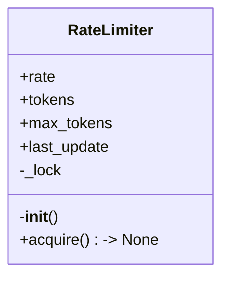
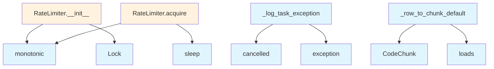

# File: `src/local_deepwiki/core/vectorstore/utils.py`

## File Overview

This file provides utility functions and classes for managing vectorstore operations, particularly focusing on rate limiting, data sanitization, and data conversion. It is part of the `local_deepwiki` project's core vectorstore module, supporting efficient and safe interaction with vector databases.

The file is designed to be a shared utility layer that supports other components in the vectorstore subsystem, such as batch processing, API request throttling, and data handling.

## Key Concepts

### Rate Limiting with `RateLimiter`

The `RateLimiter` class implements a token bucket algorithm to control the rate of API requests. This is crucial for avoiding overwhelming external services or hitting rate limits. The implementation uses `asyncio.Lock` to ensure thread safety during token acquisition and refills.

**Why this approach?** The token bucket algorithm allows for bursts of requests while maintaining an average rate limit. This is more flexible than strict fixed-rate limiting and is well-suited for asynchronous environments where requests may arrive in bursts.

### Data Sanitization with `_sanitize_string_value`

The `_sanitize_string_value` function ensures that string values used in LanceDB filter expressions are safe from injection attacks. It escapes single quotes by doubling them, which is a common technique in SQL-like systems to prevent malformed queries.

**Why this approach?** Direct string interpolation in database queries is a security risk. This simple but effective sanitization ensures that user-provided strings are safe for use in filter expressions without requiring complex parsing or escaping logic.

### Data Conversion with `_row_to_chunk_default`

The `_row_to_chunk_default` function is a utility for converting rows returned by LanceDB into [`CodeChunk`](../../models/chunks.md) objects. It handles the mapping of database fields to [`CodeChunk`](../../models/chunks.md) attributes, including parsing JSON metadata.

**Why this approach?** This function centralizes the logic for converting raw database rows into structured objects, making the data pipeline more maintainable and reducing boilerplate code in other parts of the system.

## Integration

This file is used by several modules within the `local_deepwiki` project:

- The `RateLimiter` class is used by `rate_limiter`, `test_rate_limiter`, `test_vectorstore_batching`, and other vectorstore-related components.
- `_log_task_exception` is used by `lazy_generator` to handle background task failures gracefully.
- `_sanitize_string_value` is used by `store`, `test_graph_rag_store`, and `test_vectorstore_submodules` to sanitize input data before database operations.
- `_row_to_chunk_default` is used by `iterators` to convert database results into structured [`CodeChunk`](../../models/chunks.md) objects.

It integrates with:
- `local_deepwiki.logging` for logging purposes.
- `local_deepwiki.models` for the [`CodeChunk`](../../models/chunks.md) class, which is central to representing code data in the system.

## Design Notes

- **Asynchronous Safety**: The `RateLimiter` uses `asyncio.Lock` to ensure that concurrent access to token state is safe, which is critical in an async environment.
- **Error Handling**: The `_log_task_exception` function is a utility for handling exceptions in fire-and-forget tasks, which is a common pattern in async systems where tasks may fail without direct error propagation.
- **Metadata Parsing**: The `_row_to_chunk_default` function parses JSON metadata from the database, handling cases where metadata may be `None` by defaulting to an empty dictionary.
- **Security Considerations**: The `_sanitize_string_value` function is a minimal but effective approach to preventing injection attacks in filter expressions, using a simple string replacement technique.
- **Flexibility**: The design of `_row_to_chunk_default` allows for easy customization of row-to-object conversion, which supports different database schemas or data representations without requiring major refactoring.

## API Reference

### class `RateLimiter`

Token bucket rate limiter for API requests.

**Methods:**


<details>
<summary>View Source (lines 22-53) | <a href="https://github.com/UrbanDiver/local-deepwiki-mcp/blob/main/src/local_deepwiki/core/vectorstore/utils.py#L22-L53">GitHub</a></summary>

```python
class RateLimiter:
    """Token bucket rate limiter for API requests."""

    def __init__(self, requests_per_minute: int):
        """Initialize rate limiter.

        Args:
            requests_per_minute: Maximum requests per minute.
        """
        self.rate = requests_per_minute / 60.0  # Requests per second
        self.tokens = float(requests_per_minute)
        self.max_tokens = float(requests_per_minute)
        self.last_update = time.monotonic()
        self._lock = asyncio.Lock()

    async def acquire(self) -> None:
        """Acquire a token, waiting if necessary."""
        async with self._lock:
            now = time.monotonic()
            # Refill tokens based on elapsed time
            elapsed = now - self.last_update
            self.tokens = min(self.max_tokens, self.tokens + elapsed * self.rate)
            self.last_update = now

            if self.tokens < 1.0:
                # Wait for tokens to refill
                wait_time = (1.0 - self.tokens) / self.rate
                await asyncio.sleep(wait_time)
                self.tokens = 0.0
                self.last_update = time.monotonic()
            else:
                self.tokens -= 1.0
```

</details>

#### `__init__`

```python
def __init__(requests_per_minute: int)
```

Initialize rate limiter.


| Parameter | Type | Default | Description |
|-----------|------|---------|-------------|
| `requests_per_minute` | `int` | - | Maximum requests per minute. |


<details>
<summary>View Source (lines 22-53) | <a href="https://github.com/UrbanDiver/local-deepwiki-mcp/blob/main/src/local_deepwiki/core/vectorstore/utils.py#L22-L53">GitHub</a></summary>

```python
class RateLimiter:
    """Token bucket rate limiter for API requests."""

    def __init__(self, requests_per_minute: int):
        """Initialize rate limiter.

        Args:
            requests_per_minute: Maximum requests per minute.
        """
        self.rate = requests_per_minute / 60.0  # Requests per second
        self.tokens = float(requests_per_minute)
        self.max_tokens = float(requests_per_minute)
        self.last_update = time.monotonic()
        self._lock = asyncio.Lock()

    async def acquire(self) -> None:
        """Acquire a token, waiting if necessary."""
        async with self._lock:
            now = time.monotonic()
            # Refill tokens based on elapsed time
            elapsed = now - self.last_update
            self.tokens = min(self.max_tokens, self.tokens + elapsed * self.rate)
            self.last_update = now

            if self.tokens < 1.0:
                # Wait for tokens to refill
                wait_time = (1.0 - self.tokens) / self.rate
                await asyncio.sleep(wait_time)
                self.tokens = 0.0
                self.last_update = time.monotonic()
            else:
                self.tokens -= 1.0
```

</details>

#### `acquire`

```python
async def acquire() -> None
```

Acquire a token, waiting if necessary.


<details>
<summary>View Source (lines 22-53) | <a href="https://github.com/UrbanDiver/local-deepwiki-mcp/blob/main/src/local_deepwiki/core/vectorstore/utils.py#L22-L53">GitHub</a></summary>

```python
class RateLimiter:
    """Token bucket rate limiter for API requests."""

    def __init__(self, requests_per_minute: int):
        """Initialize rate limiter.

        Args:
            requests_per_minute: Maximum requests per minute.
        """
        self.rate = requests_per_minute / 60.0  # Requests per second
        self.tokens = float(requests_per_minute)
        self.max_tokens = float(requests_per_minute)
        self.last_update = time.monotonic()
        self._lock = asyncio.Lock()

    async def acquire(self) -> None:
        """Acquire a token, waiting if necessary."""
        async with self._lock:
            now = time.monotonic()
            # Refill tokens based on elapsed time
            elapsed = now - self.last_update
            self.tokens = min(self.max_tokens, self.tokens + elapsed * self.rate)
            self.last_update = now

            if self.tokens < 1.0:
                # Wait for tokens to refill
                wait_time = (1.0 - self.tokens) / self.rate
                await asyncio.sleep(wait_time)
                self.tokens = 0.0
                self.last_update = time.monotonic()
            else:
                self.tokens -= 1.0
```

</details>

## Class Diagram



## Call Graph



## Used By

Functions and methods in this file and their callers:

- **[`CodeChunk`](../../models/chunks.md)**: called by `_row_to_chunk_default`
- **`Lock`**: called by `RateLimiter.__init__`
- **`cancelled`**: called by `_log_task_exception`
- **`exception`**: called by `_log_task_exception`
- **`loads`**: called by `_row_to_chunk_default`
- **`monotonic`**: called by `RateLimiter.__init__`, `RateLimiter.acquire`
- **`sleep`**: called by `RateLimiter.acquire`

## Last Modified

| Entity | Type | Author | Date | Commit |
|--------|------|--------|------|--------|
| `_log_task_exception` | function | Brian Breidenbach | Feb 21, 2026 | `fecde6f` refactor: split 10 large fi... |
| `RateLimiter` | class | Brian Breidenbach | Feb 09, 2026 | `89de2db` refactor: split vectorstore... |
| `_sanitize_string_value` | function | Brian Breidenbach | Feb 09, 2026 | `89de2db` refactor: split vectorstore... |
| `_row_to_chunk_default` | function | Brian Breidenbach | Feb 09, 2026 | `89de2db` refactor: split vectorstore... |

## Additional Source Code

Source code for functions and methods not listed in the API Reference above.

#### `_log_task_exception`

<details>
<summary>View Source (lines 16-19) | <a href="https://github.com/UrbanDiver/local-deepwiki-mcp/blob/main/src/local_deepwiki/core/vectorstore/utils.py#L16-L19">GitHub</a></summary>

```python
def _log_task_exception(task: asyncio.Task[Any]) -> None:
    """Log exceptions from fire-and-forget background tasks."""
    if not task.cancelled() and task.exception() is not None:
        logger.warning("Background task failed: %s", task.exception())
```

</details>


#### `_sanitize_string_value`

<details>
<summary>View Source (lines 56-68) | <a href="https://github.com/UrbanDiver/local-deepwiki-mcp/blob/main/src/local_deepwiki/core/vectorstore/utils.py#L56-L68">GitHub</a></summary>

```python
def _sanitize_string_value(value: str) -> str:
    """Sanitize a string value for use in LanceDB filter expressions.

    Escapes single quotes to prevent injection attacks.

    Args:
        value: The string to sanitize.

    Returns:
        Sanitized string safe for use in filter expressions.
    """
    # Escape single quotes by doubling them
    return value.replace("'", "''")
```

</details>


#### `_row_to_chunk_default`

<details>
<summary>View Source (lines 71-85) | <a href="https://github.com/UrbanDiver/local-deepwiki-mcp/blob/main/src/local_deepwiki/core/vectorstore/utils.py#L71-L85">GitHub</a></summary>

```python
def _row_to_chunk_default(row: dict[str, Any]) -> CodeChunk:
    """Default conversion from LanceDB row to CodeChunk."""
    return CodeChunk(
        id=row["id"],
        file_path=row["file_path"],
        language=row["language"],
        chunk_type=row["chunk_type"],
        name=row["name"] or None,
        content=row["content"],
        start_line=row["start_line"],
        end_line=row["end_line"],
        docstring=row["docstring"] or None,
        parent_name=row["parent_name"] or None,
        metadata=json.loads(row["metadata"]) if row["metadata"] else {},
    )
```

</details>

## Relevant Source Files

- `src/local_deepwiki/core/vectorstore/utils.py:22-53`
