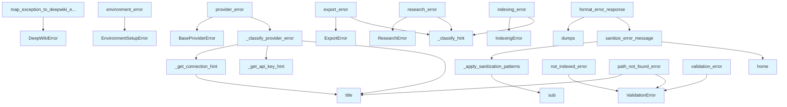

# File: `src/local_deepwiki/error_factories.py`

## File Overview

This module provides a collection of factory functions for creating structured error objects with actionable hints, along with sanitization utilities to ensure sensitive information is not exposed in user-facing error messages.

The primary responsibility of this file is to centralize error creation logic and enhance error messages with context-specific guidance. This improves the debugging experience for both developers and end-users by providing clear, actionable feedback when things go wrong in the DeepWiki system.

The design rationale centers on making errors informative, consistent, and safe for display. It leverages the error hierarchy defined in `local_deepwiki.errors` and applies pattern matching and sanitization to enrich error messages with hints and remove sensitive data.

## Key Concepts

### Structured Error Creation
This module introduces factory functions for creating specific types of errors ([`ValidationError`](errors.md), [`BaseProviderError`](errors.md), [`EnvironmentSetupError`](errors.md), etc.) that include not only a message but also hints, context, and additional metadata. These hints are designed to guide users toward resolving the underlying issue.

### Hint Classification and Provider Error Handling
For provider errors (e.g., API calls to LLM services), the module includes logic to classify common error messages and provide tailored hints. This includes handling API key issues, connection problems, and model not found errors. The use of sentinel values (`_AUTH_SENTINEL`, `_CONNECTION_SENTINEL`) allows for dynamic hint generation based on the provider type.

### Error Sanitization
Sensitive information such as file paths, API keys, and internal URLs can be inadvertently exposed in error messages. This module provides sanitization utilities (`sanitize_error_message`, `_apply_sanitization_patterns`) to strip out or obscure such details before errors are displayed to users.

### Exception Mapping
The `map_exception_to_deepwiki_error` function allows mapping standard Python exceptions (like `FileNotFoundError`) to appropriate [`DeepWikiError`](errors.md) subclasses, enriching them with helpful hints and context. This is useful for wrapping external library calls or handling unexpected errors gracefully.

## Integration

This file is a core part of the `local_deepwiki.errors` module and is typically imported and re-exported by that module, making its functions available throughout the codebase. It is used by several key components:

- **CLI modules** (`check_cli.py`, `config_validator.py`, `main.py`, `status_cli.py`) that need to raise structured errors during command execution.
- **Core modules** like `reranker.py` that may encounter errors during processing and want to provide actionable feedback.
- **Test modules** that rely on these factory functions to create predictable error objects for assertions.

The functions in this file are used to create errors in response to:
- Validation failures
- Provider misconfigurations
- Missing environment components
- Indexing issues
- Export failures
- Research-related problems

This integration ensures consistent error handling and user experience across all parts of the application.

## Design Notes

### Why Structured Errors?
Using structured errors with hints instead of raw strings improves maintainability and usability. It allows for better error categorization, consistent user guidance, and easier debugging by including contextual metadata.

### Provider-Specific Hint Logic
The `_classify_provider_error` function uses a tuple-based classifier system to match error messages to specific hints. This approach is flexible and allows for easy addition of new provider-specific handling without changing core logic.

### Sanitization Patterns
The sanitization logic uses regex patterns to match and replace sensitive information. It distinguishes between path sanitization and general sanitization, allowing for more granular control over what information is stripped from messages.

### Exception Mapping Strategy
The `map_exception_to_deepwiki_error` function uses a dictionary-based lookup for known exception types. This provides a clean way to convert generic exceptions into domain-specific errors while preserving the original exception's message.

### Edge Cases Handled
- Long values in `validation_error` are truncated for readability.
- Unknown exceptions are gracefully converted to a generic [`DeepWikiError`](errors.md).
- The sanitization logic handles non-string inputs and ensures safe output.
- Error messages are sanitized before being formatted for user display.

## API Reference

### Functions

#### `validation_error`

```python
def validation_error(field: str, value: Any, expected: str, context: dict[str, Any] | None = None) -> ValidationError
```

Create a validation error with actionable hints.


| Parameter | Type | Default | Description |
|-----------|------|---------|-------------|
| `field` | `str` | - | The name of the invalid field. |
| `value` | `Any` | - | The invalid value provided. |
| `expected` | `str` | - | Description of what was expected. |
| `context` | `dict[str, Any] | None` | `None` | Additional context for debugging. |

**Returns:** [`ValidationError`](errors.md)


<details>
<summary>View Source (lines 47-83) | <a href="https://github.com/UrbanDiver/local-deepwiki-mcp/blob/main/src/local_deepwiki/error_factories.py#L47-L83">GitHub</a></summary>

```python
def validation_error(
    field: str,
    value: Any,
    expected: str,
    *,
    context: dict[str, Any] | None = None,
) -> ValidationError:
    """Create a validation error with actionable hints.

    Args:
        field: The name of the invalid field.
        value: The invalid value provided.
        expected: Description of what was expected.
        context: Additional context for debugging.

    Returns:
        A ValidationError with formatted message and hint.

    Example:
        raise validation_error(
            field="repo_path",
            value="/nonexistent/path",
            expected="an existing directory"
        )
    """
    # Truncate long values for readability
    value_str = str(value)
    if len(value_str) > 100:
        value_str = value_str[:100] + "..."

    return ValidationError(
        message=f"Invalid value for '{field}': {value_str}",
        hint=f"Expected {expected}",
        context=context,
        field=field,
        value=value,
    )
```

</details>

#### `provider_error`

```python
def provider_error(provider_name: str, original_error: Exception, context: dict[str, Any] | None = None) -> BaseProviderError
```

Create a provider error from an exception with actionable hints.  This function analyzes the original exception to provide context-specific hints for common provider issues.


| Parameter | Type | Default | Description |
|-----------|------|---------|-------------|
| `provider_name` | `str` | - | Name of the provider (e.g., "anthropic", "ollama"). |
| `original_error` | `Exception` | - | The original exception from the provider. |
| `context` | `dict[str, Any] | None` | `None` | Additional context for debugging. |

**Returns:** [`BaseProviderError`](errors.md)


<details>
<summary>View Source (lines 178-211) | <a href="https://github.com/UrbanDiver/local-deepwiki-mcp/blob/main/src/local_deepwiki/error_factories.py#L178-L211">GitHub</a></summary>

```python
def provider_error(
    provider_name: str,
    original_error: Exception,
    *,
    context: dict[str, Any] | None = None,
) -> BaseProviderError:
    """Create a provider error from an exception with actionable hints.

    This function analyzes the original exception to provide
    context-specific hints for common provider issues.

    Args:
        provider_name: Name of the provider (e.g., "anthropic", "ollama").
        original_error: The original exception from the provider.
        context: Additional context for debugging.

    Returns:
        A BaseProviderError with formatted message and hint.

    Example:
        try:
            result = await llm.generate(prompt)
        except Exception as e:
            raise provider_error("anthropic", e)
    """
    hint, message = _classify_provider_error(provider_name, original_error)

    return BaseProviderError(
        message=message,
        hint=hint,
        context=context,
        provider_name=provider_name,
        original_error=original_error,
    )
```

</details>

#### `environment_error`

```python
def environment_error(missing_component: str, purpose: str, setup_instructions: str, context: dict[str, Any] | None = None) -> EnvironmentSetupError
```

Create an environment error with setup instructions.


| Parameter | Type | Default | Description |
|-----------|------|---------|-------------|
| `missing_component` | `str` | - | Name of the missing component. |
| `purpose` | `str` | - | What the component is needed for. |
| `setup_instructions` | `str` | - | How to install/configure it. |
| `context` | `dict[str, Any] | None` | `None` | Additional context for debugging. |

**Returns:** [`EnvironmentSetupError`](errors.md)


<details>
<summary>View Source (lines 254-284) | <a href="https://github.com/UrbanDiver/local-deepwiki-mcp/blob/main/src/local_deepwiki/error_factories.py#L254-L284">GitHub</a></summary>

```python
def environment_error(
    missing_component: str,
    purpose: str,
    setup_instructions: str,
    *,
    context: dict[str, Any] | None = None,
) -> EnvironmentSetupError:
    """Create an environment error with setup instructions.

    Args:
        missing_component: Name of the missing component.
        purpose: What the component is needed for.
        setup_instructions: How to install/configure it.
        context: Additional context for debugging.

    Returns:
        An EnvironmentSetupError with formatted message and hint.

    Example:
        raise environment_error(
            missing_component="weasyprint",
            purpose="PDF export",
            setup_instructions="pip install weasyprint"
        )
    """
    return EnvironmentSetupError(
        message=f"Missing required component: {missing_component}",
        hint=f"Required for {purpose}.\nTo set up:\n{setup_instructions}",
        context=context,
        missing_component=missing_component,
    )
```

</details>

#### `indexing_error`

```python
def indexing_error(message: str, repo_path: str | None = None, file_path: str | None = None, context: dict[str, Any] | None = None) -> IndexingError
```

Create an indexing error with actionable hints.


| Parameter | Type | Default | Description |
|-----------|------|---------|-------------|
| `message` | `str` | - | Description of what failed. |
| `repo_path` | `str | None` | `None` | Path to the repository being indexed. |
| `file_path` | `str | None` | `None` | Specific file that caused the error. |
| `context` | `dict[str, Any] | None` | `None` | Additional context for debugging. |

**Returns:** [`IndexingError`](errors.md)


<details>
<summary>View Source (lines 307-337) | <a href="https://github.com/UrbanDiver/local-deepwiki-mcp/blob/main/src/local_deepwiki/error_factories.py#L307-L337">GitHub</a></summary>

```python
def indexing_error(
    message: str,
    *,
    repo_path: str | None = None,
    file_path: str | None = None,
    context: dict[str, Any] | None = None,
) -> IndexingError:
    """Create an indexing error with actionable hints.

    Args:
        message: Description of what failed.
        repo_path: Path to the repository being indexed.
        file_path: Specific file that caused the error.
        context: Additional context for debugging.

    Returns:
        An IndexingError with formatted message and hint.
    """
    hint = _classify_hint(
        message.lower(),
        _INDEXING_HINT_CLASSIFIERS,
        "Check the repository path, file permissions, and ensure source files are readable.",
    )

    return IndexingError(
        message=message,
        hint=hint,
        context=context,
        repo_path=repo_path,
        file_path=file_path,
    )
```

</details>

#### `export_error`

```python
def export_error(message: str, export_format: str, output_path: str | None = None, context: dict[str, Any] | None = None) -> ExportError
```

Create an export error with actionable hints.


| Parameter | Type | Default | Description |
|-----------|------|---------|-------------|
| `message` | `str` | - | Description of what failed. |
| `export_format` | `str` | - | The export format (html, pdf). |
| `output_path` | `str | None` | `None` | The target output path. |
| `context` | `dict[str, Any] | None` | `None` | Additional context for debugging. |

**Returns:** [`ExportError`](errors.md)


<details>
<summary>View Source (lines 362-401) | <a href="https://github.com/UrbanDiver/local-deepwiki-mcp/blob/main/src/local_deepwiki/error_factories.py#L362-L401">GitHub</a></summary>

```python
def export_error(
    message: str,
    export_format: str,
    *,
    output_path: str | None = None,
    context: dict[str, Any] | None = None,
) -> ExportError:
    """Create an export error with actionable hints.

    Args:
        message: Description of what failed.
        export_format: The export format (html, pdf).
        output_path: The target output path.
        context: Additional context for debugging.

    Returns:
        An ExportError with formatted message and hint.
    """
    msg_lower = message.lower()

    if export_format == "pdf":
        hint = _classify_hint(
            msg_lower,
            _EXPORT_PDF_HINTS,
            "Check that the output path is writable and you have the required dependencies installed.",
        )
    else:
        hint = _classify_hint(
            msg_lower,
            _EXPORT_HTML_HINTS,
            "Check that the wiki path exists and contains valid markdown files.",
        )

    return ExportError(
        message=message,
        hint=hint,
        context=context,
        export_format=export_format,
        output_path=output_path,
    )
```

</details>

#### `research_error`

```python
def research_error(message: str, step: str | None = None, question: str | None = None, context: dict[str, Any] | None = None) -> ResearchError
```

Create a research error with actionable hints.


| Parameter | Type | Default | Description |
|-----------|------|---------|-------------|
| `message` | `str` | - | Description of what failed. |
| `step` | `str | None` | `None` | The research step that failed. |
| `question` | `str | None` | `None` | The research question being processed. |
| `context` | `dict[str, Any] | None` | `None` | Additional context for debugging. |

**Returns:** [`ResearchError`](errors.md)


<details>
<summary>View Source (lines 420-450) | <a href="https://github.com/UrbanDiver/local-deepwiki-mcp/blob/main/src/local_deepwiki/error_factories.py#L420-L450">GitHub</a></summary>

```python
def research_error(
    message: str,
    *,
    step: str | None = None,
    question: str | None = None,
    context: dict[str, Any] | None = None,
) -> ResearchError:
    """Create a research error with actionable hints.

    Args:
        message: Description of what failed.
        step: The research step that failed.
        question: The research question being processed.
        context: Additional context for debugging.

    Returns:
        A ResearchError with formatted message and hint.
    """
    hint = _classify_hint(
        message.lower(),
        _RESEARCH_HINT_CLASSIFIERS,
        "Check that the repository is indexed and the LLM provider is configured correctly.",
    )

    return ResearchError(
        message=message,
        hint=hint,
        context=context,
        step=step,
        question=question,
    )
```

</details>

#### `not_indexed_error`

```python
def not_indexed_error(repo_path: str) -> ValidationError
```

Create an error for when a repository hasn't been indexed yet.


| Parameter | Type | Default | Description |
|-----------|------|---------|-------------|
| `repo_path` | `str` | - | Path to the repository that needs indexing. |

**Returns:** [`ValidationError`](errors.md)


<details>
<summary>View Source (lines 453-470) | <a href="https://github.com/UrbanDiver/local-deepwiki-mcp/blob/main/src/local_deepwiki/error_factories.py#L453-L470">GitHub</a></summary>

```python
def not_indexed_error(repo_path: str) -> ValidationError:
    """Create an error for when a repository hasn't been indexed yet.

    Args:
        repo_path: Path to the repository that needs indexing.

    Returns:
        A ValidationError with instructions to index first.
    """
    return ValidationError(
        message=f"Repository not indexed: {repo_path}",
        hint=(
            "Run index_repository first to create the search index:\n"
            f'  index_repository(repo_path="{repo_path}")'
        ),
        field="repo_path",
        value=repo_path,
    )
```

</details>

#### `path_not_found_error`

```python
def path_not_found_error(path: str, path_type: str = "path") -> ValidationError
```

Create an error for when a path doesn't exist.


| Parameter | Type | Default | Description |
|-----------|------|---------|-------------|
| `path` | `str` | - | The path that doesn't exist. |
| `path_type` | `str` | `"path"` | Type of path (e.g., "repository", "wiki", "file"). |

**Returns:** [`ValidationError`](errors.md)


<details>
<summary>View Source (lines 473-491) | <a href="https://github.com/UrbanDiver/local-deepwiki-mcp/blob/main/src/local_deepwiki/error_factories.py#L473-L491">GitHub</a></summary>

```python
def path_not_found_error(
    path: str,
    path_type: str = "path",
) -> ValidationError:
    """Create an error for when a path doesn't exist.

    Args:
        path: The path that doesn't exist.
        path_type: Type of path (e.g., "repository", "wiki", "file").

    Returns:
        A ValidationError with hint about the path.
    """
    return ValidationError(
        message=f"{path_type.title()} does not exist: {path}",
        hint=f"Check that the {path_type} path is correct and accessible.",
        field=path_type,
        value=path,
    )
```

</details>

#### `map_exception_to_deepwiki_error`

```python
def map_exception_to_deepwiki_error(exc: Exception, context: dict[str, Any] | None = None) -> DeepWikiError
```

Map a standard exception to an appropriate [DeepWikiError](errors.md).  This function converts common Python exceptions into [DeepWikiError](errors.md) subclasses with helpful hints.


| Parameter | Type | Default | Description |
|-----------|------|---------|-------------|
| `exc` | `Exception` | - | The exception to convert. |
| `context` | `dict[str, Any] | None` | `None` | Additional context for debugging. |

**Returns:** [`DeepWikiError`](errors.md)


<details>
<summary>View Source (lines 519-554) | <a href="https://github.com/UrbanDiver/local-deepwiki-mcp/blob/main/src/local_deepwiki/error_factories.py#L519-L554">GitHub</a></summary>

```python
def map_exception_to_deepwiki_error(
    exc: Exception,
    *,
    context: dict[str, Any] | None = None,
) -> DeepWikiError:
    """Map a standard exception to an appropriate DeepWikiError.

    This function converts common Python exceptions into DeepWikiError
    subclasses with helpful hints.

    Args:
        exc: The exception to convert.
        context: Additional context for debugging.

    Returns:
        A DeepWikiError subclass with appropriate message and hint.
    """
    # Check if it's already a DeepWikiError
    if isinstance(exc, DeepWikiError):
        return exc

    # Look up hint for exception type
    for exc_type, (message_prefix, hint) in EXCEPTION_HINTS.items():
        if isinstance(exc, exc_type):
            return DeepWikiError(
                message=f"{message_prefix} {exc}",
                hint=hint,
                context=context,
            )

    # Default handling for unknown exceptions
    return DeepWikiError(
        message=str(exc),
        hint="An unexpected error occurred. Please check the logs for details.",
        context=context,
    )
```

</details>

#### `sanitize_error_message`

```python
def sanitize_error_message(message: str, sanitize_paths: bool = True) -> str
```

Remove sensitive information from error messages.  This function sanitizes error messages before returning them to users to prevent information disclosure about internal paths, URLs, API configuration, and other sensitive details.


| Parameter | Type | Default | Description |
|-----------|------|---------|-------------|
| `message` | `str` | - | Original error message potentially containing sensitive info. |
| `sanitize_paths` | `bool` | `True` | Whether to remove file paths (default: True). |

**Returns:** `str`


<details>
<summary>View Source (lines 595-628) | <a href="https://github.com/UrbanDiver/local-deepwiki-mcp/blob/main/src/local_deepwiki/error_factories.py#L595-L628">GitHub</a></summary>

```python
def sanitize_error_message(message: str, sanitize_paths: bool = True) -> str:
    """Remove sensitive information from error messages.

    This function sanitizes error messages before returning them to users
    to prevent information disclosure about internal paths, URLs, API
    configuration, and other sensitive details.

    Args:
        message: Original error message potentially containing sensitive info.
        sanitize_paths: Whether to remove file paths (default: True).

    Returns:
        Sanitized message safe for user display.

    Examples:
        >>> sanitize_error_message("/home/user/.config/app/config.yaml: File not found")
        "~/.config/app/config.yaml: File not found"

        >>> sanitize_error_message("Connection refused to http://localhost:11434")
        "Connection refused to internal-service"
    """
    if not isinstance(message, str):
        return str(message)

    result = message

    if sanitize_paths:
        home = str(Path.home())
        result = result.replace(home, "~")
        result = _apply_sanitization_patterns(result, _PATH_SANITIZATION_PATTERNS)

    result = _apply_sanitization_patterns(result, _GENERAL_SANITIZATION_PATTERNS)

    return result
```

</details>

#### `format_error_response`

```python
def format_error_response(error: DeepWikiError) -> str
```

Format an error for display to users.


| Parameter | Type | Default | Description |
|-----------|------|---------|-------------|
| `error` | `DeepWikiError` | - | The DeepWikiError to format. |

**Returns:** `str`


<details>
<summary>View Source (lines 631-657) | <a href="https://github.com/UrbanDiver/local-deepwiki-mcp/blob/main/src/local_deepwiki/error_factories.py#L631-L657">GitHub</a></summary>

```python
def format_error_response(error: DeepWikiError) -> str:
    """Format an error for display to users.

    Args:
        error: The DeepWikiError to format.

    Returns:
        A formatted string suitable for display.
    """
    # Sanitize the message to remove sensitive information
    safe_message = sanitize_error_message(error.message)
    if error.hint:
        safe_hint = sanitize_error_message(error.hint)
    else:
        safe_hint = None

    result: dict[str, Any] = {
        "status": "error",
        "error": safe_message,
    }
    if safe_hint:
        result["hint"] = safe_hint
    if error.retryable:
        result["retryable"] = True
        if error.retry_after_seconds is not None:
            result["retry_after_seconds"] = error.retry_after_seconds
    return json.dumps(result, indent=2)
```

</details>

## Call Graph



## Used By

Functions and methods in this file and their callers:

- **[`BaseProviderError`](errors.md)**: called by `provider_error`
- **[`DeepWikiError`](errors.md)**: called by `map_exception_to_deepwiki_error`
- **[`EnvironmentSetupError`](errors.md)**: called by `environment_error`
- **[`ExportError`](errors.md)**: called by `export_error`
- **[`IndexingError`](errors.md)**: called by `indexing_error`
- **[`ResearchError`](errors.md)**: called by `research_error`
- **[`ValidationError`](errors.md)**: called by `not_indexed_error`, `path_not_found_error`, `validation_error`
- **`_apply_sanitization_patterns`**: called by `sanitize_error_message`
- **`_classify_hint`**: called by `export_error`, `indexing_error`, `research_error`
- **`_classify_provider_error`**: called by `provider_error`
- **`_get_api_key_hint`**: called by `_classify_provider_error`
- **`_get_connection_hint`**: called by `_classify_provider_error`
- **`dumps`**: called by `format_error_response`
- **`home`**: called by `sanitize_error_message`
- **`sanitize_error_message`**: called by `format_error_response`
- **`sub`**: called by `_apply_sanitization_patterns`
- **`title`**: called by `_classify_provider_error`, `_get_connection_hint`, `path_not_found_error`

## Last Modified

| Entity | Type | Author | Date | Commit |
|--------|------|--------|------|--------|
| `validation_error` | function | Brian Breidenbach | Feb 23, 2026 | `c6fe2bd` refactor: split oversized m... |
| `_classify_hint` | function | Brian Breidenbach | Feb 23, 2026 | `c6fe2bd` refactor: split oversized m... |
| `_classify_provider_error` | function | Brian Breidenbach | Feb 23, 2026 | `c6fe2bd` refactor: split oversized m... |
| `provider_error` | function | Brian Breidenbach | Feb 23, 2026 | `c6fe2bd` refactor: split oversized m... |
| `_get_api_key_hint` | function | Brian Breidenbach | Feb 23, 2026 | `c6fe2bd` refactor: split oversized m... |
| `_get_connection_hint` | function | Brian Breidenbach | Feb 23, 2026 | `c6fe2bd` refactor: split oversized m... |
| `environment_error` | function | Brian Breidenbach | Feb 23, 2026 | `c6fe2bd` refactor: split oversized m... |
| `indexing_error` | function | Brian Breidenbach | Feb 23, 2026 | `c6fe2bd` refactor: split oversized m... |
| `export_error` | function | Brian Breidenbach | Feb 23, 2026 | `c6fe2bd` refactor: split oversized m... |
| `research_error` | function | Brian Breidenbach | Feb 23, 2026 | `c6fe2bd` refactor: split oversized m... |
| `not_indexed_error` | function | Brian Breidenbach | Feb 23, 2026 | `c6fe2bd` refactor: split oversized m... |
| `path_not_found_error` | function | Brian Breidenbach | Feb 23, 2026 | `c6fe2bd` refactor: split oversized m... |
| `map_exception_to_deepwiki_error` | function | Brian Breidenbach | Feb 23, 2026 | `c6fe2bd` refactor: split oversized m... |
| `_apply_sanitization_patterns` | function | Brian Breidenbach | Feb 23, 2026 | `c6fe2bd` refactor: split oversized m... |
| `sanitize_error_message` | function | Brian Breidenbach | Feb 23, 2026 | `c6fe2bd` refactor: split oversized m... |
| `format_error_response` | function | Brian Breidenbach | Feb 23, 2026 | `c6fe2bd` refactor: split oversized m... |

## Additional Source Code

Source code for functions and methods not listed in the API Reference above.

#### `_classify_hint`

<details>
<summary>View Source (lines 86-104) | <a href="https://github.com/UrbanDiver/local-deepwiki-mcp/blob/main/src/local_deepwiki/error_factories.py#L86-L104">GitHub</a></summary>

```python
def _classify_hint(
    msg_lower: str,
    classifiers: tuple[tuple[tuple[str, ...], str], ...],
    default: str,
) -> str:
    """Match the first classifier whose keywords appear in the message.

    Args:
        msg_lower: Lowercased error message to classify.
        classifiers: Tuple of ((keywords...), hint) pairs checked in order.
        default: Hint returned when no classifier matches.

    Returns:
        The matching hint string, or *default*.
    """
    for keywords, hint in classifiers:
        if any(kw in msg_lower for kw in keywords):
            return hint
    return default
```

</details>


#### `_classify_provider_error`

<details>
<summary>View Source (lines 143-175) | <a href="https://github.com/UrbanDiver/local-deepwiki-mcp/blob/main/src/local_deepwiki/error_factories.py#L143-L175">GitHub</a></summary>

```python
def _classify_provider_error(
    provider_name: str,
    original_error: Exception,
) -> tuple[str, str]:
    """Return (hint, message) for a provider error.

    Handles special sentinel values that delegate to callable hint builders.
    """
    error_str = str(original_error).lower()
    title = provider_name.title()

    for keywords, hint_or_sentinel, message_template in _PROVIDER_HINT_CLASSIFIERS:
        if any(kw in error_str for kw in keywords):
            if hint_or_sentinel == _AUTH_SENTINEL:
                hint = _get_api_key_hint(provider_name)
            elif hint_or_sentinel == _CONNECTION_SENTINEL:
                hint = _get_connection_hint(provider_name)
            else:
                hint = hint_or_sentinel
            return hint, message_template.format(title=title)

    # Two-keyword check: both "model" and "not found" must be present
    if "model" in error_str and "not found" in error_str:
        return (
            _PROVIDER_MODEL_NOT_FOUND_HINT.format(title=title),
            f"{title} model not found",
        )

    return (
        f"Check your {title} configuration and API status. "
        f"See provider documentation for details.",
        f"{title} provider error: {original_error}",
    )
```

</details>


#### `_get_api_key_hint`

<details>
<summary>View Source (lines 214-235) | <a href="https://github.com/UrbanDiver/local-deepwiki-mcp/blob/main/src/local_deepwiki/error_factories.py#L214-L235">GitHub</a></summary>

```python
def _get_api_key_hint(provider_name: str) -> str:
    """Get API key setup hint for a specific provider."""
    hints = {
        "anthropic": (
            "Set your Anthropic API key:\n"
            "  export ANTHROPIC_API_KEY='your-key-here'\n"
            "Get a key at: https://console.anthropic.com/settings/keys"
        ),
        "openai": (
            "Set your OpenAI API key:\n"
            "  export OPENAI_API_KEY='your-key-here'\n"
            "Get a key at: https://platform.openai.com/api-keys"
        ),
        "ollama": (
            "Ollama runs locally and doesn't require an API key.\n"
            "Make sure Ollama is running: ollama serve"
        ),
    }
    return hints.get(
        provider_name.lower(),
        f"Check your {provider_name} API key configuration.",
    )
```

</details>


#### `_get_connection_hint`

<details>
<summary>View Source (lines 238-251) | <a href="https://github.com/UrbanDiver/local-deepwiki-mcp/blob/main/src/local_deepwiki/error_factories.py#L238-L251">GitHub</a></summary>

```python
def _get_connection_hint(provider_name: str) -> str:
    """Get connection troubleshooting hint for a specific provider."""
    if provider_name.lower() == "ollama":
        return (
            "Cannot connect to Ollama. Make sure:\n"
            "  1. Ollama is installed: https://ollama.ai/download\n"
            "  2. Ollama is running: ollama serve\n"
            "  3. The model is available: ollama list"
        )
    return (
        f"Check your network connection and verify {provider_name.title()} "
        f"services are operational. You can check status at the provider's "
        f"status page."
    )
```

</details>


#### `_apply_sanitization_patterns`

<details>
<summary>View Source (lines 585-592) | <a href="https://github.com/UrbanDiver/local-deepwiki-mcp/blob/main/src/local_deepwiki/error_factories.py#L585-L592">GitHub</a></summary>

```python
def _apply_sanitization_patterns(
    text: str,
    patterns: tuple[tuple[str, str], ...],
) -> str:
    """Apply a sequence of regex substitution patterns to *text*."""
    for pattern, replacement in patterns:
        text = re.sub(pattern, replacement, text)
    return text
```

</details>

## Relevant Source Files

- `src/local_deepwiki/error_factories.py:47-83`
