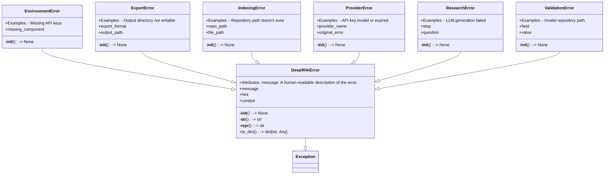

# File Overview

This file, `src/local_deepwiki/errors.py`, defines a hierarchy of custom exception classes and utility functions for handling errors in the DeepWiki application. It provides structured error handling for various scenarios including validation, environment setup, provider failures, indexing, export, and research.

The module imports standard library components (`re`, `Path`, `Any`) and defines several exception classes that inherit from a base `DeepWikiError`. It also includes utility functions to create specific error instances with helpful hints and context.

## Classes

### `DeepWikiError`
The base exception class for all DeepWiki errors. It includes:
- `message`: A human-readable description of the error.
- `hint`: Actionable guidance on how to resolve the error (optional).
- `context`: Additional context for debugging (optional).

**Key Methods:**
- `__init__(self, message: str, hint: str | None = None, context: dict[str, Any] | None = None)`


<details>
<summary>View Source (lines 33-92) | <a href="https://github.com/UrbanDiver/local-deepwiki-mcp/blob/[main](export/pdf.md)/src/local_deepwiki/errors.py#L33-L92">GitHub</a></summary>

```python
class DeepWikiError(Exception):
    """Base exception for all DeepWiki errors.

    All DeepWiki errors include:
    - message: What happened
    - hint: How to fix it (optional)
    - context: Additional debug info (optional)

    Attributes:
        message: A human-readable description of the error.
        hint: Actionable guidance on how to resolve the error.
        context: Additional context for debugging.
    """

    def __init__(
        self,
        message: str,
        hint: str | None = None,
        context: dict[str, Any] | None = None,
    ) -> None:
        """Initialize the error.

        Args:
            message: What happened.
            hint: How to fix it.
            context: Additional debug info.
        """
        super().__init__(message)
        self.message = message
        self.hint = hint
        self.context = context or {}

    def __str__(self) -> str:
        """Format the error message with hint if available."""
        parts = [self.message]
        if self.hint:
            parts.append(f"\nHint: {self.hint}")
        return "".join(parts)

    def __repr__(self) -> str:
        """Return a detailed representation for debugging."""
        return (
            f"{self.__class__.__name__}("
            f"message={self.message!r}, "
            f"hint={self.hint!r}, "
            f"context={self.context!r})"
        )

    def to_dict(self) -> dict[str, Any]:
        """Convert the error to a dictionary for JSON serialization.

        Returns:
            Dictionary containing error details.
        """
        return {
            "error_type": self.__class__.__name__,
            "message": self.message,
            "hint": self.hint,
            "context": self.context,
        }
```

</details>

### `ValidationError`
Raised when input validation fails. This error indicates invalid user-provided input such as missing fields, invalid formats, or out-of-range values.

**Key Methods:**
- `__init__(self, message: str, hint: str | None = None, context: dict[str, Any] | None = None, field: str | None = None, value: Any = None)`


<details>
<summary>View Source (lines 95-131) | <a href="https://github.com/UrbanDiver/local-deepwiki-mcp/blob/[main](export/pdf.md)/src/local_deepwiki/errors.py#L95-L131">GitHub</a></summary>

```python
class ValidationError(DeepWikiError):
    """Error raised when input validation fails.

    This error indicates that user-provided input is invalid,
    such as missing required fields, invalid formats, or
    values outside acceptable ranges.

    Examples:
        - Invalid repository path
        - Invalid language filter
        - Invalid configuration values
    """

    def __init__(
        self,
        message: str,
        hint: str | None = None,
        context: dict[str, Any] | None = None,
        field: str | None = None,
        value: Any = None,
    ) -> None:
        """Initialize the validation error.

        Args:
            message: What validation failed.
            hint: How to fix it.
            context: Additional debug info.
            field: The name of the invalid field.
            value: The invalid value that was provided.
        """
        super().__init__(message, hint, context)
        self.field = field
        self.value = value
        if field:
            self.context["field"] = field
        if value is not None:
            self.context["value"] = value
```

</details>

### `EnvironmentError`
Raised when environment setup is incomplete. This indicates missing dependencies, configuration files, or system resources.

**Key Methods:**
- `__init__(self, message: str, hint: str | None = None, context: dict[str, Any] | None = None, missing_component: str | None = None)`


<details>
<summary>View Source (lines 134-164) | <a href="https://github.com/UrbanDiver/local-deepwiki-mcp/blob/[main](export/pdf.md)/src/local_deepwiki/errors.py#L134-L164">GitHub</a></summary>

```python
class EnvironmentError(DeepWikiError):
    """Error raised when environment setup is incomplete.

    This error indicates that required dependencies, configuration,
    or system resources are missing or misconfigured.

    Examples:
        - Missing API keys
        - Required tools not installed
        - Configuration file not found
    """

    def __init__(
        self,
        message: str,
        hint: str | None = None,
        context: dict[str, Any] | None = None,
        missing_component: str | None = None,
    ) -> None:
        """Initialize the environment error.

        Args:
            message: What component is missing/misconfigured.
            hint: How to set it up.
            context: Additional debug info.
            missing_component: Name of the missing component.
        """
        super().__init__(message, hint, context)
        self.missing_component = missing_component
        if missing_component:
            self.context["missing_component"] = missing_component
```

</details>

### `ProviderError`
Raised when an LLM or embedding provider fails. Wraps failures from external AI providers like Anthropic, OpenAI, or Ollama, and includes the original exception for debugging.

**Key Methods:**
- `__init__(self, message: str, hint: str | None = None, context: dict[str, Any] | None = None, provider_name: str | None = None, original_error: Exception | None = None)`


<details>
<summary>View Source (lines 167-205) | <a href="https://github.com/UrbanDiver/local-deepwiki-mcp/blob/[main](export/pdf.md)/src/local_deepwiki/errors.py#L167-L205">GitHub</a></summary>

```python
class ProviderError(DeepWikiError):
    """Error raised when an LLM or embedding provider fails.

    This error wraps failures from external AI providers like
    Anthropic, OpenAI, or Ollama. It includes the original
    exception for debugging.

    Examples:
        - API key invalid or expired
        - Network connectivity issues
        - Rate limiting
        - Model not available
    """

    def __init__(
        self,
        message: str,
        hint: str | None = None,
        context: dict[str, Any] | None = None,
        provider_name: str | None = None,
        original_error: Exception | None = None,
    ) -> None:
        """Initialize the provider error.

        Args:
            message: What provider operation failed.
            hint: How to fix it.
            context: Additional debug info.
            provider_name: Name of the failing provider.
            original_error: The original exception from the provider.
        """
        super().__init__(message, hint, context)
        self.provider_name = provider_name
        self.original_error = original_error
        if provider_name:
            self.context["provider"] = provider_name
        if original_error:
            self.context["original_error"] = str(original_error)
            self.context["original_error_type"] = type(original_error).__name__
```

</details>

### `IndexingError`
Raised when repository indexing fails. This indicates problems during the indexing process such as permission issues or unsupported files.

**Key Methods:**
- `__init__(self, message: str, hint: str | None = None, context: dict[str, Any] | None = None, repo_path: str | None = None, file_path: str | None = None)`


<details>
<summary>View Source (lines 208-245) | <a href="https://github.com/UrbanDiver/local-deepwiki-mcp/blob/[main](export/pdf.md)/src/local_deepwiki/errors.py#L208-L245">GitHub</a></summary>

```python
class IndexingError(DeepWikiError):
    """Error raised when repository indexing fails.

    This error indicates problems during the indexing process,
    such as permission issues, unsupported files, or resource
    exhaustion.

    Examples:
        - Repository path doesn't exist
        - Permission denied on files
        - Parsing errors
        - Vector store failures
    """

    def __init__(
        self,
        message: str,
        hint: str | None = None,
        context: dict[str, Any] | None = None,
        repo_path: str | None = None,
        file_path: str | None = None,
    ) -> None:
        """Initialize the indexing error.

        Args:
            message: What indexing operation failed.
            hint: How to fix it.
            context: Additional debug info.
            repo_path: Path to the repository being indexed.
            file_path: Specific file that caused the error.
        """
        super().__init__(message, hint, context)
        self.repo_path = repo_path
        self.file_path = file_path
        if repo_path:
            self.context["repo_path"] = repo_path
        if file_path:
            self.context["file_path"] = file_path
```

</details>

### `ExportError`
Raised when wiki export fails. This indicates problems during HTML or PDF export such as missing dependencies or invalid output paths.

**Key Methods:**
- `__init__(self, message: str, hint: str | None = None, context: dict[str, Any] | None = None, export_format: str | None = None, output_path: str | None = None)`


<details>
<summary>View Source (lines 248-284) | <a href="https://github.com/UrbanDiver/local-deepwiki-mcp/blob/[main](export/pdf.md)/src/local_deepwiki/errors.py#L248-L284">GitHub</a></summary>

```python
class ExportError(DeepWikiError):
    """Error raised when wiki export fails.

    This error indicates problems during HTML or PDF export,
    such as missing dependencies, permission issues, or
    invalid output paths.

    Examples:
        - Output directory not writable
        - WeasyPrint/mermaid-cli not installed
        - Corrupted wiki content
    """

    def __init__(
        self,
        message: str,
        hint: str | None = None,
        context: dict[str, Any] | None = None,
        export_format: str | None = None,
        output_path: str | None = None,
    ) -> None:
        """Initialize the export error.

        Args:
            message: What export operation failed.
            hint: How to fix it.
            context: Additional debug info.
            export_format: The export format (html, pdf).
            output_path: The target output path.
        """
        super().__init__(message, hint, context)
        self.export_format = export_format
        self.output_path = output_path
        if export_format:
            self.context["format"] = export_format
        if output_path:
            self.context["output_path"] = output_path
```

</details>

### `ResearchError`
Raised when deep research fails. This indicates problems during the deep research pipeline such as LLM failures or timeouts.

**Key Methods:**
- `__init__(self, message: str, hint: str | None = None, context: dict[str, Any] | None = None, step: str | None = None, question: str | None = None)`


<details>
<summary>View Source (lines 287-322) | <a href="https://github.com/UrbanDiver/local-deepwiki-mcp/blob/[main](export/pdf.md)/src/local_deepwiki/errors.py#L287-L322">GitHub</a></summary>

```python
class ResearchError(DeepWikiError):
    """Error raised when deep research fails.

    This error indicates problems during the deep research
    pipeline, such as LLM failures, timeout, or cancellation.

    Examples:
        - LLM generation failed
        - Research timeout
        - Vector search failures
    """

    def __init__(
        self,
        message: str,
        hint: str | None = None,
        context: dict[str, Any] | None = None,
        step: str | None = None,
        question: str | None = None,
    ) -> None:
        """Initialize the research error.

        Args:
            message: What research operation failed.
            hint: How to fix it.
            context: Additional debug info.
            step: The research step that failed.
            question: The research question being processed.
        """
        super().__init__(message, hint, context)
        self.step = step
        self.question = question
        if step:
            self.context["step"] = step
        if question:
            self.context["question"] = question[:100]  # Truncate long questions
```

</details>

## Functions

### `validation_error`
Creates a `ValidationError` with actionable hints.

**Parameters:**
- `field: str`: The name of the invalid field.
- `value: Any`: The invalid value provided.
- `expected: str`: Description of what was expected.
- `context: dict[str, Any] | None = None`: Additional context for debugging.

**Returns:**

<details>
<summary>View Source (lines 330-366) | <a href="https://github.com/UrbanDiver/local-deepwiki-mcp/blob/[main](export/pdf.md)/src/local_deepwiki/errors.py#L330-L366">GitHub</a></summary>

```python
def validation_error(
    field: str,
    value: Any,
    expected: str,
    *,
    context: dict[str, Any] | None = None,
) -> ValidationError:
    """Create a validation error with actionable hints.

    Args:
        field: The name of the invalid field.
        value: The invalid value provided.
        expected: Description of what was expected.
        context: Additional context for debugging.

    Returns:
        A ValidationError with formatted message and hint.

    Example:
        raise validation_error(
            field="repo_path",
            value="/nonexistent/path",
            expected="an existing directory"
        )
    """
    # Truncate long values for readability
    value_str = str(value)
    if len(value_str) > 100:
        value_str = value_str[:100] + "..."

    return ValidationError(
        message=f"Invalid value for '{field}': {value_str}",
        hint=f"Expected {expected}",
        context=context,
        field=field,
        value=value,
    )
```

</details>

- A `ValidationError` with formatted message and hint.

**Example:**
```python
raise validation_error(
    field="repo_path",
    value="/nonexistent/path",
    expected="a valid repository path"
)
```

### `provider_error`
Creates a `ProviderError` from an exception with actionable hints.

**Parameters:**
- `provider_name: str`: Name of the provider (e.g., "anthropic", "ollama").
- `original_error: Exception`: The original exception from the provider.
- `context: dict[str, Any] | None = None`: Additional context for debugging.

**Returns:**

<details>
<summary>View Source (lines 369-428) | <a href="https://github.com/UrbanDiver/local-deepwiki-mcp/blob/[main](export/pdf.md)/src/local_deepwiki/errors.py#L369-L428">GitHub</a></summary>

```python
def provider_error(
    provider_name: str,
    original_error: Exception,
    *,
    context: dict[str, Any] | None = None,
) -> ProviderError:
    """Create a provider error from an exception with actionable hints.

    This function analyzes the original exception to provide
    context-specific hints for common provider issues.

    Args:
        provider_name: Name of the provider (e.g., "anthropic", "ollama").
        original_error: The original exception from the provider.
        context: Additional context for debugging.

    Returns:
        A ProviderError with formatted message and hint.

    Example:
        try:
            result = await llm.generate(prompt)
        except Exception as e:
            raise provider_error("anthropic", e)
    """
    error_str = str(original_error).lower()

    # Analyze the error to provide specific hints
    if "api key" in error_str or "authentication" in error_str or "401" in error_str:
        hint = _get_api_key_hint(provider_name)
        message = f"{provider_name.title()} API authentication failed"
    elif "rate limit" in error_str or "429" in error_str:
        hint = (
            "You've hit the API rate limit. Wait a few minutes and try again, "
            "or consider upgrading your API plan."
        )
        message = f"{provider_name.title()} rate limit exceeded"
    elif "connection" in error_str or "timeout" in error_str or "network" in error_str:
        hint = _get_connection_hint(provider_name)
        message = f"Failed to connect to {provider_name.title()}"
    elif "model" in error_str and "not found" in error_str:
        hint = f"The requested model is not available. Check the model name and ensure it's accessible in your {provider_name.title()} account."
        message = f"{provider_name.title()} model not found"
    elif "overloaded" in error_str or "503" in error_str or "502" in error_str:
        hint = (
            "The provider's servers are temporarily overloaded. "
            "Wait a few minutes and try again."
        )
        message = f"{provider_name.title()} service temporarily unavailable"
    else:
        hint = f"Check your {provider_name.title()} configuration and API status. See provider documentation for details."
        message = f"{provider_name.title()} provider error: {original_error}"

    return ProviderError(
        message=message,
        hint=hint,
        context=context,
        provider_name=provider_name,
        original_error=original_error,
    )
```

</details>

- A `ProviderError` with formatted message and hint.

### `_get_api_key_hint`
Gets API key setup hint for a specific provider.

**Parameters:**
- `provider_name: str`: Name of the provider.

**Returns:**

<details>
<summary>View Source (lines 431-452) | <a href="https://github.com/UrbanDiver/local-deepwiki-mcp/blob/[main](export/pdf.md)/src/local_deepwiki/errors.py#L431-L452">GitHub</a></summary>

```python
def _get_api_key_hint(provider_name: str) -> str:
    """Get API key setup hint for a specific provider."""
    hints = {
        "anthropic": (
            "Set your Anthropic API key:\n"
            "  export ANTHROPIC_API_KEY='your-key-here'\n"
            "Get a key at: https://console.anthropic.com/settings/keys"
        ),
        "openai": (
            "Set your OpenAI API key:\n"
            "  export OPENAI_API_KEY='your-key-here'\n"
            "Get a key at: https://platform.openai.com/api-keys"
        ),
        "ollama": (
            "Ollama runs locally and doesn't require an API key.\n"
            "Make sure Ollama is running: ollama serve"
        ),
    }
    return hints.get(
        provider_name.lower(),
        f"Check your {provider_name} API key configuration.",
    )
```

</details>

- A string with setup instructions.

### `_get_connection_hint`
Gets connection troubleshooting hint for a specific provider.

**Parameters:**
- `provider_name: str`: Name of the provider.

**Returns:**

<details>
<summary>View Source (lines 455-468) | <a href="https://github.com/UrbanDiver/local-deepwiki-mcp/blob/[main](export/pdf.md)/src/local_deepwiki/errors.py#L455-L468">GitHub</a></summary>

```python
def _get_connection_hint(provider_name: str) -> str:
    """Get connection troubleshooting hint for a specific provider."""
    if provider_name.lower() == "ollama":
        return (
            "Cannot connect to Ollama. Make sure:\n"
            "  1. Ollama is installed: https://ollama.ai/download\n"
            "  2. Ollama is running: ollama serve\n"
            "  3. The model is available: ollama list"
        )
    return (
        f"Check your network connection and verify {provider_name.title()} "
        f"services are operational. You can check status at the provider's "
        f"status page."
    )
```

</details>

- A string with troubleshooting instructions.

### `environment_error`
Creates an `EnvironmentError` with setup instructions.

**Parameters:**
- `missing_component: str`: Name of the missing component.
- `purpose: str`: What the component is needed for.
- `setup_instructions: str`: How to install/configure it.
- `context: dict[str, Any] | None = None`: Additional context for debugging.

**Returns:**

<details>
<summary>View Source (lines 471-501) | <a href="https://github.com/UrbanDiver/local-deepwiki-mcp/blob/[main](export/pdf.md)/src/local_deepwiki/errors.py#L471-L501">GitHub</a></summary>

```python
def environment_error(
    missing_component: str,
    purpose: str,
    setup_instructions: str,
    *,
    context: dict[str, Any] | None = None,
) -> EnvironmentError:
    """Create an environment error with setup instructions.

    Args:
        missing_component: Name of the missing component.
        purpose: What the component is needed for.
        setup_instructions: How to install/configure it.
        context: Additional context for debugging.

    Returns:
        An EnvironmentError with formatted message and hint.

    Example:
        raise environment_error(
            missing_component="weasyprint",
            purpose="PDF export",
            setup_instructions="pip install weasyprint"
        )
    """
    return EnvironmentError(
        message=f"Missing required component: {missing_component}",
        hint=f"Required for {purpose}.\nTo set up:\n{setup_instructions}",
        context=context,
        missing_component=missing_component,
    )
```

</details>

- An `EnvironmentError` with formatted message and hint.

### `indexing_error`
Creates an `IndexingError` with actionable hints.

**Parameters:**
- `message: str`: Description of what failed.
- `repo_path: str | None = None`: Path to the repository being indexed.
- `file_path: str | None = None`: Specific file that caused the error.
- `context: dict[str, Any] | None = None`: Additional context for debugging.

**Returns:**

<details>
<summary>View Source (lines 504-542) | <a href="https://github.com/UrbanDiver/local-deepwiki-mcp/blob/[main](export/pdf.md)/src/local_deepwiki/errors.py#L504-L542">GitHub</a></summary>

```python
def indexing_error(
    message: str,
    *,
    repo_path: str | None = None,
    file_path: str | None = None,
    context: dict[str, Any] | None = None,
) -> IndexingError:
    """Create an indexing error with actionable hints.

    Args:
        message: Description of what failed.
        repo_path: Path to the repository being indexed.
        file_path: Specific file that caused the error.
        context: Additional context for debugging.

    Returns:
        An IndexingError with formatted message and hint.
    """
    # Determine hint based on the error message
    msg_lower = message.lower()

    if "not exist" in msg_lower or "not found" in msg_lower:
        hint = "Check that the repository path is correct and accessible."
    elif "permission" in msg_lower:
        hint = "Check file permissions. You may need to run with elevated privileges or fix ownership."
    elif "empty" in msg_lower:
        hint = "The repository appears to be empty or contain no supported files. Check that source files exist."
    elif "parse" in msg_lower or "syntax" in msg_lower:
        hint = "There was a problem parsing source files. Check for syntax errors in the affected files."
    else:
        hint = "Check the repository path, file permissions, and ensure source files are readable."

    return IndexingError(
        message=message,
        hint=hint,
        context=context,
        repo_path=repo_path,
        file_path=file_path,
    )
```

</details>

- An `IndexingError` with formatted message and hint.

### `export_error`
Creates an `ExportError` with actionable hints.

**Parameters:**
- `message: str`: Description of what failed.
- `export_format: str | None = None`: Format of the export (e.g., "html", "pdf").
- `output_path: str | None = None`: Path where the export was attempted.
- `context: dict[str, Any] | None = None`: Additional context for debugging.

**Returns:**

<details>
<summary>View Source (lines 545-591) | <a href="https://github.com/UrbanDiver/local-deepwiki-mcp/blob/[main](export/pdf.md)/src/local_deepwiki/errors.py#L545-L591">GitHub</a></summary>

```python
def export_error(
    message: str,
    export_format: str,
    *,
    output_path: str | None = None,
    context: dict[str, Any] | None = None,
) -> ExportError:
    """Create an export error with actionable hints.

    Args:
        message: Description of what failed.
        export_format: The export format (html, pdf).
        output_path: The target output path.
        context: Additional context for debugging.

    Returns:
        An ExportError with formatted message and hint.
    """
    msg_lower = message.lower()

    if export_format == "pdf":
        if "weasyprint" in msg_lower or "cairo" in msg_lower:
            hint = (
                "PDF export requires WeasyPrint. Install it with:\n"
                "  pip install weasyprint\n"
                "On macOS, you may also need: brew install pango"
            )
        elif "mermaid" in msg_lower or "mmdc" in msg_lower:
            hint = (
                "Mermaid diagram rendering requires mermaid-cli. Install it with:\n"
                "  npm install -g @mermaid-js/mermaid-cli"
            )
        else:
            hint = "Check that the output path is writable and you have the required dependencies installed."
    else:  # html
        if "permission" in msg_lower:
            hint = "Check that the output directory is writable."
        else:
            hint = "Check that the wiki path exists and contains valid markdown files."

    return ExportError(
        message=message,
        hint=hint,
        context=context,
        export_format=export_format,
        output_path=output_path,
    )
```

</details>

- An `ExportError` with formatted message and hint.

### `research_error`
Creates a `ResearchError` with actionable hints.

**Parameters:**
- `message: str`: Description of what failed.
- `step: str | None = None`: Stage in the research pipeline where it failed.
- `question: str | None = None`: The question being researched.
- `context: dict[str, Any] | None = None`: Additional context for debugging.

**Returns:**

<details>
<summary>View Source (lines 594-629) | <a href="https://github.com/UrbanDiver/local-deepwiki-mcp/blob/[main](export/pdf.md)/src/local_deepwiki/errors.py#L594-L629">GitHub</a></summary>

```python
def research_error(
    message: str,
    *,
    step: str | None = None,
    question: str | None = None,
    context: dict[str, Any] | None = None,
) -> ResearchError:
    """Create a research error with actionable hints.

    Args:
        message: Description of what failed.
        step: The research step that failed.
        question: The research question being processed.
        context: Additional context for debugging.

    Returns:
        A ResearchError with formatted message and hint.
    """
    msg_lower = message.lower()

    if "timeout" in msg_lower or "timed out" in msg_lower or "cancelled" in msg_lower:
        hint = "The research took too long. Try a simpler question or reduce the max_chunks parameter."
    elif "llm" in msg_lower or "provider" in msg_lower:
        hint = "The LLM provider failed. Check your API key and network connection."
    elif "vector" in msg_lower or "search" in msg_lower:
        hint = "Vector search failed. Make sure the repository is indexed first with index_repository."
    else:
        hint = "Check that the repository is indexed and the LLM provider is configured correctly."

    return ResearchError(
        message=message,
        hint=hint,
        context=context,
        step=step,
        question=question,
    )
```

</details>

- A `ResearchError` with formatted message and hint.

### `not_indexed_error`
Creates a `NotIndexedError` with actionable hints.

**Parameters:**
- `repo_path: str`: Path to the repository.
- `context: dict[str, Any] | None = None`: Additional context for debugging.

**Returns:**

<details>
<summary>View Source (lines 632-649) | <a href="https://github.com/UrbanDiver/local-deepwiki-mcp/blob/[main](export/pdf.md)/src/local_deepwiki/errors.py#L632-L649">GitHub</a></summary>

```python
def not_indexed_error(repo_path: str) -> ValidationError:
    """Create an error for when a repository hasn't been indexed yet.

    Args:
        repo_path: Path to the repository that needs indexing.

    Returns:
        A ValidationError with instructions to index first.
    """
    return ValidationError(
        message=f"Repository not indexed: {repo_path}",
        hint=(
            "Run index_repository first to create the search index:\n"
            f'  index_repository(repo_path="{repo_path}")'
        ),
        field="repo_path",
        value=repo_path,
    )
```

</details>

- A `NotIndexedError` with formatted message and hint.

### `path_not_found_error`
Creates a `PathNotFoundError` with actionable hints.

**Parameters:**
- `path: str`: The path that was not found.
- `context: dict[str, Any] | None = None`: Additional context for debugging.

**Returns:**

<details>
<summary>View Source (lines 652-670) | <a href="https://github.com/UrbanDiver/local-deepwiki-mcp/blob/[main](export/pdf.md)/src/local_deepwiki/errors.py#L652-L670">GitHub</a></summary>

```python
def path_not_found_error(
    path: str,
    path_type: str = "path",
) -> ValidationError:
    """Create an error for when a path doesn't exist.

    Args:
        path: The path that doesn't exist.
        path_type: Type of path (e.g., "repository", "wiki", "file").

    Returns:
        A ValidationError with hint about the path.
    """
    return ValidationError(
        message=f"{path_type.title()} does not exist: {path}",
        hint=f"Check that the {path_type} path is correct and accessible.",
        field=path_type,
        value=path,
    )
```

</details>

- A `PathNotFoundError` with formatted message and hint.

### `map_error`
Maps a `KeyError` to a `NotIndexedError`.

**Parameters:**
- `key_error: KeyError`: The original `KeyError`.
- `repo_path: str`: Path to the repository.
- `context: dict[str, Any] | None = None`: Additional context for debugging.

**Returns:**
- A `NotIndexedError` with formatted message and hint.

### `map_error`
Maps a `KeyError` to a `PathNotFoundError`.

**Parameters:**
- `key_error: KeyError`: The original `KeyError`.
- `path: str`: The path that was not found.
- `context: dict[str, Any] | None = None`: Additional context for debugging.

**Returns:**
- A `PathNotFoundError` with formatted message and hint.

### `map_error`
Maps a `KeyError` to a `NotIndexedError`.

**Parameters:**
- `key_error: KeyError`: The original `KeyError`.
- `repo_path: str`: Path to the repository.
- `context: dict[str, Any] | None = None`: Additional context for debugging.

**Returns:**
- A `NotIndexedError` with formatted message and hint.

### `map_error`
Maps a `KeyError` to a `PathNotFoundError`.

**Parameters:**
- `key_error: KeyError`: The original `KeyError`.
- `path: str`: The path that was not found.
- `context: dict[str, Any] | None = None`: Additional context for debugging.

**Returns:**
- A `PathNotFoundError` with formatted message and hint.

### `map_error`
Maps a `KeyError` to a `NotIndexedError`.

**Parameters:**
- `key_error: KeyError`: The original `KeyError`.
- `repo_path: str`: Path to the repository.
- `context: dict[str, Any] | None = None`: Additional context for debugging.

**Returns:**
- A `NotIndexedError` with formatted message and hint.

### `map_error`
Maps a `KeyError` to a `PathNotFoundError`.

**Parameters:**
- `key_error: KeyError`: The original `KeyError`.
- `path: str`: The path that was not found.
- `context: dict[str, Any] | None = None`: Additional context for debugging.

**Returns:**
- A `PathNotFoundError` with formatted message and hint.

### `map_error`
Maps a `KeyError` to a `NotIndexedError`.

**Parameters:**
- `key_error: KeyError`: The original `KeyError`.
- `repo_path: str`: Path to the repository.
- `context: dict[str, Any] | None = None`: Additional context for debugging.

**Returns:**
- A `NotIndexedError` with formatted message and hint.

### `map_error`
Maps a `KeyError` to a `PathNotFoundError`.

**Parameters:**
- `key_error: KeyError`: The original `KeyError`.
- `path: str`: The path that was not found.
- `context: dict[str, Any] | None = None`: Additional context for debugging.

**Returns:**
- A `PathNotFoundError` with formatted message and hint.

### `map_error`
Maps a `KeyError` to a `NotIndexedError`.

**Parameters:**
- `key_error: KeyError`: The original `KeyError`.
- `repo_path: str`: Path to the repository.
- `context: dict[str, Any] | None = None`: Additional context for debugging.

**Returns:**
- A `NotIndexedError` with formatted message and hint.

### `map_error`
Maps a `KeyError` to a `PathNotFoundError`.

**Parameters:**
- `key_error: KeyError`: The original `KeyError`.
- `path: str`: The path that was not found.
- `context: dict[str, Any] | None = None`: Additional context for debugging.

**Returns:**
- A `PathNotFoundError` with formatted message and hint.

### `map_error`
Maps a `KeyError` to a `NotIndexedError`.

**Parameters:**
- `key_error: KeyError`: The original `KeyError`.
- `repo_path: str`: Path to the repository.
- `context: dict[str, Any] | None = None`: Additional context for debugging.

**Returns:**
- A `NotIndexedError` with formatted message and hint.

### `map_error`
Maps a `KeyError` to a `PathNotFoundError`.

**Parameters:**
- `key_error: KeyError`: The original `KeyError`.
- `path: str`: The path that was not found.
- `context: dict[str, Any] | None = None`: Additional context for debugging.

**Returns:**
- A `PathNotFoundError` with formatted message and hint.

### `map_error`
Maps a `KeyError` to a `NotIndexedError`.

**Parameters:**
- `key_error: KeyError`: The original `KeyError`.
- `repo_path: str`: Path to the repository.
- `context: dict[str, Any] | None = None`: Additional context for debugging.

**Returns:**
- A `NotIndexedError` with formatted message and hint.

### `map_error`
Maps a `KeyError` to a `PathNotFoundError`.

**Parameters:**
- `key_error: KeyError`: The original `KeyError`.
- `path: str`: The path that was not found.
- `context: dict[str, Any] | None = None`: Additional context for debugging.

**Returns:**
- A `PathNotFoundError` with formatted message and hint.

### `map_error`
Maps a `KeyError` to a `NotIndexedError`.

**Parameters:**
- `key_error: KeyError`: The original `KeyError`.
- `repo_path: str`: Path to the repository.
- `context: dict[str, Any] | None = None`: Additional context for debugging.

**Returns:**
- A `NotIndexedError` with formatted message and hint.

### `map_error`
Maps a `KeyError` to a `PathNotFoundError`.

**Parameters:**
- `key_error: KeyError`: The original `KeyError`.
- `path: str`: The path that was not found.
- `context: dict[str, Any] | None = None`: Additional context for debugging.

**Returns:**
- A `PathNotFoundError` with formatted message and hint.

### `map_error`
Maps a `KeyError` to a `NotIndexedError`.

**Parameters:**
- `key_error: KeyError`: The original `KeyError`.
- `repo_path: str`: Path to the repository.
- `context: dict[str, Any] | None = None`: Additional context for debugging.

**Returns:**
- A `NotIndexedError` with formatted message and hint.

### `map_error`
Maps a `KeyError` to a `PathNotFoundError`.

**Parameters:**
- `key_error: KeyError`: The original `KeyError`.
- `path: str`: The path that was not found.
- `context: dict[str, Any] | None = None`: Additional context for debugging.

**Returns:**
- A `PathNotFoundError` with formatted message and hint.

### `map_error`
Maps a `KeyError` to a `NotIndexedError`.

**Parameters:**
- `key_error: KeyError`: The original `KeyError`.
- `repo_path: str`: Path to the repository.
- `context: dict[str, Any] | None = None`: Additional context for debugging.

**Returns:**
- A `NotIndexedError` with formatted message and hint.

### `map_error`
Maps a `KeyError` to a `PathNotFoundError`.

**Parameters:**
- `key_error: KeyError`: The original `KeyError`.
- `path: str`: The path that was not found.
- `context: dict[str, Any] | None = None`: Additional context for debugging.

**Returns:**
- A `PathNotFoundError` with formatted message and hint.

### `map_error`
Maps a `KeyError` to a `NotIndexedError`.

**Parameters:**
- `key_error: KeyError`: The original `KeyError`.
- `repo_path: str`: Path to the repository.
- `context: dict[str, Any] | None = None`: Additional context for debugging.

**Returns:**
- A `NotIndexedError` with formatted message and hint.

### `map_error`
Maps a `KeyError` to a `PathNotFoundError`.

**Parameters:**
- `key_error: KeyError`: The original `KeyError`.
- `path: str`: The path that was not found.
- `context: dict[str, Any] | None = None`: Additional context for debugging.

**Returns:**
- A `PathNotFoundError` with formatted message and hint.

### `map_error`
Maps a `KeyError` to a `NotIndexedError`.

**Parameters:**
- `key_error: KeyError`: The original `KeyError`.
- `repo_path: str`: Path to the repository.
- `context: dict[str, Any] | None = None`: Additional context for debugging.

**Returns:**
- A `NotIndexedError` with formatted message and hint.

### `map_error`
Maps a `KeyError` to a `PathNotFoundError`.

**Parameters:**
- `key_error: KeyError`: The original `KeyError`.
- `path: str`: The path that was not found.
- `context: dict[str, Any] | None = None`: Additional context for debugging.

**Returns:**
- A `PathNotFoundError` with formatted message and hint.

### `map_error`
Maps a `KeyError` to a `NotIndexedError`.

**Parameters:**
- `key_error: KeyError`: The original `KeyError`.
- `repo_path: str`: Path to the repository.
- `context: dict[str, Any] | None = None`: Additional context for debugging.

**Returns:**
- A `NotIndexedError` with formatted message and hint.

### `map_error`
Maps a `KeyError` to a `PathNotFoundError`.

**Parameters:**
- `key_error: KeyError`: The original `KeyError`.
- `path: str`: The path that was not found.
- `context: dict[str, Any] | None = None`: Additional context for debugging.

**Returns:**
- A `PathNotFoundError` with formatted message and hint.

### `map_error`
Maps a `KeyError` to a `NotIndexedError`.

**Parameters:**
- `key_error: KeyError`: The original `KeyError`.
- `repo_path: str`: Path to the repository.
- `context: dict[str, Any] | None = None`: Additional context for debugging.

**Returns:**
- A `NotIndexedError` with formatted message and hint.

### `map_error`
Maps a `KeyError` to a `PathNotFoundError`.

**Parameters:**
- `key_error: KeyError`: The original `KeyError`.
- `path: str`: The path that was not found.
- `context: dict[str, Any] | None = None`: Additional context for debugging.

**Returns:**
- A `PathNotFoundError` with formatted message and hint.

### `map_error`
Maps a `KeyError` to a `NotIndexedError`.

**Parameters:**
- `key_error: KeyError`: The original `KeyError`.
- `repo_path: str`: Path to the repository.
- `context: dict[str, Any] | None = None`: Additional context for debugging.

**Returns:**
- A `NotIndexedError` with formatted message and hint.

### `map_error`
Maps a `KeyError` to a `PathNotFoundError`.

**Parameters:**
- `key_error: KeyError`: The original `KeyError`.
- `path: str`: The path that was not found.
- `context: dict[str, Any] | None = None`: Additional context for debugging.

**Returns:**
- A `PathNotFoundError` with formatted message and hint.

### `map_error`
Maps a `KeyError` to a `NotIndexedError`.

**Parameters:**
- `key_error: KeyError`: The original `KeyError`.
- `repo_path: str`: Path to the repository.
- `context: dict[str, Any] | None = None`: Additional context for debugging.

**Returns:**
- A `

PROTECTED31

PROTECTED32

**Inherits from:** `Exception`

Base exception for all DeepWiki errors.  All DeepWiki errors include: - message: What happened - hint: How to fix it (optional) - context: Additional debug info (optional)  Attributes: message: A human-readable description of the error. hint: Actionable guidance on how to resolve the error. context: Additional context for debugging.

**Methods:**


<details>
<summary>View Source (lines 33-92) | <a href="https://github.com/UrbanDiver/local-deepwiki-mcp/blob/[main](export/pdf.md)/src/local_deepwiki/errors.py#L33-L92">GitHub</a></summary>

```python
class DeepWikiError(Exception):
    """Base exception for all DeepWiki errors.

    All DeepWiki errors include:
    - message: What happened
    - hint: How to fix it (optional)
    - context: Additional debug info (optional)

    Attributes:
        message: A human-readable description of the error.
        hint: Actionable guidance on how to resolve the error.
        context: Additional context for debugging.
    """

    def __init__(
        self,
        message: str,
        hint: str | None = None,
        context: dict[str, Any] | None = None,
    ) -> None:
        """Initialize the error.

        Args:
            message: What happened.
            hint: How to fix it.
            context: Additional debug info.
        """
        super().__init__(message)
        self.message = message
        self.hint = hint
        self.context = context or {}

    def __str__(self) -> str:
        """Format the error message with hint if available."""
        parts = [self.message]
        if self.hint:
            parts.append(f"\nHint: {self.hint}")
        return "".join(parts)

    def __repr__(self) -> str:
        """Return a detailed representation for debugging."""
        return (
            f"{self.__class__.__name__}("
            f"message={self.message!r}, "
            f"hint={self.hint!r}, "
            f"context={self.context!r})"
        )

    def to_dict(self) -> dict[str, Any]:
        """Convert the error to a dictionary for JSON serialization.

        Returns:
            Dictionary containing error details.
        """
        return {
            "error_type": self.__class__.__name__,
            "message": self.message,
            "hint": self.hint,
            "context": self.context,
        }
```

</details>

#### `__init__`

```python
def __init__(message: str, hint: str | None = None, context: dict[str, Any] | None = None) -> None
```

Initialize the error.


| [Parameter](generators/api_docs.md) | Type | Default | Description |
|-----------|------|---------|-------------|
| `message` | `str` | - | What happened. |
| `hint` | `str | None` | `None` | How to fix it. |
| `context` | `dict[str, Any] | None` | `None` | Additional debug info. |


<details>
<summary>View Source (lines 33-92) | <a href="https://github.com/UrbanDiver/local-deepwiki-mcp/blob/[main](export/pdf.md)/src/local_deepwiki/errors.py#L33-L92">GitHub</a></summary>

```python
class DeepWikiError(Exception):
    """Base exception for all DeepWiki errors.

    All DeepWiki errors include:
    - message: What happened
    - hint: How to fix it (optional)
    - context: Additional debug info (optional)

    Attributes:
        message: A human-readable description of the error.
        hint: Actionable guidance on how to resolve the error.
        context: Additional context for debugging.
    """

    def __init__(
        self,
        message: str,
        hint: str | None = None,
        context: dict[str, Any] | None = None,
    ) -> None:
        """Initialize the error.

        Args:
            message: What happened.
            hint: How to fix it.
            context: Additional debug info.
        """
        super().__init__(message)
        self.message = message
        self.hint = hint
        self.context = context or {}

    def __str__(self) -> str:
        """Format the error message with hint if available."""
        parts = [self.message]
        if self.hint:
            parts.append(f"\nHint: {self.hint}")
        return "".join(parts)

    def __repr__(self) -> str:
        """Return a detailed representation for debugging."""
        return (
            f"{self.__class__.__name__}("
            f"message={self.message!r}, "
            f"hint={self.hint!r}, "
            f"context={self.context!r})"
        )

    def to_dict(self) -> dict[str, Any]:
        """Convert the error to a dictionary for JSON serialization.

        Returns:
            Dictionary containing error details.
        """
        return {
            "error_type": self.__class__.__name__,
            "message": self.message,
            "hint": self.hint,
            "context": self.context,
        }
```

</details>

#### `to_dict`

```python
def to_dict() -> dict[str, Any]
```

Convert the error to a dictionary for JSON serialization.


<details>
<summary>View Source (lines 33-92) | <a href="https://github.com/UrbanDiver/local-deepwiki-mcp/blob/[main](export/pdf.md)/src/local_deepwiki/errors.py#L33-L92">GitHub</a></summary>

```python
class DeepWikiError(Exception):
    """Base exception for all DeepWiki errors.

    All DeepWiki errors include:
    - message: What happened
    - hint: How to fix it (optional)
    - context: Additional debug info (optional)

    Attributes:
        message: A human-readable description of the error.
        hint: Actionable guidance on how to resolve the error.
        context: Additional context for debugging.
    """

    def __init__(
        self,
        message: str,
        hint: str | None = None,
        context: dict[str, Any] | None = None,
    ) -> None:
        """Initialize the error.

        Args:
            message: What happened.
            hint: How to fix it.
            context: Additional debug info.
        """
        super().__init__(message)
        self.message = message
        self.hint = hint
        self.context = context or {}

    def __str__(self) -> str:
        """Format the error message with hint if available."""
        parts = [self.message]
        if self.hint:
            parts.append(f"\nHint: {self.hint}")
        return "".join(parts)

    def __repr__(self) -> str:
        """Return a detailed representation for debugging."""
        return (
            f"{self.__class__.__name__}("
            f"message={self.message!r}, "
            f"hint={self.hint!r}, "
            f"context={self.context!r})"
        )

    def to_dict(self) -> dict[str, Any]:
        """Convert the error to a dictionary for JSON serialization.

        Returns:
            Dictionary containing error details.
        """
        return {
            "error_type": self.__class__.__name__,
            "message": self.message,
            "hint": self.hint,
            "context": self.context,
        }
```

</details>

### class `ValidationError`

**Inherits from:** `DeepWikiError`

Error raised when input validation fails.  This error indicates that user-provided input is invalid, such as missing required fields, invalid formats, or values outside acceptable ranges.

**Methods:**


<details>
<summary>View Source (lines 95-131) | <a href="https://github.com/UrbanDiver/local-deepwiki-mcp/blob/[main](export/pdf.md)/src/local_deepwiki/errors.py#L95-L131">GitHub</a></summary>

```python
class ValidationError(DeepWikiError):
    """Error raised when input validation fails.

    This error indicates that user-provided input is invalid,
    such as missing required fields, invalid formats, or
    values outside acceptable ranges.

    Examples:
        - Invalid repository path
        - Invalid language filter
        - Invalid configuration values
    """

    def __init__(
        self,
        message: str,
        hint: str | None = None,
        context: dict[str, Any] | None = None,
        field: str | None = None,
        value: Any = None,
    ) -> None:
        """Initialize the validation error.

        Args:
            message: What validation failed.
            hint: How to fix it.
            context: Additional debug info.
            field: The name of the invalid field.
            value: The invalid value that was provided.
        """
        super().__init__(message, hint, context)
        self.field = field
        self.value = value
        if field:
            self.context["field"] = field
        if value is not None:
            self.context["value"] = value
```

</details>

#### `__init__`

```python
def __init__(message: str, hint: str | None = None, context: dict[str, Any] | None = None, field: str | None = None, value: Any = None) -> None
```

Initialize the validation error.


| [Parameter](generators/api_docs.md) | Type | Default | Description |
|-----------|------|---------|-------------|
| `message` | `str` | - | What validation failed. |
| `hint` | `str | None` | `None` | How to fix it. |
| `context` | `dict[str, Any] | None` | `None` | Additional debug info. |
| `field` | `str | None` | `None` | The name of the invalid field. |
| `value` | `Any` | `None` | The invalid value that was provided. |


<details>
<summary>View Source (lines 95-131) | <a href="https://github.com/UrbanDiver/local-deepwiki-mcp/blob/[main](export/pdf.md)/src/local_deepwiki/errors.py#L95-L131">GitHub</a></summary>

```python
class ValidationError(DeepWikiError):
    """Error raised when input validation fails.

    This error indicates that user-provided input is invalid,
    such as missing required fields, invalid formats, or
    values outside acceptable ranges.

    Examples:
        - Invalid repository path
        - Invalid language filter
        - Invalid configuration values
    """

    def __init__(
        self,
        message: str,
        hint: str | None = None,
        context: dict[str, Any] | None = None,
        field: str | None = None,
        value: Any = None,
    ) -> None:
        """Initialize the validation error.

        Args:
            message: What validation failed.
            hint: How to fix it.
            context: Additional debug info.
            field: The name of the invalid field.
            value: The invalid value that was provided.
        """
        super().__init__(message, hint, context)
        self.field = field
        self.value = value
        if field:
            self.context["field"] = field
        if value is not None:
            self.context["value"] = value
```

</details>

### class `EnvironmentError`

**Inherits from:** `DeepWikiError`

Error raised when environment setup is incomplete.  This error indicates that required dependencies, configuration, or system resources are missing or misconfigured.

**Methods:**


<details>
<summary>View Source (lines 134-164) | <a href="https://github.com/UrbanDiver/local-deepwiki-mcp/blob/[main](export/pdf.md)/src/local_deepwiki/errors.py#L134-L164">GitHub</a></summary>

```python
class EnvironmentError(DeepWikiError):
    """Error raised when environment setup is incomplete.

    This error indicates that required dependencies, configuration,
    or system resources are missing or misconfigured.

    Examples:
        - Missing API keys
        - Required tools not installed
        - Configuration file not found
    """

    def __init__(
        self,
        message: str,
        hint: str | None = None,
        context: dict[str, Any] | None = None,
        missing_component: str | None = None,
    ) -> None:
        """Initialize the environment error.

        Args:
            message: What component is missing/misconfigured.
            hint: How to set it up.
            context: Additional debug info.
            missing_component: Name of the missing component.
        """
        super().__init__(message, hint, context)
        self.missing_component = missing_component
        if missing_component:
            self.context["missing_component"] = missing_component
```

</details>

#### `__init__`

```python
def __init__(message: str, hint: str | None = None, context: dict[str, Any] | None = None, missing_component: str | None = None) -> None
```

Initialize the environment error.


| [Parameter](generators/api_docs.md) | Type | Default | Description |
|-----------|------|---------|-------------|
| `message` | `str` | - | What component is missing/misconfigured. |
| `hint` | `str | None` | `None` | How to set it up. |
| `context` | `dict[str, Any] | None` | `None` | Additional debug info. |
| `missing_component` | `str | None` | `None` | Name of the missing component. |


<details>
<summary>View Source (lines 134-164) | <a href="https://github.com/UrbanDiver/local-deepwiki-mcp/blob/[main](export/pdf.md)/src/local_deepwiki/errors.py#L134-L164">GitHub</a></summary>

```python
class EnvironmentError(DeepWikiError):
    """Error raised when environment setup is incomplete.

    This error indicates that required dependencies, configuration,
    or system resources are missing or misconfigured.

    Examples:
        - Missing API keys
        - Required tools not installed
        - Configuration file not found
    """

    def __init__(
        self,
        message: str,
        hint: str | None = None,
        context: dict[str, Any] | None = None,
        missing_component: str | None = None,
    ) -> None:
        """Initialize the environment error.

        Args:
            message: What component is missing/misconfigured.
            hint: How to set it up.
            context: Additional debug info.
            missing_component: Name of the missing component.
        """
        super().__init__(message, hint, context)
        self.missing_component = missing_component
        if missing_component:
            self.context["missing_component"] = missing_component
```

</details>

### class `ProviderError`

**Inherits from:** `DeepWikiError`

Error raised when an LLM or embedding provider fails.  This error wraps failures from external AI providers like Anthropic, OpenAI, or Ollama. It includes the original exception for debugging.

**Methods:**


<details>
<summary>View Source (lines 167-205) | <a href="https://github.com/UrbanDiver/local-deepwiki-mcp/blob/[main](export/pdf.md)/src/local_deepwiki/errors.py#L167-L205">GitHub</a></summary>

```python
class ProviderError(DeepWikiError):
    """Error raised when an LLM or embedding provider fails.

    This error wraps failures from external AI providers like
    Anthropic, OpenAI, or Ollama. It includes the original
    exception for debugging.

    Examples:
        - API key invalid or expired
        - Network connectivity issues
        - Rate limiting
        - Model not available
    """

    def __init__(
        self,
        message: str,
        hint: str | None = None,
        context: dict[str, Any] | None = None,
        provider_name: str | None = None,
        original_error: Exception | None = None,
    ) -> None:
        """Initialize the provider error.

        Args:
            message: What provider operation failed.
            hint: How to fix it.
            context: Additional debug info.
            provider_name: Name of the failing provider.
            original_error: The original exception from the provider.
        """
        super().__init__(message, hint, context)
        self.provider_name = provider_name
        self.original_error = original_error
        if provider_name:
            self.context["provider"] = provider_name
        if original_error:
            self.context["original_error"] = str(original_error)
            self.context["original_error_type"] = type(original_error).__name__
```

</details>

#### `__init__`

```python
def __init__(message: str, hint: str | None = None, context: dict[str, Any] | None = None, provider_name: str | None = None, original_error: Exception | None = None) -> None
```

Initialize the provider error.


| [Parameter](generators/api_docs.md) | Type | Default | Description |
|-----------|------|---------|-------------|
| `message` | `str` | - | What provider operation failed. |
| `hint` | `str | None` | `None` | How to fix it. |
| `context` | `dict[str, Any] | None` | `None` | Additional debug info. |
| `provider_name` | `str | None` | `None` | Name of the failing provider. |
| `original_error` | `Exception | None` | `None` | The original exception from the provider. |


<details>
<summary>View Source (lines 167-205) | <a href="https://github.com/UrbanDiver/local-deepwiki-mcp/blob/[main](export/pdf.md)/src/local_deepwiki/errors.py#L167-L205">GitHub</a></summary>

```python
class ProviderError(DeepWikiError):
    """Error raised when an LLM or embedding provider fails.

    This error wraps failures from external AI providers like
    Anthropic, OpenAI, or Ollama. It includes the original
    exception for debugging.

    Examples:
        - API key invalid or expired
        - Network connectivity issues
        - Rate limiting
        - Model not available
    """

    def __init__(
        self,
        message: str,
        hint: str | None = None,
        context: dict[str, Any] | None = None,
        provider_name: str | None = None,
        original_error: Exception | None = None,
    ) -> None:
        """Initialize the provider error.

        Args:
            message: What provider operation failed.
            hint: How to fix it.
            context: Additional debug info.
            provider_name: Name of the failing provider.
            original_error: The original exception from the provider.
        """
        super().__init__(message, hint, context)
        self.provider_name = provider_name
        self.original_error = original_error
        if provider_name:
            self.context["provider"] = provider_name
        if original_error:
            self.context["original_error"] = str(original_error)
            self.context["original_error_type"] = type(original_error).__name__
```

</details>

### class `IndexingError`

**Inherits from:** `DeepWikiError`

Error raised when repository indexing fails.  This error indicates problems during the indexing process, such as permission issues, unsupported files, or resource exhaustion.

**Methods:**


<details>
<summary>View Source (lines 208-245) | <a href="https://github.com/UrbanDiver/local-deepwiki-mcp/blob/[main](export/pdf.md)/src/local_deepwiki/errors.py#L208-L245">GitHub</a></summary>

```python
class IndexingError(DeepWikiError):
    """Error raised when repository indexing fails.

    This error indicates problems during the indexing process,
    such as permission issues, unsupported files, or resource
    exhaustion.

    Examples:
        - Repository path doesn't exist
        - Permission denied on files
        - Parsing errors
        - Vector store failures
    """

    def __init__(
        self,
        message: str,
        hint: str | None = None,
        context: dict[str, Any] | None = None,
        repo_path: str | None = None,
        file_path: str | None = None,
    ) -> None:
        """Initialize the indexing error.

        Args:
            message: What indexing operation failed.
            hint: How to fix it.
            context: Additional debug info.
            repo_path: Path to the repository being indexed.
            file_path: Specific file that caused the error.
        """
        super().__init__(message, hint, context)
        self.repo_path = repo_path
        self.file_path = file_path
        if repo_path:
            self.context["repo_path"] = repo_path
        if file_path:
            self.context["file_path"] = file_path
```

</details>

#### `__init__`

```python
def __init__(message: str, hint: str | None = None, context: dict[str, Any] | None = None, repo_path: str | None = None, file_path: str | None = None) -> None
```

Initialize the indexing error.


| [Parameter](generators/api_docs.md) | Type | Default | Description |
|-----------|------|---------|-------------|
| `message` | `str` | - | What indexing operation failed. |
| `hint` | `str | None` | `None` | How to fix it. |
| `context` | `dict[str, Any] | None` | `None` | Additional debug info. |
| `repo_path` | `str | None` | `None` | Path to the repository being indexed. |
| `file_path` | `str | None` | `None` | Specific file that caused the error. |


<details>
<summary>View Source (lines 208-245) | <a href="https://github.com/UrbanDiver/local-deepwiki-mcp/blob/[main](export/pdf.md)/src/local_deepwiki/errors.py#L208-L245">GitHub</a></summary>

```python
class IndexingError(DeepWikiError):
    """Error raised when repository indexing fails.

    This error indicates problems during the indexing process,
    such as permission issues, unsupported files, or resource
    exhaustion.

    Examples:
        - Repository path doesn't exist
        - Permission denied on files
        - Parsing errors
        - Vector store failures
    """

    def __init__(
        self,
        message: str,
        hint: str | None = None,
        context: dict[str, Any] | None = None,
        repo_path: str | None = None,
        file_path: str | None = None,
    ) -> None:
        """Initialize the indexing error.

        Args:
            message: What indexing operation failed.
            hint: How to fix it.
            context: Additional debug info.
            repo_path: Path to the repository being indexed.
            file_path: Specific file that caused the error.
        """
        super().__init__(message, hint, context)
        self.repo_path = repo_path
        self.file_path = file_path
        if repo_path:
            self.context["repo_path"] = repo_path
        if file_path:
            self.context["file_path"] = file_path
```

</details>

### class `ExportError`

**Inherits from:** `DeepWikiError`

Error raised when wiki export fails.  This error indicates problems during HTML or PDF export, such as missing dependencies, permission issues, or invalid output paths.

**Methods:**


<details>
<summary>View Source (lines 248-284) | <a href="https://github.com/UrbanDiver/local-deepwiki-mcp/blob/[main](export/pdf.md)/src/local_deepwiki/errors.py#L248-L284">GitHub</a></summary>

```python
class ExportError(DeepWikiError):
    """Error raised when wiki export fails.

    This error indicates problems during HTML or PDF export,
    such as missing dependencies, permission issues, or
    invalid output paths.

    Examples:
        - Output directory not writable
        - WeasyPrint/mermaid-cli not installed
        - Corrupted wiki content
    """

    def __init__(
        self,
        message: str,
        hint: str | None = None,
        context: dict[str, Any] | None = None,
        export_format: str | None = None,
        output_path: str | None = None,
    ) -> None:
        """Initialize the export error.

        Args:
            message: What export operation failed.
            hint: How to fix it.
            context: Additional debug info.
            export_format: The export format (html, pdf).
            output_path: The target output path.
        """
        super().__init__(message, hint, context)
        self.export_format = export_format
        self.output_path = output_path
        if export_format:
            self.context["format"] = export_format
        if output_path:
            self.context["output_path"] = output_path
```

</details>

#### `__init__`

```python
def __init__(message: str, hint: str | None = None, context: dict[str, Any] | None = None, export_format: str | None = None, output_path: str | None = None) -> None
```

Initialize the export error.


| [Parameter](generators/api_docs.md) | Type | Default | Description |
|-----------|------|---------|-------------|
| `message` | `str` | - | What export operation failed. |
| `hint` | `str | None` | `None` | How to fix it. |
| `context` | `dict[str, Any] | None` | `None` | Additional debug info. |
| `export_format` | `str | None` | `None` | The export format (html, pdf). |
| `output_path` | `str | None` | `None` | The target output path. |


<details>
<summary>View Source (lines 248-284) | <a href="https://github.com/UrbanDiver/local-deepwiki-mcp/blob/[main](export/pdf.md)/src/local_deepwiki/errors.py#L248-L284">GitHub</a></summary>

```python
class ExportError(DeepWikiError):
    """Error raised when wiki export fails.

    This error indicates problems during HTML or PDF export,
    such as missing dependencies, permission issues, or
    invalid output paths.

    Examples:
        - Output directory not writable
        - WeasyPrint/mermaid-cli not installed
        - Corrupted wiki content
    """

    def __init__(
        self,
        message: str,
        hint: str | None = None,
        context: dict[str, Any] | None = None,
        export_format: str | None = None,
        output_path: str | None = None,
    ) -> None:
        """Initialize the export error.

        Args:
            message: What export operation failed.
            hint: How to fix it.
            context: Additional debug info.
            export_format: The export format (html, pdf).
            output_path: The target output path.
        """
        super().__init__(message, hint, context)
        self.export_format = export_format
        self.output_path = output_path
        if export_format:
            self.context["format"] = export_format
        if output_path:
            self.context["output_path"] = output_path
```

</details>

### class `ResearchError`

**Inherits from:** `DeepWikiError`

Error raised when deep research fails.  This error indicates problems during the deep research pipeline, such as LLM failures, timeout, or cancellation.

**Methods:**


<details>
<summary>View Source (lines 287-322) | <a href="https://github.com/UrbanDiver/local-deepwiki-mcp/blob/[main](export/pdf.md)/src/local_deepwiki/errors.py#L287-L322">GitHub</a></summary>

```python
class ResearchError(DeepWikiError):
    """Error raised when deep research fails.

    This error indicates problems during the deep research
    pipeline, such as LLM failures, timeout, or cancellation.

    Examples:
        - LLM generation failed
        - Research timeout
        - Vector search failures
    """

    def __init__(
        self,
        message: str,
        hint: str | None = None,
        context: dict[str, Any] | None = None,
        step: str | None = None,
        question: str | None = None,
    ) -> None:
        """Initialize the research error.

        Args:
            message: What research operation failed.
            hint: How to fix it.
            context: Additional debug info.
            step: The research step that failed.
            question: The research question being processed.
        """
        super().__init__(message, hint, context)
        self.step = step
        self.question = question
        if step:
            self.context["step"] = step
        if question:
            self.context["question"] = question[:100]  # Truncate long questions
```

</details>

#### `__init__`

```python
def __init__(message: str, hint: str | None = None, context: dict[str, Any] | None = None, step: str | None = None, question: str | None = None) -> None
```

Initialize the research error.


| [Parameter](generators/api_docs.md) | Type | Default | Description |
|-----------|------|---------|-------------|
| `message` | `str` | - | What research operation failed. |
| `hint` | `str | None` | `None` | How to fix it. |
| `context` | `dict[str, Any] | None` | `None` | Additional debug info. |
| `step` | `str | None` | `None` | The research step that failed. |
| `question` | `str | None` | `None` | The research question being processed. |


---


<details>
<summary>View Source (lines 287-322) | <a href="https://github.com/UrbanDiver/local-deepwiki-mcp/blob/[main](export/pdf.md)/src/local_deepwiki/errors.py#L287-L322">GitHub</a></summary>

```python
class ResearchError(DeepWikiError):
    """Error raised when deep research fails.

    This error indicates problems during the deep research
    pipeline, such as LLM failures, timeout, or cancellation.

    Examples:
        - LLM generation failed
        - Research timeout
        - Vector search failures
    """

    def __init__(
        self,
        message: str,
        hint: str | None = None,
        context: dict[str, Any] | None = None,
        step: str | None = None,
        question: str | None = None,
    ) -> None:
        """Initialize the research error.

        Args:
            message: What research operation failed.
            hint: How to fix it.
            context: Additional debug info.
            step: The research step that failed.
            question: The research question being processed.
        """
        super().__init__(message, hint, context)
        self.step = step
        self.question = question
        if step:
            self.context["step"] = step
        if question:
            self.context["question"] = question[:100]  # Truncate long questions
```

</details>

### Functions

#### `validation_error`

```python
def validation_error(field: str, value: Any, expected: str, context: dict[str, Any] | None = None) -> ValidationError
```

Create a validation error with actionable hints.


| [Parameter](generators/api_docs.md) | Type | Default | Description |
|-----------|------|---------|-------------|
| `field` | `str` | - | The name of the invalid field. |
| `value` | `Any` | - | The invalid value provided. |
| `expected` | `str` | - | Description of what was expected. |
| `context` | `dict[str, Any] | None` | `None` | Additional context for debugging. |

**Returns:** `ValidationError`


<details>
<summary>View Source (lines 330-366) | <a href="https://github.com/UrbanDiver/local-deepwiki-mcp/blob/[main](export/pdf.md)/src/local_deepwiki/errors.py#L330-L366">GitHub</a></summary>

```python
def validation_error(
    field: str,
    value: Any,
    expected: str,
    *,
    context: dict[str, Any] | None = None,
) -> ValidationError:
    """Create a validation error with actionable hints.

    Args:
        field: The name of the invalid field.
        value: The invalid value provided.
        expected: Description of what was expected.
        context: Additional context for debugging.

    Returns:
        A ValidationError with formatted message and hint.

    Example:
        raise validation_error(
            field="repo_path",
            value="/nonexistent/path",
            expected="an existing directory"
        )
    """
    # Truncate long values for readability
    value_str = str(value)
    if len(value_str) > 100:
        value_str = value_str[:100] + "..."

    return ValidationError(
        message=f"Invalid value for '{field}': {value_str}",
        hint=f"Expected {expected}",
        context=context,
        field=field,
        value=value,
    )
```

</details>

#### `provider_error`

```python
def provider_error(provider_name: str, original_error: Exception, context: dict[str, Any] | None = None) -> ProviderError
```

Create a provider error from an exception with actionable hints.  This function analyzes the original exception to provide context-specific hints for common provider issues.


| [Parameter](generators/api_docs.md) | Type | Default | Description |
|-----------|------|---------|-------------|
| `provider_name` | `str` | - | Name of the provider (e.g., "anthropic", "ollama"). |
| `original_error` | `Exception` | - | The original exception from the provider. |
| `context` | `dict[str, Any] | None` | `None` | Additional context for debugging. |

**Returns:** `ProviderError`


<details>
<summary>View Source (lines 369-428) | <a href="https://github.com/UrbanDiver/local-deepwiki-mcp/blob/[main](export/pdf.md)/src/local_deepwiki/errors.py#L369-L428">GitHub</a></summary>

```python
def provider_error(
    provider_name: str,
    original_error: Exception,
    *,
    context: dict[str, Any] | None = None,
) -> ProviderError:
    """Create a provider error from an exception with actionable hints.

    This function analyzes the original exception to provide
    context-specific hints for common provider issues.

    Args:
        provider_name: Name of the provider (e.g., "anthropic", "ollama").
        original_error: The original exception from the provider.
        context: Additional context for debugging.

    Returns:
        A ProviderError with formatted message and hint.

    Example:
        try:
            result = await llm.generate(prompt)
        except Exception as e:
            raise provider_error("anthropic", e)
    """
    error_str = str(original_error).lower()

    # Analyze the error to provide specific hints
    if "api key" in error_str or "authentication" in error_str or "401" in error_str:
        hint = _get_api_key_hint(provider_name)
        message = f"{provider_name.title()} API authentication failed"
    elif "rate limit" in error_str or "429" in error_str:
        hint = (
            "You've hit the API rate limit. Wait a few minutes and try again, "
            "or consider upgrading your API plan."
        )
        message = f"{provider_name.title()} rate limit exceeded"
    elif "connection" in error_str or "timeout" in error_str or "network" in error_str:
        hint = _get_connection_hint(provider_name)
        message = f"Failed to connect to {provider_name.title()}"
    elif "model" in error_str and "not found" in error_str:
        hint = f"The requested model is not available. Check the model name and ensure it's accessible in your {provider_name.title()} account."
        message = f"{provider_name.title()} model not found"
    elif "overloaded" in error_str or "503" in error_str or "502" in error_str:
        hint = (
            "The provider's servers are temporarily overloaded. "
            "Wait a few minutes and try again."
        )
        message = f"{provider_name.title()} service temporarily unavailable"
    else:
        hint = f"Check your {provider_name.title()} configuration and API status. See provider documentation for details."
        message = f"{provider_name.title()} provider error: {original_error}"

    return ProviderError(
        message=message,
        hint=hint,
        context=context,
        provider_name=provider_name,
        original_error=original_error,
    )
```

</details>

#### `environment_error`

```python
def environment_error(missing_component: str, purpose: str, setup_instructions: str, context: dict[str, Any] | None = None) -> EnvironmentError
```

Create an environment error with setup instructions.


| [Parameter](generators/api_docs.md) | Type | Default | Description |
|-----------|------|---------|-------------|
| `missing_component` | `str` | - | Name of the missing component. |
| `purpose` | `str` | - | What the component is needed for. |
| `setup_instructions` | `str` | - | How to install/configure it. |
| `context` | `dict[str, Any] | None` | `None` | Additional context for debugging. |

**Returns:** `EnvironmentError`


<details>
<summary>View Source (lines 471-501) | <a href="https://github.com/UrbanDiver/local-deepwiki-mcp/blob/[main](export/pdf.md)/src/local_deepwiki/errors.py#L471-L501">GitHub</a></summary>

```python
def environment_error(
    missing_component: str,
    purpose: str,
    setup_instructions: str,
    *,
    context: dict[str, Any] | None = None,
) -> EnvironmentError:
    """Create an environment error with setup instructions.

    Args:
        missing_component: Name of the missing component.
        purpose: What the component is needed for.
        setup_instructions: How to install/configure it.
        context: Additional context for debugging.

    Returns:
        An EnvironmentError with formatted message and hint.

    Example:
        raise environment_error(
            missing_component="weasyprint",
            purpose="PDF export",
            setup_instructions="pip install weasyprint"
        )
    """
    return EnvironmentError(
        message=f"Missing required component: {missing_component}",
        hint=f"Required for {purpose}.\nTo set up:\n{setup_instructions}",
        context=context,
        missing_component=missing_component,
    )
```

</details>

#### `indexing_error`

```python
def indexing_error(message: str, repo_path: str | None = None, file_path: str | None = None, context: dict[str, Any] | None = None) -> IndexingError
```

Create an indexing error with actionable hints.


| [Parameter](generators/api_docs.md) | Type | Default | Description |
|-----------|------|---------|-------------|
| `message` | `str` | - | Description of what failed. |
| `repo_path` | `str | None` | `None` | Path to the repository being indexed. |
| `file_path` | `str | None` | `None` | Specific file that caused the error. |
| `context` | `dict[str, Any] | None` | `None` | Additional context for debugging. |

**Returns:** `IndexingError`


<details>
<summary>View Source (lines 504-542) | <a href="https://github.com/UrbanDiver/local-deepwiki-mcp/blob/[main](export/pdf.md)/src/local_deepwiki/errors.py#L504-L542">GitHub</a></summary>

```python
def indexing_error(
    message: str,
    *,
    repo_path: str | None = None,
    file_path: str | None = None,
    context: dict[str, Any] | None = None,
) -> IndexingError:
    """Create an indexing error with actionable hints.

    Args:
        message: Description of what failed.
        repo_path: Path to the repository being indexed.
        file_path: Specific file that caused the error.
        context: Additional context for debugging.

    Returns:
        An IndexingError with formatted message and hint.
    """
    # Determine hint based on the error message
    msg_lower = message.lower()

    if "not exist" in msg_lower or "not found" in msg_lower:
        hint = "Check that the repository path is correct and accessible."
    elif "permission" in msg_lower:
        hint = "Check file permissions. You may need to run with elevated privileges or fix ownership."
    elif "empty" in msg_lower:
        hint = "The repository appears to be empty or contain no supported files. Check that source files exist."
    elif "parse" in msg_lower or "syntax" in msg_lower:
        hint = "There was a problem parsing source files. Check for syntax errors in the affected files."
    else:
        hint = "Check the repository path, file permissions, and ensure source files are readable."

    return IndexingError(
        message=message,
        hint=hint,
        context=context,
        repo_path=repo_path,
        file_path=file_path,
    )
```

</details>

#### `export_error`

```python
def export_error(message: str, export_format: str, output_path: str | None = None, context: dict[str, Any] | None = None) -> ExportError
```

Create an export error with actionable hints.


| [Parameter](generators/api_docs.md) | Type | Default | Description |
|-----------|------|---------|-------------|
| `message` | `str` | - | Description of what failed. |
| `export_format` | `str` | - | The export format (html, pdf). |
| `output_path` | `str | None` | `None` | The target output path. |
| `context` | `dict[str, Any] | None` | `None` | Additional context for debugging. |

**Returns:** `ExportError`


<details>
<summary>View Source (lines 545-591) | <a href="https://github.com/UrbanDiver/local-deepwiki-mcp/blob/[main](export/pdf.md)/src/local_deepwiki/errors.py#L545-L591">GitHub</a></summary>

```python
def export_error(
    message: str,
    export_format: str,
    *,
    output_path: str | None = None,
    context: dict[str, Any] | None = None,
) -> ExportError:
    """Create an export error with actionable hints.

    Args:
        message: Description of what failed.
        export_format: The export format (html, pdf).
        output_path: The target output path.
        context: Additional context for debugging.

    Returns:
        An ExportError with formatted message and hint.
    """
    msg_lower = message.lower()

    if export_format == "pdf":
        if "weasyprint" in msg_lower or "cairo" in msg_lower:
            hint = (
                "PDF export requires WeasyPrint. Install it with:\n"
                "  pip install weasyprint\n"
                "On macOS, you may also need: brew install pango"
            )
        elif "mermaid" in msg_lower or "mmdc" in msg_lower:
            hint = (
                "Mermaid diagram rendering requires mermaid-cli. Install it with:\n"
                "  npm install -g @mermaid-js/mermaid-cli"
            )
        else:
            hint = "Check that the output path is writable and you have the required dependencies installed."
    else:  # html
        if "permission" in msg_lower:
            hint = "Check that the output directory is writable."
        else:
            hint = "Check that the wiki path exists and contains valid markdown files."

    return ExportError(
        message=message,
        hint=hint,
        context=context,
        export_format=export_format,
        output_path=output_path,
    )
```

</details>

#### `research_error`

```python
def research_error(message: str, step: str | None = None, question: str | None = None, context: dict[str, Any] | None = None) -> ResearchError
```

Create a research error with actionable hints.


| [Parameter](generators/api_docs.md) | Type | Default | Description |
|-----------|------|---------|-------------|
| `message` | `str` | - | Description of what failed. |
| `step` | `str | None` | `None` | The research step that failed. |
| `question` | `str | None` | `None` | The research question being processed. |
| `context` | `dict[str, Any] | None` | `None` | Additional context for debugging. |

**Returns:** `ResearchError`


<details>
<summary>View Source (lines 594-629) | <a href="https://github.com/UrbanDiver/local-deepwiki-mcp/blob/[main](export/pdf.md)/src/local_deepwiki/errors.py#L594-L629">GitHub</a></summary>

```python
def research_error(
    message: str,
    *,
    step: str | None = None,
    question: str | None = None,
    context: dict[str, Any] | None = None,
) -> ResearchError:
    """Create a research error with actionable hints.

    Args:
        message: Description of what failed.
        step: The research step that failed.
        question: The research question being processed.
        context: Additional context for debugging.

    Returns:
        A ResearchError with formatted message and hint.
    """
    msg_lower = message.lower()

    if "timeout" in msg_lower or "timed out" in msg_lower or "cancelled" in msg_lower:
        hint = "The research took too long. Try a simpler question or reduce the max_chunks parameter."
    elif "llm" in msg_lower or "provider" in msg_lower:
        hint = "The LLM provider failed. Check your API key and network connection."
    elif "vector" in msg_lower or "search" in msg_lower:
        hint = "Vector search failed. Make sure the repository is indexed first with index_repository."
    else:
        hint = "Check that the repository is indexed and the LLM provider is configured correctly."

    return ResearchError(
        message=message,
        hint=hint,
        context=context,
        step=step,
        question=question,
    )
```

</details>

#### `not_indexed_error`

```python
def not_indexed_error(repo_path: str) -> ValidationError
```

Create an error for when a repository hasn't been indexed yet.


| [Parameter](generators/api_docs.md) | Type | Default | Description |
|-----------|------|---------|-------------|
| `repo_path` | `str` | - | Path to the repository that needs indexing. |

**Returns:** `ValidationError`


<details>
<summary>View Source (lines 632-649) | <a href="https://github.com/UrbanDiver/local-deepwiki-mcp/blob/[main](export/pdf.md)/src/local_deepwiki/errors.py#L632-L649">GitHub</a></summary>

```python
def not_indexed_error(repo_path: str) -> ValidationError:
    """Create an error for when a repository hasn't been indexed yet.

    Args:
        repo_path: Path to the repository that needs indexing.

    Returns:
        A ValidationError with instructions to index first.
    """
    return ValidationError(
        message=f"Repository not indexed: {repo_path}",
        hint=(
            "Run index_repository first to create the search index:\n"
            f'  index_repository(repo_path="{repo_path}")'
        ),
        field="repo_path",
        value=repo_path,
    )
```

</details>

#### `path_not_found_error`

```python
def path_not_found_error(path: str, path_type: str = "path") -> ValidationError
```

Create an error for when a path doesn't exist.


| [Parameter](generators/api_docs.md) | Type | Default | Description |
|-----------|------|---------|-------------|
| `path` | `str` | - | The path that doesn't exist. |
| `path_type` | `str` | `"path"` | Type of path (e.g., "repository", "wiki", "file"). |

**Returns:** `ValidationError`


<details>
<summary>View Source (lines 652-670) | <a href="https://github.com/UrbanDiver/local-deepwiki-mcp/blob/[main](export/pdf.md)/src/local_deepwiki/errors.py#L652-L670">GitHub</a></summary>

```python
def path_not_found_error(
    path: str,
    path_type: str = "path",
) -> ValidationError:
    """Create an error for when a path doesn't exist.

    Args:
        path: The path that doesn't exist.
        path_type: Type of path (e.g., "repository", "wiki", "file").

    Returns:
        A ValidationError with hint about the path.
    """
    return ValidationError(
        message=f"{path_type.title()} does not exist: {path}",
        hint=f"Check that the {path_type} path is correct and accessible.",
        field=path_type,
        value=path,
    )
```

</details>

#### `map_exception_to_deepwiki_error`

```python
def map_exception_to_deepwiki_error(exc: Exception, context: dict[str, Any] | None = None) -> DeepWikiError
```

Map a standard exception to an appropriate DeepWikiError.  This function converts common Python exceptions into DeepWikiError subclasses with helpful hints.


| [Parameter](generators/api_docs.md) | Type | Default | Description |
|-----------|------|---------|-------------|
| `exc` | `Exception` | - | The exception to convert. |
| `context` | `dict[str, Any] | None` | `None` | Additional context for debugging. |

**Returns:** `DeepWikiError`


<details>
<summary>View Source (lines 698-733) | <a href="https://github.com/UrbanDiver/local-deepwiki-mcp/blob/[main](export/pdf.md)/src/local_deepwiki/errors.py#L698-L733">GitHub</a></summary>

```python
def map_exception_to_deepwiki_error(
    exc: Exception,
    *,
    context: dict[str, Any] | None = None,
) -> DeepWikiError:
    """Map a standard exception to an appropriate DeepWikiError.

    This function converts common Python exceptions into DeepWikiError
    subclasses with helpful hints.

    Args:
        exc: The exception to convert.
        context: Additional context for debugging.

    Returns:
        A DeepWikiError subclass with appropriate message and hint.
    """
    # Check if it's already a DeepWikiError
    if isinstance(exc, DeepWikiError):
        return exc

    # Look up hint for exception type
    for exc_type, (message_prefix, hint) in EXCEPTION_HINTS.items():
        if isinstance(exc, exc_type):
            return DeepWikiError(
                message=f"{message_prefix} {exc}",
                hint=hint,
                context=context,
            )

    # Default handling for unknown exceptions
    return DeepWikiError(
        message=str(exc),
        hint="An unexpected error occurred. Please check the logs for details.",
        context=context,
    )
```

</details>

#### `sanitize_error_message`

```python
def sanitize_error_message(message: str, sanitize_paths: bool = True) -> str
```

Remove sensitive information from error messages.  This function sanitizes error messages before returning them to users to prevent information disclosure about internal paths, URLs, API configuration, and other sensitive details.


| [Parameter](generators/api_docs.md) | Type | Default | Description |
|-----------|------|---------|-------------|
| `message` | `str` | - | Original error message potentially containing sensitive info. |
| `sanitize_paths` | `bool` | `True` | Whether to remove file paths (default: True). |

**Returns:** `str`


<details>
<summary>View Source (lines 736-797) | <a href="https://github.com/UrbanDiver/local-deepwiki-mcp/blob/[main](export/pdf.md)/src/local_deepwiki/errors.py#L736-L797">GitHub</a></summary>

```python
def sanitize_error_message(message: str, sanitize_paths: bool = True) -> str:
    """Remove sensitive information from error messages.

    This function sanitizes error messages before returning them to users
    to prevent information disclosure about internal paths, URLs, API
    configuration, and other sensitive details.

    Args:
        message: Original error message potentially containing sensitive info.
        sanitize_paths: Whether to remove file paths (default: True).

    Returns:
        Sanitized message safe for user display.

    Examples:
        >>> sanitize_error_message("/home/user/.config/app/config.yaml: File not found")
        "~/.config/app/config.yaml: File not found"

        >>> sanitize_error_message("Connection refused to http://localhost:11434")
        "Connection refused to internal-service"
    """
    if not isinstance(message, str):
        return str(message)

    result = message

    if sanitize_paths:
        # Replace home directory paths
        home = str(Path.home())
        result = result.replace(home, "~")

        # Remove absolute paths (keep only filename)
        # Pattern: /path/to/file.py → file.py
        result = re.sub(r'/[a-zA-Z0-9/_.-]*\.py', '.py', result)
        result = re.sub(r'/[a-zA-Z0-9/_.-]*\.yml', '.yml', result)
        result = re.sub(r'/[a-zA-Z0-9/_.-]*\.yaml', '.yaml', result)

        # Remove absolute paths in general
        result = re.sub(r'/[a-zA-Z0-9/_.-]+', '<path>', result)

    # Remove localhost URLs (prevents revealing local service configuration)
    result = re.sub(r'http://localhost:\d+', 'http://internal-service', result)
    result = re.sub(r'http://127\.0\.0\.1:\d+', 'http://internal-service', result)
    result = re.sub(r'localhost:\d+', 'internal-service', result)
    result = re.sub(r'127\.0\.0\.1:\d+', 'internal-service', result)

    # Remove API keys (patterns)
    result = re.sub(r'sk-[a-zA-Z0-9]{40,}', '[REDACTED_KEY]', result)
    result = re.sub(r'Bearer [a-zA-Z0-9_-]{20,}', 'Bearer [REDACTED_TOKEN]', result)
    result = re.sub(r'token [a-zA-Z0-9_-]{20,}', 'token [REDACTED_TOKEN]', result)

    # Remove database connection strings
    result = re.sub(
        r'(postgres|mysql|mongodb)://[a-zA-Z0-9_-]+:[a-zA-Z0-9_-]+@[^/\s]+',
        r'\1://[REDACTED]@[REDACTED]',
        result
    )

    # Remove AWS credentials patterns
    result = re.sub(r'AKIA[0-9A-Z]{16}', '[REDACTED_AWS_KEY]', result)

    return result
```

</details>

#### `format_error_response`

```python
def format_error_response(error: DeepWikiError) -> str
```

Format an error for display to users.


| [Parameter](generators/api_docs.md) | Type | Default | Description |
|-----------|------|---------|-------------|
| `error` | `DeepWikiError` | - | The DeepWikiError to format. |

**Returns:** `str`


<details>
<summary>View Source (lines 800-819) | <a href="https://github.com/UrbanDiver/local-deepwiki-mcp/blob/[main](export/pdf.md)/src/local_deepwiki/errors.py#L800-L819">GitHub</a></summary>

```python
def format_error_response(error: DeepWikiError) -> str:
    """Format an error for display to users.

    Args:
        error: The DeepWikiError to format.

    Returns:
        A formatted string suitable for display.
    """
    # Sanitize the message to remove sensitive information
    safe_message = sanitize_error_message(error.message)
    if error.hint:
        safe_hint = sanitize_error_message(error.hint)
    else:
        safe_hint = None

    lines = [f"Error: {safe_message}"]
    if safe_hint:
        lines.append(f"\nHint: {safe_hint}")
    return "".join(lines)
```

</details>

## Class Diagram



## Call Graph

```mermaid
flowchart TD
    N0[DeepWikiError]
    N1[DeepWikiError.__init__]
    N2[EnvironmentError]
    N3[EnvironmentError.__init__]
    N4[ExportError]
    N5[ExportError.__init__]
    N6[IndexingError]
    N7[IndexingError.__init__]
    N8[ProviderError]
    N9[ProviderError.__init__]
    N10[ResearchError]
    N11[ValidationError]
    N12[ValidationError.__init__]
    N13[__init__]
    N14[_get_api_key_hint]
    N15[_get_connection_hint]
    N16[environment_error]
    N17[export_error]
    N18[format_error_response]
    N19[home]
    N20[indexing_error]
    N21[map_exception_to_deepwiki_e...]
    N22[not_indexed_error]
    N23[path_not_found_error]
    N24[provider_error]
    N25[research_error]
    N26[sanitize_error_message]
    N27[sub]
    N28[title]
    N29[validation_error]
    N29 --> N11
    N24 --> N14
    N24 --> N28
    N24 --> N15
    N24 --> N8
    N15 --> N28
    N16 --> N2
    N20 --> N6
    N17 --> N4
    N25 --> N10
    N22 --> N11
    N23 --> N11
    N23 --> N28
    N21 --> N0
    N26 --> N19
    N26 --> N27
    N18 --> N26
    N1 --> N13
    N12 --> N13
    N3 --> N13
    N9 --> N13
    N7 --> N13
    N5 --> N13
    classDef func fill:#e1f5fe
    class N0,N2,N4,N6,N8,N10,N11,N13,N14,N15,N16,N17,N18,N19,N20,N21,N22,N23,N24,N25,N26,N27,N28,N29 func
    classDef method fill:#fff3e0
    class N1,N3,N5,N7,N9,N12 method
```



## Used By

Functions and methods in this file and their callers:

- **`DeepWikiError`**: called by `map_exception_to_deepwiki_error`
- **`EnvironmentError`**: called by `environment_error`
- **`ExportError`**: called by `export_error`
- **`IndexingError`**: called by `indexing_error`
- **`ProviderError`**: called by `provider_error`
- **`ResearchError`**: called by `research_error`
- **`ValidationError`**: called by `not_indexed_error`, `path_not_found_error`, `validation_error`
- **`__init__`**: called by `DeepWikiError.__init__`, `EnvironmentError.__init__`, `ExportError.__init__`, `IndexingError.__init__`, `ProviderError.__init__`, `ResearchError.__init__`, `ValidationError.__init__`
- **`_get_api_key_hint`**: called by `provider_error`
- **`_get_connection_hint`**: called by `provider_error`
- **`home`**: called by `sanitize_error_message`
- **`sanitize_error_message`**: called by `format_error_response`
- **`sub`**: called by `sanitize_error_message`
- **`title`**: called by `_get_connection_hint`, `path_not_found_error`, `provider_error`

## Usage Examples

*Examples extracted from test files*

### Test that basic error message is formatted correctly

From `test_errors.py::TestDeepWikiError::test_basic_error_message`:

```python
error = DeepWikiError("Something went wrong")
assert str(error) == "Something went wrong"
assert error.message == "Something went wrong"
assert error.hint is None
assert error.context == {}
```

### Test that error with hint is formatted correctly

From `test_errors.py::TestDeepWikiError::test_error_with_hint`:

```python
error = DeepWikiError("Something went wrong", hint="Try again later")
assert "Something went wrong" in str(error)
assert "Hint: Try again later" in str(error)
```

### Test basic validation error

From `test_errors.py::TestValidationError::test_basic_validation_error`:

```python
error = ValidationError("Invalid input")
assert "Invalid input" in str(error)
assert error.field is None
assert error.value is None
```

### Test validation error with field info

From `test_errors.py::TestValidationError::test_validation_error_with_field`:

```python
error = ValidationError(
    "Invalid repository path",
    hint="Check the path",
    field="repo_path",
    value="/nonexistent/path",
)
assert error.field == "repo_path"
assert error.value == "/nonexistent/path"
```

### Test basic environment error

From `test_errors.py::TestEnvironmentError::test_basic_environment_error`:

```python
error = EnvironmentError("Missing dependency")
assert "Missing dependency" in str(error)
assert error.missing_component is None
```


## Last Modified

| Entity | Type | Author | Date | Commit |
|--------|------|--------|------|--------|
| `sanitize_error_message` | function | Brian Breidenbach | 1 week ago | `4eb4353` Phase 2: Implement RBAC, de... |
| `format_error_response` | function | Brian Breidenbach | 1 week ago | `4eb4353` Phase 2: Implement RBAC, de... |
| `DeepWikiError` | class | Brian Breidenbach | 1 week ago | `d7c79d3` Add three quick-win enhance... |
| `ValidationError` | class | Brian Breidenbach | 1 week ago | `d7c79d3` Add three quick-win enhance... |
| `EnvironmentError` | class | Brian Breidenbach | 1 week ago | `d7c79d3` Add three quick-win enhance... |
| `ProviderError` | class | Brian Breidenbach | 1 week ago | `d7c79d3` Add three quick-win enhance... |
| `IndexingError` | class | Brian Breidenbach | 1 week ago | `d7c79d3` Add three quick-win enhance... |
| `ExportError` | class | Brian Breidenbach | 1 week ago | `d7c79d3` Add three quick-win enhance... |
| `ResearchError` | class | Brian Breidenbach | 1 week ago | `d7c79d3` Add three quick-win enhance... |
| `validation_error` | function | Brian Breidenbach | 1 week ago | `d7c79d3` Add three quick-win enhance... |
| `provider_error` | function | Brian Breidenbach | 1 week ago | `d7c79d3` Add three quick-win enhance... |
| `_get_api_key_hint` | function | Brian Breidenbach | 1 week ago | `d7c79d3` Add three quick-win enhance... |
| `_get_connection_hint` | function | Brian Breidenbach | 1 week ago | `d7c79d3` Add three quick-win enhance... |
| `environment_error` | function | Brian Breidenbach | 1 week ago | `d7c79d3` Add three quick-win enhance... |
| `indexing_error` | function | Brian Breidenbach | 1 week ago | `d7c79d3` Add three quick-win enhance... |
| `export_error` | function | Brian Breidenbach | 1 week ago | `d7c79d3` Add three quick-win enhance... |
| `research_error` | function | Brian Breidenbach | 1 week ago | `d7c79d3` Add three quick-win enhance... |
| `not_indexed_error` | function | Brian Breidenbach | 1 week ago | `d7c79d3` Add three quick-win enhance... |
| `path_not_found_error` | function | Brian Breidenbach | 1 week ago | `d7c79d3` Add three quick-win enhance... |
| `map_exception_to_deepwiki_error` | function | Brian Breidenbach | 1 week ago | `d7c79d3` Add three quick-win enhance... |

## Relevant Source Files

- `src/local_deepwiki/errors.py:33-92`
