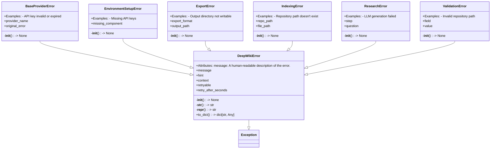
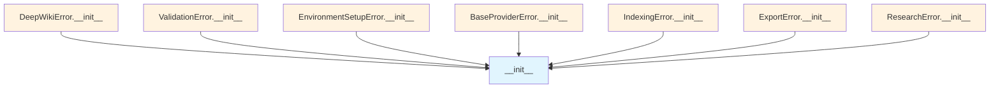

# File: `src/local_deepwiki/errors.py`

## File Overview

This file defines a structured error system for the DeepWiki application, providing a hierarchy of exception classes that include not only standard error messages but also actionable hints and debugging context. The system is designed to improve user experience by offering clear guidance when things go wrong, rather than leaving users to interpret generic or cryptic errors.

The module centralizes error handling logic and provides a consistent interface for raising and managing different types of errors across the application. It leverages a base `DeepWikiError` class and specialized subclasses for specific error domains such as validation, environment setup, provider failures, indexing, export, and research.

## Key Concepts

### Error Hierarchy and Extensibility

The error system is built on a clear inheritance hierarchy:
- `DeepWikiError` serves as the base class for all DeepWiki-specific exceptions.
- Specialized error types (`ValidationError`, `EnvironmentSetupError`, etc.) inherit from `DeepWikiError` and add domain-specific attributes.

This design allows for:
- Uniform handling of errors (e.g., serialization to dictionary for logging or API responses).
- Rich error messages that include hints and context.
- Type-specific behavior and debugging information tailored to the domain of the error.

### Actionable Guidance and Context

Each error includes:
- A `message`: Describing what went wrong.
- A `hint`: Providing actionable steps to resolve the issue.
- A `context`: For debugging, containing relevant metadata.
- Optional fields like `retryable` and `retry_after_seconds` for transient errors.

This approach aligns with the project's goal of making user-facing errors informative and helpful.

### Factory Functions for Error Creation

The file imports factory functions like [`validation_error`](error_factories.md), [`provider_error`](error_factories.md), and others from `local_deepwiki.error_factories`. These functions simplify the creation of specific error types with pre-filled hints and appropriate context, reducing boilerplate and promoting consistency.

## Integration

This module is a core part of the error handling infrastructure, imported and used throughout the codebase:

### Importers
- **`local_deepwiki.error_factories`**: This file is imported to access factory functions that create specific error instances, such as [`validation_error`](error_factories.md), [`provider_error`](error_factories.md), etc.
- **Other modules**: While not directly shown in the file, the classes defined here (`DeepWikiError`, `ValidationError`, etc.) are used by various modules in the project, including:
  - `config_validator.py`
  - `git_utils.py`
  - `error_factories.py` (which likely uses these classes to define its own factory functions)
  - CLI components and handlers

### Callers
- The error classes are referenced by several modules that need to raise structured errors:
  - `DeepWikiError` is used by `_error_handling`.
  - `ValidationError` is used by `config_validator`, `git_utils`, and other modules.
  - `EnvironmentSetupError`, `BaseProviderError`, `IndexingError`, `ExportError`, and `ResearchError` are used by `error_factories` and `test_errors`.

This tight integration ensures that all parts of the application follow a consistent error model, which simplifies debugging and improves user feedback.

## Design Notes

### Why a Base Exception Class?

The `DeepWikiError` base class was chosen to provide a common interface for all errors in the system. It ensures that:
- All errors can be caught uniformly using `except DeepWikiError`.
- Errors have consistent attributes (`message`, `hint`, `context`) for interoperability.
- Serialization (`to_dict`) is standardized for logging, API responses, or UI display.

### Why Separate Error Types?

Separate error classes for different domains (`ValidationError`, `EnvironmentSetupError`, etc.) were introduced to:
- Provide domain-specific context (e.g., `field` in `ValidationError`, `missing_component` in `EnvironmentSetupError`).
- Enable targeted handling logic in callers.
- Improve readability and maintainability by grouping related error information.

### Use of Factory Functions

The reliance on factory functions from `error_factories` indicates a design choice to:
- Encapsulate logic for generating errors with hints and context.
- Reduce duplication of error construction code.
- Allow for centralized hint management (via `EXCEPTION_HINTS`) and error mapping logic.

### Contextual Debugging

The `context` attribute is designed to hold arbitrary key-value pairs that can be used for debugging or logging. This design allows for rich, structured debugging information without requiring changes to the error class hierarchy.

### Truncation of Long Fields

In `ResearchError`, the `question` is truncated to 100 characters when stored in `context`. This prevents overly large context objects and avoids potential issues with logging or serialization, while still preserving enough information for debugging.

### Retryable Errors

The `retryable` and `retry_after_seconds` flags in `DeepWikiError` allow for handling transient errors gracefully, such as those caused by network issues or rate limits. This is an optional feature that can be leveraged in higher-level error handling logic.

## API Reference

### class `DeepWikiError`

**Inherits from:** `Exception`

Base exception for all DeepWiki errors.  All DeepWiki errors include: - message: What happened - hint: How to fix it (optional) - context: Additional debug info (optional)  Attributes: message: A human-readable description of the error. hint: Actionable guidance on how to resolve the error. context: Additional context for debugging.

**Methods:**


<details>
<summary>View Source (lines 53-118) | <a href="https://github.com/UrbanDiver/local-deepwiki-mcp/blob/main/src/local_deepwiki/errors.py#L53-L118">GitHub</a></summary>

```python
class DeepWikiError(Exception):
    """Base exception for all DeepWiki errors.

    All DeepWiki errors include:
    - message: What happened
    - hint: How to fix it (optional)
    - context: Additional debug info (optional)

    Attributes:
        message: A human-readable description of the error.
        hint: Actionable guidance on how to resolve the error.
        context: Additional context for debugging.
    """

    def __init__(
        self,
        message: str,
        hint: str | None = None,
        context: dict[str, Any] | None = None,
        retryable: bool = False,
        retry_after_seconds: int | None = None,
    ) -> None:
        """Initialize the error.

        Args:
            message: What happened.
            hint: How to fix it.
            context: Additional debug info.
            retryable: Whether the operation can be retried.
            retry_after_seconds: Suggested wait before retrying.
        """
        super().__init__(message)
        self.message = message
        self.hint = hint
        self.context = context or {}
        self.retryable = retryable
        self.retry_after_seconds = retry_after_seconds

    def __str__(self) -> str:
        """Format the error message with hint if available."""
        parts = [self.message]
        if self.hint:
            parts.append(f"\nHint: {self.hint}")
        return "".join(parts)

    def __repr__(self) -> str:
        """Return a detailed representation for debugging."""
        return (
            f"{self.__class__.__name__}("
            f"message={self.message!r}, "
            f"hint={self.hint!r}, "
            f"context={self.context!r})"
        )

    def to_dict(self) -> dict[str, Any]:
        """Convert the error to a dictionary for JSON serialization.

        Returns:
            Dictionary containing error details.
        """
        return {
            "error_type": self.__class__.__name__,
            "message": self.message,
            "hint": self.hint,
            "context": self.context,
        }
```

</details>

#### `__init__`

```python
def __init__(message: str, hint: str | None = None, context: dict[str, Any] | None = None, retryable: bool = False, retry_after_seconds: int | None = None) -> None
```

Initialize the error.


| Parameter | Type | Default | Description |
|-----------|------|---------|-------------|
| `message` | `str` | - | What happened. |
| `hint` | `str | None` | `None` | How to fix it. |
| `context` | `dict[str, Any] | None` | `None` | Additional debug info. |
| `retryable` | `bool` | `False` | Whether the operation can be retried. |
| `retry_after_seconds` | `int | None` | `None` | Suggested wait before retrying. |


<details>
<summary>View Source (lines 53-118) | <a href="https://github.com/UrbanDiver/local-deepwiki-mcp/blob/main/src/local_deepwiki/errors.py#L53-L118">GitHub</a></summary>

```python
class DeepWikiError(Exception):
    """Base exception for all DeepWiki errors.

    All DeepWiki errors include:
    - message: What happened
    - hint: How to fix it (optional)
    - context: Additional debug info (optional)

    Attributes:
        message: A human-readable description of the error.
        hint: Actionable guidance on how to resolve the error.
        context: Additional context for debugging.
    """

    def __init__(
        self,
        message: str,
        hint: str | None = None,
        context: dict[str, Any] | None = None,
        retryable: bool = False,
        retry_after_seconds: int | None = None,
    ) -> None:
        """Initialize the error.

        Args:
            message: What happened.
            hint: How to fix it.
            context: Additional debug info.
            retryable: Whether the operation can be retried.
            retry_after_seconds: Suggested wait before retrying.
        """
        super().__init__(message)
        self.message = message
        self.hint = hint
        self.context = context or {}
        self.retryable = retryable
        self.retry_after_seconds = retry_after_seconds

    def __str__(self) -> str:
        """Format the error message with hint if available."""
        parts = [self.message]
        if self.hint:
            parts.append(f"\nHint: {self.hint}")
        return "".join(parts)

    def __repr__(self) -> str:
        """Return a detailed representation for debugging."""
        return (
            f"{self.__class__.__name__}("
            f"message={self.message!r}, "
            f"hint={self.hint!r}, "
            f"context={self.context!r})"
        )

    def to_dict(self) -> dict[str, Any]:
        """Convert the error to a dictionary for JSON serialization.

        Returns:
            Dictionary containing error details.
        """
        return {
            "error_type": self.__class__.__name__,
            "message": self.message,
            "hint": self.hint,
            "context": self.context,
        }
```

</details>

#### `to_dict`

```python
def to_dict() -> dict[str, Any]
```

Convert the error to a dictionary for JSON serialization.


<details>
<summary>View Source (lines 53-118) | <a href="https://github.com/UrbanDiver/local-deepwiki-mcp/blob/main/src/local_deepwiki/errors.py#L53-L118">GitHub</a></summary>

```python
class DeepWikiError(Exception):
    """Base exception for all DeepWiki errors.

    All DeepWiki errors include:
    - message: What happened
    - hint: How to fix it (optional)
    - context: Additional debug info (optional)

    Attributes:
        message: A human-readable description of the error.
        hint: Actionable guidance on how to resolve the error.
        context: Additional context for debugging.
    """

    def __init__(
        self,
        message: str,
        hint: str | None = None,
        context: dict[str, Any] | None = None,
        retryable: bool = False,
        retry_after_seconds: int | None = None,
    ) -> None:
        """Initialize the error.

        Args:
            message: What happened.
            hint: How to fix it.
            context: Additional debug info.
            retryable: Whether the operation can be retried.
            retry_after_seconds: Suggested wait before retrying.
        """
        super().__init__(message)
        self.message = message
        self.hint = hint
        self.context = context or {}
        self.retryable = retryable
        self.retry_after_seconds = retry_after_seconds

    def __str__(self) -> str:
        """Format the error message with hint if available."""
        parts = [self.message]
        if self.hint:
            parts.append(f"\nHint: {self.hint}")
        return "".join(parts)

    def __repr__(self) -> str:
        """Return a detailed representation for debugging."""
        return (
            f"{self.__class__.__name__}("
            f"message={self.message!r}, "
            f"hint={self.hint!r}, "
            f"context={self.context!r})"
        )

    def to_dict(self) -> dict[str, Any]:
        """Convert the error to a dictionary for JSON serialization.

        Returns:
            Dictionary containing error details.
        """
        return {
            "error_type": self.__class__.__name__,
            "message": self.message,
            "hint": self.hint,
            "context": self.context,
        }
```

</details>

### class `ValidationError`

**Inherits from:** `DeepWikiError`

Error raised when input validation fails.  This error indicates that user-provided input is invalid, such as missing required fields, invalid formats, or values outside acceptable ranges.

**Methods:**


<details>
<summary>View Source (lines 121-157) | <a href="https://github.com/UrbanDiver/local-deepwiki-mcp/blob/main/src/local_deepwiki/errors.py#L121-L157">GitHub</a></summary>

```python
class ValidationError(DeepWikiError):
    """Error raised when input validation fails.

    This error indicates that user-provided input is invalid,
    such as missing required fields, invalid formats, or
    values outside acceptable ranges.

    Examples:
        - Invalid repository path
        - Invalid language filter
        - Invalid configuration values
    """

    def __init__(
        self,
        message: str,
        hint: str | None = None,
        context: dict[str, Any] | None = None,
        field: str | None = None,
        value: Any = None,
    ) -> None:
        """Initialize the validation error.

        Args:
            message: What validation failed.
            hint: How to fix it.
            context: Additional debug info.
            field: The name of the invalid field.
            value: The invalid value that was provided.
        """
        super().__init__(message, hint, context)
        self.field = field
        self.value = value
        if field:
            self.context["field"] = field
        if value is not None:
            self.context["value"] = value
```

</details>

#### `__init__`

```python
def __init__(message: str, hint: str | None = None, context: dict[str, Any] | None = None, field: str | None = None, value: Any = None) -> None
```

Initialize the validation error.


| Parameter | Type | Default | Description |
|-----------|------|---------|-------------|
| `message` | `str` | - | What validation failed. |
| `hint` | `str | None` | `None` | How to fix it. |
| `context` | `dict[str, Any] | None` | `None` | Additional debug info. |
| `field` | `str | None` | `None` | The name of the invalid field. |
| `value` | `Any` | `None` | The invalid value that was provided. |


<details>
<summary>View Source (lines 121-157) | <a href="https://github.com/UrbanDiver/local-deepwiki-mcp/blob/main/src/local_deepwiki/errors.py#L121-L157">GitHub</a></summary>

```python
class ValidationError(DeepWikiError):
    """Error raised when input validation fails.

    This error indicates that user-provided input is invalid,
    such as missing required fields, invalid formats, or
    values outside acceptable ranges.

    Examples:
        - Invalid repository path
        - Invalid language filter
        - Invalid configuration values
    """

    def __init__(
        self,
        message: str,
        hint: str | None = None,
        context: dict[str, Any] | None = None,
        field: str | None = None,
        value: Any = None,
    ) -> None:
        """Initialize the validation error.

        Args:
            message: What validation failed.
            hint: How to fix it.
            context: Additional debug info.
            field: The name of the invalid field.
            value: The invalid value that was provided.
        """
        super().__init__(message, hint, context)
        self.field = field
        self.value = value
        if field:
            self.context["field"] = field
        if value is not None:
            self.context["value"] = value
```

</details>

### class `EnvironmentSetupError`

**Inherits from:** `DeepWikiError`

Error raised when environment setup is incomplete.  This error indicates that required dependencies, configuration, or system resources are missing or misconfigured.

**Methods:**


<details>
<summary>View Source (lines 160-190) | <a href="https://github.com/UrbanDiver/local-deepwiki-mcp/blob/main/src/local_deepwiki/errors.py#L160-L190">GitHub</a></summary>

```python
class EnvironmentSetupError(DeepWikiError):
    """Error raised when environment setup is incomplete.

    This error indicates that required dependencies, configuration,
    or system resources are missing or misconfigured.

    Examples:
        - Missing API keys
        - Required tools not installed
        - Configuration file not found
    """

    def __init__(
        self,
        message: str,
        hint: str | None = None,
        context: dict[str, Any] | None = None,
        missing_component: str | None = None,
    ) -> None:
        """Initialize the environment error.

        Args:
            message: What component is missing/misconfigured.
            hint: How to set it up.
            context: Additional debug info.
            missing_component: Name of the missing component.
        """
        super().__init__(message, hint, context)
        self.missing_component = missing_component
        if missing_component:
            self.context["missing_component"] = missing_component
```

</details>

#### `__init__`

```python
def __init__(message: str, hint: str | None = None, context: dict[str, Any] | None = None, missing_component: str | None = None) -> None
```

Initialize the environment error.


| Parameter | Type | Default | Description |
|-----------|------|---------|-------------|
| `message` | `str` | - | What component is missing/misconfigured. |
| `hint` | `str | None` | `None` | How to set it up. |
| `context` | `dict[str, Any] | None` | `None` | Additional debug info. |
| `missing_component` | `str | None` | `None` | Name of the missing component. |


<details>
<summary>View Source (lines 160-190) | <a href="https://github.com/UrbanDiver/local-deepwiki-mcp/blob/main/src/local_deepwiki/errors.py#L160-L190">GitHub</a></summary>

```python
class EnvironmentSetupError(DeepWikiError):
    """Error raised when environment setup is incomplete.

    This error indicates that required dependencies, configuration,
    or system resources are missing or misconfigured.

    Examples:
        - Missing API keys
        - Required tools not installed
        - Configuration file not found
    """

    def __init__(
        self,
        message: str,
        hint: str | None = None,
        context: dict[str, Any] | None = None,
        missing_component: str | None = None,
    ) -> None:
        """Initialize the environment error.

        Args:
            message: What component is missing/misconfigured.
            hint: How to set it up.
            context: Additional debug info.
            missing_component: Name of the missing component.
        """
        super().__init__(message, hint, context)
        self.missing_component = missing_component
        if missing_component:
            self.context["missing_component"] = missing_component
```

</details>

### class `BaseProviderError`

**Inherits from:** `DeepWikiError`

Error raised when an LLM or embedding provider fails.  This error wraps failures from external AI providers like Anthropic, OpenAI, or Ollama. It includes the original exception for debugging.

**Methods:**


<details>
<summary>View Source (lines 193-231) | <a href="https://github.com/UrbanDiver/local-deepwiki-mcp/blob/main/src/local_deepwiki/errors.py#L193-L231">GitHub</a></summary>

```python
class BaseProviderError(DeepWikiError):
    """Error raised when an LLM or embedding provider fails.

    This error wraps failures from external AI providers like
    Anthropic, OpenAI, or Ollama. It includes the original
    exception for debugging.

    Examples:
        - API key invalid or expired
        - Network connectivity issues
        - Rate limiting
        - Model not available
    """

    def __init__(
        self,
        message: str,
        hint: str | None = None,
        context: dict[str, Any] | None = None,
        provider_name: str | None = None,
        original_error: Exception | None = None,
    ) -> None:
        """Initialize the provider error.

        Args:
            message: What provider operation failed.
            hint: How to fix it.
            context: Additional debug info.
            provider_name: Name of the failing provider.
            original_error: The original exception from the provider.
        """
        super().__init__(message, hint, context)
        self.provider_name = provider_name
        self.original_error = original_error
        if provider_name:
            self.context["provider"] = provider_name
        if original_error:
            self.context["original_error"] = str(original_error)
            self.context["original_error_type"] = type(original_error).__name__
```

</details>

#### `__init__`

```python
def __init__(message: str, hint: str | None = None, context: dict[str, Any] | None = None, provider_name: str | None = None, original_error: Exception | None = None) -> None
```

Initialize the provider error.


| Parameter | Type | Default | Description |
|-----------|------|---------|-------------|
| `message` | `str` | - | What provider operation failed. |
| `hint` | `str | None` | `None` | How to fix it. |
| `context` | `dict[str, Any] | None` | `None` | Additional debug info. |
| `provider_name` | `str | None` | `None` | Name of the failing provider. |
| `original_error` | `Exception | None` | `None` | The original exception from the provider. |


<details>
<summary>View Source (lines 193-231) | <a href="https://github.com/UrbanDiver/local-deepwiki-mcp/blob/main/src/local_deepwiki/errors.py#L193-L231">GitHub</a></summary>

```python
class BaseProviderError(DeepWikiError):
    """Error raised when an LLM or embedding provider fails.

    This error wraps failures from external AI providers like
    Anthropic, OpenAI, or Ollama. It includes the original
    exception for debugging.

    Examples:
        - API key invalid or expired
        - Network connectivity issues
        - Rate limiting
        - Model not available
    """

    def __init__(
        self,
        message: str,
        hint: str | None = None,
        context: dict[str, Any] | None = None,
        provider_name: str | None = None,
        original_error: Exception | None = None,
    ) -> None:
        """Initialize the provider error.

        Args:
            message: What provider operation failed.
            hint: How to fix it.
            context: Additional debug info.
            provider_name: Name of the failing provider.
            original_error: The original exception from the provider.
        """
        super().__init__(message, hint, context)
        self.provider_name = provider_name
        self.original_error = original_error
        if provider_name:
            self.context["provider"] = provider_name
        if original_error:
            self.context["original_error"] = str(original_error)
            self.context["original_error_type"] = type(original_error).__name__
```

</details>

### class `IndexingError`

**Inherits from:** `DeepWikiError`

Error raised when repository indexing fails.  This error indicates problems during the indexing process, such as permission issues, unsupported files, or resource exhaustion.

**Methods:**


<details>
<summary>View Source (lines 234-271) | <a href="https://github.com/UrbanDiver/local-deepwiki-mcp/blob/main/src/local_deepwiki/errors.py#L234-L271">GitHub</a></summary>

```python
class IndexingError(DeepWikiError):
    """Error raised when repository indexing fails.

    This error indicates problems during the indexing process,
    such as permission issues, unsupported files, or resource
    exhaustion.

    Examples:
        - Repository path doesn't exist
        - Permission denied on files
        - Parsing errors
        - Vector store failures
    """

    def __init__(
        self,
        message: str,
        hint: str | None = None,
        context: dict[str, Any] | None = None,
        repo_path: str | None = None,
        file_path: str | None = None,
    ) -> None:
        """Initialize the indexing error.

        Args:
            message: What indexing operation failed.
            hint: How to fix it.
            context: Additional debug info.
            repo_path: Path to the repository being indexed.
            file_path: Specific file that caused the error.
        """
        super().__init__(message, hint, context)
        self.repo_path = repo_path
        self.file_path = file_path
        if repo_path:
            self.context["repo_path"] = repo_path
        if file_path:
            self.context["file_path"] = file_path
```

</details>

#### `__init__`

```python
def __init__(message: str, hint: str | None = None, context: dict[str, Any] | None = None, repo_path: str | None = None, file_path: str | None = None) -> None
```

Initialize the indexing error.


| Parameter | Type | Default | Description |
|-----------|------|---------|-------------|
| `message` | `str` | - | What indexing operation failed. |
| `hint` | `str | None` | `None` | How to fix it. |
| `context` | `dict[str, Any] | None` | `None` | Additional debug info. |
| `repo_path` | `str | None` | `None` | Path to the repository being indexed. |
| `file_path` | `str | None` | `None` | Specific file that caused the error. |


<details>
<summary>View Source (lines 234-271) | <a href="https://github.com/UrbanDiver/local-deepwiki-mcp/blob/main/src/local_deepwiki/errors.py#L234-L271">GitHub</a></summary>

```python
class IndexingError(DeepWikiError):
    """Error raised when repository indexing fails.

    This error indicates problems during the indexing process,
    such as permission issues, unsupported files, or resource
    exhaustion.

    Examples:
        - Repository path doesn't exist
        - Permission denied on files
        - Parsing errors
        - Vector store failures
    """

    def __init__(
        self,
        message: str,
        hint: str | None = None,
        context: dict[str, Any] | None = None,
        repo_path: str | None = None,
        file_path: str | None = None,
    ) -> None:
        """Initialize the indexing error.

        Args:
            message: What indexing operation failed.
            hint: How to fix it.
            context: Additional debug info.
            repo_path: Path to the repository being indexed.
            file_path: Specific file that caused the error.
        """
        super().__init__(message, hint, context)
        self.repo_path = repo_path
        self.file_path = file_path
        if repo_path:
            self.context["repo_path"] = repo_path
        if file_path:
            self.context["file_path"] = file_path
```

</details>

### class `ExportError`

**Inherits from:** `DeepWikiError`

Error raised when wiki export fails.  This error indicates problems during HTML or PDF export, such as missing dependencies, permission issues, or invalid output paths.

**Methods:**


<details>
<summary>View Source (lines 274-310) | <a href="https://github.com/UrbanDiver/local-deepwiki-mcp/blob/main/src/local_deepwiki/errors.py#L274-L310">GitHub</a></summary>

```python
class ExportError(DeepWikiError):
    """Error raised when wiki export fails.

    This error indicates problems during HTML or PDF export,
    such as missing dependencies, permission issues, or
    invalid output paths.

    Examples:
        - Output directory not writable
        - WeasyPrint/mermaid-cli not installed
        - Corrupted wiki content
    """

    def __init__(
        self,
        message: str,
        hint: str | None = None,
        context: dict[str, Any] | None = None,
        export_format: str | None = None,
        output_path: str | None = None,
    ) -> None:
        """Initialize the export error.

        Args:
            message: What export operation failed.
            hint: How to fix it.
            context: Additional debug info.
            export_format: The export format (html, pdf).
            output_path: The target output path.
        """
        super().__init__(message, hint, context)
        self.export_format = export_format
        self.output_path = output_path
        if export_format:
            self.context["format"] = export_format
        if output_path:
            self.context["output_path"] = output_path
```

</details>

#### `__init__`

```python
def __init__(message: str, hint: str | None = None, context: dict[str, Any] | None = None, export_format: str | None = None, output_path: str | None = None) -> None
```

Initialize the export error.


| Parameter | Type | Default | Description |
|-----------|------|---------|-------------|
| `message` | `str` | - | What export operation failed. |
| `hint` | `str | None` | `None` | How to fix it. |
| `context` | `dict[str, Any] | None` | `None` | Additional debug info. |
| `export_format` | `str | None` | `None` | The export format (html, pdf). |
| `output_path` | `str | None` | `None` | The target output path. |


<details>
<summary>View Source (lines 274-310) | <a href="https://github.com/UrbanDiver/local-deepwiki-mcp/blob/main/src/local_deepwiki/errors.py#L274-L310">GitHub</a></summary>

```python
class ExportError(DeepWikiError):
    """Error raised when wiki export fails.

    This error indicates problems during HTML or PDF export,
    such as missing dependencies, permission issues, or
    invalid output paths.

    Examples:
        - Output directory not writable
        - WeasyPrint/mermaid-cli not installed
        - Corrupted wiki content
    """

    def __init__(
        self,
        message: str,
        hint: str | None = None,
        context: dict[str, Any] | None = None,
        export_format: str | None = None,
        output_path: str | None = None,
    ) -> None:
        """Initialize the export error.

        Args:
            message: What export operation failed.
            hint: How to fix it.
            context: Additional debug info.
            export_format: The export format (html, pdf).
            output_path: The target output path.
        """
        super().__init__(message, hint, context)
        self.export_format = export_format
        self.output_path = output_path
        if export_format:
            self.context["format"] = export_format
        if output_path:
            self.context["output_path"] = output_path
```

</details>

### class `ResearchError`

**Inherits from:** `DeepWikiError`

Error raised when deep research fails.  This error indicates problems during the deep research pipeline, such as LLM failures, timeout, or cancellation.

**Methods:**


<details>
<summary>View Source (lines 313-348) | <a href="https://github.com/UrbanDiver/local-deepwiki-mcp/blob/main/src/local_deepwiki/errors.py#L313-L348">GitHub</a></summary>

```python
class ResearchError(DeepWikiError):
    """Error raised when deep research fails.

    This error indicates problems during the deep research
    pipeline, such as LLM failures, timeout, or cancellation.

    Examples:
        - LLM generation failed
        - Research timeout
        - Vector search failures
    """

    def __init__(
        self,
        message: str,
        hint: str | None = None,
        context: dict[str, Any] | None = None,
        step: str | None = None,
        question: str | None = None,
    ) -> None:
        """Initialize the research error.

        Args:
            message: What research operation failed.
            hint: How to fix it.
            context: Additional debug info.
            step: The research step that failed.
            question: The research question being processed.
        """
        super().__init__(message, hint, context)
        self.step = step
        self.question = question
        if step:
            self.context["step"] = step
        if question:
            self.context["question"] = question[:100]  # Truncate long questions
```

</details>

#### `__init__`

```python
def __init__(message: str, hint: str | None = None, context: dict[str, Any] | None = None, step: str | None = None, question: str | None = None) -> None
```

Initialize the research error.


| Parameter | Type | Default | Description |
|-----------|------|---------|-------------|
| `message` | `str` | - | What research operation failed. |
| `hint` | `str | None` | `None` | How to fix it. |
| `context` | `dict[str, Any] | None` | `None` | Additional debug info. |
| `step` | `str | None` | `None` | The research step that failed. |
| `question` | `str | None` | `None` | The research question being processed. |


<details>
<summary>View Source (lines 313-348) | <a href="https://github.com/UrbanDiver/local-deepwiki-mcp/blob/main/src/local_deepwiki/errors.py#L313-L348">GitHub</a></summary>

```python
class ResearchError(DeepWikiError):
    """Error raised when deep research fails.

    This error indicates problems during the deep research
    pipeline, such as LLM failures, timeout, or cancellation.

    Examples:
        - LLM generation failed
        - Research timeout
        - Vector search failures
    """

    def __init__(
        self,
        message: str,
        hint: str | None = None,
        context: dict[str, Any] | None = None,
        step: str | None = None,
        question: str | None = None,
    ) -> None:
        """Initialize the research error.

        Args:
            message: What research operation failed.
            hint: How to fix it.
            context: Additional debug info.
            step: The research step that failed.
            question: The research question being processed.
        """
        super().__init__(message, hint, context)
        self.step = step
        self.question = question
        if step:
            self.context["step"] = step
        if question:
            self.context["question"] = question[:100]  # Truncate long questions
```

</details>

## Class Diagram



## Call Graph



## Used By

Functions and methods in this file and their callers:

- **`__init__`**: called by `BaseProviderError.__init__`, `DeepWikiError.__init__`, `EnvironmentSetupError.__init__`, `ExportError.__init__`, `IndexingError.__init__`, `ResearchError.__init__`, `ValidationError.__init__`

## Usage Examples

*Examples extracted from test files*

### Test that basic error message is formatted correctly

From `test_errors.py::TestDeepWikiError::test_basic_error_message`:

```python
error = DeepWikiError("Something went wrong")
assert str(error) == "Something went wrong"
assert error.message == "Something went wrong"
assert error.hint is None
assert error.context == {}
```

### Test that error with hint is formatted correctly

From `test_errors.py::TestDeepWikiError::test_error_with_hint`:

```python
error = DeepWikiError("Something went wrong", hint="Try again later")
assert "Something went wrong" in str(error)
assert "Hint: Try again later" in str(error)
```

### Test basic validation error

From `test_errors.py::TestValidationError::test_basic_validation_error`:

```python
error = ValidationError("Invalid input")
assert "Invalid input" in str(error)
assert error.field is None
assert error.value is None
```

### Test validation error with field info

From `test_errors.py::TestValidationError::test_validation_error_with_field`:

```python
error = ValidationError(
    "Invalid repository path",
    hint="Check the path",
    field="repo_path",
    value="/nonexistent/path",
)
assert error.field == "repo_path"
assert error.value == "/nonexistent/path"
```

### Test basic environment error

From `test_errors.py::TestEnvironmentSetupError::test_basic_environment_error`:

```python
error = EnvironmentSetupError("Missing dependency")
assert "Missing dependency" in str(error)
assert error.missing_component is None
```


## Last Modified

| Entity | Type | Author | Date | Commit |
|--------|------|--------|------|--------|
| `DeepWikiError` | class | Brian Breidenbach | Feb 14, 2026 | `2732638` feat: agent UX improvements... |
| `BaseProviderError` | class | Brian Breidenbach | Feb 11, 2026 | `6abec40` fix: publication review P3 ... |
| `EnvironmentSetupError` | class | Brian Breidenbach | Feb 11, 2026 | `25db622` fix: publication review P0-... |
| `ValidationError` | class | Brian Breidenbach | Jan 26, 2026 | `d7c79d3` Add three quick-win enhance... |
| `IndexingError` | class | Brian Breidenbach | Jan 26, 2026 | `d7c79d3` Add three quick-win enhance... |
| `ExportError` | class | Brian Breidenbach | Jan 26, 2026 | `d7c79d3` Add three quick-win enhance... |
| `ResearchError` | class | Brian Breidenbach | Jan 26, 2026 | `d7c79d3` Add three quick-win enhance... |

## Relevant Source Files

- `src/local_deepwiki/errors.py:53-118`
