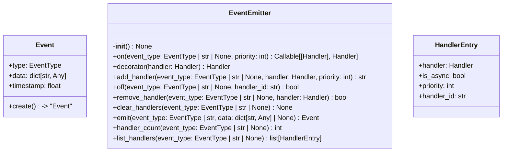

# File: `src/local_deepwiki/events.py`

## File Overview

This file implements a **pub-sub event system** used throughout the `local-deepwiki` application to emit and handle lifecycle events during indexing, wiki generation, and other operations. It provides a centralized mechanism for components to react to key events without tight coupling, enabling modular and extensible behavior.

The event system supports both synchronous and asynchronous event handlers, with priority-based execution to control the order of handler invocation. The system is designed to be thread-safe and suitable for use in an async context, leveraging `asyncio` and `contextvars` for proper handling in concurrent environments.

## Key Concepts

### Event Emission and Handling
The core abstraction is the `EventEmitter` class, which implements a standard observer pattern:
- Events are defined by the `EventType` enum, ensuring type safety and consistency.
- Handlers can be registered for specific event types or globally (for all events).
- Handlers are executed in priority order, with higher priority handlers running first.
- Both synchronous and asynchronous handlers are supported, allowing flexibility in handler implementation.

### Global Event Emitter
A global `EventEmitter` instance is maintained using a `ContextVar`, ensuring that all modules can access the same event bus without needing to pass references around. This simplifies integration and supports a clean API for event subscription and emission.

### Asynchronous Support
The system is fully asynchronous, with `emit()` supporting both sync and async handler execution. This is essential for I/O-bound operations like logging, network calls, or database writes that are common in indexing and research workflows.

### Handler Management
Handlers are uniquely identified by a UUID, allowing for precise removal by ID or reference. This enables dynamic handler management, which is useful for test scenarios or runtime configuration changes.

## Integration

This module is a foundational part of the `local-deepwiki` architecture, used by:
- **Core components** like the indexer and wiki generator to emit lifecycle events.
- **Testing utilities** (`test_events`, `test_watcher_debounce`, `test_graph_rag_indexer_integration`) to monitor and verify event emission.
- **Integration points** like the `indexer` and `graph_rag` modules to react to events and customize behavior.

The module is imported by:
- `src/local_deepwiki/cli/main.py` (likely for CLI event handling)
- `src/local_deepwiki/config/loader.py` (for configuration-related events)
- `src/local_deepwiki/core/graph_rag/models.py` (for graph extraction events)
- `src/local_deepwiki/core/rate_limiter.py` (possibly for rate-limiting events)

This integration enables a loosely-coupled architecture where components can react to events without direct dependencies, promoting modularity and testability.

## Design Notes

### Why `StrEnum` for `EventType`
`EventType` is defined as a `StrEnum` to provide:
- Type safety for event types.
- Automatic string conversion, allowing both enum values and string literals to be used when registering handlers or emitting events.

### Why `ContextVar` for Global Emitter
The global `EventEmitter` is stored in a `ContextVar` to:
- Support async contexts correctly.
- Allow for easy reset in tests, ensuring clean state between test runs.
- Avoid global mutable state that can be hard to manage or reason about.

### Handler Prioritization
Handlers are sorted by priority at registration time to ensure consistent execution order. This is crucial for:
- Ensuring critical handlers (e.g., logging, metrics) run before others.
- Supporting ordered processing in complex workflows.

### Error Handling in Handlers
The `emit()` method isolates exceptions in individual handlers:
- If a handler throws an exception, it is logged and the rest of the handlers continue to run.
- This prevents one misbehaving handler from crashing the entire event system.

### Use of `attrgetter` for Sorting
The code uses `attrgetter("priority")` for sorting handlers, which is a performance and readability choice:
- It avoids lambda functions and is more efficient.
- It keeps the sorting logic clear and consistent.

### `clear_handlers` and `reset_event_emitter`
These functions are designed primarily for testing:
- `clear_handlers` allows selective cleanup of handlers.
- `reset_event_emitter` resets the global state, useful for test isolation.

This design choice reflects the need for testability in an event-driven architecture, where event handlers might accumulate across tests and interfere with each other.

## API Reference

### class `EventType`

**Inherits from:** `StrEnum`

Event types emitted during operations.


<details>
<summary>View Source (lines 35-63) | <a href="https://github.com/UrbanDiver/local-deepwiki-mcp/blob/main/src/local_deepwiki/events.py#L35-L63">GitHub</a></summary>

```python
class EventType(StrEnum):
    """Event types emitted during operations."""

    # Indexing events
    INDEX_START = "index.start"
    INDEX_FILE = "index.file"
    INDEX_CHUNK = "index.chunk"
    INDEX_COMPLETE = "index.complete"
    INDEX_ERROR = "index.error"

    # Wiki generation events
    WIKI_START = "wiki.start"
    WIKI_PAGE_START = "wiki.page.start"
    WIKI_PAGE_COMPLETE = "wiki.page.complete"
    WIKI_COMPLETE = "wiki.complete"
    WIKI_ERROR = "wiki.error"

    # Research events (deep research)
    RESEARCH_START = "research.start"
    RESEARCH_QUERY = "research.query"
    RESEARCH_COMPLETE = "research.complete"

    # Graph RAG events
    GRAPH_EXTRACT_START = "graph.extract.start"
    GRAPH_EXTRACT_COMPLETE = "graph.extract.complete"

    # General events
    ERROR = "error"
    WARNING = "warning"
```

</details>

### class `Event`

An event with type and associated data.

**Methods:**


<details>
<summary>View Source (lines 67-95) | <a href="https://github.com/UrbanDiver/local-deepwiki-mcp/blob/main/src/local_deepwiki/events.py#L67-L95">GitHub</a></summary>

```python
class Event:
    """An event with type and associated data."""

    type: EventType
    data: dict[str, Any] = field(default_factory=dict)
    timestamp: float = field(default_factory=lambda: __import__("time").time())

    @classmethod
    def create(
        cls,
        type: EventType | str,
        data: dict[str, Any] | None = None,
        timestamp: float | None = None,
    ) -> "Event":
        """Create an Event, coercing string type to EventType if needed.

        Args:
            type: The event type (EventType enum or string).
            data: Optional event data.
            timestamp: Optional timestamp (auto-generated if omitted).

        Returns:
            A new Event instance.
        """
        event_type = EventType(type) if isinstance(type, str) else type
        kwargs: dict[str, Any] = {"type": event_type, "data": data or {}}
        if timestamp is not None:
            kwargs["timestamp"] = timestamp
        return cls(**kwargs)
```

</details>

#### `create`

```python
def create(type: EventType | str, data: dict[str, Any] | None = None, timestamp: float | None = None) -> "Event"
```

Create an Event, coercing string type to EventType if needed.


| Parameter | Type | Default | Description |
|-----------|------|---------|-------------|
| `type` | `EventType | str` | - | The event type (EventType enum or string). |
| `data` | `dict[str, Any] | None` | `None` | Optional event data. |
| `timestamp` | `float | None` | `None` | Optional timestamp (auto-generated if omitted). |


<details>
<summary>View Source (lines 67-95) | <a href="https://github.com/UrbanDiver/local-deepwiki-mcp/blob/main/src/local_deepwiki/events.py#L67-L95">GitHub</a></summary>

```python
class Event:
    """An event with type and associated data."""

    type: EventType
    data: dict[str, Any] = field(default_factory=dict)
    timestamp: float = field(default_factory=lambda: __import__("time").time())

    @classmethod
    def create(
        cls,
        type: EventType | str,
        data: dict[str, Any] | None = None,
        timestamp: float | None = None,
    ) -> "Event":
        """Create an Event, coercing string type to EventType if needed.

        Args:
            type: The event type (EventType enum or string).
            data: Optional event data.
            timestamp: Optional timestamp (auto-generated if omitted).

        Returns:
            A new Event instance.
        """
        event_type = EventType(type) if isinstance(type, str) else type
        kwargs: dict[str, Any] = {"type": event_type, "data": data or {}}
        if timestamp is not None:
            kwargs["timestamp"] = timestamp
        return cls(**kwargs)
```

</details>

### class `HandlerEntry`

A registered event handler with priority.


<details>
<summary>View Source (lines 105-111) | <a href="https://github.com/UrbanDiver/local-deepwiki-mcp/blob/main/src/local_deepwiki/events.py#L105-L111">GitHub</a></summary>

```python
class HandlerEntry:
    """A registered event handler with priority."""

    handler: Handler
    is_async: bool
    priority: int = 0
    handler_id: str = field(default_factory=lambda: str(uuid.uuid4()))
```

</details>

### class `EventEmitter`

Event emitter for subscribing to and emitting events.  Supports both synchronous and asynchronous handlers with priority ordering.

**Methods:**


<details>
<summary>View Source (lines 114-369) | <a href="https://github.com/UrbanDiver/local-deepwiki-mcp/blob/main/src/local_deepwiki/events.py#L114-L369">GitHub</a></summary>

```python
class EventEmitter:
    # Methods: __init__, on, decorator, add_handler, off, remove_handler, clear_handlers, emit, handler_count, list_handlers
```

</details>

#### `__init__`

```python
def __init__() -> None
```

Initialize the event emitter.


<details>
<summary>View Source (lines 133-136) | <a href="https://github.com/UrbanDiver/local-deepwiki-mcp/blob/main/src/local_deepwiki/events.py#L133-L136">GitHub</a></summary>

```python
def __init__(self) -> None:
        """Initialize the event emitter."""
        self._handlers: dict[EventType, list[HandlerEntry]] = {}
        self._global_handlers: list[HandlerEntry] = []
```

</details>

#### `on`

```python
def on(event_type: EventType | str | None = None, priority: int = 0) -> Callable[[Handler], Handler]
```

Decorator to register an event handler.


| Parameter | Type | Default | Description |
|-----------|------|---------|-------------|
| `event_type` | `EventType | str | None` | `None` | The event type to listen for, or None for all events. |
| `priority` | `int` | `0` | Handler priority (higher runs first). |


<details>
<summary>View Source (lines 138-162) | <a href="https://github.com/UrbanDiver/local-deepwiki-mcp/blob/main/src/local_deepwiki/events.py#L138-L162">GitHub</a></summary>

```python
def on(
        self,
        event_type: EventType | str | None = None,
        priority: int = 0,
    ) -> Callable[[Handler], Handler]:
        """Decorator to register an event handler.

        Args:
            event_type: The event type to listen for, or None for all events.
            priority: Handler priority (higher runs first).

        Returns:
            Decorator function.

        Example:
            @emitter.on(EventType.INDEX_FILE)
            def handler(event):
                print(event.data)
        """

        def decorator(handler: Handler) -> Handler:
            self.add_handler(event_type, handler, priority)
            return handler

        return decorator
```

</details>

#### `decorator`

```python
def decorator(handler: Handler) -> Handler
```


| Parameter | Type | Default | Description |
|-----------|------|---------|-------------|
| `handler` | `Handler` | - | - |


<details>
<summary>View Source (lines 158-160) | <a href="https://github.com/UrbanDiver/local-deepwiki-mcp/blob/main/src/local_deepwiki/events.py#L158-L160">GitHub</a></summary>

```python
def decorator(handler: Handler) -> Handler:
            self.add_handler(event_type, handler, priority)
            return handler
```

</details>

#### `add_handler`

```python
def add_handler(event_type: EventType | str | None, handler: Handler, priority: int = 0) -> str
```

Register an event handler.


| Parameter | Type | Default | Description |
|-----------|------|---------|-------------|
| `event_type` | `EventType | str | None` | - | The event type to listen for, or None for all events. |
| `handler` | `Handler` | - | The handler function (sync or async). |
| `priority` | `int` | `0` | Handler priority (higher runs first). |


<details>
<summary>View Source (lines 164-211) | <a href="https://github.com/UrbanDiver/local-deepwiki-mcp/blob/main/src/local_deepwiki/events.py#L164-L211">GitHub</a></summary>

```python
def add_handler(
        self,
        event_type: EventType | str | None,
        handler: Handler,
        priority: int = 0,
    ) -> str:
        """Register an event handler.

        Args:
            event_type: The event type to listen for, or None for all events.
            handler: The handler function (sync or async).
            priority: Handler priority (higher runs first).

        Returns:
            The handler ID for later removal.
        """
        entry = HandlerEntry(
            handler=handler,
            is_async=asyncio.iscoroutinefunction(handler),
            priority=priority,
        )

        if event_type is None:
            self._global_handlers.append(entry)
            self._global_handlers = sorted(
                self._global_handlers, key=attrgetter("priority"), reverse=True
            )
        else:
            if isinstance(event_type, str):
                event_type = EventType(event_type)

            if event_type not in self._handlers:
                self._handlers[event_type] = []

            self._handlers[event_type].append(entry)
            self._handlers[event_type] = sorted(
                self._handlers[event_type], key=attrgetter("priority"), reverse=True
            )

        logger.debug(
            "Registered handler %s for %s (priority=%d, async=%s)",
            entry.handler_id,
            event_type or "all events",
            priority,
            entry.is_async,
        )

        return entry.handler_id
```

</details>

#### `off`

```python
def off(event_type: EventType | str | None, handler_id: str) -> bool
```

Remove a handler by its ID.


| Parameter | Type | Default | Description |
|-----------|------|---------|-------------|
| `event_type` | `EventType | str | None` | - | The event type (unused, kept for API compatibility). |
| `handler_id` | `str` | - | The handler's unique ID. |


<details>
<summary>View Source (lines 213-236) | <a href="https://github.com/UrbanDiver/local-deepwiki-mcp/blob/main/src/local_deepwiki/events.py#L213-L236">GitHub</a></summary>

```python
def off(self, event_type: EventType | str | None, handler_id: str) -> bool:
        """Remove a handler by its ID.

        Args:
            event_type: The event type (unused, kept for API compatibility).
            handler_id: The handler's unique ID.

        Returns:
            True if handler was found and removed.
        """
        # Search global handlers
        for i, entry in enumerate(self._global_handlers):
            if entry.handler_id == handler_id:
                self._global_handlers.pop(i)
                return True

        # Search event-specific handlers
        for evt_type, handlers in self._handlers.items():
            for i, entry in enumerate(handlers):
                if entry.handler_id == handler_id:
                    handlers.pop(i)
                    return True

        return False
```

</details>

#### `remove_handler`

```python
def remove_handler(event_type: EventType | str | None, handler: Handler) -> bool
```

Remove an event handler by reference.


| Parameter | Type | Default | Description |
|-----------|------|---------|-------------|
| `event_type` | `EventType | str | None` | - | The event type, or None for global handlers. |
| `handler` | `Handler` | - | The handler to remove. |


<details>
<summary>View Source (lines 238-270) | <a href="https://github.com/UrbanDiver/local-deepwiki-mcp/blob/main/src/local_deepwiki/events.py#L238-L270">GitHub</a></summary>

```python
def remove_handler(
        self,
        event_type: EventType | str | None,
        handler: Handler,
    ) -> bool:
        """Remove an event handler by reference.

        Args:
            event_type: The event type, or None for global handlers.
            handler: The handler to remove.

        Returns:
            True if handler was found and removed.
        """
        if event_type is None:
            for i, entry in enumerate(self._global_handlers):
                if entry.handler is handler:
                    self._global_handlers.pop(i)
                    return True
            return False

        if isinstance(event_type, str):
            event_type = EventType(event_type)

        if event_type not in self._handlers:
            return False

        for i, entry in enumerate(self._handlers[event_type]):
            if entry.handler is handler:
                self._handlers[event_type].pop(i)
                return True

        return False
```

</details>

#### `clear_handlers`

```python
def clear_handlers(event_type: EventType | str | None = None) -> None
```

Clear all handlers for an event type or all handlers.


| Parameter | Type | Default | Description |
|-----------|------|---------|-------------|
| `event_type` | `EventType | str | None` | `None` | The event type to clear, or None to clear all. |


<details>
<summary>View Source (lines 272-284) | <a href="https://github.com/UrbanDiver/local-deepwiki-mcp/blob/main/src/local_deepwiki/events.py#L272-L284">GitHub</a></summary>

```python
def clear_handlers(self, event_type: EventType | str | None = None) -> None:
        """Clear all handlers for an event type or all handlers.

        Args:
            event_type: The event type to clear, or None to clear all.
        """
        if event_type is None:
            self._handlers.clear()
            self._global_handlers.clear()
        else:
            if isinstance(event_type, str):
                event_type = EventType(event_type)
            self._handlers.pop(event_type, None)
```

</details>

#### `emit`

```python
async def emit(event_type: EventType | str, data: dict[str, Any] | None = None) -> Event
```

Emit an event to all registered handlers.


| Parameter | Type | Default | Description |
|-----------|------|---------|-------------|
| `event_type` | `EventType | str` | - | The event type to emit. |
| `data` | `dict[str, Any] | None` | `None` | Optional event data. |


<details>
<summary>View Source (lines 286-330) | <a href="https://github.com/UrbanDiver/local-deepwiki-mcp/blob/main/src/local_deepwiki/events.py#L286-L330">GitHub</a></summary>

```python
async def emit(
        self,
        event_type: EventType | str,
        data: dict[str, Any] | None = None,
    ) -> Event:
        """Emit an event to all registered handlers.

        Args:
            event_type: The event type to emit.
            data: Optional event data.

        Returns:
            The emitted event.
        """
        if isinstance(event_type, str):
            event_type = EventType(event_type)

        event = Event.create(type=event_type, data=data)

        # Collect handlers (global + specific)
        handlers = list(self._global_handlers)
        if event_type in self._handlers:
            handlers.extend(self._handlers[event_type])

        # Sort by priority
        handlers = sorted(handlers, key=attrgetter("priority"), reverse=True)

        # Execute handlers
        for entry in handlers:
            try:
                if entry.is_async:
                    async_handler: AsyncHandler = entry.handler  # type: ignore[assignment]
                    await async_handler(event)
                else:
                    sync_handler: SyncHandler = entry.handler  # type: ignore[assignment]
                    sync_handler(event)
            except Exception as e:  # noqa: BLE001 — event handler isolation: user-provided callbacks must not crash the event bus
                logger.error(
                    "Error in event handler %s for %s: %s",
                    entry.handler_id,
                    event_type,
                    e,
                )

        return event
```

</details>

#### `handler_count`

```python
def handler_count(event_type: EventType | str | None = None) -> int
```

Get the number of handlers for an event type.


| Parameter | Type | Default | Description |
|-----------|------|---------|-------------|
| `event_type` | `EventType | str | None` | `None` | The event type, or None for total count. |


<details>
<summary>View Source (lines 332-350) | <a href="https://github.com/UrbanDiver/local-deepwiki-mcp/blob/main/src/local_deepwiki/events.py#L332-L350">GitHub</a></summary>

```python
def handler_count(self, event_type: EventType | str | None = None) -> int:
        """Get the number of handlers for an event type.

        Args:
            event_type: The event type, or None for total count.

        Returns:
            Number of handlers.
        """
        if event_type is None:
            total = len(self._global_handlers)
            for handlers in self._handlers.values():
                total += len(handlers)
            return total

        if isinstance(event_type, str):
            event_type = EventType(event_type)

        return len(self._handlers.get(event_type, []))
```

</details>

#### `list_handlers`

```python
def list_handlers(event_type: EventType | str | None = None) -> list[HandlerEntry]
```

List handlers for an event type.


| Parameter | Type | Default | Description |
|-----------|------|---------|-------------|
| `event_type` | `EventType | str | None` | `None` | The event type, or None for global handlers. |


---


<details>
<summary>View Source (lines 352-369) | <a href="https://github.com/UrbanDiver/local-deepwiki-mcp/blob/main/src/local_deepwiki/events.py#L352-L369">GitHub</a></summary>

```python
def list_handlers(
        self, event_type: EventType | str | None = None
    ) -> list[HandlerEntry]:
        """List handlers for an event type.

        Args:
            event_type: The event type, or None for global handlers.

        Returns:
            List of handler entries.
        """
        if event_type is None:
            return list(self._global_handlers)

        if isinstance(event_type, str):
            event_type = EventType(event_type)

        return list(self._handlers.get(event_type, []))
```

</details>

### Functions

#### `get_event_emitter`

```python
def get_event_emitter() -> EventEmitter
```

Get the global event emitter instance.

**Returns:** `EventEmitter`


<details>
<summary>View Source (lines 376-386) | <a href="https://github.com/UrbanDiver/local-deepwiki-mcp/blob/main/src/local_deepwiki/events.py#L376-L386">GitHub</a></summary>

```python
def get_event_emitter() -> EventEmitter:
    """Get the global event emitter instance.

    Returns:
        The global EventEmitter singleton.
    """
    val = _emitter_var.get()
    if val is None:
        val = EventEmitter()
        _emitter_var.set(val)
    return val
```

</details>

#### `reset_event_emitter`

```python
def reset_event_emitter() -> None
```

Reset the global event emitter.  Useful for testing.

**Returns:** `None`


<details>
<summary>View Source (lines 389-397) | <a href="https://github.com/UrbanDiver/local-deepwiki-mcp/blob/main/src/local_deepwiki/events.py#L389-L397">GitHub</a></summary>

```python
def reset_event_emitter() -> None:
    """Reset the global event emitter.

    Useful for testing.
    """
    val = _emitter_var.get()
    if val is not None:
        val.clear_handlers()
    _emitter_var.set(None)
```

</details>

## Class Diagram



## Call Graph

```mermaid
flowchart TD
    N0[Event.create]
    N1[EventEmitter]
    N2[EventEmitter.add_handler]
    N3[EventEmitter.clear_handlers]
    N4[EventEmitter.decorator]
    N5[EventEmitter.emit]
    N6[EventEmitter.handler_count]
    N7[EventEmitter.list_handlers]
    N8[EventEmitter.on]
    N9[EventEmitter.remove_handler]
    N10[EventType]
    N11[HandlerEntry]
    N12[add_handler]
    N13[async_handler]
    N14[attrgetter]
    N15[clear_handlers]
    N16[cls]
    N17[create]
    N18[get_event_emitter]
    N19[iscoroutinefunction]
    N20[reset_event_emitter]
    N21[sync_handler]
    N18 --> N1
    N20 --> N15
    N0 --> N10
    N0 --> N16
    N8 --> N12
    N4 --> N12
    N2 --> N11
    N2 --> N19
    N2 --> N14
    N2 --> N10
    N9 --> N10
    N3 --> N10
    N5 --> N10
    N5 --> N17
    N5 --> N14
    N5 --> N13
    N5 --> N21
    N6 --> N10
    N7 --> N10
    classDef func fill:#e1f5fe
    class N1,N10,N11,N12,N13,N14,N15,N16,N17,N18,N19,N20,N21 func
    classDef method fill:#fff3e0
    class N0,N2,N3,N4,N5,N6,N7,N8,N9 method
```



## Used By

Functions and methods in this file and their callers:

- **`EventEmitter`**: called by `get_event_emitter`
- **`EventType`**: called by `Event.create`, `EventEmitter.add_handler`, `EventEmitter.clear_handlers`, `EventEmitter.emit`, `EventEmitter.handler_count`, `EventEmitter.list_handlers`, `EventEmitter.remove_handler`
- **`HandlerEntry`**: called by `EventEmitter.add_handler`
- **`add_handler`**: called by [`EventEmitter.decorator`](providers/retry.md), `EventEmitter.on`
- **`async_handler`**: called by `EventEmitter.emit`
- **`attrgetter`**: called by `EventEmitter.add_handler`, `EventEmitter.emit`
- **`clear_handlers`**: called by `reset_event_emitter`
- **`cls`**: called by `Event.create`
- **`create`**: called by `EventEmitter.emit`
- **`iscoroutinefunction`**: called by `EventEmitter.add_handler`
- **`sync_handler`**: called by `EventEmitter.emit`

## Usage Examples

*Examples extracted from test files*

### Test index-related events exist

From `test_events.py::TestEventType::test_index_events_exist`:

```python
assert EventType.INDEX_START.value == "index.start"
assert EventType.INDEX_FILE.value == "index.file"
assert EventType.INDEX_CHUNK.value == "index.chunk"
assert EventType.INDEX_COMPLETE.value == "index.complete"
assert EventType.INDEX_ERROR.value == "index.error"
```

### Test index-related events exist

From `test_events.py::TestEventType::test_index_events_exist`:

```python
assert EventType.INDEX_START.value == "index.start"
assert EventType.INDEX_FILE.value == "index.file"
assert EventType.INDEX_CHUNK.value == "index.chunk"
assert EventType.INDEX_COMPLETE.value == "index.complete"
assert EventType.INDEX_ERROR.value == "index.error"
```

### Test wiki-related events exist

From `test_events.py::TestEventType::test_wiki_events_exist`:

```python
assert EventType.WIKI_START.value == "wiki.start"
assert EventType.WIKI_PAGE_START.value == "wiki.page.start"
assert EventType.WIKI_PAGE_COMPLETE.value == "wiki.page.complete"
assert EventType.WIKI_COMPLETE.value == "wiki.complete"
assert EventType.WIKI_ERROR.value == "wiki.error"
```

### Test wiki-related events exist

From `test_events.py::TestEventType::test_wiki_events_exist`:

```python
assert EventType.WIKI_START.value == "wiki.start"
assert EventType.WIKI_PAGE_START.value == "wiki.page.start"
assert EventType.WIKI_PAGE_COMPLETE.value == "wiki.page.complete"
assert EventType.WIKI_COMPLETE.value == "wiki.complete"
assert EventType.WIKI_ERROR.value == "wiki.error"
```

### Test sync handler is detected

From `test_events.py::TestHandlerEntry::test_sync_handler_detection`:

```python
entry = HandlerEntry(
    handler=sync_handler,
    is_async=asyncio.iscoroutinefunction(sync_handler),
    priority=0,
)
assert entry.is_async is False
```


## Last Modified

| Entity | Type | Author | Date | Commit |
|--------|------|--------|------|--------|
| `EventType` | class | Brian Breidenbach | 2 weeks ago | `ee9eebf` feat: add GraphRAG knowledg... |
| `EventEmitter` | class | Brian Breidenbach | Feb 23, 2026 | `c6fe2bd` refactor: split oversized m... |
| `emit` | method | Brian Breidenbach | Feb 23, 2026 | `c6fe2bd` refactor: split oversized m... |
| `get_event_emitter` | function | Brian Breidenbach | Feb 22, 2026 | `78abcdc` refactor: replace global si... |
| `reset_event_emitter` | function | Brian Breidenbach | Feb 22, 2026 | `78abcdc` refactor: replace global si... |
| `Event` | class | Brian Breidenbach | Feb 21, 2026 | `e45a53a` refactor: apply Pythonic id... |
| `HandlerEntry` | class | Brian Breidenbach | Feb 21, 2026 | `e45a53a` refactor: apply Pythonic id... |
| `add_handler` | method | Brian Breidenbach | Feb 21, 2026 | `e45a53a` refactor: apply Pythonic id... |
| `__init__` | method | Brian Breidenbach | Feb 11, 2026 | `565ec97` refactor: simplify events.p... |
| `on` | method | Brian Breidenbach | Feb 11, 2026 | `565ec97` refactor: simplify events.p... |
| `decorator` | method | Brian Breidenbach | Feb 11, 2026 | `565ec97` refactor: simplify events.p... |
| `off` | method | Brian Breidenbach | Feb 11, 2026 | `565ec97` refactor: simplify events.p... |
| `remove_handler` | method | Brian Breidenbach | Feb 11, 2026 | `565ec97` refactor: simplify events.p... |
| `clear_handlers` | method | Brian Breidenbach | Jan 25, 2026 | `ff98964` Add event/hooks system for ... |
| `handler_count` | method | Brian Breidenbach | Jan 25, 2026 | `ff98964` Add event/hooks system for ... |
| `list_handlers` | method | Brian Breidenbach | Jan 25, 2026 | `ff98964` Add event/hooks system for ... |

## Relevant Source Files

- `src/local_deepwiki/events.py:35-63`
