# File Overview

This file, `src/local_deepwiki/events.py`, defines the [event](../../coverage_openai_embeddings/coverage_html_cb_dd2e7eb5.md) handling system for the local_deepwiki application. It provides a mechanism to register, dispatch, and manage [event](../../coverage_openai_embeddings/coverage_html_cb_dd2e7eb5.md) handlers for various operations such as indexing, wiki generation, and research. The system supports both synchronous and asynchronous handlers, and includes features for tracking handler statistics, auto-deregistration on errors, and weak references to prevent memory leaks.

## Dependencies

The file imports standard Python libraries and modules from the local_deepwiki package:

- `asyncio`: For handling asynchronous functions.
- `time`: For timestamping events.
- `uuid`: For generating unique handler IDs.
- `weakref`: For managing weak references to handlers.
- `contextlib.contextmanager`: For defining context managers.
- `dataclasses.dataclass`: For defining structured data classes.
- `enum.Enum`: For defining [event](../../coverage_openai_embeddings/coverage_html_cb_dd2e7eb5.md) types.
- `pathlib.Path`: For handling file paths.
- `typing`: For type hints.
- [`local_deepwiki.logging.get_logger`](logging.md): For logging.
- `json`, `os`: For file and system operations.

## Integration

This file is used by:

- `HandlerLifecycle`: Used by `test_events`.
- `reset_event_emitter`: Used by `test_events`.

It is related to the following files in the project:
- `src/local_deepwiki/core/__init__.py`
- `src/local_deepwiki/generators/source_refs.py`
- `src/local_deepwiki/plugins/base.py`
- `tests/__init__.py`
- `tests/test_plugins.py`

# Classes

## EventType

An enumeration of [event](../../coverage_openai_embeddings/coverage_html_cb_dd2e7eb5.md) types that can be emitted during operations.

### Event Types

- `INDEX_START`: Emitted when indexing starts.
- `INDEX_FILE`: Emitted for each file during indexing.
- `INDEX_CHUNK`: Emitted for each chunk during indexing.
- `INDEX_COMPLETE`: Emitted when indexing completes.
- `INDEX_ERROR`: Emitted when an error occurs during indexing.
- `WIKI_START`: Emitted when wiki generation starts.
- `WIKI_PAGE_START`: Emitted when a page starts being generated.
- `WIKI_PAGE_COMPLETE`: Emitted when a page completes generation.
- `WIKI_COMPLETE`: Emitted when wiki generation completes.
- `WIKI_ERROR`: Emitted when an error occurs during wiki generation.
- `RESEARCH_START`: Emitted when research starts.
- `RESEARCH_QUERY`: Emitted for each query during research.
- `RESEARCH_COMPLETE`: Emitted when research completes.
- `RESEARCH_ERROR`: Emitted when an error occurs during research.

## Event

An [event](../../coverage_openai_embeddings/coverage_html_cb_dd2e7eb5.md) with a type and associated data.

### Fields

- `type`: The type of the [event](../../coverage_openai_embeddings/coverage_html_cb_dd2e7eb5.md) (`EventType`).
- `data`: A dictionary of associated data (`dict[str, Any]`).
- `timestamp`: The time the [event](../../coverage_openai_embeddings/coverage_html_cb_dd2e7eb5.md) was created (`float`).

### Methods

- `__post_init__`: Converts string type to `EventType` if needed.

## HandlerStats

Statistics for a registered handler.

### Fields

- `handler_id`: Unique identifier for the handler (`str`).
- `success_count`: Number of successful executions (`int`).
- `error_count`: Number of failed executions (`int`).
- `consecutive_errors`: Number of consecutive errors (`int`).
- `last_error`: Last error message (`str | None`).
- `last_error_time`: Time of last error (`float | None`).
- `registered_at`: Time when handler was registered (`float`).

## HandlerLifecycle

Lifecycle hooks for handler events.

### Fields

- `on_register`: Called when a handler is registered. Signature: `(event_type: str, handler_id: str) -> None`.
- `on_success`: Called when a handler executes successfully. Signature: `(event_type: str, handler_id: str) -> None`.
- `on_error`: Called when a handler fails. Signature: `(event_type: str, handler_id: str, exception: Exception) -> None`.
- `on_deregister`: Called when a handler is deregistered. Signature: `(event_type: str, handler_id: str, reason: str) -> None`.

## HandlerEntry

A registered [event](../../coverage_openai_embeddings/coverage_html_cb_dd2e7eb5.md) handler with priority.

### Fields

- `handler`: The handler function (`Handler`).
- `priority`: Handler priority (higher runs first) (`int`).
- `is_async`: Indicates if the handler is asynchronous (`bool`).
- `handler_id`: Unique identifier for the handler (`str`).
- `is_weak`: Indicates if the handler uses a weak reference (`bool`).
- `_weak_ref`: Internal weak reference to the handler (`weakref.ref | None`).

### Methods

- `__post_init__`: Detects if the handler is asynchronous.
- `get_handler`: Gets the handler, resolving weak reference if needed.

## EventEmitter

The [main](export/pdf.md) class for managing [event](../../coverage_openai_embeddings/coverage_html_cb_dd2e7eb5.md) handlers and emitting events.

### Methods

- `__init__`: Initializes the [event](../../coverage_openai_embeddings/coverage_html_cb_dd2e7eb5.md) emitter.
  - `max_consecutive_errors`: Number of consecutive errors before auto-deregistration (`int`).
  - `lifecycle`: Optional lifecycle hooks for handler events (`HandlerLifecycle | None`).

- `on`: Decorator to register an [event](../../coverage_openai_embeddings/coverage_html_cb_dd2e7eb5.md) handler.
  - `event_type`: The [event](../../coverage_openai_embeddings/coverage_html_cb_dd2e7eb5.md) type to listen for, or `None` for all events (`EventType | str | None`).
  - `priority`: Handler priority (higher runs first) (`int`).
  - `weak`: If `True`, use weak reference for bound methods (`bool`).
  - Returns: Decorator function.

- `add_handler`: Registers an [event](../../coverage_openai_embeddings/coverage_html_cb_dd2e7eb5.md) handler.
  - `event_type`: The [event](../../coverage_openai_embeddings/coverage_html_cb_dd2e7eb5.md) type to listen for, or `None` for all events (`EventType | str | None`).
  - `handler`: The handler function (sync or async) (`Handler`).
  - `priority`: Handler priority (higher runs first) (`int`).
  - `weak`: If `True`, use weak reference for bound methods (`bool`).
  - Returns: The handler ID for later removal (`str`).

- `_track_handler_result`: Tracks handler execution result.
  - `handler_id`: The handler's unique ID (`str`).
  - `event_type`: The [event](../../coverage_openai_embeddings/coverage_html_cb_dd2e7eb5.md) type that was being handled (`EventType`).
  - `success`: Whether the handler executed successfully (`bool`).
  - `error`: Error message if failed (`str | None`).

- `_should_deregister`: Checks if handler should be auto-deregistered.
  - `handler_id`: The handler's unique ID (`str`).
  - Returns: `True` if handler has exceeded max consecutive errors (`bool`).

- `_deregister_handler_by_id`: Removes a handler by its ID.
  - `handler_id`: The handler's unique ID (`str`).
  - `reason`: The reason for deregistration (`str`).
  - Returns: `True` if handler was found and removed (`bool`).

- `off`: Removes a handler by its ID.
  - `handler_id`: The handler's unique ID (`str`).
  - Returns: `True` if handler was found and removed (`bool`).

- `remove_handler`: Removes a handler by its ID.
  - `handler_id`: The handler's unique ID (`str`).
  - Returns: `True` if handler was found and removed (`bool`).

- `clear_handlers`: Removes all registered handlers.
  - `event_type`: Optional [event](../../coverage_openai_embeddings/coverage_html_cb_dd2e7eb5.md) type to clear handlers for (`EventType | str | None`).

- `emit`: Emits an [event](../../coverage_openai_embeddings/coverage_html_cb_dd2e7eb5.md) asynchronously.
  - [`event`](../../coverage_openai_embeddings/coverage_html_cb_dd2e7eb5.md): The [event](../../coverage_openai_embeddings/coverage_html_cb_dd2e7eb5.md) to emit (`Event`).

- `_cleanup_dead_handlers`: Removes handlers with dead weak references.
  - `event_type`: The [event](../../coverage_openai_embeddings/coverage_html_cb_dd2e7eb5.md) type to clean up (`EventType`).

- `emit_sync`: Emits an [event](../../coverage_openai_embeddings/coverage_html_cb_dd2e7eb5.md) synchronously.
  - [`event`](../../coverage_openai_embeddings/coverage_html_cb_dd2e7eb5.md): The [event](../../coverage_openai_embeddings/coverage_html_cb_dd2e7eb5.md) to emit (`Event`).

- `handler_count`: Gets the number of registered handlers.
  - `event_type`: Optional [event](../../coverage_openai_embeddings/coverage_html_cb_dd2e7eb5.md) type to count handlers for (`EventType | str | None`).
  - Returns: Number of handlers (`int`).

- `get_handlers`: Gets a list of registered handlers.
  - `event_type`: Optional [event](../../coverage_openai_embeddings/coverage_html_cb_dd2e7eb5.md) type to get handlers for (`EventType | str | None`).
  - Returns: List of handlers (`list[HandlerEntry]`).

- `get_handler_stats`: Gets statistics for all registered handlers.
  - Returns: Dictionary of handler stats (`dict[str, HandlerStats]`).

# Functions

## get_event_emitter

Retrieves the global [event](../../coverage_openai_embeddings/coverage_html_cb_dd2e7eb5.md) emitter instance.

### Parameters

- None

### Returns

- The global `EventEmitter` instance (`EventEmitter`).

## set_event_emitter

Sets the global [event](../../coverage_openai_embeddings/coverage_html_cb_dd2e7eb5.md) emitter instance.

### Parameters

- `emitter`: The `EventEmitter` instance to set (`EventEmitter`).

### Returns

- None

# Usage Examples

### Registering a Handler

```python
from local_deepwiki.events import EventEmitter, EventType

emitter = EventEmitter()

@emitter.on(EventType.INDEX_START)
def handle_index_start(event):
    print("Indexing started")

emitter.emit(Event(EventType.INDEX_START))
```

### Emitting an Event

```python
from local_deepwiki.events import Event, EventType

event = Event(EventType.INDEX_FILE, {"file": "example.txt"})
emitter.emit(event)
```

### Adding a Handler

```python
from local_deepwiki.events import EventEmitter, EventType

def my_handler(event):
    print(f"Handling {event.type}")

emitter = EventEmitter()
handler_id = emitter.add_handler(EventType.INDEX_COMPLETE, my_handler)
```

### Removing a Handler

```python
from local_deepwiki.events import EventEmitter

emitter = EventEmitter()
emitter.remove_handler(handler_id)
```

## API Reference

### class `EventType`

**Inherits from:** `str`, `Enum`

Event types emitted during operations.


<details>
<summary>View Source (lines 22-46) | <a href="https://github.com/UrbanDiver/local-deepwiki-mcp/blob/[main](export/pdf.md)/src/local_deepwiki/events.py#L22-L46">GitHub</a></summary>

```python
class EventType(str, Enum):
    """Event types emitted during operations."""

    # Indexing events
    INDEX_START = "index.start"
    INDEX_FILE = "index.file"
    INDEX_CHUNK = "index.chunk"
    INDEX_COMPLETE = "index.complete"
    INDEX_ERROR = "index.error"

    # Wiki generation events
    WIKI_START = "wiki.start"
    WIKI_PAGE_START = "wiki.page.start"
    WIKI_PAGE_COMPLETE = "wiki.page.complete"
    WIKI_COMPLETE = "wiki.complete"
    WIKI_ERROR = "wiki.error"

    # Research events (deep research)
    RESEARCH_START = "research.start"
    RESEARCH_QUERY = "research.query"
    RESEARCH_COMPLETE = "research.complete"

    # General events
    ERROR = "error"
    WARNING = "warning"
```

</details>

### class `Event`

An [event](../../coverage_openai_embeddings/coverage_html_cb_dd2e7eb5.md) with type and associated data.


<details>
<summary>View Source (lines 50-60) | <a href="https://github.com/UrbanDiver/local-deepwiki-mcp/blob/[main](export/pdf.md)/src/local_deepwiki/events.py#L50-L60">GitHub</a></summary>

```python
class Event:
    """An event with type and associated data."""

    type: EventType
    data: dict[str, Any] = field(default_factory=dict)
    timestamp: float = field(default_factory=lambda: __import__("time").time())

    def __post_init__(self) -> None:
        """Convert string type to EventType if needed."""
        if isinstance(self.type, str):
            self.type = EventType(self.type)
```

</details>

### class `HandlerStats`

Statistics for a registered handler.


<details>
<summary>View Source (lines 70-79) | <a href="https://github.com/UrbanDiver/local-deepwiki-mcp/blob/[main](export/pdf.md)/src/local_deepwiki/events.py#L70-L79">GitHub</a></summary>

```python
class HandlerStats:
    """Statistics for a registered handler."""

    handler_id: str
    success_count: int = 0
    error_count: int = 0
    consecutive_errors: int = 0
    last_error: str | None = None
    last_error_time: float | None = None
    registered_at: float = field(default_factory=time.time)
```

</details>

### class `HandlerLifecycle`

Lifecycle hooks for handler events.


<details>
<summary>View Source (lines 83-89) | <a href="https://github.com/UrbanDiver/local-deepwiki-mcp/blob/[main](export/pdf.md)/src/local_deepwiki/events.py#L83-L89">GitHub</a></summary>

```python
class HandlerLifecycle:
    """Lifecycle hooks for handler events."""

    on_register: Callable[[str, str], None] | None = None  # event_type, handler_id
    on_success: Callable[[str, str], None] | None = None  # event_type, handler_id
    on_error: Callable[[str, str, Exception], None] | None = None  # event_type, handler_id, exception
    on_deregister: Callable[[str, str, str], None] | None = None  # event_type, handler_id, reason
```

</details>

### class `HandlerEntry`

A registered [event](../../coverage_openai_embeddings/coverage_html_cb_dd2e7eb5.md) handler with priority.

**Methods:**


<details>
<summary>View Source (lines 93-129) | <a href="https://github.com/UrbanDiver/local-deepwiki-mcp/blob/[main](export/pdf.md)/src/local_deepwiki/events.py#L93-L129">GitHub</a></summary>

```python
class HandlerEntry:
    """A registered event handler with priority."""

    handler: Handler
    priority: int = 0
    is_async: bool = False
    handler_id: str = field(default_factory=lambda: str(uuid.uuid4()))
    is_weak: bool = False
    _weak_ref: weakref.ref | None = field(default=None, repr=False)

    def __post_init__(self) -> None:
        """Detect if handler is async."""
        self.is_async = asyncio.iscoroutinefunction(self.handler)

    def get_handler(self) -> Handler | None:
        """Get the handler, resolving weak reference if needed.

        Returns:
            The handler if still alive, or None if weak ref was collected.
        """
        if self.is_weak and self._weak_ref is not None:
            obj = self._weak_ref()
            if obj is None:
                return None
            # For bound methods, we stored the object; return the original handler
            return self.handler
        return self.handler

    def is_alive(self) -> bool:
        """Check if the handler is still valid (for weak refs).

        Returns:
            True if handler is alive or not a weak ref.
        """
        if self.is_weak and self._weak_ref is not None:
            return self._weak_ref() is not None
        return True
```

</details>

#### `get_handler`

```python
def get_handler() -> Handler | None
```

Get the handler, resolving weak reference if needed.


<details>
<summary>View Source (lines 93-129) | <a href="https://github.com/UrbanDiver/local-deepwiki-mcp/blob/[main](export/pdf.md)/src/local_deepwiki/events.py#L93-L129">GitHub</a></summary>

```python
class HandlerEntry:
    """A registered event handler with priority."""

    handler: Handler
    priority: int = 0
    is_async: bool = False
    handler_id: str = field(default_factory=lambda: str(uuid.uuid4()))
    is_weak: bool = False
    _weak_ref: weakref.ref | None = field(default=None, repr=False)

    def __post_init__(self) -> None:
        """Detect if handler is async."""
        self.is_async = asyncio.iscoroutinefunction(self.handler)

    def get_handler(self) -> Handler | None:
        """Get the handler, resolving weak reference if needed.

        Returns:
            The handler if still alive, or None if weak ref was collected.
        """
        if self.is_weak and self._weak_ref is not None:
            obj = self._weak_ref()
            if obj is None:
                return None
            # For bound methods, we stored the object; return the original handler
            return self.handler
        return self.handler

    def is_alive(self) -> bool:
        """Check if the handler is still valid (for weak refs).

        Returns:
            True if handler is alive or not a weak ref.
        """
        if self.is_weak and self._weak_ref is not None:
            return self._weak_ref() is not None
        return True
```

</details>

#### `is_alive`

```python
def is_alive() -> bool
```

Check if the handler is still valid (for weak refs).


<details>
<summary>View Source (lines 93-129) | <a href="https://github.com/UrbanDiver/local-deepwiki-mcp/blob/[main](export/pdf.md)/src/local_deepwiki/events.py#L93-L129">GitHub</a></summary>

```python
class HandlerEntry:
    """A registered event handler with priority."""

    handler: Handler
    priority: int = 0
    is_async: bool = False
    handler_id: str = field(default_factory=lambda: str(uuid.uuid4()))
    is_weak: bool = False
    _weak_ref: weakref.ref | None = field(default=None, repr=False)

    def __post_init__(self) -> None:
        """Detect if handler is async."""
        self.is_async = asyncio.iscoroutinefunction(self.handler)

    def get_handler(self) -> Handler | None:
        """Get the handler, resolving weak reference if needed.

        Returns:
            The handler if still alive, or None if weak ref was collected.
        """
        if self.is_weak and self._weak_ref is not None:
            obj = self._weak_ref()
            if obj is None:
                return None
            # For bound methods, we stored the object; return the original handler
            return self.handler
        return self.handler

    def is_alive(self) -> bool:
        """Check if the handler is still valid (for weak refs).

        Returns:
            True if handler is alive or not a weak ref.
        """
        if self.is_weak and self._weak_ref is not None:
            return self._weak_ref() is not None
        return True
```

</details>

### class `EventEmitter`

Event emitter for subscribing to and emitting events.  Supports both synchronous and asynchronous handlers with priority ordering. Includes automatic handler cleanup after consecutive errors and weak reference support.

**Methods:**


<details>
<summary>View Source (lines 132-764) | <a href="https://github.com/UrbanDiver/local-deepwiki-mcp/blob/[main](export/pdf.md)/src/local_deepwiki/events.py#L132-L764">GitHub</a></summary>

```python
class EventEmitter:
    # Methods: __init__, on, decorator, add_handler, _track_handler_result, _should_deregister, _deregister_handler_by_id, _cleanup_handler_stats, off, remove_handler, clear_handlers, emit, _cleanup_dead_handlers, emit_sync, handler_count, list_handlers, get_handler_stats, get_handler_stats_by_id, get_unhealthy_handlers, reset_handler_stats, scoped_handler
```

</details>

#### `__init__`

```python
def __init__(max_consecutive_errors: int = 3, lifecycle: HandlerLifecycle | None = None) -> None
```

Initialize the [event](../../coverage_openai_embeddings/coverage_html_cb_dd2e7eb5.md) emitter.


| [Parameter](generators/api_docs.md) | Type | Default | Description |
|-----------|------|---------|-------------|
| `max_consecutive_errors` | `int` | `3` | Number of consecutive errors before auto-deregistration. |
| `lifecycle` | `HandlerLifecycle | None` | `None` | Optional lifecycle hooks for handler events. |


<details>
<summary>View Source (lines 159-175) | <a href="https://github.com/UrbanDiver/local-deepwiki-mcp/blob/[main](export/pdf.md)/src/local_deepwiki/events.py#L159-L175">GitHub</a></summary>

```python
def __init__(
        self,
        max_consecutive_errors: int = 3,
        lifecycle: HandlerLifecycle | None = None,
    ) -> None:
        """Initialize the event emitter.

        Args:
            max_consecutive_errors: Number of consecutive errors before auto-deregistration.
            lifecycle: Optional lifecycle hooks for handler events.
        """
        self._handlers: dict[EventType, list[HandlerEntry]] = {}
        self._global_handlers: list[HandlerEntry] = []
        self._max_consecutive_errors = max_consecutive_errors
        self._handler_stats: dict[str, HandlerStats] = {}
        self._handler_event_map: dict[str, EventType | None] = {}  # handler_id -> event_type
        self._lifecycle = lifecycle or HandlerLifecycle()
```

</details>

#### `on`

```python
def on(event_type: EventType | str | None = None, priority: int = 0, weak: bool = False) -> Callable[[Handler], Handler]
```

Decorator to register an [event](../../coverage_openai_embeddings/coverage_html_cb_dd2e7eb5.md) handler.


| [Parameter](generators/api_docs.md) | Type | Default | Description |
|-----------|------|---------|-------------|
| `event_type` | `EventType | str | None` | `None` | The [event](../../coverage_openai_embeddings/coverage_html_cb_dd2e7eb5.md) type to listen for, or None for all events. |
| `priority` | `int` | `0` | Handler priority (higher runs first). |
| `weak` | `bool` | `False` | If True, use weak reference for bound methods. |


<details>
<summary>View Source (lines 177-208) | <a href="https://github.com/UrbanDiver/local-deepwiki-mcp/blob/[main](export/pdf.md)/src/local_deepwiki/events.py#L177-L208">GitHub</a></summary>

```python
def on(
        self,
        event_type: EventType | str | None = None,
        priority: int = 0,
        weak: bool = False,
    ) -> Callable[[Handler], Handler]:
        """Decorator to register an event handler.

        Args:
            event_type: The event type to listen for, or None for all events.
            priority: Handler priority (higher runs first).
            weak: If True, use weak reference for bound methods.

        Returns:
            Decorator function.

        Example:
            @emitter.on(EventType.INDEX_FILE)
            def handler(event):
                print(event.data)

            # With weak reference (for bound methods)
            @emitter.on(EventType.INDEX_FILE, weak=True)
            def handler(event):
                print(event.data)
        """

        def decorator(handler: Handler) -> Handler:
            self.add_handler(event_type, handler, priority, weak=weak)
            return handler

        return decorator
```

</details>

#### `decorator`

```python
def decorator(handler: Handler) -> Handler
```


| [Parameter](generators/api_docs.md) | Type | Default | Description |
|-----------|------|---------|-------------|
| `handler` | `Handler` | - | - |


<details>
<summary>View Source (lines 204-206) | <a href="https://github.com/UrbanDiver/local-deepwiki-mcp/blob/[main](export/pdf.md)/src/local_deepwiki/events.py#L204-L206">GitHub</a></summary>

```python
def decorator(handler: Handler) -> Handler:
            self.add_handler(event_type, handler, priority, weak=weak)
            return handler
```

</details>

#### `add_handler`

```python
def add_handler(event_type: EventType | str | None, handler: Handler, priority: int = 0, weak: bool = False) -> str
```

Register an [event](../../coverage_openai_embeddings/coverage_html_cb_dd2e7eb5.md) handler.


| [Parameter](generators/api_docs.md) | Type | Default | Description |
|-----------|------|---------|-------------|
| `event_type` | `EventType | str | None` | - | The [event](../../coverage_openai_embeddings/coverage_html_cb_dd2e7eb5.md) type to listen for, or None for all events. |
| `handler` | `Handler` | - | The handler function (sync or async). |
| `priority` | `int` | `0` | Handler priority (higher runs first). |
| `weak` | `bool` | `False` | If True, use weak reference for bound methods. |


<details>
<summary>View Source (lines 210-274) | <a href="https://github.com/UrbanDiver/local-deepwiki-mcp/blob/[main](export/pdf.md)/src/local_deepwiki/events.py#L210-L274">GitHub</a></summary>

```python
def add_handler(
        self,
        event_type: EventType | str | None,
        handler: Handler,
        priority: int = 0,
        weak: bool = False,
    ) -> str:
        """Register an event handler.

        Args:
            event_type: The event type to listen for, or None for all events.
            handler: The handler function (sync or async).
            priority: Handler priority (higher runs first).
            weak: If True, use weak reference for bound methods.

        Returns:
            The handler ID for later removal.
        """
        entry = HandlerEntry(handler=handler, priority=priority, is_weak=weak)

        # Set up weak reference if requested
        if weak:
            # For bound methods, create weak ref to the object
            if hasattr(handler, "__self__"):
                entry._weak_ref = weakref.ref(handler.__self__)
            else:
                # For regular functions, we can't use weak refs effectively
                # but we'll still mark it for consistency
                logger.warning(
                    f"Weak reference requested for non-bound method; "
                    f"weak behavior may not work as expected"
                )

        # Initialize stats for this handler
        self._handler_stats[entry.handler_id] = HandlerStats(handler_id=entry.handler_id)

        if event_type is None:
            self._global_handlers.append(entry)
            self._global_handlers.sort(key=lambda e: e.priority, reverse=True)
            self._handler_event_map[entry.handler_id] = None
        else:
            if isinstance(event_type, str):
                event_type = EventType(event_type)

            if event_type not in self._handlers:
                self._handlers[event_type] = []

            self._handlers[event_type].append(entry)
            self._handlers[event_type].sort(key=lambda e: e.priority, reverse=True)
            self._handler_event_map[entry.handler_id] = event_type

        logger.debug(
            f"Registered handler {entry.handler_id} for {event_type or 'all events'} "
            f"(priority={priority}, async={entry.is_async}, weak={weak})"
        )

        # Call lifecycle hook
        if self._lifecycle.on_register:
            try:
                event_str = event_type.value if isinstance(event_type, EventType) else str(event_type)
                self._lifecycle.on_register(event_str, entry.handler_id)
            except Exception as e:
                logger.error(f"Error in on_register lifecycle hook: {e}")

        return entry.handler_id
```

</details>

#### `off`

```python
def off(event_type: EventType | str | None, handler_id: str) -> bool
```

Remove a handler by its ID.


| [Parameter](generators/api_docs.md) | Type | Default | Description |
|-----------|------|---------|-------------|
| `event_type` | `EventType | str | None` | - | The [event](../../coverage_openai_embeddings/coverage_html_cb_dd2e7eb5.md) type (for validation), or None for global. |
| `handler_id` | `str` | - | The handler's unique ID. |


<details>
<summary>View Source (lines 381-391) | <a href="https://github.com/UrbanDiver/local-deepwiki-mcp/blob/[main](export/pdf.md)/src/local_deepwiki/events.py#L381-L391">GitHub</a></summary>

```python
def off(self, event_type: EventType | str | None, handler_id: str) -> bool:
        """Remove a handler by its ID.

        Args:
            event_type: The event type (for validation), or None for global.
            handler_id: The handler's unique ID.

        Returns:
            True if handler was found and removed.
        """
        return self._deregister_handler_by_id(handler_id, reason="manual")
```

</details>

#### `remove_handler`

```python
def remove_handler(event_type: EventType | str | None, handler: Handler) -> bool
```

Remove an [event](../../coverage_openai_embeddings/coverage_html_cb_dd2e7eb5.md) handler.


| [Parameter](generators/api_docs.md) | Type | Default | Description |
|-----------|------|---------|-------------|
| `event_type` | `EventType | str | None` | - | The [event](../../coverage_openai_embeddings/coverage_html_cb_dd2e7eb5.md) type, or None for global handlers. |
| `handler` | `Handler` | - | The handler to remove. |


<details>
<summary>View Source (lines 393-429) | <a href="https://github.com/UrbanDiver/local-deepwiki-mcp/blob/[main](export/pdf.md)/src/local_deepwiki/events.py#L393-L429">GitHub</a></summary>

```python
def remove_handler(
        self,
        event_type: EventType | str | None,
        handler: Handler,
    ) -> bool:
        """Remove an event handler.

        Args:
            event_type: The event type, or None for global handlers.
            handler: The handler to remove.

        Returns:
            True if handler was found and removed.
        """
        if event_type is None:
            for i, entry in enumerate(self._global_handlers):
                if entry.handler is handler:
                    handler_id = entry.handler_id
                    self._global_handlers.pop(i)
                    self._cleanup_handler_stats(handler_id, "global", "manual")
                    return True
            return False

        if isinstance(event_type, str):
            event_type = EventType(event_type)

        if event_type not in self._handlers:
            return False

        for i, entry in enumerate(self._handlers[event_type]):
            if entry.handler is handler:
                handler_id = entry.handler_id
                self._handlers[event_type].pop(i)
                self._cleanup_handler_stats(handler_id, event_type.value, "manual")
                return True

        return False
```

</details>

#### `clear_handlers`

```python
def clear_handlers(event_type: EventType | str | None = None) -> None
```

Clear all handlers for an [event](../../coverage_openai_embeddings/coverage_html_cb_dd2e7eb5.md) type or all handlers.


| [Parameter](generators/api_docs.md) | Type | Default | Description |
|-----------|------|---------|-------------|
| `event_type` | `EventType | str | None` | `None` | The [event](../../coverage_openai_embeddings/coverage_html_cb_dd2e7eb5.md) type to clear, or None to clear all. |


<details>
<summary>View Source (lines 431-450) | <a href="https://github.com/UrbanDiver/local-deepwiki-mcp/blob/[main](export/pdf.md)/src/local_deepwiki/events.py#L431-L450">GitHub</a></summary>

```python
def clear_handlers(self, event_type: EventType | str | None = None) -> None:
        """Clear all handlers for an event type or all handlers.

        Args:
            event_type: The event type to clear, or None to clear all.
        """
        if event_type is None:
            self._handlers.clear()
            self._global_handlers.clear()
            self._handler_stats.clear()
            self._handler_event_map.clear()
        else:
            if isinstance(event_type, str):
                event_type = EventType(event_type)
            # Clean up stats for handlers being removed
            if event_type in self._handlers:
                for entry in self._handlers[event_type]:
                    self._handler_stats.pop(entry.handler_id, None)
                    self._handler_event_map.pop(entry.handler_id, None)
            self._handlers.pop(event_type, None)
```

</details>

#### `emit`

```python
async def emit(event_type: EventType | str, data: dict[str, Any] | None = None) -> Event
```

Emit an [event](../../coverage_openai_embeddings/coverage_html_cb_dd2e7eb5.md) to all registered handlers.


| [Parameter](generators/api_docs.md) | Type | Default | Description |
|-----------|------|---------|-------------|
| `event_type` | `EventType | str` | - | The [event](../../coverage_openai_embeddings/coverage_html_cb_dd2e7eb5.md) type to emit. |
| `data` | `dict[str, Any] | None` | `None` | Optional [event](../../coverage_openai_embeddings/coverage_html_cb_dd2e7eb5.md) data. |


<details>
<summary>View Source (lines 452-536) | <a href="https://github.com/UrbanDiver/local-deepwiki-mcp/blob/[main](export/pdf.md)/src/local_deepwiki/events.py#L452-L536">GitHub</a></summary>

```python
async def emit(
        self,
        event_type: EventType | str,
        data: dict[str, Any] | None = None,
    ) -> Event:
        """Emit an event to all registered handlers.

        Args:
            event_type: The event type to emit.
            data: Optional event data.

        Returns:
            The emitted event.
        """
        if isinstance(event_type, str):
            event_type = EventType(event_type)

        event = Event(type=event_type, data=data or {})

        # Clean up dead weak references first
        self._cleanup_dead_handlers()

        # Collect handlers (global + specific)
        handlers = list(self._global_handlers)
        if event_type in self._handlers:
            handlers.extend(self._handlers[event_type])

        # Sort by priority
        handlers.sort(key=lambda e: e.priority, reverse=True)

        # Track handlers to deregister after iteration
        handlers_to_deregister: list[str] = []

        # Execute handlers
        for entry in handlers:
            # Skip dead weak references
            if not entry.is_alive():
                handlers_to_deregister.append(entry.handler_id)
                continue

            handler = entry.get_handler()
            if handler is None:
                handlers_to_deregister.append(entry.handler_id)
                continue

            try:
                if entry.is_async:
                    # Cast to async handler for type checker
                    async_handler: AsyncHandler = handler  # type: ignore[assignment]
                    await async_handler(event)
                else:
                    sync_handler: SyncHandler = handler  # type: ignore[assignment]
                    sync_handler(event)

                # Track success
                self._track_handler_result(entry.handler_id, event_type, success=True)

            except Exception as e:
                logger.error(f"Error in event handler {entry.handler_id} for {event_type}: {e}")
                # Track error
                self._track_handler_result(
                    entry.handler_id, event_type, success=False, error=str(e)
                )

                # Call error lifecycle hook
                if self._lifecycle.on_error:
                    try:
                        self._lifecycle.on_error(event_type.value, entry.handler_id, e)
                    except Exception as hook_error:
                        logger.error(f"Error in on_error lifecycle hook: {hook_error}")

                # Check if should auto-deregister
                if self._should_deregister(entry.handler_id):
                    handlers_to_deregister.append(entry.handler_id)
                    logger.warning(
                        f"Auto-deregistering handler {entry.handler_id} after "
                        f"{self._max_consecutive_errors} consecutive errors"
                    )

        # Deregister handlers marked for removal
        for handler_id in handlers_to_deregister:
            reason = "consecutive_errors" if self._should_deregister(handler_id) else "weak_ref_collected"
            self._deregister_handler_by_id(handler_id, reason=reason)

        return event
```

</details>

#### `emit_sync`

```python
def emit_sync(event_type: EventType | str, data: dict[str, Any] | None = None) -> Event
```

Emit an [event](../../coverage_openai_embeddings/coverage_html_cb_dd2e7eb5.md) synchronously (only runs sync handlers).


| [Parameter](generators/api_docs.md) | Type | Default | Description |
|-----------|------|---------|-------------|
| `event_type` | `EventType | str` | - | The [event](../../coverage_openai_embeddings/coverage_html_cb_dd2e7eb5.md) type to emit. |
| `data` | `dict[str, Any] | None` | `None` | Optional [event](../../coverage_openai_embeddings/coverage_html_cb_dd2e7eb5.md) data. |


<details>
<summary>View Source (lines 557-643) | <a href="https://github.com/UrbanDiver/local-deepwiki-mcp/blob/[main](export/pdf.md)/src/local_deepwiki/events.py#L557-L643">GitHub</a></summary>

```python
def emit_sync(
        self,
        event_type: EventType | str,
        data: dict[str, Any] | None = None,
    ) -> Event:
        """Emit an event synchronously (only runs sync handlers).

        Args:
            event_type: The event type to emit.
            data: Optional event data.

        Returns:
            The emitted event.

        Note:
            Async handlers will be skipped with a warning.
        """
        if isinstance(event_type, str):
            event_type = EventType(event_type)

        event = Event(type=event_type, data=data or {})

        # Clean up dead weak references first
        self._cleanup_dead_handlers()

        # Collect handlers
        handlers = list(self._global_handlers)
        if event_type in self._handlers:
            handlers.extend(self._handlers[event_type])

        handlers.sort(key=lambda e: e.priority, reverse=True)

        # Track handlers to deregister after iteration
        handlers_to_deregister: list[str] = []

        for entry in handlers:
            # Skip dead weak references
            if not entry.is_alive():
                handlers_to_deregister.append(entry.handler_id)
                continue

            handler = entry.get_handler()
            if handler is None:
                handlers_to_deregister.append(entry.handler_id)
                continue

            try:
                if entry.is_async:
                    logger.warning(
                        f"Skipping async handler in sync emit for {event_type}"
                    )
                    continue

                sync_handler: SyncHandler = handler  # type: ignore[assignment]
                sync_handler(event)

                # Track success
                self._track_handler_result(entry.handler_id, event_type, success=True)

            except Exception as e:
                logger.error(f"Error in event handler {entry.handler_id} for {event_type}: {e}")
                # Track error
                self._track_handler_result(
                    entry.handler_id, event_type, success=False, error=str(e)
                )

                # Call error lifecycle hook
                if self._lifecycle.on_error:
                    try:
                        self._lifecycle.on_error(event_type.value, entry.handler_id, e)
                    except Exception as hook_error:
                        logger.error(f"Error in on_error lifecycle hook: {hook_error}")

                # Check if should auto-deregister
                if self._should_deregister(entry.handler_id):
                    handlers_to_deregister.append(entry.handler_id)
                    logger.warning(
                        f"Auto-deregistering handler {entry.handler_id} after "
                        f"{self._max_consecutive_errors} consecutive errors"
                    )

        # Deregister handlers marked for removal
        for handler_id in handlers_to_deregister:
            reason = "consecutive_errors" if self._should_deregister(handler_id) else "weak_ref_collected"
            self._deregister_handler_by_id(handler_id, reason=reason)

        return event
```

</details>

#### `handler_count`

```python
def handler_count(event_type: EventType | str | None = None) -> int
```

Get the number of handlers for an [event](../../coverage_openai_embeddings/coverage_html_cb_dd2e7eb5.md) type.


| [Parameter](generators/api_docs.md) | Type | Default | Description |
|-----------|------|---------|-------------|
| `event_type` | `EventType | str | None` | `None` | The [event](../../coverage_openai_embeddings/coverage_html_cb_dd2e7eb5.md) type, or None for total count. |


<details>
<summary>View Source (lines 645-663) | <a href="https://github.com/UrbanDiver/local-deepwiki-mcp/blob/[main](export/pdf.md)/src/local_deepwiki/events.py#L645-L663">GitHub</a></summary>

```python
def handler_count(self, event_type: EventType | str | None = None) -> int:
        """Get the number of handlers for an event type.

        Args:
            event_type: The event type, or None for total count.

        Returns:
            Number of handlers.
        """
        if event_type is None:
            total = len(self._global_handlers)
            for handlers in self._handlers.values():
                total += len(handlers)
            return total

        if isinstance(event_type, str):
            event_type = EventType(event_type)

        return len(self._handlers.get(event_type, []))
```

</details>

#### `list_handlers`

```python
def list_handlers(event_type: EventType | str | None = None) -> list[HandlerEntry]
```

List handlers for an [event](../../coverage_openai_embeddings/coverage_html_cb_dd2e7eb5.md) type.


| [Parameter](generators/api_docs.md) | Type | Default | Description |
|-----------|------|---------|-------------|
| `event_type` | `EventType | str | None` | `None` | The [event](../../coverage_openai_embeddings/coverage_html_cb_dd2e7eb5.md) type, or None for global handlers. |


<details>
<summary>View Source (lines 665-682) | <a href="https://github.com/UrbanDiver/local-deepwiki-mcp/blob/[main](export/pdf.md)/src/local_deepwiki/events.py#L665-L682">GitHub</a></summary>

```python
def list_handlers(
        self, event_type: EventType | str | None = None
    ) -> list[HandlerEntry]:
        """List handlers for an event type.

        Args:
            event_type: The event type, or None for global handlers.

        Returns:
            List of handler entries.
        """
        if event_type is None:
            return list(self._global_handlers)

        if isinstance(event_type, str):
            event_type = EventType(event_type)

        return list(self._handlers.get(event_type, []))
```

</details>

#### `get_handler_stats`

```python
def get_handler_stats() -> dict[str, HandlerStats]
```

Get statistics for all handlers.


<details>
<summary>View Source (lines 684-690) | <a href="https://github.com/UrbanDiver/local-deepwiki-mcp/blob/[main](export/pdf.md)/src/local_deepwiki/events.py#L684-L690">GitHub</a></summary>

```python
def get_handler_stats(self) -> dict[str, HandlerStats]:
        """Get statistics for all handlers.

        Returns:
            Dict mapping handler IDs to their statistics.
        """
        return dict(self._handler_stats)
```

</details>

#### `get_handler_stats_by_id`

```python
def get_handler_stats_by_id(handler_id: str) -> HandlerStats | None
```

Get statistics for a specific handler.


| [Parameter](generators/api_docs.md) | Type | Default | Description |
|-----------|------|---------|-------------|
| `handler_id` | `str` | - | The handler's unique ID. |


<details>
<summary>View Source (lines 692-701) | <a href="https://github.com/UrbanDiver/local-deepwiki-mcp/blob/[main](export/pdf.md)/src/local_deepwiki/events.py#L692-L701">GitHub</a></summary>

```python
def get_handler_stats_by_id(self, handler_id: str) -> HandlerStats | None:
        """Get statistics for a specific handler.

        Args:
            handler_id: The handler's unique ID.

        Returns:
            Handler statistics or None if not found.
        """
        return self._handler_stats.get(handler_id)
```

</details>

#### `get_unhealthy_handlers`

```python
def get_unhealthy_handlers(error_threshold: int = 1) -> list[str]
```

Get handlers with high error rates.


| [Parameter](generators/api_docs.md) | Type | Default | Description |
|-----------|------|---------|-------------|
| `error_threshold` | `int` | `1` | Minimum consecutive errors to be considered unhealthy. |


<details>
<summary>View Source (lines 703-716) | <a href="https://github.com/UrbanDiver/local-deepwiki-mcp/blob/[main](export/pdf.md)/src/local_deepwiki/events.py#L703-L716">GitHub</a></summary>

```python
def get_unhealthy_handlers(self, error_threshold: int = 1) -> list[str]:
        """Get handlers with high error rates.

        Args:
            error_threshold: Minimum consecutive errors to be considered unhealthy.

        Returns:
            List of handler IDs with high error rates.
        """
        unhealthy = []
        for handler_id, stats in self._handler_stats.items():
            if stats.consecutive_errors >= error_threshold:
                unhealthy.append(handler_id)
        return unhealthy
```

</details>

#### `reset_handler_stats`

```python
def reset_handler_stats(handler_id: str) -> bool
```

Reset statistics for a handler.


| [Parameter](generators/api_docs.md) | Type | Default | Description |
|-----------|------|---------|-------------|
| `handler_id` | `str` | - | The handler's unique ID. |


<details>
<summary>View Source (lines 718-736) | <a href="https://github.com/UrbanDiver/local-deepwiki-mcp/blob/[main](export/pdf.md)/src/local_deepwiki/events.py#L718-L736">GitHub</a></summary>

```python
def reset_handler_stats(self, handler_id: str) -> bool:
        """Reset statistics for a handler.

        Args:
            handler_id: The handler's unique ID.

        Returns:
            True if handler was found and stats were reset.
        """
        if handler_id not in self._handler_stats:
            return False

        stats = self._handler_stats[handler_id]
        stats.success_count = 0
        stats.error_count = 0
        stats.consecutive_errors = 0
        stats.last_error = None
        stats.last_error_time = None
        return True
```

</details>

#### `scoped_handler`

```python
def scoped_handler(event_type: EventType | str, handler: Handler, priority: int = 0) -> Iterator[str]
```

Context manager for automatic handler cleanup.


| [Parameter](generators/api_docs.md) | Type | Default | Description |
|-----------|------|---------|-------------|
| `event_type` | `EventType | str` | - | The [event](../../coverage_openai_embeddings/coverage_html_cb_dd2e7eb5.md) type to listen for. |
| `handler` | `Handler` | - | The handler function. |
| `priority` | `int` | `0` | Handler priority. |


<details>
<summary>View Source (lines 739-764) | <a href="https://github.com/UrbanDiver/local-deepwiki-mcp/blob/[main](export/pdf.md)/src/local_deepwiki/events.py#L739-L764">GitHub</a></summary>

```python
def scoped_handler(
        self,
        event_type: EventType | str,
        handler: Handler,
        priority: int = 0,
    ) -> Iterator[str]:
        """Context manager for automatic handler cleanup.

        Args:
            event_type: The event type to listen for.
            handler: The handler function.
            priority: Handler priority.

        Yields:
            The handler ID.

        Example:
            with emitter.scoped_handler(EventType.INDEX_FILE, my_handler) as hid:
                await emitter.emit(EventType.INDEX_FILE, {"test": True})
            # Handler automatically removed
        """
        handler_id = self.add_handler(event_type, handler, priority)
        try:
            yield handler_id
        finally:
            self.off(event_type, handler_id)
```

</details>

### class `HookRunner`

Runner for external hook scripts.  Allows registering shell commands or Python scripts to run on events. Scripts must be located within an allowed directory for security.

**Methods:**


<details>
<summary>View Source (lines 767-1001) | <a href="https://github.com/UrbanDiver/local-deepwiki-mcp/blob/[main](export/pdf.md)/src/local_deepwiki/events.py#L767-L1001">GitHub</a></summary>

```python
class HookRunner:
    # Methods: __init__, _validate_script_path, register_script, run_scripts, _run_scripts_for_event, _execute_script, unregister_script, list_scripts
```

</details>

#### `__init__`

```python
def __init__(emitter: EventEmitter, scripts_dir: Path | str | None = None) -> None
```

Initialize the hook runner.


| [Parameter](generators/api_docs.md) | Type | Default | Description |
|-----------|------|---------|-------------|
| `emitter` | `EventEmitter` | - | The [event](../../coverage_openai_embeddings/coverage_html_cb_dd2e7eb5.md) emitter to subscribe to. |
| `scripts_dir` | `Path | str | None` | `None` | Directory where hook scripts must be located. Defaults to ~/.config/local-deepwiki/hooks. |


<details>
<summary>View Source (lines 781-799) | <a href="https://github.com/UrbanDiver/local-deepwiki-mcp/blob/[main](export/pdf.md)/src/local_deepwiki/events.py#L781-L799">GitHub</a></summary>

```python
def __init__(
        self,
        emitter: EventEmitter,
        scripts_dir: Path | str | None = None,
    ) -> None:
        """Initialize the hook runner.

        Args:
            emitter: The event emitter to subscribe to.
            scripts_dir: Directory where hook scripts must be located.
                        Defaults to ~/.config/local-deepwiki/hooks.
        """
        self._emitter = emitter
        self._scripts: dict[EventType, list[Path]] = {}

        if scripts_dir is None:
            self._scripts_dir = Path.home() / ".config" / "local-deepwiki" / "hooks"
        else:
            self._scripts_dir = Path(scripts_dir).resolve()
```

</details>

#### `register_script`

```python
def register_script(event_type: EventType | str, script_path: str | Path, priority: int = -100) -> None
```

Register a script to run on an [event](../../coverage_openai_embeddings/coverage_html_cb_dd2e7eb5.md).


| [Parameter](generators/api_docs.md) | Type | Default | Description |
|-----------|------|---------|-------------|
| `event_type` | `EventType | str` | - | The [event](../../coverage_openai_embeddings/coverage_html_cb_dd2e7eb5.md) type to trigger the script. |
| `script_path` | `str | Path` | - | Path to the script file. Must be within the allowed scripts directory. |
| `priority` | `int` | `-100` | Handler priority (default -100, runs after other handlers). |


<details>
<summary>View Source (lines 851-884) | <a href="https://github.com/UrbanDiver/local-deepwiki-mcp/blob/[main](export/pdf.md)/src/local_deepwiki/events.py#L851-L884">GitHub</a></summary>

```python
def register_script(
        self,
        event_type: EventType | str,
        script_path: str | Path,
        priority: int = -100,
    ) -> None:
        """Register a script to run on an event.

        Args:
            event_type: The event type to trigger the script.
            script_path: Path to the script file. Must be within the allowed
                        scripts directory.
            priority: Handler priority (default -100, runs after other handlers).

        Raises:
            ValueError: If the script path fails security validation.
        """
        if isinstance(event_type, str):
            event_type = EventType(event_type)

        path = Path(script_path)
        validated_path = self._validate_script_path(path)

        if event_type not in self._scripts:
            self._scripts[event_type] = []

            # Register the handler once per event type
            async def run_scripts(event: Event) -> None:
                await self._run_scripts_for_event(event)

            self._emitter.add_handler(event_type, run_scripts, priority)

        self._scripts[event_type].append(validated_path)
        logger.info(f"Registered hook script for {event_type}: {validated_path}")
```

</details>

#### `run_scripts`

```python
async def run_scripts(event: Event) -> None
```


| [Parameter](generators/api_docs.md) | Type | Default | Description |
|-----------|------|---------|-------------|
| [`event`](../../coverage_openai_embeddings/coverage_html_cb_dd2e7eb5.md) | `Event` | - | - |


<details>
<summary>View Source (lines 878-879) | <a href="https://github.com/UrbanDiver/local-deepwiki-mcp/blob/[main](export/pdf.md)/src/local_deepwiki/events.py#L878-L879">GitHub</a></summary>

```python
async def run_scripts(event: Event) -> None:
                await self._run_scripts_for_event(event)
```

</details>

#### `unregister_script`

```python
def unregister_script(event_type: EventType | str, script_path: str | Path) -> bool
```

Unregister a script from an [event](../../coverage_openai_embeddings/coverage_html_cb_dd2e7eb5.md).


| [Parameter](generators/api_docs.md) | Type | Default | Description |
|-----------|------|---------|-------------|
| `event_type` | `EventType | str` | - | The [event](../../coverage_openai_embeddings/coverage_html_cb_dd2e7eb5.md) type. |
| `script_path` | `str | Path` | - | Path to the script. |


<details>
<summary>View Source (lines 956-982) | <a href="https://github.com/UrbanDiver/local-deepwiki-mcp/blob/[main](export/pdf.md)/src/local_deepwiki/events.py#L956-L982">GitHub</a></summary>

```python
def unregister_script(
        self,
        event_type: EventType | str,
        script_path: str | Path,
    ) -> bool:
        """Unregister a script from an event.

        Args:
            event_type: The event type.
            script_path: Path to the script.

        Returns:
            True if script was found and removed.
        """
        if isinstance(event_type, str):
            event_type = EventType(event_type)

        path = Path(script_path)

        if event_type not in self._scripts:
            return False

        try:
            self._scripts[event_type].remove(path)
            return True
        except ValueError:
            return False
```

</details>

#### `list_scripts`

```python
def list_scripts(event_type: EventType | str | None = None) -> dict[EventType, list[Path]]
```

List registered scripts.


| [Parameter](generators/api_docs.md) | Type | Default | Description |
|-----------|------|---------|-------------|
| `event_type` | `EventType | str | None` | `None` | Filter by [event](../../coverage_openai_embeddings/coverage_html_cb_dd2e7eb5.md) type, or None for all. |


---


<details>
<summary>View Source (lines 984-1001) | <a href="https://github.com/UrbanDiver/local-deepwiki-mcp/blob/[main](export/pdf.md)/src/local_deepwiki/events.py#L984-L1001">GitHub</a></summary>

```python
def list_scripts(
        self, event_type: EventType | str | None = None
    ) -> dict[EventType, list[Path]]:
        """List registered scripts.

        Args:
            event_type: Filter by event type, or None for all.

        Returns:
            Dict mapping event types to script paths.
        """
        if event_type is None:
            return {k: list(v) for k, v in self._scripts.items()}

        if isinstance(event_type, str):
            event_type = EventType(event_type)

        return {event_type: list(self._scripts.get(event_type, []))}
```

</details>

### Functions

#### `get_event_emitter`

```python
def get_event_emitter(max_consecutive_errors: int = 3, lifecycle: HandlerLifecycle | None = None) -> EventEmitter
```

Get the global [event](../../coverage_openai_embeddings/coverage_html_cb_dd2e7eb5.md) emitter instance.


| [Parameter](generators/api_docs.md) | Type | Default | Description |
|-----------|------|---------|-------------|
| `max_consecutive_errors` | `int` | `3` | Number of consecutive errors before auto-deregistration. |
| `lifecycle` | `HandlerLifecycle | None` | `None` | Optional lifecycle hooks (only used on first call). |

**Returns:** `EventEmitter`


<details>
<summary>View Source (lines 1009-1029) | <a href="https://github.com/UrbanDiver/local-deepwiki-mcp/blob/[main](export/pdf.md)/src/local_deepwiki/events.py#L1009-L1029">GitHub</a></summary>

```python
def get_event_emitter(
    max_consecutive_errors: int = 3,
    lifecycle: HandlerLifecycle | None = None,
) -> EventEmitter:
    """Get the global event emitter instance.

    Args:
        max_consecutive_errors: Number of consecutive errors before auto-deregistration.
        lifecycle: Optional lifecycle hooks (only used on first call).

    Returns:
        The global EventEmitter singleton.
    """
    global _emitter, _emitter_lifecycle
    if _emitter is None:
        _emitter_lifecycle = lifecycle
        _emitter = EventEmitter(
            max_consecutive_errors=max_consecutive_errors,
            lifecycle=lifecycle,
        )
    return _emitter
```

</details>

#### `set_global_lifecycle`

```python
def set_global_lifecycle(lifecycle: HandlerLifecycle) -> None
```

Set lifecycle hooks for the global emitter.


| [Parameter](generators/api_docs.md) | Type | Default | Description |
|-----------|------|---------|-------------|
| `lifecycle` | `HandlerLifecycle` | - | The lifecycle hooks to set. |

**Returns:** `None`


<details>
<summary>View Source (lines 1032-1044) | <a href="https://github.com/UrbanDiver/local-deepwiki-mcp/blob/[main](export/pdf.md)/src/local_deepwiki/events.py#L1032-L1044">GitHub</a></summary>

```python
def set_global_lifecycle(lifecycle: HandlerLifecycle) -> None:
    """Set lifecycle hooks for the global emitter.

    Args:
        lifecycle: The lifecycle hooks to set.

    Note:
        Must be called before get_event_emitter() or after reset_event_emitter().
    """
    global _emitter_lifecycle, _emitter
    _emitter_lifecycle = lifecycle
    if _emitter is not None:
        _emitter._lifecycle = lifecycle
```

</details>

#### `reset_event_emitter`

```python
def reset_event_emitter() -> None
```

Reset the global [event](../../coverage_openai_embeddings/coverage_html_cb_dd2e7eb5.md) emitter.  Useful for testing.

**Returns:** `None`


<details>
<summary>View Source (lines 1047-1056) | <a href="https://github.com/UrbanDiver/local-deepwiki-mcp/blob/[main](export/pdf.md)/src/local_deepwiki/events.py#L1047-L1056">GitHub</a></summary>

```python
def reset_event_emitter() -> None:
    """Reset the global event emitter.

    Useful for testing.
    """
    global _emitter, _emitter_lifecycle
    if _emitter is not None:
        _emitter.clear_handlers()
    _emitter = None
    _emitter_lifecycle = None
```

</details>

## Class Diagram

```mermaid
classDiagram
    class Event {
        +type: EventType
        +data: dict[str, Any]
        +timestamp: float
        -__post_init__() -> None
    }
    class EventEmitter {
        -__init__(max_consecutive_errors: int, lifecycle: HandlerLifecycle | None) None
        +on(event_type: EventType | str | None, priority: int, weak: bool) Callable[[Handler], Handler]
        +decorator(handler: Handler) Handler
        +add_handler(event_type: EventType | str | None, handler: Handler, priority: int, weak: bool) str
        -_track_handler_result(handler_id: str, event_type: EventType, success: bool, error: str | None) None
        -_should_deregister(handler_id: str) bool
        -_deregister_handler_by_id(handler_id: str, reason: str) bool
        -_cleanup_handler_stats(handler_id: str, event_type_str: str, reason: str) None
        +off(event_type: EventType | str | None, handler_id: str) bool
        +remove_handler(event_type: EventType | str | None, handler: Handler) bool
        +clear_handlers(event_type: EventType | str | None) None
        +emit(event_type: EventType | str, data: dict[str, Any] | None) Event
        -_cleanup_dead_handlers() None
        +emit_sync(event_type: EventType | str, data: dict[str, Any] | None) Event
        +handler_count(event_type: EventType | str | None) int
    }
    class HandlerEntry {
        +handler: Handler
        +priority: int
        +is_async: bool
        +handler_id: str
        +is_weak: bool
        -_weak_ref: weakref.ref | None
        -__post_init__() -> None
        +get_handler() -> Handler | None
        +is_alive() -> bool
    }
    class HandlerLifecycle {
        +on_register: Callable[[str, str], None] | None
        +on_success: Callable[[str, str], None] | None
        +on_error: Callable[[str, str, Exception], None] | None
        +on_deregister: Callable[[str, str, str], None] | None
    }
    class HandlerStats {
        +handler_id: str
        +success_count: int
        +error_count: int
        +consecutive_errors: int
        +last_error: str | None
        +last_error_time: float | None
        +registered_at: float
    }
    class HookRunner {
        -__init__(emitter: EventEmitter, scripts_dir: Path | str | None) None
        -_validate_script_path(script_path: Path) Path
        +register_script(event_type: EventType | str, script_path: str | Path, priority: int) None
        +run_scripts(event: Event) None
        -_run_scripts_for_event(event: Event) None
        -_execute_script(script_path: Path, event: Event) None
        +unregister_script(event_type: EventType | str, script_path: str | Path) bool
        +list_scripts(event_type: EventType | str | None) dict[EventType, list[Path]]
    }
```



## Call Graph

```mermaid
flowchart TD
    N0[Event]
    N1[EventEmitter._cleanup_dead_...]
    N2[EventEmitter._track_handler...]
    N3[EventEmitter.add_handler]
    N4[EventEmitter.emit]
    N5[EventEmitter.emit_sync]
    N6[EventEmitter.remove_handler]
    N7[EventEmitter.scoped_handler]
    N8[EventType]
    N9[HookRunner.__init__]
    N10[HookRunner._execute_script]
    N11[HookRunner._run_scripts_for...]
    N12[HookRunner._validate_script...]
    N13[HookRunner.register_script]
    N14[Path]
    N15[_cleanup_dead_handlers]
    N16[_cleanup_handler_stats]
    N17[_deregister_handler_by_id]
    N18[_run_scripts_for_event]
    N19[_should_deregister]
    N20[_track_handler_result]
    N21[_weak_ref]
    N22[add_handler]
    N23[exists]
    N24[get_handler]
    N25[is_alive]
    N26[on_error]
    N27[resolve]
    N28[sort]
    N29[sync_handler]
    N3 --> N28
    N3 --> N8
    N6 --> N16
    N6 --> N8
    N4 --> N8
    N4 --> N0
    N4 --> N15
    N4 --> N28
    N4 --> N25
    N4 --> N24
    N4 --> N29
    N4 --> N20
    N4 --> N26
    N4 --> N19
    N4 --> N17
    N1 --> N25
    N1 --> N17
    N5 --> N8
    N5 --> N0
    N5 --> N15
    N5 --> N28
    N5 --> N25
    N5 --> N24
    N5 --> N29
    N5 --> N20
    N5 --> N26
    N5 --> N19
    N5 --> N17
    N7 --> N22
    N9 --> N27
    N9 --> N14
    N12 --> N27
    N12 --> N23
    N13 --> N8
    N13 --> N14
    N13 --> N18
    N13 --> N22
    N11 --> N23
    classDef func fill:#e1f5fe
    class N0,N8,N14,N15,N16,N17,N18,N19,N20,N21,N22,N23,N24,N25,N26,N27,N28,N29 func
    classDef method fill:#fff3e0
    class N1,N2,N3,N4,N5,N6,N7,N9,N10,N11,N12,N13 method
```



## Used By

Functions and methods in this file and their callers:

- **`Event`**: called by `EventEmitter.emit`, `EventEmitter.emit_sync`
- **`EventEmitter`**: called by `get_event_emitter`
- **`EventType`**: called by `Event.__post_init__`, `EventEmitter.add_handler`, `EventEmitter.clear_handlers`, `EventEmitter.emit`, `EventEmitter.emit_sync`, `EventEmitter.handler_count`, `EventEmitter.list_handlers`, `EventEmitter.remove_handler`, `HookRunner.list_scripts`, `HookRunner.register_script`, `HookRunner.unregister_script`
- **`HandlerEntry`**: called by `EventEmitter.add_handler`
- **`HandlerLifecycle`**: called by `EventEmitter.__init__`
- **`HandlerStats`**: called by `EventEmitter.add_handler`
- **`Path`**: called by `HookRunner.__init__`, `HookRunner.register_script`, `HookRunner.unregister_script`
- **`ValueError`**: called by `HookRunner._validate_script_path`
- **`_cleanup_dead_handlers`**: called by `EventEmitter.emit`, `EventEmitter.emit_sync`
- **`_cleanup_handler_stats`**: called by `EventEmitter._deregister_handler_by_id`, `EventEmitter.remove_handler`
- **`_deregister_handler_by_id`**: called by `EventEmitter._cleanup_dead_handlers`, `EventEmitter.emit`, `EventEmitter.emit_sync`, `EventEmitter.off`
- **`_execute_script`**: called by `HookRunner._run_scripts_for_event`
- **`_run_scripts_for_event`**: called by `HookRunner.register_script`, `HookRunner.run_scripts`
- **`_should_deregister`**: called by `EventEmitter.emit`, `EventEmitter.emit_sync`
- **`_track_handler_result`**: called by `EventEmitter.emit`, `EventEmitter.emit_sync`
- **`_validate_script_path`**: called by `HookRunner.register_script`
- **`_weak_ref`**: called by `HandlerEntry.get_handler`, `HandlerEntry.is_alive`
- **`add_handler`**: called by [`EventEmitter.decorator`](providers/base.md), `EventEmitter.on`, `EventEmitter.scoped_handler`, `HookRunner.register_script`
- **`async_handler`**: called by `EventEmitter.emit`
- **`clear_handlers`**: called by `reset_event_emitter`
- **`communicate`**: called by `HookRunner._execute_script`
- **`copy`**: called by `HookRunner._execute_script`
- **`create_subprocess_exec`**: called by `HookRunner._execute_script`
- **`decode`**: called by `HookRunner._execute_script`
- **`dumps`**: called by `HookRunner._execute_script`
- **`exists`**: called by `HookRunner._run_scripts_for_event`, `HookRunner._validate_script_path`
- **`get_handler`**: called by `EventEmitter.emit`, `EventEmitter.emit_sync`
- **`home`**: called by `HookRunner.__init__`
- **`is_alive`**: called by `EventEmitter._cleanup_dead_handlers`, `EventEmitter.emit`, `EventEmitter.emit_sync`
- **`is_file`**: called by `HookRunner._validate_script_path`
- **`is_symlink`**: called by `HookRunner._validate_script_path`
- **`iscoroutinefunction`**: called by `HandlerEntry.__post_init__`
- **`off`**: called by `EventEmitter.scoped_handler`
- **`on_deregister`**: called by `EventEmitter._cleanup_handler_stats`
- **`on_error`**: called by `EventEmitter.emit`, `EventEmitter.emit_sync`
- **`on_register`**: called by `EventEmitter.add_handler`
- **`on_success`**: called by `EventEmitter._track_handler_result`
- **`ref`**: called by `EventEmitter.add_handler`
- **`relative_to`**: called by `HookRunner._validate_script_path`
- **`resolve`**: called by `HookRunner.__init__`, `HookRunner._validate_script_path`
- **`sort`**: called by `EventEmitter.add_handler`, `EventEmitter.emit`, `EventEmitter.emit_sync`
- **`sync_handler`**: called by `EventEmitter.emit`, `EventEmitter.emit_sync`
- **`time`**: called by `EventEmitter._track_handler_result`

## Usage Examples

*Examples extracted from test files*

### Test index-related events exist

From `test_events.py::TestEventType::test_index_events_exist`:

```python
assert EventType.INDEX_START.value == "index.start"
assert EventType.INDEX_FILE.value == "index.file"
assert EventType.INDEX_CHUNK.value == "index.chunk"
assert EventType.INDEX_COMPLETE.value == "index.complete"
assert EventType.INDEX_ERROR.value == "index.error"
```

### Test index-related events exist

From `test_events.py::TestEventType::test_index_events_exist`:

```python
assert EventType.INDEX_START.value == "index.start"
assert EventType.INDEX_FILE.value == "index.file"
assert EventType.INDEX_CHUNK.value == "index.chunk"
assert EventType.INDEX_COMPLETE.value == "index.complete"
assert EventType.INDEX_ERROR.value == "index.error"
```

### Test wiki-related events exist

From `test_events.py::TestEventType::test_wiki_events_exist`:

```python
assert EventType.WIKI_START.value == "wiki.start"
assert EventType.WIKI_PAGE_START.value == "wiki.page.start"
assert EventType.WIKI_PAGE_COMPLETE.value == "wiki.page.complete"
assert EventType.WIKI_COMPLETE.value == "wiki.complete"
assert EventType.WIKI_ERROR.value == "wiki.error"
```

### Test wiki-related events exist

From `test_events.py::TestEventType::test_wiki_events_exist`:

```python
assert EventType.WIKI_START.value == "wiki.start"
assert EventType.WIKI_PAGE_START.value == "wiki.page.start"
assert EventType.WIKI_PAGE_COMPLETE.value == "wiki.page.complete"
assert EventType.WIKI_COMPLETE.value == "wiki.complete"
assert EventType.WIKI_ERROR.value == "wiki.error"
```

### Test sync handler is detected

From `test_events.py::TestHandlerEntry::test_sync_handler_detection`:

```python
def sync_handler(_event: Event) -> None:
    pass

entry = HandlerEntry(handler=sync_handler, priority=0)
assert entry.is_async is False
```


## Last Modified

| Entity | Type | Author | Date | Commit |
|--------|------|--------|------|--------|
| `HookRunner` | class | Brian Breidenbach | 1 week ago | `7f23c3c` Security fixes: Git command... |
| `__init__` | method | Brian Breidenbach | 1 week ago | `7f23c3c` Security fixes: Git command... |
| `_validate_script_path` | method | Brian Breidenbach | 1 week ago | `7f23c3c` Security fixes: Git command... |
| `register_script` | method | Brian Breidenbach | 1 week ago | `7f23c3c` Security fixes: Git command... |
| `HandlerStats` | class | Brian Breidenbach | 1 week ago | `dc57a7b` Add low-priority enhancemen... |
| `HandlerLifecycle` | class | Brian Breidenbach | 1 week ago | `dc57a7b` Add low-priority enhancemen... |
| `HandlerEntry` | class | Brian Breidenbach | 1 week ago | `dc57a7b` Add low-priority enhancemen... |
| `EventEmitter` | class | Brian Breidenbach | 1 week ago | `dc57a7b` Add low-priority enhancemen... |
| `__init__` | method | Brian Breidenbach | 1 week ago | `dc57a7b` Add low-priority enhancemen... |
| `on` | method | Brian Breidenbach | 1 week ago | `dc57a7b` Add low-priority enhancemen... |
| [`decorator`](providers/base.md) | method | Brian Breidenbach | 1 week ago | `dc57a7b` Add low-priority enhancemen... |
| `add_handler` | method | Brian Breidenbach | 1 week ago | `dc57a7b` Add low-priority enhancemen... |
| `_track_handler_result` | method | Brian Breidenbach | 1 week ago | `dc57a7b` Add low-priority enhancemen... |
| `_should_deregister` | method | Brian Breidenbach | 1 week ago | `dc57a7b` Add low-priority enhancemen... |
| `_deregister_handler_by_id` | method | Brian Breidenbach | 1 week ago | `dc57a7b` Add low-priority enhancemen... |
| `_cleanup_handler_stats` | method | Brian Breidenbach | 1 week ago | `dc57a7b` Add low-priority enhancemen... |
| `off` | method | Brian Breidenbach | 1 week ago | `dc57a7b` Add low-priority enhancemen... |
| `remove_handler` | method | Brian Breidenbach | 1 week ago | `dc57a7b` Add low-priority enhancemen... |
| `clear_handlers` | method | Brian Breidenbach | 1 week ago | `dc57a7b` Add low-priority enhancemen... |
| `emit` | method | Brian Breidenbach | 1 week ago | `dc57a7b` Add low-priority enhancemen... |
| `_cleanup_dead_handlers` | method | Brian Breidenbach | 1 week ago | `dc57a7b` Add low-priority enhancemen... |
| `emit_sync` | method | Brian Breidenbach | 1 week ago | `dc57a7b` Add low-priority enhancemen... |
| `get_handler_stats` | method | Brian Breidenbach | 1 week ago | `dc57a7b` Add low-priority enhancemen... |
| `get_handler_stats_by_id` | method | Brian Breidenbach | 1 week ago | `dc57a7b` Add low-priority enhancemen... |
| `get_unhealthy_handlers` | method | Brian Breidenbach | 1 week ago | `dc57a7b` Add low-priority enhancemen... |
| `reset_handler_stats` | method | Brian Breidenbach | 1 week ago | `dc57a7b` Add low-priority enhancemen... |
| `scoped_handler` | method | Brian Breidenbach | 1 week ago | `dc57a7b` Add low-priority enhancemen... |
| `get_event_emitter` | function | Brian Breidenbach | 1 week ago | `dc57a7b` Add low-priority enhancemen... |
| `set_global_lifecycle` | function | Brian Breidenbach | 1 week ago | `dc57a7b` Add low-priority enhancemen... |
| `reset_event_emitter` | function | Brian Breidenbach | 1 week ago | `dc57a7b` Add low-priority enhancemen... |
| `EventType` | class | Brian Breidenbach | 1 week ago | `ff98964` Add [event](../../coverage_openai_embeddings/coverage_html_cb_dd2e7eb5.md)/hooks system for ... |
| `Event` | class | Brian Breidenbach | 1 week ago | `ff98964` Add [event](../../coverage_openai_embeddings/coverage_html_cb_dd2e7eb5.md)/hooks system for ... |
| `handler_count` | method | Brian Breidenbach | 1 week ago | `ff98964` Add [event](../../coverage_openai_embeddings/coverage_html_cb_dd2e7eb5.md)/hooks system for ... |
| `list_handlers` | method | Brian Breidenbach | 1 week ago | `ff98964` Add [event](../../coverage_openai_embeddings/coverage_html_cb_dd2e7eb5.md)/hooks system for ... |
| `run_scripts` | method | Brian Breidenbach | 1 week ago | `ff98964` Add [event](../../coverage_openai_embeddings/coverage_html_cb_dd2e7eb5.md)/hooks system for ... |
| `_run_scripts_for_event` | method | Brian Breidenbach | 1 week ago | `ff98964` Add [event](../../coverage_openai_embeddings/coverage_html_cb_dd2e7eb5.md)/hooks system for ... |
| `_execute_script` | method | Brian Breidenbach | 1 week ago | `ff98964` Add [event](../../coverage_openai_embeddings/coverage_html_cb_dd2e7eb5.md)/hooks system for ... |
| `unregister_script` | method | Brian Breidenbach | 1 week ago | `ff98964` Add [event](../../coverage_openai_embeddings/coverage_html_cb_dd2e7eb5.md)/hooks system for ... |
| `list_scripts` | method | Brian Breidenbach | 1 week ago | `ff98964` Add [event](../../coverage_openai_embeddings/coverage_html_cb_dd2e7eb5.md)/hooks system for ... |

## Additional Source Code

Source code for functions and methods not listed in the API Reference above.

#### `_track_handler_result`

<details>
<summary>View Source (lines 276-307) | <a href="https://github.com/UrbanDiver/local-deepwiki-mcp/blob/[main](export/pdf.md)/src/local_deepwiki/events.py#L276-L307">GitHub</a></summary>

```python
def _track_handler_result(
        self,
        handler_id: str,
        event_type: EventType,
        success: bool,
        error: str | None = None,
    ) -> None:
        """Track handler execution result.

        Args:
            handler_id: The handler's unique ID.
            event_type: The event type that was being handled.
            success: Whether the handler executed successfully.
            error: Error message if failed.
        """
        if handler_id not in self._handler_stats:
            return

        stats = self._handler_stats[handler_id]
        if success:
            stats.success_count += 1
            stats.consecutive_errors = 0
            if self._lifecycle.on_success:
                try:
                    self._lifecycle.on_success(event_type.value, handler_id)
                except Exception as e:
                    logger.error(f"Error in on_success lifecycle hook: {e}")
        else:
            stats.error_count += 1
            stats.consecutive_errors += 1
            stats.last_error = error
            stats.last_error_time = time.time()
```

</details>


#### `_should_deregister`

<details>
<summary>View Source (lines 309-322) | <a href="https://github.com/UrbanDiver/local-deepwiki-mcp/blob/[main](export/pdf.md)/src/local_deepwiki/events.py#L309-L322">GitHub</a></summary>

```python
def _should_deregister(self, handler_id: str) -> bool:
        """Check if handler should be auto-deregistered.

        Args:
            handler_id: The handler's unique ID.

        Returns:
            True if handler has exceeded max consecutive errors.
        """
        if handler_id not in self._handler_stats:
            return False

        stats = self._handler_stats[handler_id]
        return stats.consecutive_errors >= self._max_consecutive_errors
```

</details>


#### `_deregister_handler_by_id`

<details>
<summary>View Source (lines 324-357) | <a href="https://github.com/UrbanDiver/local-deepwiki-mcp/blob/[main](export/pdf.md)/src/local_deepwiki/events.py#L324-L357">GitHub</a></summary>

```python
def _deregister_handler_by_id(
        self,
        handler_id: str,
        reason: str = "manual",
    ) -> bool:
        """Remove a handler by its ID.

        Args:
            handler_id: The handler's unique ID.
            reason: The reason for deregistration.

        Returns:
            True if handler was found and removed.
        """
        event_type = self._handler_event_map.get(handler_id)

        # Search in appropriate list
        if event_type is None:
            # Global handler
            for i, entry in enumerate(self._global_handlers):
                if entry.handler_id == handler_id:
                    self._global_handlers.pop(i)
                    self._cleanup_handler_stats(handler_id, "global", reason)
                    return True
        else:
            # Specific event handler
            if event_type in self._handlers:
                for i, entry in enumerate(self._handlers[event_type]):
                    if entry.handler_id == handler_id:
                        self._handlers[event_type].pop(i)
                        self._cleanup_handler_stats(handler_id, event_type.value, reason)
                        return True

        return False
```

</details>


#### `_cleanup_handler_stats`

<details>
<summary>View Source (lines 359-379) | <a href="https://github.com/UrbanDiver/local-deepwiki-mcp/blob/[main](export/pdf.md)/src/local_deepwiki/events.py#L359-L379">GitHub</a></summary>

```python
def _cleanup_handler_stats(
        self,
        handler_id: str,
        event_type_str: str,
        reason: str,
    ) -> None:
        """Clean up handler stats and call lifecycle hook.

        Args:
            handler_id: The handler's unique ID.
            event_type_str: String representation of the event type.
            reason: The reason for deregistration.
        """
        self._handler_stats.pop(handler_id, None)
        self._handler_event_map.pop(handler_id, None)

        if self._lifecycle.on_deregister:
            try:
                self._lifecycle.on_deregister(event_type_str, handler_id, reason)
            except Exception as e:
                logger.error(f"Error in on_deregister lifecycle hook: {e}")
```

</details>


#### `_cleanup_dead_handlers`

<details>
<summary>View Source (lines 538-555) | <a href="https://github.com/UrbanDiver/local-deepwiki-mcp/blob/[main](export/pdf.md)/src/local_deepwiki/events.py#L538-L555">GitHub</a></summary>

```python
def _cleanup_dead_handlers(self) -> None:
        """Remove handlers with dead weak references."""
        # Check global handlers
        dead_global = [
            entry.handler_id for entry in self._global_handlers if not entry.is_alive()
        ]
        for handler_id in dead_global:
            self._deregister_handler_by_id(handler_id, reason="weak_ref_collected")

        # Check event-specific handlers
        for event_type in list(self._handlers.keys()):
            dead_handlers = [
                entry.handler_id
                for entry in self._handlers[event_type]
                if not entry.is_alive()
            ]
            for handler_id in dead_handlers:
                self._deregister_handler_by_id(handler_id, reason="weak_ref_collected")
```

</details>


#### `_validate_script_path`

<details>
<summary>View Source (lines 801-849) | <a href="https://github.com/UrbanDiver/local-deepwiki-mcp/blob/[main](export/pdf.md)/src/local_deepwiki/events.py#L801-L849">GitHub</a></summary>

```python
def _validate_script_path(self, script_path: Path) -> Path:
        """Validate that a script path is safe to execute.

        Args:
            script_path: Path to the script file.

        Returns:
            The resolved absolute path if valid.

        Raises:
            ValueError: If the script path fails validation.
        """
        resolved = script_path.resolve()

        # Check script is within allowed directory
        try:
            resolved.relative_to(self._scripts_dir)
        except ValueError:
            raise ValueError(
                f"Script must be within {self._scripts_dir}, got {resolved}"
            )

        # Check the file exists
        if not resolved.exists():
            raise ValueError(f"Script not found: {resolved}")

        # Check it's a regular file (not directory, not symlink pointing outside)
        if not resolved.is_file():
            raise ValueError(f"Script is not a regular file: {resolved}")

        # For symlinks, verify the target is also within the allowed directory
        if script_path.is_symlink():
            target = script_path.resolve()
            try:
                target.relative_to(self._scripts_dir)
            except ValueError:
                raise ValueError(
                    f"Symlink target must be within {self._scripts_dir}, "
                    f"got {target}"
                )

        # Check extension
        if resolved.suffix.lower() not in self.ALLOWED_EXTENSIONS:
            raise ValueError(
                f"Invalid script extension: {resolved.suffix}. "
                f"Allowed: {', '.join(sorted(self.ALLOWED_EXTENSIONS))}"
            )

        return resolved
```

</details>


#### `_run_scripts_for_event`

<details>
<summary>View Source (lines 886-902) | <a href="https://github.com/UrbanDiver/local-deepwiki-mcp/blob/[main](export/pdf.md)/src/local_deepwiki/events.py#L886-L902">GitHub</a></summary>

```python
async def _run_scripts_for_event(self, event: Event) -> None:
        """Run all scripts registered for an event.

        Args:
            event: The event that was emitted.
        """
        scripts = self._scripts.get(event.type, [])

        for script_path in scripts:
            if not script_path.exists():
                logger.warning(f"Hook script not found: {script_path}")
                continue

            try:
                await self._execute_script(script_path, event)
            except Exception as e:
                logger.error(f"Error running hook script {script_path}: {e}")
```

</details>


#### `_execute_script`

<details>
<summary>View Source (lines 904-954) | <a href="https://github.com/UrbanDiver/local-deepwiki-mcp/blob/[main](export/pdf.md)/src/local_deepwiki/events.py#L904-L954">GitHub</a></summary>

```python
async def _execute_script(self, script_path: Path, event: Event) -> None:
        """Execute a script with event data as environment variables.

        Args:
            script_path: Path to the script.
            event: The event data.
        """
        import json
        import os

        # Prepare environment with event data
        env = os.environ.copy()
        env["DEEPWIKI_EVENT_TYPE"] = event.type.value
        env["DEEPWIKI_EVENT_TIMESTAMP"] = str(event.timestamp)
        env["DEEPWIKI_EVENT_DATA"] = json.dumps(event.data)

        # Add individual data fields as env vars
        for key, value in event.data.items():
            env_key = f"DEEPWIKI_{key.upper()}"
            if isinstance(value, (str, int, float, bool)):
                env[env_key] = str(value)

        # Determine how to run the script
        suffix = script_path.suffix.lower()

        if suffix == ".py":
            cmd = ["python", str(script_path)]
        elif suffix == ".sh":
            cmd = ["bash", str(script_path)]
        else:
            # Try to execute directly
            cmd = [str(script_path)]

        logger.debug(f"Running hook script: {' '.join(cmd)}")

        proc = await asyncio.create_subprocess_exec(
            *cmd,
            env=env,
            stdout=asyncio.subprocess.PIPE,
            stderr=asyncio.subprocess.PIPE,
        )

        stdout, stderr = await proc.communicate()

        if proc.returncode != 0:
            logger.warning(
                f"Hook script {script_path} exited with code {proc.returncode}: "
                f"{stderr.decode()}"
            )
        elif stdout:
            logger.debug(f"Hook script output: {stdout.decode()}")
```

</details>

## Relevant Source Files

- `src/local_deepwiki/events.py:22-46`
