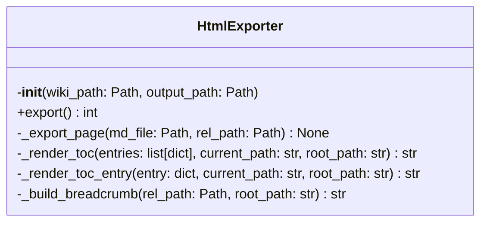

# HTML Export Module

## File Overview

This module provides functionality for exporting DeepWiki documentation to static HTML files. It handles the conversion of markdown content to HTML format and creates a complete static website structure with table of contents and navigation.

## Classes

### HtmlExporter

The HtmlExporter class is responsible for converting a DeepWiki directory structure into static HTML files.

**Initialization:**
- `wiki_path`: Path to the .deepwiki directory
- `output_path`: Output directory for HTML files
- `toc_entries`: List to store table of contents entries

**Key Methods:**

#### export
Exports all wiki pages to HTML format.

**Returns:** Number of pages exported (integer)

The method loads the table of contents from `toc.json`, creates the output directory structure, and processes all markdown files in the wiki.

#### _export_page
Exports a single markdown page to HTML.

**Parameters:**
- `md_file`: Path to the markdown file
- `rel_path`: Relative path from wiki root

This method handles the conversion of individual markdown files, including title extraction and path calculations for proper linking.

## Functions

### export_to_html

Main function for exporting wiki content to HTML.

**Parameters:**
- `wiki_path`: Path to the .deepwiki directory (string or Path)
- `output_path`: Output directory (optional, defaults to `{wiki_path}_html`)

**Returns:** Path to the output directory (string)

Creates an HtmlExporter instance and performs the export operation.

### main

CLI entry point for HTML export functionality.

Provides a command-line interface with the following options:
- `wiki_path`: Path to the .deepwiki directory (defaults to ".deepwiki")
- `--output`, `-o`: Output directory specification

## Usage Examples

### Programmatic Usage

```python
from pathlib import Path
from local_deepwiki.export.html import HtmlExporter, export_to_html

# Using the convenience function
output_dir = export_to_html(".deepwiki", "output/html")

# Using the class directly
exporter = HtmlExporter(Path(".deepwiki"), Path("output/html"))
pages_exported = exporter.export()
```

### Command Line Usage

```bash
# Export with default settings
python -m local_deepwiki.export.html

# Specify wiki path
python -m local_deepwiki.export.html /path/to/.deepwiki

# Specify output directory
python -m local_deepwiki.export.html --output /path/to/output
```

## Related Components

This module integrates with:
- `local_deepwiki.logging` for logging functionality
- `markdown` library for converting markdown content to HTML
- JSON files (`toc.json`) for table of contents structure
- The broader DeepWiki system for accessing wiki content and structure

The module also references additional functions like `render_markdown` and `extract_title` that handle the actual markdown processing and title extraction from files.

## API Reference

### class `HtmlExporter`

Export wiki markdown to static HTML files.

**Methods:**


<details>
<summary>View Source (lines 663-859)</summary>

```python
class HtmlExporter:
    # Methods: __init__, export, _export_page, _render_toc, _render_toc_entry, _build_breadcrumb
```

</details>

#### `__init__`

```python
def __init__(wiki_path: Path, output_path: Path)
```

Initialize the exporter.


| [Parameter](../generators/api_docs.md) | Type | Default | Description |
|-----------|------|---------|-------------|
| `wiki_path` | `Path` | - | Path to the .deepwiki directory |
| `output_path` | `Path` | - | Output directory for HTML files |


<details>
<summary>View Source (lines 666-675)</summary>

```python
def __init__(self, wiki_path: Path, output_path: Path):
        """Initialize the exporter.

        Args:
            wiki_path: Path to the .deepwiki directory
            output_path: Output directory for HTML files
        """
        self.wiki_path = Path(wiki_path)
        self.output_path = Path(output_path)
        self.toc_entries: list[dict] = []
```

</details>

#### `export`

```python
def export() -> int
```

Export all wiki pages to HTML.


---


<details>
<summary>View Source (lines 677-709)</summary>

```python
def export(self) -> int:
        """Export all wiki pages to HTML.

        Returns:
            Number of pages exported
        """
        logger.info(f"Starting HTML export from {self.wiki_path} to {self.output_path}")

        # Load TOC
        toc_path = self.wiki_path / "toc.json"
        if toc_path.exists():
            toc_data = json.loads(toc_path.read_text())
            self.toc_entries = toc_data.get("entries", [])
            logger.debug(f"Loaded {len(self.toc_entries)} TOC entries")

        # Create output directory
        self.output_path.mkdir(parents=True, exist_ok=True)

        # Copy search.json
        search_src = self.wiki_path / "search.json"
        if search_src.exists():
            shutil.copy(search_src, self.output_path / "search.json")
            logger.debug("Copied search.json to output directory")

        # Find and export all markdown files
        exported = 0
        for md_file in self.wiki_path.rglob("*.md"):
            rel_path = md_file.relative_to(self.wiki_path)
            self._export_page(md_file, rel_path)
            exported += 1

        logger.info(f"Exported {exported} pages to HTML")
        return exported
```

</details>

### Functions

#### `render_markdown`

```python
def render_markdown(content: str) -> str
```

Render markdown to HTML.


| [Parameter](../generators/api_docs.md) | Type | Default | Description |
|-----------|------|---------|-------------|
| `content` | `str` | - | - |

**Returns:** `str`


<details>
<summary>View Source (lines 633-643)</summary>

```python
def render_markdown(content: str) -> str:
    """Render markdown to HTML."""
    md = markdown.Markdown(
        extensions=[
            "fenced_code",
            "tables",
            "toc",
            "nl2br",
        ]
    )
    return cast(str, md.convert(content))
```

</details>

#### `extract_title`

```python
def extract_title(md_file: Path) -> str
```

Extract title from markdown file.


| [Parameter](../generators/api_docs.md) | Type | Default | Description |
|-----------|------|---------|-------------|
| `md_file` | `Path` | - | - |

**Returns:** `str`


<details>
<summary>View Source (lines 646-660)</summary>

```python
def extract_title(md_file: Path) -> str:
    """Extract title from markdown file."""
    try:
        content = md_file.read_text()
        for line in content.split("\n"):
            line = line.strip()
            if line.startswith("# "):
                return line[2:].strip()
            if line.startswith("**") and line.endswith("**"):
                return line[2:-2].strip()
    except (OSError, UnicodeDecodeError) as e:
        # OSError: File access issues
        # UnicodeDecodeError: File encoding issues
        logger.debug(f"Could not extract title from {md_file}: {e}")
    return md_file.stem.replace("_", " ").replace("-", " ").title()
```

</details>

#### `export_to_html`

```python
def export_to_html(wiki_path: str | Path, output_path: str | Path | None = None) -> str
```

Export wiki to static HTML files.


| [Parameter](../generators/api_docs.md) | Type | Default | Description |
|-----------|------|---------|-------------|
| `wiki_path` | `str | Path` | - | Path to the .deepwiki directory |
| `output_path` | `str | Path | None` | `None` | Output directory (default: {wiki_path}_html) |

**Returns:** `str`


<details>
<summary>View Source (lines 862-883)</summary>

```python
def export_to_html(wiki_path: str | Path, output_path: str | Path | None = None) -> str:
    """Export wiki to static HTML files.

    Args:
        wiki_path: Path to the .deepwiki directory
        output_path: Output directory (default: {wiki_path}_html)

    Returns:
        Path to the output directory
    """
    wiki_path = Path(wiki_path)
    if output_path is None:
        output_path = wiki_path.parent / f"{wiki_path.name}_html"
    else:
        output_path = Path(output_path)

    logger.info(f"Exporting wiki from {wiki_path} to {output_path}")
    exporter = HtmlExporter(wiki_path, output_path)
    count = exporter.export()

    logger.info(f"HTML export complete: {count} pages")
    return f"Exported {count} pages to {output_path}"
```

</details>

#### `main`

```python
def main()
```

CLI entry point for HTML export.


<details>
<summary>View Source (lines 886-913)</summary>

```python
def main():
    """CLI entry point for HTML export."""
    parser = argparse.ArgumentParser(description="Export DeepWiki documentation to static HTML")
    parser.add_argument(
        "wiki_path",
        nargs="?",
        default=".deepwiki",
        help="Path to the .deepwiki directory (default: .deepwiki)",
    )
    parser.add_argument("--output", "-o", help="Output directory (default: {wiki_path}_html)")

    args = parser.parse_args()

    wiki_path = Path(args.wiki_path).resolve()
    if not wiki_path.exists():
        print(f"Error: Wiki path does not exist: {wiki_path}")
        return 1

    output_path = Path(args.output).resolve() if args.output else None

    result = export_to_html(wiki_path, output_path)
    print(result)

    # Print location hint
    actual_output = output_path or (wiki_path.parent / f"{wiki_path.name}_html")
    print(f"\nOpen {actual_output}/index.html in a browser to view the documentation.")

    return 0
```

</details>

## Class Diagram



## Call Graph

```mermaid
flowchart TD
    N0[ArgumentParser]
    N1[HtmlExporter]
    N2[HtmlExporter.__init__]
    N3[HtmlExporter._build_breadcrumb]
    N4[HtmlExporter._export_page]
    N5[HtmlExporter.export]
    N6[Markdown]
    N7[Path]
    N8[_build_breadcrumb]
    N9[_export_page]
    N10[_render_toc]
    N11[_render_toc_entry]
    N12[add_argument]
    N13[cast]
    N14[convert]
    N15[copy]
    N16[exists]
    N17[export]
    N18[export_to_html]
    N19[extract_title]
    N20[loads]
    N21[main]
    N22[mkdir]
    N23[parse_args]
    N24[read_text]
    N25[relative_to]
    N26[render_markdown]
    N27[resolve]
    N28[rglob]
    N29[title]
    N26 --> N6
    N26 --> N13
    N26 --> N14
    N19 --> N24
    N19 --> N29
    N18 --> N7
    N18 --> N1
    N18 --> N17
    N21 --> N0
    N21 --> N12
    N21 --> N23
    N21 --> N27
    N21 --> N7
    N21 --> N16
    N21 --> N18
    N2 --> N7
    N5 --> N16
    N5 --> N20
    N5 --> N24
    N5 --> N22
    N5 --> N15
    N5 --> N28
    N5 --> N25
    N5 --> N9
    N4 --> N24
    N4 --> N26
    N4 --> N19
    N4 --> N10
    N4 --> N8
    N4 --> N22
    N3 --> N29
    N3 --> N16
    classDef func fill:#e1f5fe
    class N0,N1,N6,N7,N8,N9,N10,N11,N12,N13,N14,N15,N16,N17,N18,N19,N20,N21,N22,N23,N24,N25,N26,N27,N28,N29 func
    classDef method fill:#fff3e0
    class N2,N3,N4,N5 method
```



## Additional Source Code

Source code for functions and methods not listed in the API Reference above.

#### `_export_page`

<details>
<summary>View Source (lines 711-751)</summary>

```python
def _export_page(self, md_file: Path, rel_path: Path) -> None:
        """Export a single markdown page to HTML.

        Args:
            md_file: Path to the markdown file
            rel_path: Relative path from wiki root
        """
        logger.debug(f"Exporting page: {rel_path}")

        # Read and convert markdown
        content = md_file.read_text()
        html_content = render_markdown(content)
        title = extract_title(md_file)

        # Calculate depth for relative paths
        depth = len(rel_path.parts) - 1
        root_path = "../" * depth if depth > 0 else "./"

        # Build TOC HTML with correct relative paths
        toc_html = self._render_toc(self.toc_entries, str(rel_path), root_path)

        # Build breadcrumb HTML
        breadcrumb_html = self._build_breadcrumb(rel_path, root_path)

        # Calculate search.json path relative to this page
        search_json_path = root_path + "search.json"

        # Render full HTML
        html = STATIC_HTML_TEMPLATE.format(
            title=title,
            toc_html=toc_html,
            breadcrumb_html=breadcrumb_html,
            content_html=html_content,
            search_json_path=search_json_path,
            root_path=root_path,
        )

        # Write output file
        output_file = self.output_path / rel_path.with_suffix(".html")
        output_file.parent.mkdir(parents=True, exist_ok=True)
        output_file.write_text(html)
```

</details>


#### `_render_toc`

<details>
<summary>View Source (lines 753-767)</summary>

```python
def _render_toc(self, entries: list[dict], current_path: str, root_path: str) -> str:
        """Render TOC entries as HTML.

        Args:
            entries: List of TOC entry dicts
            current_path: Current page path for highlighting active link
            root_path: Relative path to root (e.g., "../")

        Returns:
            HTML string for TOC
        """
        html_parts = []
        for entry in entries:
            html_parts.append(self._render_toc_entry(entry, current_path, root_path))
        return "\n".join(html_parts)
```

</details>


#### `_render_toc_entry`

<details>
<summary>View Source (lines 769-807)</summary>

```python
def _render_toc_entry(self, entry: dict, current_path: str, root_path: str) -> str:
        """Render a single TOC entry recursively.

        Args:
            entry: TOC entry dict with number, title, path, children
            current_path: Current page path
            root_path: Relative path to root

        Returns:
            HTML string for this entry
        """
        has_children = bool(entry.get("children"))
        parent_class = "toc-parent" if has_children else ""

        html = f'<div class="toc-item {parent_class}">'

        if entry.get("path"):
            # Convert .md to .html for static export
            html_path = entry["path"].replace(".md", ".html")
            active = "active" if entry["path"] == current_path else ""
            html += f"""<a href="{root_path}{html_path}" class="{active}">
                <span class="toc-number">{entry.get("number", "")}</span>
                <span>{entry.get("title", "")}</span>
            </a>"""
        else:
            # No link, just a grouping label
            html += f"""<span class="toc-parent">
                <span class="toc-number">{entry.get("number", "")}</span>
                <span>{entry.get("title", "")}</span>
            </span>"""

        if has_children:
            html += '<div class="toc-nested">'
            for child in entry["children"]:
                html += self._render_toc_entry(child, current_path, root_path)
            html += "</div>"

        html += "</div>"
        return html
```

</details>


#### `_build_breadcrumb`

<details>
<summary>View Source (lines 809-859)</summary>

```python
def _build_breadcrumb(self, rel_path: Path, root_path: str) -> str:
        """Build breadcrumb navigation HTML.

        Args:
            rel_path: Relative path of current page
            root_path: Relative path to root

        Returns:
            HTML string for breadcrumb, or empty string if root page
        """
        parts = list(rel_path.parts)

        # Root pages don't need breadcrumbs
        if len(parts) == 1:
            return ""

        breadcrumb_items = []

        # Always start with Home
        breadcrumb_items.append(f'<a href="{root_path}index.html">Home</a>')

        # Build path progressively
        cumulative_path = ""
        for part in parts[:-1]:  # Exclude current page
            if cumulative_path:
                cumulative_path = f"{cumulative_path}/{part}"
            else:
                cumulative_path = part

            # Check if there's an index.md in this folder
            index_path = self.wiki_path / cumulative_path / "index.md"
            display_name = part.replace("_", " ").replace("-", " ").title()

            if index_path.exists():
                link_path = f"{cumulative_path}/index.html"
                breadcrumb_items.append(f'<a href="{root_path}{link_path}">{display_name}</a>')
            else:
                breadcrumb_items.append(f"<span>{display_name}</span>")

        # Add current page name
        current_page = parts[-1]
        if current_page.endswith(".md"):
            current_page = current_page[:-3]
        current_page = current_page.replace("_", " ").replace("-", " ").title()
        breadcrumb_items.append(f'<span class="current">{current_page}</span>')

        return (
            '<div class="breadcrumb">'
            + ' <span class="separator">&rsaquo;</span> '.join(breadcrumb_items)
            + "</div>"
        )
```

</details>

## Relevant Source Files

- `src/local_deepwiki/export/html.py:663-859`
