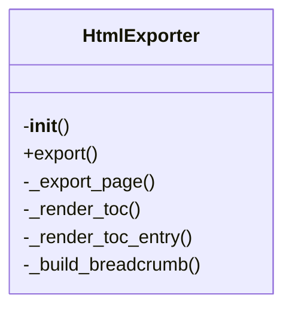

# File Overview

This file provides functionality to export a DeepWiki documentation set to static HTML files. It includes the `HtmlExporter` class for handling the export process, along with utility functions for rendering markdown and extracting titles, and a command-line interface entry point.

# Classes

## HtmlExporter

The HtmlExporter class is responsible for exporting all pages from a DeepWiki directory to static HTML files.

### Methods

#### `__init__(self, wiki_path: Path, output_path: Path)`

Initialize the exporter.

**Parameters:**
- `wiki_path`: Path to the .deepwiki directory
- `output_path`: Output directory for HTML files

#### `export(self) -> int`

Export all wiki pages to HTML.

**Returns:**
- Number of pages exported

#### `_export_page(self, md_file: Path, rel_path: Path) -> None`

Export a single markdown page to HTML.

**Parameters:**
- `md_file`: Path to the markdown file
- `rel_path`: Relative path from wiki root

#### `_render_toc(self) -> str`

Render the table of contents as HTML.

#### `_render_toc_entry(self, entry: dict) -> str`

Render a single table of contents entry as HTML.

#### `_build_breadcrumb(self, rel_path: Path) -> str`

Build breadcrumb navigation for a page.

# Functions

## render_markdown(content: str) -> str

Convert markdown content to HTML.

**Parameters:**
- `content`: Markdown text to convert

**Returns:**
- HTML string

## extract_title(md_file: Path) -> str

Extract the title from a markdown file.

**Parameters:**
- `md_file`: Path to the markdown file

**Returns:**
- Title string

## export_to_html(wiki_path: str | Path, output_path: str | Path | None = None) -> str

Export wiki to static HTML files.

**Parameters:**
- `wiki_path`: Path to the .deepwiki directory
- `output_path`: Output directory (default: `{wiki_path}_html`)

**Returns:**
- Path to the output directory

## main()

CLI entry point for HTML export.

# Usage Examples

### Using the export_to_html function directly:

```python
from src.local_deepwiki.export.html import export_to_html

# Export to default output directory
output_dir = export_to_html(".deepwiki")

# Export to custom output directory
output_dir = export_to_html(".deepwiki", "my_output_dir")
```

### Using the command-line interface:

```bash
# Export to default output directory
python -m src.local_deepwiki.export.html

# Export to custom output directory
python -m src.local_deepwiki.export.html --output my_output_dir
```

# Related Components

This file imports and uses:
- `argparse` for command-line argument parsing
- `json` for loading table of contents and search data
- `shutil` for copying files
- `pathlib.Path` for path manipulation
- `markdown` for markdown rendering

It works with:
- The `HtmlExporter` class which orchestrates the export process
- The `render_markdown` function for converting markdown to HTML
- The `extract_title` function for getting page titles
- The `toc.json` file for table of contents data
- The `search.json` file for search functionality
- Markdown files in the DeepWiki directory structure

## API Reference

### class `HtmlExporter`

Export wiki markdown to static HTML files.

**Methods:**

#### `__init__`

```python
def __init__(wiki_path: Path, output_path: Path)
```

Initialize the exporter.


| [Parameter](../generators/api_docs.md) | Type | Default | Description |
|-----------|------|---------|-------------|
| `wiki_path` | `Path` | - | Path to the .deepwiki directory |
| `output_path` | `Path` | - | Output directory for HTML files |

#### `export`

```python
def export() -> int
```

Export all wiki pages to HTML.


---

### Functions

#### `render_markdown`

```python
def render_markdown(content: str) -> str
```

Render markdown to HTML.


| [Parameter](../generators/api_docs.md) | Type | Default | Description |
|-----------|------|---------|-------------|
| `content` | `str` | - | - |

**Returns:** `str`


#### `extract_title`

```python
def extract_title(md_file: Path) -> str
```

Extract title from markdown file.


| [Parameter](../generators/api_docs.md) | Type | Default | Description |
|-----------|------|---------|-------------|
| `md_file` | `Path` | - | - |

**Returns:** `str`


#### `export_to_html`

```python
def export_to_html(wiki_path: str | Path, output_path: str | Path | None = None) -> str
```

Export wiki to static HTML files.


| [Parameter](../generators/api_docs.md) | Type | Default | Description |
|-----------|------|---------|-------------|
| `wiki_path` | `str | Path` | - | Path to the .deepwiki directory |
| `output_path` | `str | Path | None` | `None` | Output directory (default: {wiki_path}_html) |

**Returns:** `str`


#### `main`

```python
def main()
```

CLI entry point for HTML export.


## Class Diagram



## Call Graph

```mermaid
flowchart TD
    N0[ArgumentParser]
    N1[HtmlExporter]
    N2[HtmlExporter.__init__]
    N3[HtmlExporter._build_breadcrumb]
    N4[HtmlExporter._export_page]
    N5[HtmlExporter.export]
    N6[Markdown]
    N7[Path]
    N8[_build_breadcrumb]
    N9[_export_page]
    N10[_render_toc]
    N11[_render_toc_entry]
    N12[add_argument]
    N13[convert]
    N14[copy]
    N15[exists]
    N16[export]
    N17[export_to_html]
    N18[extract_title]
    N19[loads]
    N20[main]
    N21[mkdir]
    N22[parse_args]
    N23[read_text]
    N24[relative_to]
    N25[render_markdown]
    N26[resolve]
    N27[rglob]
    N28[title]
    N29[with_suffix]
    N25 --> N6
    N25 --> N13
    N18 --> N23
    N18 --> N28
    N17 --> N7
    N17 --> N1
    N17 --> N16
    N20 --> N0
    N20 --> N12
    N20 --> N22
    N20 --> N26
    N20 --> N7
    N20 --> N15
    N20 --> N17
    N2 --> N7
    N5 --> N15
    N5 --> N19
    N5 --> N23
    N5 --> N21
    N5 --> N14
    N5 --> N27
    N5 --> N24
    N5 --> N9
    N4 --> N23
    N4 --> N25
    N4 --> N18
    N4 --> N10
    N4 --> N8
    N4 --> N29
    N4 --> N21
    N3 --> N28
    N3 --> N15
    classDef func fill:#e1f5fe
    class N0,N1,N6,N7,N8,N9,N10,N11,N12,N13,N14,N15,N16,N17,N18,N19,N20,N21,N22,N23,N24,N25,N26,N27,N28,N29 func
    classDef method fill:#fff3e0
    class N2,N3,N4,N5 method
```



## Relevant Source Files

- `src/local_deepwiki/export/html.py:654-841`

## See Also

- [server](../server.md) - uses this
- [test_html_export](../../../tests/test_html_export.md) - uses this
