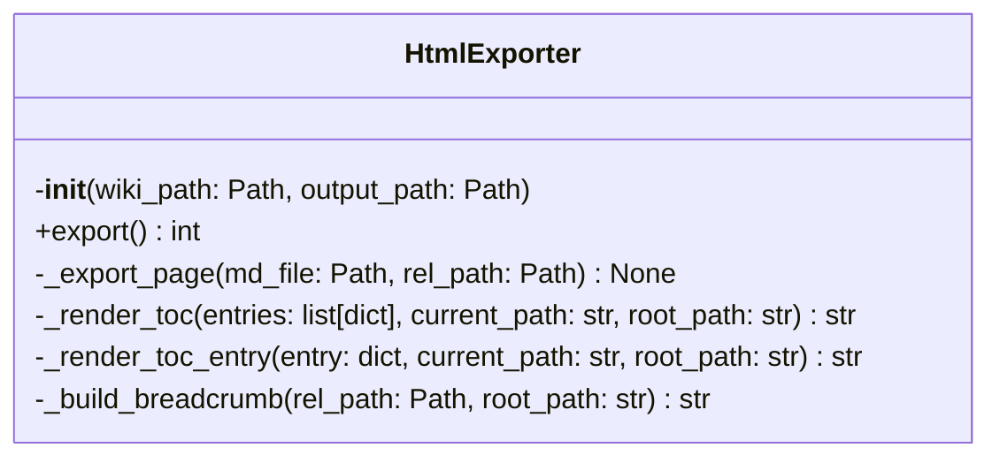

# HTML Export Module

This module provides functionality to export DeepWiki documentation to static HTML files. It converts markdown content to HTML and creates a browsable static website with table of contents navigation.

## Classes

### HtmlExporter

The main class responsible for exporting wiki content to HTML format.

**Initialization:**
- `wiki_path`: Path to the .deepwiki directory containing the source content
- `output_path`: Directory where HTML files will be generated
- `toc_entries`: List to store table of contents entries loaded from the wiki

**Key Methods:**

#### export
Exports all wiki pages to HTML format.

**Returns:** Number of pages exported (integer)

The method loads the table of contents from `toc.json`, creates the output directory structure, and processes all markdown files in the wiki.

#### _export_page
Exports a single markdown page to HTML.

**Parameters:**
- `md_file`: Path to the source markdown file
- `rel_path`: Relative path from the wiki root directory

This method handles the conversion of individual markdown files, extracts titles, and calculates proper relative paths for navigation.

## Functions

### export_to_html
Main function to export a wiki to static HTML files.

**Parameters:**
- `wiki_path`: Path to the .deepwiki directory (string or Path object)
- `output_path`: Output directory (optional, defaults to `{wiki_path}_html`)

**Returns:** Path to the output directory as a string

If no output path is specified, it creates a directory with the wiki name suffixed with `_html`.

### main
CLI entry point for HTML export functionality.

Provides command-line interface with the following options:
- Positional argument: `wiki_path` (defaults to `.deepwiki`)
- Optional `--output` or `-o` flag to specify output directory

## Usage Examples

### Programmatic Usage

```python
from pathlib import Path
from local_deepwiki.export.html import HtmlExporter, export_to_html

# Using the convenience function
output_dir = export_to_html(".deepwiki", "output/html")

# Using the class directly
exporter = HtmlExporter(Path(".deepwiki"), Path("output/html"))
pages_exported = exporter.export()
```

### Command Line Usage

```bash
# Export from default .deepwiki directory
python -m local_deepwiki.export.html

# Export from specific wiki path
python -m local_deepwiki.export.html /path/to/wiki

# Specify custom output directory
python -m local_deepwiki.export.html --output /path/to/output
```

## Related Components

This module integrates with several other components:

- Uses the `markdown` library for converting markdown content to HTML
- Imports logging functionality from `local_deepwiki.logging`
- References utility functions `render_markdown` and `extract_title` (implementation not shown in provided code)
- Reads table of contents data from `toc.json` files in the wiki structure

The module expects a specific wiki directory structure with markdown files and a `toc.json` file for navigation organization.

## API Reference

### class `HtmlExporter`

Export wiki markdown to static HTML files.

**Methods:**

#### `__init__`

```python
def __init__(wiki_path: Path, output_path: Path)
```

Initialize the exporter.


| [Parameter](../generators/api_docs.md) | Type | Default | Description |
|-----------|------|---------|-------------|
| `wiki_path` | `Path` | - | Path to the .deepwiki directory |
| `output_path` | `Path` | - | Output directory for HTML files |

#### `export`

```python
def export() -> int
```

Export all wiki pages to HTML.


---

### Functions

#### `render_markdown`

```python
def render_markdown(content: str) -> str
```

Render markdown to HTML.


| [Parameter](../generators/api_docs.md) | Type | Default | Description |
|-----------|------|---------|-------------|
| `content` | `str` | - | - |

**Returns:** `str`


#### `extract_title`

```python
def extract_title(md_file: Path) -> str
```

Extract title from markdown file.


| [Parameter](../generators/api_docs.md) | Type | Default | Description |
|-----------|------|---------|-------------|
| `md_file` | `Path` | - | - |

**Returns:** `str`


#### `export_to_html`

```python
def export_to_html(wiki_path: str | Path, output_path: str | Path | None = None) -> str
```

Export wiki to static HTML files.


| [Parameter](../generators/api_docs.md) | Type | Default | Description |
|-----------|------|---------|-------------|
| `wiki_path` | `str | Path` | - | Path to the .deepwiki directory |
| `output_path` | `str | Path | None` | `None` | Output directory (default: {wiki_path}_html) |

**Returns:** `str`


#### `main`

```python
def main()
```

CLI entry point for HTML export.


## Class Diagram



## Call Graph

```mermaid
flowchart TD
    N0[ArgumentParser]
    N1[HtmlExporter]
    N2[HtmlExporter.__init__]
    N3[HtmlExporter._build_breadcrumb]
    N4[HtmlExporter._export_page]
    N5[HtmlExporter.export]
    N6[Markdown]
    N7[Path]
    N8[_build_breadcrumb]
    N9[_export_page]
    N10[_render_toc]
    N11[_render_toc_entry]
    N12[add_argument]
    N13[convert]
    N14[copy]
    N15[exists]
    N16[export]
    N17[export_to_html]
    N18[extract_title]
    N19[loads]
    N20[main]
    N21[mkdir]
    N22[parse_args]
    N23[read_text]
    N24[relative_to]
    N25[render_markdown]
    N26[resolve]
    N27[rglob]
    N28[title]
    N29[with_suffix]
    N25 --> N6
    N25 --> N13
    N18 --> N23
    N18 --> N28
    N17 --> N7
    N17 --> N1
    N17 --> N16
    N20 --> N0
    N20 --> N12
    N20 --> N22
    N20 --> N26
    N20 --> N7
    N20 --> N15
    N20 --> N17
    N2 --> N7
    N5 --> N15
    N5 --> N19
    N5 --> N23
    N5 --> N21
    N5 --> N14
    N5 --> N27
    N5 --> N24
    N5 --> N9
    N4 --> N23
    N4 --> N25
    N4 --> N18
    N4 --> N10
    N4 --> N8
    N4 --> N29
    N4 --> N21
    N3 --> N28
    N3 --> N15
    classDef func fill:#e1f5fe
    class N0,N1,N6,N7,N8,N9,N10,N11,N12,N13,N14,N15,N16,N17,N18,N19,N20,N21,N22,N23,N24,N25,N26,N27,N28,N29 func
    classDef method fill:#fff3e0
    class N2,N3,N4,N5 method
```



## Relevant Source Files

- `src/local_deepwiki/export/html.py:660-856`
