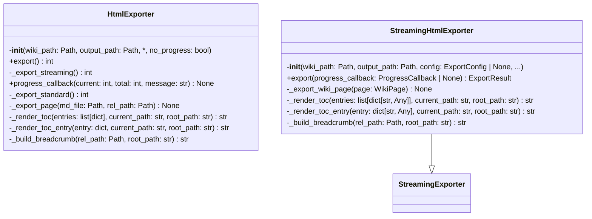

# File Overview

This file, `src/local_deepwiki/export/html.py`, provides functionality for exporting wiki content to HTML. It includes both streaming and standard export modes, supporting large wikis efficiently. The file depends on several core modules and utilities, such as `markdown` for rendering, `local_deepwiki.export.streaming` for export logic, and `local_deepwiki.cli_progress` for progress reporting.

# Classes

## StreamingHtmlExporter

The `StreamingHtmlExporter` class is responsible for exporting wiki content to HTML in a streaming fashion, which is efficient for large wikis.

### Methods

#### `__init__`

Initializes the streaming HTML exporter.

```python
def __init__(
    self,
    wiki_path: Path,
    output_path: Path,
    config: ExportConfig | None = None,
    *,
    no_progress: bool = False,
)
```

**Parameters:**
- `wiki_path`: Path to the `.deepwiki` directory.
- `output_path`: Output directory for HTML files.
- `config`: Export configuration.
- `no_progress`: If `True`, disables progress bars.

#### `export`

Exports wiki to HTML with streaming.

```python
async def export(
    self, progress_callback: ProgressCallback | None = None
) -> ExportResult:
```

**Parameters:**
- [`progress_callback`](../handlers.md): Optional callback for progress updates.

**Returns:**
- [`ExportResult`](streaming.md) with export statistics.

#### `_export_wiki_page`

Exports a single wiki page to HTML.

```python
def _export_wiki_page(self, page: WikiPage) -> None:
```

**Parameters:**
- `page`: [`WikiPage`](streaming.md) object with content loaded on demand.

#### `_render_toc`

Renders TOC entries as HTML.

```python
def _render_toc(
    self, entries: list[dict[str, Any]], current_path: str, root_path: str
) -> str:
```

**Parameters:**
- `entries`: List of TOC entries.
- `current_path`: Current page path.
- `root_path`: Root path for links.

**Returns:**
- HTML string of the TOC.

#### `_render_toc_entry`

Renders a single TOC entry recursively.

```python
def _render_toc_entry(
    self, entry: dict[str, Any], current_path: str, root_path: str
) -> str:
```

**Parameters:**
- `entry`: TOC entry dictionary.
- `current_path`: Current page path.
- `root_path`: Root path for links.

**Returns:**
- HTML string of the TOC entry.

#### `_build_breadcrumb`

Builds breadcrumb navigation HTML.

```python
def _build_breadcrumb(self, rel_path: Path, root_path: str) -> str:
```

**Parameters:**
- `rel_path`: Relative path of the current page.
- `root_path`: Root path for links.

**Returns:**
- HTML string of the breadcrumb.

## HtmlExporter

The `HtmlExporter` class provides a standard export mode for wiki content to HTML, loading all pages into memory.

### Methods

#### `__init__`

Initializes the HTML exporter.

```python
def __init__(
    self,
    wiki_path: Path,
    output_path: Path,
    *,
    no_progress: bool = False,
):
```

**Parameters:**
- `wiki_path`: Path to the `.deepwiki` directory.
- `output_path`: Output directory for HTML files.
- `no_progress`: If `True`, disables progress bars.

#### `export`

Exports all wiki pages to HTML.

```python
def export(self) -> int:
```

**Returns:**
- Number of pages exported.

#### `_export_streaming`

Exports using streaming mode for large wikis.

```python
def _export_streaming(self) -> int:
```

#### `progress_callback`

Updates the progress bar during streaming export.

```python
def progress_callback(current: int, total: int, message: str) -> None:
```

#### `_export_standard`

Exports using standard mode (loads all pages in memory).

```python
def _export_standard(self) -> int:
```

# Functions

## `render_markdown`

Renders markdown content to HTML.

```python
def render_markdown(content: str) -> str:
```

**Parameters:**
- `content`: Markdown content to render.

**Returns:**
- HTML string.

## `fix_internal_links`

Fixes internal links in HTML content.

```python
def fix_internal_links(html_content: str) -> str:
```

**Parameters:**
- `html_content`: HTML content with internal links.

**Returns:**
- HTML content with fixed internal links.

## `replace_link`

Replaces a link with a new one.

```python
def replace_link(match: re.Match) -> str:
```

**Parameters:**
- `match`: Regex match object for a link.

**Returns:**
- Replacement HTML link.

## `add_external_link_targets`

Adds target attributes to external links.

```python
def add_external_link_targets(html_content: str) -> str:
```

**Parameters:**
- `html_content`: HTML content with links.

**Returns:**
- HTML content with external links having `target="_blank"`.

## `add_target`

Adds `target="_blank"` to external links.

```python
def add_target(match: re.Match) -> str:
```

**Parameters:**
- `match`: Regex match object for an external link.

**Returns:**
- HTML link with `target="_blank"`.

## `extract_title`

Extracts the title from a markdown document.

```python
def extract_title(content: str) -> str:
```

**Parameters:**
- `content`: Markdown content.

**Returns:**
- Extracted title.

## `export_to_html`

Exports a wiki to HTML.

```python
def export_to_html(
    wiki_path: Path,
    output_path: Path,
    *,
    no_progress: bool = False,
) -> int:
```

**Parameters:**
- `wiki_path`: Path to the `.deepwiki` directory.
- `output_path`: Output directory for HTML files.
- `no_progress`: If `True`, disables progress bars.

**Returns:**
- Number of pages exported.

## `main`

Entry point for command-line usage.

```python
def main() -> None:
```

# Integration

This file is part of the `local_deepwiki` package and integrates with core modules such as `local_deepwiki.export.streaming` and `local_deepwiki.cli_progress`. It is used by modules like `pdf`, `app`, `test_web`, `streaming`, and `test_integration_pipeline` through functions such as `render_markdown`, `extract_title`, and `export_to_html`.

# Usage Examples

To export a wiki to HTML using the standard mode:

```python
exporter = HtmlExporter(wiki_path=Path("wiki/.deepwiki"), output_path=Path("output"))
pages_exported = exporter.export()
```

To export a wiki to HTML using the streaming mode:

```python
exporter = StreamingHtmlExporter(wiki_path=Path("wiki/.deepwiki"), output_path=Path("output"))
result = asyncio.run(exporter.export())
```

To render markdown to HTML:

```python
html = render_markdown("# Hello\n\nWorld")
```

To extract a title from markdown:

```python
title = extract_title("# Title\n\nContent")
```

## API Reference

### class `StreamingHtmlExporter`

**Inherits from:** [`StreamingExporter`](streaming.md)

Memory-efficient HTML exporter using streaming page iteration.  Writes each page to disk as it's processed, avoiding loading all pages into memory at once. Suitable for large wikis.

**Methods:**


<details>
<summary>View Source (lines 718-934) | <a href="https://github.com/UrbanDiver/local-deepwiki-mcp/blob/main/src/local_deepwiki/export/html.py#L718-L934">GitHub</a></summary>

```python
class StreamingHtmlExporter(StreamingExporter):
    # Methods: __init__, export, _export_wiki_page, _render_toc, _render_toc_entry, _build_breadcrumb
```

</details>

#### `__init__`

```python
def __init__(wiki_path: Path, output_path: Path, config: ExportConfig | None = None, no_progress: bool = False)
```

Initialize the streaming HTML exporter.


| [Parameter](../generators/api_docs.md) | Type | Default | Description |
|-----------|------|---------|-------------|
| `wiki_path` | `Path` | - | Path to the .deepwiki directory. |
| `output_path` | `Path` | - | Output directory for HTML files. |
| `config` | `ExportConfig | None` | `None` | Export configuration. |
| `no_progress` | `bool` | `False` | If True, disable progress bars. |


<details>
<summary>View Source (lines 725-742) | <a href="https://github.com/UrbanDiver/local-deepwiki-mcp/blob/main/src/local_deepwiki/export/html.py#L725-L742">GitHub</a></summary>

```python
def __init__(
        self,
        wiki_path: Path,
        output_path: Path,
        config: ExportConfig | None = None,
        *,
        no_progress: bool = False,
    ):
        """Initialize the streaming HTML exporter.

        Args:
            wiki_path: Path to the .deepwiki directory.
            output_path: Output directory for HTML files.
            config: Export configuration.
            no_progress: If True, disable progress bars.
        """
        super().__init__(wiki_path, output_path, config)
        self._no_progress = no_progress
```

</details>

#### `export`

```python
async def export(progress_callback: ProgressCallback | None = None) -> ExportResult
```

Export wiki to HTML with streaming.


| [Parameter](../generators/api_docs.md) | Type | Default | Description |
|-----------|------|---------|-------------|
| [`progress_callback`](../handlers.md) | `ProgressCallback | None` | `None` | Optional callback for progress updates. |


<details>
<summary>View Source (lines 744-804) | <a href="https://github.com/UrbanDiver/local-deepwiki-mcp/blob/main/src/local_deepwiki/export/html.py#L744-L804">GitHub</a></summary>

```python
async def export(
        self, progress_callback: ProgressCallback | None = None
    ) -> ExportResult:
        """Export wiki to HTML with streaming.

        Args:
            progress_callback: Optional callback for progress updates.

        Returns:
            ExportResult with export statistics.
        """
        start_time = time.monotonic()
        errors: list[str] = []

        logger.info(
            f"Starting streaming HTML export from {self.wiki_path} to {self.output_path}"
        )

        # Load TOC for navigation
        self.load_toc()

        # Create output directory
        self.output_path.mkdir(parents=True, exist_ok=True)

        # Copy search.json
        search_src = self.wiki_path / "search.json"
        if search_src.exists():
            shutil.copy(search_src, self.output_path / "search.json")
            logger.debug("Copied search.json to output directory")

        # Get page count for progress
        iterator = self.get_page_iterator()
        total_pages = iterator.get_page_count()

        # Export pages one at a time
        exported = 0
        async for page in iterator:
            try:
                self._export_wiki_page(page)
                exported += 1

                if progress_callback:
                    progress_callback(exported, total_pages, f"Exported {page.path}")

                # Release content from memory after writing
                page.release_content()

            except Exception as e:
                error_msg = f"Failed to export {page.path}: {e}"
                logger.warning(error_msg)
                errors.append(error_msg)

        duration_ms = int((time.monotonic() - start_time) * 1000)
        logger.info(f"Streaming HTML export complete: {exported} pages in {duration_ms}ms")

        return ExportResult(
            pages_exported=exported,
            output_path=self.output_path,
            duration_ms=duration_ms,
            errors=errors,
        )
```

</details>

### class `HtmlExporter`

Export wiki markdown to static HTML files.  This is the synchronous [wrapper](../providers/base.md) class that maintains backwards compatibility. For large wikis, use StreamingHtmlExporter directly for async streaming export.

**Methods:**


<details>
<summary>View Source (lines 937-1191) | <a href="https://github.com/UrbanDiver/local-deepwiki-mcp/blob/main/src/local_deepwiki/export/html.py#L937-L1191">GitHub</a></summary>

```python
class HtmlExporter:
    # Methods: __init__, export, _export_streaming, progress_callback, _export_standard, _export_page, _render_toc, _render_toc_entry, _build_breadcrumb
```

</details>

#### `__init__`

```python
def __init__(wiki_path: Path, output_path: Path, no_progress: bool = False)
```

Initialize the exporter.


| [Parameter](../generators/api_docs.md) | Type | Default | Description |
|-----------|------|---------|-------------|
| `wiki_path` | `Path` | - | Path to the .deepwiki directory |
| `output_path` | `Path` | - | Output directory for HTML files |
| `no_progress` | `bool` | `False` | If True, disable progress bars |


<details>
<summary>View Source (lines 944-961) | <a href="https://github.com/UrbanDiver/local-deepwiki-mcp/blob/main/src/local_deepwiki/export/html.py#L944-L961">GitHub</a></summary>

```python
def __init__(
        self,
        wiki_path: Path,
        output_path: Path,
        *,
        no_progress: bool = False,
    ):
        """Initialize the exporter.

        Args:
            wiki_path: Path to the .deepwiki directory
            output_path: Output directory for HTML files
            no_progress: If True, disable progress bars
        """
        self.wiki_path = Path(wiki_path)
        self.output_path = Path(output_path)
        self.toc_entries: list[dict] = []
        self._no_progress = no_progress
```

</details>

#### `export`

```python
def export() -> int
```

Export all wiki pages to HTML.


<details>
<summary>View Source (lines 963-979) | <a href="https://github.com/UrbanDiver/local-deepwiki-mcp/blob/main/src/local_deepwiki/export/html.py#L963-L979">GitHub</a></summary>

```python
def export(self) -> int:
        """Export all wiki pages to HTML.

        Returns:
            Number of pages exported
        """
        logger.info(f"Starting HTML export from {self.wiki_path} to {self.output_path}")

        # Check if we should use streaming mode
        iterator = WikiPageIterator(self.wiki_path)
        use_streaming = iterator.should_use_streaming()

        if use_streaming:
            logger.info("Large wiki detected, using streaming export mode")
            return self._export_streaming()

        return self._export_standard()
```

</details>

#### `progress_callback`

```python
def progress_callback(current: int, total: int, message: str) -> None
```


| [Parameter](../generators/api_docs.md) | Type | Default | Description |
|-----------|------|---------|-------------|
| `current` | `int` | - | - |
| `total` | `int` | - | - |
| `message` | `str` | - | - |


---


<details>
<summary>View Source (lines 993-994) | <a href="https://github.com/UrbanDiver/local-deepwiki-mcp/blob/main/src/local_deepwiki/export/html.py#L993-L994">GitHub</a></summary>

```python
def progress_callback(current: int, total: int, message: str) -> None:
                progress.update(task_id, total=total, completed=current, description=message)
```

</details>

### Functions

#### `render_markdown`

```python
def render_markdown(content: str) -> str
```

Render markdown to HTML.


| [Parameter](../generators/api_docs.md) | Type | Default | Description |
|-----------|------|---------|-------------|
| `content` | `str` | - | - |

**Returns:** `str`


<details>
<summary>View Source (lines 646-656) | <a href="https://github.com/UrbanDiver/local-deepwiki-mcp/blob/main/src/local_deepwiki/export/html.py#L646-L656">GitHub</a></summary>

```python
def render_markdown(content: str) -> str:
    """Render markdown to HTML."""
    md = markdown.Markdown(
        extensions=[
            "fenced_code",
            "tables",
            "toc",
            "nl2br",
        ]
    )
    return cast(str, md.convert(content))
```

</details>

#### `fix_internal_links`

```python
def fix_internal_links(html_content: str) -> str
```

Convert internal .md links to .html links in rendered HTML.


| [Parameter](../generators/api_docs.md) | Type | Default | Description |
|-----------|------|---------|-------------|
| `html_content` | `str` | - | HTML content with potential .md links. |

**Returns:** `str`


<details>
<summary>View Source (lines 659-678) | <a href="https://github.com/UrbanDiver/local-deepwiki-mcp/blob/main/src/local_deepwiki/export/html.py#L659-L678">GitHub</a></summary>

```python
def fix_internal_links(html_content: str) -> str:
    """Convert internal .md links to .html links in rendered HTML.

    Args:
        html_content: HTML content with potential .md links.

    Returns:
        HTML content with .md links converted to .html links.
    """
    # Match href attributes pointing to .md files (internal links only)
    # Excludes http://, https://, and other protocol links
    pattern = r'href="((?!https?://|mailto:|#)[^"]*\.md)(#[^"]*)?"'

    def replace_link(match: re.Match[str]) -> str:
        md_path = match.group(1)
        anchor = match.group(2) or ""
        html_path = md_path[:-3] + ".html"  # Replace .md with .html
        return f'href="{html_path}{anchor}"'

    return re.sub(pattern, replace_link, html_content)
```

</details>

#### `replace_link`

```python
def replace_link(match: re.Match[str]) -> str
```


| [Parameter](../generators/api_docs.md) | Type | Default | Description |
|-----------|------|---------|-------------|
| `match` | `re.Match[str]` | - | - |

**Returns:** `str`


<details>
<summary>View Source (lines 672-676) | <a href="https://github.com/UrbanDiver/local-deepwiki-mcp/blob/main/src/local_deepwiki/export/html.py#L672-L676">GitHub</a></summary>

```python
def replace_link(match: re.Match[str]) -> str:
        md_path = match.group(1)
        anchor = match.group(2) or ""
        html_path = md_path[:-3] + ".html"  # Replace .md with .html
        return f'href="{html_path}{anchor}"'
```

</details>

#### `add_external_link_targets`

```python
def add_external_link_targets(html_content: str) -> str
```

Add target="_blank" to external links for opening in new tab.


| [Parameter](../generators/api_docs.md) | Type | Default | Description |
|-----------|------|---------|-------------|
| `html_content` | `str` | - | HTML content with potential external links. |

**Returns:** `str`


<details>
<summary>View Source (lines 681-698) | <a href="https://github.com/UrbanDiver/local-deepwiki-mcp/blob/main/src/local_deepwiki/export/html.py#L681-L698">GitHub</a></summary>

```python
def add_external_link_targets(html_content: str) -> str:
    """Add target="_blank" to external links for opening in new tab.

    Args:
        html_content: HTML content with potential external links.

    Returns:
        HTML content with external links opening in new tabs.
    """
    # Match href attributes pointing to http:// or https:// URLs
    # that don't already have a target attribute
    pattern = r'<a\s+href="(https?://[^"]+)"(?![^>]*target=)'

    def add_target(match: re.Match[str]) -> str:
        url = match.group(1)
        return f'<a href="{url}" target="_blank" rel="noopener noreferrer"'

    return re.sub(pattern, add_target, html_content)
```

</details>

#### `add_target`

```python
def add_target(match: re.Match[str]) -> str
```


| [Parameter](../generators/api_docs.md) | Type | Default | Description |
|-----------|------|---------|-------------|
| `match` | `re.Match[str]` | - | - |

**Returns:** `str`


<details>
<summary>View Source (lines 694-696) | <a href="https://github.com/UrbanDiver/local-deepwiki-mcp/blob/main/src/local_deepwiki/export/html.py#L694-L696">GitHub</a></summary>

```python
def add_target(match: re.Match[str]) -> str:
        url = match.group(1)
        return f'<a href="{url}" target="_blank" rel="noopener noreferrer"'
```

</details>

#### `extract_title`

```python
def extract_title(md_file: Path) -> str
```

Extract title from markdown file.


| [Parameter](../generators/api_docs.md) | Type | Default | Description |
|-----------|------|---------|-------------|
| `md_file` | `Path` | - | - |

**Returns:** `str`


<details>
<summary>View Source (lines 701-715) | <a href="https://github.com/UrbanDiver/local-deepwiki-mcp/blob/main/src/local_deepwiki/export/html.py#L701-L715">GitHub</a></summary>

```python
def extract_title(md_file: Path) -> str:
    """Extract title from markdown file."""
    try:
        content = md_file.read_text()
        for line in content.split("\n"):
            line = line.strip()
            if line.startswith("# "):
                return line[2:].strip()
            if line.startswith("**") and line.endswith("**"):
                return line[2:-2].strip()
    except (OSError, UnicodeDecodeError) as e:
        # OSError: File access issues
        # UnicodeDecodeError: File encoding issues
        logger.debug(f"Could not extract title from {md_file}: {e}")
    return md_file.stem.replace("_", " ").replace("-", " ").title()
```

</details>

#### `export_to_html`

```python
def export_to_html(wiki_path: str | Path, output_path: str | Path | None = None, no_progress: bool = False) -> str
```

Export wiki to static HTML files.


| [Parameter](../generators/api_docs.md) | Type | Default | Description |
|-----------|------|---------|-------------|
| `wiki_path` | `str | Path` | - | Path to the .deepwiki directory |
| `output_path` | `str | Path | None` | `None` | Output directory (default: {wiki_path}_html) |
| `no_progress` | `bool` | `False` | If True, disable progress bars |

**Returns:** `str`


<details>
<summary>View Source (lines 1194-1221) | <a href="https://github.com/UrbanDiver/local-deepwiki-mcp/blob/main/src/local_deepwiki/export/html.py#L1194-L1221">GitHub</a></summary>

```python
def export_to_html(
    wiki_path: str | Path,
    output_path: str | Path | None = None,
    *,
    no_progress: bool = False,
) -> str:
    """Export wiki to static HTML files.

    Args:
        wiki_path: Path to the .deepwiki directory
        output_path: Output directory (default: {wiki_path}_html)
        no_progress: If True, disable progress bars

    Returns:
        Path to the output directory
    """
    wiki_path = Path(wiki_path)
    if output_path is None:
        output_path = wiki_path.parent / f"{wiki_path.name}_html"
    else:
        output_path = Path(output_path)

    logger.info(f"Exporting wiki from {wiki_path} to {output_path}")
    exporter = HtmlExporter(wiki_path, output_path, no_progress=no_progress)
    count = exporter.export()

    logger.info(f"HTML export complete: {count} pages")
    return f"Exported {count} pages to {output_path}"
```

</details>

#### `main`

```python
def main() -> int
```

CLI entry point for HTML export.

**Returns:** `int`


<details>
<summary>View Source (lines 1224-1256) | <a href="https://github.com/UrbanDiver/local-deepwiki-mcp/blob/main/src/local_deepwiki/export/html.py#L1224-L1256">GitHub</a></summary>

```python
def main() -> int:
    """CLI entry point for HTML export."""
    parser = argparse.ArgumentParser(description="Export DeepWiki documentation to static HTML")
    parser.add_argument(
        "wiki_path",
        nargs="?",
        default=".deepwiki",
        help="Path to the .deepwiki directory (default: .deepwiki)",
    )
    parser.add_argument("--output", "-o", help="Output directory (default: {wiki_path}_html)")
    parser.add_argument(
        "--no-progress",
        action="store_true",
        help="Disable progress bars (for non-interactive use)",
    )

    args = parser.parse_args()

    wiki_path = Path(args.wiki_path).resolve()
    if not wiki_path.exists():
        print(f"Error: Wiki path does not exist: {wiki_path}")
        return 1

    output_path = Path(args.output).resolve() if args.output else None

    result = export_to_html(wiki_path, output_path, no_progress=args.no_progress)
    print(result)

    # Print location hint
    actual_output = output_path or (wiki_path.parent / f"{wiki_path.name}_html")
    print(f"\nOpen {actual_output}/index.html in a browser to view the documentation.")

    return 0
```

</details>

## Class Diagram


```mermaid
classDiagram
    class HtmlExporter {
        -__init__(wiki_path: Path, output_path: Path, *, no_progress: bool)
        +export() int
        -_export_streaming() int
        +progress_callback(current: int, total: int, message: str) None
        -_export_standard() int
        -_export_page(md_file: Path, rel_path: Path) None
        -_render_toc(entries: list[dict], current_path: str, root_path: str) str
        -_render_toc_entry(entry: dict, current_path: str, root_path: str) str
        -_build_breadcrumb(rel_path: Path, root_path: str) str
    }
    class StreamingHtmlExporter {
        -__init__(wiki_path: Path, output_path: Path, config: ExportConfig | None, ...)
        +export(progress_callback: ProgressCallback | None) ExportResult
        -_export_wiki_page(page: WikiPage) None
        -_render_toc(entries: list[dict[str, Any]], current_path: str, root_path: str) str
        -_render_toc_entry(entry: dict[str, Any], current_path: str, root_path: str) str
        -_build_breadcrumb(rel_path: Path, root_path: str) str
    }
    StreamingHtmlExporter --|> StreamingExporter
```

## Call Graph


```mermaid
flowchart TD
    N0[HtmlExporter._build_breadcrumb]
    N1[HtmlExporter._export_page]
    N2[HtmlExporter._export_standard]
    N3[HtmlExporter._export_streaming]
    N4[HtmlExporter.export]
    N5[Path]
    N6[StreamingHtmlExporter._buil...]
    N7[StreamingHtmlExporter._expo...]
    N8[StreamingHtmlExporter.export]
    N9[_build_breadcrumb]
    N10[_render_toc]
    N11[_render_toc_entry]
    N12[add_external_link_targets]
    N13[add_task]
    N14[copy]
    N15[create_progress]
    N16[exists]
    N17[export]
    N18[export_to_html]
    N19[extract_title]
    N20[fix_internal_links]
    N21[group]
    N22[main]
    N23[mkdir]
    N24[read_text]
    N25[render_markdown]
    N26[sub]
    N27[title]
    N28[with_suffix]
    N29[write_text]
    N20 --> N21
    N20 --> N26
    N12 --> N21
    N12 --> N26
    N19 --> N24
    N19 --> N27
    N18 --> N5
    N18 --> N17
    N22 --> N5
    N22 --> N16
    N22 --> N18
    N8 --> N23
    N8 --> N16
    N8 --> N14
    N7 --> N25
    N7 --> N20
    N7 --> N12
    N7 --> N10
    N7 --> N9
    N7 --> N28
    N7 --> N23
    N7 --> N29
    N6 --> N27
    N6 --> N16
    N3 --> N15
    N3 --> N13
    N3 --> N17
    N2 --> N16
    N2 --> N24
    N2 --> N23
    N2 --> N14
    N2 --> N15
    N2 --> N13
    N1 --> N24
    N1 --> N25
    N1 --> N20
    N1 --> N12
    N1 --> N19
    N1 --> N10
    N1 --> N9
    N1 --> N28
    N1 --> N23
    N1 --> N29
    N0 --> N27
    N0 --> N16
    classDef func fill:#e1f5fe
    class N5,N9,N10,N11,N12,N13,N14,N15,N16,N17,N18,N19,N20,N21,N22,N23,N24,N25,N26,N27,N28,N29 func
    classDef method fill:#fff3e0
    class N0,N1,N2,N3,N4,N6,N7,N8 method
```

## Used By

Functions and methods in this file and their callers:

- **`ArgumentParser`**: called by `main`
- **[`ExportResult`](streaming.md)**: called by `StreamingHtmlExporter.export`
- **`HtmlExporter`**: called by `export_to_html`
- **`Markdown`**: called by `render_markdown`
- **`Path`**: called by `HtmlExporter.__init__`, `export_to_html`, `main`
- **`StreamingHtmlExporter`**: called by `HtmlExporter._export_streaming`
- **[`WikiPageIterator`](streaming.md)**: called by `HtmlExporter.export`
- **`__init__`**: called by `StreamingHtmlExporter.__init__`
- **`_build_breadcrumb`**: called by `HtmlExporter._export_page`, `StreamingHtmlExporter._export_wiki_page`
- **`_export_page`**: called by `HtmlExporter._export_standard`
- **`_export_standard`**: called by `HtmlExporter.export`
- **`_export_streaming`**: called by `HtmlExporter.export`
- **`_export_wiki_page`**: called by `StreamingHtmlExporter.export`
- **`_render_toc`**: called by `HtmlExporter._export_page`, `StreamingHtmlExporter._export_wiki_page`
- **`_render_toc_entry`**: called by `HtmlExporter._render_toc`, `HtmlExporter._render_toc_entry`, `StreamingHtmlExporter._render_toc`, `StreamingHtmlExporter._render_toc_entry`
- **`add_argument`**: called by `main`
- **`add_external_link_targets`**: called by `HtmlExporter._export_page`, `StreamingHtmlExporter._export_wiki_page`
- **`add_task`**: called by `HtmlExporter._export_standard`, `HtmlExporter._export_streaming`
- **`cast`**: called by `render_markdown`
- **`convert`**: called by `render_markdown`
- **`copy`**: called by `HtmlExporter._export_standard`, `StreamingHtmlExporter.export`
- **[`create_progress`](../cli_progress.md)**: called by `HtmlExporter._export_standard`, `HtmlExporter._export_streaming`
- **`exists`**: called by `HtmlExporter._build_breadcrumb`, `HtmlExporter._export_standard`, `StreamingHtmlExporter._build_breadcrumb`, `StreamingHtmlExporter.export`, `main`
- **`export`**: called by `HtmlExporter._export_streaming`, `export_to_html`
- **`export_to_html`**: called by `main`
- **`extract_title`**: called by `HtmlExporter._export_page`
- **`fix_internal_links`**: called by `HtmlExporter._export_page`, `StreamingHtmlExporter._export_wiki_page`
- **`get_page_count`**: called by `StreamingHtmlExporter.export`
- **`get_page_iterator`**: called by `StreamingHtmlExporter.export`
- **`group`**: called by `add_external_link_targets`, `add_target`, `fix_internal_links`, `replace_link`
- **`load_toc`**: called by `StreamingHtmlExporter.export`
- **`loads`**: called by `HtmlExporter._export_standard`
- **`mkdir`**: called by `HtmlExporter._export_page`, `HtmlExporter._export_standard`, `StreamingHtmlExporter._export_wiki_page`, `StreamingHtmlExporter.export`
- **`monotonic`**: called by `StreamingHtmlExporter.export`
- **`new_event_loop`**: called by `HtmlExporter._export_streaming`
- **`parse_args`**: called by `main`
- **[`progress_callback`](../handlers.md)**: called by `StreamingHtmlExporter.export`
- **`read_text`**: called by `HtmlExporter._export_page`, `HtmlExporter._export_standard`, `extract_title`
- **`relative_to`**: called by `HtmlExporter._export_standard`
- **`release_content`**: called by `StreamingHtmlExporter.export`
- **`render_markdown`**: called by `HtmlExporter._export_page`, `StreamingHtmlExporter._export_wiki_page`
- **`resolve`**: called by `main`
- **`rglob`**: called by `HtmlExporter._export_standard`
- **`run_until_complete`**: called by `HtmlExporter._export_streaming`
- **`should_use_streaming`**: called by `HtmlExporter.export`
- **`sub`**: called by `add_external_link_targets`, `fix_internal_links`
- **`title`**: called by `HtmlExporter._build_breadcrumb`, `StreamingHtmlExporter._build_breadcrumb`, `extract_title`
- **`with_suffix`**: called by `HtmlExporter._export_page`, `StreamingHtmlExporter._export_wiki_page`
- **`write_text`**: called by `HtmlExporter._export_page`, `StreamingHtmlExporter._export_wiki_page`

## Usage Examples

*Examples extracted from test files*

### Test basic markdown conversion

From `test_html_export.py::TestRenderMarkdown::test_basic_markdown`:

```python
md = "# Hello\n\nThis is a paragraph."
html = render_markdown(md)
assert "<h1" in html  # h1 tag (may have id attribute)
assert "Hello" in html
assert "<p>" in html
```

### Test basic markdown conversion

From `test_html_export.py::TestRenderMarkdown::test_basic_markdown`:

```python
md = "# Hello\n\nThis is a paragraph."
html = render_markdown(md)
assert "<h1" in html  # h1 tag (may have id attribute)
assert "Hello" in html
assert "<p>" in html
```

### Test fenced code blocks

From `test_html_export.py::TestRenderMarkdown::test_code_blocks`:

```python
md = "```python\ndef hello():\n    pass\n```"
html = render_markdown(md)
assert "<code" in html
assert "def hello" in html
```

### Test fenced code blocks

From `test_html_export.py::TestRenderMarkdown::test_code_blocks`:

```python
md = "```python\ndef hello():\n    pass\n```"
html = render_markdown(md)
assert "<code" in html
assert "def hello" in html
```

### Test converting simple .md link to .html

From `test_html_export.py::TestFixInternalLinks::test_simple_md_link`:

```python
html = '<a href="files/database.md">Database</a>'
result = fix_internal_links(html)
assert 'href="files/database.html"' in result
```


## Last Modified

| Entity | Type | Author | Date | Commit |
|--------|------|--------|------|--------|
| `StreamingHtmlExporter` | class | Brian Breidenbach | 6 days ago | `1468d91` Fix HTML export internal li... |
| `_export_wiki_page` | method | Brian Breidenbach | 6 days ago | `1468d91` Fix HTML export internal li... |
| `HtmlExporter` | class | Brian Breidenbach | 6 days ago | `1468d91` Fix HTML export internal li... |
| `_export_page` | method | Brian Breidenbach | 6 days ago | `1468d91` Fix HTML export internal li... |
| `fix_internal_links` | function | Brian Breidenbach | 6 days ago | `1468d91` Fix HTML export internal li... |
| `replace_link` | function | Brian Breidenbach | 6 days ago | `1468d91` Fix HTML export internal li... |
| `add_external_link_targets` | function | Brian Breidenbach | 6 days ago | `1468d91` Fix HTML export internal li... |
| `add_target` | function | Brian Breidenbach | 6 days ago | `1468d91` Fix HTML export internal li... |
| `__init__` | method | Brian Breidenbach | 1 week ago | `a64166a` Add seven medium-priority e... |
| `export` | method | Brian Breidenbach | 1 week ago | `a64166a` Add seven medium-priority e... |
| `_render_toc` | method | Brian Breidenbach | 1 week ago | `a64166a` Add seven medium-priority e... |
| `_render_toc_entry` | method | Brian Breidenbach | 1 week ago | `a64166a` Add seven medium-priority e... |
| `_build_breadcrumb` | method | Brian Breidenbach | 1 week ago | `a64166a` Add seven medium-priority e... |
| `export` | method | Brian Breidenbach | 1 week ago | `a64166a` Add seven medium-priority e... |
| `_export_streaming` | method | Brian Breidenbach | 1 week ago | `a64166a` Add seven medium-priority e... |
| [`progress_callback`](../handlers.md) | method | Brian Breidenbach | 1 week ago | `a64166a` Add seven medium-priority e... |
| `_export_standard` | method | Brian Breidenbach | 1 week ago | `a64166a` Add seven medium-priority e... |
| `__init__` | method | Brian Breidenbach | 1 week ago | `fa2feb8` Add CLI progress bars and f... |
| `export_to_html` | function | Brian Breidenbach | 1 week ago | `fa2feb8` Add CLI progress bars and f... |
| `main` | function | Brian Breidenbach | 1 week ago | `fa2feb8` Add CLI progress bars and f... |
| `render_markdown` | function | Brian Breidenbach | 3 weeks ago | `0d91a70` Apply Python best practices... |
| `extract_title` | function | Brian Breidenbach | 3 weeks ago | `815ed5f` Fix remaining generic excep... |
| `_render_toc_entry` | method | Brian Breidenbach | 3 weeks ago | `c568951` Add input validation, type ... |
| `_build_breadcrumb` | method | Brian Breidenbach | 3 weeks ago | `c568951` Add input validation, type ... |
| `_render_toc` | method | Brian Breidenbach | 3 weeks ago | `8c27021` Add HTML export for static ... |

## Additional Source Code

Source code for functions and methods not listed in the API Reference above.

#### `_export_wiki_page`

<details>
<summary>View Source (lines 806-846) | <a href="https://github.com/UrbanDiver/local-deepwiki-mcp/blob/main/src/local_deepwiki/export/html.py#L806-L846">GitHub</a></summary>

```python
def _export_wiki_page(self, page: WikiPage) -> None:
        """Export a single wiki page to HTML.

        Args:
            page: WikiPage object with content loaded on demand.
        """
        rel_path = page.metadata.relative_path
        logger.debug(f"Exporting page: {rel_path}")

        # Render markdown to HTML, fix internal links, and set external link targets
        html_content = render_markdown(page.content)
        html_content = fix_internal_links(html_content)
        html_content = add_external_link_targets(html_content)

        # Calculate depth for relative paths
        depth = len(rel_path.parts) - 1
        root_path = "../" * depth if depth > 0 else "./"

        # Build TOC HTML with correct relative paths
        toc_html = self._render_toc(self._toc_entries, str(rel_path), root_path)

        # Build breadcrumb HTML
        breadcrumb_html = self._build_breadcrumb(rel_path, root_path)

        # Calculate search.json path relative to this page
        search_json_path = root_path + "search.json"

        # Render full HTML
        html = STATIC_HTML_TEMPLATE.format(
            title=page.title,
            toc_html=toc_html,
            breadcrumb_html=breadcrumb_html,
            content_html=html_content,
            search_json_path=search_json_path,
            root_path=root_path,
        )

        # Write output file
        output_file = self.output_path / rel_path.with_suffix(".html")
        output_file.parent.mkdir(parents=True, exist_ok=True)
        output_file.write_text(html)
```

</details>


#### `_render_toc`

<details>
<summary>View Source (lines 848-855) | <a href="https://github.com/UrbanDiver/local-deepwiki-mcp/blob/main/src/local_deepwiki/export/html.py#L848-L855">GitHub</a></summary>

```python
def _render_toc(
        self, entries: list[dict[str, Any]], current_path: str, root_path: str
    ) -> str:
        """Render TOC entries as HTML."""
        html_parts = []
        for entry in entries:
            html_parts.append(self._render_toc_entry(entry, current_path, root_path))
        return "\n".join(html_parts)
```

</details>


#### `_render_toc_entry`

<details>
<summary>View Source (lines 857-888) | <a href="https://github.com/UrbanDiver/local-deepwiki-mcp/blob/main/src/local_deepwiki/export/html.py#L857-L888">GitHub</a></summary>

```python
def _render_toc_entry(
        self, entry: dict[str, Any], current_path: str, root_path: str
    ) -> str:
        """Render a single TOC entry recursively."""
        has_children = bool(entry.get("children"))
        parent_class = "toc-parent" if has_children else ""

        html = f'<div class="toc-item {parent_class}">'

        if entry.get("path"):
            # Convert .md to .html for static export
            html_path = entry["path"].replace(".md", ".html")
            active = "active" if entry["path"] == current_path else ""
            html += f"""<a href="{root_path}{html_path}" class="{active}">
                <span class="toc-number">{entry.get("number", "")}</span>
                <span>{entry.get("title", "")}</span>
            </a>"""
        else:
            # No link, just a grouping label
            html += f"""<span class="toc-parent">
                <span class="toc-number">{entry.get("number", "")}</span>
                <span>{entry.get("title", "")}</span>
            </span>"""

        if has_children:
            html += '<div class="toc-nested">'
            for child in entry["children"]:
                html += self._render_toc_entry(child, current_path, root_path)
            html += "</div>"

        html += "</div>"
        return html
```

</details>


#### `_build_breadcrumb`

<details>
<summary>View Source (lines 890-934) | <a href="https://github.com/UrbanDiver/local-deepwiki-mcp/blob/main/src/local_deepwiki/export/html.py#L890-L934">GitHub</a></summary>

```python
def _build_breadcrumb(self, rel_path: Path, root_path: str) -> str:
        """Build breadcrumb navigation HTML."""
        parts = list(rel_path.parts)

        # Root pages don't need breadcrumbs
        if len(parts) == 1:
            return ""

        breadcrumb_items = []

        # Always start with Home
        breadcrumb_items.append(f'<a href="{root_path}index.html">Home</a>')

        # Build path progressively
        cumulative_path = ""
        for part in parts[:-1]:  # Exclude current page
            if cumulative_path:
                cumulative_path = f"{cumulative_path}/{part}"
            else:
                cumulative_path = part

            # Check if there's an index.md in this folder
            index_path = self.wiki_path / cumulative_path / "index.md"
            display_name = part.replace("_", " ").replace("-", " ").title()

            if index_path.exists():
                link_path = f"{cumulative_path}/index.html"
                breadcrumb_items.append(
                    f'<a href="{root_path}{link_path}">{display_name}</a>'
                )
            else:
                breadcrumb_items.append(f"<span>{display_name}</span>")

        # Add current page name
        current_page = parts[-1]
        if current_page.endswith(".md"):
            current_page = current_page[:-3]
        current_page = current_page.replace("_", " ").replace("-", " ").title()
        breadcrumb_items.append(f'<span class="current">{current_page}</span>')

        return (
            '<div class="breadcrumb">'
            + ' <span class="separator">&rsaquo;</span> '.join(breadcrumb_items)
            + "</div>"
        )
```

</details>


#### `_export_streaming`

<details>
<summary>View Source (lines 981-1004) | <a href="https://github.com/UrbanDiver/local-deepwiki-mcp/blob/main/src/local_deepwiki/export/html.py#L981-L1004">GitHub</a></summary>

```python
def _export_streaming(self) -> int:
        """Export using streaming mode for large wikis."""
        streaming_exporter = StreamingHtmlExporter(
            self.wiki_path,
            self.output_path,
            no_progress=self._no_progress,
        )

        # Run async export in event loop
        with create_progress(disable=self._no_progress) as progress:
            task_id = progress.add_task("Exporting HTML (streaming)", total=None)

            def progress_callback(current: int, total: int, message: str) -> None:
                progress.update(task_id, total=total, completed=current, description=message)

            loop = asyncio.new_event_loop()
            try:
                result = loop.run_until_complete(
                    streaming_exporter.export(progress_callback=progress_callback)
                )
            finally:
                loop.close()

        return result.pages_exported
```

</details>


#### `_export_standard`

<details>
<summary>View Source (lines 1006-1039) | <a href="https://github.com/UrbanDiver/local-deepwiki-mcp/blob/main/src/local_deepwiki/export/html.py#L1006-L1039">GitHub</a></summary>

```python
def _export_standard(self) -> int:
        """Export using standard mode (loads all pages in memory)."""
        # Load TOC
        toc_path = self.wiki_path / "toc.json"
        if toc_path.exists():
            toc_data = json.loads(toc_path.read_text())
            self.toc_entries = toc_data.get("entries", [])
            logger.debug(f"Loaded {len(self.toc_entries)} TOC entries")

        # Create output directory
        self.output_path.mkdir(parents=True, exist_ok=True)

        # Copy search.json
        search_src = self.wiki_path / "search.json"
        if search_src.exists():
            shutil.copy(search_src, self.output_path / "search.json")
            logger.debug("Copied search.json to output directory")

        # Find all markdown files
        md_files = list(self.wiki_path.rglob("*.md"))

        # Export with progress bar
        exported = 0
        with create_progress(disable=self._no_progress) as progress:
            task = progress.add_task("Exporting HTML", total=len(md_files))
            for md_file in md_files:
                rel_path = md_file.relative_to(self.wiki_path)
                progress.update(task, description=f"Exporting {rel_path.name}")
                self._export_page(md_file, rel_path)
                exported += 1
                progress.update(task, advance=1)

        logger.info(f"Exported {exported} pages to HTML")
        return exported
```

</details>


#### `_export_page`

<details>
<summary>View Source (lines 1041-1083) | <a href="https://github.com/UrbanDiver/local-deepwiki-mcp/blob/main/src/local_deepwiki/export/html.py#L1041-L1083">GitHub</a></summary>

```python
def _export_page(self, md_file: Path, rel_path: Path) -> None:
        """Export a single markdown page to HTML.

        Args:
            md_file: Path to the markdown file
            rel_path: Relative path from wiki root
        """
        logger.debug(f"Exporting page: {rel_path}")

        # Read and convert markdown, fix internal links, set external link targets
        content = md_file.read_text()
        html_content = render_markdown(content)
        html_content = fix_internal_links(html_content)
        html_content = add_external_link_targets(html_content)
        title = extract_title(md_file)

        # Calculate depth for relative paths
        depth = len(rel_path.parts) - 1
        root_path = "../" * depth if depth > 0 else "./"

        # Build TOC HTML with correct relative paths
        toc_html = self._render_toc(self.toc_entries, str(rel_path), root_path)

        # Build breadcrumb HTML
        breadcrumb_html = self._build_breadcrumb(rel_path, root_path)

        # Calculate search.json path relative to this page
        search_json_path = root_path + "search.json"

        # Render full HTML
        html = STATIC_HTML_TEMPLATE.format(
            title=title,
            toc_html=toc_html,
            breadcrumb_html=breadcrumb_html,
            content_html=html_content,
            search_json_path=search_json_path,
            root_path=root_path,
        )

        # Write output file
        output_file = self.output_path / rel_path.with_suffix(".html")
        output_file.parent.mkdir(parents=True, exist_ok=True)
        output_file.write_text(html)
```

</details>


#### `_render_toc`

<details>
<summary>View Source (lines 1085-1099) | <a href="https://github.com/UrbanDiver/local-deepwiki-mcp/blob/main/src/local_deepwiki/export/html.py#L1085-L1099">GitHub</a></summary>

```python
def _render_toc(self, entries: list[dict], current_path: str, root_path: str) -> str:
        """Render TOC entries as HTML.

        Args:
            entries: List of TOC entry dicts
            current_path: Current page path for highlighting active link
            root_path: Relative path to root (e.g., "../")

        Returns:
            HTML string for TOC
        """
        html_parts = []
        for entry in entries:
            html_parts.append(self._render_toc_entry(entry, current_path, root_path))
        return "\n".join(html_parts)
```

</details>


#### `_render_toc_entry`

<details>
<summary>View Source (lines 1101-1139) | <a href="https://github.com/UrbanDiver/local-deepwiki-mcp/blob/main/src/local_deepwiki/export/html.py#L1101-L1139">GitHub</a></summary>

```python
def _render_toc_entry(self, entry: dict, current_path: str, root_path: str) -> str:
        """Render a single TOC entry recursively.

        Args:
            entry: TOC entry dict with number, title, path, children
            current_path: Current page path
            root_path: Relative path to root

        Returns:
            HTML string for this entry
        """
        has_children = bool(entry.get("children"))
        parent_class = "toc-parent" if has_children else ""

        html = f'<div class="toc-item {parent_class}">'

        if entry.get("path"):
            # Convert .md to .html for static export
            html_path = entry["path"].replace(".md", ".html")
            active = "active" if entry["path"] == current_path else ""
            html += f"""<a href="{root_path}{html_path}" class="{active}">
                <span class="toc-number">{entry.get("number", "")}</span>
                <span>{entry.get("title", "")}</span>
            </a>"""
        else:
            # No link, just a grouping label
            html += f"""<span class="toc-parent">
                <span class="toc-number">{entry.get("number", "")}</span>
                <span>{entry.get("title", "")}</span>
            </span>"""

        if has_children:
            html += '<div class="toc-nested">'
            for child in entry["children"]:
                html += self._render_toc_entry(child, current_path, root_path)
            html += "</div>"

        html += "</div>"
        return html
```

</details>


#### `_build_breadcrumb`

<details>
<summary>View Source (lines 1141-1191) | <a href="https://github.com/UrbanDiver/local-deepwiki-mcp/blob/main/src/local_deepwiki/export/html.py#L1141-L1191">GitHub</a></summary>

```python
def _build_breadcrumb(self, rel_path: Path, root_path: str) -> str:
        """Build breadcrumb navigation HTML.

        Args:
            rel_path: Relative path of current page
            root_path: Relative path to root

        Returns:
            HTML string for breadcrumb, or empty string if root page
        """
        parts = list(rel_path.parts)

        # Root pages don't need breadcrumbs
        if len(parts) == 1:
            return ""

        breadcrumb_items = []

        # Always start with Home
        breadcrumb_items.append(f'<a href="{root_path}index.html">Home</a>')

        # Build path progressively
        cumulative_path = ""
        for part in parts[:-1]:  # Exclude current page
            if cumulative_path:
                cumulative_path = f"{cumulative_path}/{part}"
            else:
                cumulative_path = part

            # Check if there's an index.md in this folder
            index_path = self.wiki_path / cumulative_path / "index.md"
            display_name = part.replace("_", " ").replace("-", " ").title()

            if index_path.exists():
                link_path = f"{cumulative_path}/index.html"
                breadcrumb_items.append(f'<a href="{root_path}{link_path}">{display_name}</a>')
            else:
                breadcrumb_items.append(f"<span>{display_name}</span>")

        # Add current page name
        current_page = parts[-1]
        if current_page.endswith(".md"):
            current_page = current_page[:-3]
        current_page = current_page.replace("_", " ").replace("-", " ").title()
        breadcrumb_items.append(f'<span class="current">{current_page}</span>')

        return (
            '<div class="breadcrumb">'
            + ' <span class="separator">&rsaquo;</span> '.join(breadcrumb_items)
            + "</div>"
        )
```

</details>

## Relevant Source Files

- `src/local_deepwiki/export/html.py:718-934`
