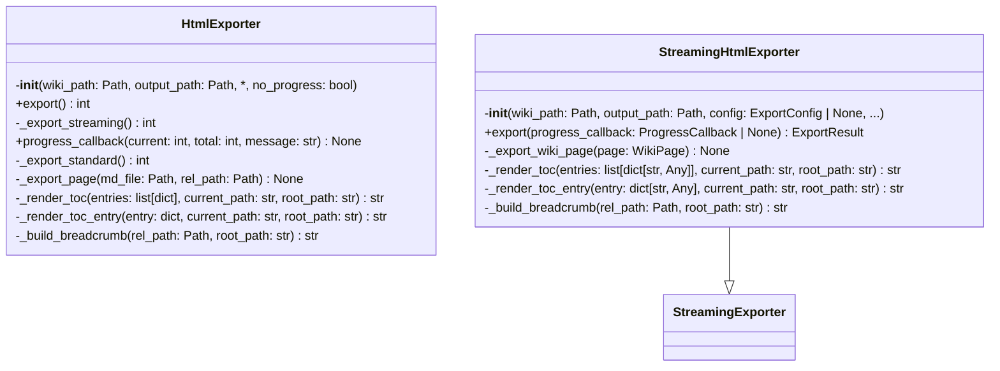

# File: `src/local_deepwiki/export/html.py`

## File Overview

This file implements HTML export functionality for DeepWiki documentation. It provides two distinct export modes: a standard mode for small wikis and a streaming mode for large wikis that avoids loading all pages into memory at once. The module is responsible for converting Markdown content into HTML, fixing internal links, adding external link targets, and generating navigation elements like table of contents (TOC) and breadcrumbs.

The design rationale emphasizes performance and memory efficiency, especially for large wikis, by choosing a streaming approach when necessary. It also integrates with the project's CLI infrastructure and logging system to provide a consistent user experience.

## Key Concepts

### Export Modes
- **Standard Mode**: Loads all wiki pages into memory and exports them sequentially. Suitable for small wikis.
- **Streaming Mode**: Processes pages one at a time, using [`WikiPageIterator`](streaming.md) to determine if streaming is needed. This approach is memory-efficient for large wikis.

### Markdown Rendering
- Uses the `markdown` library with extensions (`fenced_code`, `tables`, `toc`, `nl2br`) to convert Markdown to HTML.
- The `render_markdown` function encapsulates this logic, ensuring consistent rendering across both export modes.

### Link Handling
- **Internal Links**: Converts `.md` file links to `.html` using `fix_internal_links`. This ensures that internal navigation works correctly in the exported HTML.
- **External Links**: Adds `target="_blank"` and `rel="noopener noreferrer"` attributes to external links using `add_external_link_targets` for security and usability.

### Navigation Elements
- **Table of Contents (TOC)**: Generated using shared functions ([`render_toc`](shared.md), [`render_toc_entry`](shared.md)) and dynamically adjusted for relative paths.
- **Breadcrumb Navigation**: Built using [`build_breadcrumb`](shared.md) from shared components, with correct relative path handling based on page depth.

### Progress Reporting
- Both export modes support progress reporting via [`create_progress`](../cli_progress.md) and [`ProgressCallback`](../models/foundation.md) protocol.
- Progress is reported using either a callback or a progress bar, depending on whether interactive mode is detected.

## Integration

This file is part of the `local_deepwiki.export` module and integrates with several other components:

- **CLI Integration**: The `main` function serves as the CLI entry point, parsing arguments and calling `export_to_html`.
- **Shared Components**: Reuses functions like [`build_breadcrumb`](shared.md), `extract_title`, [`render_toc`](shared.md), and [`render_toc_entry`](shared.md) from `local_deepwiki.export.shared`, promoting code reuse and consistency.
- **[Streaming Exporter](streaming.md)**: Inherits from [`StreamingExporter`](streaming.md) and uses [`WikiPageIterator`](streaming.md) to determine when to switch to streaming mode.
- **Logging**: Uses [`get_logger`](../logging.md) from `local_deepwiki.logging` for structured logging throughout the export process.

The `HtmlExporter` and `StreamingHtmlExporter` classes are used by tests (`test_export_init`, `test_html_export`, `test_integration_pipeline`) and the main CLI entry point (`main`), ensuring that both export paths are well-tested and integrated into the core workflow.

## Design Notes

### Memory Efficiency
- The decision to use streaming mode for large wikis was made to prevent memory exhaustion. This is determined by `WikiPageIterator.should_use_streaming()`.
- In streaming mode, each page is processed and then released from memory (`page.release_content()`), minimizing peak memory usage.

### Link Conversion Strategy
- Internal links are converted using a regex pattern that excludes URLs with protocols (`http://`, `https://`) or anchors (`#`), ensuring only local Markdown links are modified.
- External links are identified using a similar regex, checking for `href` attributes starting with `http://` or `https://`, and ensuring no `target` attribute is already present.

### Relative Path Handling
- Depth calculation is used to compute `root_path` (e.g., `../`, `../../`) for correct relative paths in generated HTML.
- This is essential for ensuring that `search.json` and other assets are correctly referenced from any directory level in the exported HTML structure.

### Error Handling
- Individual page failures during streaming export are caught and logged, but do not abort the entire export process. This allows for partial exports in case of corruption or issues with specific pages.

### Progress Reporting
- Progress reporting is optional and disabled when `no_progress=True` or when not in an interactive terminal, making it suitable for automated environments.

### Template Usage
- The `STATIC_HTML_TEMPLATE` from `local_deepwiki.export.html_template` is used to render full HTML pages, ensuring a consistent layout and structure across all exported pages.

## API Reference

### class `StreamingHtmlExporter`

**Inherits from:** [`StreamingExporter`](streaming.md)

Memory-efficient HTML exporter using streaming page iteration.  Writes each page to disk as it's processed, avoiding loading all pages into memory at once. Suitable for large wikis.

**Methods:**


<details>
<summary>View Source (lines 97-261) | <a href="https://github.com/UrbanDiver/local-deepwiki-mcp/blob/main/src/local_deepwiki/export/html.py#L97-L261">GitHub</a></summary>

```python
class StreamingHtmlExporter(StreamingExporter):
    # Methods: __init__, export, _export_wiki_page, _render_toc, _render_toc_entry, _build_breadcrumb
```

</details>

#### `__init__`

```python
def __init__(wiki_path: Path, output_path: Path, config: ExportConfig | None = None, no_progress: bool = False)
```

Initialize the streaming HTML exporter.


| Parameter | Type | Default | Description |
|-----------|------|---------|-------------|
| `wiki_path` | `Path` | - | Path to the .deepwiki directory. |
| `output_path` | `Path` | - | Output directory for HTML files. |
| `config` | `ExportConfig | None` | `None` | Export configuration. |
| `no_progress` | `bool` | `False` | If True, disable progress bars. |


<details>
<summary>View Source (lines 104-121) | <a href="https://github.com/UrbanDiver/local-deepwiki-mcp/blob/main/src/local_deepwiki/export/html.py#L104-L121">GitHub</a></summary>

```python
def __init__(
        self,
        wiki_path: Path,
        output_path: Path,
        config: ExportConfig | None = None,
        *,
        no_progress: bool = False,
    ):
        """Initialize the streaming HTML exporter.

        Args:
            wiki_path: Path to the .deepwiki directory.
            output_path: Output directory for HTML files.
            config: Export configuration.
            no_progress: If True, disable progress bars.
        """
        super().__init__(wiki_path, output_path, config)
        self._no_progress = no_progress
```

</details>

#### `export`

```python
async def export(progress_callback: ProgressCallback | None = None) -> ExportResult
```

Export wiki to HTML with streaming.


| Parameter | Type | Default | Description |
|-----------|------|---------|-------------|
| `progress_callback` | `ProgressCallback | None` | `None` | Optional callback for progress updates. |


<details>
<summary>View Source (lines 123-201) | <a href="https://github.com/UrbanDiver/local-deepwiki-mcp/blob/main/src/local_deepwiki/export/html.py#L123-L201">GitHub</a></summary>

```python
async def export(
        self, progress_callback: ProgressCallback | None = None
    ) -> ExportResult:
        """Export wiki to HTML with streaming.

        Args:
            progress_callback: Optional callback for progress updates.

        Returns:
            ExportResult with export statistics.
        """
        start_time = time.monotonic()
        errors: list[str] = []

        logger.info(
            "Starting streaming HTML export from %s to %s",
            self.wiki_path,
            self.output_path,
        )

        # Load TOC for navigation
        await asyncio.to_thread(self.load_toc)

        # Create output directory
        await asyncio.to_thread(self.output_path.mkdir, parents=True, exist_ok=True)

        # Copy search.json
        search_src = self.wiki_path / "search.json"
        if search_src.exists():
            await asyncio.to_thread(
                shutil.copy, search_src, self.output_path / "search.json"
            )
            logger.debug("Copied search.json to output directory")

        # Get page count for progress
        iterator = self.get_page_iterator()
        total_pages = iterator.get_page_count()

        # Report total pages at start
        if progress_callback:
            progress_callback(
                0, total_pages, f"Starting HTML export ({total_pages} pages)"
            )

        # Export pages one at a time
        exported = 0
        async for page in iterator:
            try:
                await asyncio.to_thread(self._export_wiki_page, page)
                exported += 1

                if progress_callback:
                    progress_callback(exported, total_pages, f"Exported {page.path}")

                # Release content from memory after writing
                page.release_content()

            except Exception as e:  # noqa: BLE001 — export error boundary: one page failure must not abort entire export
                error_msg = f"Failed to export {page.path}: {e}"
                logger.warning(error_msg)
                errors.append(error_msg)

        # Report completion
        if progress_callback:
            progress_callback(
                exported, total_pages, f"HTML export complete ({exported} pages)"
            )

        duration_ms = int((time.monotonic() - start_time) * 1000)
        logger.info(
            "Streaming HTML export complete: %d pages in %dms", exported, duration_ms
        )

        return ExportResult(
            pages_exported=exported,
            output_path=self.output_path,
            duration_ms=duration_ms,
            errors=errors,
        )
```

</details>

### class `HtmlExporter`

Export wiki markdown to static HTML files.  This is the synchronous [wrapper](../handlers/_error_handling.md) class that maintains backwards compatibility. For large wikis, use StreamingHtmlExporter directly for async streaming export.

**Methods:**


<details>
<summary>View Source (lines 264-428) | <a href="https://github.com/UrbanDiver/local-deepwiki-mcp/blob/main/src/local_deepwiki/export/html.py#L264-L428">GitHub</a></summary>

```python
class HtmlExporter:
    # Methods: __init__, export, _export_streaming, progress_callback, _export_standard, _export_page, _render_toc, _render_toc_entry, _build_breadcrumb
```

</details>

#### `__init__`

```python
def __init__(wiki_path: Path, output_path: Path, no_progress: bool = False)
```

Initialize the exporter.


| Parameter | Type | Default | Description |
|-----------|------|---------|-------------|
| `wiki_path` | `Path` | - | Path to the .deepwiki directory |
| `output_path` | `Path` | - | Output directory for HTML files |
| `no_progress` | `bool` | `False` | If True, disable progress bars |


<details>
<summary>View Source (lines 271-288) | <a href="https://github.com/UrbanDiver/local-deepwiki-mcp/blob/main/src/local_deepwiki/export/html.py#L271-L288">GitHub</a></summary>

```python
def __init__(
        self,
        wiki_path: Path,
        output_path: Path,
        *,
        no_progress: bool = False,
    ):
        """Initialize the exporter.

        Args:
            wiki_path: Path to the .deepwiki directory
            output_path: Output directory for HTML files
            no_progress: If True, disable progress bars
        """
        self.wiki_path = Path(wiki_path)
        self.output_path = Path(output_path)
        self.toc_entries: list[dict] = []
        self._no_progress = no_progress
```

</details>

#### `export`

```python
def export() -> int
```

Export all wiki pages to HTML.


<details>
<summary>View Source (lines 290-308) | <a href="https://github.com/UrbanDiver/local-deepwiki-mcp/blob/main/src/local_deepwiki/export/html.py#L290-L308">GitHub</a></summary>

```python
def export(self) -> int:
        """Export all wiki pages to HTML.

        Returns:
            Number of pages exported
        """
        logger.info(
            "Starting HTML export from %s to %s", self.wiki_path, self.output_path
        )

        # Check if we should use streaming mode
        iterator = WikiPageIterator(self.wiki_path)
        use_streaming = iterator.should_use_streaming()

        if use_streaming:
            logger.info("Large wiki detected, using streaming export mode")
            return self._export_streaming()

        return self._export_standard()
```

</details>

#### `progress_callback`

```python
def progress_callback(current: int, total: int, message: str) -> None
```


| Parameter | Type | Default | Description |
|-----------|------|---------|-------------|
| `current` | `int` | - | - |
| `total` | `int` | - | - |
| `message` | `str` | - | - |


---


<details>
<summary>View Source (lines 322-325) | <a href="https://github.com/UrbanDiver/local-deepwiki-mcp/blob/main/src/local_deepwiki/export/html.py#L322-L325">GitHub</a></summary>

```python
def progress_callback(current: int, total: int, message: str) -> None:
                progress.update(
                    task_id, total=total, completed=current, description=message
                )
```

</details>

### Functions

#### `render_markdown`

```python
def render_markdown(content: str) -> str
```

Render markdown to HTML.


| Parameter | Type | Default | Description |
|-----------|------|---------|-------------|
| `content` | `str` | - | - |

**Returns:** `str`


<details>
<summary>View Source (lines 34-44) | <a href="https://github.com/UrbanDiver/local-deepwiki-mcp/blob/main/src/local_deepwiki/export/html.py#L34-L44">GitHub</a></summary>

```python
def render_markdown(content: str) -> str:
    """Render markdown to HTML."""
    md = markdown.Markdown(
        extensions=[
            "fenced_code",
            "tables",
            "toc",
            "nl2br",
        ]
    )
    return md.convert(content)
```

</details>

#### `fix_internal_links`

```python
def fix_internal_links(html_content: str) -> str
```

Convert internal .md links to .html links in rendered HTML.


| Parameter | Type | Default | Description |
|-----------|------|---------|-------------|
| `html_content` | `str` | - | HTML content with potential .md links. |

**Returns:** `str`


<details>
<summary>View Source (lines 47-66) | <a href="https://github.com/UrbanDiver/local-deepwiki-mcp/blob/main/src/local_deepwiki/export/html.py#L47-L66">GitHub</a></summary>

```python
def fix_internal_links(html_content: str) -> str:
    """Convert internal .md links to .html links in rendered HTML.

    Args:
        html_content: HTML content with potential .md links.

    Returns:
        HTML content with .md links converted to .html links.
    """
    # Match href attributes pointing to .md files (internal links only)
    # Excludes http://, https://, and other protocol links
    pattern = r'href="((?!https?://|mailto:|#)[^"]*\.md)(#[^"]*)?"'

    def replace_link(match: re.Match[str]) -> str:
        md_path = match.group(1)
        anchor = match.group(2) or ""
        html_path = md_path[:-3] + ".html"  # Replace .md with .html
        return f'href="{html_path}{anchor}"'

    return re.sub(pattern, replace_link, html_content)
```

</details>

#### `replace_link`

```python
def replace_link(match: re.Match[str]) -> str
```


| Parameter | Type | Default | Description |
|-----------|------|---------|-------------|
| `match` | `re.Match[str]` | - | - |

**Returns:** `str`


<details>
<summary>View Source (lines 60-64) | <a href="https://github.com/UrbanDiver/local-deepwiki-mcp/blob/main/src/local_deepwiki/export/html.py#L60-L64">GitHub</a></summary>

```python
def replace_link(match: re.Match[str]) -> str:
        md_path = match.group(1)
        anchor = match.group(2) or ""
        html_path = md_path[:-3] + ".html"  # Replace .md with .html
        return f'href="{html_path}{anchor}"'
```

</details>

#### `add_external_link_targets`

```python
def add_external_link_targets(html_content: str) -> str
```

Add target="_blank" to external links for opening in new tab.


| Parameter | Type | Default | Description |
|-----------|------|---------|-------------|
| `html_content` | `str` | - | HTML content with potential external links. |

**Returns:** `str`


<details>
<summary>View Source (lines 69-86) | <a href="https://github.com/UrbanDiver/local-deepwiki-mcp/blob/main/src/local_deepwiki/export/html.py#L69-L86">GitHub</a></summary>

```python
def add_external_link_targets(html_content: str) -> str:
    """Add target="_blank" to external links for opening in new tab.

    Args:
        html_content: HTML content with potential external links.

    Returns:
        HTML content with external links opening in new tabs.
    """
    # Match href attributes pointing to http:// or https:// URLs
    # that don't already have a target attribute
    pattern = r'<a\s+href="(https?://[^"]+)"(?![^>]*target=)'

    def add_target(match: re.Match[str]) -> str:
        url = match.group(1)
        return f'<a href="{url}" target="_blank" rel="noopener noreferrer"'

    return re.sub(pattern, add_target, html_content)
```

</details>

#### `add_target`

```python
def add_target(match: re.Match[str]) -> str
```


| Parameter | Type | Default | Description |
|-----------|------|---------|-------------|
| `match` | `re.Match[str]` | - | - |

**Returns:** `str`


<details>
<summary>View Source (lines 82-84) | <a href="https://github.com/UrbanDiver/local-deepwiki-mcp/blob/main/src/local_deepwiki/export/html.py#L82-L84">GitHub</a></summary>

```python
def add_target(match: re.Match[str]) -> str:
        url = match.group(1)
        return f'<a href="{url}" target="_blank" rel="noopener noreferrer"'
```

</details>

#### `extract_title`

```python
def extract_title(md_file: Path) -> str
```

Extract title from markdown file.  Delegates to ``shared.extract_title``.


| Parameter | Type | Default | Description |
|-----------|------|---------|-------------|
| `md_file` | `Path` | - | - |

**Returns:** `str`


<details>
<summary>View Source (lines 89-94) | <a href="https://github.com/UrbanDiver/local-deepwiki-mcp/blob/main/src/local_deepwiki/export/html.py#L89-L94">GitHub</a></summary>

```python
def extract_title(md_file: Path) -> str:
    """Extract title from markdown file.

    Delegates to ``shared.extract_title``.
    """
    return _shared_extract_title(md_file)
```

</details>

#### `export_to_html`

```python
def export_to_html(wiki_path: str | Path, output_path: str | Path | None = None, no_progress: bool = False) -> str
```

Export wiki to static HTML files.


| Parameter | Type | Default | Description |
|-----------|------|---------|-------------|
| `wiki_path` | `str | Path` | - | Path to the .deepwiki directory |
| `output_path` | `str | Path | None` | `None` | Output directory (default: {wiki_path}_html) |
| `no_progress` | `bool` | `False` | If True, disable progress bars |

**Returns:** `str`


<details>
<summary>View Source (lines 431-458) | <a href="https://github.com/UrbanDiver/local-deepwiki-mcp/blob/main/src/local_deepwiki/export/html.py#L431-L458">GitHub</a></summary>

```python
def export_to_html(
    wiki_path: str | Path,
    output_path: str | Path | None = None,
    *,
    no_progress: bool = False,
) -> str:
    """Export wiki to static HTML files.

    Args:
        wiki_path: Path to the .deepwiki directory
        output_path: Output directory (default: {wiki_path}_html)
        no_progress: If True, disable progress bars

    Returns:
        Path to the output directory
    """
    wiki_path = Path(wiki_path)
    if output_path is None:
        output_path = wiki_path.parent / f"{wiki_path.name}_html"
    else:
        output_path = Path(output_path)

    logger.info("Exporting wiki from %s to %s", wiki_path, output_path)
    exporter = HtmlExporter(wiki_path, output_path, no_progress=no_progress)
    count = exporter.export()

    logger.info("HTML export complete: %s pages", count)
    return f"Exported {count} pages to {output_path}"
```

</details>

#### `main`

```python
def main() -> int
```

CLI entry point for HTML export.

**Returns:** `int`


<details>
<summary>View Source (lines 461-497) | <a href="https://github.com/UrbanDiver/local-deepwiki-mcp/blob/main/src/local_deepwiki/export/html.py#L461-L497">GitHub</a></summary>

```python
def main() -> int:
    """CLI entry point for HTML export."""
    parser = argparse.ArgumentParser(
        description="Export DeepWiki documentation to static HTML"
    )
    parser.add_argument(
        "wiki_path",
        nargs="?",
        default=".deepwiki",
        help="Path to the .deepwiki directory (default: .deepwiki)",
    )
    parser.add_argument(
        "--output", "-o", help="Output directory (default: {wiki_path}_html)"
    )
    parser.add_argument(
        "--no-progress",
        action="store_true",
        help="Disable progress bars (for non-interactive use)",
    )

    args = parser.parse_args()

    wiki_path = Path(args.wiki_path).resolve()
    if not wiki_path.exists():
        print(f"Error: Wiki path does not exist: {wiki_path}")
        return 1

    output_path = Path(args.output).resolve() if args.output else None

    result = export_to_html(wiki_path, output_path, no_progress=args.no_progress)
    print(result)

    # Print location hint
    actual_output = output_path or (wiki_path.parent / f"{wiki_path.name}_html")
    print(f"\nOpen {actual_output}/index.html in a browser to view the documentation.")

    return 0
```

</details>

## Class Diagram


```mermaid
classDiagram
    class HtmlExporter {
        -__init__(wiki_path: Path, output_path: Path, *, no_progress: bool)
        +export() int
        -_export_streaming() int
        +progress_callback(current: int, total: int, message: str) None
        -_export_standard() int
        -_export_page(md_file: Path, rel_path: Path) None
        -_render_toc(entries: list[dict], current_path: str, root_path: str) str
        -_render_toc_entry(entry: dict, current_path: str, root_path: str) str
        -_build_breadcrumb(rel_path: Path, root_path: str) str
    }
    class StreamingHtmlExporter {
        -__init__(wiki_path: Path, output_path: Path, config: ExportConfig | None, ...)
        +export(progress_callback: ProgressCallback | None) ExportResult
        -_export_wiki_page(page: WikiPage) None
        -_render_toc(entries: list[dict[str, Any]], current_path: str, root_path: str) str
        -_render_toc_entry(entry: dict[str, Any], current_path: str, root_path: str) str
        -_build_breadcrumb(rel_path: Path, root_path: str) str
    }
    StreamingHtmlExporter --|> StreamingExporter
```

## Call Graph


```mermaid
flowchart TD
    N0[HtmlExporter._export_page]
    N1[HtmlExporter._export_standard]
    N2[HtmlExporter._export_streaming]
    N3[HtmlExporter.export]
    N4[Markdown]
    N5[Path]
    N6[StreamingHtmlExporter._expo...]
    N7[StreamingHtmlExporter.export]
    N8[_build_breadcrumb]
    N9[_render_toc]
    N10[add_external_link_targets]
    N11[add_task]
    N12[build_breadcrumb]
    N13[convert]
    N14[create_progress]
    N15[exists]
    N16[export]
    N17[export_to_html]
    N18[extract_title]
    N19[fix_internal_links]
    N20[group]
    N21[main]
    N22[mkdir]
    N23[read_text]
    N24[render_markdown]
    N25[render_toc]
    N26[render_toc_entry]
    N27[sub]
    N28[with_suffix]
    N29[write_text]
    N24 --> N4
    N24 --> N13
    N19 --> N20
    N19 --> N27
    N10 --> N20
    N10 --> N27
    N17 --> N5
    N17 --> N16
    N21 --> N5
    N21 --> N15
    N21 --> N17
    N7 --> N15
    N6 --> N24
    N6 --> N19
    N6 --> N10
    N6 --> N9
    N6 --> N8
    N6 --> N28
    N6 --> N22
    N6 --> N29
    N2 --> N14
    N2 --> N11
    N2 --> N16
    N1 --> N15
    N1 --> N23
    N1 --> N22
    N1 --> N14
    N1 --> N11
    N0 --> N23
    N0 --> N24
    N0 --> N19
    N0 --> N10
    N0 --> N18
    N0 --> N9
    N0 --> N8
    N0 --> N28
    N0 --> N22
    N0 --> N29
    classDef func fill:#e1f5fe
    class N4,N5,N8,N9,N10,N11,N12,N13,N14,N15,N16,N17,N18,N19,N20,N21,N22,N23,N24,N25,N26,N27,N28,N29 func
    classDef method fill:#fff3e0
    class N0,N1,N2,N3,N6,N7 method
```

## Used By

Functions and methods in this file and their callers:

- **`ArgumentParser`**: called by `main`
- **[`ExportResult`](../services/models.md)**: called by `StreamingHtmlExporter.export`
- **`HtmlExporter`**: called by `export_to_html`
- **`Markdown`**: called by `render_markdown`
- **`Path`**: called by `HtmlExporter.__init__`, `export_to_html`, `main`
- **`StreamingHtmlExporter`**: called by `HtmlExporter._export_streaming`
- **[`WikiPageIterator`](streaming.md)**: called by `HtmlExporter.export`
- **`__init__`**: called by `StreamingHtmlExporter.__init__`
- **`_build_breadcrumb`**: called by `HtmlExporter._export_page`, `StreamingHtmlExporter._export_wiki_page`
- **`_export_page`**: called by `HtmlExporter._export_standard`
- **`_export_standard`**: called by `HtmlExporter.export`
- **`_export_streaming`**: called by `HtmlExporter.export`
- **`_render_toc`**: called by `HtmlExporter._export_page`, `StreamingHtmlExporter._export_wiki_page`
- **`_shared_extract_title`**: called by `extract_title`
- **`add_argument`**: called by `main`
- **`add_external_link_targets`**: called by `HtmlExporter._export_page`, `StreamingHtmlExporter._export_wiki_page`
- **`add_task`**: called by `HtmlExporter._export_standard`, `HtmlExporter._export_streaming`
- **[`build_breadcrumb`](shared.md)**: called by `HtmlExporter._build_breadcrumb`, `StreamingHtmlExporter._build_breadcrumb`
- **`convert`**: called by `render_markdown`
- **`copy`**: called by `HtmlExporter._export_standard`
- **[`create_progress`](../cli_progress.md)**: called by `HtmlExporter._export_standard`, `HtmlExporter._export_streaming`
- **`exists`**: called by `HtmlExporter._export_standard`, `StreamingHtmlExporter.export`, `main`
- **`export`**: called by `HtmlExporter._export_streaming`, `export_to_html`
- **`export_to_html`**: called by `main`
- **`extract_title`**: called by `HtmlExporter._export_page`
- **`fix_internal_links`**: called by `HtmlExporter._export_page`, `StreamingHtmlExporter._export_wiki_page`
- **`get_page_count`**: called by `StreamingHtmlExporter.export`
- **`get_page_iterator`**: called by `StreamingHtmlExporter.export`
- **`group`**: called by `add_external_link_targets`, `add_target`, `fix_internal_links`, `replace_link`
- **`loads`**: called by `HtmlExporter._export_standard`
- **`mkdir`**: called by `HtmlExporter._export_page`, `HtmlExporter._export_standard`, `StreamingHtmlExporter._export_wiki_page`
- **`monotonic`**: called by `StreamingHtmlExporter.export`
- **`new_event_loop`**: called by `HtmlExporter._export_streaming`
- **`parse_args`**: called by `main`
- **[`progress_callback`](../handlers/research.md)**: called by `StreamingHtmlExporter.export`
- **`read_text`**: called by `HtmlExporter._export_page`, `HtmlExporter._export_standard`
- **`relative_to`**: called by `HtmlExporter._export_standard`
- **`release_content`**: called by `StreamingHtmlExporter.export`
- **`render_markdown`**: called by `HtmlExporter._export_page`, `StreamingHtmlExporter._export_wiki_page`
- **[`render_toc`](shared.md)**: called by `HtmlExporter._render_toc`, `StreamingHtmlExporter._render_toc`
- **[`render_toc_entry`](shared.md)**: called by `HtmlExporter._render_toc_entry`, `StreamingHtmlExporter._render_toc_entry`
- **`resolve`**: called by `main`
- **`rglob`**: called by `HtmlExporter._export_standard`
- **`run_until_complete`**: called by `HtmlExporter._export_streaming`
- **`should_use_streaming`**: called by `HtmlExporter.export`
- **`sub`**: called by `add_external_link_targets`, `fix_internal_links`
- **`to_thread`**: called by `StreamingHtmlExporter.export`
- **`with_suffix`**: called by `HtmlExporter._export_page`, `StreamingHtmlExporter._export_wiki_page`
- **`write_text`**: called by `HtmlExporter._export_page`, `StreamingHtmlExporter._export_wiki_page`

## Usage Examples

*Examples extracted from test files*

### Test basic markdown conversion

From `test_html_export.py::TestRenderMarkdown::test_basic_markdown`:

```python
md = "# Hello\n\nThis is a paragraph."
html = render_markdown(md)
assert "<h1" in html  # h1 tag (may have id attribute)
assert "Hello" in html
assert "<p>" in html
```

### Test basic markdown conversion

From `test_html_export.py::TestRenderMarkdown::test_basic_markdown`:

```python
md = "# Hello\n\nThis is a paragraph."
html = render_markdown(md)
assert "<h1" in html  # h1 tag (may have id attribute)
assert "Hello" in html
assert "<p>" in html
```

### Test fenced code blocks

From `test_html_export.py::TestRenderMarkdown::test_code_blocks`:

```python
md = "```python\ndef hello():\n    pass\n```"
html = render_markdown(md)
assert "<code" in html
assert "def hello" in html
```

### Test converting simple .md link to .html

From `test_html_export.py::TestFixInternalLinks::test_simple_md_link`:

```python
html = '<a href="files/database.md">Database</a>'
result = fix_internal_links(html)
assert 'href="files/database.html"' in result
```

### Test converting .md link with anchor

From `test_html_export.py::TestFixInternalLinks::test_md_link_with_anchor`:

```python
html = '<a href="files/database.md#section">Section</a>'
result = fix_internal_links(html)
assert 'href="files/database.html#section"' in result
```


## Last Modified

| Entity | Type | Author | Date | Commit |
|--------|------|--------|------|--------|
| `StreamingHtmlExporter` | class | Brian Breidenbach | Feb 23, 2026 | `c6fe2bd` refactor: split oversized m... |
| `export` | method | Brian Breidenbach | Feb 23, 2026 | `c6fe2bd` refactor: split oversized m... |
| `_render_toc` | method | Brian Breidenbach | Feb 20, 2026 | `6be69f5` refactor: low-priority Pyth... |
| `_render_toc_entry` | method | Brian Breidenbach | Feb 20, 2026 | `6be69f5` refactor: low-priority Pyth... |
| `HtmlExporter` | class | Brian Breidenbach | Feb 20, 2026 | `6be69f5` refactor: low-priority Pyth... |
| `_render_toc` | method | Brian Breidenbach | Feb 20, 2026 | `6be69f5` refactor: low-priority Pyth... |
| `_render_toc_entry` | method | Brian Breidenbach | Feb 20, 2026 | `6be69f5` refactor: low-priority Pyth... |
| `export` | method | Brian Breidenbach | Feb 20, 2026 | `b807417` refactor: high-priority Pyt... |
| `_export_wiki_page` | method | Brian Breidenbach | Feb 11, 2026 | `ba96da1` fix: publication plan P0-P2... |
| `_export_standard` | method | Brian Breidenbach | Feb 11, 2026 | `ba96da1` fix: publication plan P0-P2... |
| `_export_page` | method | Brian Breidenbach | Feb 11, 2026 | `ba96da1` fix: publication plan P0-P2... |
| `export_to_html` | function | Brian Breidenbach | Feb 11, 2026 | `ba96da1` fix: publication plan P0-P2... |
| `render_markdown` | function | Brian Breidenbach | Feb 11, 2026 | `25db622` fix: publication review P0-... |
| `_build_breadcrumb` | method | Brian Breidenbach | Feb 09, 2026 | `2130136` refactor: Extract duplicate... |
| `_export_streaming` | method | Brian Breidenbach | Feb 09, 2026 | `2130136` refactor: Extract duplicate... |
| `progress_callback` | method | Brian Breidenbach | Feb 09, 2026 | `2130136` refactor: Extract duplicate... |
| `_build_breadcrumb` | method | Brian Breidenbach | Feb 09, 2026 | `2130136` refactor: Extract duplicate... |
| `extract_title` | function | Brian Breidenbach | Feb 09, 2026 | `2130136` refactor: Extract duplicate... |
| `main` | function | Brian Breidenbach | Feb 09, 2026 | `2130136` refactor: Extract duplicate... |
| `fix_internal_links` | function | Brian Breidenbach | Jan 31, 2026 | `1468d91` Fix HTML export internal li... |
| `replace_link` | function | Brian Breidenbach | Jan 31, 2026 | `1468d91` Fix HTML export internal li... |
| `add_external_link_targets` | function | Brian Breidenbach | Jan 31, 2026 | `1468d91` Fix HTML export internal li... |
| `add_target` | function | Brian Breidenbach | Jan 31, 2026 | `1468d91` Fix HTML export internal li... |
| `__init__` | method | Brian Breidenbach | Jan 26, 2026 | `a64166a` Add seven medium-priority e... |
| `__init__` | method | Brian Breidenbach | Jan 24, 2026 | `fa2feb8` Add CLI progress bars and f... |

## Additional Source Code

Source code for functions and methods not listed in the API Reference above.

#### `_export_wiki_page`

<details>
<summary>View Source (lines 203-243) | <a href="https://github.com/UrbanDiver/local-deepwiki-mcp/blob/main/src/local_deepwiki/export/html.py#L203-L243">GitHub</a></summary>

```python
def _export_wiki_page(self, page: WikiPage) -> None:
        """Export a single wiki page to HTML.

        Args:
            page: WikiPage object with content loaded on demand.
        """
        rel_path = page.metadata.relative_path
        logger.debug("Exporting page: %s", rel_path)

        # Render markdown to HTML, fix internal links, and set external link targets
        html_content = render_markdown(page.content)
        html_content = fix_internal_links(html_content)
        html_content = add_external_link_targets(html_content)

        # Calculate depth for relative paths
        depth = len(rel_path.parts) - 1
        root_path = "../" * depth if depth > 0 else "./"

        # Build TOC HTML with correct relative paths
        toc_html = self._render_toc(self._toc_entries, str(rel_path), root_path)

        # Build breadcrumb HTML
        breadcrumb_html = self._build_breadcrumb(rel_path, root_path)

        # Calculate search.json path relative to this page
        search_json_path = root_path + "search.json"

        # Render full HTML
        html = STATIC_HTML_TEMPLATE.format(
            title=page.title,
            toc_html=toc_html,
            breadcrumb_html=breadcrumb_html,
            content_html=html_content,
            search_json_path=search_json_path,
            root_path=root_path,
        )

        # Write output file
        output_file = self.output_path / rel_path.with_suffix(".html")
        output_file.parent.mkdir(parents=True, exist_ok=True)
        output_file.write_text(html)
```

</details>


#### `_render_toc`

<details>
<summary>View Source (lines 246-250) | <a href="https://github.com/UrbanDiver/local-deepwiki-mcp/blob/main/src/local_deepwiki/export/html.py#L246-L250">GitHub</a></summary>

```python
def _render_toc(
        entries: list[dict[str, Any]], current_path: str, root_path: str
    ) -> str:
        """Render TOC entries as HTML. Delegates to shared.render_toc."""
        return render_toc(entries, current_path, root_path)
```

</details>


#### `_render_toc_entry`

<details>
<summary>View Source (lines 253-257) | <a href="https://github.com/UrbanDiver/local-deepwiki-mcp/blob/main/src/local_deepwiki/export/html.py#L253-L257">GitHub</a></summary>

```python
def _render_toc_entry(
        entry: dict[str, Any], current_path: str, root_path: str
    ) -> str:
        """Render a single TOC entry recursively. Delegates to shared.render_toc_entry."""
        return render_toc_entry(entry, current_path, root_path)
```

</details>


#### `_build_breadcrumb`

<details>
<summary>View Source (lines 259-261) | <a href="https://github.com/UrbanDiver/local-deepwiki-mcp/blob/main/src/local_deepwiki/export/html.py#L259-L261">GitHub</a></summary>

```python
def _build_breadcrumb(self, rel_path: Path, root_path: str) -> str:
        """Build breadcrumb navigation HTML. Delegates to shared.build_breadcrumb."""
        return build_breadcrumb(rel_path, root_path, self.wiki_path)
```

</details>


#### `_export_streaming`

<details>
<summary>View Source (lines 310-335) | <a href="https://github.com/UrbanDiver/local-deepwiki-mcp/blob/main/src/local_deepwiki/export/html.py#L310-L335">GitHub</a></summary>

```python
def _export_streaming(self) -> int:
        """Export using streaming mode for large wikis."""
        streaming_exporter = StreamingHtmlExporter(
            self.wiki_path,
            self.output_path,
            no_progress=self._no_progress,
        )

        # Run async export in event loop
        with create_progress(disable=self._no_progress) as progress:
            task_id = progress.add_task("Exporting HTML (streaming)", total=None)

            def progress_callback(current: int, total: int, message: str) -> None:
                progress.update(
                    task_id, total=total, completed=current, description=message
                )

            loop = asyncio.new_event_loop()
            try:
                result = loop.run_until_complete(
                    streaming_exporter.export(progress_callback=progress_callback)
                )
            finally:
                loop.close()

        return result.pages_exported
```

</details>


#### `_export_standard`

<details>
<summary>View Source (lines 337-370) | <a href="https://github.com/UrbanDiver/local-deepwiki-mcp/blob/main/src/local_deepwiki/export/html.py#L337-L370">GitHub</a></summary>

```python
def _export_standard(self) -> int:
        """Export using standard mode (loads all pages in memory)."""
        # Load TOC
        toc_path = self.wiki_path / "toc.json"
        if toc_path.exists():
            toc_data = json.loads(toc_path.read_text())
            self.toc_entries = toc_data.get("entries", [])
            logger.debug("Loaded %s TOC entries", len(self.toc_entries))

        # Create output directory
        self.output_path.mkdir(parents=True, exist_ok=True)

        # Copy search.json
        search_src = self.wiki_path / "search.json"
        if search_src.exists():
            shutil.copy(search_src, self.output_path / "search.json")
            logger.debug("Copied search.json to output directory")

        # Find all markdown files
        md_files = list(self.wiki_path.rglob("*.md"))

        # Export with progress bar
        exported = 0
        with create_progress(disable=self._no_progress) as progress:
            task = progress.add_task("Exporting HTML", total=len(md_files))
            for md_file in md_files:
                rel_path = md_file.relative_to(self.wiki_path)
                progress.update(task, description=f"Exporting {rel_path.name}")
                self._export_page(md_file, rel_path)
                exported += 1
                progress.update(task, advance=1)

        logger.info("Exported %s pages to HTML", exported)
        return exported
```

</details>


#### `_export_page`

<details>
<summary>View Source (lines 372-414) | <a href="https://github.com/UrbanDiver/local-deepwiki-mcp/blob/main/src/local_deepwiki/export/html.py#L372-L414">GitHub</a></summary>

```python
def _export_page(self, md_file: Path, rel_path: Path) -> None:
        """Export a single markdown page to HTML.

        Args:
            md_file: Path to the markdown file
            rel_path: Relative path from wiki root
        """
        logger.debug("Exporting page: %s", rel_path)

        # Read and convert markdown, fix internal links, set external link targets
        content = md_file.read_text()
        html_content = render_markdown(content)
        html_content = fix_internal_links(html_content)
        html_content = add_external_link_targets(html_content)
        title = extract_title(md_file)

        # Calculate depth for relative paths
        depth = len(rel_path.parts) - 1
        root_path = "../" * depth if depth > 0 else "./"

        # Build TOC HTML with correct relative paths
        toc_html = self._render_toc(self.toc_entries, str(rel_path), root_path)

        # Build breadcrumb HTML
        breadcrumb_html = self._build_breadcrumb(rel_path, root_path)

        # Calculate search.json path relative to this page
        search_json_path = root_path + "search.json"

        # Render full HTML
        html = STATIC_HTML_TEMPLATE.format(
            title=title,
            toc_html=toc_html,
            breadcrumb_html=breadcrumb_html,
            content_html=html_content,
            search_json_path=search_json_path,
            root_path=root_path,
        )

        # Write output file
        output_file = self.output_path / rel_path.with_suffix(".html")
        output_file.parent.mkdir(parents=True, exist_ok=True)
        output_file.write_text(html)
```

</details>


#### `_render_toc`

<details>
<summary>View Source (lines 417-419) | <a href="https://github.com/UrbanDiver/local-deepwiki-mcp/blob/main/src/local_deepwiki/export/html.py#L417-L419">GitHub</a></summary>

```python
def _render_toc(entries: list[dict], current_path: str, root_path: str) -> str:
        """Render TOC entries as HTML. Delegates to shared.render_toc."""
        return render_toc(entries, current_path, root_path)
```

</details>


#### `_render_toc_entry`

<details>
<summary>View Source (lines 422-424) | <a href="https://github.com/UrbanDiver/local-deepwiki-mcp/blob/main/src/local_deepwiki/export/html.py#L422-L424">GitHub</a></summary>

```python
def _render_toc_entry(entry: dict, current_path: str, root_path: str) -> str:
        """Render a single TOC entry recursively. Delegates to shared.render_toc_entry."""
        return render_toc_entry(entry, current_path, root_path)
```

</details>


#### `_build_breadcrumb`

<details>
<summary>View Source (lines 426-428) | <a href="https://github.com/UrbanDiver/local-deepwiki-mcp/blob/main/src/local_deepwiki/export/html.py#L426-L428">GitHub</a></summary>

```python
def _build_breadcrumb(self, rel_path: Path, root_path: str) -> str:
        """Build breadcrumb navigation HTML. Delegates to shared.build_breadcrumb."""
        return build_breadcrumb(rel_path, root_path, self.wiki_path)
```

</details>

## Relevant Source Files

- `src/local_deepwiki/export/html.py:97-261`
