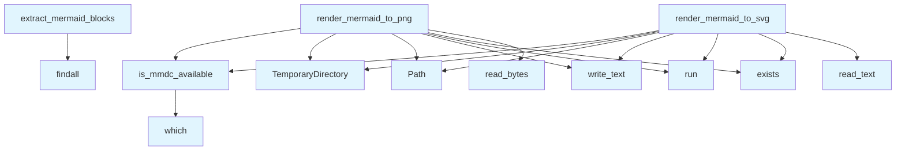

# File: `src/local_deepwiki/export/mermaid_renderer.py`

## File Overview

This module provides utilities for rendering Mermaid diagrams within the `local_deepwiki` project, primarily for use in PDF and HTML export functionality. It enables the extraction of Mermaid code blocks from markdown content and supports rendering those diagrams into either PNG or SVG formats using the `mermaid-cli` tool (`mmdc`).

The design rationale centers on robustness and graceful degradation: if `mmdc` is not installed, the system falls back to placeholder behavior without crashing, ensuring that documentation generation can proceed even in environments where Mermaid rendering is not fully supported.

## Key Concepts

### Mermaid CLI Integration
The core abstraction leverages the external `mermaid-cli` tool (`mmdc`) to perform diagram rendering. This choice was made to offload complex diagram layout and rendering logic to a well-maintained, battle-tested tool, rather than implementing a custom renderer.

### Context-Aware Availability Checking
The `is_mmdc_available` function uses a `ContextVar` to cache the result of checking whether `mmdc` is available on the system. This avoids repeated filesystem checks during a single execution, improving performance while maintaining correctness across different contexts.

### Temporary File Management
Rendering functions use `tempfile.TemporaryDirectory` to isolate temporary input and output files. This ensures no side effects on the host filesystem and simplifies cleanup.

### Error Handling and Graceful Degradation
All rendering functions include comprehensive error handling for timeouts, subprocess failures, and I/O errors. In case of failure, they return `None` instead of raising exceptions, allowing callers to handle missing diagrams gracefully.

## Integration

This file is used by the `pdf` module and the `test_pdf_mermaid` test suite, indicating its role in generating diagrams for PDF exports. It integrates with the broader system through:

- `render_mermaid_to_png` and `render_mermaid_to_svg`: Called by PDF export logic to generate visual representations of diagrams.
- `extract_mermaid_blocks`: Used to parse markdown content for Mermaid code blocks before rendering.

It imports logging from `local_deepwiki.logging`, ensuring consistent logging practices across the application. It also depends on standard library modules and external tools (`mmdc`) for its functionality.

## Design Notes

### Why `mmdc` Instead of Custom Renderer?
Using `mmdc` provides access to a mature, feature-complete rendering engine that supports various diagram types and styling options. It also handles font embedding and rendering quality out-of-the-box, which would be non-trivial to replicate in-house.

### Caching `mmdc` Availability
The use of `ContextVar` for caching `is_mmdc_available()` ensures that repeated checks within the same execution context do not incur unnecessary system calls, while still allowing for multiple independent execution contexts (e.g., in tests) to maintain their own state.

### PNG vs SVG Output
- PNG rendering uses a white background and higher scale (`-s 2`) to improve quality for PDFs.
- SVG rendering uses a transparent background, suitable for HTML but potentially problematic in PDFs due to font embedding issues.
This distinction reflects the differing requirements of output formats.

### Handling of Subprocess Errors
The code explicitly catches and logs a variety of exception types from `subprocess` and related modules. This allows the system to provide informative warnings and fail gracefully without crashing, which is crucial in documentation generation pipelines where partial failures should not halt the entire process.

### Regex Pattern for Block Extraction
The regex pattern `r"```mermaid\n(.*?)```"` is used to match Mermaid code blocks. The `re.DOTALL` flag allows matching across multiple lines, which is necessary since Mermaid diagrams often span several lines. This simple but effective approach avoids overcomplicating parsing logic for a relatively stable format.

## API Reference

### Functions

#### `is_mmdc_available`

```python
def is_mmdc_available() -> bool
```

Check if mermaid-cli (mmdc) is available on the system.

**Returns:** `bool`


<details>
<summary>View Source (lines 30-46) | <a href="https://github.com/UrbanDiver/local-deepwiki-mcp/blob/main/src/local_deepwiki/export/mermaid_renderer.py#L30-L46">GitHub</a></summary>

```python
def is_mmdc_available() -> bool:
    """Check if mermaid-cli (mmdc) is available on the system.

    Returns:
        True if mmdc is available, False otherwise.
    """
    val = _mmdc_available_var.get()
    if val is not None:
        return val

    val = shutil.which("mmdc") is not None
    _mmdc_available_var.set(val)
    if val:
        logger.debug("Mermaid CLI (mmdc) is available")
    else:
        logger.debug("Mermaid CLI (mmdc) not found - diagrams will use placeholder")
    return val
```

</details>

#### `render_mermaid_to_png`

```python
def render_mermaid_to_png(diagram_code: str, timeout: int = MERMAID_RENDER_TIMEOUT) -> bytes | None
```

Render a mermaid diagram to PNG using mermaid-cli.


| Parameter | Type | Default | Description |
|-----------|------|---------|-------------|
| `diagram_code` | `str` | - | The mermaid diagram code. |
| `timeout` | `int` | `MERMAID_RENDER_TIMEOUT` | Timeout in seconds for the mmdc command. |

**Returns:** `bytes | None`


<details>
<summary>View Source (lines 49-111) | <a href="https://github.com/UrbanDiver/local-deepwiki-mcp/blob/main/src/local_deepwiki/export/mermaid_renderer.py#L49-L111">GitHub</a></summary>

```python
def render_mermaid_to_png(
    diagram_code: str, timeout: int = MERMAID_RENDER_TIMEOUT
) -> bytes | None:
    """Render a mermaid diagram to PNG using mermaid-cli.

    Args:
        diagram_code: The mermaid diagram code.
        timeout: Timeout in seconds for the mmdc command.

    Returns:
        PNG bytes if successful, None if rendering failed.
    """
    if not is_mmdc_available():
        return None

    try:
        with tempfile.TemporaryDirectory() as tmp_dir:
            tmp_path = Path(tmp_dir)
            input_file = tmp_path / "diagram.mmd"
            output_file = tmp_path / "diagram.png"

            # Write diagram to temp file
            input_file.write_text(diagram_code)

            # Run mmdc to generate PNG (embeds fonts as pixels)
            result = subprocess.run(
                [
                    "mmdc",
                    "-i",
                    str(input_file),
                    "-o",
                    str(output_file),
                    "-b",
                    "white",  # White background for PDF
                    "-s",
                    "2",  # Scale 2x for better quality
                    "--quiet",
                ],
                capture_output=True,
                text=True,
                timeout=timeout,
            )

            if result.returncode != 0:
                logger.warning("Mermaid CLI failed: %s", result.stderr)
                return None

            if not output_file.exists():
                logger.warning("Mermaid CLI did not produce output file")
                return None

            return output_file.read_bytes()

    except subprocess.TimeoutExpired:
        logger.warning("Mermaid CLI timed out after %ss", timeout)
        return None
    except (subprocess.SubprocessError, OSError, ValueError, UnicodeDecodeError) as e:
        # subprocess.SubprocessError: Process execution failures (CalledProcessError, etc.)
        # OSError: File system or process spawning issues
        # ValueError: Invalid diagram code or subprocess parameters
        # UnicodeDecodeError: Output decoding errors
        logger.warning("Error rendering mermaid diagram: %s", e)
        return None
```

</details>

#### `render_mermaid_to_svg`

```python
def render_mermaid_to_svg(diagram_code: str, timeout: int = MERMAID_RENDER_TIMEOUT) -> str | None
```

Render a mermaid diagram to SVG using mermaid-cli.  Note: SVG may have font issues in PDF. Use render_mermaid_to_png for PDF export.


| Parameter | Type | Default | Description |
|-----------|------|---------|-------------|
| `diagram_code` | `str` | - | The mermaid diagram code. |
| `timeout` | `int` | `MERMAID_RENDER_TIMEOUT` | Timeout in seconds for the mmdc command. |

**Returns:** `str | None`


<details>
<summary>View Source (lines 114-177) | <a href="https://github.com/UrbanDiver/local-deepwiki-mcp/blob/main/src/local_deepwiki/export/mermaid_renderer.py#L114-L177">GitHub</a></summary>

```python
def render_mermaid_to_svg(
    diagram_code: str, timeout: int = MERMAID_RENDER_TIMEOUT
) -> str | None:
    """Render a mermaid diagram to SVG using mermaid-cli.

    Note: SVG may have font issues in PDF. Use render_mermaid_to_png for PDF export.

    Args:
        diagram_code: The mermaid diagram code.
        timeout: Timeout in seconds for the mmdc command.

    Returns:
        SVG string if successful, None if rendering failed.
    """
    if not is_mmdc_available():
        return None

    try:
        with tempfile.TemporaryDirectory() as tmp_dir:
            tmp_path = Path(tmp_dir)
            input_file = tmp_path / "diagram.mmd"
            output_file = tmp_path / "diagram.svg"

            # Write diagram to temp file
            input_file.write_text(diagram_code)

            # Run mmdc to generate SVG
            result = subprocess.run(
                [
                    "mmdc",
                    "-i",
                    str(input_file),
                    "-o",
                    str(output_file),
                    "-b",
                    "transparent",  # Transparent background
                    "--quiet",
                ],
                capture_output=True,
                text=True,
                timeout=timeout,
            )

            if result.returncode != 0:
                logger.warning("Mermaid CLI failed: %s", result.stderr)
                return None

            if not output_file.exists():
                logger.warning("Mermaid CLI did not produce output file")
                return None

            svg_content = output_file.read_text()
            return svg_content

    except subprocess.TimeoutExpired:
        logger.warning("Mermaid CLI timed out after %ss", timeout)
        return None
    except (subprocess.SubprocessError, OSError, ValueError, UnicodeDecodeError) as e:
        # subprocess.SubprocessError: Process execution failures (CalledProcessError, etc.)
        # OSError: File system or process spawning issues
        # ValueError: Invalid diagram code or subprocess parameters
        # UnicodeDecodeError: Output decoding errors
        logger.warning("Error rendering mermaid diagram: %s", e)
        return None
```

</details>

#### `extract_mermaid_blocks`

```python
def extract_mermaid_blocks(content: str) -> list[tuple[str, str]]
```

Extract mermaid code blocks from markdown content.


| Parameter | Type | Default | Description |
|-----------|------|---------|-------------|
| `content` | `str` | - | Markdown content. |

**Returns:** `list[tuple[str, str]]`


<details>
<summary>View Source (lines 180-199) | <a href="https://github.com/UrbanDiver/local-deepwiki-mcp/blob/main/src/local_deepwiki/export/mermaid_renderer.py#L180-L199">GitHub</a></summary>

```python
def extract_mermaid_blocks(content: str) -> list[tuple[str, str]]:
    """Extract mermaid code blocks from markdown content.

    Args:
        content: Markdown content.

    Returns:
        List of (full_match, diagram_code) tuples.
    """
    # Match ```mermaid ... ``` blocks
    pattern = r"```mermaid\n(.*?)```"
    matches = re.findall(pattern, content, re.DOTALL)

    blocks = []
    for match in matches:
        full_block = f"```mermaid\n{match}```"
        diagram_code = match.strip()
        blocks.append((full_block, diagram_code))

    return blocks
```

</details>

## Call Graph



## Used By

Functions and methods in this file and their callers:

- **`Path`**: called by `render_mermaid_to_png`, `render_mermaid_to_svg`
- **`TemporaryDirectory`**: called by `render_mermaid_to_png`, `render_mermaid_to_svg`
- **`exists`**: called by `render_mermaid_to_png`, `render_mermaid_to_svg`
- **`findall`**: called by `extract_mermaid_blocks`
- **`is_mmdc_available`**: called by `render_mermaid_to_png`, `render_mermaid_to_svg`
- **`read_bytes`**: called by `render_mermaid_to_png`
- **`read_text`**: called by `render_mermaid_to_svg`
- **`run`**: called by `render_mermaid_to_png`, `render_mermaid_to_svg`
- **`which`**: called by `is_mmdc_available`
- **`write_text`**: called by `render_mermaid_to_png`, `render_mermaid_to_svg`

## Last Modified

| Entity | Type | Author | Date | Commit |
|--------|------|--------|------|--------|
| `is_mmdc_available` | function | Brian Breidenbach | Feb 22, 2026 | `78abcdc` refactor: replace global si... |
| `render_mermaid_to_png` | function | Brian Breidenbach | Feb 21, 2026 | `fecde6f` refactor: split 10 large fi... |
| `render_mermaid_to_svg` | function | Brian Breidenbach | Feb 21, 2026 | `fecde6f` refactor: split 10 large fi... |
| `extract_mermaid_blocks` | function | Brian Breidenbach | Feb 21, 2026 | `fecde6f` refactor: split 10 large fi... |

## Relevant Source Files

- `src/local_deepwiki/export/mermaid_renderer.py:30-46`
